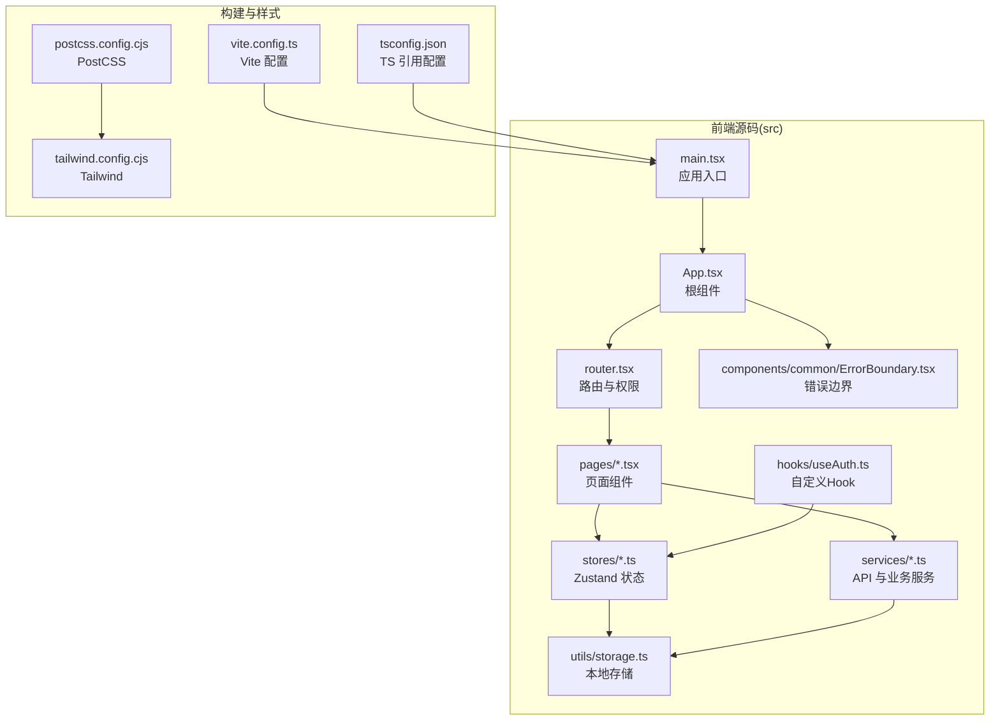
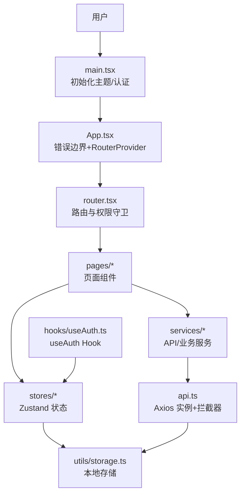
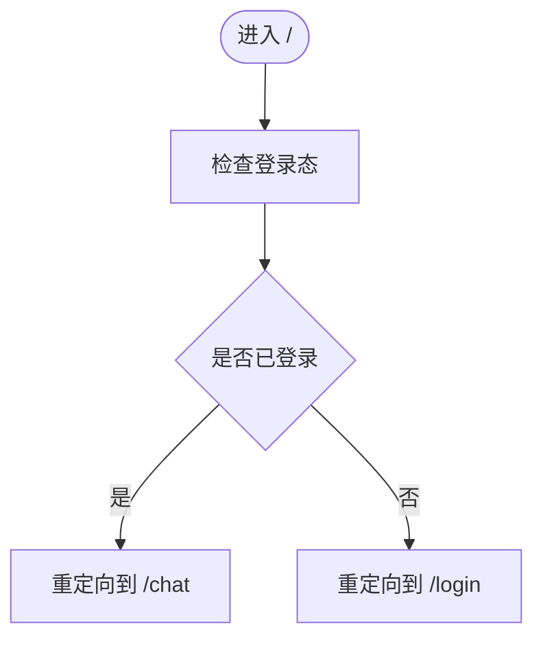
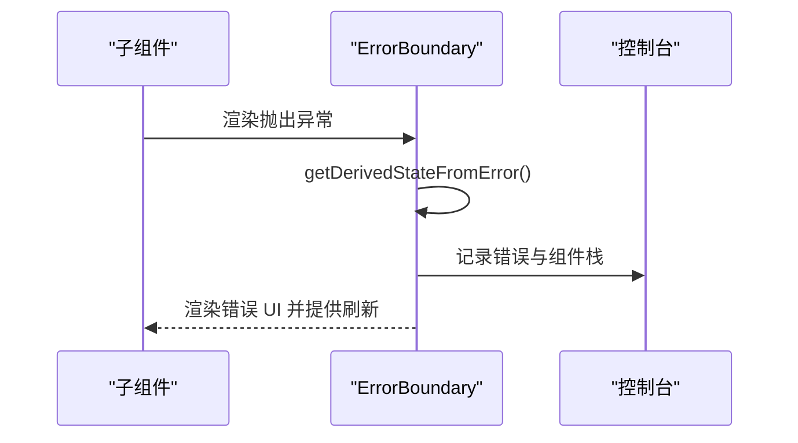
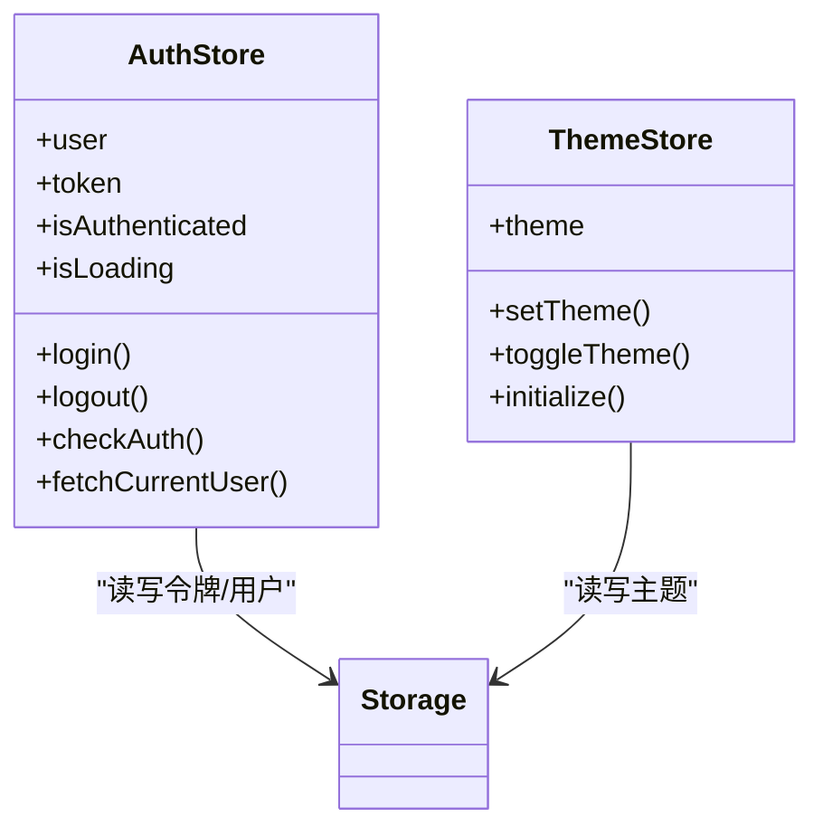
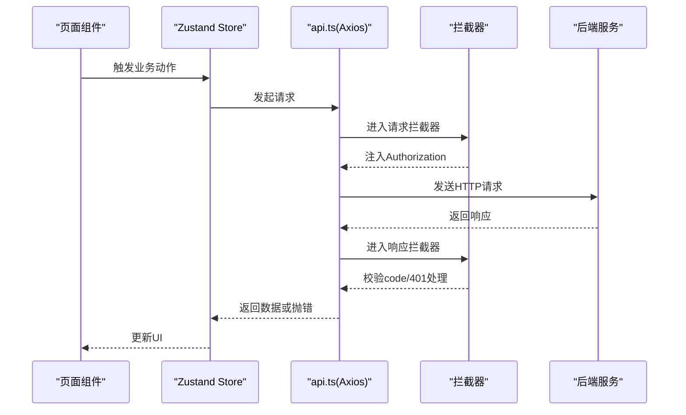
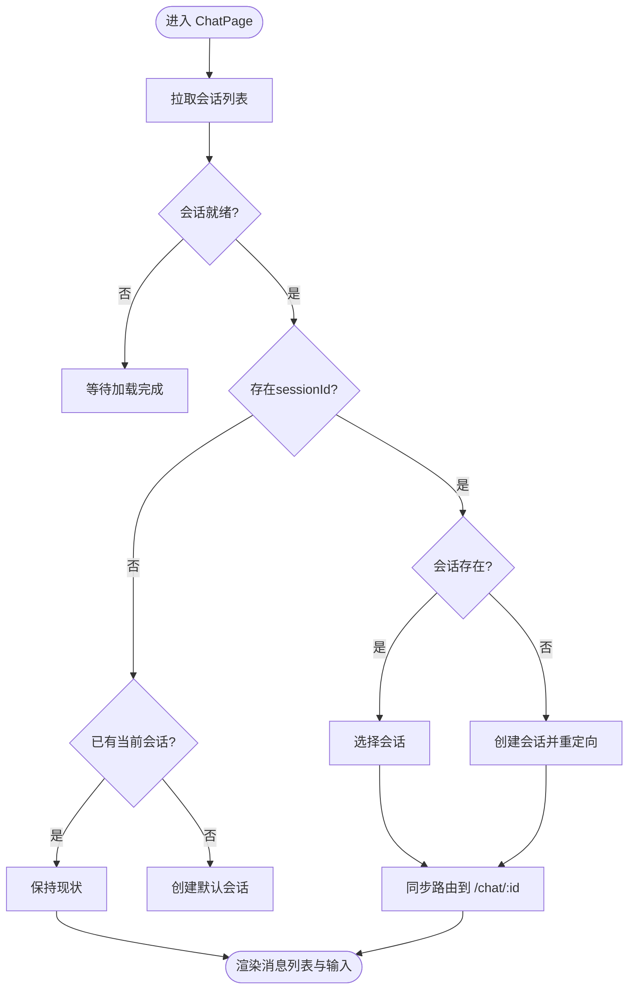
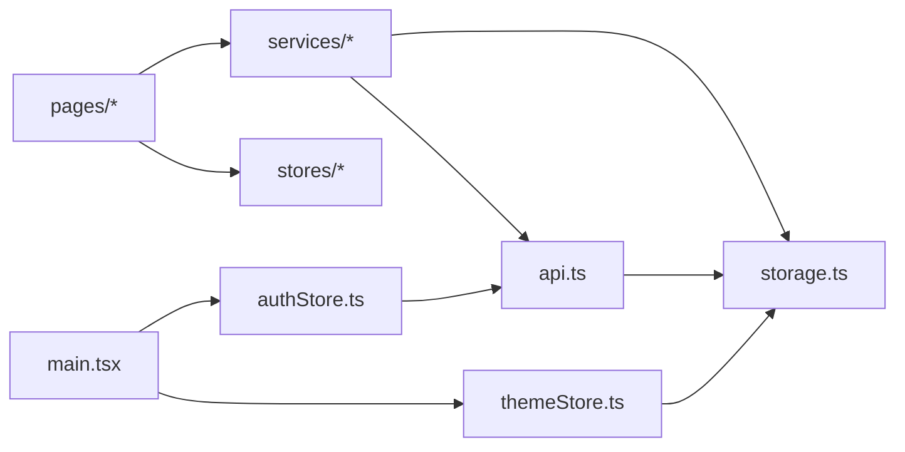

# 应用架构

<cite>
**本文引用的文件**
- [package.json](file://frontend/package.json)
- [vite.config.ts](file://frontend/vite.config.ts)
- [main.tsx](file://frontend/src/main.tsx)
- [App.tsx](file://frontend/src/App.tsx)
- [router.tsx](file://frontend/src/router.tsx)
- [ErrorBoundary.tsx](file://frontend/src/components/common/ErrorBoundary.tsx)
- [authStore.ts](file://frontend/src/stores/authStore.ts)
- [themeStore.ts](file://frontend/src/stores/themeStore.ts)
- [api.ts](file://frontend/src/services/api.ts)
- [storage.ts](file://frontend/src/utils/storage.ts)
- [ChatPage.tsx](file://frontend/src/pages/ChatPage.tsx)
- [useAuth.ts](file://frontend/src/hooks/useAuth.ts)
- [tsconfig.json](file://frontend/tsconfig.json)
- [postcss.config.cjs](file://frontend/postcss.config.cjs)
- [tailwind.config.cjs](file://frontend/tailwind.config.cjs)
</cite>

## 目录
1. [简介](#简介)
2. [项目结构](#项目结构)
3. [核心组件](#核心组件)
4. [架构总览](#架构总览)
5. [详细组件分析](#详细组件分析)
6. [依赖关系分析](#依赖关系分析)
7. [性能考虑](#性能考虑)
8. [故障排查指南](#故障排查指南)
9. [结论](#结论)
10. [附录](#附录)

## 简介
本文件面向 Seahorse Agent 前端应用，系统性梳理基于 React 18.3.1 + TypeScript 5.5.4 的架构设计与工程化实践。重点覆盖应用入口点、路由与权限控制、错误边界、状态管理、HTTP 通信、主题与本地存储、以及 Vite 5.5.4 的构建与开发配置。文档同时提供架构图示、调用时序与流程图，帮助开发者快速理解并扩展系统。

## 项目结构
前端位于 frontend 目录，采用“按功能域分层 + 组件化”的组织方式：
- src
  - components：可复用 UI 组件与业务通用组件（如 ErrorBoundary）
  - pages：页面级组件（含聊天页、登录页、管理员后台页等）
  - services：API 封装与业务服务（如认证、聊天、知识库等）
  - stores：状态管理（Zustand）（如认证、主题、聊天）
  - hooks：自定义 Hook（如 useAuth）
  - utils：工具函数（如本地存储）
  - styles：全局样式
  - types：类型定义
  - vite-env.d.ts：Vite 类型声明
  - router.tsx：路由与权限守卫
  - App.tsx：根组件
  - main.tsx：应用入口
- 构建与样式
  - vite.config.ts：Vite 配置（插件、别名、代理）
  - tsconfig.json：TS 多项目引用配置
  - postcss.config.cjs：PostCSS 配置
  - tailwind.config.cjs：Tailwind 配置

图表来源
- [main.tsx:1-17](file://frontend/src/main.tsx#L1-L17)
- [App.tsx:1-15](file://frontend/src/App.tsx#L1-L15)
- [router.tsx:1-163](file://frontend/src/router.tsx#L1-L163)
- [ErrorBoundary.tsx:1-46](file://frontend/src/components/common/ErrorBoundary.tsx#L1-L46)
- [vite.config.ts:1-23](file://frontend/vite.config.ts#L1-L23)
- [tsconfig.json:1-8](file://frontend/tsconfig.json#L1-L8)
- [postcss.config.cjs:1-7](file://frontend/postcss.config.cjs#L1-L7)
- [tailwind.config.cjs:1-83](file://frontend/tailwind.config.cjs#L1-L83)

章节来源
- [main.tsx:1-17](file://frontend/src/main.tsx#L1-L17)
- [router.tsx:1-163](file://frontend/src/router.tsx#L1-L163)
- [vite.config.ts:1-23](file://frontend/vite.config.ts#L1-L23)
- [tsconfig.json:1-8](file://frontend/tsconfig.json#L1-L8)
- [postcss.config.cjs:1-7](file://frontend/postcss.config.cjs#L1-L7)
- [tailwind.config.cjs:1-83](file://frontend/tailwind.config.cjs#L1-L83)

## 核心组件
- 应用入口与初始化
  - main.tsx：初始化主题与认证状态，挂载根组件
  - App.tsx：包裹错误边界与全局提示，提供 RouterProvider
  - router.tsx：集中式路由与权限守卫（RequireAuth、RequireAdmin、RedirectIfAuth、HomeRedirect）
- 错误边界
  - ErrorBoundary.tsx：捕获子树渲染异常，记录日志并提供刷新按钮
- 状态管理
  - authStore.ts：用户认证状态、登录/登出、当前用户拉取
  - themeStore.ts：主题切换与持久化
  - chatStore.ts：聊天会话、消息流、生成控制（由 ChatPage 使用）
- 通信与拦截器
  - api.ts：Axios 实例、请求/响应拦截器、统一鉴权头设置
  - storage.ts：本地存储封装（令牌、用户、主题）
- 页面与 Hook
  - ChatPage.tsx：聊天页生命周期与会话选择逻辑
  - useAuth.ts：导出 authStore 的便捷 Hook

章节来源
- [main.tsx:1-17](file://frontend/src/main.tsx#L1-L17)
- [App.tsx:1-15](file://frontend/src/App.tsx#L1-L15)
- [router.tsx:1-163](file://frontend/src/router.tsx#L1-L163)
- [ErrorBoundary.tsx:1-46](file://frontend/src/components/common/ErrorBoundary.tsx#L1-L46)
- [authStore.ts:1-116](file://frontend/src/stores/authStore.ts#L1-L116)
- [themeStore.ts:1-36](file://frontend/src/stores/themeStore.ts#L1-L36)
- [api.ts:1-66](file://frontend/src/services/api.ts#L1-L66)
- [storage.ts:1-67](file://frontend/src/utils/storage.ts#L1-L67)
- [ChatPage.tsx:1-103](file://frontend/src/pages/ChatPage.tsx#L1-L103)
- [useAuth.ts:1-6](file://frontend/src/hooks/useAuth.ts#L1-L6)

## 架构总览
应用采用“入口 -> 根组件 -> 路由 -> 页面 -> 服务/状态”的单向数据流。路由层负责鉴权与导航；页面通过状态管理与服务层完成业务交互；服务层通过 Axios 统一处理请求与响应；错误边界兜底异常；主题与本地存储贯穿全局。

图表来源
- [main.tsx:1-17](file://frontend/src/main.tsx#L1-L17)
- [App.tsx:1-15](file://frontend/src/App.tsx#L1-L15)
- [router.tsx:1-163](file://frontend/src/router.tsx#L1-L163)
- [ChatPage.tsx:1-103](file://frontend/src/pages/ChatPage.tsx#L1-L103)
- [api.ts:1-66](file://frontend/src/services/api.ts#L1-L66)
- [storage.ts:1-67](file://frontend/src/utils/storage.ts#L1-L67)
- [useAuth.ts:1-6](file://frontend/src/hooks/useAuth.ts#L1-L6)

## 详细组件分析

### 路由与权限控制
- 路由定义集中在 router.tsx，使用 createBrowserRouter 组织路径与嵌套路由
- 权限守卫
  - RequireAuth：未登录跳转登录
  - RequireAdmin：非管理员跳转聊天或拒绝访问
  - RedirectIfAuth：已登录用户禁止访问登录页
  - HomeRedirect：根据登录态重定向到 /chat 或 /login
- 典型页面
  - /chat 与 /chat/:sessionId：聊天页
  - /admin/*：管理员后台页集合（仪表盘、知识库、意图树、注入、追踪、设置、样例问题、映射、用户）

图表来源
- [router.tsx:54-57](file://frontend/src/router.tsx#L54-L57)

章节来源
- [router.tsx:1-163](file://frontend/src/router.tsx#L1-L163)

### 错误边界处理
- ErrorBoundary.tsx 捕获子树异常，记录错误并显示简要信息与刷新按钮
- App.tsx 将整个应用包裹在错误边界内，确保全局兜底

图表来源
- [ErrorBoundary.tsx:16-22](file://frontend/src/components/common/ErrorBoundary.tsx#L16-L22)
- [App.tsx:3-12](file://frontend/src/App.tsx#L3-L12)

章节来源
- [ErrorBoundary.tsx:1-46](file://frontend/src/components/common/ErrorBoundary.tsx#L1-L46)
- [App.tsx:1-15](file://frontend/src/App.tsx#L1-L15)

### 状态管理（Zustand）
- 认证状态（authStore）
  - 登录：写入令牌与用户信息，设置全局 Authorization 头，清理聊天状态，提示成功
  - 登出：调用后端登出接口（忽略网络异常），清理聊天状态与本地存储，设置未登录
  - 检查登录：从本地存储恢复令牌与用户，必要时拉取当前用户
- 主题状态（themeStore）
  - 初始化：读取本地存储主题并应用到 html 根元素
  - 切换：更新本地存储与 DOM 类名

图表来源
- [authStore.ts:13-22](file://frontend/src/stores/authStore.ts#L13-L22)
- [themeStore.ts:7-12](file://frontend/src/stores/themeStore.ts#L7-L12)
- [storage.ts:31-66](file://frontend/src/utils/storage.ts#L31-L66)

章节来源
- [authStore.ts:1-116](file://frontend/src/stores/authStore.ts#L1-L116)
- [themeStore.ts:1-36](file://frontend/src/stores/themeStore.ts#L1-L36)
- [storage.ts:1-67](file://frontend/src/utils/storage.ts#L1-L67)

### 通信与拦截器（Axios）
- 基础配置：baseURL 来自环境变量，超时 60 秒
- 请求拦截：自动附加 Authorization 头
- 响应拦截：
  - 统一校验后端返回结构，非“成功”状态统一弹出错误提示并抛错
  - 401 或“未登录”场景：清空本地认证信息并跳转登录
  - 网络错误：提示网络异常

图表来源
- [api.ts:21-65](file://frontend/src/services/api.ts#L21-L65)
- [authStore.ts:29-66](file://frontend/src/stores/authStore.ts#L29-L66)

章节来源
- [api.ts:1-66](file://frontend/src/services/api.ts#L1-L66)

### 聊天页生命周期与会话管理
- ChatPage.tsx 在挂载时拉取会话列表，根据 URL sessionId 选择或创建会话
- 当 currentSessionId 变化时同步路由，避免不一致
- 根据消息数量与加载状态决定是否展示欢迎屏与输入框

图表来源
- [ChatPage.tsx:30-79](file://frontend/src/pages/ChatPage.tsx#L30-L79)

章节来源
- [ChatPage.tsx:1-103](file://frontend/src/pages/ChatPage.tsx#L1-L103)

### 构建与开发配置（Vite 5.5.4）
- 插件与别名
  - @vitejs/plugin-react：React 18 支持
  - 路径别名 @ -> ./src，便于模块导入
- 开发服务器
  - 端口 5173
  - 代理 /api -> http://localhost:9090，便于联调后端
- 环境变量
  - 通过 import.meta.env.VITE_API_BASE_URL 设置后端基础地址
- TypeScript 与 PostCSS/Tailwind
  - TS 多项目引用配置
  - PostCSS 自动前缀与 Tailwind 扫描

章节来源
- [vite.config.ts:1-23](file://frontend/vite.config.ts#L1-L23)
- [package.json:1-70](file://frontend/package.json#L1-L70)
- [tsconfig.json:1-8](file://frontend/tsconfig.json#L1-L8)
- [postcss.config.cjs:1-7](file://frontend/postcss.config.cjs#L1-L7)
- [tailwind.config.cjs:1-83](file://frontend/tailwind.config.cjs#L1-L83)

## 依赖关系分析
- 组件耦合
  - 页面组件依赖状态管理与服务层，低耦合高内聚
  - 路由守卫依赖 authStore，实现无侵入的权限控制
- 外部依赖
  - React 18.3.1、React Router DOM 6、Zustand、Axios、TailwindCSS、Radix UI、Recharts 等
- 关键依赖链
  - main.tsx -> stores(auth/theme) -> services(api) -> utils(storage)

图表来源
- [main.tsx:1-17](file://frontend/src/main.tsx#L1-L17)
- [authStore.ts:1-116](file://frontend/src/stores/authStore.ts#L1-L116)
- [themeStore.ts:1-36](file://frontend/src/stores/themeStore.ts#L1-L36)
- [api.ts:1-66](file://frontend/src/services/api.ts#L1-L66)
- [storage.ts:1-67](file://frontend/src/utils/storage.ts#L1-L67)

章节来源
- [package.json:13-67](file://frontend/package.json#L13-L67)

## 性能考虑
- 代码分割与懒加载
  - 建议对大型页面与图表组件（如 SimpleLineChart）采用动态导入以减少首屏体积
- 路由级懒加载
  - 将路由组件通过 React.lazy 与 Suspense 包裹，结合 React Router v6 的懒加载能力
- 图表与虚拟滚动
  - 已引入 Recharts 与 react-virtuoso，建议在大数据表格/列表中启用虚拟化
- 缓存与去抖
  - 对频繁请求的接口（如会话列表）增加节流/去抖与本地缓存策略
- 构建优化
  - 合理拆分 vendor chunk，利用浏览器缓存
  - Tailwind 生产构建时配合 Purge/Tree-shaking 减少 CSS 体积

## 故障排查指南
- 登录后 401 或被重定向到登录页
  - 检查响应拦截器对 401 与“未登录”字符串的处理逻辑
  - 确认本地存储中的令牌是否正确写入与传递
- 接口请求失败但无提示
  - 检查响应拦截器对非“成功” code 的处理与 toast 提示
- 主题切换无效
  - 确认 themeStore.initialize 是否在 main.tsx 中执行
  - 检查 html 根元素类名是否正确添加/移除
- 聊天页会话不一致
  - 检查 ChatPage 的路由同步逻辑与会话选择流程

章节来源
- [api.ts:29-65](file://frontend/src/services/api.ts#L29-L65)
- [authStore.ts:68-93](file://frontend/src/stores/authStore.ts#L68-L93)
- [themeStore.ts:29-34](file://frontend/src/stores/themeStore.ts#L29-L34)
- [ChatPage.tsx:75-79](file://frontend/src/pages/ChatPage.tsx#L75-L79)

## 结论
该前端应用以 React 18 + TypeScript 为基础，结合 Zustand 实现轻量状态管理，通过 Axios 统一封装 HTTP 通信，并以 Vite 提供高效开发体验。路由层集中实现权限控制，错误边界保障稳定性。整体架构清晰、模块职责明确，具备良好的可维护性与扩展性。后续可在路由懒加载、虚拟滚动、构建优化等方面进一步提升性能与用户体验。

## 附录
- 环境变量
  - VITE_API_BASE_URL：后端基础地址
- 常用脚本
  - dev/build/preview/lint/format：开发、构建、预览与质量保证

章节来源
- [api.ts:6](file://frontend/src/services/api.ts#L6)
- [package.json:6-11](file://frontend/package.json#L6-L11)