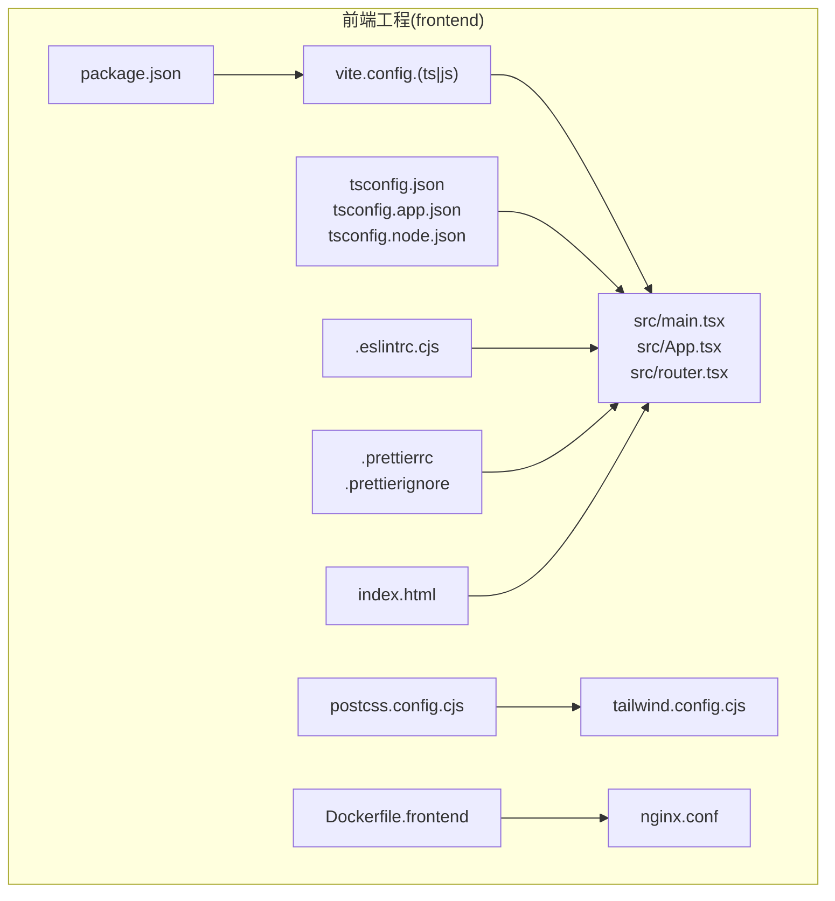
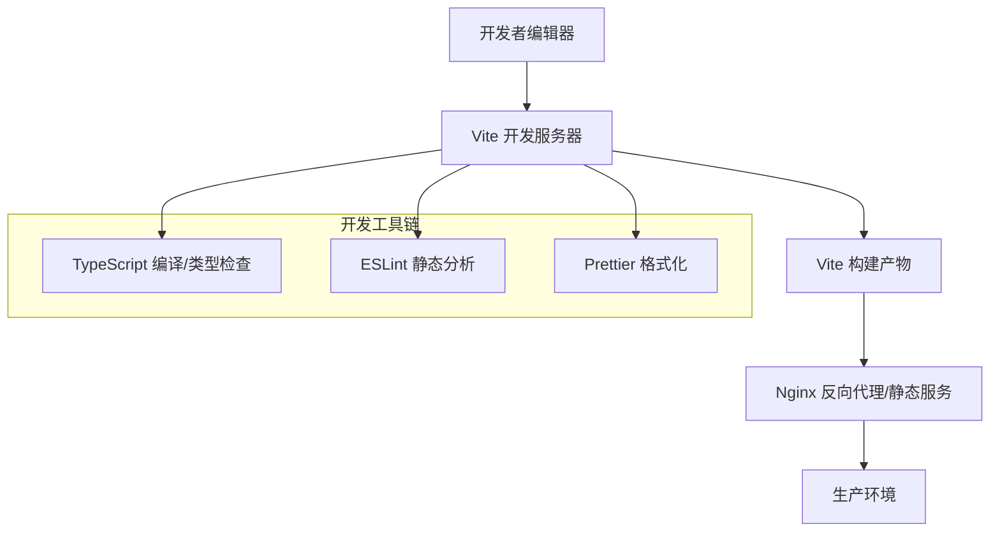
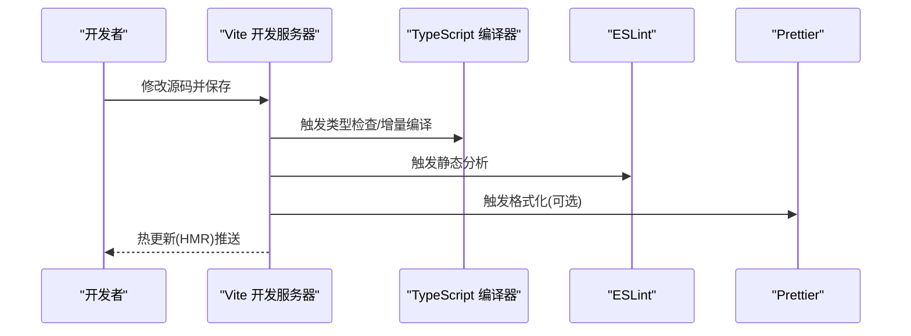
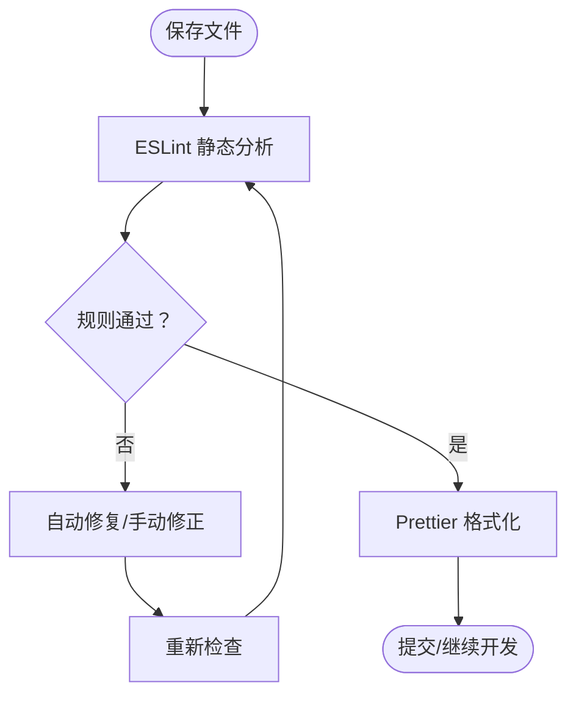
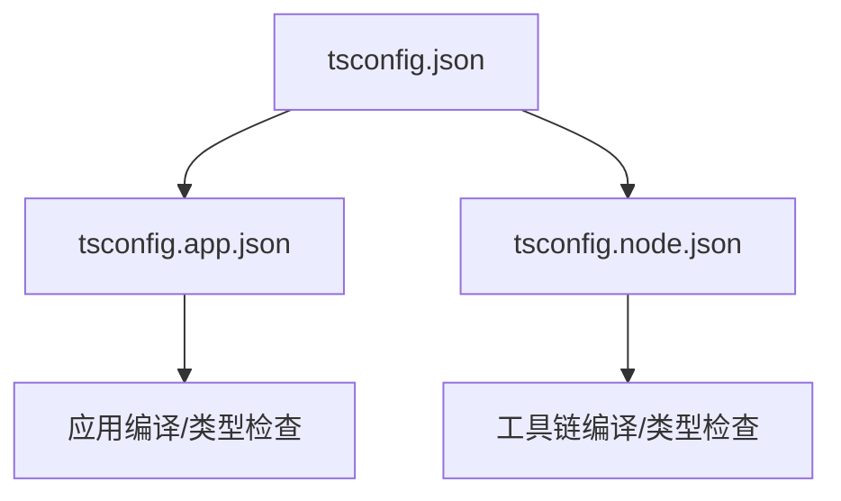
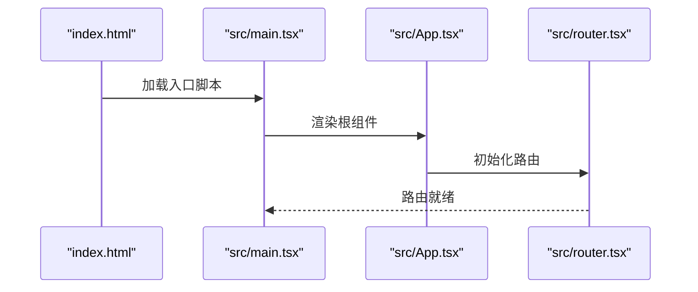
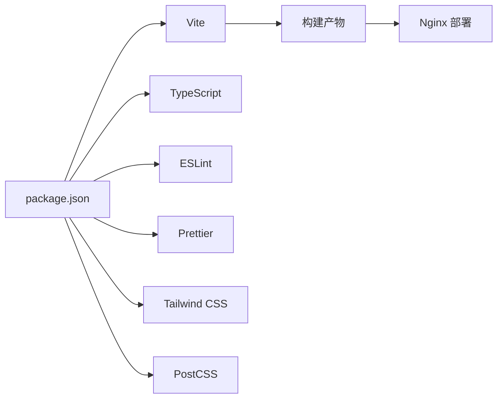

# 开发工作流

<cite>
**本文引用的文件**
- [package.json](file://frontend/package.json)
- [vite.config.ts](file://frontend/vite.config.ts)
- [vite.config.js](file://frontend/vite.config.js)
- [tsconfig.json](file://frontend/tsconfig.json)
- [tsconfig.app.json](file://frontend/tsconfig.app.json)
- [tsconfig.node.json](file://frontend/tsconfig.node.json)
- [.eslintrc.cjs](file://frontend/.eslintrc.cjs)
- [.prettierrc](file://frontend/.prettierrc)
- [.prettierignore](file://frontend/.prettierignore)
- [postcss.config.cjs](file://frontend/postcss.config.cjs)
- [tailwind.config.cjs](file://frontend/tailwind.config.cjs)
- [Dockerfile.frontend](file://frontend/Dockerfile.frontend)
- [nginx.conf](file://frontend/nginx.conf)
- [index.html](file://frontend/index.html)
- [src/main.tsx](file://frontend/src/main.tsx)
- [src/App.tsx](file://frontend/src/App.tsx)
- [src/router.tsx](file://frontend/src/router.tsx)
- [src/hooks/useAuth.ts](file://frontend/src/hooks/useAuth.ts)
- [src/services/api.ts](file://frontend/src/services/api.ts)
- [src/stores/authStore.ts](file://frontend/src/stores/authStore.ts)
- [src/utils/helpers.ts](file://frontend/src/utils/helpers.ts)
</cite>

## 目录
1. [简介](#简介)
2. [项目结构](#项目结构)
3. [核心组件](#核心组件)
4. [架构总览](#架构总览)
5. [详细组件分析](#详细组件分析)
6. [依赖关系分析](#依赖关系分析)
7. [性能考虑](#性能考虑)
8. [故障排查指南](#故障排查指南)
9. [结论](#结论)
10. [附录](#附录)

## 简介
本文件面向Seahorse Agent前端团队，提供基于Vite的完整开发工作流技术文档。内容涵盖开发环境配置、工具链（ESLint、Prettier、TypeScript）、代码质量保障流程、开发服务器与热重载、调试与性能分析、代码分割与打包优化策略，以及面向前端开发者的端到端配置与实践指南。

## 项目结构
前端工程位于仓库根目录下的frontend子目录中，采用Vite作为构建与开发工具，TypeScript提供类型安全，Tailwind CSS与PostCSS负责样式体系，配合ESLint与Prettier实现统一的代码风格与静态分析。

**图表来源**
- [package.json](file://frontend/package.json)
- [vite.config.ts](file://frontend/vite.config.ts)
- [tsconfig.json](file://frontend/tsconfig.json)
- [postcss.config.cjs](file://frontend/postcss.config.cjs)
- [tailwind.config.cjs](file://frontend/tailwind.config.cjs)
- [Dockerfile.frontend](file://frontend/Dockerfile.frontend)
- [nginx.conf](file://frontend/nginx.conf)
- [index.html](file://frontend/index.html)
- [src/main.tsx](file://frontend/src/main.tsx)

**章节来源**
- [package.json](file://frontend/package.json)
- [vite.config.ts](file://frontend/vite.config.ts)
- [tsconfig.json](file://frontend/tsconfig.json)
- [postcss.config.cjs](file://frontend/postcss.config.cjs)
- [tailwind.config.cjs](file://frontend/tailwind.config.cjs)
- [Dockerfile.frontend](file://frontend/Dockerfile.frontend)
- [nginx.conf](file://frontend/nginx.conf)
- [index.html](file://frontend/index.html)
- [src/main.tsx](file://frontend/src/main.tsx)

## 核心组件
- Vite开发服务器与构建管线：提供快速冷启动、按需编译与热重载能力；支持插件生态与自定义配置。
- TypeScript类型系统：通过多份tsconfig分层管理应用与Node工具链的编译目标与严格度。
- ESLint静态分析：统一规则集，集成编辑器与CI，确保代码一致性与可维护性。
- Prettier格式化：自动格式化，减少代码风格分歧，提升协作效率。
- Tailwind CSS + PostCSS：原子化样式与工具类，结合插件扩展能力，兼顾灵活性与可维护性。
- 容器化与反向代理：Dockerfile.frontend用于构建镜像，nginx.conf提供生产级静态资源服务与路由转发。

**章节来源**
- [package.json](file://frontend/package.json)
- [vite.config.ts](file://frontend/vite.config.ts)
- [tsconfig.json](file://frontend/tsconfig.json)
- [tsconfig.app.json](file://frontend/tsconfig.app.json)
- [tsconfig.node.json](file://frontend/tsconfig.node.json)
- [.eslintrc.cjs](file://frontend/.eslintrc.cjs)
- [.prettierrc](file://frontend/.prettierrc)
- [postcss.config.cjs](file://frontend/postcss.config.cjs)
- [tailwind.config.cjs](file://frontend/tailwind.config.cjs)
- [Dockerfile.frontend](file://frontend/Dockerfile.frontend)
- [nginx.conf](file://frontend/nginx.conf)

## 架构总览
下图展示了从开发到生产的典型路径：本地开发由Vite驱动，TypeScript进行类型检查，ESLint/Prettier保障质量，构建产物交由Nginx提供静态服务，容器化部署通过Dockerfile.frontend完成。

**图表来源**
- [vite.config.ts](file://frontend/vite.config.ts)
- [tsconfig.json](file://frontend/tsconfig.json)
- [.eslintrc.cjs](file://frontend/.eslintrc.cjs)
- [.prettierrc](file://frontend/.prettierrc)
- [nginx.conf](file://frontend/nginx.conf)

## 详细组件分析

### Vite开发环境与工具链
- 开发服务器与热重载：通过Vite提供的内置开发服务器实现模块热替换与实时刷新，提升迭代效率。
- 插件生态：利用官方与社区插件扩展功能，如预处理器、别名映射、环境变量注入等。
- 构建优化：启用代码分割、Tree Shaking、压缩与资源内联策略，平衡包体大小与加载性能。
- 路径别名与环境变量：在配置中集中管理路径别名与环境变量，便于跨平台与多环境复用。

**图表来源**
- [vite.config.ts](file://frontend/vite.config.ts)
- [tsconfig.json](file://frontend/tsconfig.json)
- [.eslintrc.cjs](file://frontend/.eslintrc.cjs)
- [.prettierrc](file://frontend/.prettierrc)

**章节来源**
- [vite.config.ts](file://frontend/vite.config.ts)
- [vite.config.js](file://frontend/vite.config.js)
- [package.json](file://frontend/package.json)

### ESLint与Prettier配置与使用规范
- ESLint规则集：通过.eslintrc.cjs集中定义规则、插件与解析器选项，覆盖React、TypeScript、import顺序、JSX语法糖等场景。
- Prettier格式化：通过.prettierrc与.prettierignore统一缩进、引号、换行等格式细节，并排除不需要格式化的文件。
- 编辑器集成：推荐在VS Code中安装ESLint与Prettier插件，开启保存时自动修复与格式化。
- CI集成：在流水线中添加lint与format检查步骤，失败即阻断合并，确保代码质量门槛。

**图表来源**
- [.eslintrc.cjs](file://frontend/.eslintrc.cjs)
- [.prettierrc](file://frontend/.prettierrc)
- [.prettierignore](file://frontend/.prettierignore)

**章节来源**
- [.eslintrc.cjs](file://frontend/.eslintrc.cjs)
- [.prettierrc](file://frontend/.prettierrc)
- [.prettierignore](file://frontend/.prettierignore)

### TypeScript配置与类型检查策略
- 多份tsconfig分层：
  - tsconfig.json：工作区根配置，定义基础编译选项与包含/排除规则。
  - tsconfig.app.json：应用侧编译配置，约束应用代码的严格度与目标环境。
  - tsconfig.node.json：Node工具链或脚本侧编译配置，隔离不同运行时的类型需求。
- 类型检查策略：在开发阶段启用严格模式，结合noUncheckedIndexedAccess、strictNullChecks等规则，降低运行时风险。
- 类型声明：在src/types与src/vite-env.d.ts中集中管理全局类型与模块声明，避免重复定义。

**图表来源**
- [tsconfig.json](file://frontend/tsconfig.json)
- [tsconfig.app.json](file://frontend/tsconfig.app.json)
- [tsconfig.node.json](file://frontend/tsconfig.node.json)

**章节来源**
- [tsconfig.json](file://frontend/tsconfig.json)
- [tsconfig.app.json](file://frontend/tsconfig.app.json)
- [tsconfig.node.json](file://frontend/tsconfig.node.json)

### 代码格式化、静态分析与质量保证流程
- 提交流程建议：
  - 本地：保存前触发Prettier格式化与ESLint修复。
  - 提交前：运行类型检查与单元测试，确保无错误。
  - CI：执行lint、format、type check与测试，失败则阻断。
- 工具链协同：Vite在开发时可联动ESLint与Prettier，形成“边改边查”的反馈闭环。

**章节来源**
- [.eslintrc.cjs](file://frontend/.eslintrc.cjs)
- [.prettierrc](file://frontend/.prettierrc)
- [tsconfig.json](file://frontend/tsconfig.json)

### 开发服务器配置与热重载机制
- 入口文件：index.html作为应用入口，引入src/main.tsx挂载根组件App与路由。
- 应用挂载：src/main.tsx负责渲染根组件与Provider上下文，router.tsx定义页面路由。
- 热重载：Vite通过模块系统与HMR协议实现组件与样式的局部刷新，无需整页刷新。

**图表来源**
- [index.html](file://frontend/index.html)
- [src/main.tsx](file://frontend/src/main.tsx)
- [src/App.tsx](file://frontend/src/App.tsx)
- [src/router.tsx](file://frontend/src/router.tsx)

**章节来源**
- [index.html](file://frontend/index.html)
- [src/main.tsx](file://frontend/src/main.tsx)
- [src/App.tsx](file://frontend/src/App.tsx)
- [src/router.tsx](file://frontend/src/router.tsx)

### 调试工具与性能分析方法
- 浏览器开发者工具：用于DOM检查、网络请求追踪、性能面板分析与内存快照。
- Vite Devtools：在浏览器中启用Vite Devtools以观察模块依赖与HMR状态。
- 性能分析：结合Performance面板测量首屏时间、交互延迟与长任务；Network面板识别慢请求与未缓存资源。
- 慢查询定位：对大型列表、复杂计算与频繁重渲染的组件进行拆分与memo化。

[本节为通用指导，不直接分析具体文件，故无章节来源]

### 代码分割与打包优化策略
- 动态导入：对非首屏依赖的页面或组件使用动态导入，实现按需加载。
- 路由级分割：在路由层面进行代码分割，减少初始包体积。
- 第三方库：区分业务代码与vendor库，启用外部化与CDN策略（如适用）。
- 资源优化：启用Gzip/Brotli压缩、图片与字体优化、CSS提取与最小化。
- 构建产物分析：使用webpack-bundle-analyzer或Vite的可视化工具分析包体构成，持续优化。

[本节为通用指导，不直接分析具体文件，故无章节来源]

## 依赖关系分析
- 包管理：通过package.json声明依赖与脚本命令，统一版本与安装流程。
- 构建依赖：Vite、TypeScript、ESLint、Prettier、Tailwind CSS、PostCSS等共同构成工具链。
- 运行时依赖：React、路由库、状态管理与HTTP客户端等运行时库。

**图表来源**
- [package.json](file://frontend/package.json)
- [vite.config.ts](file://frontend/vite.config.ts)
- [tsconfig.json](file://frontend/tsconfig.json)
- [postcss.config.cjs](file://frontend/postcss.config.cjs)
- [tailwind.config.cjs](file://frontend/tailwind.config.cjs)

**章节来源**
- [package.json](file://frontend/package.json)

## 性能考虑
- 首屏优化：减少首屏JS体积，延迟加载非关键资源；合理拆分路由与组件。
- 缓存策略：静态资源配置强缓存与版本化；HTML与动态接口区分缓存策略。
- 网络优化：启用压缩、合并请求、避免重复渲染导致的无效请求。
- 监控与回退：在生产环境埋点关键指标，异常时提供降级策略与错误边界。

[本节为通用指导，不直接分析具体文件，故无章节来源]

## 故障排查指南
- 类型错误：优先解决类型检查报错，必要时使用类型断言或重构数据流。
- ESLint冲突：根据规则提示逐项修复，必要时在规则层面做局部放宽并补充注释。
- 格式化差异：统一团队使用的Prettier配置，避免因编辑器差异导致的格式漂移。
- 热重载失效：检查Vite配置与模块导出是否符合约定，确认HMR相关插件启用。
- 构建失败：核对tsconfig与vite.config中的路径别名与环境变量，清理缓存后重试。

**章节来源**
- [.eslintrc.cjs](file://frontend/.eslintrc.cjs)
- [.prettierrc](file://frontend/.prettierrc)
- [tsconfig.json](file://frontend/tsconfig.json)
- [vite.config.ts](file://frontend/vite.config.ts)

## 结论
通过Vite、TypeScript、ESLint、Prettier与Tailwind CSS/PostCSS的组合，Seahorse Agent前端实现了高效、可维护且可扩展的开发工作流。遵循本文档的配置与流程建议，可在保证质量的前提下加速迭代，并为后续的性能优化与规模化团队协作奠定坚实基础。

## 附录
- 容器化与部署：使用Dockerfile.frontend构建镜像，nginx.conf提供静态资源服务与反向代理配置。
- 关键入口与上下文：index.html、src/main.tsx、src/App.tsx、src/router.tsx构成应用骨架；src/hooks、src/services、src/stores、src/utils提供横切关注点与业务支撑。

**章节来源**
- [Dockerfile.frontend](file://frontend/Dockerfile.frontend)
- [nginx.conf](file://frontend/nginx.conf)
- [index.html](file://frontend/index.html)
- [src/main.tsx](file://frontend/src/main.tsx)
- [src/App.tsx](file://frontend/src/App.tsx)
- [src/router.tsx](file://frontend/src/router.tsx)
- [src/hooks/useAuth.ts](file://frontend/src/hooks/useAuth.ts)
- [src/services/api.ts](file://frontend/src/services/api.ts)
- [src/stores/authStore.ts](file://frontend/src/stores/authStore.ts)
- [src/utils/helpers.ts](file://frontend/src/utils/helpers.ts)