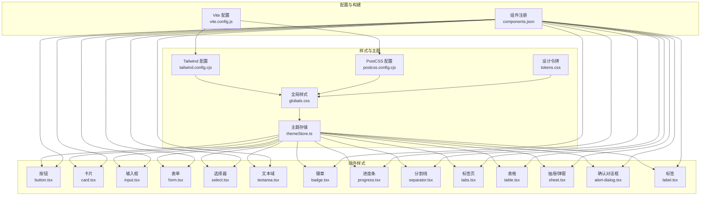
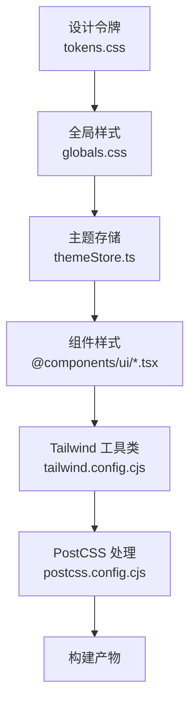
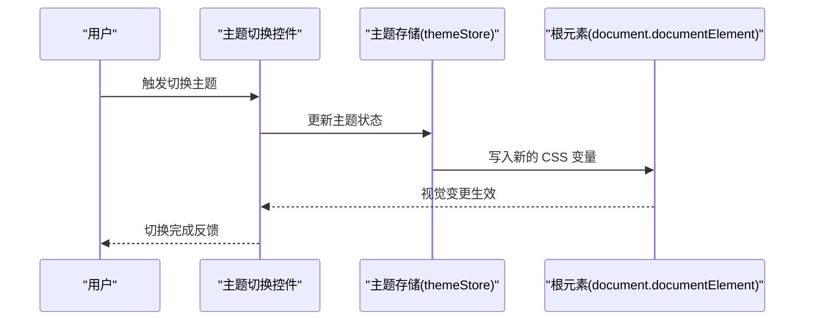
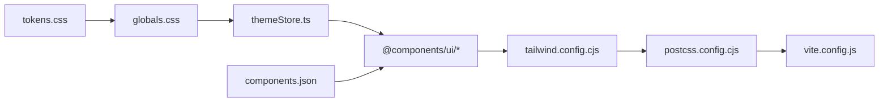

# 样式系统与主题

<cite>
**本文引用的文件**
- [tailwind.config.cjs](file://frontend/tailwind.config.cjs)
- [postcss.config.cjs](file://frontend/postcss.config.cjs)
- [globals.css](file://frontend/src/styles/globals.css)
- [tokens.css](file://frontend/src/styles/tokens.css)
- [themeStore.ts](file://frontend/src/stores/themeStore.ts)
- [button.tsx](file://frontend/@components/ui/button.tsx)
- [card.tsx](file://frontend/@components/ui/card.tsx)
- [input.tsx](file://frontend/@components/ui/input.tsx)
- [form.tsx](file://frontend/@components/ui/form.tsx)
- [select.tsx](file://frontend/@components/ui/select.tsx)
- [textarea.tsx](file://frontend/@components/ui/textarea.tsx)
- [badge.tsx](file://frontend/@components/ui/badge.tsx)
- [progress.tsx](file://frontend/@components/ui/progress.tsx)
- [separator.tsx](file://frontend/@components/ui/separator.tsx)
- [tabs.tsx](file://frontend/@components/ui/tabs.tsx)
- [table.tsx](file://frontend/@components/ui/table.tsx)
- [sheet.tsx](file://frontend/@components/ui/sheet.tsx)
- [alert-dialog.tsx](file://frontend/@components/ui/alert-dialog.tsx)
- [label.tsx](file://frontend/@components/ui/label.tsx)
- [components.json](file://frontend/components.json)
- [vite.config.js](file://frontend/vite.config.js)
</cite>

## 目录
1. [简介](#简介)
2. [项目结构](#项目结构)
3. [核心组件](#核心组件)
4. [架构总览](#架构总览)
5. [详细组件分析](#详细组件分析)
6. [依赖关系分析](#依赖关系分析)
7. [性能考虑](#性能考虑)
8. [故障排除指南](#故障排除指南)
9. [结论](#结论)
10. [附录](#附录)

## 简介
本文件面向样式开发者与前端工程师，系统性梳理 Seahorse Agent 的样式系统与主题定制方案。该系统以 Tailwind CSS 为核心构建样式层，并结合 Radix UI 提供语义化、可访问性的交互组件；通过 CSS 变量与设计令牌（Design Tokens）统一颜色与层级体系；借助状态存储实现主题切换（明暗模式），并提供响应式与移动端适配策略。文档同时给出组件样式定制规范、动画与过渡实现建议，以及最佳实践与排障指引。

## 项目结构
前端样式相关的关键文件分布如下：
- Tailwind 配置：用于扩展 Tailwind 工具集、引入插件与自定义分组
- PostCSS 配置：用于处理 CSS 转换与优化
- 全局样式：应用基础样式与根元素主题注入
- 设计令牌：集中管理颜色、尺寸、字体等设计变量
- 主题存储：提供主题状态管理与切换逻辑
- 组件样式：基于 Radix UI 的原子化组件封装，遵循 Tailwind 类名约定
- 组件注册：UI 组件库的组件别名与变体映射

图表来源
- [tailwind.config.cjs](file://frontend/tailwind.config.cjs)
- [postcss.config.cjs](file://frontend/postcss.config.cjs)
- [globals.css](file://frontend/src/styles/globals.css)
- [tokens.css](file://frontend/src/styles/tokens.css)
- [themeStore.ts](file://frontend/src/stores/themeStore.ts)
- [button.tsx](file://frontend/@components/ui/button.tsx)
- [card.tsx](file://frontend/@components/ui/card.tsx)
- [input.tsx](file://frontend/@components/ui/input.tsx)
- [form.tsx](file://frontend/@components/ui/form.tsx)
- [select.tsx](file://frontend/@components/ui/select.tsx)
- [textarea.tsx](file://frontend/@components/ui/textarea.tsx)
- [badge.tsx](file://frontend/@components/ui/badge.tsx)
- [progress.tsx](file://frontend/@components/ui/progress.tsx)
- [separator.tsx](file://frontend/@components/ui/separator.tsx)
- [tabs.tsx](file://frontend/@components/ui/tabs.tsx)
- [table.tsx](file://frontend/@components/ui/table.tsx)
- [sheet.tsx](file://frontend/@components/ui/sheet.tsx)
- [alert-dialog.tsx](file://frontend/@components/ui/alert-dialog.tsx)
- [label.tsx](file://frontend/@components/ui/label.tsx)
- [components.json](file://frontend/components.json)
- [vite.config.js](file://frontend/vite.config.js)

章节来源
- [tailwind.config.cjs](file://frontend/tailwind.config.cjs)
- [postcss.config.cjs](file://frontend/postcss.config.cjs)
- [globals.css](file://frontend/src/styles/globals.css)
- [tokens.css](file://frontend/src/styles/tokens.css)
- [themeStore.ts](file://frontend/src/stores/themeStore.ts)
- [components.json](file://frontend/components.json)
- [vite.config.js](file://frontend/vite.config.js)

## 核心组件
- Tailwind 配置：定义工具类扩展、插件引入与分组规则，确保样式生成的一致性与可维护性
- PostCSS 配置：负责 CSS 转换与优化流程
- 全局样式：在根元素注入主题变量与基础样式，保证组件继承与一致性
- 设计令牌：集中管理颜色、间距、字号、阴影、圆角等设计变量
- 主题存储：提供主题状态与切换逻辑，支持明/暗模式自动检测与手动切换
- 组件样式：基于 Radix UI 的组件封装，统一使用 Tailwind 类名，保持视觉与交互一致

章节来源
- [tailwind.config.cjs](file://frontend/tailwind.config.cjs)
- [postcss.config.cjs](file://frontend/postcss.config.cjs)
- [globals.css](file://frontend/src/styles/globals.css)
- [tokens.css](file://frontend/src/styles/tokens.css)
- [themeStore.ts](file://frontend/src/stores/themeStore.ts)

## 架构总览
样式系统采用“设计令牌 → Tailwind 工具类 → 组件封装”的三层架构：
- 设计令牌层：集中定义颜色、尺寸、字体等变量，避免硬编码
- Tailwind 层：通过配置扩展工具类，提供原子化样式能力
- 组件层：基于 Radix UI 与 Tailwind 类名组合，形成可复用的 UI 组件

图表来源
- [tokens.css](file://frontend/src/styles/tokens.css)
- [globals.css](file://frontend/src/styles/globals.css)
- [themeStore.ts](file://frontend/src/stores/themeStore.ts)
- [tailwind.config.cjs](file://frontend/tailwind.config.cjs)
- [postcss.config.cjs](file://frontend/postcss.config.cjs)

## 详细组件分析

### Tailwind 配置与自定义样式类
- 扩展工具集：通过配置扩展 Tailwind 工具集，确保颜色、间距、阴影等变量可被工具类直接使用
- 插件引入：引入必要的 PostCSS 插件，如自动前缀、压缩等
- 分组规则：按功能模块分组工具类，提升可读性与查找效率
- 自定义分组：为常用组件变体（如按钮、卡片）建立统一的类名前缀与命名规范

章节来源
- [tailwind.config.cjs](file://frontend/tailwind.config.cjs)

### PostCSS 配置
- 处理链路：定义 PostCSS 处理链，确保 CSS 在构建时完成转换与优化
- 插件生态：根据项目需求启用插件，如自动前缀、CSS 压缩、CSS 模块化等
- 输出控制：控制输出格式与兼容性，保证在目标浏览器中的表现一致

章节来源
- [postcss.config.cjs](file://frontend/postcss.config.cjs)

### 全局样式与根元素主题注入
- 根元素变量：在根元素注入主题相关的 CSS 变量，使子组件可继承
- 基础样式：重置默认样式、设置基础排版与交互态
- 主题注入：根据当前主题状态动态更新根元素的变量值

章节来源
- [globals.css](file://frontend/src/styles/globals.css)

### 设计令牌与颜色系统
- 颜色令牌：集中管理主色、强调色、背景色、边框色、文本色等
- 功能色：区分成功、警告、错误、信息等语义化颜色
- 层级与阴影：统一阴影、圆角、间距等设计变量
- 字体与字号：统一字体族、字号、字重、行高

章节来源
- [tokens.css](file://frontend/src/styles/tokens.css)

### 主题系统与明/暗模式切换
- 主题状态：通过主题存储管理当前主题（明/暗）
- 自动检测：优先使用系统偏好，其次回退到默认主题
- 手动切换：提供 UI 控件或快捷键进行主题切换
- 根元素同步：切换时更新根元素的 CSS 变量，驱动全局样式变化

图表来源
- [themeStore.ts](file://frontend/src/stores/themeStore.ts)
- [globals.css](file://frontend/src/styles/globals.css)

章节来源
- [themeStore.ts](file://frontend/src/stores/themeStore.ts)
- [globals.css](file://frontend/src/styles/globals.css)

### 响应式设计与移动端适配
- 断点策略：基于 Tailwind 默认断点或自定义断点，覆盖移动端、平板、桌面等设备
- 移动优先：从最小屏幕开始设计，逐步增强到大屏
- 交互适配：针对触摸设备优化点击区域、滚动行为与手势交互
- 性能优化：在小屏设备上减少复杂动画与重绘，提升流畅度

章节来源
- [tailwind.config.cjs](file://frontend/tailwind.config.cjs)

### 组件样式定制方案与最佳实践
- 统一入口：所有组件样式通过 Tailwind 类名组合，避免内联样式
- 变体规范：为常见变体（如尺寸、状态、颜色）建立统一的类名前缀
- 可组合性：通过类名组合实现复杂样式，避免过度封装
- 可访问性：遵循 Radix UI 的可访问性约定，确保键盘导航与屏幕阅读器友好
- 可测试性：为关键组件提供稳定的类名标识，便于自动化测试

章节来源
- [button.tsx](file://frontend/@components/ui/button.tsx)
- [card.tsx](file://frontend/@components/ui/card.tsx)
- [input.tsx](file://frontend/@components/ui/input.tsx)
- [form.tsx](file://frontend/@components/ui/form.tsx)
- [select.tsx](file://frontend/@components/ui/select.tsx)
- [textarea.tsx](file://frontend/@components/ui/textarea.tsx)
- [badge.tsx](file://frontend/@components/ui/badge.tsx)
- [progress.tsx](file://frontend/@components/ui/progress.tsx)
- [separator.tsx](file://frontend/@components/ui/separator.tsx)
- [tabs.tsx](file://frontend/@components/ui/tabs.tsx)
- [table.tsx](file://frontend/@components/ui/table.tsx)
- [sheet.tsx](file://frontend/@components/ui/sheet.tsx)
- [alert-dialog.tsx](file://frontend/@components/ui/alert-dialog.tsx)
- [label.tsx](file://frontend/@components/ui/label.tsx)

### 动画与过渡效果实现
- 进度指示：使用进度条组件展示加载状态，配合过渡动画提升感知
- 抽屉与弹窗：通过抽屉/弹窗组件实现模态交互，注意动画与焦点管理
- 标签页切换：使用标签页组件实现内容切换，确保动画流畅且无障碍
- 表单反馈：在表单组件中加入状态反馈与过渡，提升用户体验

章节来源
- [progress.tsx](file://frontend/@components/ui/progress.tsx)
- [sheet.tsx](file://frontend/@components/ui/sheet.tsx)
- [alert-dialog.tsx](file://frontend/@components/ui/alert-dialog.tsx)
- [tabs.tsx](file://frontend/@components/ui/tabs.tsx)
- [form.tsx](file://frontend/@components/ui/form.tsx)

## 依赖关系分析
样式系统各模块之间的依赖关系如下：
- Tailwind 配置依赖 PostCSS 配置与构建工具
- 全局样式依赖设计令牌与主题存储
- 组件样式依赖全局样式与 Tailwind 工具类
- 主题存储依赖根元素变量与组件状态

图表来源
- [tailwind.config.cjs](file://frontend/tailwind.config.cjs)
- [postcss.config.cjs](file://frontend/postcss.config.cjs)
- [vite.config.js](file://frontend/vite.config.js)
- [tokens.css](file://frontend/src/styles/tokens.css)
- [globals.css](file://frontend/src/styles/globals.css)
- [themeStore.ts](file://frontend/src/stores/themeStore.ts)
- [components.json](file://frontend/components.json)

章节来源
- [tailwind.config.cjs](file://frontend/tailwind.config.cjs)
- [postcss.config.cjs](file://frontend/postcss.config.cjs)
- [vite.config.js](file://frontend/vite.config.js)
- [tokens.css](file://frontend/src/styles/tokens.css)
- [globals.css](file://frontend/src/styles/globals.css)
- [themeStore.ts](file://frontend/src/stores/themeStore.ts)
- [components.json](file://frontend/components.json)

## 性能考虑
- 原子化优先：使用 Tailwind 原子类减少自定义 CSS 数量，降低包体积
- 按需引入：仅引入必要的 Tailwind 工具类与插件，避免无用代码
- 变量复用：通过设计令牌集中管理变量，减少重复定义
- 动画优化：在移动端谨慎使用复杂动画，优先使用 transform 与 opacity
- 渲染优化：避免在组件中频繁计算样式，尽量使用预设类名

## 故障排除指南
- 样式不生效
  - 检查 Tailwind 配置是否正确引入与扫描路径
  - 确认 PostCSS 配置未拦截或修改关键属性
  - 校验全局样式是否正确注入根元素变量
- 主题切换异常
  - 确认主题存储状态更新逻辑正常
  - 检查根元素变量是否随主题切换而更新
  - 验证组件是否正确读取全局样式变量
- 组件样式错乱
  - 检查组件类名拼接是否符合规范
  - 确认组件注册映射是否正确
  - 校验设计令牌是否与组件变量对应

章节来源
- [tailwind.config.cjs](file://frontend/tailwind.config.cjs)
- [postcss.config.cjs](file://frontend/postcss.config.cjs)
- [globals.css](file://frontend/src/styles/globals.css)
- [themeStore.ts](file://frontend/src/stores/themeStore.ts)
- [components.json](file://frontend/components.json)

## 结论
Seahorse Agent 的样式系统以 Tailwind 与 Radix UI 为基础，通过设计令牌与主题存储实现统一的颜色与层级体系，并提供明/暗模式切换与响应式适配。组件层采用原子化类名组合，兼顾可访问性与可维护性。遵循本文档的定制规范与最佳实践，可高效扩展与维护样式系统，满足复杂业务场景下的设计一致性与用户体验要求。

## 附录
- 组件注册映射：通过组件注册文件统一管理组件别名与变体映射，便于团队协作与一致性维护
- 构建配置：确保 Tailwind 与 PostCSS 在构建流程中正确执行，避免样式丢失或编译错误

章节来源
- [components.json](file://frontend/components.json)
- [vite.config.js](file://frontend/vite.config.js)