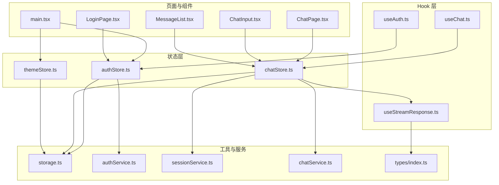
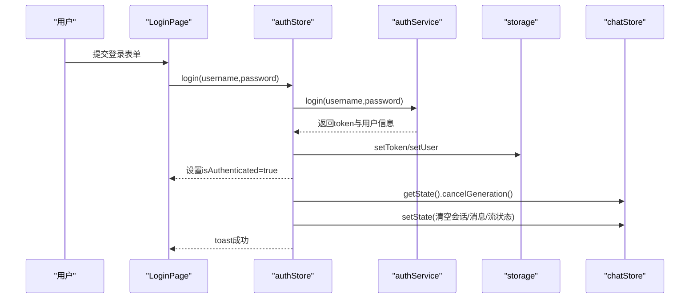
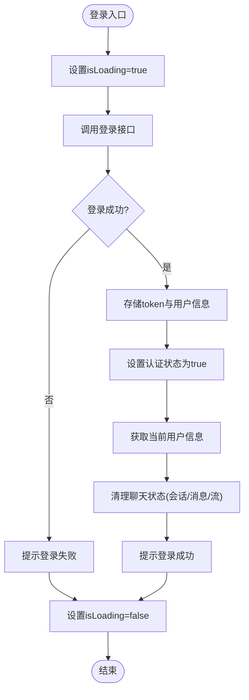
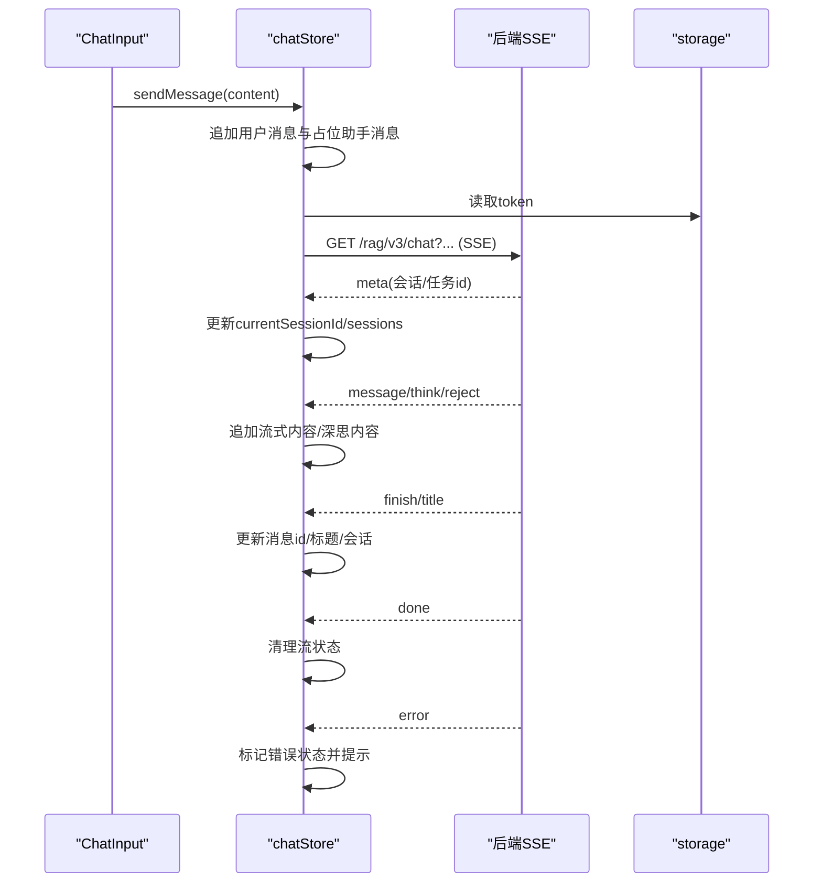
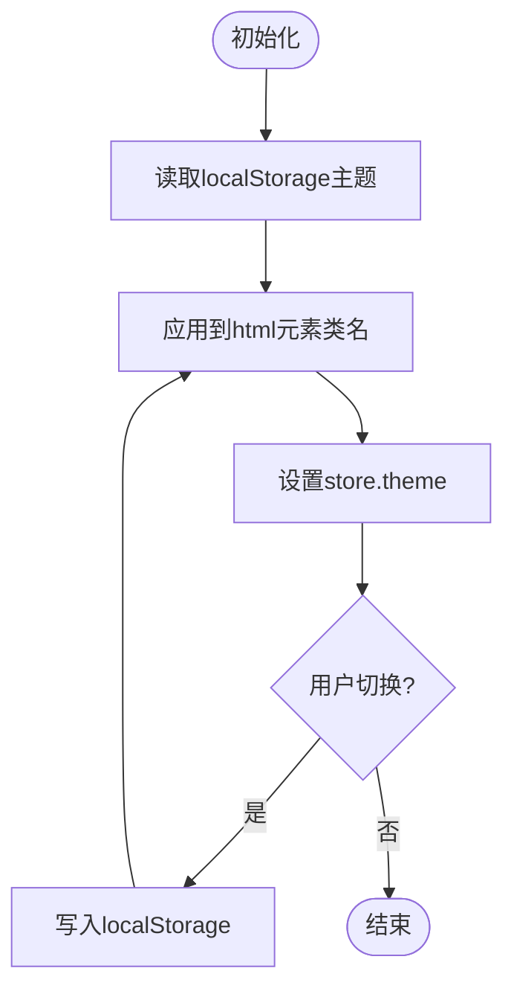
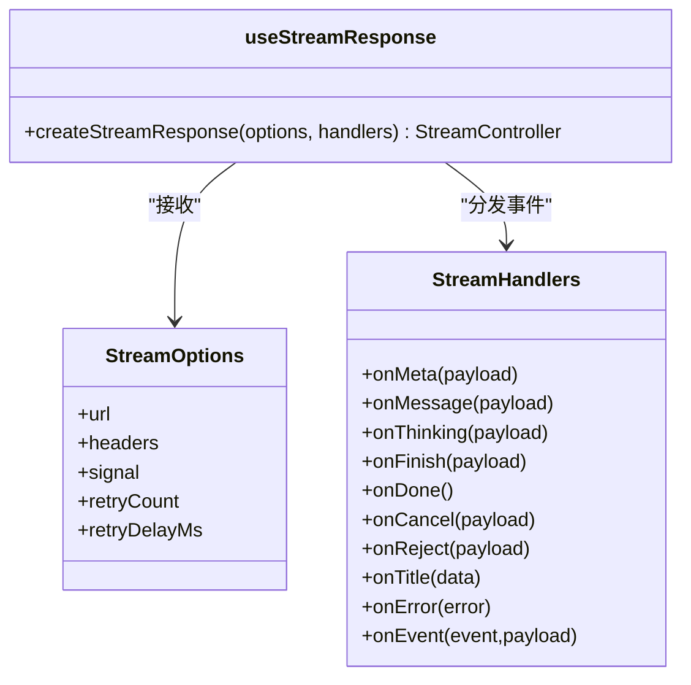
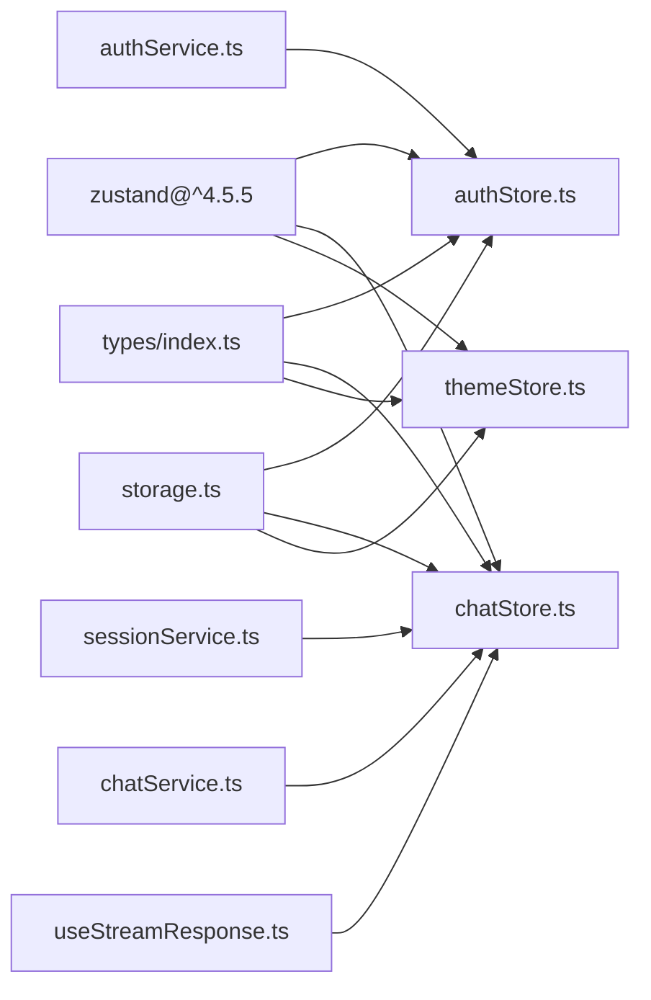

# 状态管理

<cite>
**本文引用的文件**
- [authStore.ts](file://frontend/src/stores/authStore.ts)
- [chatStore.ts](file://frontend/src/stores/chatStore.ts)
- [themeStore.ts](file://frontend/src/stores/themeStore.ts)
- [useAuth.ts](file://frontend/src/hooks/useAuth.ts)
- [useChat.ts](file://frontend/src/hooks/useChat.ts)
- [useStreamResponse.ts](file://frontend/src/hooks/useStreamResponse.ts)
- [storage.ts](file://frontend/src/utils/storage.ts)
- [index.ts](file://frontend/src/types/index.ts)
- [authService.ts](file://frontend/src/services/authService.ts)
- [sessionService.ts](file://frontend/src/services/sessionService.ts)
- [chatService.ts](file://frontend/src/services/chatService.ts)
- [LoginPage.tsx](file://frontend/src/pages/LoginPage.tsx)
- [ChatPage.tsx](file://frontend/src/pages/ChatPage.tsx)
- [main.tsx](file://frontend/src/main.tsx)
- [ChatInput.tsx](file://frontend/src/components/chat/ChatInput.tsx)
- [MessageList.tsx](file://frontend/src/components/chat/MessageList.tsx)
- [package.json](file://frontend/package.json)
</cite>

## 目录
1. [简介](#简介)
2. [项目结构](#项目结构)
3. [核心组件](#核心组件)
4. [架构总览](#架构总览)
5. [详细组件分析](#详细组件分析)
6. [依赖关系分析](#依赖关系分析)
7. [性能考量](#性能考量)
8. [故障排查指南](#故障排查指南)
9. [结论](#结论)
10. [附录](#附录)

## 简介
本文件系统性梳理 Seahorse Agent 前端基于 Zustand 的状态管理方案，覆盖状态设计原则、更新机制、持久化策略、生命周期管理、自定义 Hook 设计与最佳实践，并提供调试与监控建议及测试与维护指南。重点模块包括认证状态（authStore）、聊天状态（chatStore）、主题状态（themeStore），以及用于流式响应处理的 Hook（useStreamResponse）。

## 项目结构
前端状态管理位于 frontend/src/stores，配套 Hook 位于 frontend/src/hooks，类型定义位于 frontend/src/types，工具与服务位于 utils 与 services，入口在 main.tsx 中完成初始化。

**图表来源**
- [authStore.ts:1-116](file://frontend/src/stores/authStore.ts#L1-L116)
- [chatStore.ts:1-528](file://frontend/src/stores/chatStore.ts#L1-L528)
- [themeStore.ts:1-36](file://frontend/src/stores/themeStore.ts#L1-L36)
- [useAuth.ts:1-6](file://frontend/src/hooks/useAuth.ts#L1-L6)
- [useChat.ts:1-6](file://frontend/src/hooks/useChat.ts#L1-L6)
- [useStreamResponse.ts:1-176](file://frontend/src/hooks/useStreamResponse.ts#L1-L176)
- [storage.ts:1-67](file://frontend/src/utils/storage.ts#L1-L67)
- [authService.ts:1-18](file://frontend/src/services/authService.ts#L1-L18)
- [sessionService.ts:1-35](file://frontend/src/services/sessionService.ts#L1-L35)
- [chatService.ts:1-12](file://frontend/src/services/chatService.ts#L1-L12)
- [LoginPage.tsx:1-102](file://frontend/src/pages/LoginPage.tsx#L1-L102)
- [ChatPage.tsx:1-103](file://frontend/src/pages/ChatPage.tsx#L1-L103)
- [ChatInput.tsx:1-161](file://frontend/src/components/chat/ChatInput.tsx#L1-L161)
- [MessageList.tsx:1-212](file://frontend/src/components/chat/MessageList.tsx#L1-L212)
- [main.tsx:1-17](file://frontend/src/main.tsx#L1-L17)

**章节来源**
- [main.tsx:1-17](file://frontend/src/main.tsx#L1-L17)
- [package.json:1-70](file://frontend/package.json#L1-L70)

## 核心组件
- 认证状态（authStore）
  - 职责：用户登录、登出、当前用户信息获取、鉴权状态检查；与聊天状态联动清理会话与生成任务。
  - 关键字段：user、token、isAuthenticated、isLoading。
  - 关键方法：login、logout、checkAuth、fetchCurrentUser。
- 聊天状态（chatStore）
  - 职责：会话列表、消息列表、发送消息、流式接收、取消生成、深思模式、反馈提交、会话重命名与删除。
  - 关键字段：sessions、currentSessionId、messages、isStreaming、streamTaskId、streamAbort、thinkingStartAt、cancelRequested 等。
  - 关键方法：fetchSessions、createSession、deleteSession、renameSession、selectSession、sendMessage、cancelGeneration、appendStreamContent、appendThinkingContent、submitFeedback。
- 主题状态（themeStore）
  - 职责：主题切换与持久化，应用到 DOM。
  - 关键字段：theme。
  - 关键方法：setTheme、toggleTheme、initialize。
- 自定义 Hook
  - useAuth：暴露 authStore 实例。
  - useChat：暴露 chatStore 实例。
  - useStreamResponse：封装 SSE 流式读取、事件分发、重试与取消。

**章节来源**
- [authStore.ts:13-22](file://frontend/src/stores/authStore.ts#L13-L22)
- [chatStore.ts:16-43](file://frontend/src/stores/chatStore.ts#L16-L43)
- [themeStore.ts:7-12](file://frontend/src/stores/themeStore.ts#L7-L12)
- [useAuth.ts:1-6](file://frontend/src/hooks/useAuth.ts#L1-L6)
- [useChat.ts:1-6](file://frontend/src/hooks/useChat.ts#L1-L6)
- [useStreamResponse.ts:3-22](file://frontend/src/hooks/useStreamResponse.ts#L3-L22)

## 架构总览
Zustand Store 通过 create 构建，内部以 set/get 访问器驱动状态更新。页面与组件通过自定义 Hook 订阅 Store，服务层通过 axios 封装的 api 进行网络请求，本地持久化通过 storage 工具写入 localStorage。

**图表来源**
- [LoginPage.tsx:18-34](file://frontend/src/pages/LoginPage.tsx#L18-L34)
- [authStore.ts:29-66](file://frontend/src/stores/authStore.ts#L29-L66)
- [authService.ts:7-9](file://frontend/src/services/authService.ts#L7-L9)
- [storage.ts:31-59](file://frontend/src/utils/storage.ts#L31-L59)
- [chatStore.ts:45-59](file://frontend/src/stores/chatStore.ts#L45-L59)

## 详细组件分析

### 认证状态（authStore）
- 状态设计
  - user：当前用户对象，含 userId、username、role、token、avatar。
  - token：认证令牌。
  - isAuthenticated：是否已认证。
  - isLoading：登录中状态。
- 更新机制
  - login：发起登录请求，成功后写入 token 与用户信息，设置认证状态，调用 fetchCurrentUser，随后清理聊天状态并提示成功。
  - logout：调用后端登出接口（忽略网络异常），清理聊天状态，清除本地认证信息，重置认证状态并提示成功。
  - checkAuth：从 storage 读取 token 与用户信息，设置认证状态；若存在 token 则拉取当前用户。
  - fetchCurrentUser：从后端获取当前用户，合并 token 后写回 storage 并更新状态。
- 生命周期
  - 应用启动时在 main.tsx 中执行 checkAuth，确保刷新后仍保持登录态。
- 与聊天状态的交互
  - 登录与登出均会调用 chatStore.getState().cancelGeneration() 与 setState 清理生成任务与会话缓存，避免状态残留。

**图表来源**
- [authStore.ts:29-66](file://frontend/src/stores/authStore.ts#L29-L66)
- [authService.ts:7-9](file://frontend/src/services/authService.ts#L7-L9)
- [storage.ts:31-59](file://frontend/src/utils/storage.ts#L31-L59)
- [chatStore.ts:45-59](file://frontend/src/stores/chatStore.ts#L45-L59)

**章节来源**
- [authStore.ts:13-116](file://frontend/src/stores/authStore.ts#L13-L116)
- [authService.ts:1-18](file://frontend/src/services/authService.ts#L1-L18)
- [storage.ts:1-67](file://frontend/src/utils/storage.ts#L1-L67)
- [main.tsx:9-10](file://frontend/src/main.tsx#L9-L10)

### 聊天状态（chatStore）
- 状态设计
  - sessions：会话列表，按最后时间倒序。
  - messages：当前会话消息列表，支持流式追加与深思内容。
  - isStreaming/streamTaskId/streamAbort/streamingMessageId/cancelRequested：流式生成控制。
  - deepThinkingEnabled/thinkingStartAt：深思模式与耗时计算。
  - sessionsLoaded/inputFocusKey：会话加载状态与输入焦点控制。
- 更新机制
  - fetchSessions/selectSession/createSession/deleteSession/renameSession：围绕会话的 CRUD 与选择逻辑，统一映射 VO 到内部 Message 结构。
  - sendMessage：构建查询参数与 SSE URL，创建流处理器，追加用户与助手消息，接收 think/message/reject/finish/cancel/done/error 等事件，更新消息与会话状态。
  - cancelGeneration：标记 cancelRequested 并调用后端停止任务。
  - appendStreamContent/appendThinkingContent：增量拼接流式内容与深思内容，计算思考耗时。
  - submitFeedback：提交点赞/点踩，失败时回滚。
- 生命周期
  - 页面加载时自动拉取会话列表，根据路由 sessionId 选择或创建会话，保持 currentSessionId 与路由一致。
- 与流式 Hook 的协作
  - 使用 useStreamResponse 创建流处理器，集中处理事件分发与错误处理。

**图表来源**
- [chatStore.ts:224-456](file://frontend/src/stores/chatStore.ts#L224-L456)
- [useStreamResponse.ts:164-176](file://frontend/src/hooks/useStreamResponse.ts#L164-L176)
- [sessionService.ts:20-34](file://frontend/src/services/sessionService.ts#L20-L34)
- [chatService.ts:3-5](file://frontend/src/services/chatService.ts#L3-L5)

**章节来源**
- [chatStore.ts:16-528](file://frontend/src/stores/chatStore.ts#L16-L528)
- [ChatInput.tsx:45-57](file://frontend/src/components/chat/ChatInput.tsx#L45-L57)
- [MessageList.tsx:1-212](file://frontend/src/components/chat/MessageList.tsx#L1-L212)

### 主题状态（themeStore）
- 状态设计
  - theme：light 或 dark。
- 更新机制
  - setTheme：写入 storage 并应用到 documentElement.classList。
  - toggleTheme：在 light/dark 间切换。
  - initialize：从 storage 读取主题并应用。
- 生命周期
  - 应用启动时在 main.tsx 中执行 initialize，保证刷新后主题一致。

**图表来源**
- [themeStore.ts:18-35](file://frontend/src/stores/themeStore.ts#L18-L35)
- [storage.ts:60-66](file://frontend/src/utils/storage.ts#L60-L66)

**章节来源**
- [themeStore.ts:1-36](file://frontend/src/stores/themeStore.ts#L1-L36)
- [main.tsx:9-10](file://frontend/src/main.tsx#L9-L10)

### 自定义 Hook（useAuth、useChat、useStreamResponse）
- useAuth/useChat
  - 简单包装，直接返回对应 store 实例，便于组件内解构使用。
- useStreamResponse
  - 负责解析 SSE 事件流，按事件类型分发到回调（onMeta/onMessage/onThinking/onFinish/onDone/onCancel/onReject/onTitle/onError/onEvent）。
  - 支持重试（指数退避）与取消（AbortController）。
  - 对非 JSON 数据采用原始字符串处理，兼容多场景。

**图表来源**
- [useStreamResponse.ts:3-22](file://frontend/src/hooks/useStreamResponse.ts#L3-L22)
- [useStreamResponse.ts:164-176](file://frontend/src/hooks/useStreamResponse.ts#L164-L176)

**章节来源**
- [useAuth.ts:1-6](file://frontend/src/hooks/useAuth.ts#L1-L6)
- [useChat.ts:1-6](file://frontend/src/hooks/useChat.ts#L1-L6)
- [useStreamResponse.ts:1-176](file://frontend/src/hooks/useStreamResponse.ts#L1-L176)

## 依赖关系分析
- Zustand 版本：frontend/package.json 中声明 ^4.5.5，确保 create 语法与中间件能力满足当前实现。
- 类型系统：types/index.ts 定义了 Message、Session、MessageDeltaPayload、CompletionPayload 等核心类型，贯穿 Store、Service、Hook 与组件。
- 存储层：storage.ts 统一封装 localStorage 读写，提供安全兜底，避免异常导致应用崩溃。
- 服务层：authService、sessionService、chatService 通过 api 封装 axios 请求，统一路径与响应类型。

**图表来源**
- [package.json:46-46](file://frontend/package.json#L46-L46)
- [authStore.ts:1-116](file://frontend/src/stores/authStore.ts#L1-L116)
- [chatStore.ts:1-528](file://frontend/src/stores/chatStore.ts#L1-L528)
- [themeStore.ts:1-36](file://frontend/src/stores/themeStore.ts#L1-L36)
- [index.ts:1-50](file://frontend/src/types/index.ts#L1-L50)
- [storage.ts:1-67](file://frontend/src/utils/storage.ts#L1-L67)
- [authService.ts:1-18](file://frontend/src/services/authService.ts#L1-L18)
- [sessionService.ts:1-35](file://frontend/src/services/sessionService.ts#L1-L35)
- [chatService.ts:1-12](file://frontend/src/services/chatService.ts#L1-L12)
- [useStreamResponse.ts:1-176](file://frontend/src/hooks/useStreamResponse.ts#L1-L176)

**章节来源**
- [package.json:1-70](file://frontend/package.json#L1-L70)

## 性能考量
- 流式渲染优化
  - MessageList 使用 react-virtuoso 进行虚拟滚动，结合 followOutput 与高度变化回调，减少大列表重排开销。
- 状态更新粒度
  - chatStore 在流式过程中仅对目标消息进行局部更新，避免全量重渲染。
- 会话与消息懒加载
  - ChatPage 在 sessionsReady 之后再选择或创建会话，避免重复请求。
- 深度思考耗时
  - 通过 thinkingStartAt 与 computeThinkingDuration 计算思考耗时，避免重复计算与不必要渲染。
- 重试与取消
  - useStreamResponse 提供指数退避与 AbortController，降低网络波动影响与资源占用。

**章节来源**
- [MessageList.tsx:1-212](file://frontend/src/components/chat/MessageList.tsx#L1-L212)
- [chatStore.ts:66-70](file://frontend/src/stores/chatStore.ts#L66-L70)
- [ChatPage.tsx:30-73](file://frontend/src/pages/ChatPage.tsx#L30-L73)
- [useStreamResponse.ts:124-162](file://frontend/src/hooks/useStreamResponse.ts#L124-L162)

## 故障排查指南
- 登录失败
  - 现象：toast 提示登录失败，错误信息来自后端。
  - 排查：确认 authService.login 返回值与网络连通性；检查 storage 是否写入 token 与用户信息。
- 会话加载失败
  - 现象：toast 提示加载失败，sessionsLoaded 仍为 false。
  - 排查：检查 sessionService.listSessions 返回格式与权限；确认路由 sessionId 是否存在。
- 流式生成中断
  - 现象：消息状态变为 error 或 cancelled。
  - 排查：查看 useStreamResponse 的 onError 分支与 chatStore 的 onCancel 分支；确认后端 SSE 事件是否正确发送。
- 取消生成无效
  - 现象：点击停止无效或未触发后端停止。
  - 排查：确认 chatStore.cancelGeneration 是否被调用，streamTaskId 是否存在，chatService.stopTask 是否被调用。
- 主题切换不生效
  - 现象：切换主题后页面未变色。
  - 排查：确认 themeStore.initialize 与 setTheme 是否调用，storage.getTheme 与 documentElement.classList 是否正确。

**章节来源**
- [authStore.ts:61-66](file://frontend/src/stores/authStore.ts#L61-L66)
- [chatStore.ts:105-109](file://frontend/src/stores/chatStore.ts#L105-L109)
- [useStreamResponse.ts:81-83](file://frontend/src/hooks/useStreamResponse.ts#L81-L83)
- [chatStore.ts:457-464](file://frontend/src/stores/chatStore.ts#L457-L464)
- [themeStore.ts:29-34](file://frontend/src/stores/themeStore.ts#L29-L34)

## 结论
本状态管理方案以 Zustand 为核心，结合自定义 Hook 与工具函数，实现了认证、聊天、主题三大领域的清晰分层与高内聚低耦合。通过 SSE 流式处理与虚拟滚动优化，兼顾了实时性与性能。建议在后续迭代中进一步引入中间件（如 devtools）以增强可观测性，并完善单元测试覆盖关键分支与边界条件。

## 附录

### 状态设计原则与最佳实践
- 状态分层
  - 认证、聊天、主题分别独立 Store，避免跨域污染。
- 副作用处理
  - 所有网络请求封装在 Service 层，Store 仅负责状态与调度。
- 异步状态更新
  - 使用 isLoading/cancelRequested/isStreaming 等布尔位明确异步阶段。
- 持久化策略
  - 令牌与用户信息、主题偏好通过 storage 写入 localStorage，刷新后恢复。
- 错误处理
  - 统一 toast 提示，必要时回滚状态，保证一致性。

### 状态生命周期
- 初始化：main.tsx 调用 themeStore.initialize 与 authStore.checkAuth。
- 订阅：组件通过 useAuth/useChat 订阅 Store，自动渲染。
- 清理：登录/登出时清理聊天状态；组件卸载时注意取消流与定时器。

### 调试与监控
- 开发期
  - 可引入 Zustand Devtools（在开发环境启用）观察状态变更。
- 生产期
  - 通过日志记录关键事件（登录、会话创建/选择、流事件、错误）。
  - 监控 SSE 重试次数与取消率，评估网络稳定性。

### 测试策略与维护指南
- 单元测试
  - 针对 chatStore 的 sendMessage、cancelGeneration、appendStreamContent 等函数进行行为测试。
  - 针对 useStreamResponse 的事件分发与重试逻辑进行模拟测试。
- 集成测试
  - 模拟登录流程与会话切换，验证 authStore 与 chatStore 的联动。
- 维护建议
  - 新增字段时同步更新 types/index.ts。
  - 修改事件类型时统一在 useStreamResponse 与 chatStore 中对齐。
  - 持续关注 Zustand 版本升级，确保 create 语法与中间件兼容。