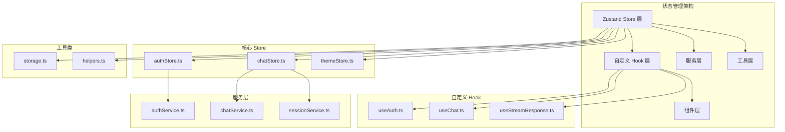
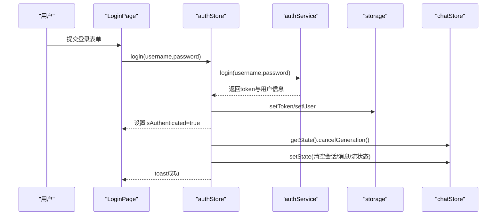
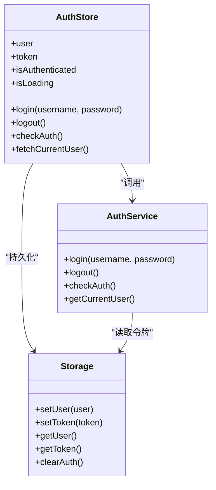
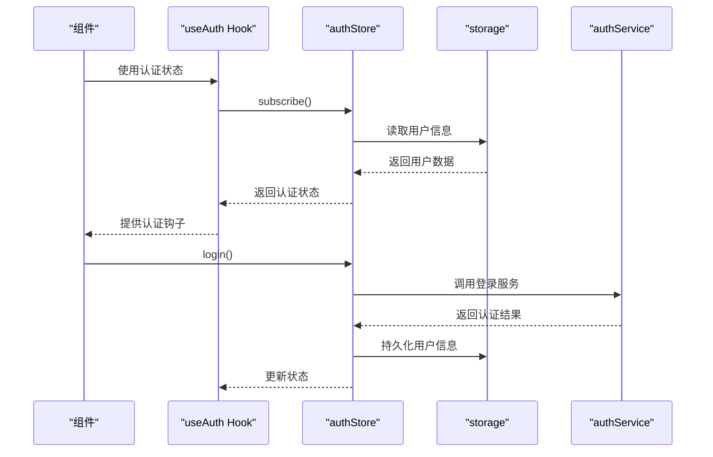
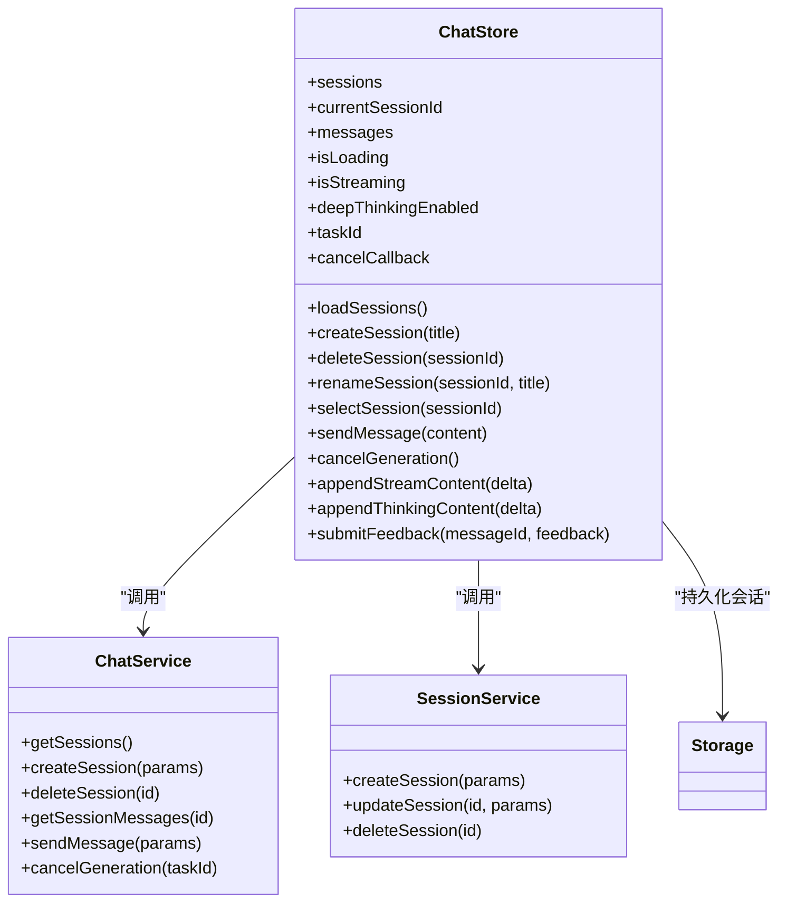
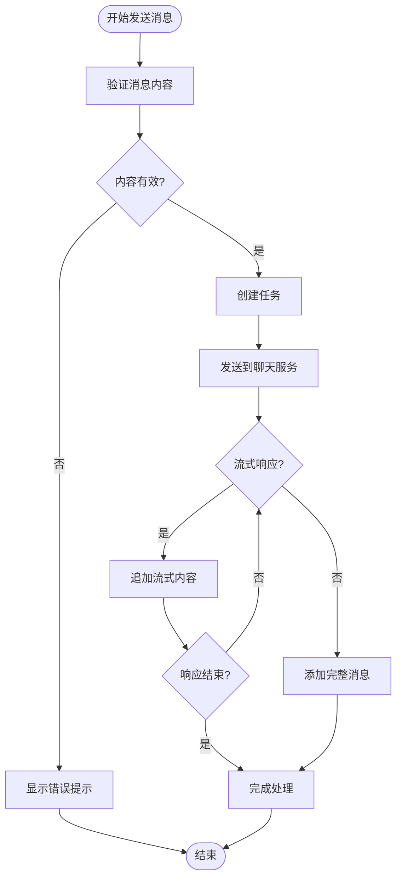
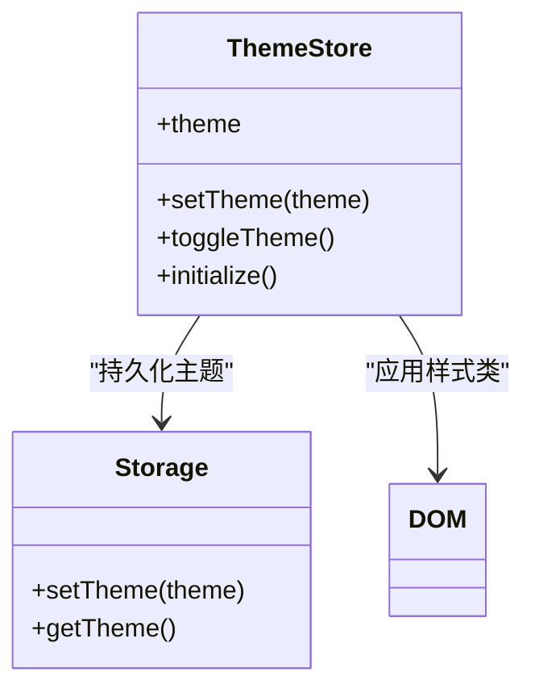
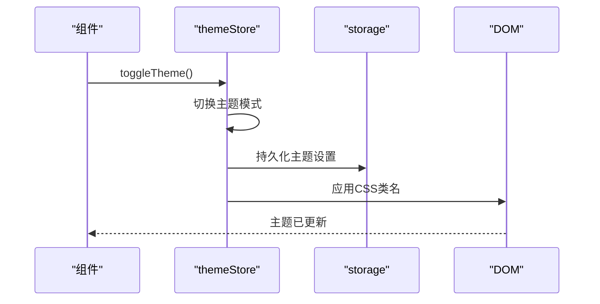
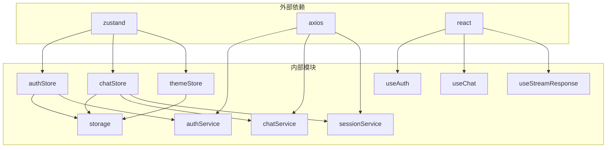

# 状态管理

<cite>
**本文引用的文件**
- [状态管理.md](file://docs/zh/content/前端系统/状态管理.md)
- [前端系统.md](file://docs/zh/content/前端系统/前端系统.md)
- [authStore.ts](file://frontend/src/stores/authStore.ts)
- [chatStore.ts](file://frontend/src/stores/chatStore.ts)
- [themeStore.ts](file://frontend/src/stores/themeStore.ts)
- [useAuth.ts](file://frontend/src/hooks/useAuth.ts)
- [useChat.ts](file://frontend/src/hooks/useChat.ts)
- [useStreamResponse.ts](file://frontend/src/hooks/useStreamResponse.ts)
- [storage.ts](file://frontend/src/utils/storage.ts)
- [authService.ts](file://frontend/src/services/authService.ts)
- [chatService.ts](file://frontend/src/services/chatService.ts)
- [sessionService.ts](file://frontend/src/services/sessionService.ts)
- [LoginPage.tsx](file://frontend/src/pages/LoginPage.tsx)
- [ChatPage.tsx](file://frontend/src/pages/ChatPage.tsx)
</cite>

## 目录
1. [简介](#简介)
2. [项目结构](#项目结构)
3. [核心组件](#核心组件)
4. [架构总览](#架构总览)
5. [详细组件分析](#详细组件分析)
6. [依赖关系分析](#依赖关系分析)
7. [性能考虑](#性能考虑)
8. [故障排除指南](#故障排除指南)
9. [结论](#结论)
10. [附录](#附录)

## 简介

Seahorse Agent 采用 Zustand 作为其状态管理解决方案，构建了完整的前端状态管理体系。该系统通过三个核心 Store（authStore、chatStore、themeStore）实现了认证状态、聊天状态和主题状态的统一管理。

Zustand 是一个轻量级的状态管理库，它提供了简单直观的 API 来管理应用状态。与 Redux 等传统状态管理方案相比，Zustand 不需要复杂的中间件或样板代码，开发者可以直接通过函数式的方式操作状态。

在 Seahorse Agent 中，Zustand Store 通过 create 函数构建，内部以 set/get 访问器驱动状态更新。页面与组件通过自定义 Hook 订阅 Store，服务层通过 axios 封装的 api 进行网络请求，本地持久化通过 storage 工具写入 localStorage。

## 项目结构

前端状态管理系统主要由以下几部分组成：

**图表来源**
- [状态管理.md:133-160](file://docs/zh/content/前端系统/状态管理.md#L133-L160)
- [authStore.ts](file://frontend/src/stores/authStore.ts)
- [chatStore.ts](file://frontend/src/stores/chatStore.ts)
- [themeStore.ts](file://frontend/src/stores/themeStore.ts)

**章节来源**
- [状态管理.md:133-160](file://docs/zh/content/前端系统/状态管理.md#L133-L160)
- [前端系统.md:220-272](file://docs/zh/content/前端系统/前端系统.md#L220-L272)

## 核心组件

### 认证状态管理（authStore）

authStore 负责管理用户的认证状态，包括用户信息、访问令牌、认证状态和加载状态。该 Store 提供了完整的认证生命周期管理功能。

**核心字段：**
- user: 当前用户对象
- token: 用户访问令牌
- isAuthenticated: 认证状态标志
- isLoading: 加载状态标志

**核心方法：**
- login(username, password): 执行用户登录
- logout(): 执行用户登出
- checkAuth(): 检查当前认证状态
- fetchCurrentUser(): 获取当前用户信息

### 聊天状态管理（chatStore）

chatStore 是整个应用最复杂的状态管理模块，负责管理聊天会话、消息、流式响应和相关状态。

**核心字段：**
- sessions: 会话列表
- currentSessionId: 当前选中的会话 ID
- messages: 当前会话的消息数组
- isLoading: 加载状态
- isStreaming: 流式响应状态
- deepThinkingEnabled: 深度思考模式开关
- taskId: 当前任务标识
- cancelCallback: 取消回调函数

**核心方法：**
- loadSessions(): 加载会话列表
- createSession(title): 创建新会话
- deleteSession(sessionId): 删除指定会话
- renameSession(sessionId, title): 重命名会话
- selectSession(sessionId): 选择会话
- sendMessage(content): 发送消息
- cancelGeneration(): 取消生成
- appendStreamContent(delta): 追加流式内容
- appendThinkingContent(delta): 追加思考内容
- submitFeedback(messageId, feedback): 提交反馈

### 主题状态管理（themeStore）

themeStore 管理应用的主题设置，支持明暗主题的切换和持久化。

**核心字段：**
- theme: 当前主题模式

**核心方法：**
- setTheme(theme): 设置主题
- toggleTheme(): 切换主题
- initialize(): 初始化主题

**章节来源**
- [前端系统.md:220-272](file://docs/zh/content/前端系统/前端系统.md#L220-L272)

## 架构总览

Seahorse Agent 的状态管理架构采用了分层设计，确保了各层之间的职责清晰分离：

**图表来源**
- [状态管理.md:133-160](file://docs/zh/content/前端系统/状态管理.md#L133-L160)
- [LoginPage.tsx:18-34](file://frontend/src/pages/LoginPage.tsx#L18-L34)
- [authStore.ts:29-66](file://frontend/src/stores/authStore.ts#L29-L66)
- [authService.ts:7-9](file://frontend/src/services/authService.ts#L7-L9)
- [storage.ts:31-59](file://frontend/src/utils/storage.ts#L31-L59)
- [chatStore.ts:45-59](file://frontend/src/stores/chatStore.ts#L45-L59)

### 数据流管理策略

系统采用三层状态管理模式：

1. **组件本地状态**: 仅用于组件内部的临时状态，如表单输入、UI 状态等
2. **全局状态**: 通过 Zustand Store 管理的应用级状态，如用户认证信息、聊天会话等
3. **服务器状态**: 通过服务层与后端 API 交互获取的状态，如用户数据、会话历史等

这种分层设计确保了状态的一致性和可预测性，同时避免了状态管理的过度复杂化。

**章节来源**
- [状态管理.md:133-160](file://docs/zh/content/前端系统/状态管理.md#L133-L160)

## 详细组件分析

### 认证状态管理组件

**图表来源**
- [前端系统.md:220-245](file://docs/zh/content/前端系统/前端系统.md#L220-L245)
- [authStore.ts](file://frontend/src/stores/authStore.ts)
- [authService.ts](file://frontend/src/services/authService.ts)
- [storage.ts](file://frontend/src/utils/storage.ts)

#### 认证流程时序图

**图表来源**
- [useAuth.ts](file://frontend/src/hooks/useAuth.ts)
- [authStore.ts](file://frontend/src/stores/authStore.ts)
- [authService.ts](file://frontend/src/services/authService.ts)
- [storage.ts](file://frontend/src/utils/storage.ts)

**章节来源**
- [authStore.ts](file://frontend/src/stores/authStore.ts)
- [useAuth.ts](file://frontend/src/hooks/useAuth.ts)
- [authService.ts](file://frontend/src/services/authService.ts)

### 聊天状态管理组件

**图表来源**
- [frontend/src/stores/chatStore.ts](file://frontend/src/stores/chatStore.ts)
- [frontend/src/services/chatService.ts](file://frontend/src/services/chatService.ts)
- [frontend/src/services/sessionService.ts](file://frontend/src/services/sessionService.ts)

#### 聊天消息处理流程

**图表来源**
- [frontend/src/stores/chatStore.ts](file://frontend/src/stores/chatStore.ts)
- [frontend/src/hooks/useStreamResponse.ts](file://frontend/src/hooks/useStreamResponse.ts)

**章节来源**
- [chatStore.ts](file://frontend/src/stores/chatStore.ts)
- [useChat.ts](file://frontend/src/hooks/useChat.ts)
- [useStreamResponse.ts](file://frontend/src/hooks/useStreamResponse.ts)

### 主题状态管理组件

**图表来源**
- [frontend/src/stores/themeStore.ts](file://frontend/src/stores/themeStore.ts)
- [frontend/src/utils/storage.ts](file://frontend/src/utils/storage.ts)

#### 主题切换流程

**图表来源**
- [frontend/src/stores/themeStore.ts](file://frontend/src/stores/themeStore.ts)
- [frontend/src/utils/storage.ts](file://frontend/src/utils/storage.ts)

**章节来源**
- [themeStore.ts](file://frontend/src/stores/themeStore.ts)
- [storage.ts](file://frontend/src/utils/storage.ts)

## 依赖关系分析

### 组件耦合度分析

**图表来源**
- [frontend/src/stores/authStore.ts](file://frontend/src/stores/authStore.ts)
- [frontend/src/stores/chatStore.ts](file://frontend/src/stores/chatStore.ts)
- [frontend/src/stores/themeStore.ts](file://frontend/src/stores/themeStore.ts)
- [frontend/src/hooks/useAuth.ts](file://frontend/src/hooks/useAuth.ts)
- [frontend/src/hooks/useChat.ts](file://frontend/src/hooks/useChat.ts)
- [frontend/src/hooks/useStreamResponse.ts](file://frontend/src/hooks/useStreamResponse.ts)
- [frontend/src/utils/storage.ts](file://frontend/src/utils/storage.ts)
- [frontend/src/services/authService.ts](file://frontend/src/services/authService.ts)
- [frontend/src/services/chatService.ts](file://frontend/src/services/chatService.ts)
- [frontend/src/services/sessionService.ts](file://frontend/src/services/sessionService.ts)

### 状态依赖链

系统中的状态依赖关系呈现树状结构：

1. **认证状态** → **聊天状态**：用户认证成功后，聊天状态可以正常工作
2. **聊天状态** → **会话状态**：聊天状态管理会话的创建、删除和切换
3. **主题状态** → **UI 渲染**：主题状态直接影响组件的视觉表现

这种依赖关系确保了状态变更的可控性和可预测性。

**章节来源**
- [状态管理.md:133-160](file://docs/zh/content/前端系统/状态管理.md#L133-L160)

## 性能考虑

### 状态更新优化

1. **选择性订阅**：通过自定义 Hook 实现细粒度的状态订阅，避免不必要的组件重渲染
2. **状态分割**：将大对象拆分为多个小状态，减少状态更新的影响范围
3. **防抖处理**：对频繁的状态更新进行防抖处理，提高性能

### 内存管理

1. **自动清理**：组件卸载时自动清理状态订阅，防止内存泄漏
2. **状态压缩**：对历史状态进行压缩，限制状态存储大小
3. **懒加载**：按需加载状态数据，减少初始内存占用

### 缓存策略

1. **本地缓存**：关键状态数据持久化到 localStorage
2. **服务端同步**：定期与服务端状态进行同步
3. **失效机制**：实现状态失效检测和自动刷新

## 故障排除指南

### 常见问题及解决方案

**认证状态异常**
- 症状：登录后状态不更新
- 解决方案：检查 token 是否正确存储，确认认证服务返回的数据格式

**聊天状态卡顿**
- 症状：消息发送延迟或界面无响应
- 解决方案：检查流式响应处理逻辑，优化状态更新频率

**主题切换失败**
- 症状：主题切换后样式未更新
- 解决方案：确认 CSS 类名应用逻辑，检查 DOM 操作权限

### 调试技巧

1. **状态监控**：使用浏览器开发者工具监控状态变化
2. **日志记录**：在关键状态变更点添加日志输出
3. **单元测试**：为状态管理逻辑编写单元测试

**章节来源**
- [状态管理.md:133-160](file://docs/zh/content/前端系统/状态管理.md#L133-L160)

## 结论

Seahorse Agent 的 Zustand 状态管理架构展现了现代前端应用状态管理的最佳实践。通过合理的架构设计和组件划分，系统实现了：

1. **清晰的职责分离**：每个 Store 负责特定领域的状态管理
2. **高效的性能表现**：通过选择性订阅和状态优化确保流畅体验
3. **良好的可维护性**：模块化的代码结构便于理解和扩展
4. **完善的错误处理**：健壮的状态管理和异常恢复机制

该架构为类似的企业级应用提供了可参考的解决方案，特别是在需要处理复杂业务逻辑和大量用户交互的场景中。

## 附录

### 自定义 Hook 设计模式

系统中的自定义 Hook 遵循以下设计原则：

1. **单一职责**：每个 Hook 只负责一个特定的状态管理需求
2. **可复用性**：Hook 设计为通用组件，可在多个地方重复使用
3. **类型安全**：完整的 TypeScript 类型定义确保开发时的类型安全
4. **易测试性**：Hook 的纯函数特性便于单元测试

### 状态持久化策略

1. **选择性持久化**：只持久化必要的状态数据
2. **版本控制**：实现状态数据的版本管理，支持升级兼容
3. **增量更新**：采用增量更新策略，减少存储空间占用
4. **备份恢复**：实现状态备份和恢复机制

### 扩展和定制方案

1. **插件化架构**：支持通过插件形式扩展新的状态管理能力
2. **配置驱动**：通过配置文件控制状态管理的行为和策略
3. **事件系统**：实现状态变更事件系统，支持第三方集成
4. **监控告警**：内置状态管理监控和告警机制