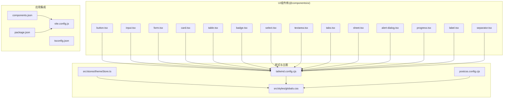
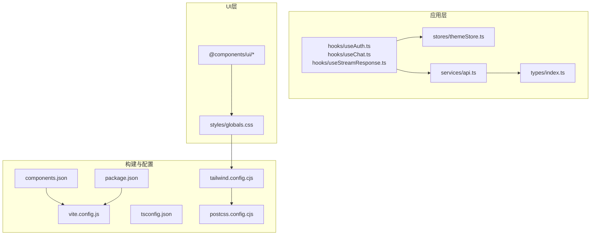
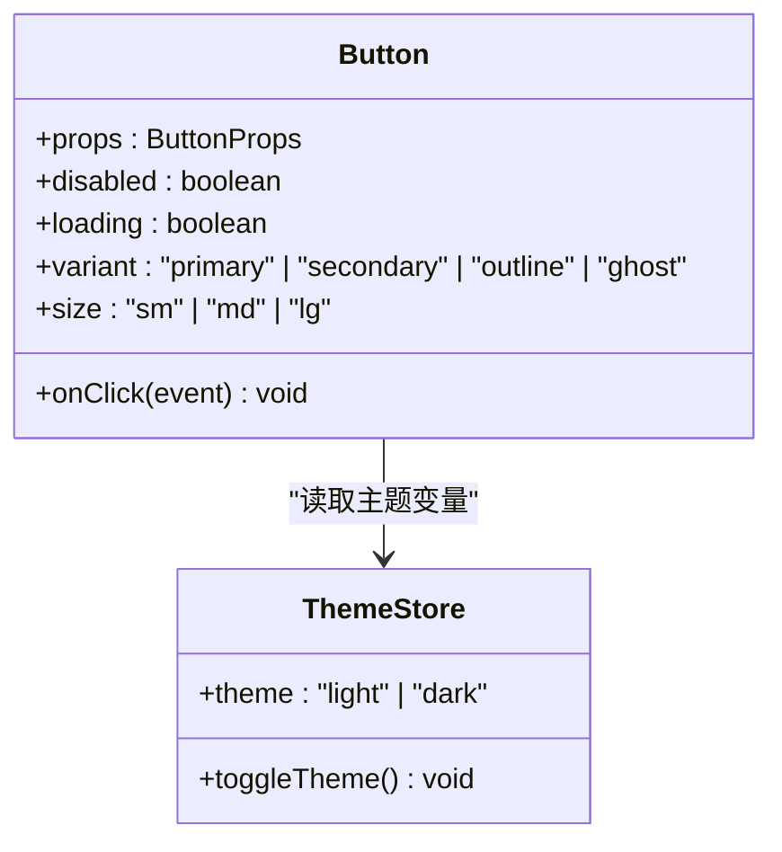
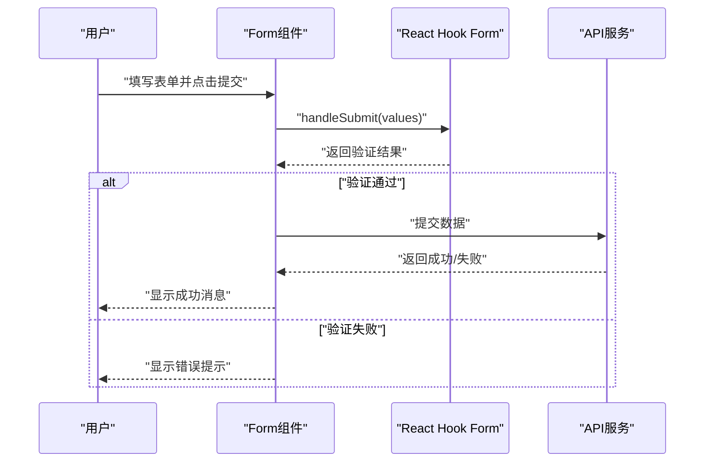
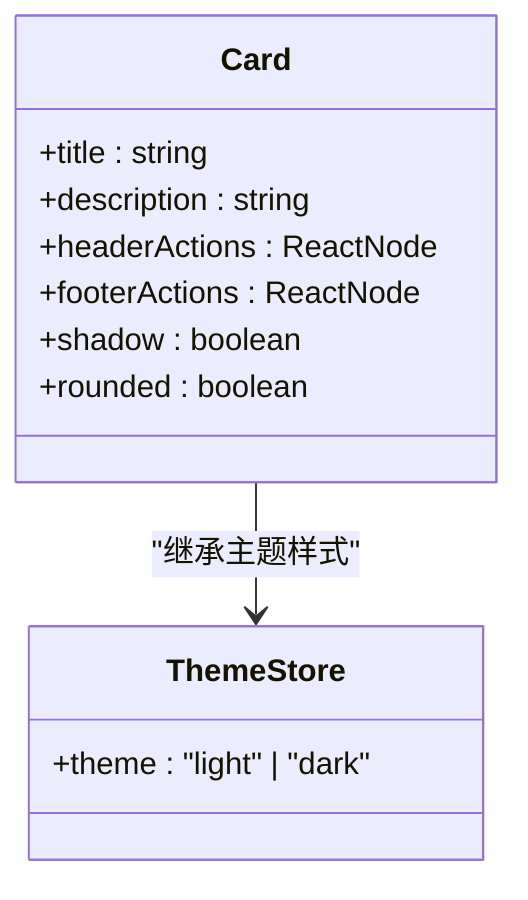
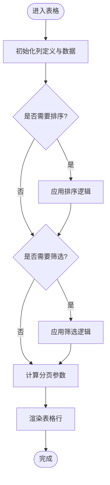
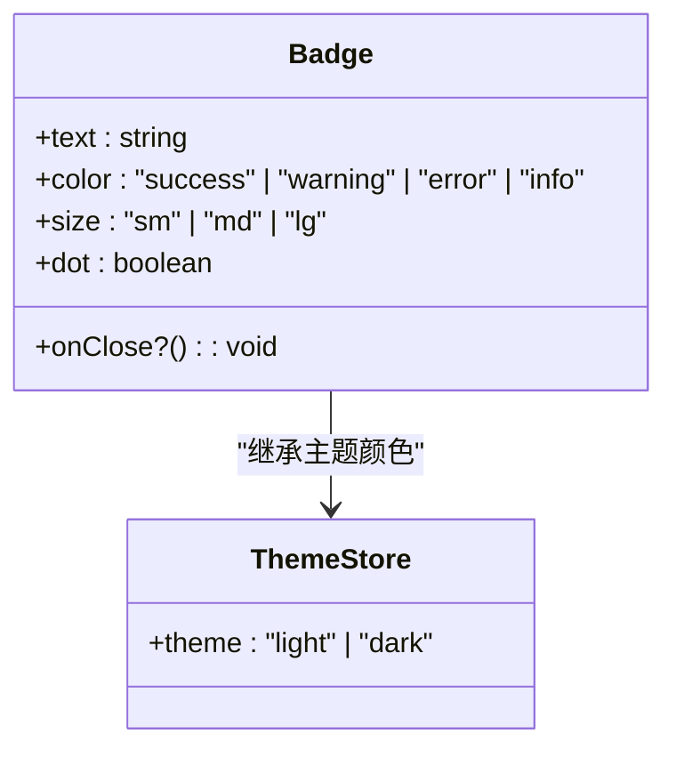
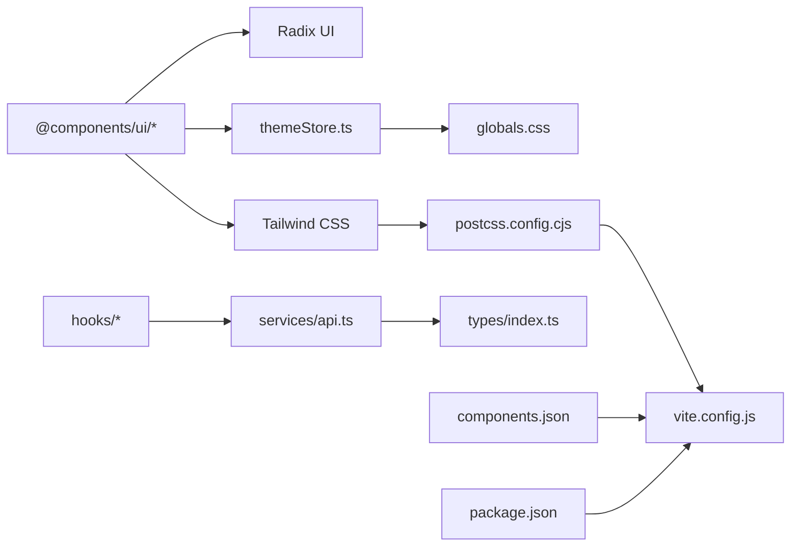

# UI组件库

<cite>
**本文引用的文件**
- [frontend/@components/ui/button.tsx](file://frontend/@components/ui/button.tsx)
- [frontend/@components/ui/input.tsx](file://frontend/@components/ui/input.tsx)
- [frontend/@components/ui/form.tsx](file://frontend/@components/ui/form.tsx)
- [frontend/@components/ui/card.tsx](file://frontend/@components/ui/card.tsx)
- [frontend/@components/ui/table.tsx](file://frontend/@components/ui/table.tsx)
- [frontend/@components/ui/badge.tsx](file://frontend/@components/ui/badge.tsx)
- [frontend/@components/ui/select.tsx](file://frontend/@components/ui/select.tsx)
- [frontend/@components/ui/textarea.tsx](file://frontend/@components/ui/textarea.tsx)
- [frontend/@components/ui/tabs.tsx](file://frontend/@components/ui/tabs.tsx)
- [frontend/@components/ui/sheet.tsx](file://frontend/@components/ui/sheet.tsx)
- [frontend/@components/ui/alert-dialog.tsx](file://frontend/@components/ui/alert-dialog.tsx)
- [frontend/@components/ui/progress.tsx](file://frontend/@components/ui/progress.tsx)
- [frontend/@components/ui/label.tsx](file://frontend/@components/ui/label.tsx)
- [frontend/@components/ui/separator.tsx](file://frontend/@components/ui/separator.tsx)
- [frontend/package.json](file://frontend/package.json)
- [frontend/components.json](file://frontend/components.json)
- [frontend/tailwind.config.cjs](file://frontend/tailwind.config.cjs)
- [frontend/postcss.config.cjs](file://frontend/postcss.config.cjs)
- [frontend/src/styles/globals.css](file://frontend/src/styles/globals.css)
- [frontend/src/stores/themeStore.ts](file://frontend/src/stores/themeStore.ts)
- [frontend/src/hooks/useAuth.ts](file://frontend/src/hooks/useAuth.ts)
- [frontend/src/hooks/useChat.ts](file://frontend/src/hooks/useChat.ts)
- [frontend/src/hooks/useStreamResponse.ts](file://frontend/src/hooks/useStreamResponse.ts)
- [frontend/src/services/api.ts](file://frontend/src/services/api.ts)
- [frontend/src/types/index.ts](file://frontend/src/types/index.ts)
- [frontend/vite.config.js](file://frontend/vite.config.js)
- [frontend/tsconfig.json](file://frontend/tsconfig.json)
</cite>

## 目录
1. [简介](#简介)
2. [项目结构](#项目结构)
3. [核心组件](#核心组件)
4. [架构总览](#架构总览)
5. [详细组件分析](#详细组件分析)
6. [依赖关系分析](#依赖关系分析)
7. [性能考虑](#性能考虑)
8. [故障排查指南](#故障排查指南)
9. [结论](#结论)
10. [附录](#附录)

## 简介
本文件为Seahorse Agent前端UI组件库的技术文档，聚焦于基于Radix UI的@components/ui基础组件与自定义UI组件的设计理念、实现架构与使用规范。文档覆盖组件分类（按钮、表单、卡片、表格、标签等）、可访问性设计、主题定制与样式系统、Props接口设计、事件处理与状态管理、组合使用模式与布局适配策略，并提供安装配置、版本管理与升级指南、测试策略与质量保证方案，以及扩展开发与自定义组件创建方法。

## 项目结构
UI组件库位于frontend/@components/ui目录下，采用按功能分层的组织方式，每个组件独立封装并遵循一致的命名与导出规范。组件广泛使用Tailwind CSS进行样式控制，并通过Radix UI确保可访问性与语义化。

**图表来源**
- [frontend/@components/ui/button.tsx](file://frontend/@components/ui/button.tsx)
- [frontend/@components/ui/input.tsx](file://frontend/@components/ui/input.tsx)
- [frontend/@components/ui/form.tsx](file://frontend/@components/ui/form.tsx)
- [frontend/@components/ui/card.tsx](file://frontend/@components/ui/card.tsx)
- [frontend/@components/ui/table.tsx](file://frontend/@components/ui/table.tsx)
- [frontend/@components/ui/badge.tsx](file://frontend/@components/ui/badge.tsx)
- [frontend/@components/ui/select.tsx](file://frontend/@components/ui/select.tsx)
- [frontend/@components/ui/textarea.tsx](file://frontend/@components/ui/textarea.tsx)
- [frontend/@components/ui/tabs.tsx](file://frontend/@components/ui/tabs.tsx)
- [frontend/@components/ui/sheet.tsx](file://frontend/@components/ui/sheet.tsx)
- [frontend/@components/ui/alert-dialog.tsx](file://frontend/@components/ui/alert-dialog.tsx)
- [frontend/@components/ui/progress.tsx](file://frontend/@components/ui/progress.tsx)
- [frontend/@components/ui/label.tsx](file://frontend/@components/ui/label.tsx)
- [frontend/@components/ui/separator.tsx](file://frontend/@components/ui/separator.tsx)
- [frontend/tailwind.config.cjs](file://frontend/tailwind.config.cjs)
- [frontend/postcss.config.cjs](file://frontend/postcss.config.cjs)
- [frontend/src/styles/globals.css](file://frontend/src/styles/globals.css)
- [frontend/src/stores/themeStore.ts](file://frontend/src/stores/themeStore.ts)
- [frontend/vite.config.js](file://frontend/vite.config.js)
- [frontend/tsconfig.json](file://frontend/tsconfig.json)
- [frontend/components.json](file://frontend/components.json)
- [frontend/package.json](file://frontend/package.json)

**章节来源**
- [frontend/@components/ui/button.tsx](file://frontend/@components/ui/button.tsx)
- [frontend/@components/ui/input.tsx](file://frontend/@components/ui/input.tsx)
- [frontend/@components/ui/form.tsx](file://frontend/@components/ui/form.tsx)
- [frontend/@components/ui/card.tsx](file://frontend/@components/ui/card.tsx)
- [frontend/@components/ui/table.tsx](file://frontend/@components/ui/table.tsx)
- [frontend/@components/ui/badge.tsx](file://frontend/@components/ui/badge.tsx)
- [frontend/@components/ui/select.tsx](file://frontend/@components/ui/select.tsx)
- [frontend/@components/ui/textarea.tsx](file://frontend/@components/ui/textarea.tsx)
- [frontend/@components/ui/tabs.tsx](file://frontend/@components/ui/tabs.tsx)
- [frontend/@components/ui/sheet.tsx](file://frontend/@components/ui/sheet.tsx)
- [frontend/@components/ui/alert-dialog.tsx](file://frontend/@components/ui/alert-dialog.tsx)
- [frontend/@components/ui/progress.tsx](file://frontend/@components/ui/progress.tsx)
- [frontend/@components/ui/label.tsx](file://frontend/@components/ui/label.tsx)
- [frontend/@components/ui/separator.tsx](file://frontend/@components/ui/separator.tsx)
- [frontend/tailwind.config.cjs](file://frontend/tailwind.config.cjs)
- [frontend/postcss.config.cjs](file://frontend/postcss.config.cjs)
- [frontend/src/styles/globals.css](file://frontend/src/styles/globals.css)
- [frontend/src/stores/themeStore.ts](file://frontend/src/stores/themeStore.ts)
- [frontend/vite.config.js](file://frontend/vite.config.js)
- [frontend/tsconfig.json](file://frontend/tsconfig.json)
- [frontend/components.json](file://frontend/components.json)
- [frontend/package.json](file://frontend/package.json)

## 核心组件
本节概述UI组件库的关键组件及其职责与协作关系。所有组件均以Radix UI为基础，结合Tailwind CSS实现一致的视觉与交互体验，并通过hooks与stores实现状态管理与主题切换。

- 按钮(Button): 提供主次操作入口，支持禁用、加载态、尺寸与颜色变体。
- 输入(Input): 文本输入的基础控件，支持校验、清空、前缀/后缀图标。
- 表单(Form): 基于React Hook Form的表单容器，统一字段注册、校验与提交流程。
- 卡片(Card): 内容容器，支持标题、描述、操作区与阴影/圆角风格。
- 表格(Table): 结构化数据展示，支持排序、筛选、分页与响应式布局。
- 标签(Badge): 轻量信息标记，支持状态色与尺寸变体。
- 选择器(Select): 下拉选择，支持搜索、多选与受控/非受控模式。
- 文本域(Textarea): 多行文本输入，支持自动高度与字数统计。
- 标签页(Tabs): 内容分区切换，支持禁用项与动画过渡。
- 动作面板(Sheet): 从侧边滑入的内容面板，支持遮罩关闭与键盘无障碍。
- 对话框(AlertDialog): 强制确认或危险操作的对话框，强调可访问性。
- 进度条(Progress): 显示任务完成进度，支持缓冲与错误状态。
- 标签(Label): 与表单控件关联的标签，提升可点击区域与可访问性。
- 分隔线(Separator): 视觉分组与内容分隔，支持水平/垂直方向。

**章节来源**
- [frontend/@components/ui/button.tsx](file://frontend/@components/ui/button.tsx)
- [frontend/@components/ui/input.tsx](file://frontend/@components/ui/input.tsx)
- [frontend/@components/ui/form.tsx](file://frontend/@components/ui/form.tsx)
- [frontend/@components/ui/card.tsx](file://frontend/@components/ui/card.tsx)
- [frontend/@components/ui/table.tsx](file://frontend/@components/ui/table.tsx)
- [frontend/@components/ui/badge.tsx](file://frontend/@components/ui/badge.tsx)
- [frontend/@components/ui/select.tsx](file://frontend/@components/ui/select.tsx)
- [frontend/@components/ui/textarea.tsx](file://frontend/@components/ui/textarea.tsx)
- [frontend/@components/ui/tabs.tsx](file://frontend/@components/ui/tabs.tsx)
- [frontend/@components/ui/sheet.tsx](file://frontend/@components/ui/sheet.tsx)
- [frontend/@components/ui/alert-dialog.tsx](file://frontend/@components/ui/alert-dialog.tsx)
- [frontend/@components/ui/progress.tsx](file://frontend/@components/ui/progress.tsx)
- [frontend/@components/ui/label.tsx](file://frontend/@components/ui/label.tsx)
- [frontend/@components/ui/separator.tsx](file://frontend/@components/ui/separator.tsx)

## 架构总览
UI组件库采用“组件即模块”的设计理念，每个组件独立封装，通过统一的样式系统与主题存储实现一致性。应用层通过hooks与stores进行状态管理，服务层提供API调用能力，构建完整的前端交互闭环。

**图表来源**
- [frontend/src/hooks/useAuth.ts](file://frontend/src/hooks/useAuth.ts)
- [frontend/src/hooks/useChat.ts](file://frontend/src/hooks/useChat.ts)
- [frontend/src/hooks/useStreamResponse.ts](file://frontend/src/hooks/useStreamResponse.ts)
- [frontend/src/stores/themeStore.ts](file://frontend/src/stores/themeStore.ts)
- [frontend/src/services/api.ts](file://frontend/src/services/api.ts)
- [frontend/src/types/index.ts](file://frontend/src/types/index.ts)
- [frontend/@components/ui/button.tsx](file://frontend/@components/ui/button.tsx)
- [frontend/src/styles/globals.css](file://frontend/src/styles/globals.css)
- [frontend/vite.config.js](file://frontend/vite.config.js)
- [frontend/tsconfig.json](file://frontend/tsconfig.json)
- [frontend/tailwind.config.cjs](file://frontend/tailwind.config.cjs)
- [frontend/postcss.config.cjs](file://frontend/postcss.config.cjs)
- [frontend/components.json](file://frontend/components.json)
- [frontend/package.json](file://frontend/package.json)

## 详细组件分析

### 按钮(Button)分析
- 设计理念: 基于Radix UI的Button组件，结合Tailwind实现多种视觉状态与尺寸变体；支持禁用、加载态与无障碍属性。
- Props接口: 包含类型、尺寸、颜色、是否禁用、是否加载、onClick回调等；通过组合变体实现不同场景下的按钮形态。
- 事件处理: onClick事件统一由上层业务逻辑处理，组件内部负责状态反馈与可访问性。
- 状态管理: 通过全局主题store与样式变量实现颜色与样式的动态切换。
- 可访问性: 使用aria-disabled与role="button"等语义化属性，确保键盘导航与屏幕阅读器友好。

**图表来源**
- [frontend/@components/ui/button.tsx](file://frontend/@components/ui/button.tsx)
- [frontend/src/stores/themeStore.ts](file://frontend/src/stores/themeStore.ts)

**章节来源**
- [frontend/@components/ui/button.tsx](file://frontend/@components/ui/button.tsx)
- [frontend/src/stores/themeStore.ts](file://frontend/src/stores/themeStore.ts)

### 表单(Form)分析
- 设计理念: 基于React Hook Form实现表单容器，统一字段注册、校验规则与提交流程；支持受控/非受控模式与错误提示。
- Props接口: 包含默认值、模式、解析器、提交处理器、字段映射等；通过resolver实现复杂校验逻辑。
- 事件处理: handleSubmit统一处理提交事件，handleReset用于重置表单；onError用于错误收集与展示。
- 状态管理: useFormContext提供上下文状态，配合useEffect实现联动与异步校验。
- 可访问性: 自动为字段生成id与aria-describedby，错误信息通过aria-live提升可访问性。

**图表来源**
- [frontend/@components/ui/form.tsx](file://frontend/@components/ui/form.tsx)
- [frontend/src/services/api.ts](file://frontend/src/services/api.ts)

**章节来源**
- [frontend/@components/ui/form.tsx](file://frontend/@components/ui/form.tsx)
- [frontend/src/services/api.ts](file://frontend/src/services/api.ts)

### 卡片(Card)分析
- 设计理念: 作为内容容器，支持标题、描述、操作区与阴影/圆角风格；适用于列表项、详情页与设置面板。
- Props接口: 包含标题、描述、头部操作、底部操作、阴影与圆角等；通过组合类名实现不同风格。
- 事件处理: 支持点击与悬停效果，通过hover与active状态改变视觉反馈。
- 状态管理: 与主题store联动，根据主题切换背景色与边框色。
- 可访问性: 使用header、section等语义化标签，确保内容层次清晰。

**图表来源**
- [frontend/@components/ui/card.tsx](file://frontend/@components/ui/card.tsx)
- [frontend/src/stores/themeStore.ts](file://frontend/src/stores/themeStore.ts)

**章节来源**
- [frontend/@components/ui/card.tsx](file://frontend/@components/ui/card.tsx)
- [frontend/src/stores/themeStore.ts](file://frontend/src/stores/themeStore.ts)

### 表格(Table)分析
- 设计理念: 结构化数据展示，支持排序、筛选、分页与响应式布局；通过虚拟滚动优化大数据集渲染。
- Props接口: 包含列定义、数据源、排序状态、筛选条件、分页参数等；通过useEffect实现状态同步。
- 事件处理: 排序与筛选通过回调函数传递给上层，分页通过onPageChange处理。
- 状态管理: 使用useState与useReducer管理本地状态，结合主题store实现样式切换。
- 可访问性: 使用thead、tbody、th、td等语义化标签，支持键盘导航与屏幕阅读器。

**图表来源**
- [frontend/@components/ui/table.tsx](file://frontend/@components/ui/table.tsx)

**章节来源**
- [frontend/@components/ui/table.tsx](file://frontend/@components/ui/table.tsx)

### 标签(Badge)分析
- 设计理念: 轻量信息标记，支持状态色与尺寸变体；适用于徽标、状态指示与标签云。
- Props接口: 包含文本、颜色、尺寸、是否点状、是否可关闭等；通过组合类名实现不同风格。
- 事件处理: onClose回调用于关闭事件，支持键盘触发与鼠标点击。
- 状态管理: 与主题store联动，根据主题切换颜色与对比度。
- 可访问性: 使用span与aria-label提升可访问性，支持键盘导航。

**图表来源**
- [frontend/@components/ui/badge.tsx](file://frontend/@components/ui/badge.tsx)
- [frontend/src/stores/themeStore.ts](file://frontend/src/stores/themeStore.ts)

**章节来源**
- [frontend/@components/ui/badge.tsx](file://frontend/@components/ui/badge.tsx)
- [frontend/src/stores/themeStore.ts](file://frontend/src/stores/themeStore.ts)

### 其他组件概览
- 选择器(Select): 支持搜索、多选与受控/非受控模式，基于Radix UI实现可访问性与键盘导航。
- 文本域(Textarea): 支持自动高度与字数统计，结合表单校验实现输入约束。
- 标签页(Tabs): 支持禁用项与动画过渡，通过受控状态实现切换逻辑。
- 动作面板(Sheet): 从侧边滑入的内容面板，支持遮罩关闭与键盘无障碍。
- 对话框(AlertDialog): 强制确认或危险操作的对话框，强调可访问性与键盘导航。
- 进度条(Progress): 显示任务完成进度，支持缓冲与错误状态。
- 标签(Label): 与表单控件关联的标签，提升可点击区域与可访问性。
- 分隔线(Separator): 视觉分组与内容分隔，支持水平/垂直方向。

**章节来源**
- [frontend/@components/ui/select.tsx](file://frontend/@components/ui/select.tsx)
- [frontend/@components/ui/textarea.tsx](file://frontend/@components/ui/textarea.tsx)
- [frontend/@components/ui/tabs.tsx](file://frontend/@components/ui/tabs.tsx)
- [frontend/@components/ui/sheet.tsx](file://frontend/@components/ui/sheet.tsx)
- [frontend/@components/ui/alert-dialog.tsx](file://frontend/@components/ui/alert-dialog.tsx)
- [frontend/@components/ui/progress.tsx](file://frontend/@components/ui/progress.tsx)
- [frontend/@components/ui/label.tsx](file://frontend/@components/ui/label.tsx)
- [frontend/@components/ui/separator.tsx](file://frontend/@components/ui/separator.tsx)

## 依赖关系分析
UI组件库与应用层、样式系统与构建工具之间存在明确的依赖关系。组件通过hooks与stores进行状态管理，样式通过Tailwind与PostCSS实现，构建工具通过Vite与TypeScript提供开发与打包支持。

**图表来源**
- [frontend/@components/ui/button.tsx](file://frontend/@components/ui/button.tsx)
- [frontend/src/stores/themeStore.ts](file://frontend/src/stores/themeStore.ts)
- [frontend/src/styles/globals.css](file://frontend/src/styles/globals.css)
- [frontend/tailwind.config.cjs](file://frontend/tailwind.config.cjs)
- [frontend/postcss.config.cjs](file://frontend/postcss.config.cjs)
- [frontend/src/hooks/useAuth.ts](file://frontend/src/hooks/useAuth.ts)
- [frontend/src/hooks/useChat.ts](file://frontend/src/hooks/useChat.ts)
- [frontend/src/hooks/useStreamResponse.ts](file://frontend/src/hooks/useStreamResponse.ts)
- [frontend/src/services/api.ts](file://frontend/src/services/api.ts)
- [frontend/src/types/index.ts](file://frontend/src/types/index.ts)
- [frontend/components.json](file://frontend/components.json)
- [frontend/package.json](file://frontend/package.json)
- [frontend/vite.config.js](file://frontend/vite.config.js)

**章节来源**
- [frontend/@components/ui/button.tsx](file://frontend/@components/ui/button.tsx)
- [frontend/src/stores/themeStore.ts](file://frontend/src/stores/themeStore.ts)
- [frontend/src/styles/globals.css](file://frontend/src/styles/globals.css)
- [frontend/tailwind.config.cjs](file://frontend/tailwind.config.cjs)
- [frontend/postcss.config.cjs](file://frontend/postcss.config.cjs)
- [frontend/src/hooks/useAuth.ts](file://frontend/src/hooks/useAuth.ts)
- [frontend/src/hooks/useChat.ts](file://frontend/src/hooks/useChat.ts)
- [frontend/src/hooks/useStreamResponse.ts](file://frontend/src/hooks/useStreamResponse.ts)
- [frontend/src/services/api.ts](file://frontend/src/services/api.ts)
- [frontend/src/types/index.ts](file://frontend/src/types/index.ts)
- [frontend/components.json](file://frontend/components.json)
- [frontend/package.json](file://frontend/package.json)
- [frontend/vite.config.js](file://frontend/vite.config.js)

## 性能考虑
- 渲染优化: 表格组件采用虚拟滚动与懒加载策略，减少大数据集渲染开销；按钮与卡片组件通过CSS变量与原子化样式降低重绘。
- 样式优化: Tailwind原子类与PostCSS插件组合，避免重复样式与无用类；主题切换通过CSS变量实现即时切换。
- 状态管理: hooks与stores分离关注点，避免不必要的重渲染；服务层通过缓存与防抖优化网络请求。
- 构建优化: Vite提供快速热更新与按需打包；TypeScript类型检查在编译期发现潜在问题。

## 故障排查指南
- 可访问性问题: 检查组件是否正确设置aria-*属性与role；确保键盘可导航与屏幕阅读器友好。
- 样式冲突: 检查Tailwind配置与globals.css中的覆盖规则；确认组件类名顺序与优先级。
- 主题不生效: 检查themeStore的状态更新与CSS变量绑定；确认Tailwind配置中是否启用暗色模式。
- 表单校验异常: 检查resolver与schema定义；确认字段名称与表单上下文匹配。
- 构建错误: 检查vite.config.js与tsconfig.json中的路径别名与插件配置；确认package.json中的依赖版本兼容。

**章节来源**
- [frontend/src/stores/themeStore.ts](file://frontend/src/stores/themeStore.ts)
- [frontend/src/styles/globals.css](file://frontend/src/styles/globals.css)
- [frontend/tailwind.config.cjs](file://frontend/tailwind.config.cjs)
- [frontend/@components/ui/form.tsx](file://frontend/@components/ui/form.tsx)
- [frontend/vite.config.js](file://frontend/vite.config.js)
- [frontend/tsconfig.json](file://frontend/tsconfig.json)
- [frontend/package.json](file://frontend/package.json)

## 结论
Seahorse Agent UI组件库以Radix UI为基础，结合Tailwind CSS与主题系统，实现了高可访问性、可定制与高性能的前端组件体系。通过统一的Props设计、事件处理与状态管理，组件库能够满足复杂业务场景的需求，并为扩展开发提供了清晰的路径与最佳实践。

## 附录

### 安装与配置
- 安装依赖: 在frontend目录下运行安装命令，确保package.json中的依赖完整。
- Tailwind配置: 配置tailwind.config.cjs以启用暗色模式与自定义颜色；确保PostCSS链路正常。
- 组件注册: 通过components.json与vite.config.js确保组件在IDE中可用与自动导入。
- 类型支持: 在tsconfig.json中配置路径别名与类型声明，确保类型安全。

**章节来源**
- [frontend/package.json](file://frontend/package.json)
- [frontend/tailwind.config.cjs](file://frontend/tailwind.config.cjs)
- [frontend/postcss.config.cjs](file://frontend/postcss.config.cjs)
- [frontend/components.json](file://frontend/components.json)
- [frontend/vite.config.js](file://frontend/vite.config.js)
- [frontend/tsconfig.json](file://frontend/tsconfig.json)

### 版本管理与升级指南
- 版本策略: 遵循语义化版本，主版本变更时注意破坏性更新；次版本与修订版本用于功能与修复。
- 升级步骤: 更新package.json中的依赖版本；运行依赖安装；检查Tailwind与PostCSS配置变更；逐个组件进行回归测试。
- 回滚策略: 保留上一版本的依赖快照；在CI中执行自动化测试；出现问题时回滚到稳定版本。

**章节来源**
- [frontend/package.json](file://frontend/package.json)

### 测试策略与质量保证
- 单元测试: 为关键组件编写单元测试，覆盖Props、事件与状态变化；使用React Testing Library进行可访问性测试。
- 集成测试: 通过Playwright进行端到端测试，覆盖主要用户流程与错误场景。
- 代码质量: 使用ESLint与Prettier保持代码风格一致；在CI中执行静态检查与测试覆盖率报告。

**章节来源**
- [frontend/.eslintrc.cjs](file://frontend/.eslintrc.cjs)
- [frontend/.prettierrc](file://frontend/.prettierrc)

### 扩展开发指南与自定义组件创建
- 设计原则: 基于现有组件的Props与样式约定，保持一致的视觉与交互体验；优先使用Radix UI与Tailwind。
- 创建流程: 新建组件文件，定义Props接口与默认值；实现渲染逻辑与事件处理；添加可访问性属性与键盘支持。
- 主题适配: 通过CSS变量与主题store实现颜色与样式的动态切换；确保在暗色模式下的可读性。
- 质量保障: 编写单元测试与可访问性测试；在示例页面中演示组件用法；在CI中执行自动化测试。

**章节来源**
- [frontend/@components/ui/button.tsx](file://frontend/@components/ui/button.tsx)
- [frontend/src/stores/themeStore.ts](file://frontend/src/stores/themeStore.ts)
- [frontend/src/styles/globals.css](file://frontend/src/styles/globals.css)