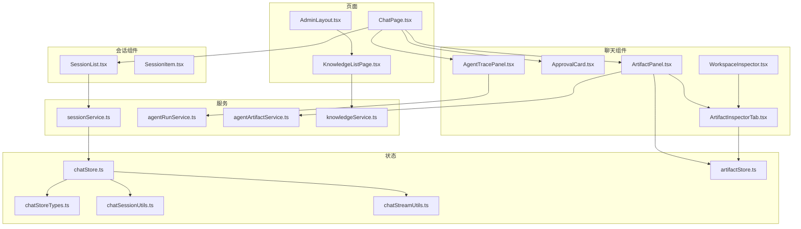
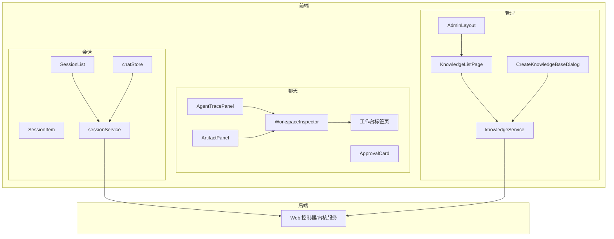
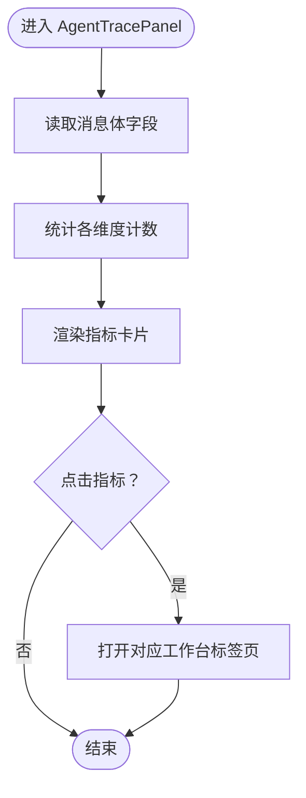
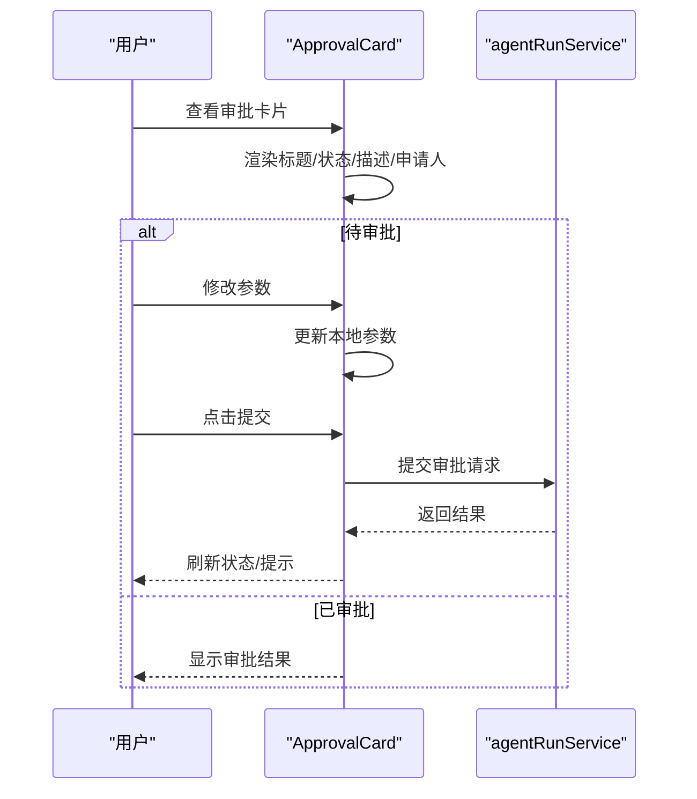
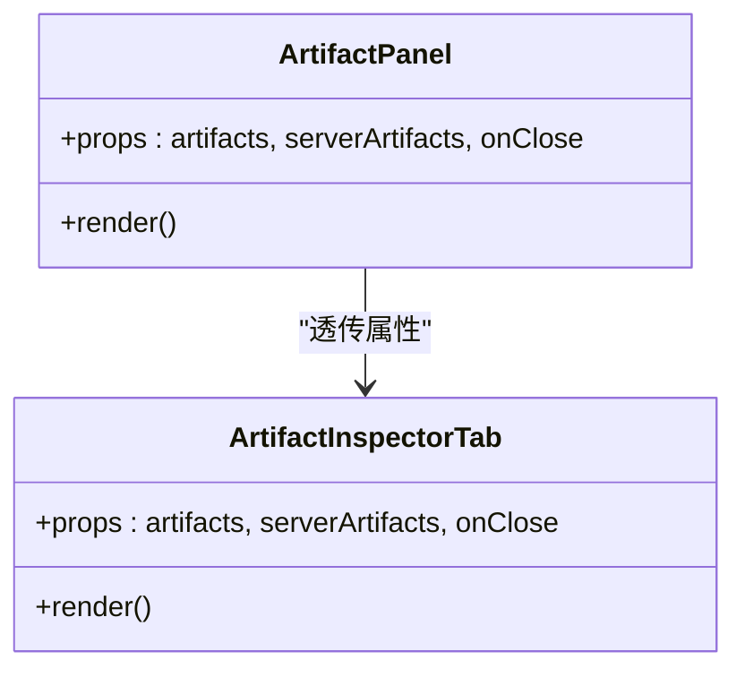
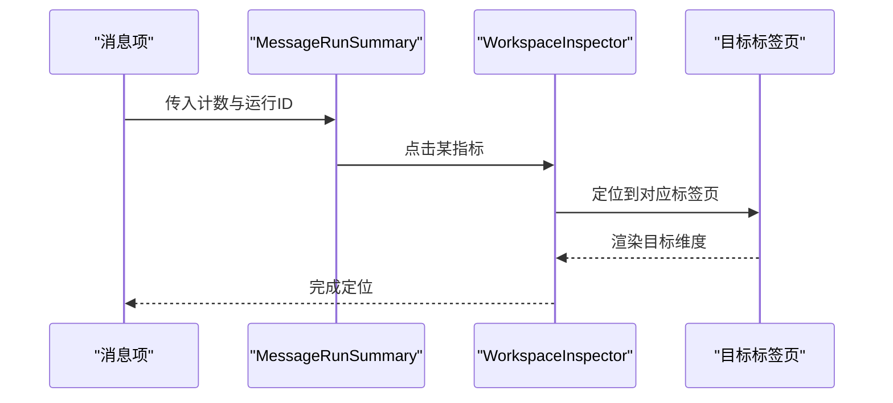
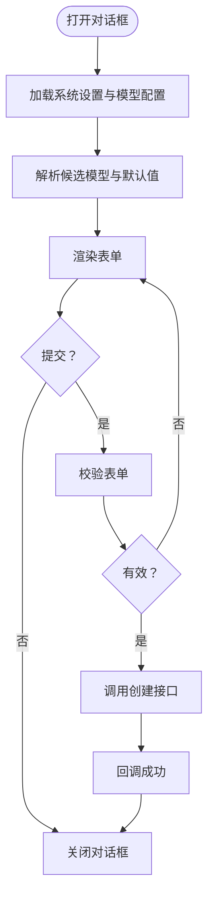
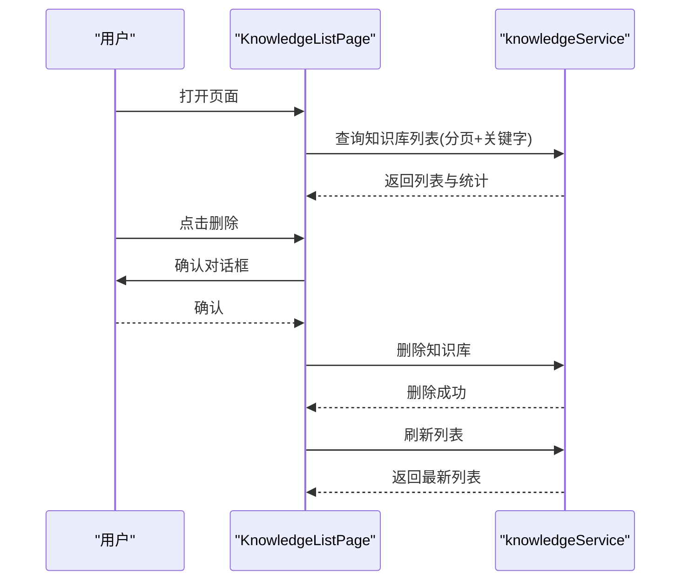
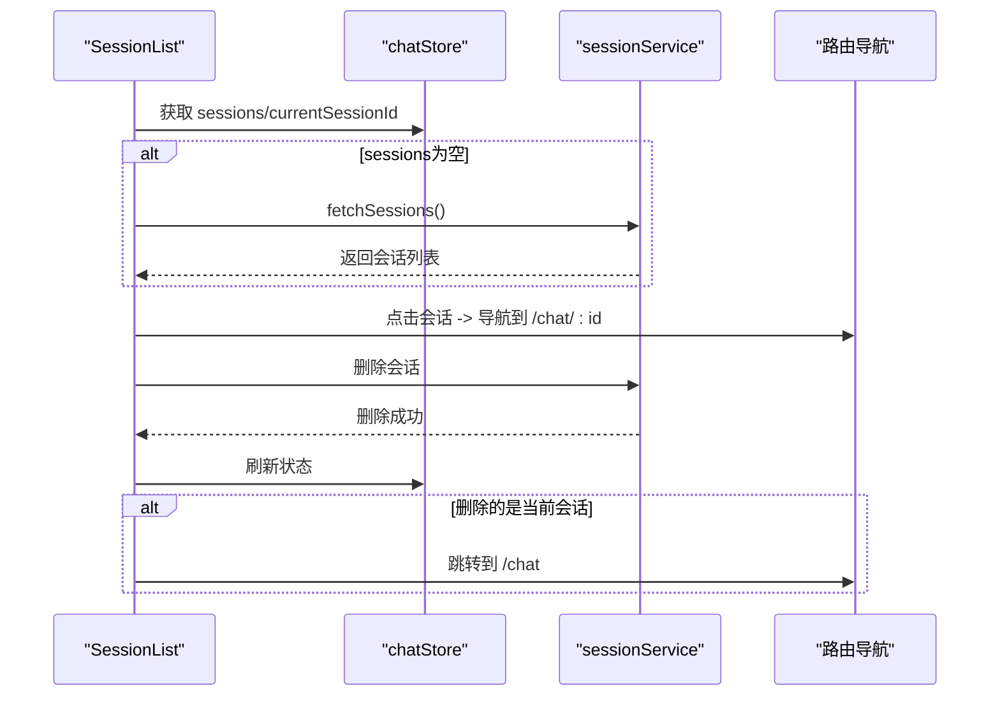
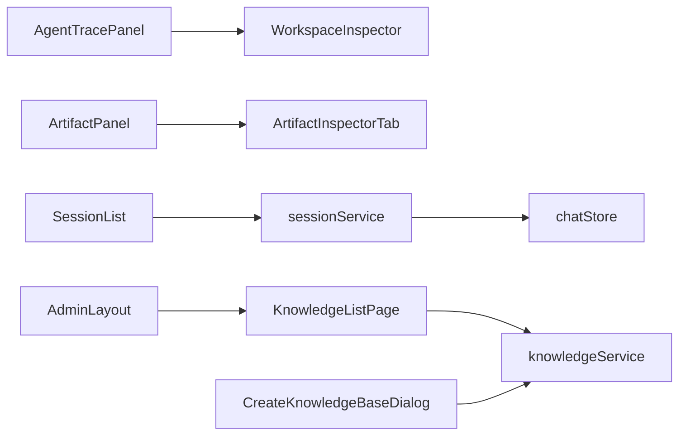

# 业务组件

<cite>
**本文引用的文件**
- [AgentTracePanel.tsx](file://frontend/src/components/chat/AgentTracePanel.tsx)
- [ApprovalCard.tsx](file://frontend/src/components/chat/ApprovalCard.tsx)
- [ArtifactPanel.tsx](file://frontend/src/components/chat/ArtifactPanel.tsx)
- [ArtifactInspectorTab.tsx](file://frontend/src/components/chat/workbench/ArtifactInspectorTab.tsx)
- [WorkspaceInspector.tsx](file://frontend/src/components/chat/workbench/WorkspaceInspector.tsx)
- [ApprovalsInspectorTab.tsx](file://frontend/src/components/chat/workbench/ApprovalsInspectorTab.tsx)
- [TimelineInspectorTab.tsx](file://frontend/src/components/chat/workbench/TimelineInspectorTab.tsx)
- [SourcesInspectorTab.tsx](file://frontend/src/components/chat/workbench/SourcesInspectorTab.tsx)
- [CostQuotaInspectorTab.tsx](file://frontend/src/components/chat/workbench/CostQuotaInspectorTab.tsx)
- [MemoryInspectorTab.tsx](file://frontend/src/components/chat/workbench/MemoryInspectorTab.tsx)
- [MessageRunSummary.tsx](file://frontend/src/components/chat/workbench/MessageRunSummary.tsx)
- [CreateKnowledgeBaseDialog.tsx](file://frontend/src/components/admin/CreateKnowledgeBaseDialog.tsx)
- [KnowledgeListPage.tsx](file://frontend/src/pages/admin/knowledge/KnowledgeListPage.tsx)
- [AdminLayout.tsx](file://frontend/src/pages/admin/AdminLayout.tsx)
- [SessionList.tsx](file://frontend/src/components/session/SessionList.tsx)
- [SessionItem.tsx](file://frontend/src/components/session/SessionItem.tsx)
- [sessionService.ts](file://frontend/src/services/sessionService.ts)
- [ChatPage.tsx](file://frontend/src/pages/ChatPage.tsx)
- [Sidebar.tsx](file://frontend/src/components/layout/Sidebar.tsx)
- [chatStore.ts](file://frontend/src/stores/chatStore.ts)
- [chatStoreTypes.ts](file://frontend/src/stores/chatStoreTypes.ts)
- [chatSessionUtils.ts](file://frontend/src/stores/chatSessionUtils.ts)
- [chatStreamUtils.ts](file://frontend/src/stores/chatStreamUtils.ts)
- [artifactStore.ts](file://frontend/src/stores/artifactStore.ts)
- [agentArtifactService.ts](file://frontend/src/services/agentArtifactService.ts)
- [agentRunService.ts](file://frontend/src/services/agentRunService.ts)
- [knowledgeService.ts](file://frontend/src/services/knowledgeService.ts)
- [2026-05-29-agent-workbench-ui-upgrade.md](file://docs/superpowers/plans/2026-05-29-agent-workbench-ui-upgrade.md)
- [会话管理应用服务.md](file://docs/zh/content/后端系统/核心内核/应用服务层/会话管理应用服务.md)
</cite>

## 目录
1. [引言](#引言)
2. [项目结构](#项目结构)
3. [核心组件](#核心组件)
4. [架构总览](#架构总览)
5. [详细组件分析](#详细组件分析)
6. [依赖关系分析](#依赖关系分析)
7. [性能考量](#性能考量)
8. [故障排查指南](#故障排查指南)
9. [结论](#结论)
10. [附录](#附录)

## 引言
本文件面向Seahorse Agent业务组件，围绕聊天组件（AgentTracePanel、ApprovalCard、ArtifactPanel等）、管理员组件（CreateKnowledgeBaseDialog等）与会话组件（SessionItem、SessionList等）进行系统化技术文档梳理。重点阐述各组件的职责边界、功能特性、数据流与状态同步机制，并提供配置参数、事件处理与生命周期管理方案，以及扩展开发与自定义组件创建指南。

## 项目结构
前端采用按功能域分层的组织方式：
- 组件层：chat、admin、session、common、layout、ui 等
- 页面层：pages 下按功能域划分页面
- 服务层：services 封装后端API调用
- 状态层：stores 管理全局与局部状态
- 工具与类型：lib、types、utils 提供通用能力与类型定义

图表来源
- [ChatPage.tsx:1-200](file://frontend/src/pages/ChatPage.tsx#L1-L200)
- [AdminLayout.tsx:1-200](file://frontend/src/pages/admin/AdminLayout.tsx#L1-L200)
- [KnowledgeListPage.tsx:1-200](file://frontend/src/pages/admin/knowledge/KnowledgeListPage.tsx#L1-L200)
- [AgentTracePanel.tsx:1-200](file://frontend/src/components/chat/AgentTracePanel.tsx#L1-L200)
- [ApprovalCard.tsx:1-200](file://frontend/src/components/chat/ApprovalCard.tsx#L1-L200)
- [ArtifactPanel.tsx:1-50](file://frontend/src/components/chat/ArtifactPanel.tsx#L1-L50)
- [ArtifactInspectorTab.tsx:1-200](file://frontend/src/components/chat/workbench/ArtifactInspectorTab.tsx#L1-L200)
- [WorkspaceInspector.tsx:1-200](file://frontend/src/components/chat/workbench/WorkspaceInspector.tsx#L1-L200)
- [SessionList.tsx:1-120](file://frontend/src/components/session/SessionList.tsx#L1-L120)
- [SessionItem.tsx:1-120](file://frontend/src/components/session/SessionItem.tsx#L1-L120)
- [sessionService.ts:1-120](file://frontend/src/services/sessionService.ts#L1-L120)
- [agentRunService.ts:1-200](file://frontend/src/services/agentRunService.ts#L1-L200)
- [agentArtifactService.ts:1-200](file://frontend/src/services/agentArtifactService.ts#L1-L200)
- [knowledgeService.ts:1-200](file://frontend/src/services/knowledgeService.ts#L1-L200)
- [chatStore.ts:1-200](file://frontend/src/stores/chatStore.ts#L1-L200)
- [chatStoreTypes.ts:1-200](file://frontend/src/stores/chatStoreTypes.ts#L1-L200)
- [chatSessionUtils.ts:1-200](file://frontend/src/stores/chatSessionUtils.ts#L1-L200)
- [chatStreamUtils.ts:1-200](file://frontend/src/stores/chatStreamUtils.ts#L1-L200)
- [artifactStore.ts:1-200](file://frontend/src/stores/artifactStore.ts#L1-L200)

章节来源
- [ChatPage.tsx:1-200](file://frontend/src/pages/ChatPage.tsx#L1-L200)
- [AdminLayout.tsx:1-200](file://frontend/src/pages/admin/AdminLayout.tsx#L1-L200)
- [KnowledgeListPage.tsx:1-200](file://frontend/src/pages/admin/knowledge/KnowledgeListPage.tsx#L1-L200)

## 核心组件
本节从职责边界与功能特性角度，概览三大类业务组件：

- 聊天组件
  - AgentTracePanel：展示一次Agent运行的全链路轨迹（时间线、来源、工件、审批、成本、内存等），作为工作台入口聚合多标签页。
  - ApprovalCard：呈现单条审批请求的状态、描述、申请人等信息，支持输入参数修改并提交审批。
  - ArtifactPanel：封装工件面板，统一接入工作台中的工件标签页。
  - 工作台标签页：Timeline、Sources、Approvals、Cost、Memory等，分别承载对应维度的明细与交互。
  - WorkspaceInspector：作为工作台容器，根据消息体动态统计并渲染各标签页计数，提供统一的侧边面板体验。

- 管理员组件
  - CreateKnowledgeBaseDialog：创建知识库的表单对话框，异步加载嵌入模型候选集，校验并提交创建请求。
  - KnowledgeListPage：知识库列表页面，支持分页查询、重命名、删除、统计信息展示与创建弹窗联动。
  - AdminLayout：管理后台布局，提供菜单导航、用户操作、知识库检索与跳转。

- 会话组件
  - SessionList：会话列表组件，自动拉取会话列表，支持选择与删除；删除当前会话时自动跳转至聊天页。
  - SessionItem：单个会话项，支持删除确认弹窗、键盘交互与高亮状态。

章节来源
- [AgentTracePanel.tsx:1-200](file://frontend/src/components/chat/AgentTracePanel.tsx#L1-L200)
- [ApprovalCard.tsx:1-200](file://frontend/src/components/chat/ApprovalCard.tsx#L1-L200)
- [ArtifactPanel.tsx:1-50](file://frontend/src/components/chat/ArtifactPanel.tsx#L1-L50)
- [ArtifactInspectorTab.tsx:1-200](file://frontend/src/components/chat/workbench/ArtifactInspectorTab.tsx#L1-L200)
- [WorkspaceInspector.tsx:1-200](file://frontend/src/components/chat/workbench/WorkspaceInspector.tsx#L1-L200)
- [ApprovalsInspectorTab.tsx:1-200](file://frontend/src/components/chat/workbench/ApprovalsInspectorTab.tsx#L1-L200)
- [TimelineInspectorTab.tsx:1-200](file://frontend/src/components/chat/workbench/TimelineInspectorTab.tsx#L1-L200)
- [SourcesInspectorTab.tsx:1-200](file://frontend/src/components/chat/workbench/SourcesInspectorTab.tsx#L1-L200)
- [CostQuotaInspectorTab.tsx:1-200](file://frontend/src/components/chat/workbench/CostQuotaInspectorTab.tsx#L1-L200)
- [MemoryInspectorTab.tsx:1-200](file://frontend/src/components/chat/workbench/MemoryInspectorTab.tsx#L1-L200)
- [MessageRunSummary.tsx:1-200](file://frontend/src/components/chat/workbench/MessageRunSummary.tsx#L1-L200)
- [CreateKnowledgeBaseDialog.tsx:1-200](file://frontend/src/components/admin/CreateKnowledgeBaseDialog.tsx#L1-L200)
- [KnowledgeListPage.tsx:1-200](file://frontend/src/pages/admin/knowledge/KnowledgeListPage.tsx#L1-L200)
- [AdminLayout.tsx:1-200](file://frontend/src/pages/admin/AdminLayout.tsx#L1-L200)
- [SessionList.tsx:1-120](file://frontend/src/components/session/SessionList.tsx#L1-L120)
- [SessionItem.tsx:1-120](file://frontend/src/components/session/SessionItem.tsx#L1-L120)

## 架构总览
聊天组件与会话组件通过服务层与状态层解耦，管理员组件独立于聊天主流程，三者共同构成完整的业务闭环。

图表来源
- [AgentTracePanel.tsx:1-200](file://frontend/src/components/chat/AgentTracePanel.tsx#L1-L200)
- [ApprovalCard.tsx:1-200](file://frontend/src/components/chat/ApprovalCard.tsx#L1-L200)
- [ArtifactPanel.tsx:1-50](file://frontend/src/components/chat/ArtifactPanel.tsx#L1-L50)
- [WorkspaceInspector.tsx:1-200](file://frontend/src/components/chat/workbench/WorkspaceInspector.tsx#L1-L200)
- [SessionList.tsx:1-120](file://frontend/src/components/session/SessionList.tsx#L1-L120)
- [sessionService.ts:1-120](file://frontend/src/services/sessionService.ts#L1-L120)
- [chatStore.ts:1-200](file://frontend/src/stores/chatStore.ts#L1-L200)
- [KnowledgeListPage.tsx:1-200](file://frontend/src/pages/admin/knowledge/KnowledgeListPage.tsx#L1-L200)
- [CreateKnowledgeBaseDialog.tsx:1-200](file://frontend/src/components/admin/CreateKnowledgeBaseDialog.tsx#L1-L200)
- [knowledgeService.ts:1-200](file://frontend/src/services/knowledgeService.ts#L1-L200)
- [AdminLayout.tsx:1-200](file://frontend/src/pages/admin/AdminLayout.tsx#L1-L200)

## 详细组件分析

### 聊天组件

#### AgentTracePanel：运行轨迹面板
- 职责边界
  - 聚合一次Agent运行的多维信息（时间线、来源、工件、审批、成本、内存等）。
  - 作为工作台入口，根据消息体动态统计各维度数量，提供快速跳转。
- 功能特性
  - 读取消息体中的工件、时间线、来源、审批、内存、成本等字段，计算计数并渲染。
  - 与工作台标签页联动，点击指标打开对应标签页。
- 数据流与状态
  - 输入：消息对象（包含运行ID、工件、时间线、来源、审批、内存、成本等）。
  - 输出：打开工作台并定位到相应标签页。
- 生命周期
  - 组件挂载时读取消息体并初始化计数；当消息变化时重新计算。
- 扩展点
  - 新增维度时，在统计处增加计数并在标签页映射中补充对应tab。

图表来源
- [AgentTracePanel.tsx:1-200](file://frontend/src/components/chat/AgentTracePanel.tsx#L1-L200)
- [WorkspaceInspector.tsx:1-200](file://frontend/src/components/chat/workbench/WorkspaceInspector.tsx#L1-L200)
- [2026-05-29-agent-workbench-ui-upgrade.md:570-610](file://docs/superpowers/plans/2026-05-29-agent-workbench-ui-upgrade.md#L570-L610)

章节来源
- [AgentTracePanel.tsx:1-200](file://frontend/src/components/chat/AgentTracePanel.tsx#L1-L200)
- [WorkspaceInspector.tsx:1-200](file://frontend/src/components/chat/workbench/WorkspaceInspector.tsx#L1-L200)
- [2026-05-29-agent-workbench-ui-upgrade.md:570-610](file://docs/superpowers/plans/2026-05-29-agent-workbench-ui-upgrade.md#L570-L610)

#### ApprovalCard：审批卡片
- 职责边界
  - 展示单条审批请求的标题、状态、描述、申请人等信息。
  - 在待审批状态下允许编辑参数并提交审批。
- 功能特性
  - 渲染状态徽章与描述文本。
  - 待审批时提供参数编辑区与提交按钮。
- 数据流与状态
  - 输入：审批对象（包含标题、状态、描述、请求人、参数等）。
  - 输出：更新参数或提交审批请求。
- 生命周期
  - 组件挂载时读取审批对象；参数变更时本地缓存；提交成功后回调父组件。
- 扩展点
  - 支持更多审批状态与操作按钮；支持审批历史查看。

图表来源
- [ApprovalCard.tsx:1-200](file://frontend/src/components/chat/ApprovalCard.tsx#L1-L200)
- [agentRunService.ts:1-200](file://frontend/src/services/agentRunService.ts#L1-L200)

章节来源
- [ApprovalCard.tsx:1-200](file://frontend/src/components/chat/ApprovalCard.tsx#L1-L200)
- [agentRunService.ts:1-200](file://frontend/src/services/agentRunService.ts#L1-L200)

#### ArtifactPanel：工件面板
- 职责边界
  - 将工件集合与服务器端工件统一接入工作台的工件标签页。
- 功能特性
  - 接收工件块与服务器端工件数组，透传给工件标签页组件。
- 数据流与状态
  - 输入：工件块数组与服务器端工件数组。
  - 输出：触发工作台工件标签页渲染。
- 生命周期
  - 组件挂载时接收props并渲染；props变化时重新渲染。
- 扩展点
  - 支持更多工件类型与渲染器；支持批量操作与导出。

图表来源
- [ArtifactPanel.tsx:1-50](file://frontend/src/components/chat/ArtifactPanel.tsx#L1-L50)
- [ArtifactInspectorTab.tsx:1-200](file://frontend/src/components/chat/workbench/ArtifactInspectorTab.tsx#L1-L200)

章节来源
- [ArtifactPanel.tsx:1-50](file://frontend/src/components/chat/ArtifactPanel.tsx#L1-L50)
- [ArtifactInspectorTab.tsx:1-200](file://frontend/src/components/chat/workbench/ArtifactInspectorTab.tsx#L1-L200)

#### 工作台标签页与MessageRunSummary
- 职责边界
  - Timeline：展示Agent执行步骤与时间线。
  - Sources：展示引用来源列表。
  - Approvals：展示审批请求与状态。
  - Cost：展示成本与配额信息。
  - Memory：展示记忆片段与关联。
  - MessageRunSummary：在消息中展示运行摘要（步骤、来源、工件、审批、成本、记忆计数），点击计数打开对应标签页。
- 功能特性
  - 每个标签页独立渲染对应维度的明细。
  - MessageRunSummary提供图标按钮与标签，点击即打开对应标签页。
- 数据流与状态
  - 输入：消息体中的对应字段（steps/sources/artifacts/approvals/cost/memories）。
  - 输出：打开对应标签页并定位到该消息。
- 生命周期
  - 组件挂载时读取消息体并渲染；消息变化时重新渲染。
- 扩展点
  - 新增标签页时需在MessageRunSummary中补充tab映射。

图表来源
- [MessageRunSummary.tsx:1-200](file://frontend/src/components/chat/workbench/MessageRunSummary.tsx#L1-L200)
- [WorkspaceInspector.tsx:1-200](file://frontend/src/components/chat/workbench/WorkspaceInspector.tsx#L1-L200)
- [2026-05-29-agent-workbench-ui-upgrade.md:570-610](file://docs/superpowers/plans/2026-05-29-agent-workbench-ui-upgrade.md#L570-L610)

章节来源
- [MessageRunSummary.tsx:1-200](file://frontend/src/components/chat/workbench/MessageRunSummary.tsx#L1-L200)
- [WorkspaceInspector.tsx:1-200](file://frontend/src/components/chat/workbench/WorkspaceInspector.tsx#L1-L200)
- [TimelineInspectorTab.tsx:1-200](file://frontend/src/components/chat/workbench/TimelineInspectorTab.tsx#L1-L200)
- [SourcesInspectorTab.tsx:1-200](file://frontend/src/components/chat/workbench/SourcesInspectorTab.tsx#L1-L200)
- [ApprovalsInspectorTab.tsx:1-200](file://frontend/src/components/chat/workbench/ApprovalsInspectorTab.tsx#L1-L200)
- [CostQuotaInspectorTab.tsx:1-200](file://frontend/src/components/chat/workbench/CostQuotaInspectorTab.tsx#L1-L200)
- [MemoryInspectorTab.tsx:1-200](file://frontend/src/components/chat/workbench/MemoryInspectorTab.tsx#L1-L200)
- [2026-05-29-agent-workbench-ui-upgrade.md:570-610](file://docs/superpowers/plans/2026-05-29-agent-workbench-ui-upgrade.md#L570-L610)

### 管理员组件

#### CreateKnowledgeBaseDialog：创建知识库对话框
- 职责边界
  - 提供创建知识库的表单，异步加载嵌入模型候选集，完成校验与提交。
- 功能特性
  - 表单字段：名称、嵌入模型、集合名。
  - 加载系统设置与AI模型配置，解析候选模型并默认值。
  - 提交成功后回调父组件。
- 数据流与状态
  - 输入：open、onOpenChange、onSuccess。
  - 输出：创建成功回调。
- 生命周期
  - 打开时加载模型候选集；关闭时清理状态。
- 扩展点
  - 支持更多配置项与校验规则；支持模板选择。

图表来源
- [CreateKnowledgeBaseDialog.tsx:1-200](file://frontend/src/components/admin/CreateKnowledgeBaseDialog.tsx#L1-L200)
- [knowledgeService.ts:1-200](file://frontend/src/services/knowledgeService.ts#L1-L200)

章节来源
- [CreateKnowledgeBaseDialog.tsx:1-200](file://frontend/src/components/admin/CreateKnowledgeBaseDialog.tsx#L1-L200)
- [knowledgeService.ts:1-200](file://frontend/src/services/knowledgeService.ts#L1-L200)

#### KnowledgeListPage：知识库列表页
- 职责边界
  - 展示知识库列表，支持分页、搜索、重命名、删除、统计信息。
- 功能特性
  - 分页加载知识库列表与统计信息。
  - 删除前确认，删除成功后刷新列表。
  - 重命名弹窗与创建对话框联动。
- 数据流与状态
  - 输入：路由参数（名称关键字）、分页参数。
  - 输出：列表数据、统计信息、操作结果。
- 生命周期
  - 组件挂载时根据URL参数初始化搜索条件；分页变化时重新加载。
- 扩展点
  - 支持更多筛选条件与排序；支持批量操作。

图表来源
- [KnowledgeListPage.tsx:1-200](file://frontend/src/pages/admin/knowledge/KnowledgeListPage.tsx#L1-L200)
- [knowledgeService.ts:1-200](file://frontend/src/services/knowledgeService.ts#L1-L200)

章节来源
- [KnowledgeListPage.tsx:1-200](file://frontend/src/pages/admin/knowledge/KnowledgeListPage.tsx#L1-L200)
- [knowledgeService.ts:1-200](file://frontend/src/services/knowledgeService.ts#L1-L200)

#### AdminLayout：管理后台布局
- 职责边界
  - 提供管理后台导航菜单、用户操作、知识库检索与跳转。
- 功能特性
  - 菜单展开/收起、用户下拉菜单、密码修改弹窗。
  - 知识库搜索与跳转。
- 数据流与状态
  - 输入：路由与权限控制。
  - 输出：菜单项点击与页面跳转。
- 生命周期
  - 组件挂载时初始化菜单状态与用户信息。
- 扩展点
  - 支持更多菜单项与权限控制。

章节来源
- [AdminLayout.tsx:1-200](file://frontend/src/pages/admin/AdminLayout.tsx#L1-L200)

### 会话组件

#### SessionList：会话列表
- 职责边界
  - 自动拉取会话列表，支持选择与删除；删除当前会话时自动跳转至聊天页。
- 功能特性
  - 首次进入时拉取会话列表；渲染每个会话项；处理选择与删除。
- 数据流与状态
  - 输入：onSelect回调。
  - 输出：选择会话并导航到聊天页；删除后刷新列表。
- 生命周期
  - 组件挂载时若为空则拉取；每次sessions变化时重新渲染。
- 扩展点
  - 支持更多排序与筛选；支持批量删除。

图表来源
- [SessionList.tsx:1-120](file://frontend/src/components/session/SessionList.tsx#L1-L120)
- [sessionService.ts:1-120](file://frontend/src/services/sessionService.ts#L1-L120)
- [chatStore.ts:1-200](file://frontend/src/stores/chatStore.ts#L1-L200)
- [会话管理应用服务.md:274-308](file://docs/zh/content/后端系统/核心内核/应用服务层/会话管理应用服务.md#L274-L308)

章节来源
- [SessionList.tsx:1-120](file://frontend/src/components/session/SessionList.tsx#L1-L120)
- [sessionService.ts:1-120](file://frontend/src/services/sessionService.ts#L1-L120)
- [chatStore.ts:1-200](file://frontend/src/stores/chatStore.ts#L1-L200)
- [会话管理应用服务.md:274-308](file://docs/zh/content/后端系统/核心内核/应用服务层/会话管理应用服务.md#L274-L308)

#### SessionItem：会话项
- 职责边界
  - 单个会话项渲染，支持删除确认弹窗、键盘交互与高亮状态。
- 功能特性
  - 渲染标题与最后时间；支持删除确认；支持回车键选择。
- 数据流与状态
  - 输入：session、active、onSelect、onDelete。
  - 输出：选择与删除回调。
- 生命周期
  - 组件挂载时渲染；props变化时更新UI。
- 扩展点
  - 支持更多元信息展示（如状态徽章）。

章节来源
- [SessionItem.tsx:1-120](file://frontend/src/components/session/SessionItem.tsx#L1-L120)

## 依赖关系分析
- 组件耦合
  - 聊天组件之间通过消息体字段与工作台标签页建立弱耦合，便于扩展新的维度。
  - 会话组件通过服务层与状态层解耦，避免直接依赖后端控制器。
  - 管理员组件独立于聊天主流程，仅依赖知识库服务。
- 外部依赖
  - 服务层封装HTTP请求，统一错误处理与加载状态。
  - 状态层集中管理会话与聊天流式数据，减少跨组件重复逻辑。
- 循环依赖
  - 通过服务层与状态层作为中介，避免组件间的循环依赖。

图表来源
- [AgentTracePanel.tsx:1-200](file://frontend/src/components/chat/AgentTracePanel.tsx#L1-L200)
- [ArtifactPanel.tsx:1-50](file://frontend/src/components/chat/ArtifactPanel.tsx#L1-L50)
- [ArtifactInspectorTab.tsx:1-200](file://frontend/src/components/chat/workbench/ArtifactInspectorTab.tsx#L1-L200)
- [WorkspaceInspector.tsx:1-200](file://frontend/src/components/chat/workbench/WorkspaceInspector.tsx#L1-L200)
- [SessionList.tsx:1-120](file://frontend/src/components/session/SessionList.tsx#L1-L120)
- [sessionService.ts:1-120](file://frontend/src/services/sessionService.ts#L1-L120)
- [chatStore.ts:1-200](file://frontend/src/stores/chatStore.ts#L1-L200)
- [KnowledgeListPage.tsx:1-200](file://frontend/src/pages/admin/knowledge/KnowledgeListPage.tsx#L1-L200)
- [CreateKnowledgeBaseDialog.tsx:1-200](file://frontend/src/components/admin/CreateKnowledgeBaseDialog.tsx#L1-L200)
- [knowledgeService.ts:1-200](file://frontend/src/services/knowledgeService.ts#L1-L200)
- [AdminLayout.tsx:1-200](file://frontend/src/pages/admin/AdminLayout.tsx#L1-L200)

## 性能考量
- 渲染优化
  - 使用React.memo与key稳定化避免不必要的重渲染（会话列表与消息列表）。
  - 工作台标签页按需渲染，仅在打开时加载数据。
- 网络优化
  - 服务层统一处理加载状态与错误提示，避免重复请求。
  - 分页加载与懒加载策略降低首屏压力。
- 状态优化
  - chatStore集中管理会话与流式数据，减少跨组件状态同步成本。
  - artifactStore与chatStreamUtils分离工件与流式处理，提升可维护性。

## 故障排查指南
- 会话列表不刷新
  - 检查服务层是否正确返回数据；确认状态层是否更新了currentSessionId。
  - 关注删除当前会话后的导航逻辑是否触发。
- 工作台标签页空白
  - 检查消息体中对应字段是否存在；确认tab映射是否完整。
- 审批提交失败
  - 检查参数校验与网络请求状态；查看agentRunService的错误处理。
- 知识库创建失败
  - 检查模型候选集加载是否成功；确认表单校验规则与后端接口返回。

章节来源
- [SessionList.tsx:1-120](file://frontend/src/components/session/SessionList.tsx#L1-L120)
- [sessionService.ts:1-120](file://frontend/src/services/sessionService.ts#L1-L120)
- [chatStore.ts:1-200](file://frontend/src/stores/chatStore.ts#L1-L200)
- [WorkspaceInspector.tsx:1-200](file://frontend/src/components/chat/workbench/WorkspaceInspector.tsx#L1-L200)
- [ApprovalCard.tsx:1-200](file://frontend/src/components/chat/ApprovalCard.tsx#L1-L200)
- [agentRunService.ts:1-200](file://frontend/src/services/agentRunService.ts#L1-L200)
- [CreateKnowledgeBaseDialog.tsx:1-200](file://frontend/src/components/admin/CreateKnowledgeBaseDialog.tsx#L1-L200)
- [knowledgeService.ts:1-200](file://frontend/src/services/knowledgeService.ts#L1-L200)

## 结论
本文档系统梳理了Seahorse Agent的聊天、管理员与会话三大业务组件，明确了职责边界、数据流与状态同步机制，并提供了扩展开发与自定义组件创建指南。通过服务层与状态层的解耦设计，组件具备良好的可维护性与可扩展性，能够支撑后续功能演进与定制化需求。

## 附录

### 组件配置参数与事件处理
- AgentTracePanel
  - 参数：artifacts、serverArtifacts、onClose
  - 事件：打开工作台标签页
- ApprovalCard
  - 参数：approval、onSubmit
  - 事件：提交审批、修改参数
- ArtifactPanel
  - 参数：artifacts、serverArtifacts、onClose
  - 事件：打开工件标签页
- CreateKnowledgeBaseDialog
  - 参数：open、onOpenChange、onSuccess
  - 事件：创建成功回调
- SessionList
  - 参数：onSelect
  - 事件：选择会话、删除会话
- SessionItem
  - 参数：session、active、onSelect、onDelete
  - 事件：选择、删除

章节来源
- [AgentTracePanel.tsx:1-200](file://frontend/src/components/chat/AgentTracePanel.tsx#L1-L200)
- [ApprovalCard.tsx:1-200](file://frontend/src/components/chat/ApprovalCard.tsx#L1-L200)
- [ArtifactPanel.tsx:1-50](file://frontend/src/components/chat/ArtifactPanel.tsx#L1-L50)
- [CreateKnowledgeBaseDialog.tsx:1-200](file://frontend/src/components/admin/CreateKnowledgeBaseDialog.tsx#L1-L200)
- [SessionList.tsx:1-120](file://frontend/src/components/session/SessionList.tsx#L1-L120)
- [SessionItem.tsx:1-120](file://frontend/src/components/session/SessionItem.tsx#L1-L120)

### 生命周期管理方案
- 组件挂载：加载初始数据（模型候选集、会话列表、消息体）。
- 组件更新：监听props变化与状态变化，必要时重新渲染或发起请求。
- 组件卸载：清理定时器、取消未完成请求、释放资源。
- 会话与聊天：通过chatStore集中管理，避免重复订阅与状态漂移。

章节来源
- [chatStore.ts:1-200](file://frontend/src/stores/chatStore.ts#L1-L200)
- [chatSessionUtils.ts:1-200](file://frontend/src/stores/chatSessionUtils.ts#L1-L200)
- [chatStreamUtils.ts:1-200](file://frontend/src/stores/chatStreamUtils.ts#L1-L200)
- [artifactStore.ts:1-200](file://frontend/src/stores/artifactStore.ts#L1-L200)

### 扩展开发指南与自定义组件创建
- 新增工作台标签页
  - 创建标签页组件并实现渲染逻辑。
  - 在MessageRunSummary中补充tab映射，确保点击可打开。
- 新增聊天组件
  - 明确输入输出与事件，遵循单一职责原则。
  - 通过消息体字段驱动渲染，避免强耦合。
- 新增管理员功能
  - 在AdminLayout中添加菜单项与路由。
  - 在知识库服务中新增接口调用与错误处理。
- 状态与服务
  - 优先通过chatStore与服务层抽象，避免跨组件直接通信。
  - 对于复杂状态，拆分为多个store模块（如artifactStore）以提升可维护性。

章节来源
- [MessageRunSummary.tsx:1-200](file://frontend/src/components/chat/workbench/MessageRunSummary.tsx#L1-L200)
- [WorkspaceInspector.tsx:1-200](file://frontend/src/components/chat/workbench/WorkspaceInspector.tsx#L1-L200)
- [AdminLayout.tsx:1-200](file://frontend/src/pages/admin/AdminLayout.tsx#L1-L200)
- [knowledgeService.ts:1-200](file://frontend/src/services/knowledgeService.ts#L1-L200)
- [chatStore.ts:1-200](file://frontend/src/stores/chatStore.ts#L1-L200)
- [artifactStore.ts:1-200](file://frontend/src/stores/artifactStore.ts#L1-L200)