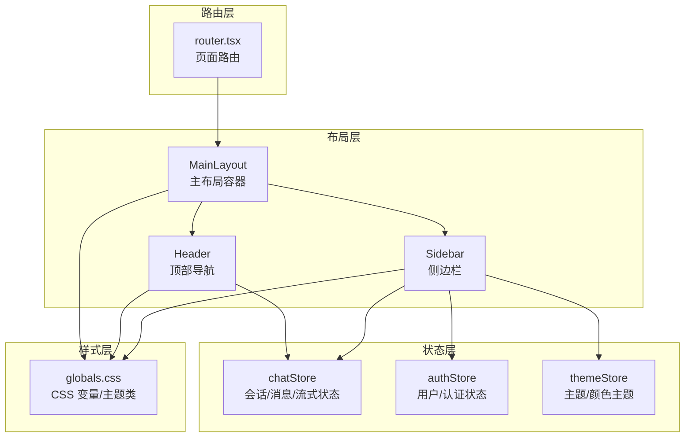
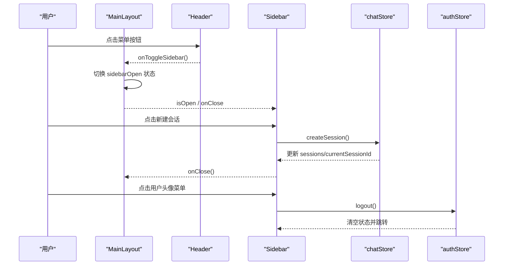
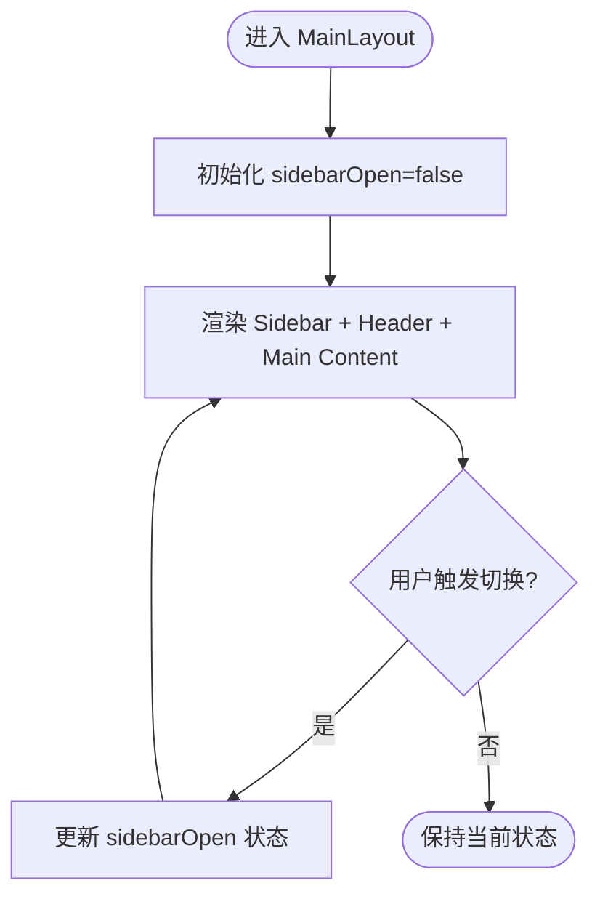
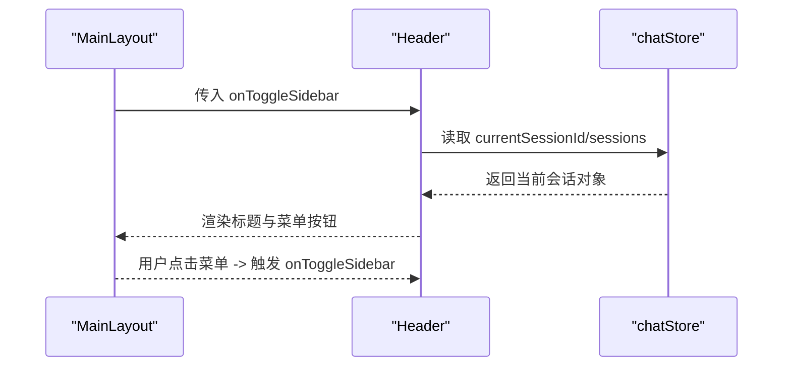
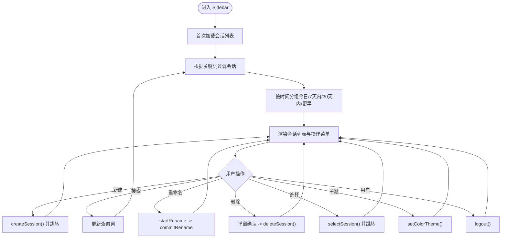
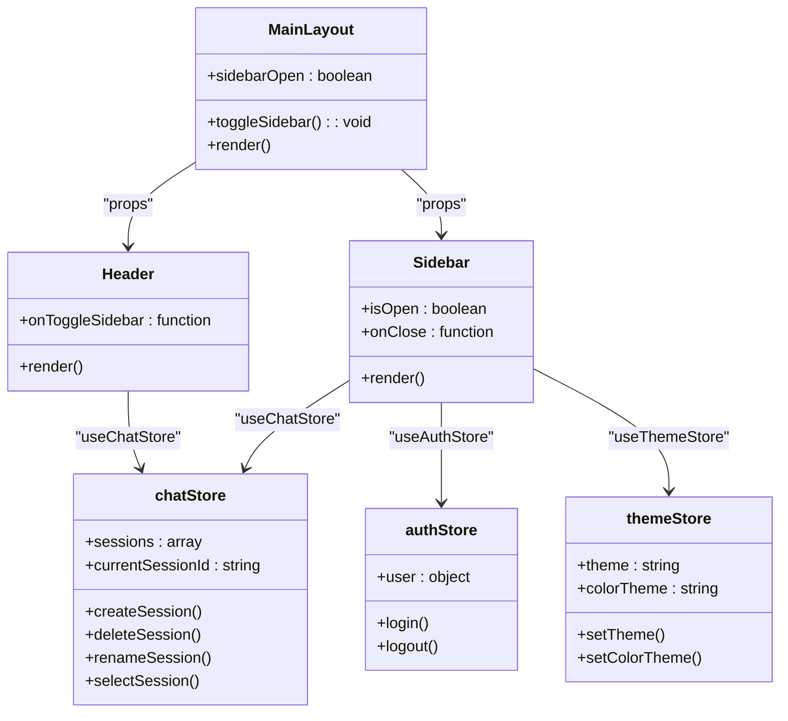
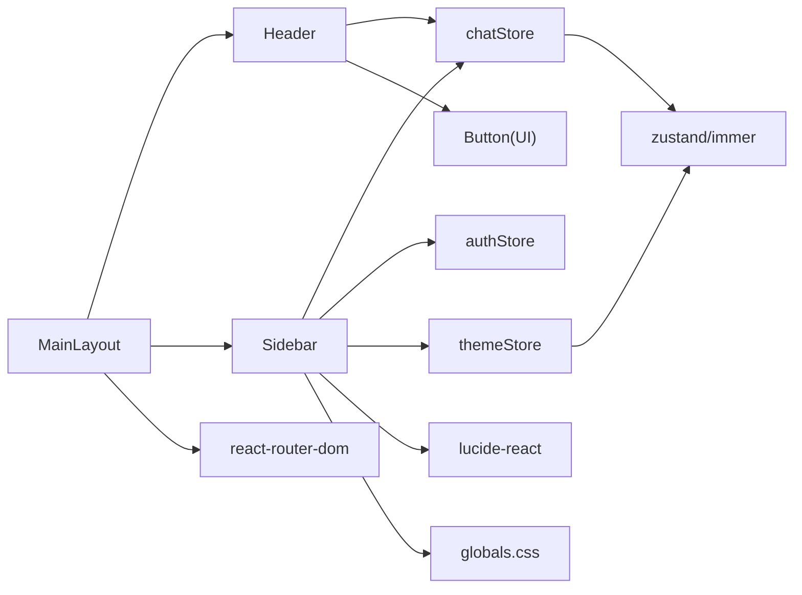

# 布局组件

<cite>
**本文引用的文件**
- [frontend/src/components/layout/Header.tsx](file://frontend/src/components/layout/Header.tsx)
- [frontend/src/components/layout/MainLayout.tsx](file://frontend/src/components/layout/MainLayout.tsx)
- [frontend/src/components/layout/Sidebar.tsx](file://frontend/src/components/layout/Sidebar.tsx)
- [frontend/src/stores/chatStore.ts](file://frontend/src/stores/chatStore.ts)
- [frontend/src/stores/authStore.ts](file://frontend/src/stores/authStore.ts)
- [frontend/src/stores/themeStore.ts](file://frontend/src/stores/themeStore.ts)
- [frontend/src/styles/globals.css](file://frontend/src/styles/globals.css)
- [frontend/src/router.tsx](file://frontend/src/router.tsx)
- [frontend/@/components/ui/button.tsx](file://frontend/@/components/ui/button.tsx)
</cite>

## 目录
1. [简介](#简介)
2. [项目结构](#项目结构)
3. [核心组件](#核心组件)
4. [架构总览](#架构总览)
5. [详细组件分析](#详细组件分析)
6. [依赖关系分析](#依赖关系分析)
7. [性能考量](#性能考量)
8. [故障排查指南](#故障排查指南)
9. [结论](#结论)
10. [附录](#附录)

## 简介
本文件面向开发者，系统化梳理 Seahorse Agent 前端布局组件体系，重点覆盖 Header、MainLayout、Sidebar 三大核心组件。文档从设计理念、职责划分、响应式与移动端适配、组件间通信与状态共享、主题与定制化配置、到使用示例与最佳实践进行完整说明，帮助团队快速理解并高效复用这些基础布局能力。

## 项目结构
布局组件位于前端工程的组件层，采用“按功能域分层 + 组件聚合”的组织方式：
- 布局组件集中于 src/components/layout，包含 Header、MainLayout、Sidebar 三个核心模块
- 状态管理通过 Zustand Store 实现，分别在 src/stores 下提供聊天会话、认证与主题状态
- 样式系统基于 Tailwind CSS 与 CSS 变量，主题变量集中在 src/styles/globals.css
- 路由层在 src/router.tsx 中定义页面级路由，布局组件作为页面容器承载业务页面

图表来源
- [frontend/src/components/layout/MainLayout.tsx:10-24](file://frontend/src/components/layout/MainLayout.tsx#L10-L24)
- [frontend/src/components/layout/Header.tsx:11-52](file://frontend/src/components/layout/Header.tsx#L11-L52)
- [frontend/src/components/layout/Sidebar.tsx:46-515](file://frontend/src/components/layout/Sidebar.tsx#L46-L515)
- [frontend/src/stores/chatStore.ts:45-437](file://frontend/src/stores/chatStore.ts#L45-L437)
- [frontend/src/stores/authStore.ts:24-119](file://frontend/src/stores/authStore.ts#L24-L119)
- [frontend/src/stores/themeStore.ts:48-75](file://frontend/src/stores/themeStore.ts#L48-L75)
- [frontend/src/styles/globals.css:39-518](file://frontend/src/styles/globals.css#L39-L518)
- [frontend/src/router.tsx:163-234](file://frontend/src/router.tsx#L163-L234)

章节来源
- [frontend/src/components/layout/MainLayout.tsx:10-24](file://frontend/src/components/layout/MainLayout.tsx#L10-L24)
- [frontend/src/components/layout/Header.tsx:11-52](file://frontend/src/components/layout/Header.tsx#L11-L52)
- [frontend/src/components/layout/Sidebar.tsx:46-515](file://frontend/src/components/layout/Sidebar.tsx#L46-L515)
- [frontend/src/stores/chatStore.ts:45-437](file://frontend/src/stores/chatStore.ts#L45-L437)
- [frontend/src/stores/authStore.ts:24-119](file://frontend/src/stores/authStore.ts#L24-L119)
- [frontend/src/stores/themeStore.ts:48-75](file://frontend/src/stores/themeStore.ts#L48-L75)
- [frontend/src/styles/globals.css:39-518](file://frontend/src/styles/globals.css#L39-L518)
- [frontend/src/router.tsx:163-234](file://frontend/src/router.tsx#L163-L234)

## 核心组件
- MainLayout：提供页面骨架容器，协调 Header 与 Sidebar 的布局与交互，统一承载页面主体内容
- Header：顶部导航区域，负责标题展示、侧边栏开关、外部链接入口等
- Sidebar：侧边栏导航与功能入口，包含会话列表、搜索、主题切换、用户菜单等

章节来源
- [frontend/src/components/layout/MainLayout.tsx:10-24](file://frontend/src/components/layout/MainLayout.tsx#L10-L24)
- [frontend/src/components/layout/Header.tsx:11-52](file://frontend/src/components/layout/Header.tsx#L11-L52)
- [frontend/src/components/layout/Sidebar.tsx:46-515](file://frontend/src/components/layout/Sidebar.tsx#L46-L515)

## 架构总览
布局组件围绕“容器-展示”分离与“状态外置”的模式构建：
- 容器组件（MainLayout）负责布局与状态桥接，持有侧边栏开合状态
- 展示组件（Header、Sidebar）通过 props 与全局状态协作，完成渲染与交互
- 全局状态（chatStore、authStore、themeStore）通过 hooks 在组件树中注入，避免跨层级传递

图表来源
- [frontend/src/components/layout/MainLayout.tsx:11-17](file://frontend/src/components/layout/MainLayout.tsx#L11-L17)
- [frontend/src/components/layout/Header.tsx:22-30](file://frontend/src/components/layout/Header.tsx#L22-L30)
- [frontend/src/components/layout/Sidebar.tsx:201-222](file://frontend/src/components/layout/Sidebar.tsx#L201-L222)
- [frontend/src/stores/chatStore.ts:78-133](file://frontend/src/stores/chatStore.ts#L78-L133)
- [frontend/src/stores/authStore.ts:68-93](file://frontend/src/stores/authStore.ts#L68-L93)

## 详细组件分析

### MainLayout 组件
- 职责
  - 提供页面骨架容器，统一背景与高度约束
  - 管理侧边栏开合状态，并向子组件传递控制回调
  - 承载页面主体内容区域，保证内容自适应与溢出处理
- 关键点
  - 使用 useState 维护 sidebarOpen 状态
  - 将 children 作为页面主体内容传入
  - 通过 CSS 变量统一背景与玻璃效果

图表来源
- [frontend/src/components/layout/MainLayout.tsx:11-22](file://frontend/src/components/layout/MainLayout.tsx#L11-L22)

章节来源
- [frontend/src/components/layout/MainLayout.tsx:10-24](file://frontend/src/components/layout/MainLayout.tsx#L10-L24)

### Header 组件
- 职责
  - 显示当前会话标题或默认文案
  - 提供侧边栏开关按钮（移动端）
  - 提供外部链接入口（如 GitHub）
- 关键点
  - 从 chatStore 获取当前会话信息，动态展示标题
  - 通过 onToggleSidebar 回调与父容器通信
  - 使用 UI Button 组件与主题色变量保持一致风格

图表来源
- [frontend/src/components/layout/Header.tsx:11-34](file://frontend/src/components/layout/Header.tsx#L11-L34)
- [frontend/src/stores/chatStore.ts:45-62](file://frontend/src/stores/chatStore.ts#L45-L62)

章节来源
- [frontend/src/components/layout/Header.tsx:11-52](file://frontend/src/components/layout/Header.tsx#L11-L52)
- [frontend/@/components/ui/button.tsx:42-53](file://frontend/@/components/ui/button.tsx#L42-L53)

### Sidebar 组件
- 职责
  - 会话列表展示与筛选（按标题/ID 搜索）
  - 会话分组（今日/7天内/30天内/更早）
  - 会话重命名、删除、选择与跳转
  - 快速入口（新建会话、记忆中心、管理后台）
  - 主题切换与用户菜单（文档、退出登录）
- 关键点
  - 通过 chatStore 管理会话生命周期（创建、删除、重命名、选择）
  - 通过 authStore 获取用户信息与登出能力
  - 通过 themeStore 应用颜色主题与明暗主题
  - 使用 CSS 变量与 Glass 效果实现统一视觉风格

图表来源
- [frontend/src/components/layout/Sidebar.tsx:71-125](file://frontend/src/components/layout/Sidebar.tsx#L71-L125)
- [frontend/src/components/layout/Sidebar.tsx:133-157](file://frontend/src/components/layout/Sidebar.tsx#L133-L157)
- [frontend/src/components/layout/Sidebar.tsx:479-512](file://frontend/src/components/layout/Sidebar.tsx#L479-L512)
- [frontend/src/stores/chatStore.ts:64-186](file://frontend/src/stores/chatStore.ts#L64-L186)
- [frontend/src/stores/authStore.ts:68-93](file://frontend/src/stores/authStore.ts#L68-L93)
- [frontend/src/stores/themeStore.ts:56-58](file://frontend/src/stores/themeStore.ts#L56-L58)

章节来源
- [frontend/src/components/layout/Sidebar.tsx:46-515](file://frontend/src/components/layout/Sidebar.tsx#L46-L515)
- [frontend/src/stores/chatStore.ts:45-437](file://frontend/src/stores/chatStore.ts#L45-L437)
- [frontend/src/stores/authStore.ts:24-119](file://frontend/src/stores/authStore.ts#L24-L119)
- [frontend/src/stores/themeStore.ts:48-75](file://frontend/src/stores/themeStore.ts#L48-L75)

### 组件间通信与状态共享
- 状态来源
  - chatStore：会话列表、当前会话、消息流、创建/删除/重命名/选择会话等
  - authStore：用户信息、登录/登出、令牌管理
  - themeStore：明暗主题与颜色主题切换
- 通信方式
  - Props 下传：MainLayout 向 Header/Sidebar 传递回调与状态
  - Hooks 注入：组件内部通过 useChatStore/useAuthStore/useThemeStore 获取状态
  - 路由联动：router.tsx 通过 RequireAuth/RequireAdmin 控制页面访问与跳转

图表来源
- [frontend/src/components/layout/MainLayout.tsx:10-24](file://frontend/src/components/layout/MainLayout.tsx#L10-L24)
- [frontend/src/components/layout/Header.tsx:7-9](file://frontend/src/components/layout/Header.tsx#L7-L9)
- [frontend/src/components/layout/Sidebar.tsx:41-44](file://frontend/src/components/layout/Sidebar.tsx#L41-L44)
- [frontend/src/stores/chatStore.ts:45-62](file://frontend/src/stores/chatStore.ts#L45-L62)
- [frontend/src/stores/authStore.ts:24-28](file://frontend/src/stores/authStore.ts#L24-L28)
- [frontend/src/stores/themeStore.ts:48-55](file://frontend/src/stores/themeStore.ts#L48-L55)

章节来源
- [frontend/src/components/layout/MainLayout.tsx:10-24](file://frontend/src/components/layout/MainLayout.tsx#L10-L24)
- [frontend/src/components/layout/Header.tsx:11-34](file://frontend/src/components/layout/Header.tsx#L11-L34)
- [frontend/src/components/layout/Sidebar.tsx:46-125](file://frontend/src/components/layout/Sidebar.tsx#L46-L125)
- [frontend/src/stores/chatStore.ts:45-186](file://frontend/src/stores/chatStore.ts#L45-L186)
- [frontend/src/stores/authStore.ts:24-93](file://frontend/src/stores/authStore.ts#L24-L93)
- [frontend/src/stores/themeStore.ts:48-75](file://frontend/src/stores/themeStore.ts#L48-L75)
- [frontend/src/router.tsx:59-88](file://frontend/src/router.tsx#L59-L88)

### 响应式设计与移动端适配
- 移动端行为
  - Header 仅在小屏显示菜单按钮，点击触发侧边栏抽屉
  - Sidebar 在小屏使用 fixed overlay 与 translate 动画实现抽屉效果
  - 侧边栏遮罩层用于点击外部关闭
- 通用样式
  - 使用 CSS 变量统一主题色、背景与玻璃效果
  - 通过 glass、glass-hover、glow-border 等类名实现一致的视觉语言
  - 滚动条与阴影等细节通过 CSS 变量与类组合实现

章节来源
- [frontend/src/components/layout/Header.tsx:22-31](file://frontend/src/components/layout/Header.tsx#L22-L31)
- [frontend/src/components/layout/Sidebar.tsx:161-174](file://frontend/src/components/layout/Sidebar.tsx#L161-L174)
- [frontend/src/styles/globals.css:465-518](file://frontend/src/styles/globals.css#L465-L518)

### 主题与定制化配置
- 主题系统
  - 明暗主题：通过设置 root 的 dataset 与 class 实现
  - 颜色主题：支持多种预设（海洋、皓白、星云、翡翠、琥珀、深海蓝），通过类名切换
  - 存储：主题偏好持久化至 localStorage，启动时初始化
- 定制化建议
  - 可扩展更多颜色主题键值，新增对应 CSS 类与变量映射
  - 可增加字体/字号/圆角等维度的主题变量，统一设计系统
  - 可在 globals.css 中新增组件专属类名，减少重复样式

章节来源
- [frontend/src/stores/themeStore.ts:48-75](file://frontend/src/stores/themeStore.ts#L48-L75)
- [frontend/src/styles/globals.css:39-518](file://frontend/src/styles/globals.css#L39-L518)

### 使用示例与最佳实践
- 页面集成
  - 在路由中将业务页面包裹在 MainLayout 内，即可获得统一布局
  - 示例路径参考：router.tsx 中对 ChatPage、MemoryCenterPage 等的路由配置
- 自定义 Header/Sidebar
  - 如需扩展 Header，可在 Header 外层再封装一层容器组件，注入额外逻辑
  - 如需扩展 Sidebar，可拆分功能区块（如“快捷入口”、“历史记录”、“设置”），保持单一职责
- 性能与体验
  - 会话列表使用 useMemo 缓存过滤与分组结果，避免重复计算
  - 侧边栏抽屉动画与遮罩层提升移动端交互体验
  - 主题切换即时生效，避免闪烁

章节来源
- [frontend/src/router.tsx:163-234](file://frontend/src/router.tsx#L163-L234)
- [frontend/src/components/layout/Sidebar.tsx:77-114](file://frontend/src/components/layout/Sidebar.tsx#L77-L114)

## 依赖关系分析
- 组件耦合
  - MainLayout 与 Header/Sidebar 为父子关系，通过 props 通信
  - Header 与 Sidebar 均依赖 chatStore，Sidebar 额外依赖 authStore 与 themeStore
- 外部依赖
  - UI 组件：Button（来自 @/components/ui/button.tsx）
  - 图标库：lucide-react
  - 路由：react-router-dom
  - 状态：zustand + immer
  - 样式：Tailwind CSS + CSS 变量

图表来源
- [frontend/src/components/layout/MainLayout.tsx:3-4](file://frontend/src/components/layout/MainLayout.tsx#L3-L4)
- [frontend/src/components/layout/Header.tsx](file://frontend/src/components/layout/Header.tsx#L4)
- [frontend/src/components/layout/Sidebar.tsx:1-38](file://frontend/src/components/layout/Sidebar.tsx#L1-L38)
- [frontend/@/components/ui/button.tsx:42-53](file://frontend/@/components/ui/button.tsx#L42-L53)
- [frontend/src/router.tsx:1-10](file://frontend/src/router.tsx#L1-L10)
- [frontend/src/stores/chatStore.ts:1-36](file://frontend/src/stores/chatStore.ts#L1-L36)
- [frontend/src/stores/themeStore.ts:1-4](file://frontend/src/stores/themeStore.ts#L1-L4)

章节来源
- [frontend/src/components/layout/MainLayout.tsx:3-4](file://frontend/src/components/layout/MainLayout.tsx#L3-L4)
- [frontend/src/components/layout/Header.tsx](file://frontend/src/components/layout/Header.tsx#L4)
- [frontend/src/components/layout/Sidebar.tsx:1-38](file://frontend/src/components/layout/Sidebar.tsx#L1-L38)
- [frontend/@/components/ui/button.tsx:42-53](file://frontend/@/components/ui/button.tsx#L42-L53)
- [frontend/src/router.tsx:1-10](file://frontend/src/router.tsx#L1-L10)
- [frontend/src/stores/chatStore.ts:1-36](file://frontend/src/stores/chatStore.ts#L1-L36)
- [frontend/src/stores/themeStore.ts:1-4](file://frontend/src/stores/themeStore.ts#L1-L4)

## 性能考量
- 渲染优化
  - 会话列表使用 useMemo 缓存过滤与分组，降低大列表渲染压力
  - 侧边栏抽屉使用 transform 动画，避免强制重排
- 状态管理
  - chatStore 使用 immer middleware，简化不可变更新
  - 主题切换直接操作 DOM class，避免深层组件重渲染
- 网络与 IO
  - 会话加载与创建均包含错误提示与状态标记，避免阻塞 UI
  - 登出时主动清理 chatStore 状态，防止内存泄漏

章节来源
- [frontend/src/components/layout/Sidebar.tsx:77-114](file://frontend/src/components/layout/Sidebar.tsx#L77-L114)
- [frontend/src/stores/chatStore.ts:45-133](file://frontend/src/stores/chatStore.ts#L45-L133)
- [frontend/src/stores/themeStore.ts:31-46](file://frontend/src/stores/themeStore.ts#L31-L46)

## 故障排查指南
- 会话列表为空
  - 检查 chatStore.fetchSessions 是否正常调用与赋值
  - 关注 isLoading/sessionsLoaded 状态是否正确更新
- 侧边栏无法关闭
  - 确认 MainLayout 传入的 isOpen/onClose 是否正确绑定
  - 检查遮罩层点击事件与 translate 动画是否生效
- 主题切换无效
  - 检查 themeStore.initialize 是否在应用启动时调用
  - 确认 CSS 类名与变量映射是否正确
- 登录后会话未刷新
  - 登录流程中调用了 chatStore.cancelGeneration 并重置状态，确保后续 fetchSessions 正常执行

章节来源
- [frontend/src/stores/chatStore.ts:64-76](file://frontend/src/stores/chatStore.ts#L64-L76)
- [frontend/src/components/layout/MainLayout.tsx:11-17](file://frontend/src/components/layout/MainLayout.tsx#L11-L17)
- [frontend/src/stores/themeStore.ts:64-75](file://frontend/src/stores/themeStore.ts#L64-L75)
- [frontend/src/stores/authStore.ts:44-59](file://frontend/src/stores/authStore.ts#L44-L59)

## 结论
Seahorse Agent 布局组件以清晰的职责划分与稳定的通信机制为基础，结合全局状态与主题系统，实现了统一、可扩展且具备良好移动端体验的页面骨架。通过本文档的分析与最佳实践建议，团队可以快速复用并安全地扩展布局能力，支撑上层业务页面的快速迭代。

## 附录
- 相关文件索引
  - 布局组件：frontend/src/components/layout/*.tsx
  - 状态管理：frontend/src/stores/*.ts
  - 样式系统：frontend/src/styles/globals.css
  - 路由配置：frontend/src/router.tsx
  - UI 组件：frontend/@/components/ui/*.tsx