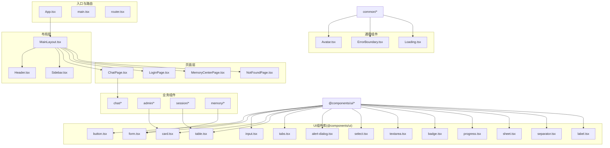
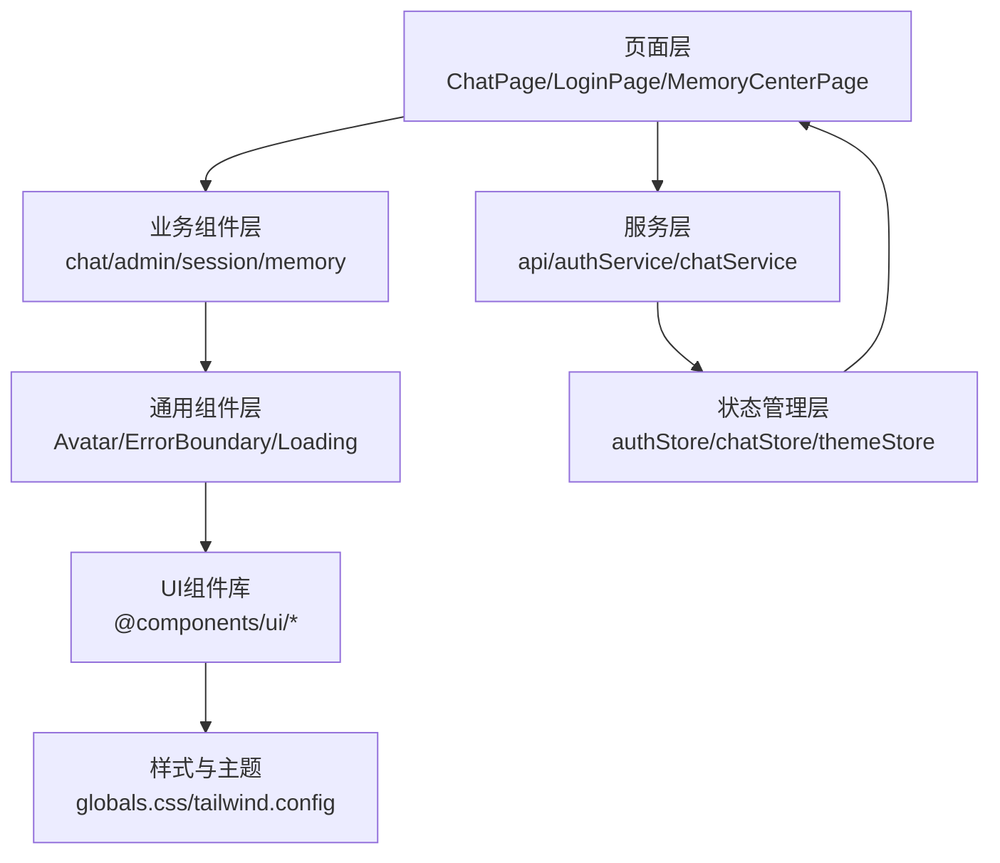
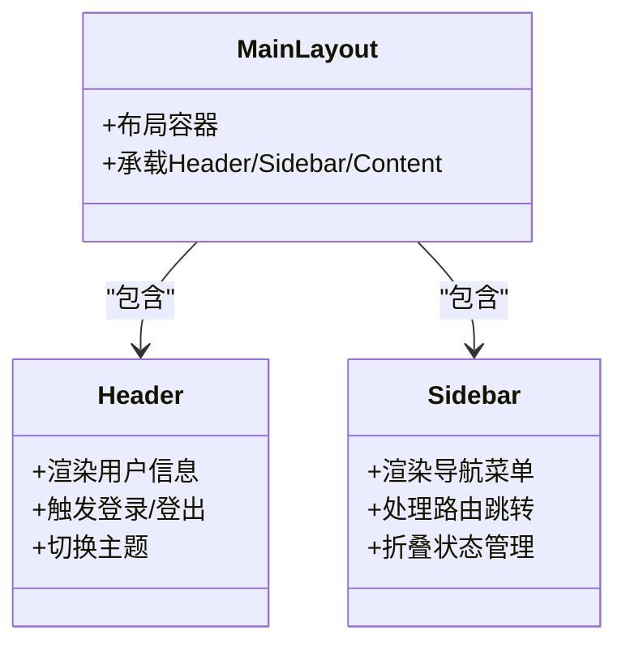
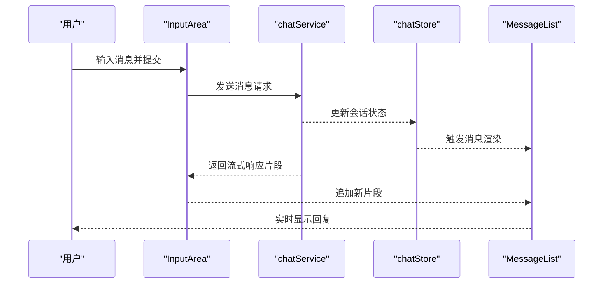
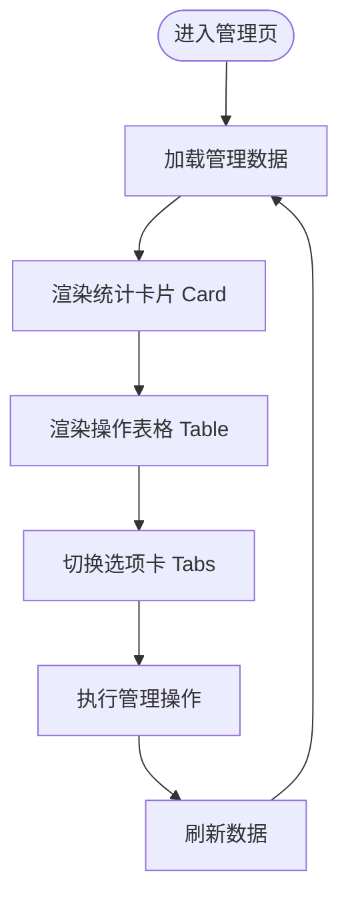
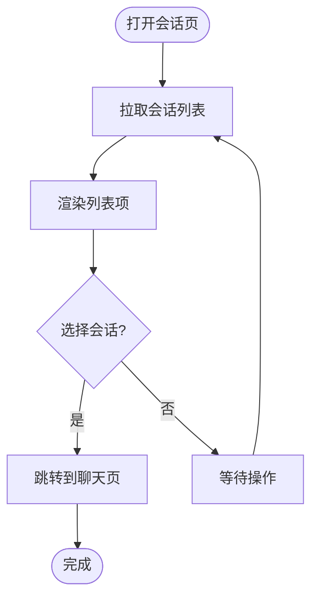
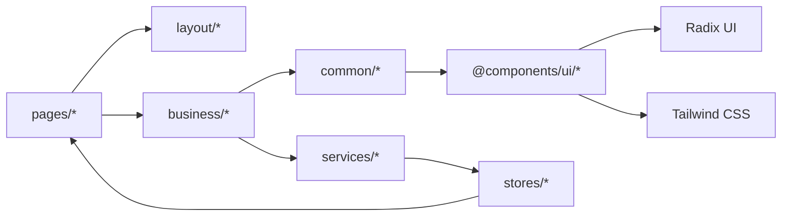

# 组件层次结构

<cite>
**本文引用的文件**
- [frontend/src/App.tsx](file://frontend/src/App.tsx)
- [frontend/src/main.tsx](file://frontend/src/main.tsx)
- [frontend/src/router.tsx](file://frontend/src/router.tsx)
- [frontend/src/pages/ChatPage.tsx](file://frontend/src/pages/ChatPage.tsx)
- [frontend/src/pages/LoginPage.tsx](file://frontend/src/pages/LoginPage.tsx)
- [frontend/src/pages/MemoryCenterPage.tsx](file://frontend/src/pages/MemoryCenterPage.tsx)
- [frontend/src/pages/NotFoundPage.tsx](file://frontend/src/pages/NotFoundPage.tsx)
- [frontend/src/components/layout/Header.tsx](file://frontend/src/components/layout/Header.tsx)
- [frontend/src/components/layout/MainLayout.tsx](file://frontend/src/components/layout/MainLayout.tsx)
- [frontend/src/components/layout/Sidebar.tsx](file://frontend/src/components/layout/Sidebar.tsx)
- [frontend/src/components/chat/ChatContainer.tsx](file://frontend/src/components/chat/ChatContainer.tsx)
- [frontend/src/components/chat/MessageList.tsx](file://frontend/src/components/chat/MessageList.tsx)
- [frontend/src/components/chat/InputArea.tsx](file://frontend/src/components/chat/InputArea.tsx)
- [frontend/src/components/admin/AdminDashboard.tsx](file://frontend/src/components/admin/AdminDashboard.tsx)
- [frontend/src/components/session/SessionList.tsx](file://frontend/src/components/session/SessionList.tsx)
- [frontend/src/components/common/ErrorBoundary.tsx](file://frontend/src/components/common/ErrorBoundary.tsx)
- [frontend/src/components/common/Loading.tsx](file://frontend/src/components/common/Loading.tsx)
- [frontend/src/components/common/Avatar.tsx](file://frontend/src/components/common/Avatar.tsx)
- [frontend/@components/ui/button.tsx](file://frontend/@components/ui/button.tsx)
- [frontend/@components/ui/form.tsx](file://frontend/@components/ui/form.tsx)
- [frontend/@components/ui/input.tsx](file://frontend/@components/ui/input.tsx)
- [frontend/@components/ui/card.tsx](file://frontend/@components/ui/card.tsx)
- [frontend/@components/ui/table.tsx](file://frontend/@components/ui/table.tsx)
- [frontend/@components/ui/tabs.tsx](file://frontend/@components/ui/tabs.tsx)
- [frontend/@components/ui/alert-dialog.tsx](file://frontend/@components/ui/alert-dialog.tsx)
- [frontend/@components/ui/select.tsx](file://frontend/@components/ui/select.tsx)
- [frontend/@components/ui/textarea.tsx](file://frontend/@components/ui/textarea.tsx)
- [frontend/@components/ui/badge.tsx](file://frontend/@components/ui/badge.tsx)
- [frontend/@components/ui/progress.tsx](file://frontend/@components/ui/progress.tsx)
- [frontend/@components/ui/sheet.tsx](file://frontend/@components/ui/sheet.tsx)
- [frontend/@components/ui/separator.tsx](file://frontend/@components/ui/separator.tsx)
- [frontend/@components/ui/label.tsx](file://frontend/@components/ui/label.tsx)
- [frontend/src/hooks/useAuth.ts](file://frontend/src/hooks/useAuth.ts)
- [frontend/src/hooks/useChat.ts](file://frontend/src/hooks/useChat.ts)
- [frontend/src/hooks/useStreamResponse.ts](file://frontend/src/hooks/useStreamResponse.ts)
- [frontend/src/stores/authStore.ts](file://frontend/src/stores/authStore.ts)
- [frontend/src/stores/chatStore.ts](file://frontend/src/stores/chatStore.ts)
- [frontend/src/stores/themeStore.ts](file://frontend/src/stores/themeStore.ts)
- [frontend/src/services/api.ts](file://frontend/src/services/api.ts)
- [frontend/src/services/authService.ts](file://frontend/src/services/authService.ts)
- [frontend/src/services/chatService.ts](file://frontend/src/services/chatService.ts)
- [frontend/src/utils/error.ts](file://frontend/src/utils/error.ts)
- [frontend/src/utils/helpers.ts](file://frontend/src/utils/helpers.ts)
- [frontend/src/utils/storage.ts](file://frontend/src/utils/storage.ts)
- [frontend/package.json](file://frontend/package.json)
- [frontend/tailwind.config.cjs](file://frontend/tailwind.config.cjs)
- [frontend/postcss.config.cjs](file://frontend/postcss.config.cjs)
- [frontend/src/styles/globals.css](file://frontend/src/styles/globals.css)
- [frontend/src/types/index.ts](file://frontend/src/types/index.ts)
</cite>

## 目录
1. [简介](#简介)
2. [项目结构](#项目结构)
3. [核心组件](#核心组件)
4. [架构总览](#架构总览)
5. [详细组件分析](#详细组件分析)
6. [依赖关系分析](#依赖关系分析)
7. [性能考量](#性能考量)
8. [故障排查指南](#故障排查指南)
9. [结论](#结论)
10. [附录](#附录)

## 简介
本文件面向Seahorse Agent前端组件体系，系统梳理基于Radix UI与自定义组件的组件层次结构，重点覆盖布局组件（Header、MainLayout、Sidebar）、业务组件（chat、admin、session等）、通用组件（Avatar、ErrorBoundary、Loading等）以及UI组件库（@components/ui）的设计理念与使用规范，并提供组件开发最佳实践、组合模式与样式定制方案，帮助开发者高效构建可维护的前端界面。

## 项目结构
前端采用TypeScript + React + Vite架构，组件按功能域分层组织：页面（pages）、布局（layout）、业务组件（chat、admin、session、memory等）、通用组件（common）、UI组件库（@components/ui）、工具与类型（utils、types）、状态管理（stores）、服务层（services）、路由与入口（router、main、App）。

图表来源
- [frontend/src/App.tsx](file://frontend/src/App.tsx)
- [frontend/src/main.tsx](file://frontend/src/main.tsx)
- [frontend/src/router.tsx](file://frontend/src/router.tsx)
- [frontend/src/pages/ChatPage.tsx](file://frontend/src/pages/ChatPage.tsx)
- [frontend/src/pages/LoginPage.tsx](file://frontend/src/pages/LoginPage.tsx)
- [frontend/src/pages/MemoryCenterPage.tsx](file://frontend/src/pages/MemoryCenterPage.tsx)
- [frontend/src/pages/NotFoundPage.tsx](file://frontend/src/pages/NotFoundPage.tsx)
- [frontend/src/components/layout/Header.tsx](file://frontend/src/components/layout/Header.tsx)
- [frontend/src/components/layout/MainLayout.tsx](file://frontend/src/components/layout/MainLayout.tsx)
- [frontend/src/components/layout/Sidebar.tsx](file://frontend/src/components/layout/Sidebar.tsx)
- [frontend/src/components/chat/ChatContainer.tsx](file://frontend/src/components/chat/ChatContainer.tsx)
- [frontend/src/components/admin/AdminDashboard.tsx](file://frontend/src/components/admin/AdminDashboard.tsx)
- [frontend/src/components/session/SessionList.tsx](file://frontend/src/components/session/SessionList.tsx)
- [frontend/src/components/common/Avatar.tsx](file://frontend/src/components/common/Avatar.tsx)
- [frontend/src/components/common/ErrorBoundary.tsx](file://frontend/src/components/common/ErrorBoundary.tsx)
- [frontend/src/components/common/Loading.tsx](file://frontend/src/components/common/Loading.tsx)
- [frontend/@components/ui/button.tsx](file://frontend/@components/ui/button.tsx)
- [frontend/@components/ui/form.tsx](file://frontend/@components/ui/form.tsx)
- [frontend/@components/ui/input.tsx](file://frontend/@components/ui/input.tsx)
- [frontend/@components/ui/card.tsx](file://frontend/@components/ui/card.tsx)
- [frontend/@components/ui/table.tsx](file://frontend/@components/ui/table.tsx)
- [frontend/@components/ui/tabs.tsx](file://frontend/@components/ui/tabs.tsx)
- [frontend/@components/ui/alert-dialog.tsx](file://frontend/@components/ui/alert-dialog.tsx)
- [frontend/@components/ui/select.tsx](file://frontend/@components/ui/select.tsx)
- [frontend/@components/ui/textarea.tsx](file://frontend/@components/ui/textarea.tsx)
- [frontend/@components/ui/badge.tsx](file://frontend/@components/ui/badge.tsx)
- [frontend/@components/ui/progress.tsx](file://frontend/@components/ui/progress.tsx)
- [frontend/@components/ui/sheet.tsx](file://frontend/@components/ui/sheet.tsx)
- [frontend/@components/ui/separator.tsx](file://frontend/@components/ui/separator.tsx)
- [frontend/@components/ui/label.tsx](file://frontend/@components/ui/label.tsx)

章节来源
- [frontend/src/App.tsx](file://frontend/src/App.tsx)
- [frontend/src/main.tsx](file://frontend/src/main.tsx)
- [frontend/src/router.tsx](file://frontend/src/router.tsx)

## 核心组件
- 应用入口与路由：应用通过入口文件挂载，路由负责页面级导航与权限控制。
- 页面组件：ChatPage、LoginPage、MemoryCenterPage、NotFoundPage分别承载不同业务场景。
- 布局组件：Header提供头部导航与用户信息；Sidebar提供侧边菜单；MainLayout作为容器协调Header与Sidebar布局。
- 业务组件：chat模块负责对话交互；admin模块提供管理面板；session模块管理会话列表；memory模块支持知识中心相关能力。
- 通用组件：Avatar用于头像展示；ErrorBoundary提供错误边界；Loading提供加载占位。
- UI组件库：基于Radix UI与Tailwind构建，提供Button、Form、Input、Card、Table、Tabs、AlertDialog、Select、Textarea、Badge、Progress、Sheet、Separator、Label等基础UI能力。

章节来源
- [frontend/src/pages/ChatPage.tsx](file://frontend/src/pages/ChatPage.tsx)
- [frontend/src/pages/LoginPage.tsx](file://frontend/src/pages/LoginPage.tsx)
- [frontend/src/pages/MemoryCenterPage.tsx](file://frontend/src/pages/MemoryCenterPage.tsx)
- [frontend/src/pages/NotFoundPage.tsx](file://frontend/src/pages/NotFoundPage.tsx)
- [frontend/src/components/layout/Header.tsx](file://frontend/src/components/layout/Header.tsx)
- [frontend/src/components/layout/MainLayout.tsx](file://frontend/src/components/layout/MainLayout.tsx)
- [frontend/src/components/layout/Sidebar.tsx](file://frontend/src/components/layout/Sidebar.tsx)
- [frontend/src/components/chat/ChatContainer.tsx](file://frontend/src/components/chat/ChatContainer.tsx)
- [frontend/src/components/admin/AdminDashboard.tsx](file://frontend/src/components/admin/AdminDashboard.tsx)
- [frontend/src/components/session/SessionList.tsx](file://frontend/src/components/session/SessionList.tsx)
- [frontend/src/components/common/Avatar.tsx](file://frontend/src/components/common/Avatar.tsx)
- [frontend/src/components/common/ErrorBoundary.tsx](file://frontend/src/components/common/ErrorBoundary.tsx)
- [frontend/src/components/common/Loading.tsx](file://frontend/src/components/common/Loading.tsx)
- [frontend/@components/ui/button.tsx](file://frontend/@components/ui/button.tsx)
- [frontend/@components/ui/form.tsx](file://frontend/@components/ui/form.tsx)
- [frontend/@components/ui/input.tsx](file://frontend/@components/ui/input.tsx)
- [frontend/@components/ui/card.tsx](file://frontend/@components/ui/card.tsx)
- [frontend/@components/ui/table.tsx](file://frontend/@components/ui/table.tsx)
- [frontend/@components/ui/tabs.tsx](file://frontend/@components/ui/tabs.tsx)
- [frontend/@components/ui/alert-dialog.tsx](file://frontend/@components/ui/alert-dialog.tsx)
- [frontend/@components/ui/select.tsx](file://frontend/@components/ui/select.tsx)
- [frontend/@components/ui/textarea.tsx](file://frontend/@components/ui/textarea.tsx)
- [frontend/@components/ui/badge.tsx](file://frontend/@components/ui/badge.tsx)
- [frontend/@components/ui/progress.tsx](file://frontend/@components/ui/progress.tsx)
- [frontend/@components/ui/sheet.tsx](file://frontend/@components/ui/sheet.tsx)
- [frontend/@components/ui/separator.tsx](file://frontend/@components/ui/separator.tsx)
- [frontend/@components/ui/label.tsx](file://frontend/@components/ui/label.tsx)

## 架构总览
组件架构遵循“页面-布局-业务-通用-UI库”的分层设计，页面层负责场景化展示，布局层统一风格与导航，业务组件封装领域逻辑，通用组件提供跨域复用能力，UI组件库提供基础原子能力。数据流从页面到服务层，再由状态管理与Hook驱动UI更新。

图表来源
- [frontend/src/pages/ChatPage.tsx](file://frontend/src/pages/ChatPage.tsx)
- [frontend/src/services/api.ts](file://frontend/src/services/api.ts)
- [frontend/src/stores/authStore.ts](file://frontend/src/stores/authStore.ts)
- [frontend/src/stores/chatStore.ts](file://frontend/src/stores/chatStore.ts)
- [frontend/src/stores/themeStore.ts](file://frontend/src/stores/themeStore.ts)
- [frontend/src/styles/globals.css](file://frontend/src/styles/globals.css)
- [frontend/tailwind.config.cjs](file://frontend/tailwind.config.cjs)

## 详细组件分析

### 布局组件体系
- Header：负责用户信息、登录态、全局操作按钮与主题切换等。
- Sidebar：提供导航菜单、折叠展开、当前选中项高亮。
- MainLayout：作为容器，协调Header与Sidebar，承载页面内容区域。

图表来源
- [frontend/src/components/layout/Header.tsx](file://frontend/src/components/layout/Header.tsx)
- [frontend/src/components/layout/Sidebar.tsx](file://frontend/src/components/layout/Sidebar.tsx)
- [frontend/src/components/layout/MainLayout.tsx](file://frontend/src/components/layout/MainLayout.tsx)

章节来源
- [frontend/src/components/layout/Header.tsx](file://frontend/src/components/layout/Header.tsx)
- [frontend/src/components/layout/Sidebar.tsx](file://frontend/src/components/layout/Sidebar.tsx)
- [frontend/src/components/layout/MainLayout.tsx](file://frontend/src/components/layout/MainLayout.tsx)

### 业务组件分析

#### 聊天组件（chat）
- ChatContainer：对话主容器，聚合消息列表与输入区域。
- MessageList：渲染历史消息与AI响应流式输出。
- InputArea：处理用户输入、发送请求、流式响应处理。

图表来源
- [frontend/src/components/chat/InputArea.tsx](file://frontend/src/components/chat/InputArea.tsx)
- [frontend/src/components/chat/MessageList.tsx](file://frontend/src/components/chat/MessageList.tsx)
- [frontend/src/services/chatService.ts](file://frontend/src/services/chatService.ts)
- [frontend/src/stores/chatStore.ts](file://frontend/src/stores/chatStore.ts)

章节来源
- [frontend/src/components/chat/ChatContainer.tsx](file://frontend/src/components/chat/ChatContainer.tsx)
- [frontend/src/components/chat/MessageList.tsx](file://frontend/src/components/chat/MessageList.tsx)
- [frontend/src/components/chat/InputArea.tsx](file://frontend/src/components/chat/InputArea.tsx)
- [frontend/src/services/chatService.ts](file://frontend/src/services/chatService.ts)
- [frontend/src/stores/chatStore.ts](file://frontend/src/stores/chatStore.ts)

#### 管理组件（admin）
- AdminDashboard：管理后台主面板，结合Card、Table、Tabs等展示数据与操作入口。

图表来源
- [frontend/src/components/admin/AdminDashboard.tsx](file://frontend/src/components/admin/AdminDashboard.tsx)
- [frontend/@components/ui/card.tsx](file://frontend/@components/ui/card.tsx)
- [frontend/@components/ui/table.tsx](file://frontend/@components/ui/table.tsx)
- [frontend/@components/ui/tabs.tsx](file://frontend/@components/ui/tabs.tsx)

章节来源
- [frontend/src/components/admin/AdminDashboard.tsx](file://frontend/src/components/admin/AdminDashboard.tsx)
- [frontend/@components/ui/card.tsx](file://frontend/@components/ui/card.tsx)
- [frontend/@components/ui/table.tsx](file://frontend/@components/ui/table.tsx)
- [frontend/@components/ui/tabs.tsx](file://frontend/@components/ui/tabs.tsx)

#### 会话组件（session）
- SessionList：展示会话列表，支持筛选、排序与跳转。

图表来源
- [frontend/src/components/session/SessionList.tsx](file://frontend/src/components/session/SessionList.tsx)
- [frontend/@components/ui/table.tsx](file://frontend/@components/ui/table.tsx)

章节来源
- [frontend/src/components/session/SessionList.tsx](file://frontend/src/components/session/SessionList.tsx)
- [frontend/@components/ui/table.tsx](file://frontend/@components/ui/table.tsx)

### 通用组件分析

#### Avatar
- 设计目标：统一头像展示，支持默认占位与异常回退。
- 复用策略：在Header、MessageList等多处复用，保持视觉一致性。

章节来源
- [frontend/src/components/common/Avatar.tsx](file://frontend/src/components/common/Avatar.tsx)

#### ErrorBoundary
- 设计目标：捕获子树渲染错误，提供降级UI与错误日志上报。
- 复用策略：包裹关键业务组件，避免整页崩溃。

章节来源
- [frontend/src/components/common/ErrorBoundary.tsx](file://frontend/src/components/common/ErrorBoundary.tsx)

#### Loading
- 设计目标：提供骨架屏或旋转指示器，改善长操作体验。
- 复用策略：在数据加载、提交请求、异步渲染场景使用。

章节来源
- [frontend/src/components/common/Loading.tsx](file://frontend/src/components/common/Loading.tsx)

### UI组件库（@components/ui）
- 设计理念：以Radix UI为语义基础，结合Tailwind实现高度可定制的原子组件。
- 使用规范：
  - Props最小化：仅暴露必要属性，避免过度耦合。
  - 变体与尺寸：通过className组合实现变体与尺寸扩展。
  - 可访问性：遵循ARIA与键盘导航规范。
  - 主题适配：通过CSS变量与Tailwind配置实现深浅主题切换。

```mermaid
classDiagram
class Button {
+variant : "default|outline|ghost|link"
+size : "sm|md|lg"
+disabled : boolean
+onClick() : void
}
class Form {
+onSubmit() : void
+resolver : function
}
class Input {
+value : string
+onChange() : void
+placeholder : string
+type : "text|password|email"
}
class Card {
+header : ReactNode
+content : ReactNode
+footer : ReactNode
}
class Table {
+columns : Column[]
+data : Row[]
}
class Tabs {
+defaultValue : string
+value : string
+onValueChange() : void
}
class AlertDialog {
+trigger : ReactNode
+title : string
+description : string
+action : () => void
}
class Select {
+value : string
+onValueChange() : void
+options : Option[]
}
class Textarea {
+value : string
+onChange() : void
+placeholder : string
}
class Badge {
+variant : "default|success|warning|destructive"
+children : ReactNode
}
class Progress {
+value : number
+max : number
}
class Sheet {
+trigger : ReactNode
+title : string
+description : string
+children : ReactNode
}
class Separator {
+orientation : "horizontal|vertical"
}
class Label {
+htmlFor : string
+children : ReactNode
}
```

图表来源
- [frontend/@components/ui/button.tsx](file://frontend/@components/ui/button.tsx)
- [frontend/@components/ui/form.tsx](file://frontend/@components/ui/form.tsx)
- [frontend/@components/ui/input.tsx](file://frontend/@components/ui/input.tsx)
- [frontend/@components/ui/card.tsx](file://frontend/@components/ui/card.tsx)
- [frontend/@components/ui/table.tsx](file://frontend/@components/ui/table.tsx)
- [frontend/@components/ui/tabs.tsx](file://frontend/@components/ui/tabs.tsx)
- [frontend/@components/ui/alert-dialog.tsx](file://frontend/@components/ui/alert-dialog.tsx)
- [frontend/@components/ui/select.tsx](file://frontend/@components/ui/select.tsx)
- [frontend/@components/ui/textarea.tsx](file://frontend/@components/ui/textarea.tsx)
- [frontend/@components/ui/badge.tsx](file://frontend/@components/ui/badge.tsx)
- [frontend/@components/ui/progress.tsx](file://frontend/@components/ui/progress.tsx)
- [frontend/@components/ui/sheet.tsx](file://frontend/@components/ui/sheet.tsx)
- [frontend/@components/ui/separator.tsx](file://frontend/@components/ui/separator.tsx)
- [frontend/@components/ui/label.tsx](file://frontend/@components/ui/label.tsx)

章节来源
- [frontend/@components/ui/button.tsx](file://frontend/@components/ui/button.tsx)
- [frontend/@components/ui/form.tsx](file://frontend/@components/ui/form.tsx)
- [frontend/@components/ui/input.tsx](file://frontend/@components/ui/input.tsx)
- [frontend/@components/ui/card.tsx](file://frontend/@components/ui/card.tsx)
- [frontend/@components/ui/table.tsx](file://frontend/@components/ui/table.tsx)
- [frontend/@components/ui/tabs.tsx](file://frontend/@components/ui/tabs.tsx)
- [frontend/@components/ui/alert-dialog.tsx](file://frontend/@components/ui/alert-dialog.tsx)
- [frontend/@components/ui/select.tsx](file://frontend/@components/ui/select.tsx)
- [frontend/@components/ui/textarea.tsx](file://frontend/@components/ui/textarea.tsx)
- [frontend/@components/ui/badge.tsx](file://frontend/@components/ui/badge.tsx)
- [frontend/@components/ui/progress.tsx](file://frontend/@components/ui/progress.tsx)
- [frontend/@components/ui/sheet.tsx](file://frontend/@components/ui/sheet.tsx)
- [frontend/@components/ui/separator.tsx](file://frontend/@components/ui/separator.tsx)
- [frontend/@components/ui/label.tsx](file://frontend/@components/ui/label.tsx)

## 依赖关系分析
- 组件内聚：每个业务域组件内部职责清晰，通过Hook与Store解耦。
- 组件耦合：布局组件与业务组件通过MainLayout弱耦合；通用组件被多处引用，形成稳定复用。
- 外部依赖：UI组件库依赖Radix UI与Tailwind；服务层依赖api封装；状态管理依赖独立store模块。

图表来源
- [frontend/@components/ui/button.tsx](file://frontend/@components/ui/button.tsx)
- [frontend/tailwind.config.cjs](file://frontend/tailwind.config.cjs)
- [frontend/src/services/api.ts](file://frontend/src/services/api.ts)
- [frontend/src/stores/authStore.ts](file://frontend/src/stores/authStore.ts)
- [frontend/src/stores/chatStore.ts](file://frontend/src/stores/chatStore.ts)

章节来源
- [frontend/@components/ui/button.tsx](file://frontend/@components/ui/button.tsx)
- [frontend/src/services/api.ts](file://frontend/src/services/api.ts)
- [frontend/src/stores/authStore.ts](file://frontend/src/stores/authStore.ts)
- [frontend/src/stores/chatStore.ts](file://frontend/src/stores/chatStore.ts)

## 性能考量
- 渲染优化：使用React.memo与useMemo缓存计算结果；虚拟列表用于长列表。
- 网络优化：请求去抖与节流；并发请求合并；失败重试与超时控制。
- 图片与资源：懒加载与占位符；CDN与缓存策略。
- 样式体积：按需引入组件样式；移除未使用类名；CSS变量减少重复定义。
- 打包体积：拆分路由级代码块；动态导入大组件。

## 故障排查指南
- 错误边界：在关键业务组件外层包裹ErrorBoundary，记录错误堆栈并提供重试入口。
- 日志与监控：统一错误格式化与上报；区分用户可感知与不可感知错误。
- 状态恢复：在store中持久化关键状态；页面刷新后恢复至最近可用状态。
- 网络异常：统一拦截4xx/5xx错误，提示友好文案并引导重试。

章节来源
- [frontend/src/components/common/ErrorBoundary.tsx](file://frontend/src/components/common/ErrorBoundary.tsx)
- [frontend/src/utils/error.ts](file://frontend/src/utils/error.ts)

## 结论
该组件体系以清晰的分层与职责划分实现了高内聚低耦合，借助UI组件库与通用组件提升了复用效率与一致性。通过合理的数据流与状态管理，业务组件能够专注于领域逻辑，同时保证良好的用户体验与可维护性。

## 附录

### 组件开发最佳实践
- Props设计
  - 最小化：仅暴露必要属性，避免过度配置。
  - 类型安全：使用TypeScript接口约束Props。
  - 默认值：为可选属性提供合理默认值。
- 事件处理
  - 明确职责：单击、双击、回车等事件分离处理。
  - 异步处理：避免阻塞UI线程，使用Promise与状态反馈。
- 状态管理
  - 局部状态：组件内部简单状态使用useState。
  - 共享状态：跨组件共享使用独立store与Hook。
  - 不可变更新：避免直接修改对象/数组，使用拷贝或不可变库。
- 组合模式
  - 容器组件：负责数据获取与状态管理，展示组件专注渲染。
  - 高阶组件：用于横切关注点（鉴权、埋点、国际化）。
  - Render Props：在复杂交互中提升灵活性。
- 样式定制
  - Tailwind原子类：优先使用工具类组合。
  - CSS变量：为主题与品牌色提供集中管理。
  - 组件变体：通过className组合实现尺寸、颜色、形状等变体。
- 可访问性
  - 语义化标签：正确使用HTML语义元素。
  - 键盘导航：Tab顺序与快捷键支持。
  - 屏幕阅读器：提供aria-label与role。

### 代码片段路径参考
- 页面与路由
  - [frontend/src/App.tsx](file://frontend/src/App.tsx)
  - [frontend/src/main.tsx](file://frontend/src/main.tsx)
  - [frontend/src/router.tsx](file://frontend/src/router.tsx)
- 布局组件
  - [frontend/src/components/layout/Header.tsx](file://frontend/src/components/layout/Header.tsx)
  - [frontend/src/components/layout/MainLayout.tsx](file://frontend/src/components/layout/MainLayout.tsx)
  - [frontend/src/components/layout/Sidebar.tsx](file://frontend/src/components/layout/Sidebar.tsx)
- 业务组件
  - [frontend/src/components/chat/ChatContainer.tsx](file://frontend/src/components/chat/ChatContainer.tsx)
  - [frontend/src/components/chat/MessageList.tsx](file://frontend/src/components/chat/MessageList.tsx)
  - [frontend/src/components/chat/InputArea.tsx](file://frontend/src/components/chat/InputArea.tsx)
  - [frontend/src/components/admin/AdminDashboard.tsx](file://frontend/src/components/admin/AdminDashboard.tsx)
  - [frontend/src/components/session/SessionList.tsx](file://frontend/src/components/session/SessionList.tsx)
- 通用组件
  - [frontend/src/components/common/Avatar.tsx](file://frontend/src/components/common/Avatar.tsx)
  - [frontend/src/components/common/ErrorBoundary.tsx](file://frontend/src/components/common/ErrorBoundary.tsx)
  - [frontend/src/components/common/Loading.tsx](file://frontend/src/components/common/Loading.tsx)
- UI组件库
  - [frontend/@components/ui/button.tsx](file://frontend/@components/ui/button.tsx)
  - [frontend/@components/ui/form.tsx](file://frontend/@components/ui/form.tsx)
  - [frontend/@components/ui/input.tsx](file://frontend/@components/ui/input.tsx)
  - [frontend/@components/ui/card.tsx](file://frontend/@components/ui/card.tsx)
  - [frontend/@components/ui/table.tsx](file://frontend/@components/ui/table.tsx)
  - [frontend/@components/ui/tabs.tsx](file://frontend/@components/ui/tabs.tsx)
  - [frontend/@components/ui/alert-dialog.tsx](file://frontend/@components/ui/alert-dialog.tsx)
  - [frontend/@components/ui/select.tsx](file://frontend/@components/ui/select.tsx)
  - [frontend/@components/ui/textarea.tsx](file://frontend/@components/ui/textarea.tsx)
  - [frontend/@components/ui/badge.tsx](file://frontend/@components/ui/badge.tsx)
  - [frontend/@components/ui/progress.tsx](file://frontend/@components/ui/progress.tsx)
  - [frontend/@components/ui/sheet.tsx](file://frontend/@components/ui/sheet.tsx)
  - [frontend/@components/ui/separator.tsx](file://frontend/@components/ui/separator.tsx)
  - [frontend/@components/ui/label.tsx](file://frontend/@components/ui/label.tsx)
- 工具与类型
  - [frontend/src/utils/error.ts](file://frontend/src/utils/error.ts)
  - [frontend/src/utils/helpers.ts](file://frontend/src/utils/helpers.ts)
  - [frontend/src/utils/storage.ts](file://frontend/src/utils/storage.ts)
  - [frontend/src/types/index.ts](file://frontend/src/types/index.ts)
- 样式与主题
  - [frontend/src/styles/globals.css](file://frontend/src/styles/globals.css)
  - [frontend/tailwind.config.cjs](file://frontend/tailwind.config.cjs)
  - [frontend/postcss.config.cjs](file://frontend/postcss.config.cjs)
- 状态与服务
  - [frontend/src/stores/authStore.ts](file://frontend/src/stores/authStore.ts)
  - [frontend/src/stores/chatStore.ts](file://frontend/src/stores/chatStore.ts)
  - [frontend/src/stores/themeStore.ts](file://frontend/src/stores/themeStore.ts)
  - [frontend/src/hooks/useAuth.ts](file://frontend/src/hooks/useAuth.ts)
  - [frontend/src/hooks/useChat.ts](file://frontend/src/hooks/useChat.ts)
  - [frontend/src/hooks/useStreamResponse.ts](file://frontend/src/hooks/useStreamResponse.ts)
  - [frontend/src/services/api.ts](file://frontend/src/services/api.ts)
  - [frontend/src/services/authService.ts](file://frontend/src/services/authService.ts)
  - [frontend/src/services/chatService.ts](file://frontend/src/services/chatService.ts)
- 依赖
  - [frontend/package.json](file://frontend/package.json)