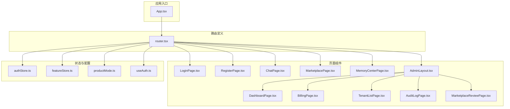
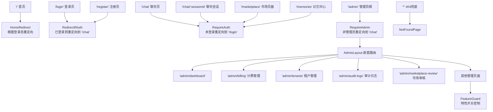
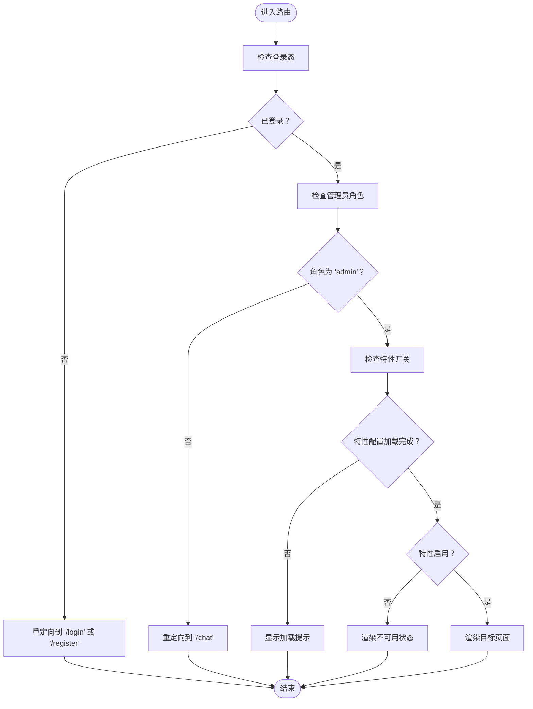
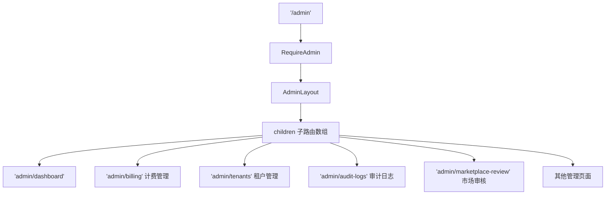
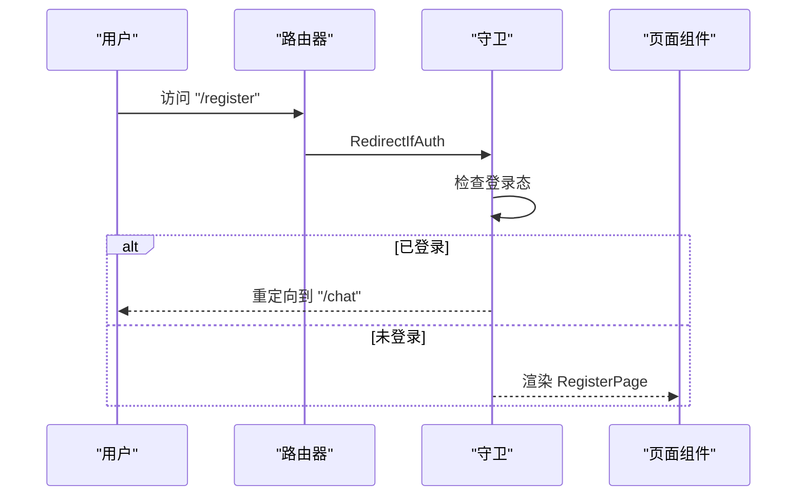
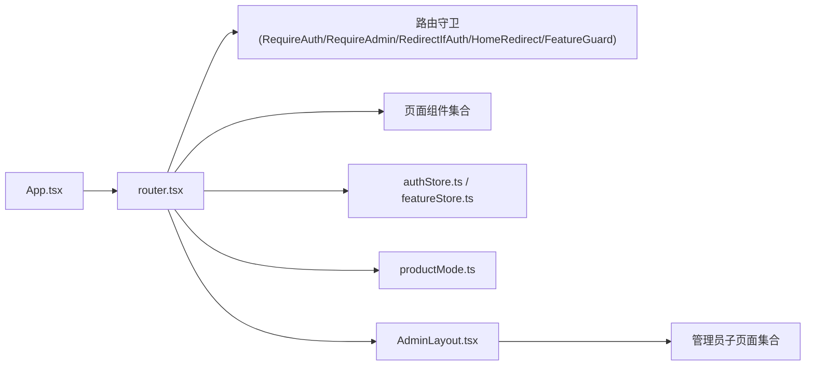

# 路由系统

<cite>
**本文档引用的文件**
- [router.tsx](file://frontend/src/router.tsx)
- [App.tsx](file://frontend/src/App.tsx)
- [useAuth.ts](file://frontend/src/hooks/useAuth.ts)
- [authStore.ts](file://frontend/src/stores/authStore.ts)
- [featureStore.ts](file://frontend/src/stores/featureStore.ts)
- [productMode.ts](file://frontend/src/config/productMode.ts)
- [LoginPage.tsx](file://frontend/src/pages/LoginPage.tsx)
- [RegisterPage.tsx](file://frontend/src/pages/RegisterPage.tsx)
- [ChatPage.tsx](file://frontend/src/pages/ChatPage.tsx)
- [MarketplacePage.tsx](file://frontend/src/pages/MarketplacePage.tsx)
- [MemoryCenterPage.tsx](file://frontend/src/pages/MemoryCenterPage.tsx)
- [NotFoundPage.tsx](file://frontend/src/pages/NotFoundPage.tsx)
- [AdminLayout.tsx](file://frontend/src/pages/admin/AdminLayout.tsx)
- [DashboardPage.tsx](file://frontend/src/pages/admin/dashboard/DashboardPage.tsx)
- [KnowledgeListPage.tsx](file://frontend/src/pages/admin/knowledge/KnowledgeListPage.tsx)
- [KnowledgeDocumentsPage.tsx](file://frontend/src/pages/admin/knowledge/KnowledgeDocumentsPage.tsx)
- [KnowledgeChunksPage.tsx](file://frontend/src/pages/admin/knowledge/KnowledgeChunksPage.tsx)
- [IntentTreePage.tsx](file://frontend/src/pages/admin/intent-tree/IntentTreePage.tsx)
- [IntentListPage.tsx](file://frontend/src/pages/admin/intent-tree/IntentListPage.tsx)
- [IntentEditPage.tsx](file://frontend/src/pages/admin/intent-tree/IntentEditPage.tsx)
- [IngestionPage.tsx](file://frontend/src/pages/admin/ingestion/IngestionPage.tsx)
- [MetadataGovernancePage.tsx](file://frontend/src/pages/admin/metadata-governance/MetadataGovernancePage.tsx)
- [RagTracePage.tsx](file://frontend/src/pages/admin/traces/RagTracePage.tsx)
- [RagTraceDetailPage.tsx](file://frontend/src/pages/admin/traces/RagTraceDetailPage.tsx)
- [SystemSettingsPage.tsx](file://frontend/src/pages/admin/settings/SystemSettingsPage.tsx)
- [ModelConfigPage.tsx](file://frontend/src/pages/admin/settings/ModelConfigPage.tsx)
- [ContextPackPage.tsx](file://frontend/src/pages/admin/settings/ContextPackPage.tsx)
- [TaskTemplatePage.tsx](file://frontend/src/pages/admin/settings/TaskTemplatePage.tsx)
- [SampleQuestionPage.tsx](file://frontend/src/pages/admin/sample-questions/SampleQuestionPage.tsx)
- [QueryTermMappingPage.tsx](file://frontend/src/pages/admin/query-term-mapping/QueryTermMappingPage.tsx)
- [UserListPage.tsx](file://frontend/src/pages/admin/users/UserListPage.tsx)
- [AgentConsolePage.tsx](file://frontend/src/pages/admin/agent-console/AgentConsolePage.tsx)
- [AgentInspectorPage.tsx](file://frontend/src/pages/admin/agent-inspector/AgentInspectorPage.tsx)
- [AgentListPage.tsx](file://frontend/src/pages/admin/agents/AgentListPage.tsx)
- [AgentCreatePage.tsx](file://frontend/src/pages/admin/agents/AgentCreatePage.tsx)
- [AgentDetailPage.tsx](file://frontend/src/pages/admin/agents/AgentDetailPage.tsx)
- [AgentEditorPage.tsx](file://frontend/src/pages/admin/agents/AgentEditorPage.tsx)
- [AgentRolloutPage.tsx](file://frontend/src/pages/admin/agents/AgentRolloutPage.tsx)
- [AgentEvalPage.tsx](file://frontend/src/pages/admin/agents/AgentEvalPage.tsx)
- [SkillManagementPage.tsx](file://frontend/src/pages/admin/skills/SkillManagementPage.tsx)
- [ToolCatalogPage.tsx](file://frontend/src/pages/admin/tools/ToolCatalogPage.tsx)
- [ToolDetailPage.tsx](file://frontend/src/pages/admin/tools/ToolDetailPage.tsx)
- [ToolInvocationAuditPage.tsx](file://frontend/src/pages/admin/tools/ToolInvocationAuditPage.tsx)
- [ApprovalCenterPage.tsx](file://frontend/src/pages/admin/approvals/ApprovalCenterPage.tsx)
- [RagEvaluationPage.tsx](file://frontend/src/pages/admin/rag-evaluation/RagEvaluationPage.tsx)
- [RetrievalDatasetDetailPage.tsx](file://frontend/src/pages/admin/rag-evaluation/RetrievalDatasetDetailPage.tsx)
- [RetrievalStrategyTemplatePage.tsx](file://frontend/src/pages/admin/rag-evaluation/RetrievalStrategyTemplatePage.tsx)
- [VersionQualityComparePage.tsx](file://frontend/src/pages/admin/rag-evaluation/VersionQualityComparePage.tsx)
- [ResourceAclPage.tsx](file://frontend/src/pages/admin/security/ResourceAclPage.tsx)
- [AccessDecisionPage.tsx](file://frontend/src/pages/admin/security/AccessDecisionPage.tsx)
- [QuotaPolicyPage.tsx](file://frontend/src/pages/admin/security/QuotaPolicyPage.tsx)
- [OpenApiConnectorPage.tsx](file://frontend/src/pages/admin/integrations/OpenApiConnectorPage.tsx)
- [OpenApiConnectorDetailPage.tsx](file://frontend/src/pages/admin/integrations/OpenApiConnectorDetailPage.tsx)
- [SecretPage.tsx](file://frontend/src/pages/admin/integrations/SecretPage.tsx)
- [MemoryGovernancePage.tsx](file://frontend/src/pages/admin/memory-governance/MemoryGovernancePage.tsx)
- [PluginManagementPage.tsx](file://frontend/src/pages/admin/plugins/PluginManagementPage.tsx)
- [AuditEventPage.tsx](file://frontend/src/pages/admin/audit/AuditEventPage.tsx)
- [CostAnalyticsPage.tsx](file://frontend/src/pages/admin/cost/CostAnalyticsPage.tsx)
- [SandboxPage.tsx](file://frontend/src/pages/admin/sandbox/SandboxPage.tsx)
- [AgentRunListPage.tsx](file://frontend/src/pages/admin/agent-runs/AgentRunListPage.tsx)
- [BillingPage.tsx](file://frontend/src/pages/admin/billing/BillingPage.tsx)
- [TenantListPage.tsx](file://frontend/src/pages/admin/tenants/TenantListPage.tsx)
- [AuditLogPage.tsx](file://frontend/src/pages/admin/audit/AuditLogPage.tsx)
- [MarketplaceReviewPage.tsx](file://frontend/src/pages/admin/marketplace/MarketplaceReviewPage.tsx)
</cite>

## 更新摘要
**所做更改**
- 新增注册页面路由配置（/register）
- 新增市场页面路由配置（/marketplace）
- 新增管理员页面路由配置（/admin/billing、/admin/tenants、/admin/audit-logs、/admin/marketplace-review）
- 更新路由守卫与权限控制章节，反映新增路由的安全要求
- 更新管理员页面组织章节，包含新增的计费、租户、审计和市场审核页面
- 更新路由架构图，展示完整的路由层次结构

## 目录
1. [简介](#简介)
2. [项目结构](#项目结构)
3. [核心组件](#核心组件)
4. [架构总览](#架构总览)
5. [详细组件分析](#详细组件分析)
6. [依赖关系分析](#依赖关系分析)
7. [性能考虑](#性能考虑)
8. [故障排查指南](#故障排查指南)
9. [结论](#结论)
10. [附录](#附录)

## 简介
本文件面向Seahorse Agent前端路由系统的开发者与维护者，系统性阐述基于React Router DOM的路由架构设计与实现细节。内容涵盖路由配置与页面组件组织（公共页面、管理员页面、聊天页面）、嵌套路由与权限控制、路由参数与查询字符串处理、页面导航与历史记录管理、路由守卫与认证拦截、性能优化与懒加载策略，以及最佳实践与实现指南。

**更新** 本次更新反映了新增的注册页面、市场页面和管理员页面路由配置，包括/register、/marketplace以及/admin/billing、/admin/tenants、/admin/audit-logs、/admin/marketplace-review等路由。

## 项目结构
前端路由位于前端工程的src目录下，核心入口为router.tsx，应用根组件App.tsx通过RouterProvider挂载路由。页面组件按功能域分层组织在src/pages下，管理员页面进一步细分为多个子模块目录；权限与特性开关状态通过stores与hooks进行集中管理。

**图表来源**
- [App.tsx:1-15](file://frontend/src/App.tsx#L1-L15)
- [router.tsx:1-242](file://frontend/src/router.tsx#L1-L242)

**章节来源**
- [App.tsx:1-15](file://frontend/src/App.tsx#L1-L15)
- [router.tsx:1-242](file://frontend/src/router.tsx#L1-L242)

## 核心组件
- 路由器实例：使用createBrowserRouter创建路由器实例，集中定义所有路由规则与嵌套路由。
- 路由守卫：
  - RequireAuth：校验登录态，未登录重定向至登录页。
  - RequireAdmin：校验管理员角色，非管理员重定向至聊天页。
  - RedirectIfAuth：已登录用户禁止访问登录页，自动跳转至聊天页。
  - HomeRedirect：首页重定向逻辑，根据登录态跳转到/chat或/login。
  - FeatureGuard：基于特性开关与能力配置的页面级权限控制。
- 特性包装器withFeature：将任意元素包裹在FeatureGuard中，统一处理特性开关。
- 管理员高级路由组：advancedAdminRoutes集中定义大量管理员页面路由，便于维护与扩展。
- 页面组件：公共页面（登录、注册、聊天、市场、记忆中心、404）、管理员页面（仪表盘、计费、租户、审计日志、市场审核等）。

**章节来源**
- [router.tsx:66-120](file://frontend/src/router.tsx#L66-L120)
- [router.tsx:122-157](file://frontend/src/router.tsx#L122-L157)
- [router.tsx:159-241](file://frontend/src/router.tsx#L159-L241)

## 架构总览
路由系统采用"集中式路由定义 + 组合式路由守卫 + 特性开关控制"的架构模式。顶层路由负责全局重定向与错误兜底，管理员路由通过AdminLayout实现嵌套路由，页面组件通过useAuth与featureStore实现细粒度权限控制。

**图表来源**
- [router.tsx:159-241](file://frontend/src/router.tsx#L159-L241)

## 详细组件分析

### 路由守卫与权限控制
- RequireAuth：读取authStore中的isAuthenticated，未登录时重定向到/login。
- RequireAdmin：在RequireAuth基础上，进一步校验用户角色是否为admin，否则重定向到/chat。
- RedirectIfAuth：在访问/login或/register时，若已登录则直接重定向到/chat。
- HomeRedirect：根据isAuthenticated决定重定向到/chat或/login。
- FeatureGuard：当特性配置未加载完成时显示加载提示；当特性关闭时渲染FeatureUnavailableState；否则放行子元素。
- withFeature：将任意元素包裹在FeatureGuard中，统一接入特性开关控制。

**图表来源**
- [router.tsx:66-120](file://frontend/src/router.tsx#L66-L120)

**章节来源**
- [router.tsx:66-120](file://frontend/src/router.tsx#L66-L120)
- [authStore.ts](file://frontend/src/stores/authStore.ts)
- [featureStore.ts](file://frontend/src/stores/featureStore.ts)
- [productMode.ts](file://frontend/src/config/productMode.ts)

### 嵌套路由与管理员页面组织
- 管理员根路由"/admin"使用RequireAdmin守卫，并以AdminLayout作为容器。
- AdminLayout内部定义多级子路由，覆盖仪表盘、计费管理、租户管理、审计日志、市场审核等模块。
- advancedAdminRoutes集中定义大量管理员页面路由，便于维护与扩展，支持带参数的动态路由（如":agentId"、":runId"、":kbId"、":docId"等）。

**更新** 新增的管理员页面路由包括：
- /admin/billing：计费管理页面，支持套餐订阅、账单查询和用量监控
- /admin/tenants：租户管理页面，支持租户列表、详情查看、暂停和删除操作
- /admin/audit-logs：审计日志页面，支持日志查询、筛选和导出
- /admin/marketplace-review：市场审核页面，支持Agent发布审核流程

**图表来源**
- [router.tsx:211-238](file://frontend/src/router.tsx#L211-L238)
- [router.tsx:122-157](file://frontend/src/router.tsx#L122-L157)

**章节来源**
- [router.tsx:211-238](file://frontend/src/router.tsx#L211-L238)
- [router.tsx:122-157](file://frontend/src/router.tsx#L122-L157)

### 公共页面路由
- "/"：HomeRedirect根据登录态重定向到"/chat"或"/login"。
- "/login"：RedirectIfAuth确保已登录用户无法再次访问登录页。
- "/register"：RedirectIfAuth确保已登录用户无法访问注册页，提供新用户注册功能。
- "/chat"：RequireAuth保护聊天页，支持无参数与带":sessionId"两种形式。
- "/marketplace"：RequireAuth保护市场页面，提供Agent订阅和评价功能。
- "/memories"：RequireAuth保护记忆中心。
- "*"：NotFoundPage兜底。

**更新** 新增的注册页面路由配置：
- /register路由使用RedirectIfAuth守卫，确保已登录用户无法访问注册页
- RegisterPage组件提供邮箱验证、密码设置和用户注册功能
- 注册成功后自动跳转到/chat页面

**更新** 新增的市场页面路由配置：
- /marketplace路由使用RequireAuth守卫
- MarketplacePage组件提供Agent市场浏览、订阅管理和评价功能
- 支持分类筛选、排序和分页加载

**图表来源**
- [router.tsx:169-176](file://frontend/src/router.tsx#L169-L176)
- [router.tsx:80-83](file://frontend/src/router.tsx#L80-L83)

**章节来源**
- [router.tsx:159-208](file://frontend/src/router.tsx#L159-L208)
- [router.tsx:239-241](file://frontend/src/router.tsx#L239-L241)

### 路由参数传递与查询字符串处理
- 动态路由参数："/admin/agents/:agentId"、"/admin/agent-inspector/:runId"、"/admin/knowledge/:kbId"、"/admin/knowledge/:kbId/docs/:docId"等，用于承载业务标识符。
- 查询字符串：当前路由定义未显式声明查询参数解析逻辑，建议在具体页面组件中使用URLSearchParams或第三方库进行解析与使用。

**更新** 新增的动态路由参数：
- /admin/tenants路由支持租户管理功能
- /admin/marketplace-review路由支持市场审核功能

**章节来源**
- [router.tsx:185-190](file://frontend/src/router.tsx#L185-L190)
- [router.tsx:134-135](file://frontend/src/router.tsx#L134-L135)
- [router.tsx:215-216](file://frontend/src/router.tsx#L215-L216)

### 页面导航与历史记录管理
- 使用Navigate组件进行程序化重定向，replace参数确保不污染浏览器历史栈。
- 路由守卫内部均使用replace进行重定向，避免用户返回时重复触发守卫逻辑。
- 建议在页面内使用useNavigate进行局部导航，保持一致的历史记录行为。

**更新** 新增的导航场景：
- 注册成功后自动导航到"/chat"页面
- 市场页面支持Agent订阅后的状态更新
- 管理员页面间的导航保持历史记录一致性

**章节来源**
- [router.tsx:61-62](file://frontend/src/router.tsx#L61-L62)
- [router.tsx:71-72](file://frontend/src/router.tsx#L71-L72)
- [router.tsx:84-85](file://frontend/src/router.tsx#L84-L85)
- [router.tsx:91-92](file://frontend/src/router.tsx#L91-L92)
- [router.tsx:202](file://frontend/src/router.tsx#L202)
- [router.tsx:212](file://frontend/src/router.tsx#L212)

### 路由守卫与认证拦截实现方案
- 认证拦截：RequireAuth在所有受保护页面前执行，未登录统一跳转到登录页。
- 角色拦截：RequireAdmin在RequireAuth基础上校验管理员角色，非管理员跳转到聊天页。
- 已登录拦截：RedirectIfAuth在登录页和注册页生效，防止已登录用户重复访问。
- 首页重定向：HomeRedirect根据登录态决定初始页面，提升用户体验。
- 特性开关：FeatureGuard结合featureStore与productMode配置，实现页面级功能开关控制。

**更新** 新增的认证拦截场景：
- /register路由同样适用RedirectIfAuth守卫
- 管理员页面路由均适用RequireAdmin守卫
- 特性页面路由均适用FeatureGuard守卫

**章节来源**
- [router.tsx:66-120](file://frontend/src/router.tsx#L66-L120)
- [authStore.ts](file://frontend/src/stores/authStore.ts)
- [featureStore.ts](file://frontend/src/stores/featureStore.ts)
- [productMode.ts](file://frontend/src/config/productMode.ts)

### 性能优化与懒加载策略
- 当前路由定义采用静态导入页面组件，构建期按需打包。
- 推荐在大型页面或不常用页面上引入React.lazy与Suspense进行代码分割，减少首屏体积。
- 对于管理员页面，可按模块拆分并延迟加载，结合路由级别的懒加载提升整体性能。
- 建议对AdminLayout内的子路由进行按需加载，避免一次性加载全部管理页面。

**更新** 建议优化的页面：
- RegisterPage和MarketplacePage作为用户高频访问页面，可考虑懒加载
- 管理员页面中的BillingPage、TenantListPage等大型页面可实施懒加载
- AdminLayout内的子路由可根据使用频率进行分层懒加载

**章节来源**
- [router.tsx:159-241](file://frontend/src/router.tsx#L159-L241)

## 依赖关系分析
- App.tsx依赖router.tsx提供的路由器实例，通过RouterProvider注入。
- 路由守卫依赖authStore与featureStore的状态，实现认证与特性控制。
- 管理员路由依赖AdminLayout作为容器，内部children定义具体页面。
- productMode提供特性开关常量，FeatureGuard基于这些常量进行页面级控制。

**图表来源**
- [App.tsx:1-15](file://frontend/src/App.tsx#L1-L15)
- [router.tsx:1-242](file://frontend/src/router.tsx#L1-L242)

**章节来源**
- [App.tsx:1-15](file://frontend/src/App.tsx#L1-L15)
- [router.tsx:1-242](file://frontend/src/router.tsx#L1-L242)

## 性能考虑
- 代码分割：对大型页面组件使用React.lazy进行懒加载，结合Suspense提升首屏性能。
- 路由级别懒加载：将管理员页面按模块拆分，仅在进入对应路由时加载。
- 路由预加载：对高频访问的页面可考虑预加载策略，平衡首屏与交互体验。
- 特性开关优化：FeatureGuard在配置未加载完成时显示加载提示，避免白屏与重复请求。

**更新** 新的性能优化建议：
- RegisterPage和MarketplacePage作为用户入口页面，应优先考虑懒加载
- 管理员页面中的BillingPage等复杂页面可实施分步加载
- 对AdminLayout的子路由进行按需加载，提升后台管理体验

## 故障排查指南
- 登录后仍被重定向到登录页：检查authStore中的isAuthenticated状态是否正确更新。
- 非管理员访问管理员页面被重定向到聊天页：确认useAuth返回的用户角色是否为admin。
- 特性页面显示"不可用"：检查featureStore中的getFeatureState返回值与productMode配置。
- 首页未按预期重定向：确认HomeRedirect逻辑与authStore状态一致性。
- 404页面频繁出现：检查路由定义是否遗漏或路径拼写错误。
- 注册页面无法访问：确认RedirectIfAuth守卫逻辑是否正确处理已登录状态。
- 市场页面功能异常：检查MarketplacePage组件的API调用和状态管理。

**更新** 新增的故障排查项：
- 计费页面数据加载失败：检查billingService的API调用和错误处理
- 租户管理页面权限问题：确认TENANT_MANAGEMENT特性开关状态
- 审计日志查询异常：检查adminService的查询参数和过滤条件
- 市场审核流程卡顿：确认marketplaceService的异步操作状态

**章节来源**
- [router.tsx:66-120](file://frontend/src/router.tsx#L66-L120)
- [authStore.ts](file://frontend/src/stores/authStore.ts)
- [featureStore.ts](file://frontend/src/stores/featureStore.ts)
- [productMode.ts](file://frontend/src/config/productMode.ts)

## 结论
Seahorse Agent的路由系统以React Router DOM为核心，采用集中式路由定义与组合式守卫实现清晰的权限控制与页面组织。通过AdminLayout实现嵌套路由，配合特性开关与产品模式配置，满足复杂后台管理场景的需求。

**更新** 本次更新增强了路由系统的完整性和安全性，新增的注册页面、市场页面和管理员页面路由配置完善了用户生命周期管理和后台管理功能。建议在现有基础上引入懒加载与预加载策略，持续优化性能与用户体验。

## 附录
- 最佳实践清单
  - 将受保护页面统一使用RequireAuth包裹。
  - 管理员页面统一通过RequireAdmin守卫。
  - 使用FeatureGuard统一接入特性开关。
  - 对大型页面组件进行懒加载。
  - 在页面内使用useNavigate进行局部导航，保持历史记录一致性。
  - 定期审查路由定义，清理无效与重复路由。
  - 为新增路由添加适当的权限控制和错误处理。
  - 考虑为高频访问页面实施缓存策略。