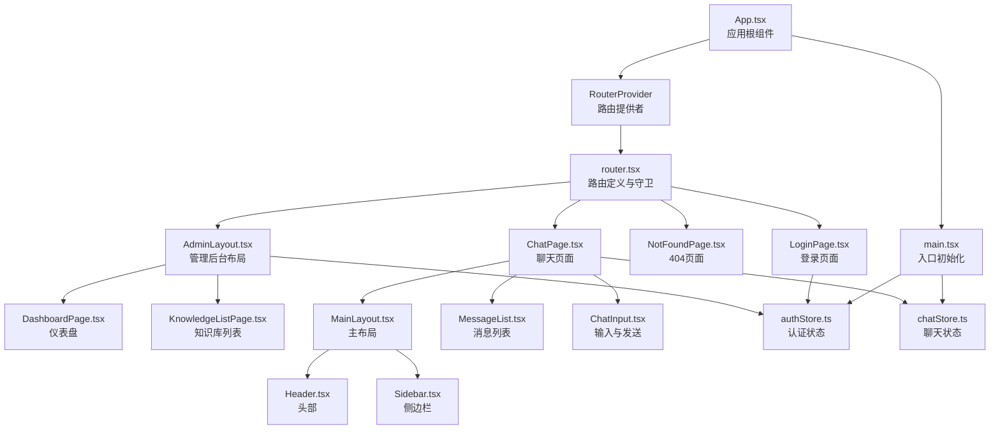
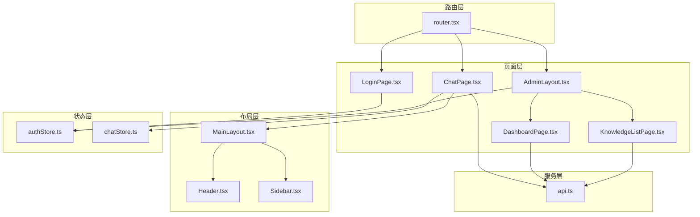
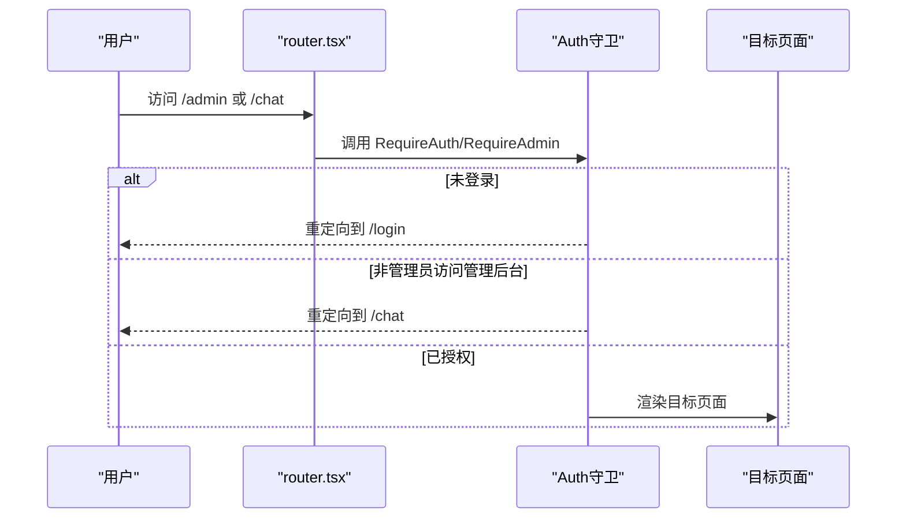
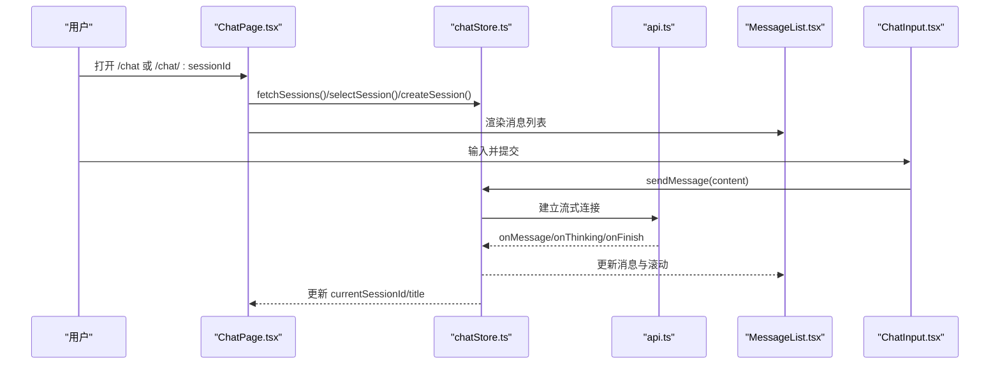
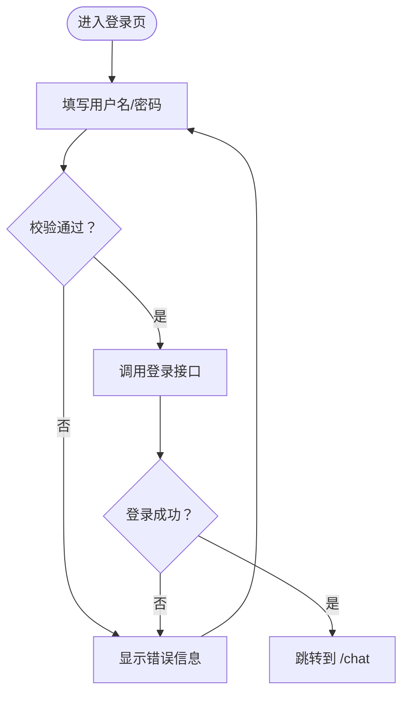
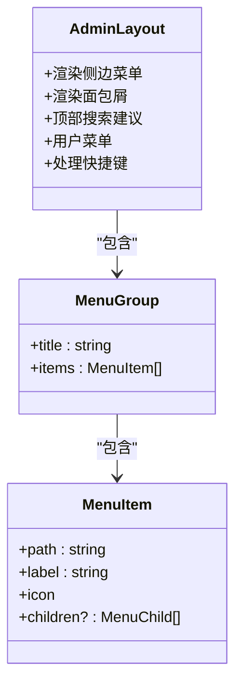
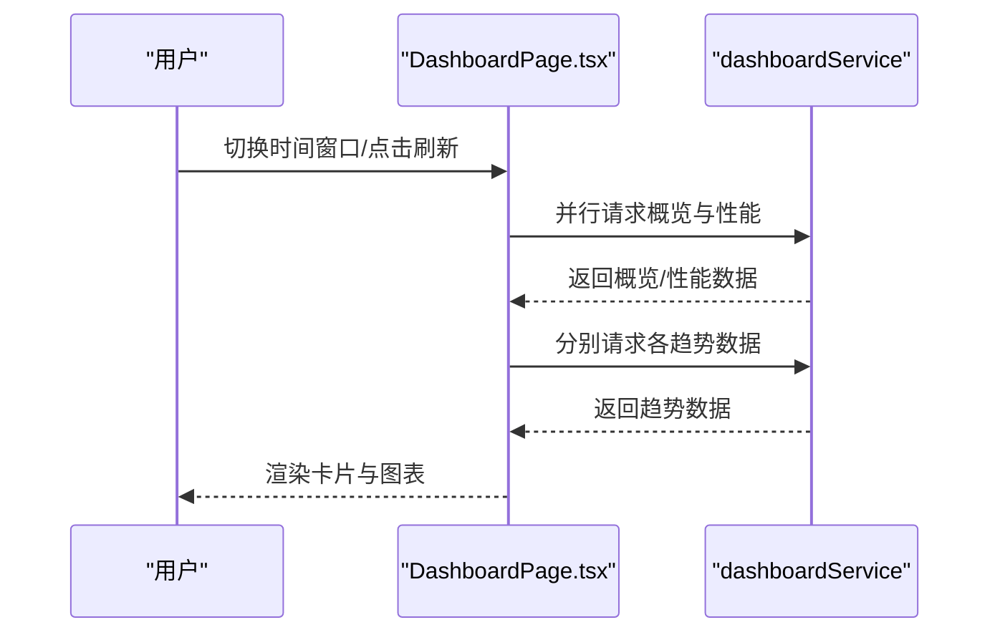
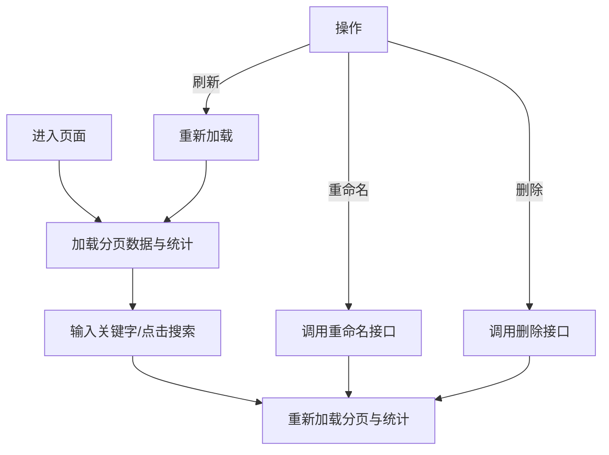
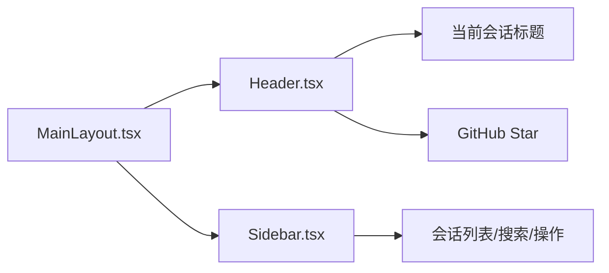
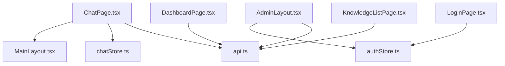

# 页面组件

<cite>
**本文引用的文件**
- [App.tsx](file://frontend/src/App.tsx)
- [main.tsx](file://frontend/src/main.tsx)
- [router.tsx](file://frontend/src/router.tsx)
- [ChatPage.tsx](file://frontend/src/pages/ChatPage.tsx)
- [LoginPage.tsx](file://frontend/src/pages/LoginPage.tsx)
- [NotFoundPage.tsx](file://frontend/src/pages/NotFoundPage.tsx)
- [MainLayout.tsx](file://frontend/src/components/layout/MainLayout.tsx)
- [Header.tsx](file://frontend/src/components/layout/Header.tsx)
- [Sidebar.tsx](file://frontend/src/components/layout/Sidebar.tsx)
- [AdminLayout.tsx](file://frontend/src/pages/admin/AdminLayout.tsx)
- [DashboardPage.tsx](file://frontend/src/pages/admin/dashboard/DashboardPage.tsx)
- [KnowledgeListPage.tsx](file://frontend/src/pages/admin/knowledge/KnowledgeListPage.tsx)
- [MessageList.tsx](file://frontend/src/components/chat/MessageList.tsx)
- [ChatInput.tsx](file://frontend/src/components/chat/ChatInput.tsx)
- [authStore.ts](file://frontend/src/stores/authStore.ts)
- [chatStore.ts](file://frontend/src/stores/chatStore.ts)
- [api.ts](file://frontend/src/services/api.ts)
- [useAuth.ts](file://frontend/src/hooks/useAuth.ts)
</cite>

## 目录
1. [简介](#简介)
2. [项目结构](#项目结构)
3. [核心组件](#核心组件)
4. [架构总览](#架构总览)
5. [详细组件分析](#详细组件分析)
6. [依赖分析](#依赖分析)
7. [性能考虑](#性能考虑)
8. [故障排查指南](#故障排查指南)
9. [结论](#结论)
10. [附录](#附录)

## 简介
本文件面向前端页面组件，系统性梳理 Seahorse Agent 的页面层设计与实现，覆盖聊天页面、管理后台页面、登录页面等核心页面，以及布局组件（Header、Sidebar、MainLayout）与业务页面（ChatPage、DashboardPage、KnowledgeListPage 等）。文档重点阐述：
- 页面间导航逻辑、路由守卫与权限控制
- 数据流设计：从 API 获取数据、状态管理、视图更新
- 组件组织与复用、代码结构与最佳实践
- 响应式布局与移动端适配
- 用户体验设计原则与交互模式

## 项目结构
前端采用基于路由的单页应用（SPA），通过 React Router v6 管理页面与子页面；页面组件位于 src/pages，布局组件位于 src/components/layout，业务页面位于对应功能域目录（如 admin/dashboard、admin/knowledge 等）；状态管理使用 Zustand（authStore、chatStore），服务层封装在 src/services。

图表来源
- [App.tsx:1-15](file://frontend/src/App.tsx#L1-L15)
- [main.tsx:1-17](file://frontend/src/main.tsx#L1-L17)
- [router.tsx:1-163](file://frontend/src/router.tsx#L1-L163)
- [ChatPage.tsx:1-103](file://frontend/src/pages/ChatPage.tsx#L1-L103)
- [AdminLayout.tsx:1-821](file://frontend/src/pages/admin/AdminLayout.tsx#L1-L821)
- [MainLayout.tsx:1-25](file://frontend/src/components/layout/MainLayout.tsx#L1-L25)
- [Header.tsx:1-82](file://frontend/src/components/layout/Header.tsx#L1-L82)
- [Sidebar.tsx:1-481](file://frontend/src/components/layout/Sidebar.tsx#L1-L481)
- [MessageList.tsx:1-212](file://frontend/src/components/chat/MessageList.tsx#L1-L212)
- [ChatInput.tsx:1-161](file://frontend/src/components/chat/ChatInput.tsx#L1-L161)
- [DashboardPage.tsx:1-1500](file://frontend/src/pages/admin/dashboard/DashboardPage.tsx#L1-L1500)
- [KnowledgeListPage.tsx:1-467](file://frontend/src/pages/admin/knowledge/KnowledgeListPage.tsx#L1-L467)

章节来源
- [router.tsx:1-163](file://frontend/src/router.tsx#L1-L163)
- [App.tsx:1-15](file://frontend/src/App.tsx#L1-L15)
- [main.tsx:1-17](file://frontend/src/main.tsx#L1-L17)

## 核心组件
- 应用根组件与入口
  - App.tsx：包裹 RouterProvider 并挂载全局错误边界与全局提示
  - main.tsx：初始化主题与认证状态，启动应用
- 路由与权限
  - router.tsx：定义路由表、路径参数、嵌套路由与路由守卫（RequireAuth、RequireAdmin、RedirectIfAuth）
- 布局组件
  - MainLayout.tsx：组合 Header 与 Sidebar，承载页面主体
  - Header.tsx：顶部标题、GitHub Star 展示、用户上下文
  - Sidebar.tsx：会话列表、搜索、重命名、删除、用户菜单、退出登录
- 页面组件
  - ChatPage.tsx：聊天主页面，负责会话加载、消息渲染、输入处理
  - LoginPage.tsx：登录表单、记住我、错误提示、跳转
  - AdminLayout.tsx：管理后台主布局，面包屑、侧边菜单、搜索建议、用户菜单
  - DashboardPage.tsx：仪表盘 KPI、趋势图、健康度、刷新与时间窗口切换
  - KnowledgeListPage.tsx：知识库分页列表、统计卡片、搜索、重命名、删除、创建

章节来源
- [App.tsx:1-15](file://frontend/src/App.tsx#L1-L15)
- [main.tsx:1-17](file://frontend/src/main.tsx#L1-L17)
- [router.tsx:1-163](file://frontend/src/router.tsx#L1-L163)
- [MainLayout.tsx:1-25](file://frontend/src/components/layout/MainLayout.tsx#L1-L25)
- [Header.tsx:1-82](file://frontend/src/components/layout/Header.tsx#L1-L82)
- [Sidebar.tsx:1-481](file://frontend/src/components/layout/Sidebar.tsx#L1-L481)
- [ChatPage.tsx:1-103](file://frontend/src/pages/ChatPage.tsx#L1-L103)
- [LoginPage.tsx:1-102](file://frontend/src/pages/LoginPage.tsx#L1-L102)
- [AdminLayout.tsx:1-821](file://frontend/src/pages/admin/AdminLayout.tsx#L1-L821)
- [DashboardPage.tsx:1-1500](file://frontend/src/pages/admin/dashboard/DashboardPage.tsx#L1-L1500)
- [KnowledgeListPage.tsx:1-467](file://frontend/src/pages/admin/knowledge/KnowledgeListPage.tsx#L1-L467)

## 架构总览
页面层围绕“路由 + 布局 + 页面 + 状态 + 服务”展开，统一通过 Zustand 管理认证与聊天状态，Axios 封装的 API 客户端负责网络请求与拦截器处理。

图表来源
- [router.tsx:1-163](file://frontend/src/router.tsx#L1-L163)
- [ChatPage.tsx:1-103](file://frontend/src/pages/ChatPage.tsx#L1-L103)
- [LoginPage.tsx:1-102](file://frontend/src/pages/LoginPage.tsx#L1-L102)
- [AdminLayout.tsx:1-821](file://frontend/src/pages/admin/AdminLayout.tsx#L1-L821)
- [DashboardPage.tsx:1-1500](file://frontend/src/pages/admin/dashboard/DashboardPage.tsx#L1-L1500)
- [KnowledgeListPage.tsx:1-467](file://frontend/src/pages/admin/knowledge/KnowledgeListPage.tsx#L1-L467)
- [MainLayout.tsx:1-25](file://frontend/src/components/layout/MainLayout.tsx#L1-L25)
- [Header.tsx:1-82](file://frontend/src/components/layout/Header.tsx#L1-L82)
- [Sidebar.tsx:1-481](file://frontend/src/components/layout/Sidebar.tsx#L1-L481)
- [authStore.ts:1-116](file://frontend/src/stores/authStore.ts#L1-L116)
- [chatStore.ts:1-528](file://frontend/src/stores/chatStore.ts#L1-L528)
- [api.ts:1-66](file://frontend/src/services/api.ts#L1-L66)

## 详细组件分析

### 路由与权限控制
- 路由守卫
  - RequireAuth：未登录则跳转到登录页
  - RequireAdmin：非管理员跳转到聊天页
  - RedirectIfAuth：已登录用户访问登录页时跳转到聊天页
- 首页重定向：根据登录状态跳转到聊天或登录
- 嵌套路由：管理后台 AdminLayout 下的多级页面（仪表盘、知识库、意图树、数据通道、设置等）

图表来源
- [router.tsx:23-44](file://frontend/src/router.tsx#L23-L44)
- [router.tsx:59-157](file://frontend/src/router.tsx#L59-L157)

章节来源
- [router.tsx:1-163](file://frontend/src/router.tsx#L1-L163)

### 聊天页面（ChatPage）
- 功能要点
  - 自动加载会话列表，选择或创建会话
  - 根据 URL 参数 sessionId 同步当前会话
  - 渲染消息列表与输入框，支持深度思考模式
- 数据流
  - 读取 chatStore 中的 messages、sessions、currentSessionId
  - 通过 sendMessage 触发流式响应，更新消息与会话标题
- 交互细节
  - 欢迎屏展示：当 messages 为空且非加载中时不显示输入区
  - 输入框高度自适应、组合输入处理、Shift+Enter 换行

图表来源
- [ChatPage.tsx:1-103](file://frontend/src/pages/ChatPage.tsx#L1-L103)
- [chatStore.ts:224-456](file://frontend/src/stores/chatStore.ts#L224-L456)
- [MessageList.tsx:1-212](file://frontend/src/components/chat/MessageList.tsx#L1-L212)
- [ChatInput.tsx:1-161](file://frontend/src/components/chat/ChatInput.tsx#L1-L161)
- [api.ts:1-66](file://frontend/src/services/api.ts#L1-L66)

章节来源
- [ChatPage.tsx:1-103](file://frontend/src/pages/ChatPage.tsx#L1-L103)
- [MessageList.tsx:1-212](file://frontend/src/components/chat/MessageList.tsx#L1-L212)
- [ChatInput.tsx:1-161](file://frontend/src/components/chat/ChatInput.tsx#L1-L161)
- [chatStore.ts:1-528](file://frontend/src/stores/chatStore.ts#L1-L528)

### 登录页面（LoginPage）
- 功能要点
  - 表单校验、记住我、密码可见切换
  - 调用 authStore.login，成功后跳转到聊天页
- 错误处理
  - 空值校验、异常捕获与错误提示

图表来源
- [LoginPage.tsx:1-102](file://frontend/src/pages/LoginPage.tsx#L1-L102)
- [authStore.ts:29-67](file://frontend/src/stores/authStore.ts#L29-L67)

章节来源
- [LoginPage.tsx:1-102](file://frontend/src/pages/LoginPage.tsx#L1-L102)
- [authStore.ts:1-116](file://frontend/src/stores/authStore.ts#L1-L116)

### 管理后台布局（AdminLayout）
- 功能要点
  - 侧边菜单与分组折叠、面包屑、顶部搜索建议
  - 用户菜单：文档链接、退出登录、修改密码
  - 支持 Ctrl/Cmd+K 快捷键聚焦搜索
- 交互细节
  - 分组展开/收起、活动项高亮、搜索建议下拉、快捷键处理

图表来源
- [AdminLayout.tsx:69-153](file://frontend/src/pages/admin/AdminLayout.tsx#L69-L153)
- [AdminLayout.tsx:168-314](file://frontend/src/pages/admin/AdminLayout.tsx#L168-L314)

章节来源
- [AdminLayout.tsx:1-821](file://frontend/src/pages/admin/AdminLayout.tsx#L1-L821)

### 仪表盘页面（DashboardPage）
- 功能要点
  - 时间窗口切换（24h/7d/30d）、刷新、健康度与指标卡片
  - 趋势折线图（HTML 布局坐标轴 + SVG 路径）、工具提示
  - 异步加载与错误处理
- 性能与体验
  - 并行加载概览与性能指标，分批加载趋势数据

图表来源
- [DashboardPage.tsx:229-301](file://frontend/src/pages/admin/dashboard/DashboardPage.tsx#L229-L301)
- [DashboardPage.tsx:529-800](file://frontend/src/pages/admin/dashboard/DashboardPage.tsx#L529-L800)

章节来源
- [DashboardPage.tsx:1-1500](file://frontend/src/pages/admin/dashboard/DashboardPage.tsx#L1-L1500)

### 知识库列表页面（KnowledgeListPage）
- 功能要点
  - 分页查询、搜索、统计卡片（总数、文档数、活跃库、创建用户）
  - 重命名、删除、刷新、创建知识库
- 交互细节
  - 组合搜索与查询参数同步、分页控件、批量统计（跨页聚合）

图表来源
- [KnowledgeListPage.tsx:39-170](file://frontend/src/pages/admin/knowledge/KnowledgeListPage.tsx#L39-L170)
- [KnowledgeListPage.tsx:227-247](file://frontend/src/pages/admin/knowledge/KnowledgeListPage.tsx#L227-L247)

章节来源
- [KnowledgeListPage.tsx:1-467](file://frontend/src/pages/admin/knowledge/KnowledgeListPage.tsx#L1-L467)

### 布局组件（MainLayout、Header、Sidebar）
- MainLayout：统一容器，承载 Header 与 Sidebar
- Header：标题（当前会话标题或“新对话”）、GitHub Star 展示、移动端菜单按钮
- Sidebar：会话列表（分组、搜索、重命名、删除）、用户菜单、退出登录、管理员入口

图表来源
- [MainLayout.tsx:1-25](file://frontend/src/components/layout/MainLayout.tsx#L1-L25)
- [Header.tsx:1-82](file://frontend/src/components/layout/Header.tsx#L1-L82)
- [Sidebar.tsx:1-481](file://frontend/src/components/layout/Sidebar.tsx#L1-L481)

章节来源
- [MainLayout.tsx:1-25](file://frontend/src/components/layout/MainLayout.tsx#L1-L25)
- [Header.tsx:1-82](file://frontend/src/components/layout/Header.tsx#L1-L82)
- [Sidebar.tsx:1-481](file://frontend/src/components/layout/Sidebar.tsx#L1-L481)

## 依赖分析
- 组件耦合
  - 页面组件依赖布局组件与状态存储，布局组件依赖状态存储中的用户与会话信息
  - 管理后台页面共享 AdminLayout，内部通过 Outlet 渲染子页面
- 外部依赖
  - 路由：react-router-dom
  - 状态：zustand
  - 网络：axios + 自定义拦截器
  - UI：项目内组件库（Button、Input、Dialog、Table 等）

图表来源
- [ChatPage.tsx:1-103](file://frontend/src/pages/ChatPage.tsx#L1-L103)
- [LoginPage.tsx:1-102](file://frontend/src/pages/LoginPage.tsx#L1-L102)
- [AdminLayout.tsx:1-821](file://frontend/src/pages/admin/AdminLayout.tsx#L1-L821)
- [chatStore.ts:1-528](file://frontend/src/stores/chatStore.ts#L1-L528)
- [authStore.ts:1-116](file://frontend/src/stores/authStore.ts#L1-L116)
- [api.ts:1-66](file://frontend/src/services/api.ts#L1-L66)

章节来源
- [router.tsx:1-163](file://frontend/src/router.tsx#L1-L163)
- [api.ts:1-66](file://frontend/src/services/api.ts#L1-L66)

## 性能考虑
- 虚拟滚动
  - MessageList 使用 react-virtuoso 实现消息列表虚拟化，避免长对话导致的 DOM 压力
- 流式渲染
  - chatStore 通过 createStreamResponse 逐步追加消息与思考内容，提升感知性能
- 并行加载
  - DashboardPage 并行请求概览与性能指标，减少等待时间
- 请求拦截与缓存
  - api.ts 设置统一超时、鉴权头注入、401/403 自动登出与错误提示
- 滚动与回弹
  - MessageList 在流式与加载完成时智能滚动到底部，避免多次重排

章节来源
- [MessageList.tsx:1-212](file://frontend/src/components/chat/MessageList.tsx#L1-L212)
- [chatStore.ts:270-456](file://frontend/src/stores/chatStore.ts#L270-L456)
- [DashboardPage.tsx:247-271](file://frontend/src/pages/admin/dashboard/DashboardPage.tsx#L247-L271)
- [api.ts:21-65](file://frontend/src/services/api.ts#L21-L65)

## 故障排查指南
- 登录失败/401
  - 检查 api.ts 请求拦截器是否正确设置 Authorization 头
  - 确认 authStore.login 是否成功写入 token 与用户信息
- 会话加载失败
  - 查看 chatStore.fetchSessions 的错误提示与 toast
  - 确认后端接口返回格式与 code 字段
- 流式响应中断
  - 检查 chatStore.sendMessage 的 onReject/onError 回调
  - 确认取消生成时 stopTask 是否正确调用
- 权限不足
  - 管理后台访问被重定向到聊天页，确认用户角色为 admin
- 404 页面
  - NotFoundPage 提供返回聊天的按钮，检查路由配置与路径拼写

章节来源
- [api.ts:21-65](file://frontend/src/services/api.ts#L21-L65)
- [authStore.ts:29-67](file://frontend/src/stores/authStore.ts#L29-L67)
- [chatStore.ts:403-424](file://frontend/src/stores/chatStore.ts#L403-L424)
- [router.tsx:31-44](file://frontend/src/router.tsx#L31-L44)
- [NotFoundPage.tsx:1-18](file://frontend/src/pages/NotFoundPage.tsx#L1-L18)

## 结论
Seahorse Agent 的页面组件以清晰的路由与布局分层为基础，结合 Zustand 状态管理与 Axios 封装的服务层，实现了从登录、聊天到管理后台的完整用户体验。通过虚拟滚动、流式渲染、并行加载与完善的路由守卫，系统在功能完整性与性能表现之间取得良好平衡。建议在后续迭代中持续完善权限细化、错误边界与国际化支持。

## 附录
- 开发指南
  - 组件复用：优先使用通用布局与 UI 组件，避免重复实现
  - 状态管理：将页面局部状态收敛至 Zustand，保持单一数据源
  - 数据流：明确请求/响应生命周期，统一错误处理与提示
  - 性能优化：对长列表启用虚拟滚动，对高频请求做防抖/节流
  - 响应式：遵循 Tailwind 断点策略，移动端优先设计
- 最佳实践
  - 路由守卫前置校验，避免无效渲染
  - 对外暴露 hooks（如 useAuth）简化组件调用
  - 对复杂页面拆分子组件，保持单文件可维护性
  - 对流式场景提供取消与恢复能力