# Spring Boot Starter机制

<cite>
**本文档引用的文件**
- [pom.xml](file://seahorse-agent-spring-boot-starter/pom.xml)
- [SeahorseAgentKernelAutoConfiguration.java](file://seahorse-agent-spring-boot-starter/src/main/java/com/miracle/ai/seahorse/agent/adapters/spring/SeahorseAgentKernelAutoConfiguration.java)
- [SeahorseAgentKernelMemoryAutoConfiguration.java](file://seahorse-agent-spring-boot-starter/src/main/java/com/miracle/ai/seahorse/agent/adapters/spring/SeahorseAgentKernelMemoryAutoConfiguration.java)
- [SeahorseAgentKernelKnowledgeAutoConfiguration.java](file://seahorse-agent-spring-boot-starter/src/main/java/com/miracle/ai/seahorse/agent/adapters/spring/SeahorseAgentKernelKnowledgeAutoConfiguration.java)
- [SeahorseAgentKernelChatAutoConfiguration.java](file://seahorse-agent-spring-boot-starter/src/main/java/com/miracle/ai/seahorse/agent/adapters/spring/SeahorseAgentKernelChatAutoConfiguration.java)
- [SeahorseAgentKernelModelAutoConfiguration.java](file://seahorse-agent-spring-boot-starter/src/main/java/com/miracle/ai/seahorse/agent/adapters/spring/SeahorseAgentKernelModelAutoConfiguration.java)
- [SeahorseAgentKernelRegistryAutoConfiguration.java](file://seahorse-agent-spring-boot-starter/src/main/java/com/miracle/ai/seahorse/agent/adapters/spring/SeahorseAgentKernelRegistryAutoConfiguration.java)
- [SeahorseAgentKernelRetrievalAutoConfiguration.java](file://seahorse-agent-spring-boot-starter/src/main/java/com/miracle/ai/seahorse/agent/adapters/spring/SeahorseAgentKernelRetrievalAutoConfiguration.java)
- [SeahorseAgentKernelResearchAutoConfiguration.java](file://seahorse-agent-spring-boot-starter/src/main/java/com/miracle/ai/seahorse/agent/adapters/spring/SeahorseAgentKernelResearchAutoConfiguration.java)
- [SeahorseAgentKernelTraceAutoConfiguration.java](file://seahorse-agent-spring-boot-starter/src/main/java/com/miracle/ai/seahorse/agent/adapters/spring/SeahorseAgentKernelTraceAutoConfiguration.java)
- [SeahorseAgentKernelOpsAutoConfiguration.java](file://seahorse-agent-spring-boot-starter/src/main/java/com/miracle/ai/seahorse/agent/adapters/spring/SeahorseAgentKernelOpsAutoConfiguration.java)
- [SeahorseAgentKernelMetadataAutoConfiguration.java](file://seahorse-agent-spring-boot-starter/src/main/java/com/miracle/ai/seahorse/agent/adapters/spring/SeahorseAgentKernelMetadataAutoConfiguration.java)
- [SeahorseAgentKernelDocumentRefreshAutoConfiguration.java](file://seahorse-agent-spring-boot-starter/src/main/java/com/miracle/ai/seahorse/agent/adapters/spring/SeahorseAgentKernelDocumentRefreshAutoConfiguration.java)
- [SeahorseAgentKernelEvalAutoConfiguration.java](file://seahorse-agent-spring-boot-starter/src/main/java/com/miracle/ai/seahorse/agent/adapters/spring/SeahorseAgentKernelEvalAutoConfiguration.java)
- [SeahorseAgentKernelPluginAutoConfiguration.java](file://seahorse-agent-spring-boot-starter/src/main/java/com/miracle/ai/seahorse/agent/adapters/spring/SeahorseAgentKernelPluginAutoConfiguration.java)
- [SeahorseAgentKernelAgentAutoConfiguration.java](file://seahorse-agent-spring-boot-starter/src/main/java/com/miracle/ai/seahorse/agent/adapters/spring/SeahorseAgentKernelAgentAutoConfiguration.java)
- [SeahorseAgentKernelAuthAutoConfiguration.java](file://seahorse-agent-spring-boot-starter/src/main/java/com/miracle/ai/seahorse/agent/adapters/spring/SeahorseAgentKernelAuthAutoConfiguration.java)
- [SeahorseAgentAiAdapterAutoConfiguration.java](file://seahorse-agent-spring-boot-starter/src/main/java/com/miracle/ai/seahorse/agent/adapters/spring/SeahorseAgentAiAdapterAutoConfiguration.java)
- [SeahorseAgentAuthAdapterAutoConfiguration.java](file://seahorse-agent-spring-boot-starter/src/main/java/com/miracle/ai/seahorse/agent/adapters/spring/SeahorseAgentAuthAdapterAutoConfiguration.java)
- [SeahorseAgentCacheAdapterAutoConfiguration.java](file://seahorse-agent-spring-boot-starter/src/main/java/com/miracle/ai/seahorse/agent/adapters/spring/SeahorseAgentCacheAdapterAutoConfiguration.java)
- [SeahorseAgentCredentialAutoConfiguration.java](file://seahorse-agent-spring-boot-starter/src/main/java/com/miracle/ai/seahorse/agent/adapters/spring/SeahorseAgentCredentialAutoConfiguration.java)
- [SeahorseAgentIngestionRepositoryAutoConfiguration.java](file://seahorse-agent-spring-boot-starter/src/main/java/com/miracle/ai/seahorse/agent/adapters/spring/SeahorseAgentIngestionRepositoryAutoConfiguration.java)
- [SeahorseAgentKnowledgeRepositoryAutoConfiguration.java](file://seahorse-agent-spring-boot-starter/src/main/java/com/miracle/ai/seahorse/agent/adapters/spring/SeahorseAgentKnowledgeRepositoryAutoConfiguration.java)
- [SeahorseAgentMemoryRepositoryAutoConfiguration.java](file://seahorse-agent-spring-boot-starter/src/main/java/com/miracle/ai/seahorse/agent/adapters/spring/SeahorseAgentMemoryRepositoryAutoConfiguration.java)
- [SeahorseAgentMqAdapterAutoConfiguration.java](file://seahorse-agent-spring-boot-starter/src/main/java/com/miracle/ai/seahorse/agent/adapters/spring/SeahorseAgentMqAdapterAutoConfiguration.java)
- [SeahorseAgentObservationAdapterAutoConfiguration.java](file://seahorse-agent-spring-boot-starter/src/main/java/com/miracle/ai/seahorse/agent/adapters/spring/SeahorseAgentObservationAdapterAutoConfiguration.java)
- [SeahorseAgentStorageAdapterAutoConfiguration.java](file://seahorse-agent-spring-boot-starter/src/main/java/com/miracle/ai/seahorse/agent/adapters/spring/SeahorseAgentStorageAdapterAutoConfiguration.java)
- [SeahorseAgentVectorAdapterAutoConfiguration.java](file://seahorse-agent-spring-boot-starter/src/main/java/com/miracle/ai/seahorse/agent/adapters/spring/SeahorseAgentVectorAdapterAutoConfiguration.java)
- [SeahorseAgentNativeAdapterAutoConfiguration.java](file://seahorse-agent-spring-boot-starter/src/main/java/com/miracle/ai/seahorse/agent/adapters/spring/SeahorseAgentNativeAdapterAutoConfiguration.java)
- [SeahorseAgentLocalAdapterAutoConfiguration.java](file://seahorse-agent-spring-boot-starter/src/main/java/com/miracle/ai/seahorse/agent/adapters/spring/SeahorseAgentLocalAdapterAutoConfiguration.java)
- [SeahorseAgentSreAdapterHealthAutoConfiguration.java](file://seahorse-agent-spring-boot-starter/src/main/java/com/miracle/ai/seahorse/agent/adapters/spring/SeahorseAgentSreAdapterHealthAutoConfiguration.java)
- [SeahorseAgentMemoryRecallAutoConfiguration.java](file://seahorse-agent-spring-boot-starter/src/main/java/com/miracle/ai/seahorse/agent/adapters/spring/SeahorseAgentMemoryRecallAutoConfiguration.java)
- [SeahorseAgentMemoryOutboxAutoConfiguration.java](file://seahorse-agent-spring-boot-starter/src/main/java/com/miracle/ai/seahorse/agent/adapters/spring/SeahorseAgentMemoryOutboxAutoConfiguration.java)
- [SeahorseAgentMemoryAggregationAutoConfiguration.java](file://seahorse-agent-spring-boot-starter/src/main/java/com/miracle/ai/seahorse/agent/adapters/spring/SeahorseAgentMemoryAggregationAutoConfiguration.java)
- [SeahorseAgentMemoryMaintenanceAutoConfiguration.java](file://seahorse-agent-spring-boot-starter/src/main/java/com/miracle/ai/seahorse/agent/adapters/spring/SeahorseAgentMemoryMaintenanceAutoConfiguration.java)
- [SeahorseAgentOutboxRelayAutoConfiguration.java](file://seahorse-agent-spring-boot-starter/src/main/java/com/miracle/ai/seahorse/agent/adapters/spring/SeahorseAgentOutboxRelayAutoConfiguration.java)
- [SeahorseAgentRegistryRepositoryAutoConfiguration.java](file://seahorse-agent-spring-boot-starter/src/main/java/com/miracle/ai/seahorse/agent/adapters/spring/SeahorseAgentRegistryRepositoryAutoConfiguration.java)
- [SeahorseAgentRetrievalRepositoryAutoConfiguration.java](file://seahorse-agent-spring-boot-starter/src/main/java/com/miracle/ai/seahorse/agent/adapters/spring/SeahorseAgentRetrievalRepositoryAutoConfiguration.java)
- [SeahorseAgentOpsRepositoryAutoConfiguration.java](file://seahorse-agent-spring-boot-starter/src/main/java/com/miracle/ai/seahorse/agent/adapters/spring/SeahorseAgentOpsRepositoryAutoConfiguration.java)
- [SeahorseAgentAiModelConfigAutoConfiguration.java](file://seahorse-agent-spring-boot-starter/src/main/java/com/miracle/ai/seahorse/agent/adapters/spring/SeahorseAgentAiModelConfigAutoConfiguration.java)
- [SeahorseAgentKeywordAdapterAutoConfiguration.java](file://seahorse-agent-spring-boot-starter/src/main/java/com/miracle/ai/seahorse/agent/adapters/spring/SeahorseAgentKeywordAdapterAutoConfiguration.java)
- [SeahorseAgentMetadataAdapterAutoConfiguration.java](file://seahorse-agent-spring-boot-starter/src/main/java/com/miracle/ai/seahorse/agent/adapters/spring/SeahorseAgentMetadataAdapterAutoConfiguration.java)
- [SeahorseAgentRuntimeGuardAutoConfiguration.java](file://seahorse-agent-spring-boot-starter/src/main/java/com/miracle/ai/seahorse/agent/adapters/spring/SeahorseAgentRuntimeGuardAutoConfiguration.java)
- [SeahorseAgentBillingAutoConfiguration.java](file://seahorse-agent-spring-boot-starter/src/main/java/com/miracle/ai/seahorse/agent/adapters/spring/SeahorseAgentBillingAutoConfiguration.java)
- [SeahorseAgentSecurityAutoConfiguration.java](file://seahorse-agent-spring-boot-starter/src/main/java/com/miracle/ai/seahorse/agent/adapters/spring/SeahorseAgentSecurityAutoConfiguration.java)
- [SeahorseAgentRegistrationAutoConfiguration.java](file://seahorse-agent-spring-boot-starter/src/main/java/com/miracle/ai/seahorse/agent/adapters/spring/SeahorseAgentRegistrationAutoConfiguration.java)
- [SeahorseAgentTenantAutoConfiguration.java](file://seahorse-agent-spring-boot-starter/src/main/java/com/miracle/ai/seahorse/agent/adapters/spring/SeahorseAgentTenantAutoConfiguration.java)
- [SeahorseAgentAlertAutoConfiguration.java](file://seahorse-agent-spring-boot-starter/src/main/java/com/miracle/ai/seahorse/agent/adapters/spring/SeahorseAgentAlertAutoConfiguration.java)
- [SeahorseAgentMiddlewareHealthAutoConfiguration.java](file://seahorse-agent-spring-boot-starter/src/main/java/com/miracle/ai/seahorse/agent/adapters/spring/SeahorseAgentMiddlewareHealthAutoConfiguration.java)
- [SeahorseAgentSimpleMeterRegistryAutoConfiguration.java](file://seahorse-agent-spring-boot-starter/src/main/java/com/miracle/ai/seahorse/agent/adapters/spring/SeahorseAgentSimpleMeterRegistryAutoConfiguration.java)
- [SeahorseAgentMarketplaceAdminAutoConfiguration.java](file://seahorse-agent-spring-boot-starter/src/main/java/com/miracle/ai/seahorse/agent/adapters/spring/SeahorseAgentMarketplaceAdminAutoConfiguration.java)
</cite>

## 更新摘要
**所做更改**
- 新增代理市场和管理员模块自动配置章节，详细介绍MarketplaceAdminAutoConfiguration的功能和配置
- 新增内核代理模块自动配置章节，说明KernelAgentAutoConfiguration的代理管理功能
- 新增内核认证模块自动配置章节，描述KernelAuthAutoConfiguration的身份验证支持
- 新增内核注册表模块自动配置章节，介绍KernelRegistryAutoConfiguration的注册表管理
- 更新核心内核模块自动配置章节，增加新增模块的集成说明

## 目录
- [概述](#概述)
- [Spring Boot自动配置基础](#spring-boot自动配置基础)
- [核心内核模块自动配置](#核心内核模块自动配置)
- [适配器模块自动配置](#适配器模块自动配置)
- [代理市场和管理员模块自动配置](#代理市场和管理员模块自动配置)
- [内核代理模块自动配置](#内核代理模块自动配置)
- [内核认证模块自动配置](#内核认证模块自动配置)
- [内核注册表模块自动配置](#内核注册表模块自动配置)
- [计费模块自动配置](#计费模块自动配置)
- [安全模块自动配置](#安全模块自动配置)
- [用户注册模块自动配置](#用户注册模块自动配置)
- [多租户模块自动配置](#多租户模块自动配置)
- [告警模块自动配置](#告警模块自动配置)
- [中间件健康检查自动配置](#中间件健康检查自动配置)
- [简单计量注册表自动配置](#简单计量注册表自动配置)
- [条件装配机制详解](#条件装配机制详解)
- [属性绑定与配置管理](#属性绑定与配置管理)
- [Bean注册与生命周期](#bean注册与生命周期)
- [版本管理与兼容性](#版本管理与兼容性)
- [自定义Starter开发指南](#自定义starter开发指南)
- [最佳实践与常见问题](#最佳实践与常见问题)

## 概述
Spring Boot Starter机制是Seahorse Agent框架的核心配置基础设施，通过自动配置类实现零样板代码的配置体验。本文档详细介绍了Starter如何通过AutoConfiguration类实现自动配置和依赖注入，包括新增的代理市场、管理员、内核代理、内核认证和内核注册表等模块的自动配置机制。

## Spring Boot自动配置基础
Spring Boot Starter通过META-INF/spring/org.springframework.boot.autoconfigure.AutoConfiguration.imports文件声明自动配置类，实现条件化的Bean注册和应用配置。

### 自动配置类组织结构
- **核心内核模块**：处理Agent核心业务逻辑
- **适配器模块**：连接外部系统和服务
- **功能增强模块**：提供额外的功能特性
- **监控告警模块**：实现系统监控和告警能力
- **管理模块**：提供代理市场和管理员功能支持

**章节来源**
- [SeahorseAgentKernelAutoConfiguration.java](file://seahorse-agent-spring-boot-starter/src/main/java/com/miracle/ai/seahorse/agent/adapters/spring/SeahorseAgentKernelAutoConfiguration.java)
- [SeahorseAgentMarketplaceAdminAutoConfiguration.java](file://seahorse-agent-spring-boot-starter/src/main/java/com/miracle/ai/seahorse/agent/adapters/spring/SeahorseAgentMarketplaceAdminAutoConfiguration.java)

## 核心内核模块自动配置
核心内核模块包含Agent运行所需的基础功能，通过多个AutoConfiguration类实现模块化配置。

### 内核服务注册
核心内核模块负责注册Agent运行所需的基础服务，包括内存管理、知识库、聊天、模型等核心功能。

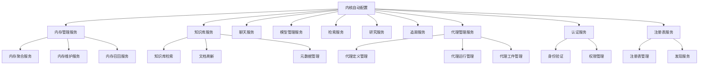

**图表来源**
- [SeahorseAgentKernelMemoryAutoConfiguration.java](file://seahorse-agent-spring-boot-starter/src/main/java/com/miracle/ai/seahorse/agent/adapters/spring/SeahorseAgentKernelMemoryAutoConfiguration.java)
- [SeahorseAgentKernelKnowledgeAutoConfiguration.java](file://seahorse-agent-spring-boot-starter/src/main/java/com/miracle/ai/seahorse/agent/adapters/spring/SeahorseAgentKernelKnowledgeAutoConfiguration.java)
- [SeahorseAgentKernelAgentAutoConfiguration.java](file://seahorse-agent-spring-boot-starter/src/main/java/com/miracle/ai/seahorse/agent/adapters/spring/SeahorseAgentKernelAgentAutoConfiguration.java)
- [SeahorseAgentKernelAuthAutoConfiguration.java](file://seahorse-agent-spring-boot-starter/src/main/java/com/miracle/ai/seahorse/agent/adapters/spring/SeahorseAgentKernelAuthAutoConfiguration.java)
- [SeahorseAgentKernelRegistryAutoConfiguration.java](file://seahorse-agent-spring-boot-starter/src/main/java/com/miracle/ai/seahorse/agent/adapters/spring/SeahorseAgentKernelRegistryAutoConfiguration.java)

### 条件装配策略
核心内核模块采用严格的条件装配策略，确保只有在满足依赖条件时才注册相应的Bean。

**章节来源**
- [SeahorseAgentKernelAutoConfiguration.java](file://seahorse-agent-spring-boot-starter/src/main/java/com/miracle/ai/seahorse/agent/adapters/spring/SeahorseAgentKernelAutoConfiguration.java)
- [SeahorseAgentKernelMemoryAutoConfiguration.java](file://seahorse-agent-spring-boot-starter/src/main/java/com/miracle/ai/seahorse/agent/adapters/spring/SeahorseAgentKernelMemoryAutoConfiguration.java)

## 适配器模块自动配置
适配器模块负责连接外部系统和服务，提供统一的接口抽象。

### 外部系统适配
适配器模块通过AutoConfiguration类实现对外部系统的自动配置，包括AI服务、缓存、消息队列、存储等。

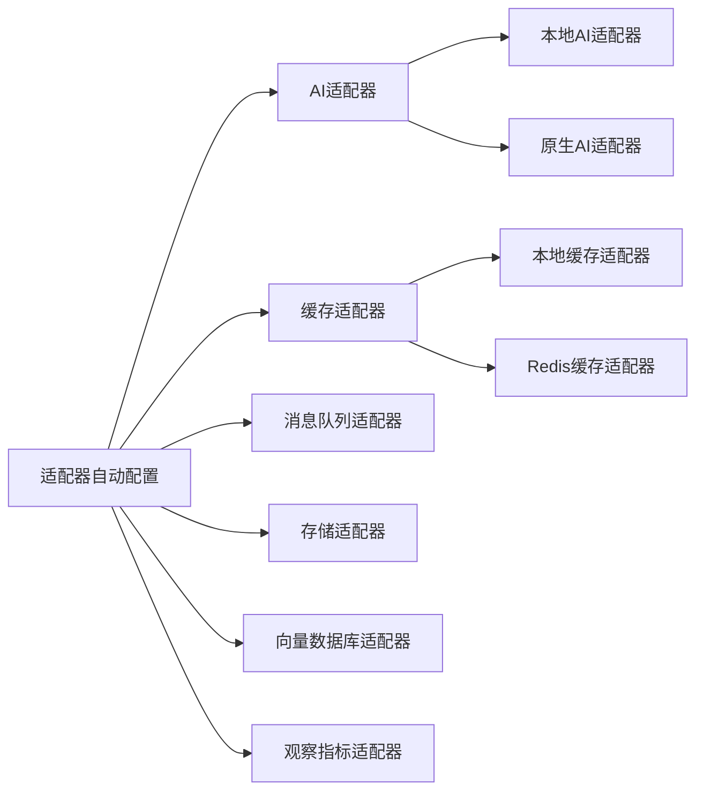

**图表来源**
- [SeahorseAgentAiAdapterAutoConfiguration.java](file://seahorse-agent-spring-boot-starter/src/main/java/com/miracle/ai/seahorse/agent/adapters/spring/SeahorseAgentAiAdapterAutoConfiguration.java)
- [SeahorseAgentCacheAdapterAutoConfiguration.java](file://seahorse-agent-spring-boot-starter/src/main/java/com/miracle/ai/seahorse/agent/adapters/spring/SeahorseAgentCacheAdapterAutoConfiguration.java)

### 依赖注入与Bean管理
适配器模块通过条件注解实现智能的依赖注入，确保只在存在相应依赖时才创建Bean实例。

**章节来源**
- [SeahorseAgentStorageAdapterAutoConfiguration.java](file://seahorse-agent-spring-boot-starter/src/main/java/com/miracle/ai/seahorse/agent/adapters/spring/SeahorseAgentStorageAdapterAutoConfiguration.java)
- [SeahorseAgentVectorAdapterAutoConfiguration.java](file://seahorse-agent-spring-boot-starter/src/main/java/com/miracle/ai/seahorse/agent/adapters/spring/SeahorseAgentVectorAdapterAutoConfiguration.java)

## 代理市场和管理员模块自动配置
代理市场和管理员模块自动配置类提供代理市场管理和管理员功能的支持。

### 管理员功能组件
管理员模块提供完整的后台管理功能，包括代理市场管理、用户管理、系统配置等。

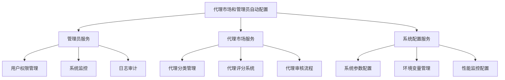

**图表来源**
- [SeahorseAgentMarketplaceAdminAutoConfiguration.java](file://seahorse-agent-spring-boot-starter/src/main/java/com/miracle/ai/seahorse/agent/adapters/spring/SeahorseAgentMarketplaceAdminAutoConfiguration.java)

### 管理员权限控制
管理员模块通过严格的权限控制确保系统安全，支持多层级的权限管理和审计功能。

**章节来源**
- [SeahorseAgentMarketplaceAdminAutoConfiguration.java](file://seahorse-agent-spring-boot-starter/src/main/java/com/miracle/ai/seahorse/agent/adapters/spring/SeahorseAgentMarketplaceAdminAutoConfiguration.java)

## 内核代理模块自动配置
内核代理模块自动配置类负责代理管理功能的配置，包括代理定义、运行管理和工件管理。

### 代理管理组件
内核代理模块提供完整的代理生命周期管理功能，包括代理定义、运行状态跟踪和工件管理。

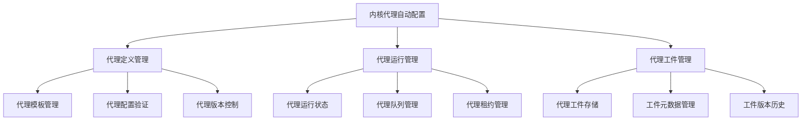

**图表来源**
- [SeahorseAgentKernelAgentAutoConfiguration.java](file://seahorse-agent-spring-boot-starter/src/main/java/com/miracle/ai/seahorse/agent/adapters/spring/SeahorseAgentKernelAgentAutoConfiguration.java)

### 代理生命周期管理
内核代理模块通过自动配置实现代理的完整生命周期管理，从创建到销毁的全过程自动化。

**章节来源**
- [SeahorseAgentKernelAgentAutoConfiguration.java](file://seahorse-agent-spring-boot-starter/src/main/java/com/miracle/ai/seahorse/agent/adapters/spring/SeahorseAgentKernelAgentAutoConfiguration.java)

## 内核认证模块自动配置
内核认证模块自动配置类提供身份验证和权限管理功能。

### 认证服务组件
内核认证模块提供多层级的身份验证和权限管理机制，确保系统访问的安全性。

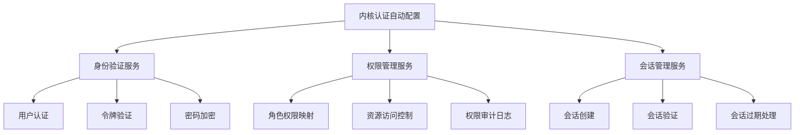

**图表来源**
- [SeahorseAgentKernelAuthAutoConfiguration.java](file://seahorse-agent-spring-boot-starter/src/main/java/com/miracle/ai/seahorse/agent/adapters/spring/SeahorseAgentKernelAuthAutoConfiguration.java)

### 安全认证机制
内核认证模块通过多种认证机制实现系统安全，包括用户认证、令牌验证和权限控制。

**章节来源**
- [SeahorseAgentKernelAuthAutoConfiguration.java](file://seahorse-agent-spring-boot-starter/src/main/java/com/miracle/ai/seahorse/agent/adapters/spring/SeahorseAgentKernelAuthAutoConfiguration.java)

## 内核注册表模块自动配置
内核注册表模块自动配置类提供注册表管理和发现服务。

### 注册表管理组件
内核注册表模块提供服务注册和发现功能，支持动态的服务管理和负载均衡。

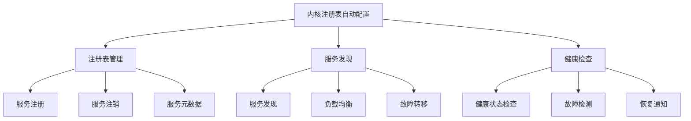

**图表来源**
- [SeahorseAgentKernelRegistryAutoConfiguration.java](file://seahorse-agent-spring-boot-starter/src/main/java/com/miracle/ai/seahorse/agent/adapters/spring/SeahorseAgentKernelRegistryAutoConfiguration.java)

### 服务发现机制
内核注册表模块通过自动配置实现服务的动态发现和管理，支持高可用和弹性扩展。

**章节来源**
- [SeahorseAgentKernelRegistryAutoConfiguration.java](file://seahorse-agent-spring-boot-starter/src/main/java/com/miracle/ai/seahorse/agent/adapters/spring/SeahorseAgentKernelRegistryAutoConfiguration.java)

## 计费模块自动配置
计费模块自动配置类负责注册SaaS订阅、支付处理和账单管理相关的服务。

### 计费服务组件
计费模块提供完整的SaaS计费解决方案，包括订阅计划管理、支付订单处理和账单生成查询。

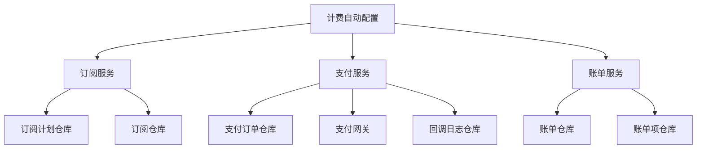

**图表来源**
- [SeahorseAgentBillingAutoConfiguration.java](file://seahorse-agent-spring-boot-starter/src/main/java/com/miracle/ai/seahorse/agent/adapters/spring/SeahorseAgentBillingAutoConfiguration.java)

### 配置属性与启用机制
计费模块默认启用，可通过配置属性进行禁用控制。

**章节来源**
- [SeahorseAgentBillingAutoConfiguration.java](file://seahorse-agent-spring-boot-starter/src/main/java/com/miracle/ai/seahorse/agent/adapters/spring/SeahorseAgentBillingAutoConfiguration.java)

## 安全模块自动配置
安全模块自动配置类提供安全加固功能，包括沙箱路径验证、密钥轮换和访问控制。

### 安全服务组件
安全模块提供多层次的安全保护机制，确保系统运行的安全性和合规性。

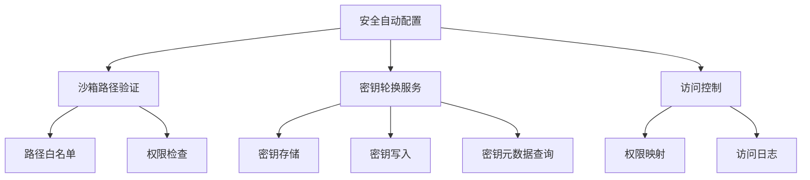

**图表来源**
- [SeahorseAgentSecurityAutoConfiguration.java](file://seahorse-agent-spring-boot-starter/src/main/java/com/miracle/ai/seahorse/agent/adapters/spring/SeahorseAgentSecurityAutoConfiguration.java)

### 安全加固功能
安全模块通过多种机制实现系统安全加固，包括路径验证、密钥管理和异常处理。

**章节来源**
- [SeahorseAgentSecurityAutoConfiguration.java](file://seahorse-agent-spring-boot-starter/src/main/java/com/miracle/ai/seahorse/agent/adapters/spring/SeahorseAgentSecurityAutoConfiguration.java)

## 用户注册模块自动配置
用户注册模块自动配置类负责用户注册流程和试用期管理的配置。

### 注册服务组件
注册模块提供完整的用户注册和试用管理功能，包括密码哈希、邮件发送和租户分配。

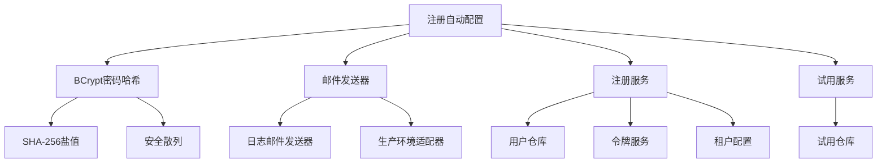

**图表来源**
- [SeahorseAgentRegistrationAutoConfiguration.java](file://seahorse-agent-spring-boot-starter/src/main/java/com/miracle/ai/seahorse/agent/adapters/spring/SeahorseAgentRegistrationAutoConfiguration.java)

### 优先级配置机制
注册模块通过`@AutoConfigureBefore`注解确保BCrypt密码哈希器在认证适配器之前注册。

**章节来源**
- [SeahorseAgentRegistrationAutoConfiguration.java](file://seahorse-agent-spring-boot-starter/src/main/java/com/miracle/ai/seahorse/agent/adapters/spring/SeahorseAgentRegistrationAutoConfiguration.java)

## 多租户模块自动配置
多租户模块自动配置类提供多租户支持，包括数据库模式升级和连接准备。

### 多租户支持
多租户模块通过数据库模式升级和连接准备实现多租户隔离和资源管理。

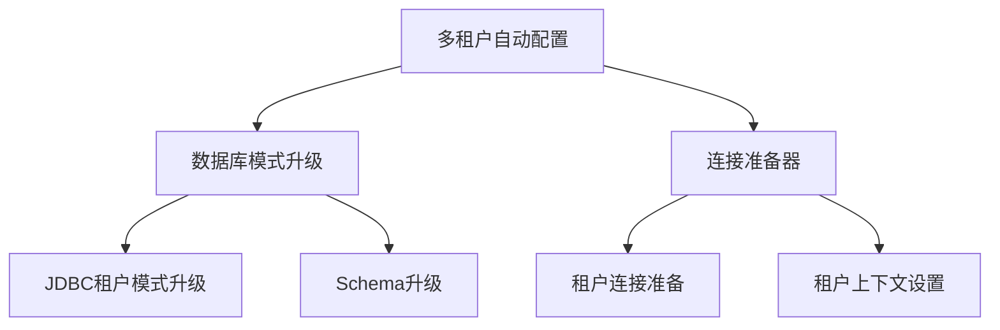

**图表来源**
- [SeahorseAgentTenantAutoConfiguration.java](file://seahorse-agent-spring-boot-starter/src/main/java/com/miracle/ai/seahorse/agent/adapters/spring/SeahorseAgentTenantAutoConfiguration.java)

### 层次化配置顺序
多租户模块作为第一层配置，在数据源自动配置之后、认证适配器之前执行。

**章节来源**
- [SeahorseAgentTenantAutoConfiguration.java](file://seahorse-agent-spring-boot-starter/src/main/java/com/miracle/ai/seahorse/agent/adapters/spring/SeahorseAgentTenantAutoConfiguration.java)

## 告警模块自动配置
告警模块自动配置类提供系统告警功能，包括钉钉通知和默认告警规则。

### 告警系统组件
告警模块提供完整的监控告警解决方案，支持多种通知渠道和告警规则配置。

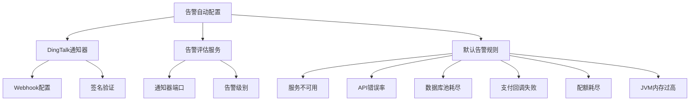

**图表来源**
- [SeahorseAgentAlertAutoConfiguration.java](file://seahorse-agent-spring-boot-starter/src/main/java/com/miracle/ai/seahorse/agent/adapters/spring/SeahorseAgentAlertAutoConfiguration.java)

### 配置属性管理
告警模块通过配置属性管理DingTalk通知器的Webhook和密钥配置。

**章节来源**
- [SeahorseAgentAlertAutoConfiguration.java](file://seahorse-agent-spring-boot-starter/src/main/java/com/miracle/ai/seahorse/agent/adapters/spring/SeahorseAgentAlertAutoConfiguration.java)

## 中间件健康检查自动配置
中间件健康检查自动配置类提供Spring Boot Actuator的健康检查功能。

### 健康检查组件
健康检查模块为PostgreSQL数据库提供连接健康检查，确保数据库连接的可用性。

```mermaid
graph TD
A[中间件健康检查] --> B[PostgreSQL健康指示器]
B --> B1[连接验证]
B --> B2[数据库信息]
B --> B3[版本信息]
B1 --> B11[isValid()检查]
B1 --> B12[连接超时]
B2 --> B21[数据库产品名]
B2 --> B22[数据库版本]
```

**图表来源**
- [SeahorseAgentMiddlewareHealthAutoConfiguration.java](file://seahorse-agent-spring-boot-starter/src/main/java/com/miracle/ai/seahorse/agent/adapters/spring/SeahorseAgentMiddlewareHealthAutoConfiguration.java)

### 健康检查实现
健康检查模块通过直接连接验证数据库连通性，提供详细的健康状态信息。

**章节来源**
- [SeahorseAgentMiddlewareHealthAutoConfiguration.java](file://seahorse-agent-spring-boot-starter/src/main/java/com/miracle/ai/seahorse/agent/adapters/spring/SeahorseAgentMiddlewareHealthAutoConfiguration.java)

## 简单计量注册表自动配置
简单计量注册表自动配置类提供Micrometer监控支持的回退实现。

### 计量监控组件
计量注册表模块提供简单的监控指标收集功能，当没有其他监控系统时作为回退选项。

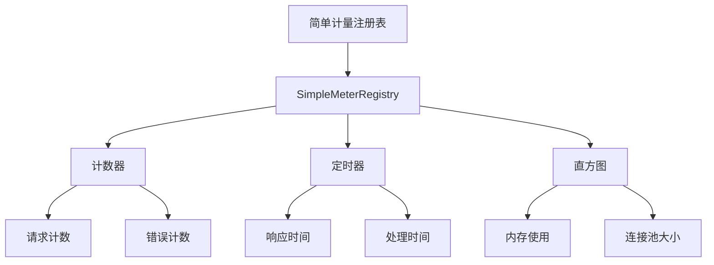

**图表来源**
- [SeahorseAgentSimpleMeterRegistryAutoConfiguration.java](file://seahorse-agent-spring-boot-starter/src/main/java/com/miracle/ai/seahorse/agent/adapters/spring/SeahorseAgentSimpleMeterRegistryAutoConfiguration.java)

### 监控系统集成
简单计量注册表作为Micrometer监控系统的回退实现，当Prometheus等其他监控系统不可用时自动启用。

**章节来源**
- [SeahorseAgentSimpleMeterRegistryAutoConfiguration.java](file://seahorse-agent-spring-boot-starter/src/main/java/com/miracle/ai/seahorse/agent/adapters/spring/SeahorseAgentSimpleMeterRegistryAutoConfiguration.java)

## 条件装配机制详解
Spring Boot Starter通过多种条件注解实现智能的Bean装配，确保只有在满足特定条件时才注册Bean。

### 条件注解类型
- `@ConditionalOnProperty`：基于配置属性的条件装配
- `@ConditionalOnBean`：基于Bean存在的条件装配
- `@ConditionalOnMissingBean`：基于Bean不存在的条件装配
- `@ConditionalOnClass`：基于类存在的条件装配

### 条件装配策略
不同的自动配置类采用不同的条件装配策略，确保系统的灵活性和可配置性。

**章节来源**
- [SeahorseAgentBillingAutoConfiguration.java](file://seahorse-agent-spring-boot-starter/src/main/java/com/miracle/ai/seahorse/agent/adapters/spring/SeahorseAgentBillingAutoConfiguration.java)
- [SeahorseAgentSecurityAutoConfiguration.java](file://seahorse-agent-spring-boot-starter/src/main/java/com/miracle/ai/seahorse/agent/adapters/spring/SeahorseAgentSecurityAutoConfiguration.java)

## 属性绑定与配置管理
Spring Boot Starter通过@ConfigurationProperties注解实现属性绑定，提供灵活的配置管理机制。

### 配置属性绑定
自动配置类通过@ConfigurationProperties注解将配置属性绑定到Java对象，实现类型安全的配置访问。

### 配置前缀管理
不同模块使用不同的配置前缀，避免配置冲突并提供清晰的配置层次结构。

**章节来源**
- [SeahorseAgentAlertAutoConfiguration.java](file://seahorse-agent-spring-boot-starter/src/main/java/com/miracle/ai/seahorse/agent/adapters/spring/SeahorseAgentAlertAutoConfiguration.java)

## Bean注册与生命周期
Spring Boot Starter通过@Bean注解实现Bean的注册和生命周期管理。

### Bean注册策略
自动配置类通过@Bean注解注册所需的Bean实例，支持条件装配和依赖注入。

### 生命周期管理
Bean的生命周期由Spring容器管理，包括初始化、依赖注入和销毁过程。

**章节来源**
- [SeahorseAgentRegistrationAutoConfiguration.java](file://seahorse-agent-spring-boot-starter/src/main/java/com/miracle/ai/seahorse/agent/adapters/spring/SeahorseAgentRegistrationAutoConfiguration.java)

## 版本管理与兼容性
Spring Boot Starter遵循语义化版本控制，确保向后兼容性和版本间的平滑升级。

### 版本管理策略
- 主版本：重大架构变更
- 次版本：新功能添加
- 修订版本：bug修复和小功能更新

### 兼容性考虑
自动配置类设计时充分考虑向后兼容性，避免破坏性的API变更。

## 自定义Starter开发指南
开发者可以参考现有自动配置类的实现模式，开发自定义的Spring Boot Starter。

### 开发步骤
1. 创建新的AutoConfiguration类
2. 定义条件装配注解
3. 实现Bean注册逻辑
4. 添加配置属性绑定
5. 编写测试用例

### 最佳实践
- 使用明确的条件注解
- 提供合理的默认配置
- 实现良好的错误处理
- 编写完整的测试覆盖

## 最佳实践与常见问题
Spring Boot Starter开发和使用中的最佳实践和常见问题解答。

### 性能优化建议
- 合理使用条件装配
- 避免不必要的Bean创建
- 优化配置属性访问

### 故障排除
- 检查依赖关系
- 验证配置属性
- 查看启动日志