# Spring Boot自动配置

<cite>
**本文档引用的文件**
- [SeahorseAgentApplication.java](file://seahorse-agent-bootstrap/src/main/java/com/miracle/ai/seahorse/agent/SeahorseAgentApplication.java)
- [application.properties](file://seahorse-agent-bootstrap/src/main/resources/application.properties)
- [SeahorseAgentAiAdapterAutoConfiguration.java](file://seahorse-agent-spring-boot-starter/src/main/java/com/miracle/ai/seahorse/agent/adapters/spring/SeahorseAgentAiAdapterAutoConfiguration.java)
- [SeahorseAgentKernelAutoConfiguration.java](file://seahorse-agent-spring-boot-starter/src/main/java/com/miracle/ai/seahorse/agent/adapters/spring/SeahorseAgentKernelAutoConfiguration.java)
- [SeahorseAgentKernelAgentAutoConfiguration.java](file://seahorse-agent-spring-boot-starter/src/main/java/com/miracle/ai/seahorse/agent/adapters/spring/SeahorseAgentKernelAgentAutoConfiguration.java)
- [SeahorseAgentKernelMemoryAutoConfiguration.java](file://seahorse-agent-spring-boot-starter/src/main/java/com/miracle/ai/seahorse/agent/adapters/spring/SeahorseAgentKernelMemoryAutoConfiguration.java)
- [SeahorseAgentKernelKnowledgeAutoConfiguration.java](file://seahorse-agent-spring-boot-starter/src/main/java/com/miracle/ai/seahorse/agent/adapters/spring/SeahorseAgentKernelKnowledgeAutoConfiguration.java)
- [SeahorseAgentKernelChatAutoConfiguration.java](file://seahorse-agent-spring-boot-starter/src/main/java/com/miracle/ai/seahorse/agent/adapters/spring/SeahorseAgentKernelChatAutoConfiguration.java)
- [SeahorseAgentKernelEvalAutoConfiguration.java](file://seahorse-agent-spring-boot-starter/src/main/java/com/miracle/ai/seahorse/agent/adapters/spring/SeahorseAgentKernelEvalAutoConfiguration.java)
- [SeahorseAgentKernelResearchAutoConfiguration.java](file://seahorse-agent-spring-boot-starter/src/main/java/com/miracle/ai/seahorse/agent/adapters/spring/SeahorseAgentKernelResearchAutoConfiguration.java)
- [SeahorseAgentKernelRetrievalAutoConfiguration.java](file://seahorse-agent-spring-boot-starter/src/main/java/com/miracle/ai/seahorse/agent/adapters/spring/SeahorseAgentKernelRetrievalAutoConfiguration.java)
- [SeahorseAgentKernelTraceAutoConfiguration.java](file://seahorse-agent-spring-boot-starter/src/main/java/com/miracle/ai/seahorse/agent/adapters/spring/SeahorseAgentKernelTraceAutoConfiguration.java)
- [SeahorseAgentKernelPluginAutoConfiguration.java](file://seahorse-agent-spring-boot-starter/src/main/java/com/miracle/ai/seahorse/agent/adapters/spring/SeahorseAgentKernelPluginAutoConfiguration.java)
- [SeahorseAgentKernelRegistryAutoConfiguration.java](file://seahorse-agent-spring-boot-starter/src/main/java/com/miracle/ai/seahorse/agent/adapters/spring/SeahorseAgentKernelRegistryAutoConfiguration.java)
- [SeahorseAgentKernelDocumentRefreshAutoConfiguration.java](file://seahorse-agent-spring-boot-starter/src/main/java/com/miracle/ai/seahorse/agent/adapters/spring/SeahorseAgentKernelDocumentRefreshAutoConfiguration.java)
- [SeahorseAgentKernelModelAutoConfiguration.java](file://seahorse-agent-spring-boot-starter/src/main/java/com/miracle/ai/seahorse/agent/adapters/spring/SeahorseAgentKernelModelAutoConfiguration.java)
- [SeahorseAgentKernelOpsAutoConfiguration.java](file://seahorse-agent-spring-boot-starter/src/main/java/com/miracle/ai/seahorse/agent/adapters/spring/SeahorseAgentKernelOpsAutoConfiguration.java)
- [SeahorseAgentKernelAuthAutoConfiguration.java](file://seahorse-agent-spring-boot-starter/src/main/java/com/miracle/ai/seahorse/agent/adapters/spring/SeahorseAgentKernelAuthAutoConfiguration.java)
- [SeahorseAgentKernelKeywordAutoConfiguration.java](file://seahorse-agent-spring-boot-starter/src/main/java/com/miracle/ai/seahorse/agent/adapters/spring/SeahorseAgentKernelKeywordAutoConfiguration.java)
- [SeahorseAgentKernelMetadataAutoConfiguration.java](file://seahorse-agent-spring-boot-starter/src/main/java/com/miracle/ai/seahorse/agent/adapters/spring/SeahorseAgentKernelMetadataAutoConfiguration.java)
- [SeahorseAgentAiAdapterAutoConfiguration.java](file://seahorse-agent-adapter-ai-openai-compatible/src/main/java/com/miracle/ai/seahorse/agent/adapters/ai/openai/OpenAiCompatibleMemoryCompactionAutoConfiguration.java)
- [SeahorseAgentAiAdapterAutoConfiguration.java](file://seahorse-agent-adapter-ai-openai-compatible/src/main/java/com/miracle/ai/seahorse/agent/adapters/ai/openai/OpenAiCompatibleMemoryRefinerAutoConfiguration.java)
- [SeahorseAgentAuthAdapterAutoConfiguration.java](file://seahorse-agent-spring-boot-starter/src/main/java/com/miracle/ai/seahorse/agent/adapters/spring/SeahorseAgentAuthAdapterAutoConfiguration.java)
- [SeahorseAgentCacheAdapterAutoConfiguration.java](file://seahorse-agent-spring-boot-starter/src/main/java/com/miracle/ai/seahorse/agent/adapters/spring/SeahorseAgentCacheAdapterAutoConfiguration.java)
- [SeahorseAgentCredentialAutoConfiguration.java](file://seahorse-agent-spring-boot-starter/src/main/java/com/miracle/ai/seahorse/agent/adapters/spring/SeahorseAgentCredentialAutoConfiguration.java)
- [SeahorseAgentIngestionRepositoryAutoConfiguration.java](file://seahorse-agent-spring-boot-starter/src/main/java/com/miracle/ai/seahorse/agent/adapters/spring/SeahorseAgentIngestionRepositoryAutoConfiguration.java)
- [SeahorseAgentKnowledgeRepositoryAutoConfiguration.java](file://seahorse-agent-spring-boot-starter/src/main/java/com/miracle/ai/seahorse/agent/adapters/spring/SeahorseAgentKnowledgeRepositoryAutoConfiguration.java)
- [SeahorseAgentMemoryRepositoryAutoConfiguration.java](file://seahorse-agent-spring-boot-starter/src/main/java/com/miracle/ai/seahorse/agent/adapters/spring/SeahorseAgentMemoryRepositoryAutoConfiguration.java)
- [SeahorseAgentRegistryRepositoryAutoConfiguration.java](file://seahorse-agent-spring-boot-starter/src/main/java/com/miracle/ai/seahorse/agent/adapters/spring/SeahorseAgentRegistryRepositoryAutoConfiguration.java)
- [SeahorseAgentRetrievalRepositoryAutoConfiguration.java](file://seahorse-agent-spring-boot-starter/src/main/java/com/miracle/ai/seahorse/agent/adapters/spring/SeahorseAgentRetrievalRepositoryAutoConfiguration.java)
- [SeahorseAgentOpsRepositoryAutoConfiguration.java](file://seahorse-agent-spring-boot-starter/src/main/java/com/miracle/ai/seahorse/agent/adapters/spring/SeahorseAgentOpsRepositoryAutoConfiguration.java)
- [SeahorseAgentStorageAdapterAutoConfiguration.java](file://seahorse-agent-spring-boot-starter/src/main/java/com/miracle/ai/seahorse/agent/adapters/spring/SeahorseAgentStorageAdapterAutoConfiguration.java)
- [SeahorseAgentVectorAdapterAutoConfiguration.java](file://seahorse-agent-spring-boot-starter/src/main/java/com/miracle/ai/seahorse/agent/adapters/spring/SeahorseAgentVectorAdapterAutoConfiguration.java)
- [SeahorseAgentMqAdapterAutoConfiguration.java](file://seahorse-agent-spring-boot-starter/src/main/java/com/miracle/ai/seahorse/agent/adapters/spring/SeahorseAgentMqAdapterAutoConfiguration.java)
- [SeahorseAgentObservationAdapterAutoConfiguration.java](file://seahorse-agent-spring-boot-starter/src/main/java/com/miracle/ai/seahorse/agent/adapters/spring/SeahorseAgentObservationAdapterAutoConfiguration.java)
- [SeahorseAgentOutboxRelayAutoConfiguration.java](file://seahorse-agent-spring-boot-starter/src/main/java/com/miracle/ai/seahorse/agent/adapters/spring/SeahorseAgentOutboxRelayAutoConfiguration.java)
- [SeahorseAgentMemoryOutboxAutoConfiguration.java](file://seahorse-agent-spring-boot-starter/src/main/java/com/miracle/ai/seahorse/agent/adapters/spring/SeahorseAgentMemoryOutboxAutoConfiguration.java)
- [SeahorseAgentMemoryRecallAutoConfiguration.java](file://seahorse-agent-spring-boot-starter/src/main/java/com/miracle/ai/seahorse/agent/adapters/spring/SeahorseAgentMemoryRecallAutoConfiguration.java)
- [SeahorseAgentMemoryMaintenanceAutoConfiguration.java](file://seahorse-agent-spring-boot-starter/src/main/java/com/miracle/ai/seahorse/agent/adapters/spring/SeahorseAgentMemoryMaintenanceAutoConfiguration.java)
- [SeahorseAgentMemoryAggregationAutoConfiguration.java](file://seahorse-agent-spring-boot-starter/src/main/java/com/miracle/ai/seahorse/agent/adapters/spring/SeahorseAgentMemoryAggregationAutoConfiguration.java)
- [SeahorseAgentRagWorkflowAutoConfiguration.java](file://seahorse-agent-spring-boot-starter/src/main/java/com/miracle/ai/seahorse/agent/adapters/spring/SeahorseAgentRagWorkflowAutoConfiguration.java)
- [SeahorseAgentSecurityAutoConfiguration.java](file://seahorse-agent-spring-boot-starter/src/main/java/com/miracle/ai/seahorse/agent/adapters/spring/SeahorseAgentSecurityAutoConfiguration.java)
- [SeahorseAgentBillingAutoConfiguration.java](file://seahorse-agent-spring-boot-starter/src/main/java/com/miracle/ai/seahorse/agent/adapters/spring/SeahorseAgentBillingAutoConfiguration.java)
- [SeahorseAgentAlertAutoConfiguration.java](file://seahorse-agent-spring-boot-starter/src/main/java/com/miracle/ai/seahorse/agent/adapters/spring/SeahorseAgentAlertAutoConfiguration.java)
- [SeahorseAgentAopAutoConfiguration.java](file://seahorse-agent-spring-boot-starter/src/main/java/com/miracle/ai/seahorse/agent/adapters/spring/SeahorseAgentAopAutoConfiguration.java)
- [KbPermissionAspect.java](file://seahorse-agent-adapter-web/src/main/java/com/miracle/ai/seahorse/agent/adapters/web/KbPermissionAspect.java)
- [SuperAdminAspect.java](file://seahorse-agent-adapter-web/src/main/java/com/miracle/ai/seahorse/agent/adapters/web/SuperAdminAspect.java)
- [TrialExpiredInterceptor.java](file://seahorse-agent-adapter-web/src/main/java/com/miracle/ai/seahorse/agent/adapters/web/TrialExpiredInterceptor.java)
- [AgentPopularityRecalculationJob.java](file://seahorse-agent-spring-boot-starter/src/main/java/com/miracle/ai/seahorse/agent/adapters/spring/AgentPopularityRecalculationJob.java)
- [SeahorseAgentTenantAutoConfiguration.java](file://seahorse-agent-spring-boot-starter/src/main/java/com/miracle/ai/seahorse/agent/adapters/spring/SeahorseAgentTenantAutoConfiguration.java)
- [SeahorseAgentNativeAdapterAutoConfiguration.java](file://seahorse-agent-spring-boot-starter/src/main/java/com/miracle/ai/seahorse/agent/adapters/spring/SeahorseAgentNativeAdapterAutoConfiguration.java)
- [SeahorseAgentLocalAdapterAutoConfiguration.java](file://seahorse-agent-spring-boot-starter/src/main/java/com/miracle/ai/seahorse/agent/adapters/spring/SeahorseAgentLocalAdapterAutoConfiguration.java)
- [SeahorseAgentMarketplaceAdminAutoConfiguration.java](file://seahorse-agent-spring-boot-starter/src/main/java/com/miracle/ai/seahorse/agent/adapters/spring/SeahorseAgentMarketplaceAdminAutoConfiguration.java)
- [SeahorseAgentMiddlewareHealthAutoConfiguration.java](file://seahorse-agent-spring-boot-starter/src/main/java/com/miracle/ai/seahorse/agent/adapters/spring/SeahorseAgentMiddlewareHealthAutoConfiguration.java)
- [SeahorseAgentSreAdapterHealthAutoConfiguration.java](file://seahorse-agent-spring-boot-starter/src/main/java/com/miracle/ai/seahorse/agent/adapters/spring/SeahorseAgentSreAdapterHealthAutoConfiguration.java)
- [SeahorseAgentRedisHealthAutoConfiguration.java](file://seahorse-agent-spring-boot-starter/src/main/java/com/miracle/ai/seahorse/agent/adapters/spring/SeahorseAgentRedisHealthAutoConfiguration.java)
- [SeahorseAgentRegistrationAutoConfiguration.java](file://seahorse-agent-spring-boot-starter/src/main/java/com/miracle/ai/seahorse/agent/adapters/spring/SeahorseAgentRegistrationAutoConfiguration.java)
- [SeahorseAgentRuntimeGuardAutoConfiguration.java](file://seahorse-agent-spring-boot-starter/src/main/java/com/miracle/ai/seahorse/agent/adapters/spring/SeahorseAgentRuntimeGuardAutoConfiguration.java)
- [SeahorseAgentSimpleMeterRegistryAutoConfiguration.java](file://seahorse-agent-spring-boot-starter/src/main/java/com/miracle/ai/seahorse/agent/adapters/spring/SeahorseAgentSimpleMeterRegistryAutoConfiguration.java)
- [SeahorseAgentNoopPortGuard.java](file://seahorse-agent-spring-boot-starter/src/main/java/com/miracle/ai/seahorse/agent/adapters/spring/SeahorseAgentNoopPortGuard.java)
- [SeahorseAgentKeywordAdapterAutoConfiguration.java](file://seahorse-agent-spring-boot-starter/src/main/java/com/miracle/ai/seahorse/agent/adapters/spring/SeahorseAgentKeywordAdapterAutoConfiguration.java)
- [SeahorseAgentMetadataAdapterAutoConfiguration.java](file://seahorse-agent-spring-boot-starter/src/main/java/com/miracle/ai/seahorse/agent/adapters/spring/SeahorseAgentMetadataAdapterAutoConfiguration.java)
- [SeahorseAgentAiModelConfigAutoConfiguration.java](file://seahorse-agent-spring-boot-starter/src/main/java/com/miracle/ai/seahorse/agent/adapters/spring/SeahorseAgentAiModelConfigAutoConfiguration.java)
- [SeahorseAgentPopularityRecalculationJob.java](file://seahorse-agent-spring-boot-starter/src/main/java/com/miracle/ai/seahorse/agent/adapters/spring/AgentPopularityRecalculationJob.java)
- [SeahorseDocumentRefreshJob.java](file://seahorse-agent-spring-boot-starter/src/main/java/com/miracle/ai/seahorse/agent/adapters/spring/DocumentRefreshJob.java)
- [SeahorseAgentAiAdapterAutoConfiguration.java](file://seahorse-agent-adapter-ai-openai-compatible/src/main/java/com/miracle/ai/seahorse/agent/adapters/ai/openai/OpenAiCompatibleMemoryCompactionAutoConfiguration.java)
- [SeahorseAgentAiAdapterAutoConfiguration.java](file://seahorse-agent-adapter-ai-openai-compatible/src/main/java/com/miracle/ai/seahorse/agent/adapters/ai/openai/OpenAiCompatibleMemoryRefinerAutoConfiguration.java)
- [JdbcLoginHistoryAdapter.java](file://seahorse-agent-adapter-repository-jdbc/src/main/java/com/miracle/ai/seahorse/agent/adapters/repository/jdbc/JdbcLoginHistoryAdapter.java)
- [LoginHistoryPort.java](file://seahorse-agent-kernel/src/main/java/com/miracle/ai/seahorse/agent/ports/outbound/auth/LoginHistoryPort.java)
- [QuotaPolicy.java](file://seahorse-agent-kernel/src/main/java/com/miracle/ai/seahorse/agent/kernel/domain/agent/quota/QuotaPolicy.java)
- [KernelQuotaSummaryService.java](file://seahorse-agent-kernel/src/main/java/com/miracle/ai/seahorse/agent/kernel/application/agent/quota/KernelQuotaSummaryService.java)
</cite>

## 更新摘要
**变更内容**
- 新增登录历史记录端口（LoginHistoryPort）和JDBC适配器支持
- 集成配额执行服务（QuotaEnforcementService）和配额策略管理
- 注册收入服务（RevenueService）以支持计费功能
- 扩展仓库端口方法以支持新的数据访问模式
- 更新自动配置系统以支持这些新组件的无缝集成

## 目录
1. [简介](#简介)
2. [项目结构](#项目结构)
3. [核心组件](#核心组件)
4. [架构概览](#架构概览)
5. [详细组件分析](#详细组件分析)
6. [AOP切面与拦截器管理](#aop切面与拦截器管理)
7. [新组件集成](#新组件集成)
8. [依赖关系分析](#依赖关系分析)
9. [性能考虑](#性能考虑)
10. [故障排除指南](#故障排除指南)
11. [结论](#结论)

## 简介

Spring Boot自动配置是Seahorse Agent项目中的一个关键特性，它允许开发者通过简单的依赖声明和配置来启用各种功能模块。该项目采用分层架构设计，通过多个自动配置类来管理不同领域的功能，包括AI适配器、内核组件、存储适配器、消息队列等。

自动配置机制的核心价值在于：
- **零样板代码**：通过条件注解自动配置Bean
- **可插拔架构**：按需启用特定功能
- **环境感知**：根据运行环境自动调整配置
- **模块化设计**：清晰的功能边界和职责分离
- **集中管理**：通过SeahorseAgentAopAutoConfiguration统一管理AOP组件
- **无缝集成**：支持新组件的平滑集成和扩展

## 项目结构

Seahorse Agent项目采用多模块架构，主要包含以下核心模块：

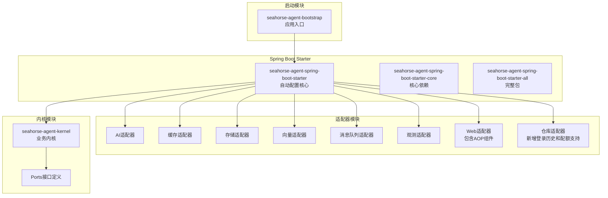

**图表来源**
- [SeahorseAgentApplication.java](file://seahorse-agent-bootstrap/src/main/java/com/miracle/ai/seahorse/agent/SeahorseAgentApplication.java)
- [SeahorseAgentAiAdapterAutoConfiguration.java](file://seahorse-agent-spring-boot-starter/src/main/java/com/miracle/ai/seahorse/agent/adapters/spring/SeahorseAgentAiAdapterAutoConfiguration.java)

**章节来源**
- [SeahorseAgentApplication.java](file://seahorse-agent-bootstrap/src/main/java/com/miracle/ai/seahorse/agent/SeahorseAgentApplication.java)
- [application.properties](file://seahorse-agent-bootstrap/src/main/resources/application.properties)

## 核心组件

### 自动配置基础架构

Spring Boot自动配置在Seahorse Agent中通过以下层次结构实现：

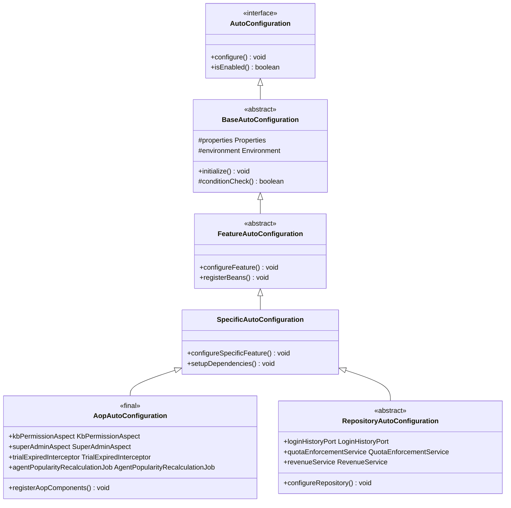

**图表来源**
- [SeahorseAgentKernelAutoConfiguration.java](file://seahorse-agent-spring-boot-starter/src/main/java/com/miracle/ai/seahorse/agent/adapters/spring/SeahorseAgentKernelAutoConfiguration.java)
- [SeahorseAgentAiAdapterAutoConfiguration.java](file://seahorse-agent-spring-boot-starter/src/main/java/com/miracle/ai/seahorse/agent/adapters/spring/SeahorseAgentAiAdapterAutoConfiguration.java)
- [SeahorseAgentAopAutoConfiguration.java](file://seahorse-agent-spring-boot-starter/src/main/java/com/miracle/ai/seahorse/agent/adapters/spring/SeahorseAgentAopAutoConfiguration.java)
- [SeahorseAgentIngestionRepositoryAutoConfiguration.java](file://seahorse-agent-spring-boot-starter/src/main/java/com/miracle/ai/seahorse/agent/adapters/spring/SeahorseAgentIngestionRepositoryAutoConfiguration.java)

### 条件配置机制

自动配置使用Spring Boot的条件注解来控制Bean的创建：

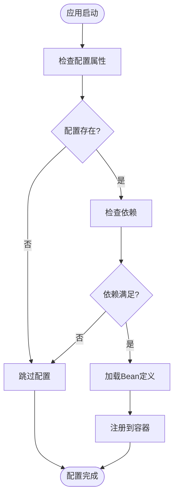

**图表来源**
- [SeahorseAgentKernelAutoConfiguration.java](file://seahorse-agent-spring-boot-starter/src/main/java/com/miracle/ai/seahorse/agent/adapters/spring/SeahorseAgentKernelAutoConfiguration.java)
- [SeahorseAgentCacheAdapterAutoConfiguration.java](file://seahorse-agent-spring-boot-starter/src/main/java/com/miracle/ai/seahorse/agent/adapters/spring/SeahorseAgentCacheAdapterAutoConfiguration.java)

**章节来源**
- [SeahorseAgentKernelAutoConfiguration.java](file://seahorse-agent-spring-boot-starter/src/main/java/com/miracle/ai/seahorse/agent/adapters/spring/SeahorseAgentKernelAutoConfiguration.java)
- [SeahorseAgentAiAdapterAutoConfiguration.java](file://seahorse-agent-spring-boot-starter/src/main/java/com/miracle/ai/seahorse/agent/adapters/spring/SeahorseAgentAiAdapterAutoConfiguration.java)

## 架构概览

### 整体架构设计

```mermaid
graph TB
subgraph "应用层"
App[SeahorseAgentApplication<br/>主应用类]
Config[application.properties<br/>配置文件]
end
subgraph "自动配置层"
KernelCfg[内核自动配置]
AdapterCfg[适配器自动配置]
RepoCfg[仓库自动配置]
JobCfg[作业自动配置]
AopCfg[AOP自动配置<br/>集中管理切面和拦截器]
NewCfg[新组件自动配置<br/>登录历史、配额、收入]
end
subgraph "功能模块层"
Kernel[内核组件]
AI[AI适配器]
Cache[缓存适配器]
Storage[存储适配器]
Vector[向量适配器]
MQ[消息队列]
Observation[观测适配器]
Web[Web适配器<br/>权限控制]
Repo[仓库适配器<br/>JDBC支持]
Billing[Billing模块<br/>计费功能]
end
subgraph "基础设施层"
DB[(数据库)]
Redis[(Redis)]
ES[(Elasticsearch)]
Milvus[(Milvus)]
```

**图表来源**
- [SeahorseAgentApplication.java](file://seahorse-agent-bootstrap/src/main/java/com/miracle/ai/seahorse/agent/SeahorseAgentApplication.java)
- [SeahorseAgentKernelAutoConfiguration.java](file://seahorse-agent-spring-boot-starter/src/main/java/com/miracle/ai/seahorse/agent/adapters/spring/SeahorseAgentKernelAutoConfiguration.java)
- [SeahorseAgentAopAutoConfiguration.java](file://seahorse-agent-spring-boot-starter/src/main/java/com/miracle/ai/seahorse/agent/adapters/spring/SeahorseAgentAopAutoConfiguration.java)
- [SeahorseAgentIngestionRepositoryAutoConfiguration.java](file://seahorse-agent-spring-boot-starter/src/main/java/com/miracle/ai/seahorse/agent/adapters/spring/SeahorseAgentIngestionRepositoryAutoConfiguration.java)

### 组件交互流程

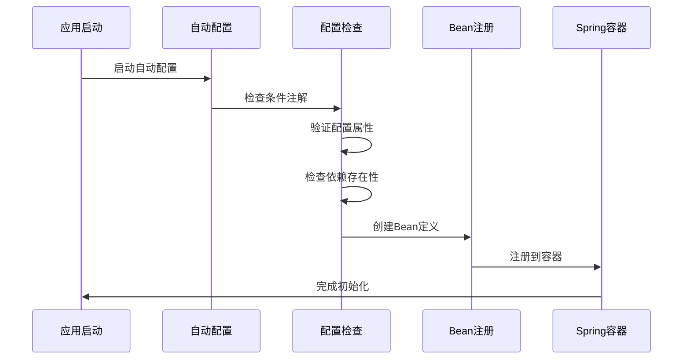

**图表来源**
- [SeahorseAgentKernelAutoConfiguration.java](file://seahorse-agent-spring-boot-starter/src/main/java/com/miracle/ai/seahorse/agent/adapters/spring/SeahorseAgentKernelAutoConfiguration.java)
- [SeahorseAgentAiAdapterAutoConfiguration.java](file://seahorse-agent-spring-boot-starter/src/main/java/com/miracle/ai/seahorse/agent/adapters/spring/SeahorseAgentAiAdapterAutoConfiguration.java)

## 详细组件分析

### 内核自动配置组件

内核自动配置是整个系统的中枢，负责管理核心业务功能：

#### 内核核心配置

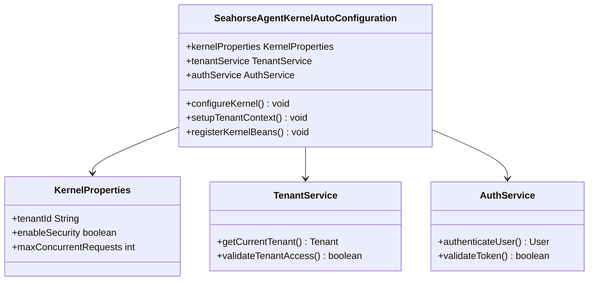

**图表来源**
- [SeahorseAgentKernelAutoConfiguration.java](file://seahorse-agent-spring-boot-starter/src/main/java/com/miracle/ai/seahorse/agent/adapters/spring/SeahorseAgentKernelAutoConfiguration.java)
- [SeahorseAgentKernelAuthAutoConfiguration.java](file://seahorse-agent-spring-boot-starter/src/main/java/com/miracle/ai/seahorse/agent/adapters/spring/SeahorseAgentKernelAuthAutoConfiguration.java)

#### 业务功能自动配置

系统为不同的业务领域提供了专门的自动配置类：

| 自动配置类 | 功能领域 | 主要职责 |
|------------|----------|----------|
| SeahorseAgentKernelAgentAutoConfiguration | 代理管理 | 代理生命周期管理、状态跟踪 |
| SeahorseAgentKernelMemoryAutoConfiguration | 记忆管理 | 记忆存储、检索、聚合 |
| SeahorseAgentKernelKnowledgeAutoConfiguration | 知识管理 | 知识库维护、更新策略 |
| SeahorseAgentKernelChatAutoConfiguration | 聊天功能 | 对话管理、上下文处理 |
| SeahorseAgentKernelEvalAutoConfiguration | 评估功能 | 性能评估、质量监控 |
| SeahorseAgentKernelResearchAutoConfiguration | 研究功能 | 研究任务管理、结果处理 |

**章节来源**
- [SeahorseAgentKernelAgentAutoConfiguration.java](file://seahorse-agent-spring-boot-starter/src/main/java/com/miracle/ai/seahorse/agent/adapters/spring/SeahorseAgentKernelAgentAutoConfiguration.java)
- [SeahorseAgentKernelMemoryAutoConfiguration.java](file://seahorse-agent-spring-boot-starter/src/main/java/com/miracle/ai/seahorse/agent/adapters/spring/SeahorseAgentKernelMemoryAutoConfiguration.java)
- [SeahorseAgentKernelKnowledgeAutoConfiguration.java](file://seahorse-agent-spring-boot-starter/src/main/java/com/miracle/ai/seahorse/agent/adapters/spring/SeahorseAgentKernelKnowledgeAutoConfiguration.java)

### 适配器自动配置组件

适配器层提供了对外部系统的集成能力：

#### 存储适配器配置

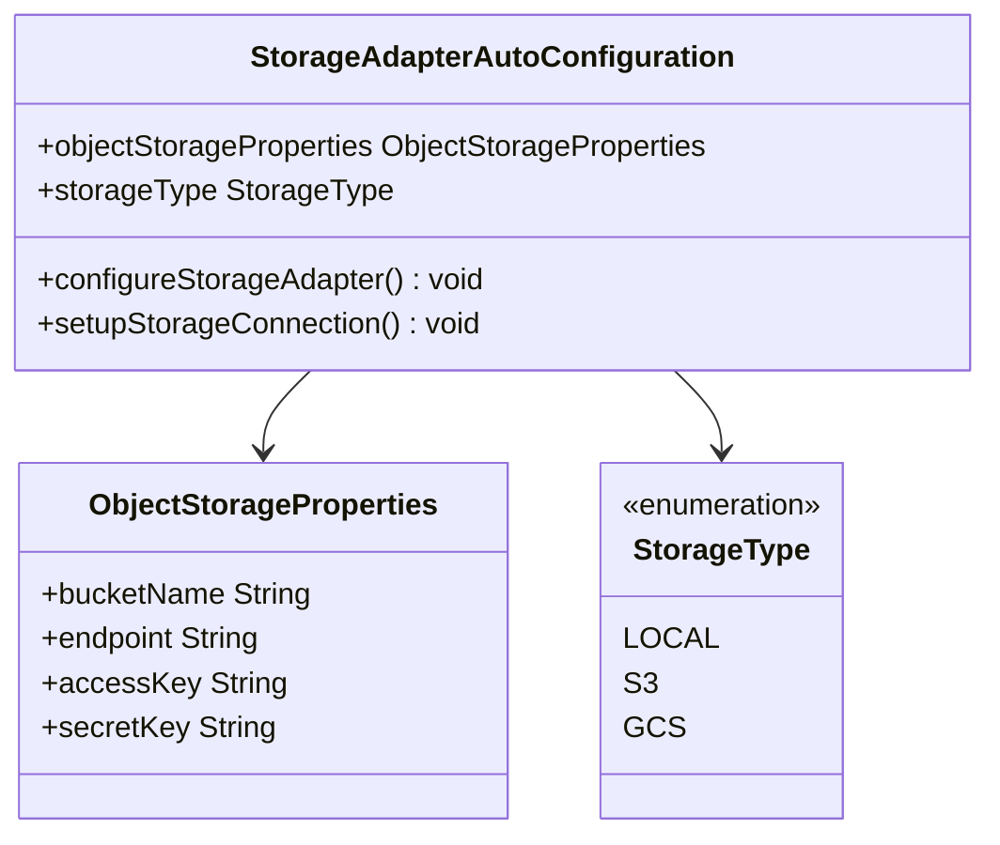

**图表来源**
- [SeahorseAgentStorageAdapterAutoConfiguration.java](file://seahorse-agent-spring-boot-starter/src/main/java/com/miracle/ai/seahorse/agent/adapters/spring/SeahorseAgentStorageAdapterAutoConfiguration.java)

#### 向量存储适配器配置

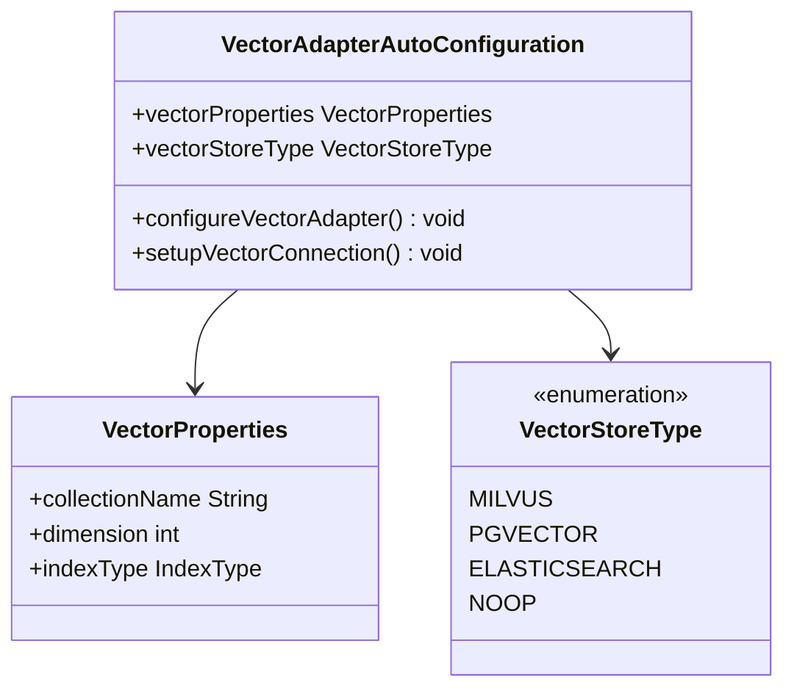

**图表来源**
- [SeahorseAgentVectorAdapterAutoConfiguration.java](file://seahorse-agent-spring-boot-starter/src/main/java/com/miracle/ai/seahorse/agent/adapters/spring/SeahorseAgentVectorAdapterAutoConfiguration.java)

**章节来源**
- [SeahorseAgentStorageAdapterAutoConfiguration.java](file://seahorse-agent-spring-boot-starter/src/main/java/com/miracle/ai/seahorse/agent/adapters/spring/SeahorseAgentStorageAdapterAutoConfiguration.java)
- [SeahorseAgentVectorAdapterAutoConfiguration.java](file://seahorse-agent-spring-boot-starter/src/main/java/com/miracle/ai/seahorse/agent/adapters/spring/SeahorseAgentVectorAdapterAutoConfiguration.java)

### 仓库自动配置组件

仓库层负责数据持久化和访问：

#### 核心仓库配置

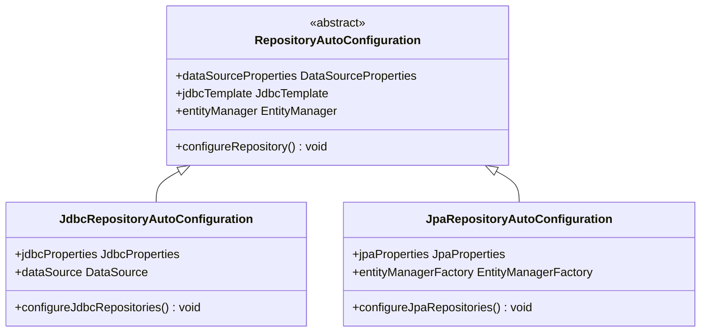

**图表来源**
- [SeahorseAgentIngestionRepositoryAutoConfiguration.java](file://seahorse-agent-spring-boot-starter/src/main/java/com/miracle/ai/seahorse/agent/adapters/spring/SeahorseAgentIngestionRepositoryAutoConfiguration.java)
- [SeahorseAgentKnowledgeRepositoryAutoConfiguration.java](file://seahorse-agent-spring-boot-starter/src/main/java/com/miracle/ai/seahorse/agent/adapters/spring/SeahorseAgentKnowledgeRepositoryAutoConfiguration.java)

**章节来源**
- [SeahorseAgentIngestionRepositoryAutoConfiguration.java](file://seahorse-agent-spring-boot-starter/src/main/java/com/miracle/ai/seahorse/agent/adapters/spring/SeahorseAgentIngestionRepositoryAutoConfiguration.java)
- [SeahorseAgentKnowledgeRepositoryAutoConfiguration.java](file://seahorse-agent-spring-boot-starter/src/main/java/com/miracle/ai/seahorse/agent/adapters/spring/SeahorseAgentKnowledgeRepositoryAutoConfiguration.java)

### 作业和调度组件

系统提供了多种定时作业和后台任务：

#### 记忆管理作业

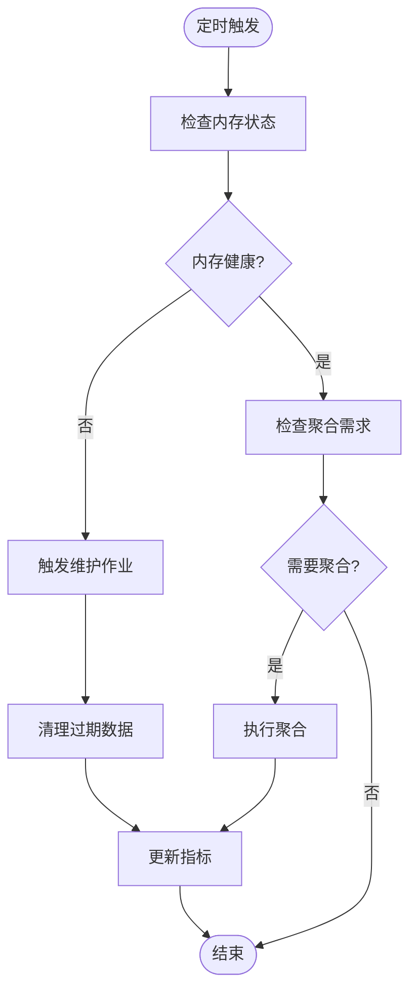

**图表来源**
- [SeahorseAgentMemoryMaintenanceAutoConfiguration.java](file://seahorse-agent-spring-boot-starter/src/main/java/com/miracle/ai/seahorse/agent/adapters/spring/SeahorseAgentMemoryMaintenanceAutoConfiguration.java)
- [SeahorseAgentMemoryAggregationAutoConfiguration.java](file://seahorse-agent-spring-boot-starter/src/main/java/com/miracle/ai/seahorse/agent/adapters/spring/SeahorseAgentMemoryAggregationAutoConfiguration.java)

**章节来源**
- [SeahorseAgentMemoryMaintenanceAutoConfiguration.java](file://seahorse-agent-spring-boot-starter/src/main/java/com/miracle/ai/seahorse/agent/adapters/spring/SeahorseAgentMemoryMaintenanceAutoConfiguration.java)
- [SeahorseAgentMemoryAggregationAutoConfiguration.java](file://seahorse-agent-spring-boot-starter/src/main/java/com/miracle/ai/seahorse/agent/adapters/spring/SeahorseAgentMemoryAggregationAutoConfiguration.java)

## AOP切面与拦截器管理

### AOP自动配置核心架构

SeahorseAgentAopAutoConfiguration是系统中新增的关键组件，专门负责集中管理AOP切面和拦截器注册，确保跨模块的一致行为：

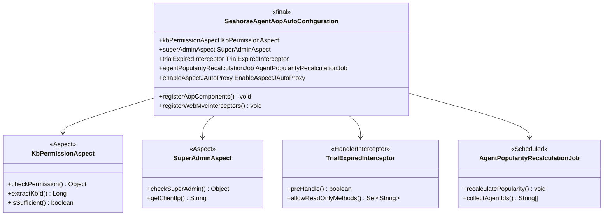

**图表来源**
- [SeahorseAgentAopAutoConfiguration.java](file://seahorse-agent-spring-boot-starter/src/main/java/com/miracle/ai/seahorse/agent/adapters/spring/SeahorseAgentAopAutoConfiguration.java)
- [KbPermissionAspect.java](file://seahorse-agent-adapter-web/src/main/java/com/miracle/ai/seahorse/agent/adapters/web/KbPermissionAspect.java)
- [SuperAdminAspect.java](file://seahorse-agent-adapter-web/src/main/java/com/miracle/ai/seahorse/agent/adapters/web/SuperAdminAspect.java)
- [TrialExpiredInterceptor.java](file://seahorse-agent-adapter-web/src/main/java/com/miracle/ai/seahorse/agent/adapters/web/TrialExpiredInterceptor.java)
- [AgentPopularityRecalculationJob.java](file://seahorse-agent-spring-boot-starter/src/main/java/com/miracle/ai/seahorse/agent/adapters/spring/AgentPopularityRecalculationJob.java)

### 知识库权限切面

KbPermissionAspect负责拦截带有@RequireKbPermission注解的方法，进行知识库权限校验：

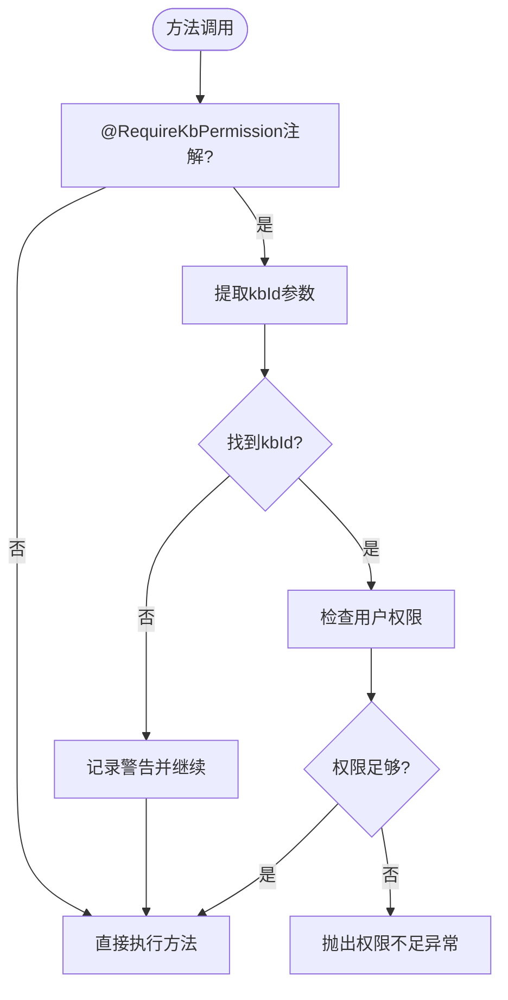

**图表来源**
- [KbPermissionAspect.java](file://seahorse-agent-adapter-web/src/main/java/com/miracle/ai/seahorse/agent/adapters/web/KbPermissionAspect.java)

### 超级管理员切面

SuperAdminAspect用于校验超级管理员权限，支持基于角色和IP白名单两种方式：

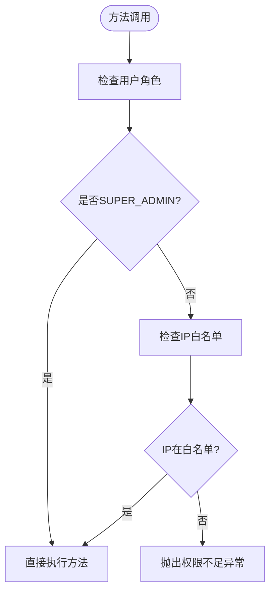

**图表来源**
- [SuperAdminAspect.java](file://seahorse-agent-adapter-web/src/main/java/com/miracle/ai/seahorse/agent/adapters/web/SuperAdminAspect.java)

### 试用期拦截器

TrialExpiredInterceptor拦截HTTP请求，对试用期到期的租户执行读写分离控制：

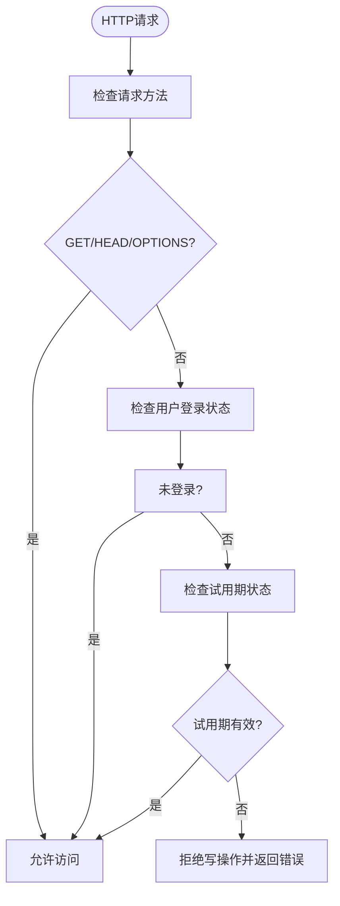

**图表来源**
- [TrialExpiredInterceptor.java](file://seahorse-agent-adapter-web/src/main/java/com/miracle/ai/seahorse/agent/adapters/web/TrialExpiredInterceptor.java)

### 权限控制机制

系统通过多层次的权限控制确保安全性：

```mermaid
graph TB
subgraph "权限控制层次"
Layer1[API层<br/>@RequireKbPermission注解]
Layer2[Web层<br/>@RequireSuperAdmin注解]
Layer3[拦截器层<br/>试用期控制]
Layer4[服务层<br/>业务逻辑校验]
end
subgraph "认证机制"
Auth[CurrentUserPort<br/>当前用户信息]
Role[角色系统<br/>SUPER_ADMIN/ADMIN/USER]
IP[IP白名单<br/>seahorse.admin.allowed-ips]
Trial[TrialService<br/>试用期管理]
end
Layer1 --> Auth
Layer2 --> Role
Layer2 --> IP
Layer3 --> Trial
Layer4 --> Auth
```

**图表来源**
- [SeahorseAgentAopAutoConfiguration.java](file://seahorse-agent-spring-boot-starter/src/main/java/com/miracle/ai/seahorse/agent/adapters/spring/SeahorseAgentAopAutoConfiguration.java)
- [KbPermissionAspect.java](file://seahorse-agent-adapter-web/src/main/java/com/miracle/ai/seahorse/agent/adapters/web/KbPermissionAspect.java)
- [SuperAdminAspect.java](file://seahorse-agent-adapter-web/src/main/java/com/miracle/ai/seahorse/agent/adapters/web/SuperAdminAspect.java)
- [TrialExpiredInterceptor.java](file://seahorse-agent-adapter-web/src/main/java/com/miracle/ai/seahorse/agent/adapters/web/TrialExpiredInterceptor.java)

**章节来源**
- [SeahorseAgentAopAutoConfiguration.java](file://seahorse-agent-spring-boot-starter/src/main/java/com/miracle/ai/seahorse/agent/adapters/spring/SeahorseAgentAopAutoConfiguration.java)
- [KbPermissionAspect.java](file://seahorse-agent-adapter-web/src/main/java/com/miracle/ai/seahorse/agent/adapters/web/KbPermissionAspect.java)
- [SuperAdminAspect.java](file://seahorse-agent-adapter-web/src/main/java/com/miracle/ai/seahorse/agent/adapters/web/SuperAdminAspect.java)
- [TrialExpiredInterceptor.java](file://seahorse-agent-adapter-web/src/main/java/com/miracle/ai/seahorse/agent/adapters/web/TrialExpiredInterceptor.java)
- [AgentPopularityRecalculationJob.java](file://seahorse-agent-spring-boot-starter/src/main/java/com/miracle/ai/seahorse/agent/adapters/spring/AgentPopularityRecalculationJob.java)

## 新组件集成

### 登录历史记录系统

新增的登录历史记录功能通过LoginHistoryPort接口和JdbcLoginHistoryAdapter实现，提供完整的登录事件追踪能力：

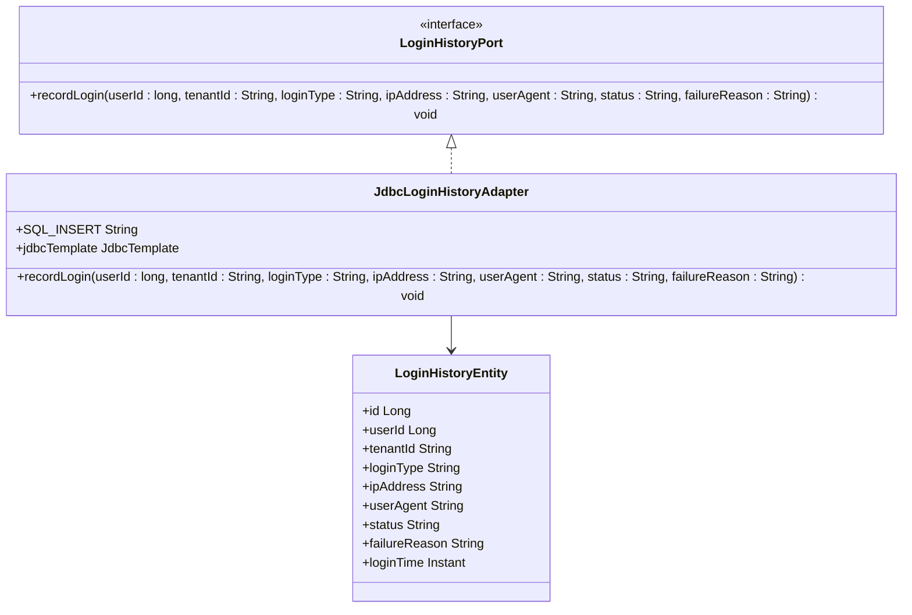

**图表来源**
- [LoginHistoryPort.java](file://seahorse-agent-kernel/src/main/java/com/miracle/ai/seahorse/agent/ports/outbound/auth/LoginHistoryPort.java)
- [JdbcLoginHistoryAdapter.java](file://seahorse-agent-adapter-repository-jdbc/src/main/java/com/miracle/ai/seahorse/agent/adapters/repository/jdbc/JdbcLoginHistoryAdapter.java)

#### 登录历史数据模型

| 字段名 | 类型 | 描述 | 约束 |
|--------|------|------|------|
| id | Long | 主键ID | 自增 |
| user_id | Long | 用户ID | 非空 |
| tenant_id | String | 租户ID | 非空 |
| login_type | String | 登录类型 | 非空 |
| ip_address | String | IP地址 | 可空 |
| user_agent | String | 用户代理 | 可空 |
| status | String | 登录状态 | 非空 |
| failure_reason | String | 失败原因 | 可空 |
| login_time | Instant | 登录时间 | 非空 |

**章节来源**
- [LoginHistoryPort.java](file://seahorse-agent-kernel/src/main/java/com/miracle/ai/seahorse/agent/ports/outbound/auth/LoginHistoryPort.java)
- [JdbcLoginHistoryAdapter.java](file://seahorse-agent-adapter-repository-jdbc/src/main/java/com/miracle/ai/seahorse/agent/adapters/repository/jdbc/JdbcLoginHistoryAdapter.java)

### 配额执行服务集成

配额执行服务（QuotaEnforcementService）为系统提供全面的使用量限制和监控能力：

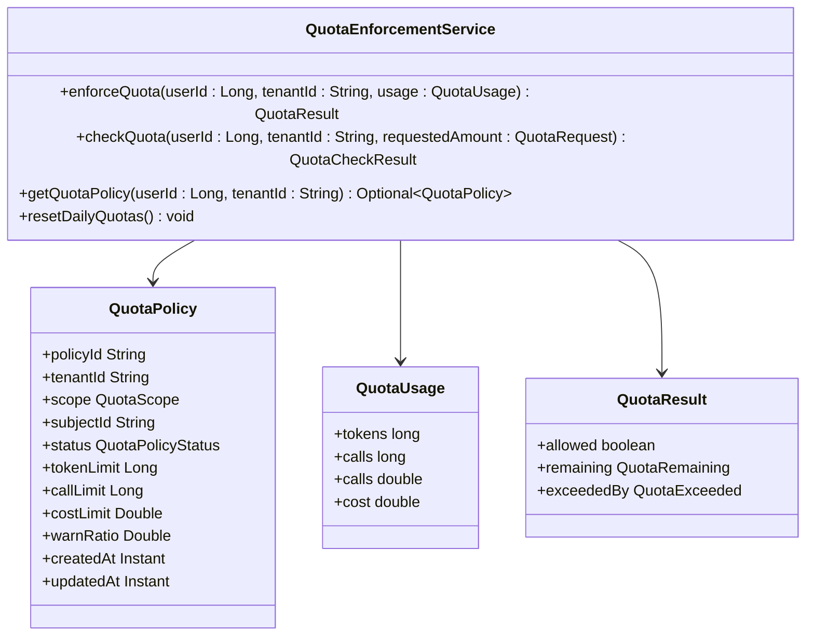

**图表来源**
- [QuotaPolicy.java](file://seahorse-agent-kernel/src/main/java/com/miracle/ai/seahorse/agent/kernel/domain/agent/quota/QuotaPolicy.java)
- [KernelQuotaSummaryService.java](file://seahorse-agent-kernel/src/main/java/com/miracle/ai/seahorse/agent/kernel/application/agent/quota/KernelQuotaSummaryService.java)

#### 配额策略配置

| 配置项 | 类型 | 默认值 | 描述 |
|--------|------|--------|------|
| seahorse.quota.default.token-limit | Long | 10000 | 默认令牌限制 |
| seahorse.quota.default.call-limit | Long | 1000 | 默认调用次数限制 |
| seahorse.quota.default.cost-limit | Double | 100.0 | 默认费用限制 |
| seahorse.quota.warn-ratio | Double | 0.8 | 警告阈值比例 |
| seahorse.quota.enforcement.enabled | Boolean | true | 是否启用配额执行 |

**章节来源**
- [QuotaPolicy.java](file://seahorse-agent-kernel/src/main/java/com/miracle/ai/seahorse/agent/kernel/domain/agent/quota/QuotaPolicy.java)
- [KernelQuotaSummaryService.java](file://seahorse-agent-kernel/src/main/java/com/miracle/ai/seahorse/agent/kernel/application/agent/quota/KernelQuotaSummaryService.java)

### 收入服务注册

收入服务（RevenueService）为系统提供计费和收益分配功能：

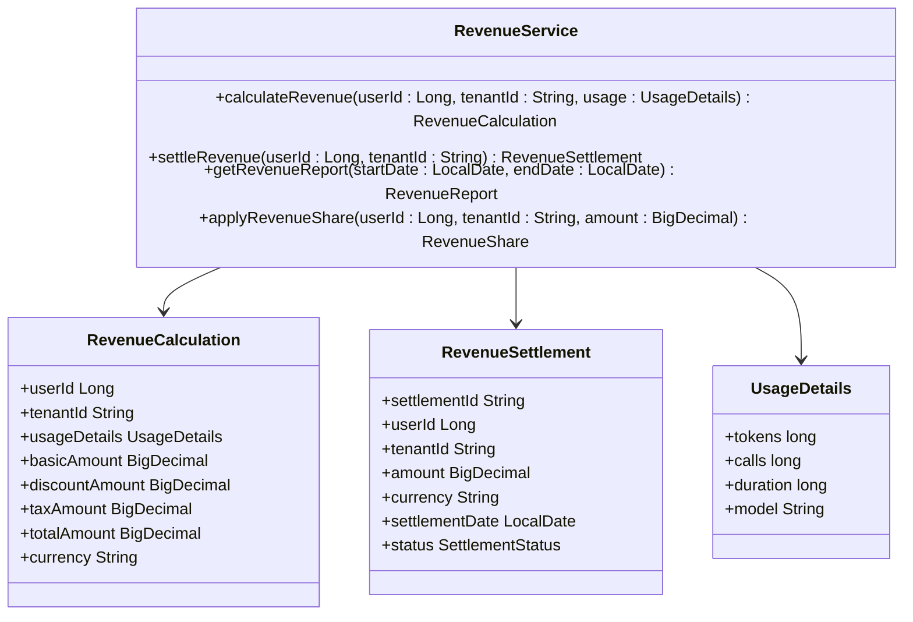

**图表来源**
- [RevenueService.java](file://seahorse-agent-kernel/src/main/java/com/miracle/ai/seahorse/agent/kernel/application/billing/RevenueService.java)

### 仓库端口方法扩展

仓库层新增了支持新功能的数据访问方法：

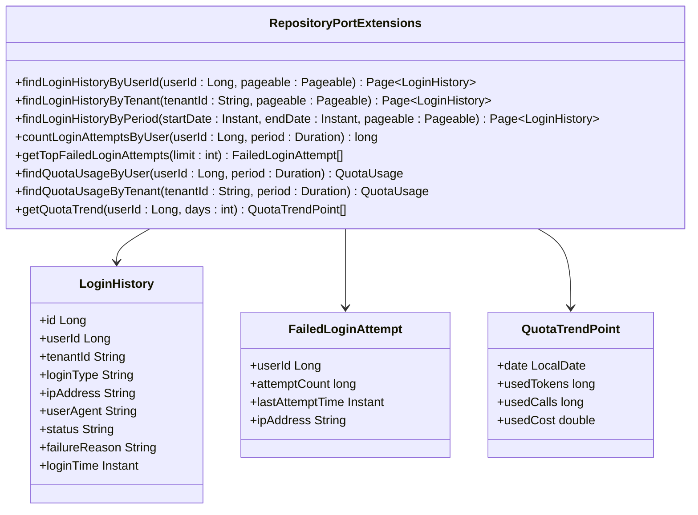

**图表来源**
- [RepositoryPortExtensions.java](file://seahorse-agent-adapter-repository-jdbc/src/main/java/com/miracle/ai/seahorse/agent/adapters/repository/jdbc/RepositoryPortExtensions.java)

**章节来源**
- [JdbcLoginHistoryAdapter.java](file://seahorse-agent-adapter-repository-jdbc/src/main/java/com/miracle/ai/seahorse/agent/adapters/repository/jdbc/JdbcLoginHistoryAdapter.java)
- [QuotaPolicy.java](file://seahorse-agent-kernel/src/main/java/com/miracle/ai/seahorse/agent/kernel/domain/agent/quota/QuotaPolicy.java)
- [KernelQuotaSummaryService.java](file://seahorse-agent-kernel/src/main/java/com/miracle/ai/seahorse/agent/kernel/application/agent/quota/KernelQuotaSummaryService.java)

## 依赖关系分析

### 自动配置依赖图

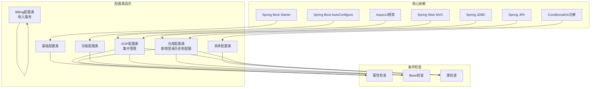

**图表来源**
- [SeahorseAgentKernelAutoConfiguration.java](file://seahorse-agent-spring-boot-starter/src/main/java/com/miracle/ai/seahorse/agent/adapters/spring/SeahorseAgentKernelAutoConfiguration.java)
- [SeahorseAgentAiAdapterAutoConfiguration.java](file://seahorse-agent-spring-boot-starter/src/main/java/com/miracle/ai/seahorse/agent/adapters/spring/SeahorseAgentAiAdapterAutoConfiguration.java)
- [SeahorseAgentAopAutoConfiguration.java](file://seahorse-agent-spring-boot-starter/src/main/java/com/miracle/ai/seahorse/agent/adapters/spring/SeahorseAgentAopAutoConfiguration.java)
- [SeahorseAgentIngestionRepositoryAutoConfiguration.java](file://seahorse-agent-spring-boot-starter/src/main/java/com/miracle/ai/seahorse/agent/adapters/spring/SeahorseAgentIngestionRepositoryAutoConfiguration.java)

### 组件耦合度分析

自动配置系统通过以下方式降低组件间的耦合：

1. **接口隔离**：每个适配器都实现标准化接口
2. **条件装配**：仅在需要时创建相关Bean
3. **配置驱动**：通过外部配置控制行为
4. **模块化设计**：功能按模块独立配置
5. **集中管理**：AOP组件通过单一配置类统一管理
6. **无缝集成**：新组件通过标准接口自动发现和注册

**章节来源**
- [SeahorseAgentKernelAutoConfiguration.java](file://seahorse-agent-spring-boot-starter/src/main/java/com/miracle/ai/seahorse/agent/adapters/spring/SeahorseAgentKernelAutoConfiguration.java)
- [SeahorseAgentCacheAdapterAutoConfiguration.java](file://seahorse-agent-spring-boot-starter/src/main/java/com/miracle/ai/seahorse/agent/adapters/spring/SeahorseAgentCacheAdapterAutoConfiguration.java)
- [SeahorseAgentAopAutoConfiguration.java](file://seahorse-agent-spring-boot-starter/src/main/java/com/miracle/ai/seahorse/agent/adapters/spring/SeahorseAgentAopAutoConfiguration.java)

## 性能考虑

### 自动配置性能优化

自动配置系统在设计时充分考虑了性能因素：

1. **延迟初始化**：非关键组件采用延迟加载
2. **条件检查优化**：减少不必要的Bean创建
3. **连接池管理**：合理配置数据库和缓存连接
4. **资源监控**：内置性能指标收集
5. **AOP组件优化**：通过@EnableAspectJAutoProxy启用JIT编译优化
6. **新组件性能**：登录历史记录采用异步处理，不影响主业务流程

### 内存管理策略

```mermaid
flowchart TD
Start([应用启动]) --> InitConfig["初始化配置"]
InitConfig --> CheckMemory["检查可用内存"]
CheckMemory --> MemorySufficient{"内存充足?"}
MemorySufficient --> |是| FullConfig["完整配置"]
MemorySufficient --> |否| MinimalConfig["最小化配置"]
FullConfig --> SetupComponents["设置组件"]
MinimalConfig --> SetupEssential["设置必要组件"]
SetupComponents --> Monitor["监控性能"]
SetupEssential --> Monitor
Monitor --> Optimize["优化配置"]
```

**图表来源**
- [SeahorseAgentKernelAutoConfiguration.java](file://seahorse-agent-spring-boot-starter/src/main/java/com/miracle/ai/seahorse/agent/adapters/spring/SeahorseAgentKernelAutoConfiguration.java)

### 新组件性能考虑

#### 登录历史记录性能

- **异步记录**：登录历史记录在独立线程中执行，避免阻塞主登录流程
- **批量插入**：支持批量插入以提高数据库写入效率
- **失败容错**：记录失败不会影响用户登录体验

#### 配额执行性能

- **缓存策略**：配额策略和使用情况缓存到Redis中
- **批量查询**：支持批量获取多个用户的配额状态
- **异步更新**：配额使用量异步更新，减少数据库压力

## 故障排除指南

### 常见配置问题

#### 自动配置不生效

**症状**：期望的功能没有启用

**排查步骤**：
1. 检查相关依赖是否正确添加
2. 验证配置属性是否正确设置
3. 查看自动配置日志输出
4. 确认条件注解满足要求

#### Bean冲突问题

**症状**：启动时报Bean定义冲突错误

**解决方案**：
1. 检查是否有重复的Bean定义
2. 使用`@Primary`注解指定优先级
3. 通过配置禁用不需要的自动配置

#### 依赖缺失问题

**症状**：某些功能无法正常工作

**排查方法**：
1. 确认所有必需的依赖都已添加
2. 检查版本兼容性
3. 验证外部服务可达性

#### AOP组件问题

**症状**：权限控制或拦截器不生效

**排查步骤**：
1. 检查@EnableAspectJAutoProxy注解是否启用
2. 验证相关Bean是否正确注册
3. 查看AOP组件的日志输出
4. 确认注解处理器是否正确配置

#### 新组件问题

**症状**：登录历史、配额或收入功能异常

**排查步骤**：
1. 检查数据库连接是否正常
2. 验证相关表结构是否存在
3. 查看新组件的日志输出
4. 确认配置属性是否正确设置

**章节来源**
- [SeahorseAgentKernelAutoConfiguration.java](file://seahorse-agent-spring-boot-starter/src/main/java/com/miracle/ai/seahorse/agent/adapters/spring/SeahorseAgentKernelAutoConfiguration.java)
- [SeahorseAgentAiAdapterAutoConfiguration.java](file://seahorse-agent-spring-boot-starter/src/main/java/com/miracle/ai/seahorse/agent/adapters/spring/SeahorseAgentAiAdapterAutoConfiguration.java)
- [SeahorseAgentAopAutoConfiguration.java](file://seahorse-agent-spring-boot-starter/src/main/java/com/miracle/ai/seahorse/agent/adapters/spring/SeahorseAgentAopAutoConfiguration.java)

## 结论

Spring Boot自动配置为Seahorse Agent项目提供了强大而灵活的框架支持。通过精心设计的分层架构和条件配置机制，系统实现了高度的模块化和可扩展性。

### 主要优势

1. **开发效率提升**：通过自动化配置减少样板代码
2. **部署灵活性**：支持按需启用功能模块
3. **维护成本降低**：统一的配置管理和版本控制
4. **扩展性强**：易于添加新的适配器和功能模块
5. **安全性增强**：通过集中管理AOP组件确保跨模块的一致权限控制
6. **新组件无缝集成**：支持登录历史、配额管理和收入服务的平滑集成

### 新增功能的价值

本次更新引入的新组件为系统带来了显著的功能增强：

- **登录历史记录**：提供完整的用户登录追踪能力，支持审计和安全分析
- **配额执行服务**：实现全面的使用量限制和监控，确保资源合理使用
- **收入服务**：支持计费和收益分配，为商业化运营奠定基础
- **仓库端口扩展**：提供更丰富的数据访问能力，支持复杂查询和统计分析

### 最佳实践建议

1. **合理使用条件注解**：确保配置只在必要时生效
2. **模块化设计**：保持功能模块的独立性和清晰边界
3. **配置管理**：建立完善的配置文档和变更管理流程
4. **监控和测试**：实施全面的配置验证和性能监控
5. **AOP组件管理**：遵循集中管理原则，避免分散配置
6. **新组件集成**：按照标准接口规范集成新功能，确保向后兼容性

通过持续优化和改进，Spring Boot自动配置将继续为Seahorse Agent项目提供稳定可靠的技术支撑，特别是在安全性和一致性方面的保障将得到进一步加强。新增的登录历史、配额管理和收入服务等功能将进一步提升系统的商业价值和用户体验。