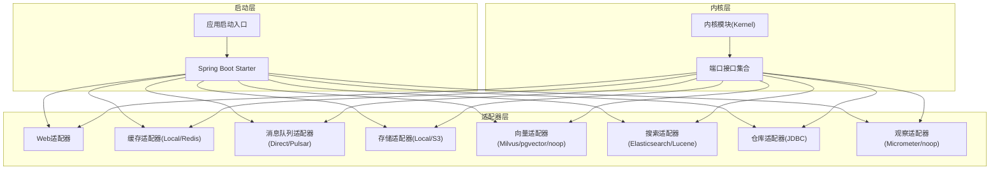
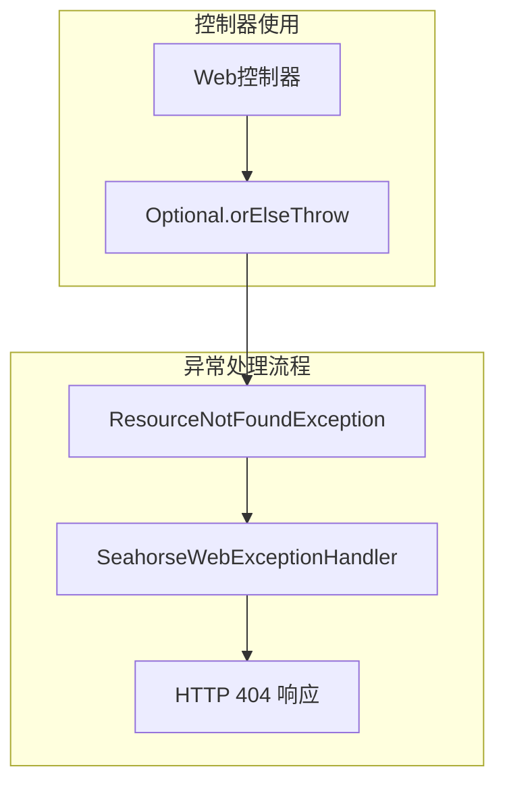
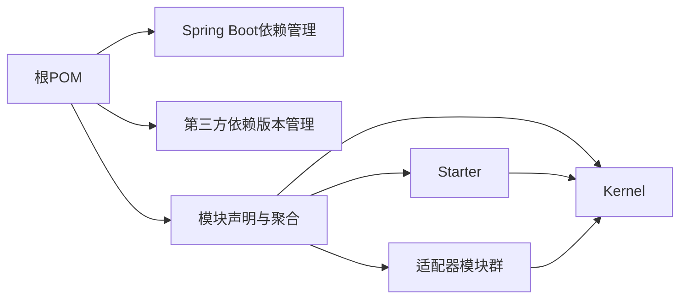

# 后端系统

<cite>
**本文引用的文件**
- [pom.xml](file://pom.xml)
- [SeahorseAgentApplication.java](file://seahorse-agent-bootstrap/src/main/java/com/miracle/ai/seahorse/agent/SeahorseAgentApplication.java)
- [seahorse-agent-kernel/pom.xml](file://seahorse-agent-kernel/pom.xml)
- [seahorse-agent-spring-boot-starter/pom.xml](file://seahorse-agent-spring-boot-starter/pom.xml)
- [seahorse-agent-adapter-web/pom.xml](file://seahorse-agent-adapter-web/pom.xml)
- [ResourceNotFoundException.java](file://seahorse-agent-adapter-web/src/main/java/com/miracle/ai/seahorse/agent/adapters/web/ResourceNotFoundException.java)
- [SeahorseWebExceptionHandler.java](file://seahorse-agent-adapter-web/src/main/java/com/miracle/ai/seahorse/agent/adapters/web/SeahorseWebExceptionHandler.java)
- [SeahorseAgentDefinitionController.java](file://seahorse-agent-adapter-web/src/main/java/com/miracle/ai/seahorse/agent/adapters/web/SeahorseAgentDefinitionController.java)
- [SeahorseAgentRunController.java](file://seahorse-agent-adapter-web/src/main/java/com/miracle/ai/seahorse/agent/adapters/web/SeahorseAgentRunController.java)
- [SeahorseToolCatalogController.java](file://seahorse-agent-adapter-web/src/main/java/com/miracle/ai/seahorse/agent/adapters/web/SeahorseToolCatalogController.java)
</cite>

## 目录
1. [引言](#引言)
2. [项目结构](#项目结构)
3. [核心组件](#核心组件)
4. [架构总览](#架构总览)
5. [详细组件分析](#详细组件分析)
6. [依赖分析](#依赖分析)
7. [性能考虑](#性能考虑)
8. [故障排查指南](#故障排查指南)
9. [结论](#结论)
10. [附录](#附录)

## 引言
本文件为Seahorse Agent后端系统的综合技术文档，聚焦基于Spring Boot的后端架构设计与实现要点。内容覆盖应用启动模块、核心内核模块、Spring Boot Starter机制与适配器系统；解释Kernel模块的业务逻辑边界（应用服务层、领域模型与端口接口）；阐述适配器系统如何对接Web、缓存、消息队列、存储等外部系统；说明插件化架构的实现原理（SPI机制、自动配置与扩展点设计）；并提供依赖注入、事务管理与异常处理机制的说明及性能优化策略与最佳实践。

## 项目结构
Seahorse Agent采用多模块Maven聚合工程组织，核心模块包括：
- 应用启动模块：负责应用引导与基础配置
- 核心内核模块：提供框架无关的内核能力与端口定义
- Spring Boot Starter模块：封装自动装配与可选适配器组合
- 适配器模块：按功能域划分的外部系统集成实现（Web、缓存、MQ、存储、向量、搜索、观察等）

```mermaid
graph TB
Root["根工程<br/>seahorse-agent"] --> Bootstrap["应用启动模块<br/>seahorse-agent-bootstrap"]
Root --> Kernel["核心内核模块<br/>seahorse-agent-kernel"]
Root --> Starter["Spring Boot Starter<br/>seahorse-agent-spring-boot-starter"]
Root --> WebAdapter["Web适配器<br/>seahorse-agent-adapter-web"]
Root --> MQDirect["消息队列适配器(直连)<br/>seahorse-agent-adapter-mq-direct"]
Root --> MQPulsar["消息队列适配器(Pulsar)<br/>seahorse-agent-adapter-mq-pulsar"]
Root --> CacheLocal["缓存适配器(Local)<br/>seahorse-agent-adapter-cache-local"]
Root --> CacheRedis["缓存适配器(Redis)<br/>seahorse-agent-adapter-cache-redis"]
Root --> StorageLocal["存储适配器(Local)<br/>seahorse-agent-adapter-storage-local"]
Root --> StorageS3["存储适配器(S3)<br/>seahorse-agent-adapter-storage-s3"]
Root --> VectorMilvus["向量适配器(Milvus)<br/>seahorse-agent-adapter-vector-milvus"]
Root --> VectorPG["向量适配器(pgvector)<br/>seahorse-agent-adapter-vector-pgvector"]
Root --> VectorNoop["向量适配器(空实现)<br/>seahorse-agent-adapter-vector-noop"]
Root --> SearchES["搜索适配器(Elasticsearch)<br/>seahorse-agent-adapter-search-elasticsearch"]
Root --> SearchLucene["搜索适配器(Lucene)<br/>seahorse-agent-adapter-search-lucene"]
Root --> RepoJDBC["仓库适配器(JDBC)<br/>seahorse-agent-adapter-repository-jdbc"]
Root --> ObservationMicrometer["观察适配器(Micrometer)<br/>seahorse-agent-adapter-observation-micrometer"]
Root --> ObservationNoop["观察适配器(空实现)<br/>seahorse-agent-adapter-observation-noop"]
```

图表来源
- [pom.xml:38-66](file://pom.xml#L38-L66)

章节来源
- [pom.xml:1-286](file://pom.xml#L1-L286)

## 核心组件
- 应用启动模块（seahorse-agent-bootstrap）
  - 职责：应用引导入口，启用调度能力，限定扫描包范围，排除特定自动配置
  - 关键点：通过@SpringBootApplication注解指定扫描基础包与排除Redisson自动配置类
- 核心内核模块（seahorse-agent-kernel）
  - 职责：提供框架无关的内核能力与端口定义，不直接依赖Spring生态
  - 关键点：引入Jackson与SLF4J作为通用依赖，便于跨模块复用
- Spring Boot Starter（seahorse-agent-spring-boot-starter）
  - 职责：聚合常用适配器，提供自动装配与可选依赖组合，简化接入
  - 关键点：声明对内核与多个适配器的依赖，部分适配器标记为可选以按需启用

章节来源
- [SeahorseAgentApplication.java:25-41](file://seahorse-agent-bootstrap/src/main/java/com/miracle/ai/seahorse/agent/SeahorseAgentApplication.java#L25-L41)
- [seahorse-agent-kernel/pom.xml:25-47](file://seahorse-agent-kernel/pom.xml#L25-L47)
- [seahorse-agent-spring-boot-starter/pom.xml:18-137](file://seahorse-agent-spring-boot-starter/pom.xml#L18-L137)

## 架构总览
后端系统遵循"内核+适配器+Starter"的分层架构：
- 内核层：定义领域模型与端口接口，隔离业务规则与外部依赖
- 适配器层：实现端口接口，对接具体外部系统（Web、缓存、MQ、存储、向量、搜索、观察等）
- 启动层：通过Starter聚合适配器并提供自动装配，支持按需启用与扩展

图表来源
- [pom.xml:38-66](file://pom.xml#L38-L66)
- [seahorse-agent-spring-boot-starter/pom.xml:18-137](file://seahorse-agent-spring-boot-starter/pom.xml#L18-L137)

## 详细组件分析

### 应用启动模块（Bootstrap）
- 启动入口类通过@SpringBootApplication限定扫描包，避免误扫描其他命名空间
- 显式排除Redisson自动配置类，确保在本项目中使用自定义或显式配置
- 启用@EnableScheduling以支持定时任务场景

章节来源
- [SeahorseAgentApplication.java:31-35](file://seahorse-agent-bootstrap/src/main/java/com/miracle/ai/seahorse/agent/SeahorseAgentApplication.java#L31-L35)
- [SeahorseAgentApplication.java:38-40](file://seahorse-agent-bootstrap/src/main/java/com/miracle/ai/seahorse/agent/SeahorseAgentApplication.java#L38-L40)

### 核心内核模块（Kernel）
- 设计目标：提供与框架无关的内核能力，定义端口接口，隔离业务规则
- 依赖选择：引入Jackson与SLF4J，保证序列化与日志抽象的通用性
- 适用场景：作为所有适配器的共同依赖，确保跨模块一致性

章节来源
- [seahorse-agent-kernel/pom.xml:25-47](file://seahorse-agent-kernel/pom.xml#L25-L47)

### Spring Boot Starter（Starter）
- 组合策略：聚合常用适配器，将可选适配器标记为optional，按需启用
- 自动装配：通过META-INF下的Spring机制与适配器中的自动配置类实现
- 典型适配器组合：Web、缓存、消息队列、存储、向量、搜索、仓库、观察等

章节来源
- [seahorse-agent-spring-boot-starter/pom.xml:18-137](file://seahorse-agent-spring-boot-starter/pom.xml#L18-L137)

### 适配器系统（Adapters）
- Web适配器：基于Spring WebMvc与Sa-Token实现Web端能力与鉴权
- 缓存适配器：提供Local与Redis两种实现，满足本地与分布式缓存需求
- 消息队列适配器：支持Direct直连与Pulsar，满足不同消息吞吐与可靠性要求
- 存储适配器：提供Local与S3两种对象存储实现
- 向量适配器：支持Milvus、pgvector与noop，满足不同向量检索需求
- 搜索适配器：提供Elasticsearch与Lucene实现
- 仓库适配器：基于JDBC实现各类数据持久化
- 观察适配器：提供Micrometer与noop实现，满足监控与观测需求

章节来源
- [seahorse-agent-adapter-web/pom.xml:18-39](file://seahorse-agent-adapter-web/pom.xml#L18-L39)

### 异常处理增强机制
**更新** 新增ResourceNotFoundException类和改进的异常处理机制

- ResourceNotFoundException类：专门用于表示资源未找到的业务异常，继承RuntimeException，提供两个构造函数支持资源类型和标识符的组合消息以及自定义消息
- Web异常处理器：通过@ControllerAdvice统一处理各种异常，包括ResourceNotFoundException映射到HTTP 404状态码
- 控制器中的异常使用：在各个Web控制器中使用Optional的orElseThrow模式，当资源不存在时抛出ResourceNotFoundException
- 异常处理策略：统一返回标准化的错误响应格式，包含错误码和错误消息，确保前后端交互的一致性

图表来源
- [ResourceNotFoundException.java:25-34](file://seahorse-agent-adapter-web/src/main/java/com/miracle/ai/seahorse/agent/adapters/web/ResourceNotFoundException.java#L25-L34)
- [SeahorseWebExceptionHandler.java:46-58](file://seahorse-agent-adapter-web/src/main/java/com/miracle/ai/seahorse/agent/adapters/web/SeahorseWebExceptionHandler.java#L46-L58)

章节来源
- [ResourceNotFoundException.java:25-34](file://seahorse-agent-adapter-web/src/main/java/com/miracle/ai/seahorse/agent/adapters/web/ResourceNotFoundException.java#L25-L34)
- [SeahorseWebExceptionHandler.java:40-100](file://seahorse-agent-adapter-web/src/main/java/com/miracle/ai/seahorse/agent/adapters/web/SeahorseWebExceptionHandler.java#L40-L100)
- [SeahorseAgentDefinitionController.java:93](file://seahorse-agent-adapter-web/src/main/java/com/miracle/ai/seahorse/agent/adapters/web/SeahorseAgentDefinitionController.java#L93)
- [SeahorseAgentRunController.java:100](file://seahorse-agent-adapter-web/src/main/java/com/miracle/ai/seahorse/agent/adapters/web/SeahorseAgentRunController.java#L100)
- [SeahorseToolCatalogController.java:78](file://seahorse-agent-adapter-web/src/main/java/com/miracle/ai/seahorse/agent/adapters/web/SeahorseToolCatalogController.java#L78)

### 插件化架构与SPI机制
- SPI机制：通过META-INF目录下的资源文件声明端口实现，实现"接口定义+实现注册"的插件化
- 自动配置：Starter与各适配器内部包含自动配置类，结合条件注解实现按需装配
- 扩展点设计：端口接口定义清晰，新增适配器仅需实现对应端口并注册SPI即可

章节来源
- [pom.xml:38-66](file://pom.xml#L38-L66)

### 依赖注入、事务管理与异常处理
- 依赖注入：基于Spring容器进行组件装配，默认由Starter与适配器自动配置完成
- 事务管理：建议在应用服务层使用@Transactional注解管理业务事务，确保跨适配器操作的一致性
- 异常处理：通过@ControllerAdvice统一异常处理器捕获并转换为标准响应格式，保障前端友好性。新增ResourceNotFoundException专门处理资源未找到场景，映射到HTTP 404状态码

章节来源
- [pom.xml:68-189](file://pom.xml#L68-L189)
- [SeahorseWebExceptionHandler.java:40-100](file://seahorse-agent-adapter-web/src/main/java/com/miracle/ai/seahorse/agent/adapters/web/SeahorseWebExceptionHandler.java#L40-L100)

## 依赖分析
- 版本管理：根POM集中管理Spring Boot版本与第三方依赖版本，确保一致性
- 依赖传递：Starter聚合多个适配器，适配器再依赖内核模块，形成清晰的依赖链
- 可选依赖：部分适配器标记为optional，避免不必要的依赖引入

图表来源
- [pom.xml:68-189](file://pom.xml#L68-L189)
- [pom.xml:38-66](file://pom.xml#L38-L66)

章节来源
- [pom.xml:68-189](file://pom.xml#L68-L189)
- [pom.xml:38-66](file://pom.xml#L38-L66)

## 性能考虑
- 适配器选择：根据场景选择合适的缓存、消息队列与向量存储实现，平衡延迟与成本
- 连接池与超时：合理配置Redis、Pulsar、数据库连接池与超时参数
- 序列化与日志：使用Jackson进行高效序列化，控制日志级别避免过度开销
- 监控与观测：启用Micrometer观测指标，结合Prometheus/Grafana进行性能分析

## 故障排查指南
- 启动失败：检查@SpringBootApplication的scanBasePackages是否正确，确认排除的自动配置类是否必要
- 适配器未生效：确认Starter中相关适配器依赖是否为optional且已启用，检查SPI资源文件是否存在
- 事务问题：确认业务方法所在类的事务传播行为与异常回滚策略，避免跨代理调用导致事务失效
- 性能瓶颈：通过Micrometer指标定位慢查询、慢接口与慢队列消费环节
- 异常处理问题：检查ResourceNotFoundException是否正确抛出，确认SeahorseWebExceptionHandler是否正确映射到HTTP 404状态码

## 结论
Seahorse Agent后端系统通过"内核+适配器+Starter"的架构实现了高内聚、低耦合与强扩展性。内核模块隔离业务规则，适配器模块对接外部系统，Starter提供自动装配与可选组合，配合SPI机制与条件装配实现灵活的插件化扩展。新增的ResourceNotFoundException和改进的异常处理机制进一步提升了系统的健壮性和用户体验。建议在实际落地中结合业务场景选择合适适配器组合，并完善事务与异常处理策略，持续通过观测指标优化系统性能。

## 附录
- 快速开始：引入seahorse-agent-spring-boot-starter，按需启用所需适配器，启动应用即可
- 最佳实践：优先使用Starter聚合依赖，明确端口边界，通过SPI注册实现，统一异常与事务处理
- 异常处理最佳实践：使用ResourceNotFoundException专门处理资源未找到场景，确保一致的HTTP 404响应格式