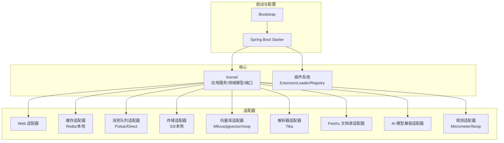
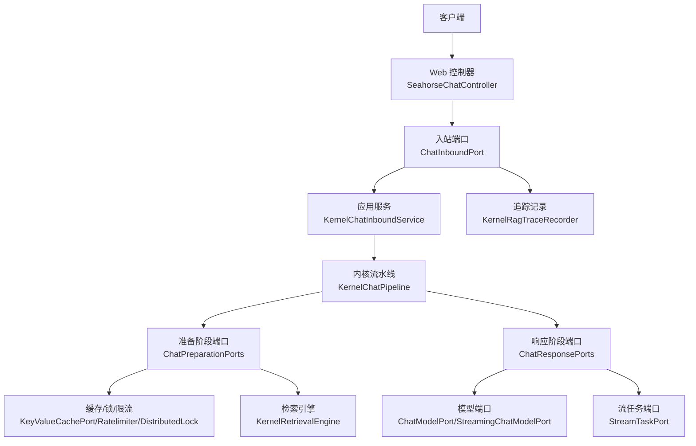
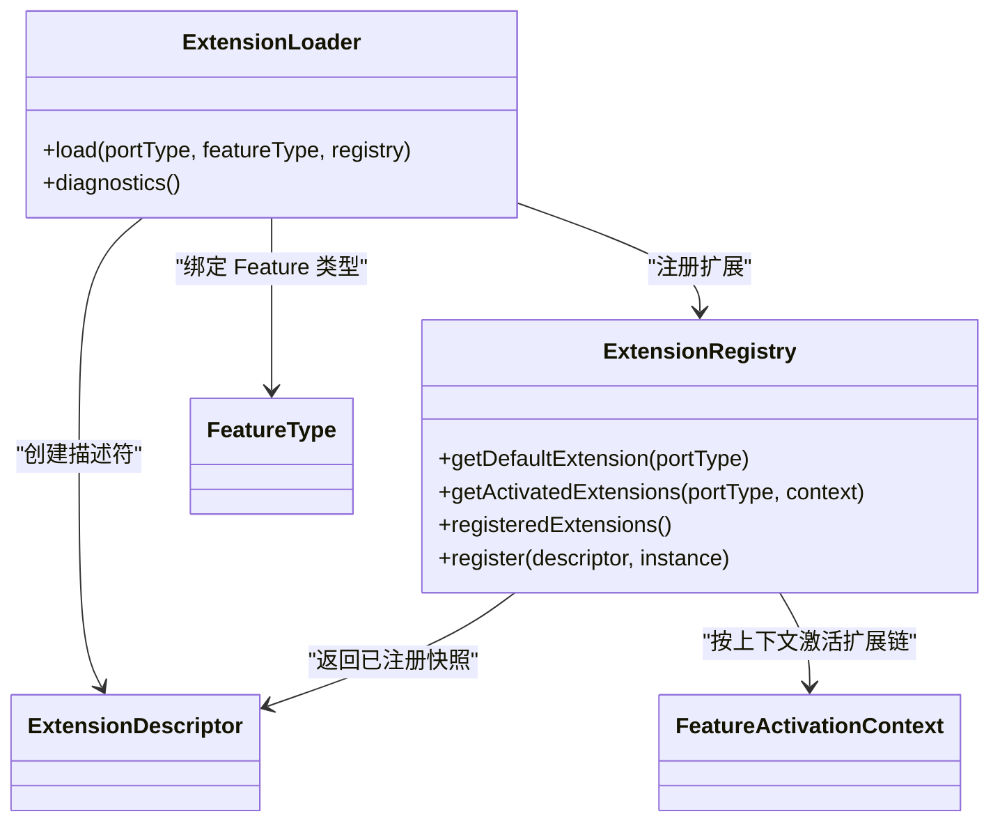
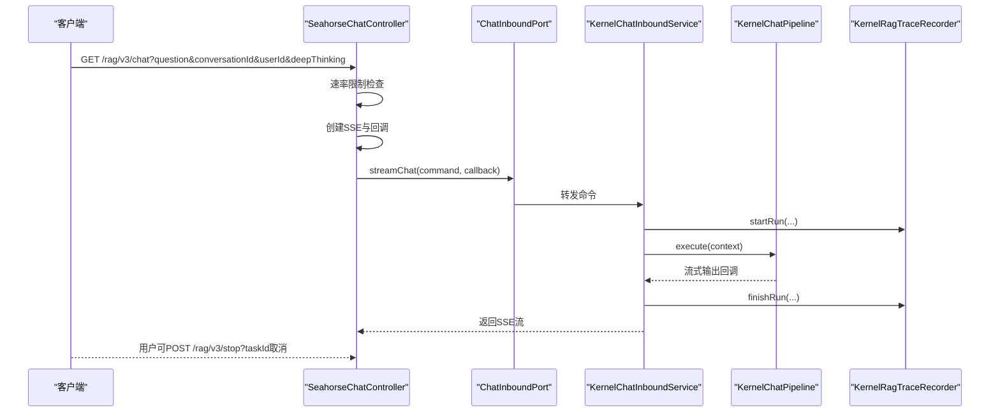
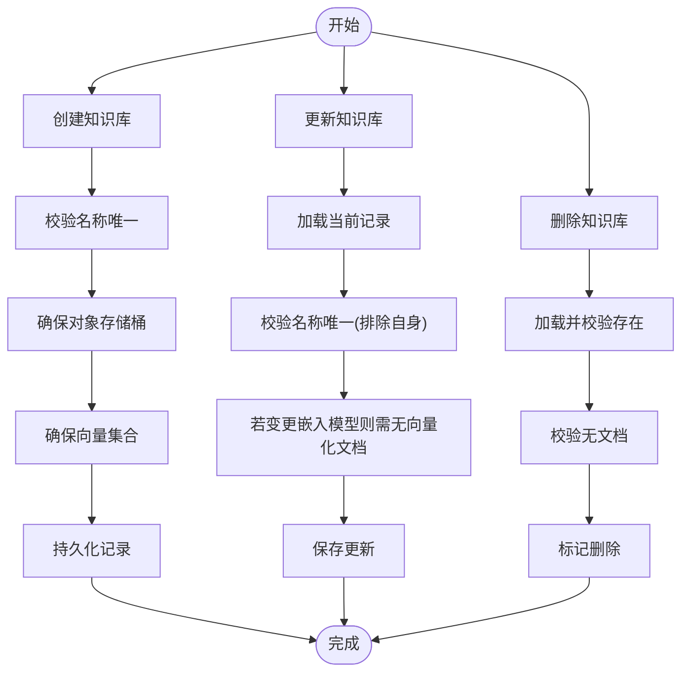
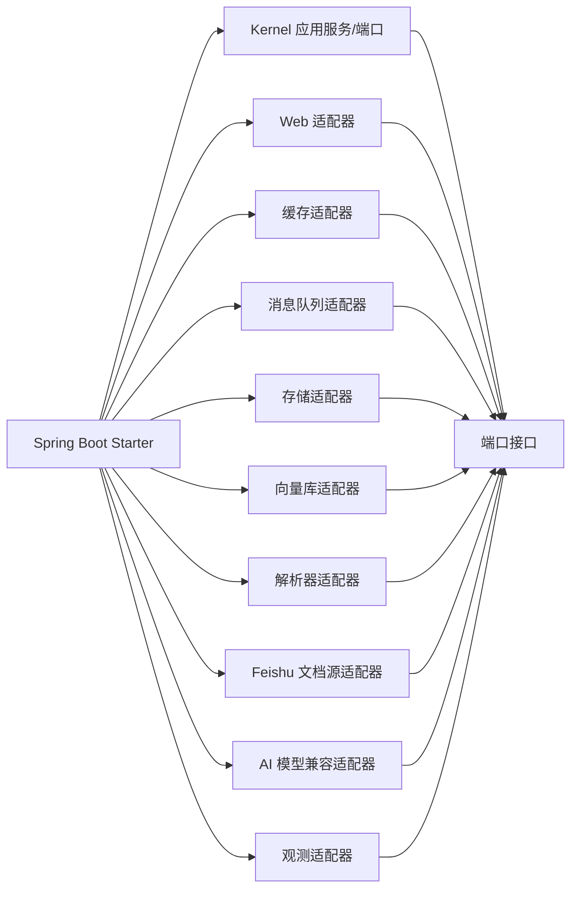

# 后端系统

<cite>
**本文引用的文件**
- [pom.xml](file://pom.xml)
- [application.properties](file://seahorse-agent-bootstrap/src/main/resources/application.properties)
- [KernelRuntimeMode.java](file://seahorse-agent-kernel/src/main/java/com/miracle/ai/seahorse/agent/kernel/config/KernelRuntimeMode.java)
- [ExtensionRegistry.java](file://seahorse-agent-kernel/src/main/java/com/miracle/ai/seahorse/agent/kernel/plugin/ExtensionRegistry.java)
- [ExtensionLoader.java](file://seahorse-agent-kernel/src/main/java/com/miracle/ai/seahorse/agent/kernel/plugin/ExtensionLoader.java)
- [KernelChatInboundService.java](file://seahorse-agent-kernel/src/main/java/com/miracle/ai/seahorse/agent/kernel/application/chat/KernelChatInboundService.java)
- [KernelKnowledgeBaseService.java](file://seahorse-agent-kernel/src/main/java/com/miracle/ai/seahorse/agent/kernel/application/knowledge/KernelKnowledgeBaseService.java)
- [ChatInboundPort.java](file://seahorse-agent-kernel/src/main/java/com/miracle/ai/seahorse/agent/ports/inbound/chat/ChatInboundPort.java)
- [ChatModelPort.java](file://seahorse-agent-kernel/src/main/java/com/miracle/ai/seahorse/agent/ports/outbound/model/ChatModelPort.java)
- [SeahorseChatController.java](file://seahorse-agent-adapter-web/src/main/java/com/miracle/ai/seahorse/agent/adapters/web/SeahorseChatController.java)
- [RedisCacheAdapter.java](file://seahorse-agent-adapter-cache-redis/src/main/java/com/miracle/ai/seahorse/agent/adapters/cache/redis/RedisCacheAdapter.java)
- [JdbcKnowledgeBaseRepositoryAdapter.java](file://seahorse-agent-adapter-repository-jdbc/src/main/java/com/miracle/ai/seahorse/agent/adapters/repository/jdbc/JdbcKnowledgeBaseRepositoryAdapter.java)
- [SeahorseAgentKernelAutoConfiguration.java](file://seahorse-agent-spring-boot-starter/src/main/java/com/miracle/ai/seahorse/agent/adapters/spring/SeahorseAgentKernelAutoConfiguration.java)
</cite>

## 目录
1. [简介](#简介)
2. [项目结构](#项目结构)
3. [核心组件](#核心组件)
4. [架构总览](#架构总览)
5. [详细组件分析](#详细组件分析)
6. [依赖关系分析](#依赖关系分析)
7. [性能考虑](#性能考虑)
8. [故障排查指南](#故障排查指南)
9. [结论](#结论)
10. [附录](#附录)

## 简介
本文件面向 Seahorse Agent 后端系统，聚焦 Kernel 核心模块的架构设计与实现，系统化阐述应用服务层、领域模型、端口接口的职责划分；详解聊天服务、知识库服务、会话管理服务等业务域的应用服务；解释端口接口如何通过抽象实现与外部系统的解耦；介绍适配器模块（Web、缓存、消息队列、存储、向量库、解析器、Feishu 文档源、AI 模型兼容适配器等）的功能与使用方式；说明插件系统的扩展机制（基于 classpath 资源的扩展加载与注册）；提供启动配置、运行参数与性能调优建议；并覆盖错误处理、异常管理与日志记录等运维要点。

## 项目结构
后端采用多模块 Maven 结构，核心模块包括：
- Kernel：内核与应用服务、领域模型、端口定义
- 适配器模块：Web、缓存（Redis/本地）、消息队列（Pulsar/Direct）、存储（S3/本地）、向量库（Milvus/pgvector/noop）、解析器（Tika）、Feishu 文档源、AI 模型兼容适配器、观测（Micrometer/Noop）
- Spring Boot Starter：自动装配内核、Feature 注册表与 Web 本地流式任务能力
- Bootstrap：应用引导与基础配置
- Tests：测试模块

图表来源
- [pom.xml](file://pom.xml)
- [SeahorseAgentKernelAutoConfiguration.java](file://seahorse-agent-spring-boot-starter/src/main/java/com/miracle/ai/seahorse/agent/adapters/spring/SeahorseAgentKernelAutoConfiguration.java)

章节来源
- [pom.xml](file://pom.xml)
- [application.properties](file://seahorse-agent-bootstrap/src/main/resources/application.properties)

## 核心组件
- 应用服务层：封装业务用例，协调端口与领域逻辑，如 KernelChatInboundService、KernelKnowledgeBaseService 等
- 领域模型：承载业务不变量与行为，如聊天消息、意图树节点、内存条目等
- 端口接口：定义内核对外的契约，分为 inbound（入站）与 outbound（出站），用于隔离外部依赖
- 插件系统：基于 classpath 资源的扩展加载与注册，支持 Feature 激活与默认扩展选择

章节来源
- [KernelChatInboundService.java](file://seahorse-agent-kernel/src/main/java/com/miracle/ai/seahorse/agent/kernel/application/chat/KernelChatInboundService.java)
- [KernelKnowledgeBaseService.java](file://seahorse-agent-kernel/src/main/java/com/miracle/ai/seahorse/agent/kernel/application/knowledge/KernelKnowledgeBaseService.java)
- [ExtensionRegistry.java](file://seahorse-agent-kernel/src/main/java/com/miracle/ai/seahorse/agent/kernel/plugin/ExtensionRegistry.java)
- [ExtensionLoader.java](file://seahorse-agent-kernel/src/main/java/com/miracle/ai/seahorse/agent/kernel/plugin/ExtensionLoader.java)

## 架构总览
Kernel 以“端口 + 适配器”为核心，通过 ExtensionRegistry/ExtensionLoader 在启动期装配 Feature 与适配器，运行期通过端口进行编排。Web 适配器将 HTTP 请求转换为内核命令，经 KernelChatInboundService 进入 KernelChatPipeline，结合检索、记忆、提示词等能力生成流式响应。

图表来源
- [SeahorseChatController.java](file://seahorse-agent-adapter-web/src/main/java/com/miracle/ai/seahorse/agent/adapters/web/SeahorseChatController.java)
- [ChatInboundPort.java](file://seahorse-agent-kernel/src/main/java/com/miracle/ai/seahorse/agent/ports/inbound/chat/ChatInboundPort.java)
- [KernelChatInboundService.java](file://seahorse-agent-kernel/src/main/java/com/miracle/ai/seahorse/agent/kernel/application/chat/KernelChatInboundService.java)
- [ChatModelPort.java](file://seahorse-agent-kernel/src/main/java/com/miracle/ai/seahorse/agent/ports/outbound/model/ChatModelPort.java)
- [SeahorseAgentKernelAutoConfiguration.java](file://seahorse-agent-spring-boot-starter/src/main/java/com/miracle/ai/seahorse/agent/adapters/spring/SeahorseAgentKernelAutoConfiguration.java)

## 详细组件分析

### Kernel 运行时模式与启动配置
- 运行时模式：通过枚举定义 Kernel 的运行模式，默认 kernel
- 启动配置：Bootstrap 中设置应用名、开启内核、迁移模式为 kernel

章节来源
- [KernelRuntimeMode.java](file://seahorse-agent-kernel/src/main/java/com/miracle/ai/seahorse/agent/kernel/config/KernelRuntimeMode.java)
- [application.properties](file://seahorse-agent-bootstrap/src/main/resources/application.properties)

### 插件系统与扩展加载
- ExtensionRegistry：扩展注册表，提供默认扩展与激活扩展链查询、注册能力
- ExtensionLoader：基于 classpath 资源（META-INF/seahorse-agent/{port-fqcn}）加载扩展，解析 .class/.order/.default/.managed/.capabilities/.enabled-by-default 等键值，实例化并注册到注册表
- 设计要点：启动期装配，运行期通过注册表按端口类型获取扩展链，避免反射扫描对 RAG 性能的影响

图表来源
- [ExtensionRegistry.java](file://seahorse-agent-kernel/src/main/java/com/miracle/ai/seahorse/agent/kernel/plugin/ExtensionRegistry.java)
- [ExtensionLoader.java](file://seahorse-agent-kernel/src/main/java/com/miracle/ai/seahorse/agent/kernel/plugin/ExtensionLoader.java)

章节来源
- [ExtensionRegistry.java](file://seahorse-agent-kernel/src/main/java/com/miracle/ai/seahorse/agent/kernel/plugin/ExtensionRegistry.java)
- [ExtensionLoader.java](file://seahorse-agent-kernel/src/main/java/com/miracle/ai/seahorse/agent/kernel/plugin/ExtensionLoader.java)

### 应用服务：聊天服务
- KernelChatInboundService：实现 ChatInboundPort，负责接收流式聊天命令，构建 StreamChatContext，交由 KernelChatPipeline 执行，并通过 KernelRagTraceRecorder 记录追踪
- Web 控制器 SeahorseChatController：将 HTTP 请求转换为 StreamChatCommand，执行速率限制，创建 SSE 流式回调，触发内核处理；支持停止任务

图表来源
- [SeahorseChatController.java](file://seahorse-agent-adapter-web/src/main/java/com/miracle/ai/seahorse/agent/adapters/web/SeahorseChatController.java)
- [KernelChatInboundService.java](file://seahorse-agent-kernel/src/main/java/com/miracle/ai/seahorse/agent/kernel/application/chat/KernelChatInboundService.java)
- [ChatInboundPort.java](file://seahorse-agent-kernel/src/main/java/com/miracle/ai/seahorse/agent/ports/inbound/chat/ChatInboundPort.java)

章节来源
- [KernelChatInboundService.java](file://seahorse-agent-kernel/src/main/java/com/miracle/ai/seahorse/agent/kernel/application/chat/KernelChatInboundService.java)
- [SeahorseChatController.java](file://seahorse-agent-adapter-web/src/main/java/com/miracle/ai/seahorse/agent/adapters/web/SeahorseChatController.java)

### 应用服务：知识库服务
- KernelKnowledgeBaseService：实现 KnowledgeBaseInboundPort，负责知识库的创建、更新、删除、查询与分页；在创建时确保对象存储桶与向量集合存在；在更新时校验名称唯一性与嵌入模型变更约束；删除前校验无文档

图表来源
- [KernelKnowledgeBaseService.java](file://seahorse-agent-kernel/src/main/java/com/miracle/ai/seahorse/agent/kernel/application/knowledge/KernelKnowledgeBaseService.java)

章节来源
- [KernelKnowledgeBaseService.java](file://seahorse-agent-kernel/src/main/java/com/miracle/ai/seahorse/agent/kernel/application/knowledge/KernelKnowledgeBaseService.java)

### 端口接口与解耦策略
- 入站端口：ChatInboundPort、KnowledgeBaseInboundPort 等，定义内核对外暴露的业务入口
- 出站端口：KeyValueCachePort、RateLimiterPort、PubSubPort、DistributedLockPort、ObjectStoragePort、Vector*Port、ChatModelPort 等，定义内核依赖的外部能力
- 解耦策略：内核仅依赖端口接口，不直接依赖具体实现；通过 Spring Boot Starter 在启动期装配适配器，运行期通过注册表与端口编排

章节来源
- [ChatInboundPort.java](file://seahorse-agent-kernel/src/main/java/com/miracle/ai/seahorse/agent/ports/inbound/chat/ChatInboundPort.java)
- [ChatModelPort.java](file://seahorse-agent-kernel/src/main/java/com/miracle/ai/seahorse/agent/ports/outbound/model/ChatModelPort.java)
- [SeahorseAgentKernelAutoConfiguration.java](file://seahorse-agent-spring-boot-starter/src/main/java/com/miracle/ai/seahorse/agent/adapters/spring/SeahorseAgentKernelAutoConfiguration.java)

### 适配器模块实现

#### Web 适配器
- 功能：提供 REST 接口，将 HTTP 请求转为内核命令，支持 SSE 流式响应与任务停止
- 关键点：速率限制、用户 ID 与会话 ID 解析、回调工厂创建

章节来源
- [SeahorseChatController.java](file://seahorse-agent-adapter-web/src/main/java/com/miracle/ai/seahorse/agent/adapters/web/SeahorseChatController.java)

#### 缓存适配器（Redis）
- 功能：键值缓存、发布订阅、分布式锁、ID 生成、令牌桶限流
- 关键点：使用 Redisson 客户端，统一 key 前缀，序列化 PubSub 消息

章节来源
- [RedisCacheAdapter.java](file://seahorse-agent-adapter-cache-redis/src/main/java/com/miracle/ai/seahorse/agent/adapters/cache/redis/RedisCacheAdapter.java)

#### JDBC 仓储适配器（知识库）
- 功能：知识库的增删改查、分页、文档存在性与向量化状态检查
- 关键点：SQL 参数校验与占位、分页边界控制、ID 生成策略

章节来源
- [JdbcKnowledgeBaseRepositoryAdapter.java](file://seahorse-agent-adapter-repository-jdbc/src/main/java/com/miracle/ai/seahorse/agent/adapters/repository/jdbc/JdbcKnowledgeBaseRepositoryAdapter.java)

#### 其他适配器（概览）
- 消息队列：Pulsar/Direct，提供消息发送与订阅
- 存储：S3/本地，提供对象存储能力
- 向量库：Milvus/pgvector/noop，提供集合管理、索引与搜索
- 解析器：Apache Tika，提供文档解析
- Feishu 文档源：提供文档抓取
- AI 模型兼容适配器：OpenAI 兼容模型族端口
- 观测：Micrometer/Noop，提供指标观测

章节来源
- [pom.xml](file://pom.xml)

### Spring Boot 自动装配与内核编排
- 自动装配：SeahorseAgentKernelAutoConfiguration 在启动期装配 Feature 注册表、检索引擎、聊天流水线、应用服务、定时任务等
- 端口装配：为各端口提供默认实现或空实现，确保内核可独立运行
- 条件装配：基于属性开关与 Bean 是否存在进行条件装配

章节来源
- [SeahorseAgentKernelAutoConfiguration.java](file://seahorse-agent-spring-boot-starter/src/main/java/com/miracle/ai/seahorse/agent/adapters/spring/SeahorseAgentKernelAutoConfiguration.java)

## 依赖关系分析
- Kernel 依赖端口接口，不依赖具体实现
- 适配器模块实现端口接口，注入到注册表
- Spring Boot Starter 将 Kernel 与适配器整合，形成可运行的微内核

图表来源
- [pom.xml](file://pom.xml)
- [SeahorseAgentKernelAutoConfiguration.java](file://seahorse-agent-spring-boot-starter/src/main/java/com/miracle/ai/seahorse/agent/adapters/spring/SeahorseAgentKernelAutoConfiguration.java)

章节来源
- [pom.xml](file://pom.xml)
- [SeahorseAgentKernelAutoConfiguration.java](file://seahorse-agent-spring-boot-starter/src/main/java/com/miracle/ai/seahorse/agent/adapters/spring/SeahorseAgentKernelAutoConfiguration.java)

## 性能考虑
- 启动期装配：ExtensionLoader 仅在启动期扫描 classpath 资源，运行期通过注册表获取扩展链，避免反射扫描带来的性能损耗
- 端口默认实现：未装配具体适配器时，端口提供空实现（noop），保证内核可运行且无额外开销
- 并发与线程池：自动装配中为检索、上下文构造、MCP 等提供可配置的线程池 Provider，便于按环境调优
- 速率限制：Web 层提供基于 RateLimiterPort 的限流，防止突发流量冲击内核
- 缓存与分布式锁：Redis 缓存与分布式锁适配器提供高性能的共享状态管理

章节来源
- [ExtensionLoader.java](file://seahorse-agent-kernel/src/main/java/com/miracle/ai/seahorse/agent/kernel/plugin/ExtensionLoader.java)
- [SeahorseAgentKernelAutoConfiguration.java](file://seahorse-agent-spring-boot-starter/src/main/java/com/miracle/ai/seahorse/agent/adapters/spring/SeahorseAgentKernelAutoConfiguration.java)
- [SeahorseChatController.java](file://seahorse-agent-adapter-web/src/main/java/com/miracle/ai/seahorse/agent/adapters/web/SeahorseChatController.java)
- [RedisCacheAdapter.java](file://seahorse-agent-adapter-cache-redis/src/main/java/com/miracle/ai/seahorse/agent/adapters/cache/redis/RedisCacheAdapter.java)

## 故障排查指南
- 启动期扩展加载失败：检查 META-INF/seahorse-agent 下的资源文件是否正确，确认 .class 键指向的类实现了对应端口接口
- 速率限制触发：检查 RateLimiterPort 实现与配置项（permits/window-ms），确认用户维度限流策略
- SSE 连接问题：检查 sse-timeout-ms 配置，确认客户端网络与超时设置
- 知识库操作异常：检查名称唯一性、嵌入模型变更约束、是否存在文档或向量化文档
- 缓存/锁/发布订阅异常：确认 Redisson 客户端可用，key 前缀与序列化一致

章节来源
- [ExtensionLoader.java](file://seahorse-agent-kernel/src/main/java/com/miracle/ai/seahorse/agent/kernel/plugin/ExtensionLoader.java)
- [SeahorseChatController.java](file://seahorse-agent-adapter-web/src/main/java/com/miracle/ai/seahorse/agent/adapters/web/SeahorseChatController.java)
- [KernelKnowledgeBaseService.java](file://seahorse-agent-kernel/src/main/java/com/miracle/ai/seahorse/agent/kernel/application/knowledge/KernelKnowledgeBaseService.java)
- [RedisCacheAdapter.java](file://seahorse-agent-adapter-cache-redis/src/main/java/com/miracle/ai/seahorse/agent/adapters/cache/redis/RedisCacheAdapter.java)

## 结论
Seahorse Agent 后端以 Kernel 为核心，通过端口接口与适配器实现高内聚、低耦合的架构。插件系统在启动期装配 Feature 与适配器，运行期通过注册表与端口编排，既保证了灵活性，又兼顾了性能与可维护性。Web、缓存、消息队列、存储、向量库、解析器、Feishu 文档源、AI 模型兼容适配器覆盖了 RAG 全链路能力，配合 Spring Boot Starter 形成可独立运行的微内核入口。

## 附录

### 启动与运行参数
- 应用名：seahorse-agent-service
- 内核开关：seahorse-agent.kernel.enabled=true
- 迁移模式：seahorse-agent.kernel.migration-mode=kernel
- Web SSE 超时：seahorse-agent.web.sse-timeout-ms
- 聊天速率限制：seahorse-agent.web.chat-rate-limit.permits、seahorse-agent.web.chat-rate-limit.window-ms
- 文档刷新批大小：seahorse-agent.document-refresh.batch-size
- 内存治理阈值：seahorse-agent.memory.long-term-importance-threshold

章节来源
- [application.properties](file://seahorse-agent-bootstrap/src/main/resources/application.properties)
- [SeahorseAgentKernelAutoConfiguration.java](file://seahorse-agent-spring-boot-starter/src/main/java/com/miracle/ai/seahorse/agent/adapters/spring/SeahorseAgentKernelAutoConfiguration.java)
- [SeahorseChatController.java](file://seahorse-agent-adapter-web/src/main/java/com/miracle/ai/seahorse/agent/adapters/web/SeahorseChatController.java)