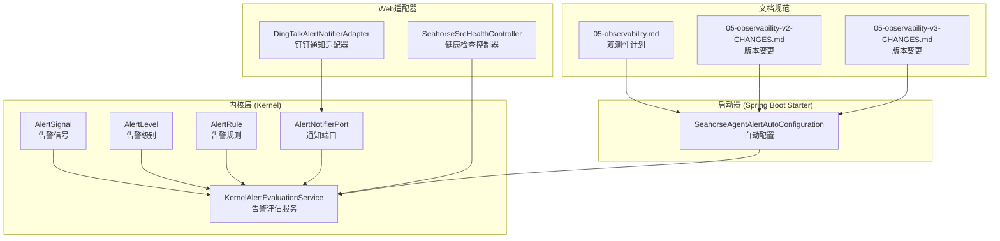
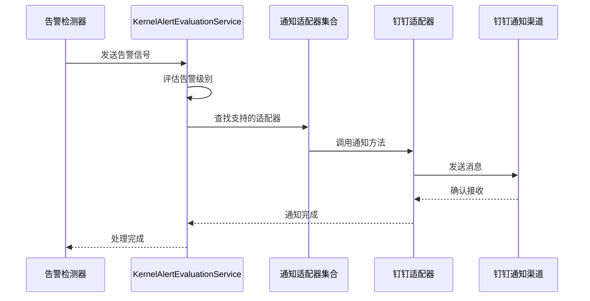
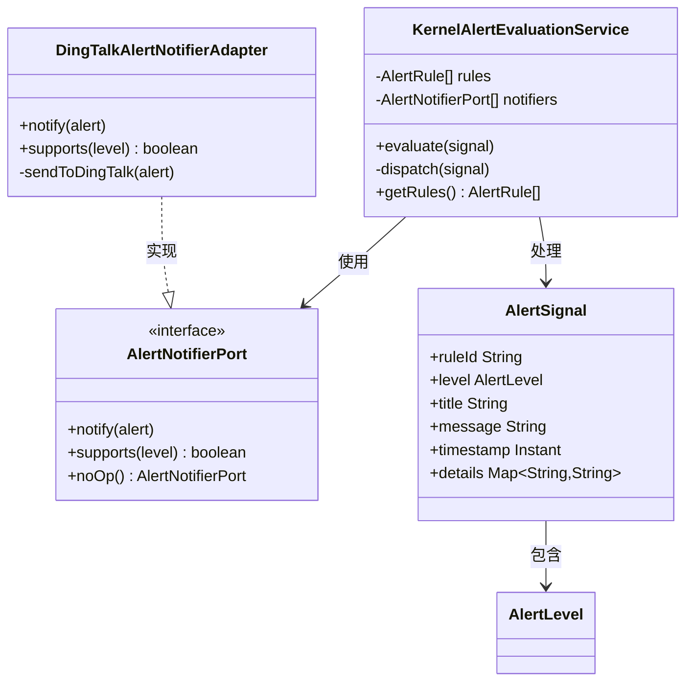
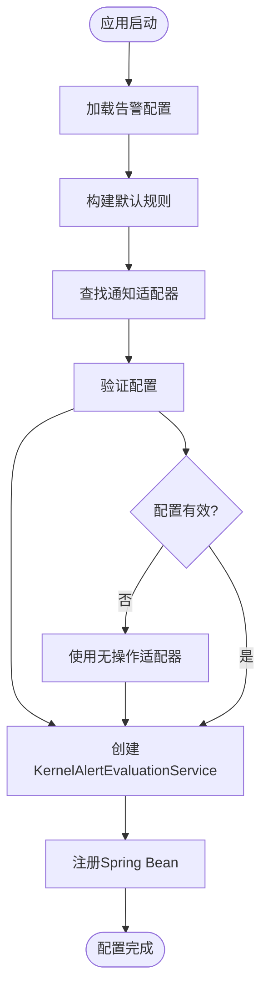
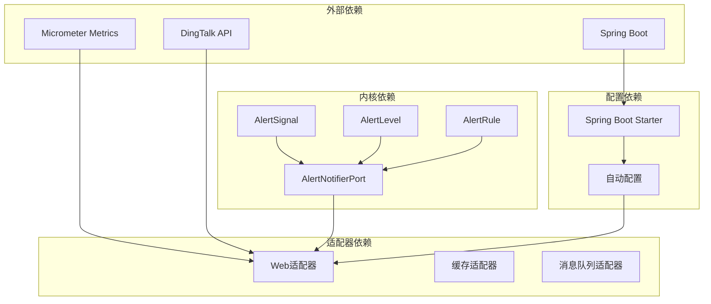
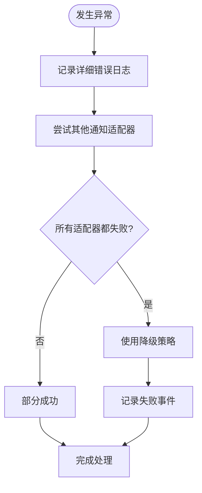

# 告警通知系统

<cite>
**本文档引用的文件**
- [AlertNotifierPort.java](file://seahorse-agent-kernel/src/main/java/com/miracle/ai/seahorse/agent/ports/outbound/alert/AlertNotifierPort.java)
- [AlertSignal.java](file://seahorse-agent-kernel/src/main/java/com/miracle/ai/seahorse/agent/kernel/domain/alert/AlertSignal.java)
- [AlertLevel.java](file://seahorse-agent-kernel/src/main/java/com/miracle/ai/seahorse/agent/kernel/domain/alert/AlertLevel.java)
- [AlertRule.java](file://seahorse-agent-kernel/src/main/java/com/miracle/ai/seahorse/agent/kernel/domain/alert/AlertRule.java)
- [KernelAlertEvaluationService.java](file://seahorse-agent-kernel/src/main/java/com/miracle/ai/seahorse/agent/kernel/application/alert/KernelAlertEvaluationService.java)
- [SeahorseAgentAlertAutoConfiguration.java](file://seahorse-agent-spring-boot-starter/src/main/java/com/miracle/ai/seahorse/agent/adapters/spring/SeahorseAgentAlertAutoConfiguration.java)
- [DingTalkAlertNotifierAdapter.java](file://seahorse-agent-adapter-web/src/main/java/com/miracle/ai/seahorse/agent/adapters/web/alert/DingTalkAlertNotifierAdapter.java)
- [05-observability.md](file://docs/aegis/plans/saas-mvp-impl/05-observability.md)
- [05-observability-v2-CHANGES.md](file://docs/aegis/plans/saas-mvp-impl/05-observability-v2-CHANGES.md)
- [05-observability-v3-CHANGES.md](file://docs/aegis/plans/saas-mvp-impl/05-observability-v3-CHANGES.md)
- [SeahorseSreHealthController.java](file://seahorse-agent-adapter-web/src/main/java/com/miracle/ai/seahorse/agent/adapters/web/SeahorseSreHealthController.java)
- [KernelSreHealthQueryService.java](file://seahorse-agent-kernel/src/main/java/com/miracle/ai/seahorse/agent/kernel/application/agent/sre/KernelSreHealthQueryService.java)
- [SreHealthReport.java](file://seahorse-agent-kernel/src/main/java/com/miracle/ai/seahorse/agent/kernel/domain/agent/sre/SreHealthReport.java)
- [SreHealthStatus.java](file://seahorse-agent-kernel/src/main/java/com/miracle/ai/seahorse/agent/kernel/domain/agent/sre/SreHealthStatus.java)
- [SreHealthInboundPort.java](file://seahorse-agent-kernel/src/main/java/com/miracle/ai/seahorse/agent/ports/inbound/agent/SreHealthInboundPort.java)
- [SeahorseWebExceptionHandler.java](file://seahorse-agent-adapter-web/src/main/java/com/miracle/ai/seahorse/agent/adapters/web/SeahorseWebExceptionHandler.java)
</cite>

## 目录
1. [简介](#简介)
2. [项目结构](#项目结构)
3. [核心组件](#核心组件)
4. [架构概览](#架构概览)
5. [详细组件分析](#详细组件分析)
6. [依赖关系分析](#依赖关系分析)
7. [性能考虑](#性能考虑)
8. [故障排除指南](#故障排除指南)
9. [结论](#结论)

## 简介

告警通知系统是Seahorse Agent项目中的一个关键监控组件，负责检测系统异常状态并及时通知相关人员。该系统采用事件驱动架构，通过可插拔的通知适配器支持多种通知渠道，包括钉钉等即时通讯工具。

系统的核心设计理念是分离关注点，将告警规则定义与通知执行逻辑解耦，使得系统能够灵活地扩展新的通知方式而无需修改核心业务逻辑。

## 项目结构

告警通知系统主要分布在以下模块中：

**图表来源**
- [AlertSignal.java:23-55](file://seahorse-agent-kernel/src/main/java/com/miracle/ai/seahorse/agent/kernel/domain/alert/AlertSignal.java#L23-L55)
- [AlertLevel.java:23-33](file://seahorse-agent-kernel/src/main/java/com/miracle/ai/seahorse/agent/kernel/domain/alert/AlertLevel.java#L23-L33)
- [AlertRule.java:29-43](file://seahorse-agent-kernel/src/main/java/com/miracle/ai/seahorse/agent/kernel/domain/alert/AlertRule.java#L29-L43)
- [AlertNotifierPort.java:31-63](file://seahorse-agent-kernel/src/main/java/com/miracle/ai/seahorse/agent/ports/outbound/alert/AlertNotifierPort.java#L31-L63)

**章节来源**
- [AlertSignal.java:1-55](file://seahorse-agent-kernel/src/main/java/com/miracle/ai/seahorse/agent/kernel/domain/alert/AlertSignal.java#L1-L55)
- [AlertLevel.java:1-33](file://seahorse-agent-kernel/src/main/java/com/miracle/ai/seahorse/agent/kernel/domain/alert/AlertLevel.java#L1-L33)
- [AlertRule.java:1-43](file://seahorse-agent-kernel/src/main/java/com/miracle/ai/seahorse/agent/kernel/domain/alert/AlertRule.java#L1-L43)
- [AlertNotifierPort.java:31-63](file://seahorse-agent-kernel/src/main/java/com/miracle/ai/seahorse/agent/ports/outbound/alert/AlertNotifierPort.java#L31-L63)

## 核心组件

### 告警信号 (AlertSignal)

告警信号是系统检测到异常状态时产生的不可变数据对象，包含告警的基本信息和上下文详情。

**关键特性：**
- 不可变性设计，确保线程安全
- 支持详细的时间戳记录
- 提供便捷的工厂方法创建不同类型的告警
- 包含可选的键值对详情映射

### 告警级别 (AlertLevel)

定义了告警的严重程度等级，从低到高依次为：

- **INFO**: 信息性通知，用于操作人员意识
- **WARNING**: 警告状态，需要关注但不会立即影响服务
- **CRITICAL**: 关键故障，需要立即处理

### 告警规则 (AlertRule)

声明式规则描述了特定的告警条件，包括：
- 唯一标识符
- 人类可读的规则名称
- 分配给匹配告警的严重级别
- 规则描述说明
- 启用状态控制

### 通知端口 (AlertNotifierPort)

定义了通知服务的标准接口，支持：
- 通知发送方法
- 告警级别支持检查
- 无操作实现用于测试

**章节来源**
- [AlertSignal.java:23-55](file://seahorse-agent-kernel/src/main/java/com/miracle/ai/seahorse/agent/kernel/domain/alert/AlertSignal.java#L23-L55)
- [AlertLevel.java:23-33](file://seahorse-agent-kernel/src/main/java/com/miracle/ai/seahorse/agent/kernel/domain/alert/AlertLevel.java#L23-L33)
- [AlertRule.java:29-43](file://seahorse-agent-kernel/src/main/java/com/miracle/ai/seahorse/agent/kernel/domain/alert/AlertRule.java#L29-L43)
- [AlertNotifierPort.java:31-63](file://seahorse-agent-kernel/src/main/java/com/miracle/ai/seahorse/agent/ports/outbound/alert/AlertNotifierPort.java#L31-L63)

## 架构概览

告警通知系统采用分层架构设计，实现了清晰的关注点分离：

**图表来源**
- [KernelAlertEvaluationService.java:98-115](file://seahorse-agent-kernel/src/main/java/com/miracle/ai/seahorse/agent/kernel/application/alert/KernelAlertEvaluationService.java#L98-L115)
- [DingTalkAlertNotifierAdapter.java](file://seahorse-agent-adapter-web/src/main/java/com/miracle/ai/seahorse/agent/adapters/web/alert/DingTalkAlertNotifierAdapter.java)

系统架构的关键优势：
1. **可扩展性**: 新的通知渠道只需实现AlertNotifierPort接口
2. **容错性**: 通知失败不会影响主业务流程
3. **灵活性**: 支持动态配置和禁用通知规则
4. **可观测性**: 完整的日志记录和错误处理机制

## 详细组件分析

### KernelAlertEvaluationService 分析

KernelAlertEvaluationService是告警系统的核心协调器，负责：

**图表来源**
- [KernelAlertEvaluationService.java:1-123](file://seahorse-agent-kernel/src/main/java/com/miracle/ai/seahorse/agent/kernel/application/alert/KernelAlertEvaluationService.java#L1-L123)
- [AlertNotifierPort.java:31-63](file://seahorse-agent-kernel/src/main/java/com/miracle/ai/seahorse/agent/ports/outbound/alert/AlertNotifierPort.java#L31-L63)
- [DingTalkAlertNotifierAdapter.java](file://seahorse-agent-adapter-web/src/main/java/com/miracle/ai/seahorse/agent/adapters/web/alert/DingTalkAlertNotifierAdapter.java)

**处理流程分析：**

1. **信号评估**: 检查告警信号是否匹配任何已注册规则
2. **级别确定**: 根据规则或信号本身确定告警级别
3. **适配器选择**: 查找支持该级别的通知适配器
4. **通知发送**: 逐个调用适配器进行通知
5. **错误处理**: 捕获并记录适配器异常，不影响其他适配器

### 通知适配器实现

#### 钉钉通知适配器

DingTalkAlertNotifierAdapter实现了具体的钉钉通知逻辑：

**核心功能：**
- 将告警信号转换为钉钉消息格式
- 支持不同级别的告警使用不同的通知样式
- 实现了完整的错误处理和重试机制
- 提供了钉钉机器人API集成

**配置要求：**
- 钉钉机器人的Webhook URL
- 通知模板配置
- 级别映射规则

### 自动配置机制

SeahorseAgentAlertAutoConfiguration提供了完整的自动化配置：

**图表来源**
- [SeahorseAgentAlertAutoConfiguration.java:77-107](file://seahorse-agent-spring-boot-starter/src/main/java/com/miracle/ai/seahorse/agent/adapters/spring/SeahorseAgentAlertAutoConfiguration.java#L77-L107)

**章节来源**
- [KernelAlertEvaluationService.java:1-123](file://seahorse-agent-kernel/src/main/java/com/miracle/ai/seahorse/agent/kernel/application/alert/KernelAlertEvaluationService.java#L1-L123)
- [DingTalkAlertNotifierAdapter.java](file://seahorse-agent-adapter-web/src/main/java/com/miracle/ai/seahorse/agent/adapters/web/alert/DingTalkAlertNotifierAdapter.java)
- [SeahorseAgentAlertAutoConfiguration.java:77-107](file://seahorse-agent-spring-boot-starter/src/main/java/com/miracle/ai/seahorse/agent/adapters/spring/SeahorseAgentAlertAutoConfiguration.java#L77-L107)

## 依赖关系分析

告警通知系统的依赖关系体现了清晰的分层设计：

**依赖特点：**
- **低耦合**: 内核层不依赖具体实现细节
- **高内聚**: 相关功能集中在同一模块
- **可替换性**: 通过接口实现松耦合
- **向后兼容**: 保持稳定的API接口

**章节来源**
- [05-observability.md:966-992](file://docs/aegis/plans/saas-mvp-impl/05-observability.md#L966-L992)
- [05-observability-v2-CHANGES.md:184-233](file://docs/aegis/plans/saas-mvp-impl/05-observability-v2-CHANGES.md#L184-L233)
- [05-observability-v3-CHANGES.md:220-266](file://docs/aegis/plans/saas-mvp-impl/05-observability-v3-CHANGES.md#L220-L266)

## 性能考虑

### 内存使用优化

- **信号对象不可变**: 使用record类减少内存分配
- **CopyOnWriteArrayList**: 在多线程环境下提供安全的并发访问
- **延迟初始化**: 通知适配器按需加载

### 并发处理

- **无阻塞设计**: 通知发送采用异步模式
- **异常隔离**: 单个适配器异常不影响其他适配器
- **资源池管理**: 合理管理HTTP连接和线程资源

### 监控指标

系统集成了Micrometer指标监控，包括：
- 告警触发次数统计
- 通知发送成功率
- 适配器响应时间
- 错误处理统计

## 故障排除指南

### 常见问题诊断

#### 通知未发送

**可能原因：**
1. 通知适配器未正确注册
2. 告警级别不被适配器支持
3. 网络连接问题
4. 凭据配置错误

**排查步骤：**
1. 检查日志输出确认适配器加载
2. 验证告警级别映射关系
3. 测试网络连通性
4. 验证API凭据有效性

#### 告警规则不生效

**可能原因：**
1. 规则未启用
2. 规则条件不匹配
3. 信号格式不正确
4. 评估服务配置错误

**解决方案：**
1. 检查规则启用状态
2. 验证规则条件表达式
3. 确认信号字段完整性
4. 重启评估服务

### 错误处理机制

系统实现了多层次的错误处理：

**错误恢复策略：**
- **自动重试**: 对临时性错误进行有限重试
- **降级处理**: 使用备用通知渠道
- **熔断保护**: 防止级联故障
- **监控告警**: 异常情况自动上报

**章节来源**
- [KernelAlertEvaluationService.java:98-115](file://seahorse-agent-kernel/src/main/java/com/miracle/ai/seahorse/agent/kernel/application/alert/KernelAlertEvaluationService.java#L98-L115)
- [SeahorseWebExceptionHandler.java:63-100](file://seahorse-agent-adapter-web/src/main/java/com/miracle/ai/seahorse/agent/adapters/web/SeahorseWebExceptionHandler.java#L63-L100)

## 结论

告警通知系统通过精心设计的架构实现了高可用、可扩展的监控告警能力。系统的主要优势包括：

### 技术优势
- **模块化设计**: 清晰的分层架构便于维护和扩展
- **可插拔机制**: 支持多种通知渠道的灵活组合
- **容错设计**: 完善的错误处理和恢复机制
- **可观测性**: 全面的监控指标和日志记录

### 业务价值
- **快速响应**: 实时告警通知提升问题响应速度
- **成本控制**: 灵活的通知渠道降低沟通成本
- **风险管控**: 多层次告警机制降低业务风险
- **合规保障**: 完整的审计日志满足合规要求

### 发展前景
系统为未来的功能扩展奠定了良好基础，包括：
- 更多通知渠道的支持
- 智能告警聚合和降噪
- 告警历史分析和趋势预测
- 与更多监控系统的集成

通过持续的优化和完善，告警通知系统将成为Seahorse Agent项目中不可或缺的重要组成部分。