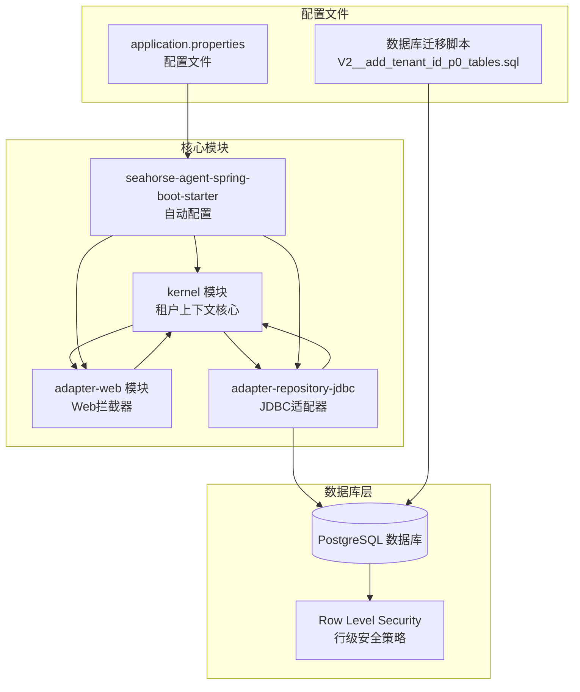
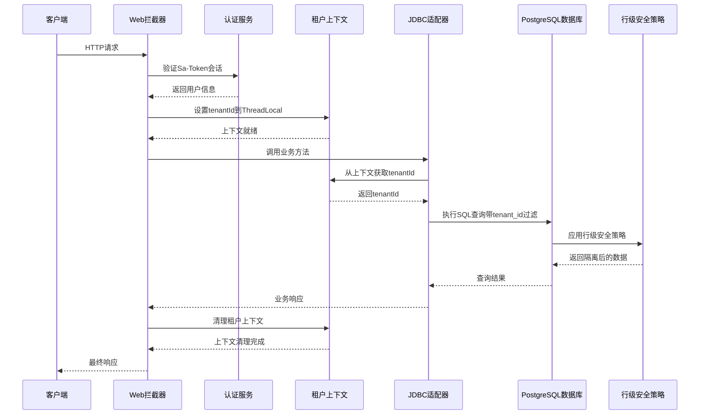
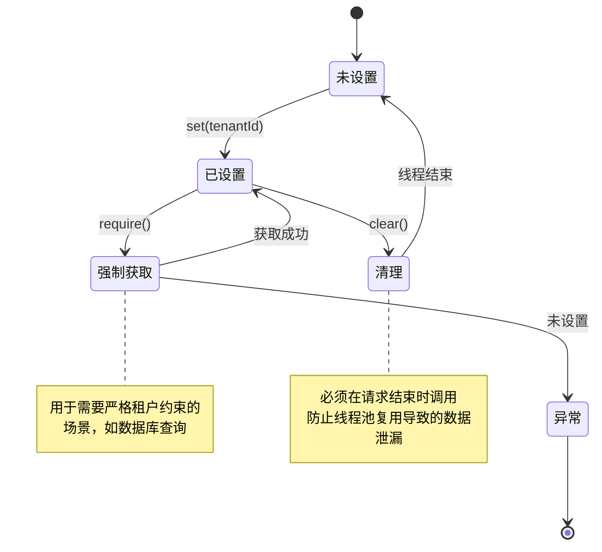
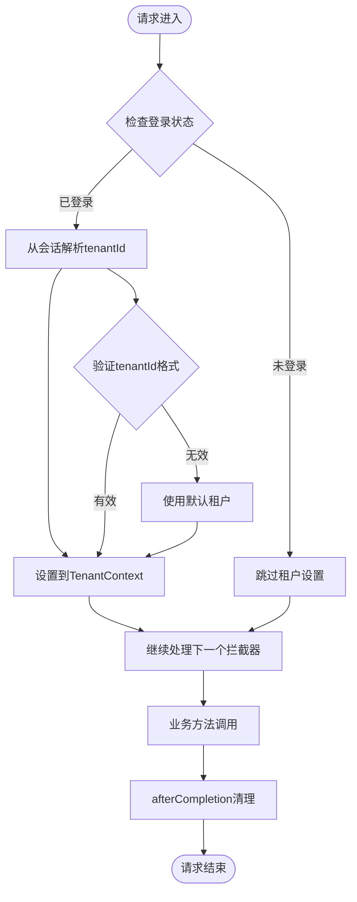
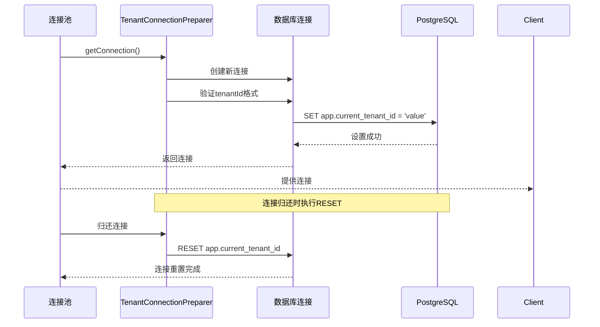
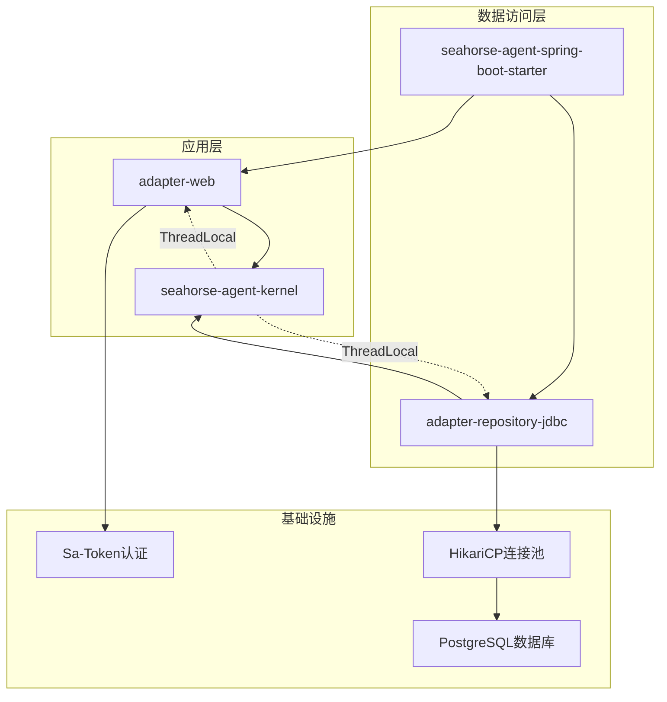

# 多租户隔离架构

<cite>
**本文档引用的文件**
- [01-multi-tenancy.md](file://docs/aegis/plans/saas-mvp-impl/01-multi-tenancy.md)
- [TenantContext.java](file://seahorse-agent-kernel/src/main/java/com/miracle/ai/seahorse/agent/kernel/tenant/TenantContext.java)
- [TenantInterceptor.java](file://seahorse-agent-adapter-web/src/main/java/com/miracle/ai/seahorse/agent/adapters/web/TenantInterceptor.java)
- [SeahorseSecurityWebMvcConfiguration.java](file://seahorse-agent-adapter-web/src/main/java/com/miracle/ai/seahorse/agent/adapters/web/SeahorseSecurityWebMvcConfiguration.java)
- [JdbcTenantSupport.java](file://seahorse-agent-adapter-repository-jdbc/src/main/java/com/miracle/ai/seahorse/agent/adapters/repository/jdbc/JdbcTenantSupport.java)
- [TenantConnectionPreparer.java](file://seahorse-agent-adapter-repository-jdbc/src/main/java/com/miracle/ai/seahorse/agent/adapters/repository/jdbc/TenantConnectionPreparer.java)
- [SeahorseAgentTenantAutoConfiguration.java](file://seahorse-agent-spring-boot-starter/src/main/java/com/miracle/ai/seahorse/agent/adapters/spring/SeahorseAgentTenantAutoConfiguration.java)
- [V2__add_tenant_id_p0_tables.sql](file://resources/database/migrations/V2__add_tenant_id_p0_tables.sql)
- [02-security-hardening-p0.md](file://docs/aegis/plans/saas-mvp-impl/02-security-hardening-p0.md)
</cite>

## 目录
1. [简介](#简介)
2. [项目结构](#项目结构)
3. [核心组件](#核心组件)
4. [架构概览](#架构概览)
5. [详细组件分析](#详细组件分析)
6. [依赖关系分析](#依赖关系分析)
7. [性能考虑](#性能考虑)
8. [故障排除指南](#故障排除指南)
9. [结论](#结论)

## 简介

本项目实现了完整的多租户隔离架构，旨在为SaaS平台提供安全可靠的数据隔离机制。该架构通过三层防护体系确保租户间的数据完全隔离，包括应用层过滤、数据库行级安全策略（RLS）以及连接级租户上下文管理。

多租户隔离架构的核心目标是：
- 提供统一的租户上下文契约（TenantContext）
- 实现请求级别的租户身份解析和传播
- 建立应用层和数据库层的双重数据隔离
- 确保跨租户查询的严格防护
- 支持异步场景下的租户上下文传播

## 项目结构

多租户隔离架构采用模块化设计，主要分布在以下核心模块中：

**图表来源**
- [TenantContext.java:31-125](file://seahorse-agent-kernel/src/main/java/com/miracle/ai/seahorse/agent/kernel/tenant/TenantContext.java#L31-L125)
- [TenantInterceptor.java:34-70](file://seahorse-agent-adapter-web/src/main/java/com/miracle/ai/seahorse/agent/adapters/web/TenantInterceptor.java#L34-L70)
- [SeahorseSecurityWebMvcConfiguration.java:72-124](file://seahorse-agent-adapter-web/src/main/java/com/miracle/ai/seahorse/agent/adapters/web/SeahorseSecurityWebMvcConfiguration.java#L72-L124)

**章节来源**
- [01-multi-tenancy.md:36-76](file://docs/aegis/plans/saas-mvp-impl/01-multi-tenancy.md#L36-L76)

## 核心组件

### 租户上下文管理器（TenantContext）

租户上下文管理器是整个多租户架构的核心组件，基于ThreadLocal实现线程级别的租户状态管理。

**核心特性：**
- 线程本地存储，确保租户信息不会在请求间交叉污染
- 提供多种获取模式：可选获取、强制获取、默认值获取
- 支持异步场景的上下文捕获和恢复
- 完整的生命周期管理，包括设置、清除和验证

**关键方法：**
- `set(String tenantId)` - 设置当前租户ID
- `get()` - 获取当前租户ID（无设置时返回默认值）
- `require()` - 强制获取租户ID（未设置时抛出异常）
- `capture()` 和 `restore(String tenantId)` - 异步上下文传播
- `clear()` - 清理租户上下文，防止线程池复用导致的数据泄漏

### Web拦截器（TenantInterceptor）

Web拦截器负责在请求进入时解析和设置租户上下文，确保每个请求都能正确识别所属租户。

**工作流程：**
1. 检查用户登录状态（Sa-Token会话）
2. 从会话中解析tenantId
3. 设置到TenantContext中
4. 请求结束后清理租户上下文

**配置特点：**
- 优先于认证拦截器执行
- 支持路径模式匹配和排除规则
- 兼容未登录的公开接口
- 自动降级到默认租户

### JDBC租户支持

JDBC层提供了统一的租户ID解析和过滤机制，确保所有数据库操作都带有正确的租户约束。

**实现机制：**
- 统一的租户ID解析方法
- 支持显式参数和上下文参数两种模式
- 自动在SQL查询中添加tenant_id过滤条件
- 提供幂等的schema升级能力

**章节来源**
- [TenantContext.java:31-125](file://seahorse-agent-kernel/src/main/java/com/miracle/ai/seahorse/agent/kernel/tenant/TenantContext.java#L31-L125)
- [TenantInterceptor.java:34-70](file://seahorse-agent-adapter-web/src/main/java/com/miracle/ai/seahorse/agent/adapters/web/TenantInterceptor.java#L34-L70)
- [JdbcTenantSupport.java:23-62](file://seahorse-agent-adapter-repository-jdbc/src/main/java/com/miracle/ai/seahorse/agent/adapters/repository/jdbc/JdbcTenantSupport.java#L23-L62)

## 架构概览

多租户隔离架构采用三层防护体系，确保数据安全隔离：

**图表来源**
- [01-multi-tenancy.md:81-120](file://docs/aegis/plans/saas-mvp-impl/01-multi-tenancy.md#L81-L120)
- [TenantInterceptor.java:38-53](file://seahorse-agent-adapter-web/src/main/java/com/miracle/ai/seahorse/agent/adapters/web/TenantInterceptor.java#L38-L53)
- [TenantConnectionPreparer.java:56-66](file://seahorse-agent-adapter-repository-jdbc/src/main/java/com/miracle/ai/seahorse/agent/adapters/repository/jdbc/TenantConnectionPreparer.java#L56-L66)

### 数据库层隔离

数据库层通过PostgreSQL的行级安全策略（RLS）提供第二道防线：

**RLS策略特点：**
- 对18张核心业务表启用RLS
- 强制所有表拥有者也受RLS约束
- 使用session变量app.current_tenant_id进行租户标识
- 默认拒绝策略，确保安全边界

**安全机制：**
- USING子句控制SELECT/UPDATE/DELETE可见性
- WITH CHECK子句控制INSERT/UPDATE写入
- FORCE关键字确保表owner也无法绕过
- missing_ok参数确保未设置时默认拒绝

**章节来源**
- [V2__add_tenant_id_p0_tables.sql:76-138](file://resources/database/migrations/V2__add_tenant_id_p0_tables.sql#L76-L138)
- [01-multi-tenancy.md:253-258](file://docs/aegis/plans/saas-mvp-impl/01-multi-tenancy.md#L253-L258)

## 详细组件分析

### 租户上下文生命周期管理

**图表来源**
- [TenantContext.java:68-83](file://seahorse-agent-kernel/src/main/java/com/miracle/ai/seahorse/agent/kernel/tenant/TenantContext.java#L68-L83)
- [TenantContext.java:122-124](file://seahorse-agent-kernel/src/main/java/com/miracle/ai/seahorse/agent/kernel/tenant/TenantContext.java#L122-L124)

### Web拦截器执行流程

**图表来源**
- [TenantInterceptor.java:38-70](file://seahorse-agent-adapter-web/src/main/java/com/miracle/ai/seahorse/agent/adapters/web/TenantInterceptor.java#L38-L70)
- [SeahorseSecurityWebMvcConfiguration.java:111-124](file://seahorse-agent-adapter-web/src/main/java/com/miracle/ai/seahorse/agent/adapters/web/SeahorseSecurityWebMvcConfiguration.java#L111-L124)

### JDBC连接准备流程

**图表来源**
- [TenantConnectionPreparer.java:56-79](file://seahorse-agent-adapter-repository-jdbc/src/main/java/com/miracle/ai/seahorse/agent/adapters/repository/jdbc/TenantConnectionPreparer.java#L56-L79)

**章节来源**
- [TenantInterceptor.java:38-70](file://seahorse-agent-adapter-web/src/main/java/com/miracle/ai/seahorse/agent/adapters/web/TenantInterceptor.java#L38-L70)
- [TenantConnectionPreparer.java:32-79](file://seahorse-agent-adapter-repository-jdbc/src/main/java/com/miracle/ai/seahorse/agent/adapters/repository/jdbc/TenantConnectionPreparer.java#L32-L79)

## 依赖关系分析

多租户隔离架构的依赖关系呈现清晰的层次结构：

**图表来源**
- [SeahorseAgentTenantAutoConfiguration.java:38-62](file://seahorse-agent-spring-boot-starter/src/main/java/com/miracle/ai/seahorse/agent/adapters/spring/SeahorseAgentTenantAutoConfiguration.java#L38-L62)
- [SeahorseSecurityWebMvcConfiguration.java:72-124](file://seahorse-agent-adapter-web/src/main/java/com/miracle/ai/seahorse/agent/adapters/web/SeahorseSecurityWebMvcConfiguration.java#L72-L124)

### 组件耦合度分析

**低耦合设计：**
- kernel模块不依赖任何外部框架，保持纯净的领域核心
- adapter模块通过接口与kernel交互，实现松耦合
- Spring Boot自动配置提供透明的集成机制
- JDBC适配器独立于具体数据库实现

**内聚性评估：**
- 租户相关功能集中在kernel和web模块
- 数据库层的租户逻辑封装在JDBC适配器中
- 自动配置模块提供统一的集成入口

**章节来源**
- [01-multi-tenancy.md:122-157](file://docs/aegis/plans/saas-mvp-impl/01-multi-tenancy.md#L122-L157)
- [SeahorseAgentTenantAutoConfiguration.java:38-62](file://seahorse-agent-spring-boot-starter/src/main/java/com/miracle/ai/seahorse/agent/adapters/spring/SeahorseAgentTenantAutoConfiguration.java#L38-L62)

## 性能考虑

多租户隔离架构在保证安全性的同时，充分考虑了性能优化：

### 线程本地存储优势
- ThreadLocal访问开销极低，接近O(1)
- 避免了参数传递和上下文传播的额外成本
- 减少了方法签名复杂度

### 连接级租户设置
- 通过HikariCP的ConnectionInitSql机制实现
- 每个连接仅设置一次，避免重复查询
- 使用SET而非SET LOCAL，确保连接复用时的正确性

### 数据库优化策略
- RLS策略在数据库层执行，减少应用层过滤开销
- 使用索引优化tenant_id字段查询
- 连接池复用提高整体性能

### 异步场景处理
- 提供capture/restore机制支持异步任务
- 避免线程池复用导致的租户上下文泄漏
- 支持CompletableFuture和Spring TaskExecutor

## 故障排除指南

### 常见问题及解决方案

**问题1：租户上下文未设置**
- **症状**：调用require()时抛出IllegalStateException
- **原因**：TenantInterceptor未正确配置或请求未登录
- **解决**：检查拦截器配置和Sa-Token会话设置

**问题2：跨租户数据访问**
- **症状**：能够查询到其他租户的数据
- **原因**：JDBC查询未添加tenant_id过滤或RLS策略未生效
- **解决**：检查JdbcTenantSupport使用情况和数据库迁移脚本

**问题3：连接池复用导致的数据泄漏**
- **症状**：不同请求间出现租户数据交叉
- **原因**：未在afterCompletion中调用TenantContext.clear()
- **解决**：确保拦截器正确清理租户上下文

**问题4：RLS策略拒绝所有查询**
- **症状**：所有查询都返回空结果
- **原因**：未正确设置app.current_tenant_id或连接未初始化
- **解决**：检查TenantConnectionPreparer的连接初始化逻辑

**章节来源**
- [TenantContext.java:68-76](file://seahorse-agent-kernel/src/main/java/com/miracle/ai/seahorse/agent/kernel/tenant/TenantContext.java#L68-L76)
- [TenantInterceptor.java:49-53](file://seahorse-agent-adapter-web/src/main/java/com/miracle/ai/seahorse/agent/adapters/web/TenantInterceptor.java#L49-L53)
- [TenantConnectionPreparer.java:56-66](file://seahorse-agent-adapter-repository-jdbc/src/main/java/com/miracle/ai/seahorse/agent/adapters/repository/jdbc/TenantConnectionPreparer.java#L56-L66)

### 监控和调试建议

**关键监控指标：**
- 租户上下文设置成功率
- RLS策略命中率
- 连接池租户切换频率
- 异步任务上下文传播成功率

**调试工具：**
- 启用详细日志记录租户上下文变化
- 监控数据库查询中的tenant_id过滤条件
- 检查连接池配置和租户设置执行情况

## 结论

多租户隔离架构通过精心设计的三层防护体系，为SaaS平台提供了全面而高效的数据隔离解决方案。该架构的主要优势包括：

**安全性保障：**
- 应用层和数据库层的双重过滤机制
- 完善的租户上下文生命周期管理
- 强制性的RLS策略作为最后一道防线

**架构优势：**
- 模块化设计，低耦合高内聚
- Spring Boot自动配置提供无缝集成
- 支持异步场景的完整上下文传播

**性能表现：**
- ThreadLocal实现的零开销上下文访问
- 连接级租户设置优化
- 数据库层的高效过滤机制

该架构不仅满足了当前的多租户需求，还为未来的功能扩展和性能优化奠定了坚实的基础。通过严格的测试和监控机制，确保了系统的稳定性和可靠性。