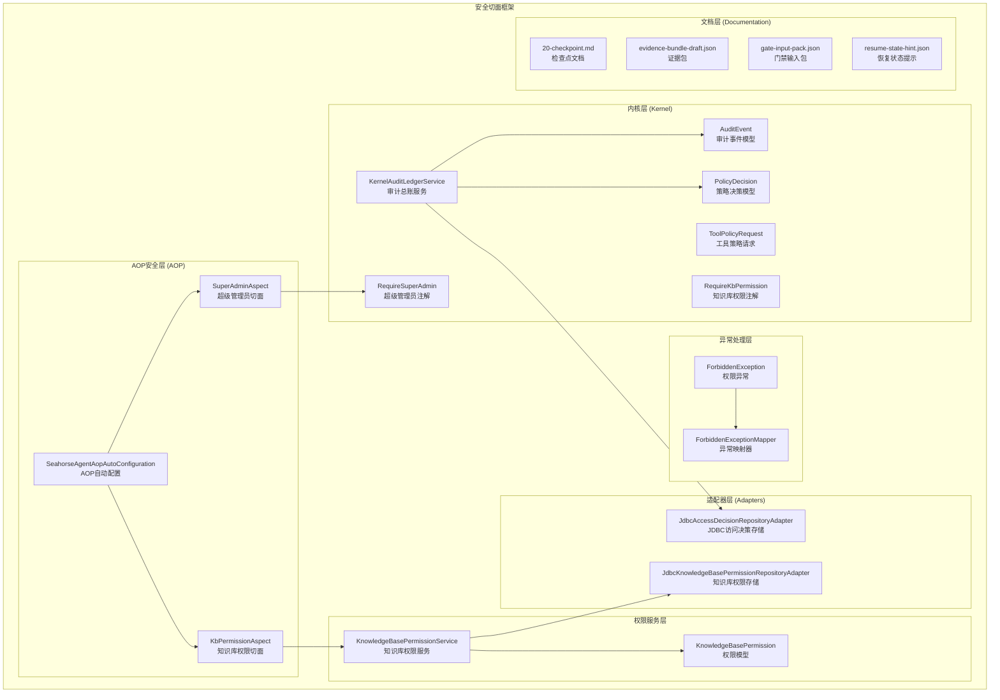
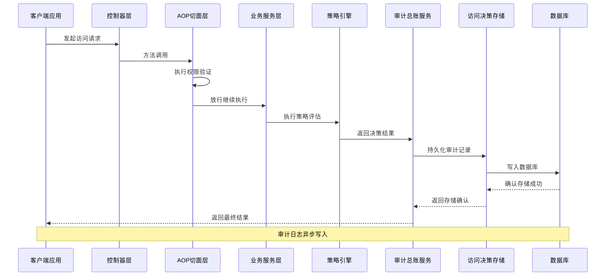
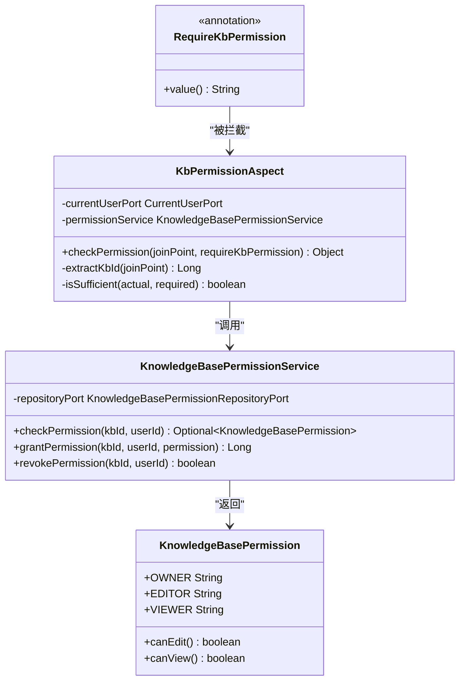
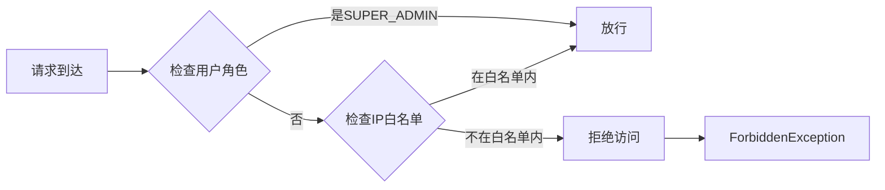
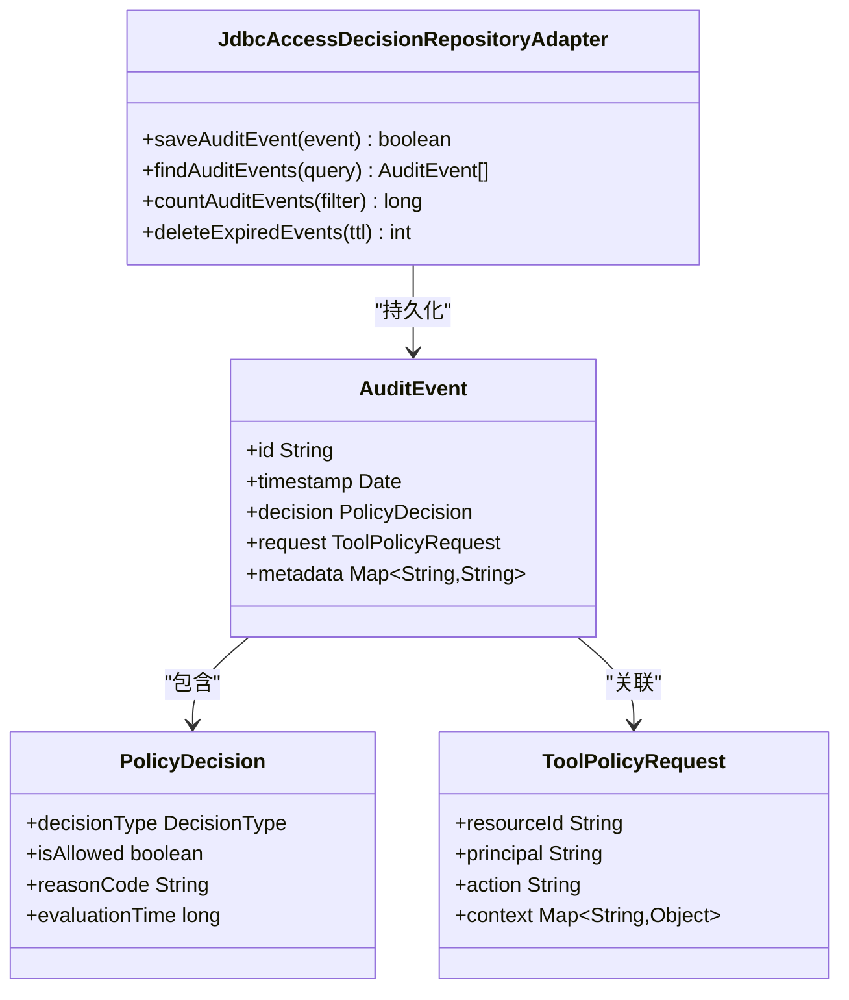
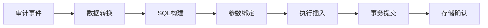
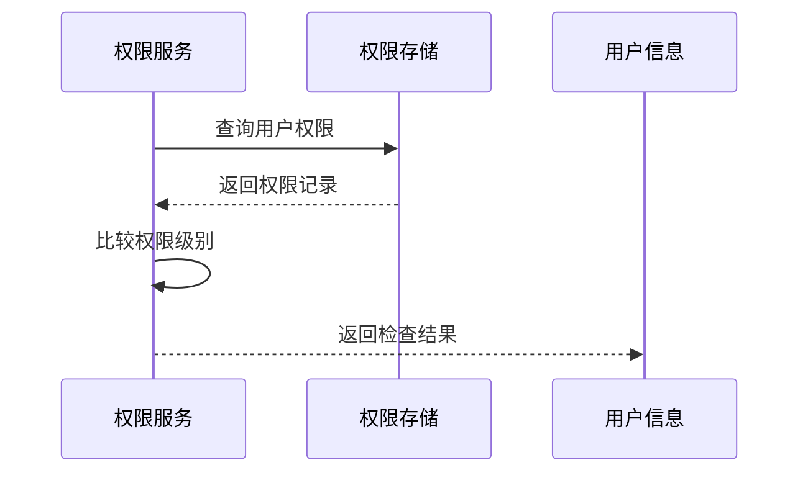
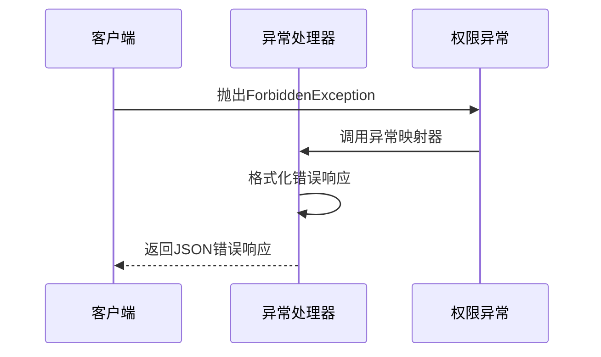
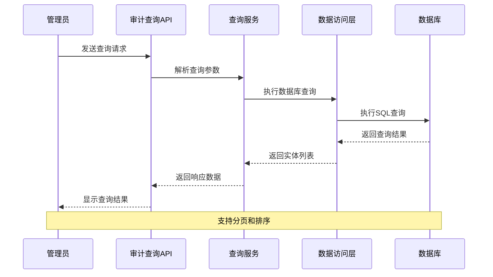
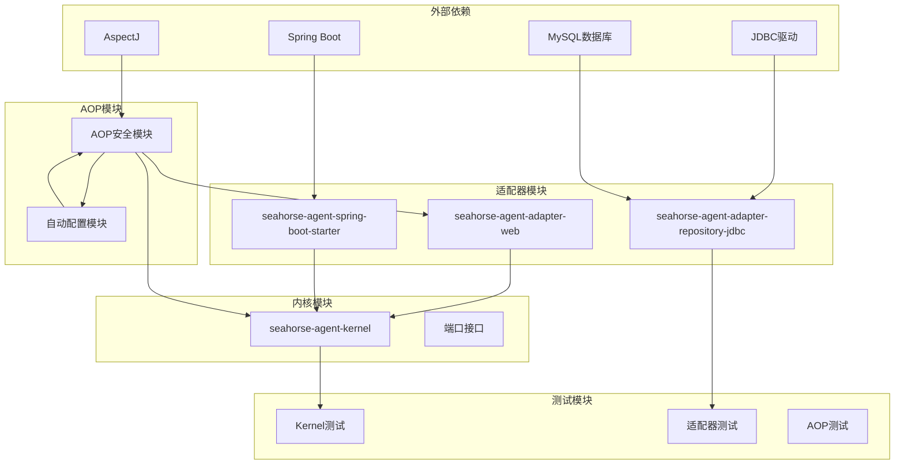

# 安全切面框架

<cite>
**本文档引用的文件**
- [KernelAuditLedgerService.java](file://seahorse-agent-kernel/src/main/java/com/miracle/ai/seahorse/agent/kernel/application/agent/audit/KernelAuditLedgerService.java)
- [AuditEvent.java](file://seahorse-agent-kernel/src/main/java/com/miracle/ai/seahorse/agent/kernel/domain/agent/audit/AuditEvent.java)
- [PolicyDecision.java](file://seahorse-agent-kernel/src/main/java/com/miracle/ai/seahorse/agent/kernel/domain/agent/policy/PolicyDecision.java)
- [ToolPolicyRequest.java](file://seahorse-agent-kernel/src/main/java/com/miracle/ai/seahorse/agent/kernel/domain/agent/policy/ToolPolicyRequest.java)
- [JdbcAccessDecisionRepositoryAdapter.java](file://seahorse-agent-adapter-repository-jdbc/src/main/java/com/miracle/ai/seahorse/agent/adapters/repository/jdbc/JdbcAccessDecisionRepositoryAdapter.java)
- [RequireKbPermission.java](file://seahorse-agent-kernel/src/main/java/com/miracle/ai/seahorse/agent/kernel/application/knowledge/RequireKbPermission.java)
- [KbPermissionAspect.java](file://seahorse-agent-adapter-web/src/main/java/com/miracle/ai/seahorse/agent/adapters/web/KbPermissionAspect.java)
- [RequireSuperAdmin.java](file://seahorse-agent-kernel/src/main/java/com/miracle/ai/seahorse/agent/kernel/application/admin/RequireSuperAdmin.java)
- [SuperAdminAspect.java](file://seahorse-agent-adapter-web/src/main/java/com/miracle/ai/seahorse/agent/adapters/web/SuperAdminAspect.java)
- [SeahorseAgentAopAutoConfiguration.java](file://seahorse-agent-spring-boot-starter/src/main/java/com/miracle/ai/seahorse/agent/adapters/spring/SeahorseAgentAopAutoConfiguration.java)
- [KnowledgeBasePermissionService.java](file://seahorse-agent-kernel/src/main/java/com/miracle/ai/seahorse/agent/kernel/application/knowledge/KnowledgeBasePermissionService.java)
- [JdbcKnowledgeBasePermissionRepositoryAdapter.java](file://seahorse-agent-adapter-repository-jdbc/src/main/java/com/miracle/ai/seahorse/agent/adapters/repository/jdbc/JdbcKnowledgeBasePermissionRepositoryAdapter.java)
- [KnowledgeBasePermission.java](file://seahorse-agent-kernel/src/main/java/com/miracle/ai/seahorse/agent/kernel/domain/knowledge/KnowledgeBasePermission.java)
- [ForbiddenException.java](file://seahorse-agent-kernel/src/main/java/com/miracle/ai/seahorse/agent/kernel/exception/ForbiddenException.java)
- [ForbiddenExceptionMapper.java](file://seahorse-agent-adapter-web/src/main/java/com/miracle/ai/seahorse/agent/adapters/web/ForbiddenExceptionMapper.java)
- [20-checkpoint.md](file://docs/aegis/work/2026-05-25-ai-infra-access-decision-audit/20-checkpoint.md)
- [evidence-bundle-draft-focused-regression.json](file://docs/aegis/work/2026-05-25-ai-infra-access-decision-audit/evidence-bundle-draft-focused-regression.json)
- [gate-input-pack.json](file://docs/aegis/work/2026-05-25-ai-infra-access-decision-audit/gate-input-pack.json)
- [resume-state-hint.json](file://docs/aegis/work/2026-05-25-ai-infra-access-decision-audit/resume-state-hint.json)
- [20-unfinished-phase-implementation-pack.md](file://docs/company-agent/ai-infra-phases/20-unfinished-phase-implementation-pack.md)
</cite>

## 更新摘要
**所做更改**
- 新增AOP安全机制章节，详细介绍@RequireKbPermission注解和KbPermissionAspect权限验证
- 新增超级管理员权限控制章节，介绍@RequireSuperAdmin注解和SuperAdminAspect IP白名单控制
- 更新架构概览，包含新的AOP安全组件
- 新增Spring Boot自动配置机制说明
- 更新异常处理和错误映射机制

## 目录
1. [简介](#简介)
2. [项目结构](#项目结构)
3. [核心组件](#核心组件)
4. [架构概览](#架构概览)
5. [AOP安全机制](#aop安全机制)
6. [详细组件分析](#详细组件分析)
7. [依赖关系分析](#依赖关系分析)
8. [性能考虑](#性能考虑)
9. [故障排除指南](#故障排除指南)
10. [结论](#结论)

## 简介

安全切面框架是 Seahorse Agent 人工智能基础设施中的核心安全组件，负责提供统一的访问控制决策审计和查询功能。该框架实现了基于策略的访问控制机制，通过审计日志记录所有访问决策，并提供查询接口供管理员和系统监控使用。

**更新** 新增AOP安全机制，包括@RequireKbPermission注解和KbPermissionAspect权限验证，以及@RequireSuperAdmin注解和SuperAdminAspect IP白名单控制，为系统提供多层次的安全防护。

框架采用分层架构设计，包含内核服务层、策略决策层、审计记录层、适配器层和AOP安全层，确保了系统的可扩展性和可维护性。通过 Spring Boot 自动配置机制，框架能够无缝集成到现有的微服务架构中。

## 项目结构

安全切面框架在项目中的组织结构如下：



**图表来源**
- [KernelAuditLedgerService.java:1-200](file://seahorse-agent-kernel/src/main/java/com/miracle/ai/seahorse/agent/kernel/application/agent/audit/KernelAuditLedgerService.java#L1-L200)
- [RequireKbPermission.java:1-41](file://seahorse-agent-kernel/src/main/java/com/miracle/ai/seahorse/agent/kernel/application/knowledge/RequireKbPermission.java#L1-L41)
- [KbPermissionAspect.java:1-150](file://seahorse-agent-adapter-web/src/main/java/com/miracle/ai/seahorse/agent/adapters/web/KbPermissionAspect.java#L1-150)
- [RequireSuperAdmin.java:1-36](file://seahorse-agent-kernel/src/main/java/com/miracle/ai/seahorse/agent/kernel/application/admin/RequireSuperAdmin.java#L1-L36)
- [SuperAdminAspect.java:1-120](file://seahorse-agent-adapter-web/src/main/java/com/miracle/ai/seahorse/agent/adapters/web/SuperAdminAspect.java#L1-120)
- [SeahorseAgentAopAutoConfiguration.java:56-85](file://seahorse-agent-spring-boot-starter/src/main/java/com/miracle/ai/seahorse/agent/adapters/spring/SeahorseAgentAopAutoConfiguration.java#L56-L85)

**章节来源**
- [KernelAuditLedgerService.java:1-200](file://seahorse-agent-kernel/src/main/java/com/miracle/ai/seahorse/agent/kernel/application/agent/audit/KernelAuditLedgerService.java#L1-L200)
- [20-checkpoint.md:1-28](file://docs/aegis/work/2026-05-25-ai-infra-access-decision-audit/20-checkpoint.md#L1-L28)

## 核心组件

### 审计总账服务 (KernelAuditLedgerService)

审计总账服务是安全切面框架的核心组件，负责协调整个审计流程。该服务提供了统一的接口来处理访问决策审计，包括决策记录、事件生成和存储管理。

主要功能特性：
- 统一的审计接口定义
- 决策结果的持久化存储
- 审计事件的生命周期管理
- 与策略引擎的集成接口

### 审计事件模型 (AuditEvent)

审计事件模型定义了所有审计操作的数据结构和属性。该模型包含了访问决策的所有相关信息，用于后续的查询和分析。

关键属性包括：
- 事件标识符和时间戳
- 访问主体和资源信息
- 决策结果和原因代码
- 审计元数据和上下文信息

### 策略决策模型 (PolicyDecision)

策略决策模型封装了访问控制决策的完整信息。该模型不仅包含最终的决策结果，还包括决策过程中的中间状态和评估依据。

决策要素：
- 决策类型和状态
- 评估参数和权重
- 决策算法和规则
- 失败处理策略

### AOP安全注解

**新增** AOP安全注解为系统提供了声明式的安全控制机制。

#### @RequireKbPermission 注解
用于标注需要知识库权限验证的方法，支持OWNER、EDITOR、VIEWER三种权限级别。

#### @RequireSuperAdmin 注解  
用于标注需要超级管理员权限的方法，提供基于角色和IP白名单的双重验证。

**章节来源**
- [KernelAuditLedgerService.java:1-200](file://seahorse-agent-kernel/src/main/java/com/miracle/ai/seahorse/agent/kernel/application/agent/audit/KernelAuditLedgerService.java#L1-L200)
- [AuditEvent.java:1-150](file://seahorse-agent-kernel/src/main/java/com/miracle/ai/seahorse/agent/kernel/domain/agent/audit/AuditEvent.java#L1-L150)
- [PolicyDecision.java:1-120](file://seahorse-agent-kernel/src/main/java/com/miracle/ai/seahorse/agent/kernel/domain/agent/policy/PolicyDecision.java#L1-L120)
- [RequireKbPermission.java:26-41](file://seahorse-agent-kernel/src/main/java/com/miracle/ai/seahorse/agent/kernel/application/knowledge/RequireKbPermission.java#L26-L41)
- [RequireSuperAdmin.java:26-36](file://seahorse-agent-kernel/src/main/java/com/miracle/ai/seahorse/agent/kernel/application/admin/RequireSuperAdmin.java#L26-L36)

## 架构概览

安全切面框架采用了分层架构设计，确保了各组件之间的松耦合和高内聚。



**图表来源**
- [KernelAuditLedgerService.java:1-200](file://seahorse-agent-kernel/src/main/java/com/miracle/ai/seahorse/agent/kernel/application/agent/audit/KernelAuditLedgerService.java#L1-L200)
- [KbPermissionAspect.java:57-85](file://seahorse-agent-adapter-web/src/main/java/com/miracle/ai/seahorse/agent/adapters/web/KbPermissionAspect.java#L57-L85)
- [SuperAdminAspect.java:59-82](file://seahorse-agent-adapter-web/src/main/java/com/miracle/ai/seahorse/agent/adapters/web/SuperAdminAspect.java#L59-L82)
- [JdbcAccessDecisionRepositoryAdapter.java:1-200](file://seahorse-agent-adapter-repository-jdbc/src/main/java/com/miracle/ai/seahorse/agent/adapters/repository/jdbc/JdbcAccessDecisionRepositoryAdapter.java#L1-L200)

### 数据流架构

```mermaid
flowchart TD
A[访问请求) --> B[控制器]
B --> C{AOP权限验证}
C --> |知识库权限| D[KbPermissionAspect]
C --> |超级管理员| E[SuperAdminAspect]
D --> F{权限检查}
F --> |通过| G[业务服务]
F --> |拒绝| H[ForbiddenException]
E --> I{角色/IP验证}
I --> |通过| G
I --> |拒绝| H
G --> J[业务逻辑执行]
J --> K[审计日志记录]
K --> L[数据库存储]
```

**图表来源**
- [KbPermissionAspect.java:57-119](file://seahorse-agent-adapter-web/src/main/java/com/miracle/ai/seahorse/agent/adapters/web/KbPermissionAspect.java#L57-L119)
- [SuperAdminAspect.java:59-98](file://seahorse-agent-adapter-web/src/main/java/com/miracle/ai/seahorse/agent/adapters/web/SuperAdminAspect.java#L59-L98)
- [AuditEvent.java:1-150](file://seahorse-agent-kernel/src/main/java/com/miracle/ai/seahorse/agent/kernel/domain/agent/audit/AuditEvent.java#L1-L150)

## AOP安全机制

**新增** AOP安全机制是系统安全防护的核心组件，通过注解驱动的方式实现声明式权限控制。

### @RequireKbPermission 知识库权限注解

@RequireKbPermission注解提供了基于知识库的细粒度权限控制，支持以下权限级别：

- **OWNER**: 拥有者权限，具备最高权限
- **EDITOR**: 编辑者权限，可以修改知识库内容
- **VIEWER**: 查看者权限，仅能查看内容



**图表来源**
- [RequireKbPermission.java:32-41](file://seahorse-agent-kernel/src/main/java/com/miracle/ai/seahorse/agent/kernel/application/knowledge/RequireKbPermission.java#L32-L41)
- [KbPermissionAspect.java:43-85](file://seahorse-agent-adapter-web/src/main/java/com/miracle/ai/seahorse/agent/adapters/web/KbPermissionAspect.java#L43-L85)
- [KnowledgeBasePermissionService.java:32-64](file://seahorse-agent-kernel/src/main/java/com/miracle/ai/seahorse/agent/kernel/application/knowledge/KnowledgeBasePermissionService.java#L32-L64)
- [KnowledgeBasePermission.java:40-66](file://seahorse-agent-kernel/src/main/java/com/miracle/ai/seahorse/agent/kernel/domain/knowledge/KnowledgeBasePermission.java#L40-L66)

### @RequireSuperAdmin 超级管理员注解

@RequireSuperAdmin注解提供了超级管理员级别的安全控制，采用双重验证机制：

1. **基于角色的验证**: 检查当前用户是否具有SUPER_ADMIN角色
2. **基于IP白名单的验证**: 检查请求来源IP是否在允许列表中



**图表来源**
- [RequireSuperAdmin.java:32-36](file://seahorse-agent-kernel/src/main/java/com/miracle/ai/seahorse/agent/kernel/application/admin/RequireSuperAdmin.java#L32-L36)
- [SuperAdminAspect.java:45-82](file://seahorse-agent-adapter-web/src/main/java/com/miracle/ai/seahorse/agent/adapters/web/SuperAdminAspect.java#L45-L82)

### Spring Boot自动配置

SeahorseAgentAopAutoConfiguration提供了智能的AOP组件自动配置：

- **条件装配**: 仅在存在必要依赖时创建切面Bean
- **默认实现**: 提供默认的AOP切面实现
- **配置注入**: 支持通过配置文件注入IP白名单等参数

**章节来源**
- [RequireKbPermission.java:26-41](file://seahorse-agent-kernel/src/main/java/com/miracle/ai/seahorse/agent/kernel/application/knowledge/RequireKbPermission.java#L26-L41)
- [KbPermissionAspect.java:37-85](file://seahorse-agent-adapter-web/src/main/java/com/miracle/ai/seahorse/agent/adapters/web/KbPermissionAspect.java#L37-L85)
- [RequireSuperAdmin.java:26-36](file://seahorse-agent-kernel/src/main/java/com/miracle/ai/seahorse/agent/kernel/application/admin/RequireSuperAdmin.java#L26-L36)
- [SuperAdminAspect.java:36-82](file://seahorse-agent-adapter-web/src/main/java/com/miracle/ai/seahorse/agent/adapters/web/SuperAdminAspect.java#L36-L82)
- [SeahorseAgentAopAutoConfiguration.java:56-85](file://seahorse-agent-spring-boot-starter/src/main/java/com/miracle/ai/seahorse/agent/adapters/spring/SeahorseAgentAopAutoConfiguration.java#L56-L85)

## 详细组件分析

### JDBC访问决策存储适配器

JDBC访问决策存储适配器是连接审计框架与数据库的关键组件，负责将审计事件持久化到关系型数据库中。

#### 类关系图



**图表来源**
- [JdbcAccessDecisionRepositoryAdapter.java:1-200](file://seahorse-agent-adapter-repository-jdbc/src/main/java/com/miracle/ai/seahorse/agent/adapters/repository/jdbc/JdbcAccessDecisionRepositoryAdapter.java#L1-L200)
- [AuditEvent.java:1-150](file://seahorse-agent-kernel/src/main/java/com/miracle/ai/seahorse/agent/kernel/domain/agent/audit/AuditEvent.java#L1-L150)
- [PolicyDecision.java:1-120](file://seahorse-agent-kernel/src/main/java/com/miracle/ai/seahorse/agent/kernel/domain/agent/policy/PolicyDecision.java#L1-L120)
- [ToolPolicyRequest.java:1-120](file://seahorse-agent-kernel/src/main/java/com/miracle/ai/seahorse/agent/kernel/domain/agent/policy/ToolPolicyRequest.java#L1-L120)

#### 存储流程



**图表来源**
- [JdbcAccessDecisionRepositoryAdapter.java:1-200](file://seahorse-agent-adapter-repository-jdbc/src/main/java/com/miracle/ai/seahorse/agent/adapters/repository/jdbc/JdbcAccessDecisionRepositoryAdapter.java#L1-L200)

**章节来源**
- [JdbcAccessDecisionRepositoryAdapter.java:1-200](file://seahorse-agent-adapter-repository-jdbc/src/main/java/com/miracle/ai/seahorse/agent/adapters/repository/jdbc/JdbcAccessDecisionRepositoryAdapter.java#L1-L200)

### 知识库权限服务

**新增** 知识库权限服务提供了完整的权限管理功能，包括权限检查、授予权限和撤销权限。

#### 权限检查流程



**图表来源**
- [KnowledgeBasePermissionService.java:32-64](file://seahorse-agent-kernel/src/main/java/com/miracle/ai/seahorse/agent/kernel/application/knowledge/KnowledgeBasePermissionService.java#L32-L64)
- [JdbcKnowledgeBasePermissionRepositoryAdapter.java:86-96](file://seahorse-agent-adapter-repository-jdbc/src/main/java/com/miracle/ai/seahorse/agent/adapters/repository/jdbc/JdbcKnowledgeBasePermissionRepositoryAdapter.java#L86-L96)

#### 权限模型

知识库权限采用三层权限模型：
- **OWNER**: 拥有者，具备所有权限
- **EDITOR**: 编辑者，可以编辑内容但不能管理权限
- **VIEWER**: 查看者，只能查看内容

**章节来源**
- [KnowledgeBasePermissionService.java:32-64](file://seahorse-agent-kernel/src/main/java/com/miracle/ai/seahorse/agent/kernel/application/knowledge/KnowledgeBasePermissionService.java#L32-L64)
- [JdbcKnowledgeBasePermissionRepositoryAdapter.java:34-127](file://seahorse-agent-adapter-repository-jdbc/src/main/java/com/miracle/ai/seahorse/agent/adapters/repository/jdbc/JdbcKnowledgeBasePermissionRepositoryAdapter.java#L34-L127)
- [KnowledgeBasePermission.java:40-66](file://seahorse-agent-kernel/src/main/java/com/miracle/ai/seahorse/agent/kernel/domain/knowledge/KnowledgeBasePermission.java#L40-L66)

### 异常处理机制

**更新** 新增了专门的权限异常处理机制，提供统一的错误响应格式。

#### 异常映射流程



**图表来源**
- [ForbiddenException.java:23-45](file://seahorse-agent-kernel/src/main/java/com/miracle/ai/seahorse/agent/kernel/exception/ForbiddenException.java#L23-L45)
- [ForbiddenExceptionMapper.java:34-55](file://seahorse-agent-adapter-web/src/main/java/com/miracle/ai/seahorse/agent/adapters/web/ForbiddenExceptionMapper.java#L34-55)

**章节来源**
- [ForbiddenException.java:23-45](file://seahorse-agent-kernel/src/main/java/com/miracle/ai/seahorse/agent/kernel/exception/ForbiddenException.java#L23-L45)
- [ForbiddenExceptionMapper.java:34-55](file://seahorse-agent-adapter-web/src/main/java/com/miracle/ai/seahorse/agent/adapters/web/ForbiddenExceptionMapper.java#L34-55)

### 审计查询接口

框架提供了完整的审计查询接口，支持多种查询条件和过滤选项。

#### 查询接口序列图



**图表来源**
- [KernelAuditLedgerService.java:1-200](file://seahorse-agent-kernel/src/main/java/com/miracle/ai/seahorse/agent/kernel/application/agent/audit/KernelAuditLedgerService.java#L1-L200)
- [AuditEvent.java:1-150](file://seahorse-agent-kernel/src/main/java/com/miracle/ai/seahorse/agent/kernel/domain/agent/audit/AuditEvent.java#L1-L150)

**章节来源**
- [KernelAuditLedgerService.java:1-200](file://seahorse-agent-kernel/src/main/java/com/miracle/ai/seahorse/agent/kernel/application/agent/audit/KernelAuditLedgerService.java#L1-L200)

## 依赖关系分析

安全切面框架的依赖关系体现了清晰的分层架构和模块化设计。



**图表来源**
- [20-unfinished-phase-implementation-pack.md:173-191](file://docs/company-agent/ai-infra-phases/20-unfinished-phase-implementation-pack.md#L173-L191)
- [gate-input-pack.json:1-12](file://docs/aegis/work/2026-05-25-ai-infra-access-decision-audit/gate-input-pack.json#L1-L12)

### 关键依赖特性

1. **Spring Boot自动配置**: 通过标准的Spring Boot自动配置机制，简化了框架的集成和部署
2. **AOP切面支持**: 集成了AspectJ框架，提供声明式安全控制
3. **端口-适配器模式**: 内核保持纯净的领域逻辑，通过端口接口与外部系统解耦
4. **多数据库支持**: JDBC适配器提供了对多种关系型数据库的统一支持
5. **异常处理集成**: 统一的异常处理机制，提供标准化的错误响应

**章节来源**
- [20-unfinished-phase-implementation-pack.md:173-191](file://docs/company-agent/ai-infra-phases/20-unfinished-phase-implementation-pack.md#L173-L191)
- [resume-state-hint.json:1-17](file://docs/aegis/work/2026-05-25-ai-infra-access-decision-audit/resume-state-hint.json#L1-L17)

## 性能考虑

安全切面框架在设计时充分考虑了性能优化和可扩展性要求。

### 性能优化策略

1. **异步审计写入**: 审计日志采用异步方式写入数据库，避免阻塞主业务流程
2. **批量操作支持**: 提供批量审计事件处理能力，减少数据库交互次数
3. **索引优化**: 在审计表上建立适当的索引，提高查询性能
4. **连接池管理**: 使用连接池管理数据库连接，提高资源利用率
5. **缓存策略**: 对频繁查询的权限信息进行缓存，减少数据库压力
6. **AOP切面优化**: 通过条件装配避免不必要的切面创建

### 扩展性设计

1. **插件化架构**: 支持自定义审计存储后端，如NoSQL数据库或消息队列
2. **水平扩展**: 通过分布式锁和消息队列支持多实例部署
3. **权限服务扩展**: 支持自定义权限存储后端
4. **异常处理扩展**: 支持自定义异常映射器
5. **配置驱动**: 通过配置文件支持灵活的参数配置

## 故障排除指南

### 常见问题及解决方案

#### 审计数据丢失

**问题描述**: 审计事件在某些情况下可能丢失

**可能原因**:
- 数据库连接异常
- 事务提交失败
- 系统崩溃

**解决步骤**:
1. 检查数据库连接状态
2. 验证事务配置
3. 查看系统日志
4. 实施重试机制

#### 查询性能问题

**问题描述**: 审计查询响应时间过长

**可能原因**:
- 缺少必要的索引
- 查询条件过于复杂
- 数据量过大

**解决步骤**:
1. 分析查询执行计划
2. 添加适当的索引
3. 优化查询条件
4. 实施分页查询

#### 权限验证失败

**新增** **问题描述**: @RequireKbPermission或@RequireSuperAdmin注解导致权限验证失败

**可能原因**:
- 用户权限不足
- IP白名单配置错误
- 知识库ID提取失败
- 当前用户信息获取失败

**解决步骤**:
1. 检查用户角色和权限级别
2. 验证IP白名单配置
3. 确认知识库ID参数传递
4. 检查当前用户上下文
5. 查看AOP切面日志

#### 集成问题

**问题描述**: 框架无法正确集成到现有系统

**可能原因**:
- Spring Boot版本不兼容
- 配置文件错误
- 依赖冲突
- AOP切面未生效

**解决步骤**:
1. 检查Spring Boot版本
2. 验证配置文件
3. 解决依赖冲突
4. 运行集成测试
5. 检查AOP自动配置

#### 异常处理问题

**新增** **问题描述**: 权限异常未正确映射为HTTP响应

**可能原因**:
- 异常映射器未注册
- 错误的异常类型
- 响应格式配置错误

**解决步骤**:
1. 检查异常映射器配置
2. 验证异常类型匹配
3. 确认响应格式设置
4. 查看异常处理日志

**章节来源**
- [evidence-bundle-draft-focused-regression.json:1-8](file://docs/aegis/work/2026-05-25-ai-infra-access-decision-audit/evidence-bundle-draft-focused-regression.json#L1-L8)

## 结论

安全切面框架为 Seahorse Agent 提供了强大而灵活的访问控制和审计能力。通过采用分层架构和端口-适配器模式，框架实现了高度的模块化和可扩展性。

**更新** 新增的AOP安全机制进一步增强了系统的安全性，提供了声明式的权限控制能力。@RequireKbPermission注解实现了基于知识库的细粒度权限管理，而@RequireSuperAdmin注解则提供了基于角色和IP白名单的双重安全验证。

### 主要优势

1. **统一的审计接口**: 提供一致的审计体验，简化了系统的安全集成
2. **灵活的存储后端**: 支持多种数据库和存储方案，适应不同的部署需求
3. **声明式安全控制**: 通过注解实现声明式权限控制，简化了安全代码编写
4. **多层次安全防护**: 结合AOP切面和传统审计机制，提供全面的安全保护
5. **完善的测试覆盖**: 全面的测试套件确保了代码质量和系统稳定性
6. **易于扩展**: 清晰的架构设计使得新功能的添加变得简单直接

### 未来发展方向

1. **增强的查询能力**: 计划增加更复杂的查询条件和分析功能
2. **实时监控**: 集成实时监控和告警机制
3. **高级分析**: 提供更深入的审计数据分析和可视化
4. **合规支持**: 增强对各种合规标准的支持
5. **动态权限管理**: 支持基于策略的动态权限分配
6. **多租户安全**: 增强多租户环境下的安全隔离能力

该框架为构建安全可靠的AI基础设施奠定了坚实的基础，是 Seahorse Agent 生态系统中不可或缺的重要组成部分。新增的AOP安全机制使其在保证功能完整性的同时，提供了更加灵活和强大的安全控制能力。