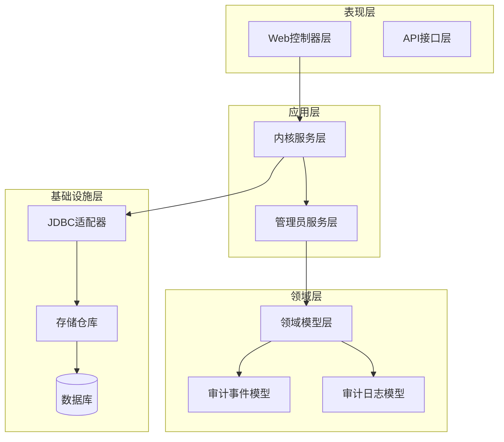
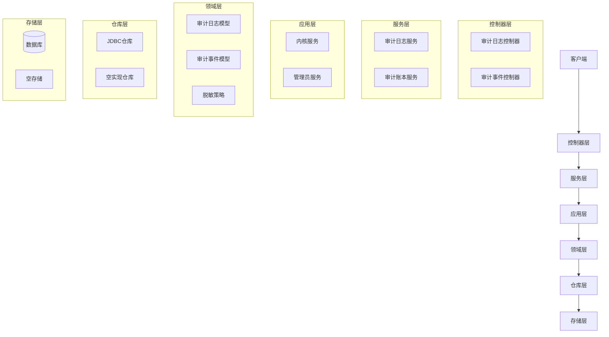
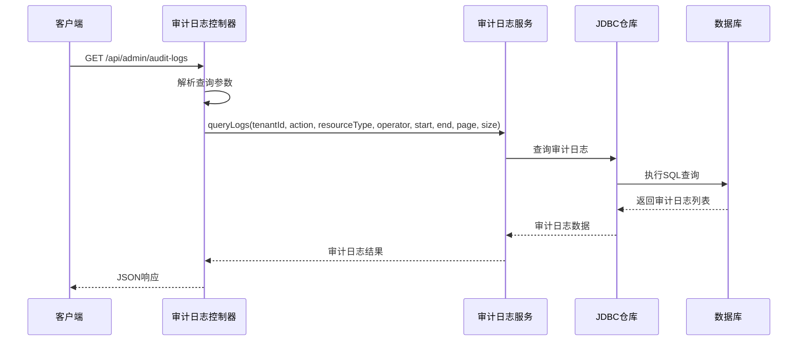
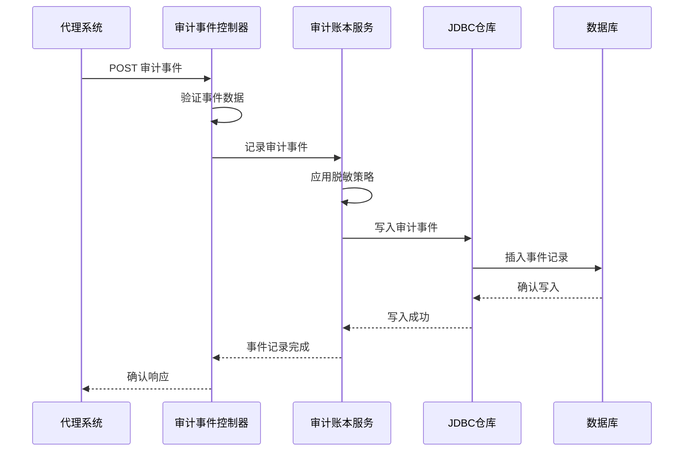
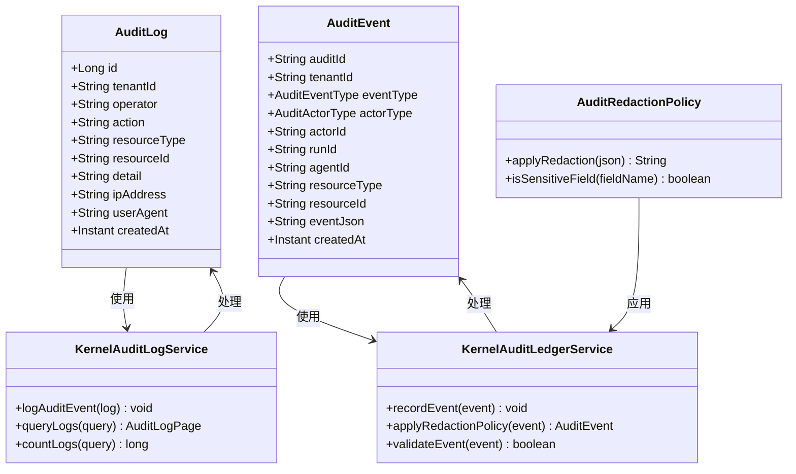
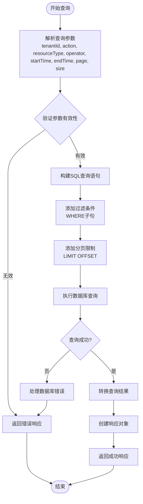
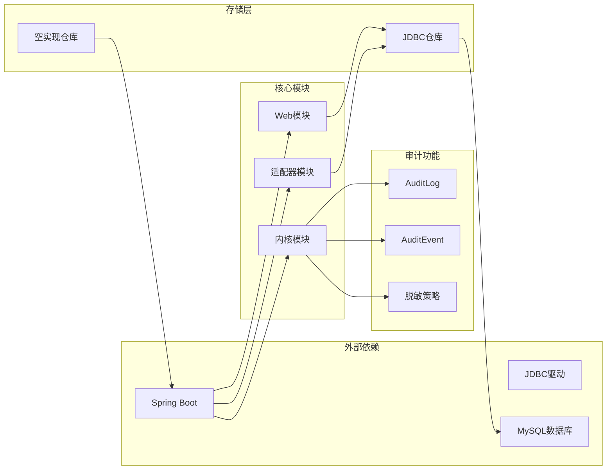

# 审计日志系统

<cite>
**本文档引用的文件**
- [AuditLog.java](file://seahorse-agent-kernel/src/main/java/com/miracle/ai/seahorse/agent/kernel/domain/audit/AuditLog.java)
- [KernelAuditLogService.java](file://seahorse-agent-kernel/src/main/java/com/miracle/ai/seahorse/agent/kernel/application/admin/KernelAuditLogService.java)
- [JdbcAuditLogRepositoryAdapter.java](file://seahorse-agent-adapter-repository-jdbc/src/main/java/com/miracle/ai/seahorse/agent/adapters/repository/jdbc/JdbcAuditLogRepositoryAdapter.java)
- [SeahorseAuditLogController.java](file://seahorse-agent-adapter-web/src/main/java/com/miracle/ai/seahorse/agent/adapters/web/SeahorseAuditLogController.java)
- [AuditEvent.java](file://seahorse-agent-kernel/src/main/java/com/miracle/ai/seahorse/agent/kernel/domain/agent/audit/AuditEvent.java)
- [AuditEventType.java](file://seahorse-agent-kernel/src/main/java/com/miracle/ai/seahorse/agent/kernel/domain/agent/audit/AuditEventType.java)
- [AuditActorType.java](file://seahorse-agent-kernel/src/main/java/com/miracle/ai/seahorse/agent/kernel/domain/agent/audit/AuditActorType.java)
- [AuditRedactionPolicy.java](file://seahorse-agent-kernel/src/main/java/com/miracle/ai/seahorse/agent/kernel/domain/agent/audit/AuditRedactionPolicy.java)
- [KernelAuditLedgerService.java](file://seahorse-agent-kernel/src/main/java/com/miracle/ai/seahorse/agent/kernel/application/agent/audit/KernelAuditLedgerService.java)
- [JdbcAuditEventRepositoryAdapter.java](file://seahorse-agent-adapter-repository-jdbc/src/main/java/com/miracle/ai/seahorse/agent/adapters/repository/jdbc/JdbcAuditEventRepositoryAdapter.java)
- [SeahorseAuditEventController.java](file://seahorse-agent-adapter-web/src/main/java/com/miracle/ai/seahorse/agent/adapters/web/SeahorseAuditEventController.java)
- [09-unfinished-phase-design-development-plans.md](file://docs/company-agent/ai-infra-phases/09-unfinished-phase-design-development-plans.md)
</cite>

## 目录
1. [简介](#简介)
2. [项目结构](#项目结构)
3. [核心组件](#核心组件)
4. [架构概览](#架构概览)
5. [详细组件分析](#详细组件分析)
6. [依赖关系分析](#依赖关系分析)
7. [性能考虑](#性能考虑)
8. [故障排除指南](#故障排除指南)
9. [结论](#结论)

## 简介

审计日志系统是海星代理（Seahorse Agent）平台的重要组成部分，负责记录和管理所有关键操作的审计信息。该系统提供了两种主要的审计能力：

1. **系统级审计日志**：记录平台级别的操作行为，如用户登录、权限变更、系统配置修改等
2. **代理运行审计事件**：记录代理执行过程中的关键事件，如工具调用、访问决策、审批流程等

系统采用分层架构设计，确保审计数据的完整性、可追溯性和合规性。所有审计数据都遵循严格的脱敏策略，保护敏感信息的安全。

## 项目结构

审计日志系统分布在多个模块中，形成了清晰的分层架构：

**图表来源**
- [AuditLog.java:1-200](file://seahorse-agent-kernel/src/main/java/com/miracle/ai/seahorse/agent/kernel/domain/audit/AuditLog.java#L1-L200)
- [KernelAuditLogService.java:1-200](file://seahorse-agent-kernel/src/main/java/com/miracle/ai/seahorse/agent/kernel/application/admin/KernelAuditLogService.java#L1-L200)
- [JdbcAuditLogRepositoryAdapter.java:1-200](file://seahorse-agent-adapter-repository-jdbc/src/main/java/com/miracle/ai/seahorse/agent/adapters/repository/jdbc/JdbcAuditLogRepositoryAdapter.java#L1-L200)

**章节来源**
- [AuditLog.java:1-200](file://seahorse-agent-kernel/src/main/java/com/miracle/ai/seahorse/agent/kernel/domain/audit/AuditLog.java#L1-L200)
- [KernelAuditLogService.java:1-200](file://seahorse-agent-kernel/src/main/java/com/miracle/ai/seahorse/agent/kernel/application/admin/KernelAuditLogService.java#L1-L200)

## 核心组件

### 审计日志模型

审计日志模型定义了系统级审计的核心数据结构：

- **AuditLog实体**：包含操作者、操作类型、资源信息、IP地址、用户代理等完整审计信息
- **租户隔离**：每个审计日志都关联特定的租户标识，确保多租户环境下的数据隔离
- **时间戳管理**：精确记录操作发生的时间，支持审计追踪和合规要求

### 审计事件模型

审计事件模型专注于代理运行过程中的关键事件：

- **事件类型枚举**：定义了9种预定义的审计事件类型，包括代理发布、运行开始/结束、工具调用等
- **参与者类型**：支持USER、AGENT、SYSTEM、REMOTE_AGENT四种参与者类型
- **资源关联**：能够关联具体的资源类型和资源ID，建立完整的事件上下文

### 脱敏策略

系统实现了严格的脱敏机制来保护敏感信息：

- **字段识别**：自动识别包含secret、token、password、apiKey等敏感信息的字段
- **统一脱敏**：使用固定的脱敏标记符替换敏感内容
- **策略配置**：可配置的脱敏策略，支持不同场景下的安全需求

**章节来源**
- [AuditEvent.java:1-200](file://seahorse-agent-kernel/src/main/java/com/miracle/ai/seahorse/agent/kernel/domain/agent/audit/AuditEvent.java#L1-L200)
- [AuditEventType.java:1-200](file://seahorse-agent-kernel/src/main/java/com/miracle/ai/seahorse/agent/kernel/domain/agent/audit/AuditEventType.java#L1-L200)
- [AuditActorType.java:1-200](file://seahorse-agent-kernel/src/main/java/com/miracle/ai/seahorse/agent/kernel/domain/agent/audit/AuditActorType.java#L1-L200)
- [AuditRedactionPolicy.java:1-200](file://seahorse-agent-kernel/src/main/java/com/miracle/ai/seahorse/agent/kernel/domain/agent/audit/AuditRedactionPolicy.java#L1-L200)

## 架构概览

审计日志系统采用经典的分层架构，确保了良好的可维护性和扩展性：

**图表来源**
- [KernelAuditLogService.java:1-200](file://seahorse-agent-kernel/src/main/java/com/miracle/ai/seahorse/agent/kernel/application/admin/KernelAuditLogService.java#L1-L200)
- [KernelAuditLedgerService.java:1-200](file://seahorse-agent-kernel/src/main/java/com/miracle/ai/seahorse/agent/kernel/application/agent/audit/KernelAuditLedgerService.java#L1-L200)
- [JdbcAuditLogRepositoryAdapter.java:1-200](file://seahorse-agent-adapter-repository-jdbc/src/main/java/com/miracle/ai/seahorse/agent/adapters/repository/jdbc/JdbcAuditLogRepositoryAdapter.java#L1-L200)

## 详细组件分析

### 审计日志控制器

审计日志控制器负责处理HTTP请求并返回审计结果：

**图表来源**
- [SeahorseAuditLogController.java:1-200](file://seahorse-agent-adapter-web/src/main/java/com/miracle/ai/seahorse/agent/adapters/web/SeahorseAuditLogController.java#L1-L200)
- [KernelAuditLogService.java:1-200](file://seahorse-agent-kernel/src/main/java/com/miracle/ai/seahorse/agent/kernel/application/admin/KernelAuditLogService.java#L1-L200)

### 审计事件控制器

审计事件控制器处理代理运行过程中的审计事件：

**图表来源**
- [SeahorseAuditEventController.java:1-200](file://seahorse-agent-adapter-web/src/main/java/com/miracle/ai/seahorse/agent/adapters/web/SeahorseAuditEventController.java#L1-L200)
- [KernelAuditLedgerService.java:1-200](file://seahorse-agent-kernel/src/main/java/com/miracle/ai/seahorse/agent/kernel/application/agent/audit/KernelAuditLedgerService.java#L1-L200)

### 数据模型类图

**图表来源**
- [AuditLog.java:1-200](file://seahorse-agent-kernel/src/main/java/com/miracle/ai/seahorse/agent/kernel/domain/audit/AuditLog.java#L1-L200)
- [AuditEvent.java:1-200](file://seahorse-agent-kernel/src/main/java/com/miracle/ai/seahorse/agent/kernel/domain/agent/audit/AuditEvent.java#L1-L200)
- [AuditRedactionPolicy.java:1-200](file://seahorse-agent-kernel/src/main/java/com/miracle/ai/seahorse/agent/kernel/domain/agent/audit/AuditRedactionPolicy.java#L1-L200)
- [KernelAuditLogService.java:1-200](file://seahorse-agent-kernel/src/main/java/com/miracle/ai/seahorse/agent/kernel/application/admin/KernelAuditLogService.java#L1-L200)
- [KernelAuditLedgerService.java:1-200](file://seahorse-agent-kernel/src/main/java/com/miracle/ai/seahorse/agent/kernel/application/agent/audit/KernelAuditLedgerService.java#L1-L200)

**章节来源**
- [SeahorseAuditLogController.java:1-200](file://seahorse-agent-adapter-web/src/main/java/com/miracle/ai/seahorse/agent/adapters/web/SeahorseAuditLogController.java#L1-L200)
- [SeahorseAuditEventController.java:1-200](file://seahorse-agent-adapter-web/src/main/java/com/miracle/ai/seahorse/agent/adapters/web/SeahorseAuditEventController.java#L1-L200)

### 查询流程分析

审计日志查询流程体现了系统的数据一致性保证：

**图表来源**
- [JdbcAuditLogRepositoryAdapter.java:1-200](file://seahorse-agent-adapter-repository-jdbc/src/main/java/com/miracle/ai/seahorse/agent/adapters/repository/jdbc/JdbcAuditLogRepositoryAdapter.java#L1-L200)

**章节来源**
- [JdbcAuditLogRepositoryAdapter.java:1-200](file://seahorse-agent-adapter-repository-jdbc/src/main/java/com/miracle/ai/seahorse/agent/adapters/repository/jdbc/JdbcAuditLogRepositoryAdapter.java#L1-L200)

## 依赖关系分析

审计日志系统的依赖关系展现了清晰的分层架构：

**图表来源**
- [KernelAuditLogService.java:1-200](file://seahorse-agent-kernel/src/main/java/com/miracle/ai/seahorse/agent/kernel/application/admin/KernelAuditLogService.java#L1-L200)
- [KernelAuditLedgerService.java:1-200](file://seahorse-agent-kernel/src/main/java/com/miracle/ai/seahorse/agent/kernel/application/agent/audit/KernelAuditLedgerService.java#L1-L200)
- [JdbcAuditLogRepositoryAdapter.java:1-200](file://seahorse-agent-adapter-repository-jdbc/src/main/java/com/miracle/ai/seahorse/agent/adapters/repository/jdbc/JdbcAuditLogRepositoryAdapter.java#L1-L200)

系统的关键依赖特性：

- **松耦合设计**：各层之间通过接口进行通信，降低模块间的耦合度
- **可替换性**：存储层支持不同的实现（JDBC、空实现），便于测试和部署
- **扩展性**：新的审计功能可以通过添加新的适配器来实现

**章节来源**
- [09-unfinished-phase-design-development-plans.md:1362-1915](file://docs/company-agent/ai-infra-phases/09-unfinished-phase-design-development-plans.md#L1362-L1915)

## 性能考虑

审计日志系统在设计时充分考虑了性能优化：

### 查询性能优化

- **索引策略**：对常用查询字段（如tenantId、createdAt、resourceType）建立适当的数据库索引
- **分页查询**：默认使用分页机制，限制每次查询的数据量
- **查询优化**：通过SQL优化和连接池配置提升查询性能

### 存储性能优化

- **批量写入**：支持批量插入审计数据，减少数据库连接开销
- **异步处理**：审计日志写入采用异步方式，避免阻塞主业务流程
- **缓存策略**：对频繁查询的结果进行缓存，提升响应速度

### 内存管理

- **流式处理**：大数据量查询采用流式处理，避免内存溢出
- **对象复用**：合理使用对象池，减少垃圾回收压力
- **及时释放**：确保数据库连接和资源的及时释放

## 故障排除指南

### 常见问题及解决方案

#### 审计日志查询失败

**问题症状**：查询接口返回错误或超时

**可能原因**：
- 数据库连接异常
- SQL查询语法错误
- 查询参数格式不正确

**解决步骤**：
1. 检查数据库连接配置
2. 验证SQL查询语句
3. 确认查询参数的有效性

#### 审计事件记录失败

**问题症状**：代理运行时审计事件未被正确记录

**可能原因**：
- 审计账本服务配置错误
- 数据库写入权限不足
- 脱敏策略导致数据丢失

**解决步骤**：
1. 检查审计账本服务的配置
2. 验证数据库写入权限
3. 审核脱敏策略设置

#### 性能问题

**问题症状**：审计查询响应缓慢

**可能原因**：
- 缺少必要的数据库索引
- 查询条件过于宽泛
- 数据库负载过高

**解决步骤**：
1. 添加适当的数据库索引
2. 优化查询条件
3. 监控数据库性能指标

**章节来源**
- [KernelAuditLogService.java:1-200](file://seahorse-agent-kernel/src/main/java/com/miracle/ai/seahorse/agent/kernel/application/admin/KernelAuditLogService.java#L1-L200)
- [KernelAuditLedgerService.java:1-200](file://seahorse-agent-kernel/src/main/java/com/miracle/ai/seahorse/agent/kernel/application/agent/audit/KernelAuditLedgerService.java#L1-L200)

## 结论

海星代理的审计日志系统是一个设计精良、功能完善的审计解决方案。系统通过清晰的分层架构、严格的数据脱敏策略和高效的查询机制，为平台提供了全面的审计能力。

### 主要优势

1. **完整的审计覆盖**：同时支持系统级审计日志和代理运行审计事件
2. **严格的安全保障**：实施了多层次的脱敏策略，保护敏感信息安全
3. **良好的性能表现**：通过索引优化、分页查询和异步处理确保高效运行
4. **灵活的扩展性**：模块化的架构设计便于功能扩展和维护

### 发展方向

随着业务的发展，审计日志系统可以在以下方面进一步完善：
- 增强实时审计分析能力
- 扩展更多类型的审计事件
- 优化大数据量场景下的性能表现
- 提供更丰富的审计报表和分析功能

该系统为海星代理平台的合规运营和安全监控奠定了坚实的基础，是整个AI基础设施的重要组成部分。