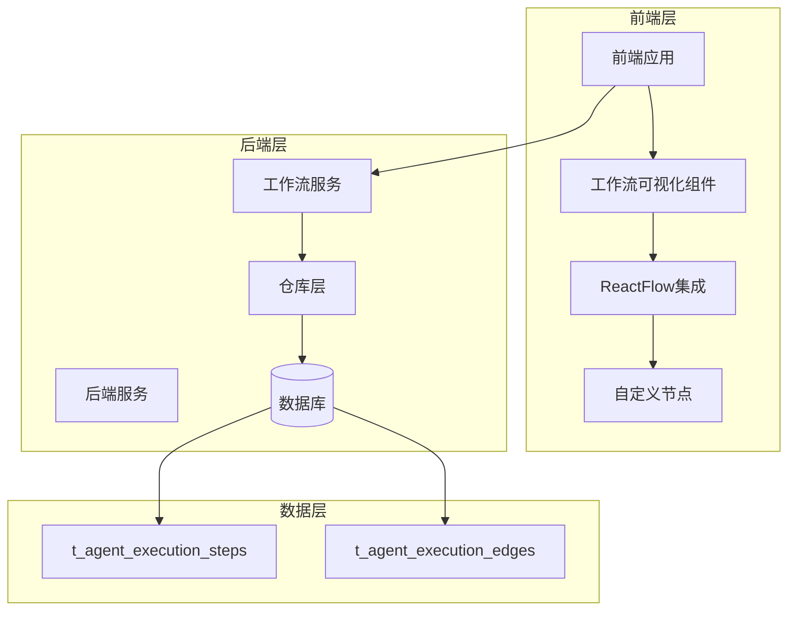
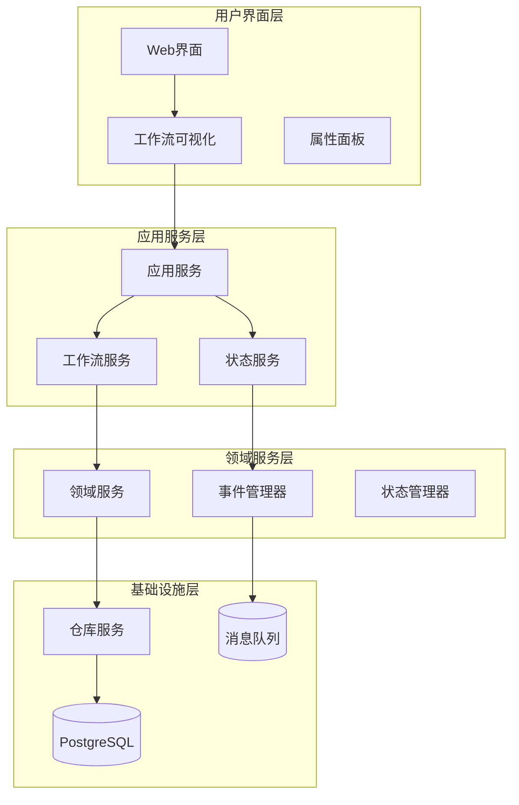
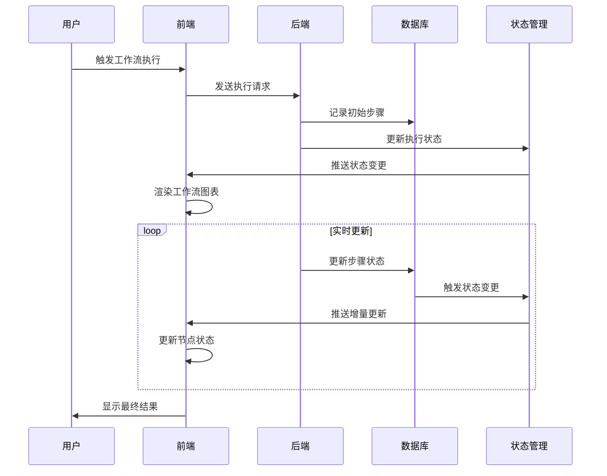
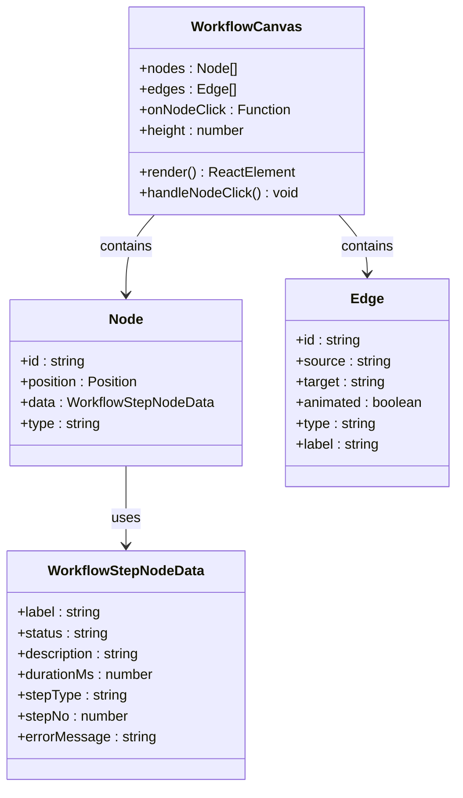
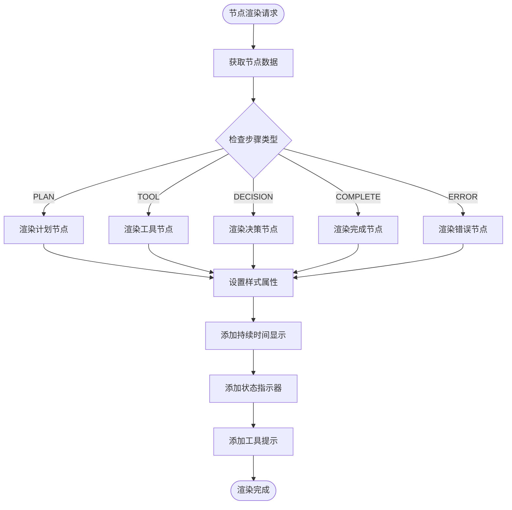
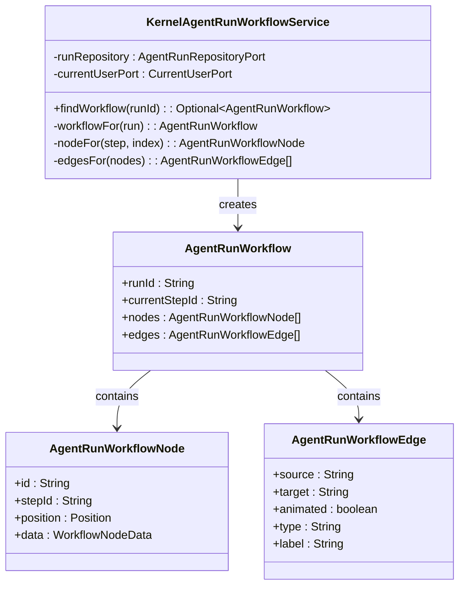
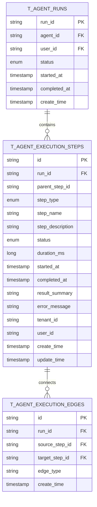
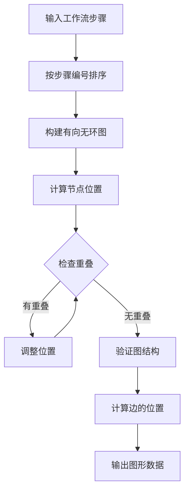
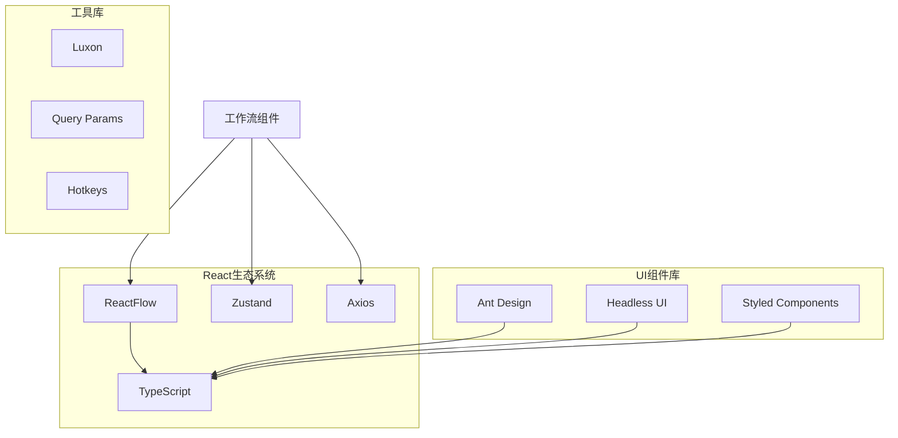
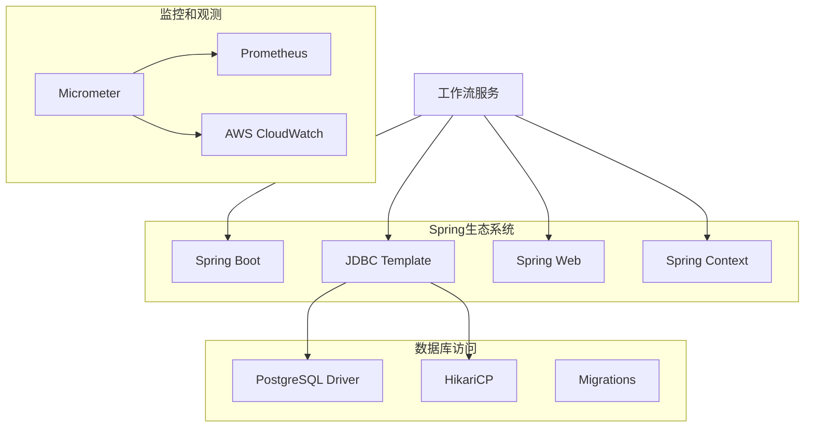

# 工作流可视化

<cite>
**本文档引用的文件**
- [WORKFLOW-VISUALIZATION-BACKEND-DESIGN.md](file://docs/WORKFLOW-VISUALIZATION-BACKEND-DESIGN.md)
- [WORKFLOW-VISUALIZATION-DETAILED-DESIGN.md](file://docs/WORKFLOW-VISUALIZATION-DETAILED-DESIGN.md)
- [WORKFLOW-BACKEND-DESIGN-SIMPLE.md](file://docs/WORKFLOW-BACKEND-DESIGN-SIMPLE.md)
- [WorkflowCanvas.tsx](file://frontend/src/components/ai-elements/workflow/WorkflowCanvas.tsx)
- [WorkflowStepNode.tsx](file://frontend/src/components/ai-elements/workflow/WorkflowStepNode.tsx)
- [workflowLayout.ts](file://frontend/src/components/ai-elements/workflow/workflowLayout.ts)
- [workflowLayout.test.ts](file://frontend/src/components/ai-elements/workflow/workflowLayout.test.ts)
- [AgentStepsView.tsx](file://frontend/src/pages/admin/agent-inspector/components/AgentStepsView.tsx)
- [KernelAgentRunWorkflowService.java](file://seahorse-agent-kernel/src/main/java/com/miracle/ai/seahorse/agent/kernel/application/agent/runtime/KernelAgentRunWorkflowService.java)
- [JdbcWorkflowRepository.java](file://seahorse-agent-adapter-repository-jdbc/src/main/java/com/miracle/ai/seahorse/agent/adapters/repository/jdbc/JdbcWorkflowRepository.java)
</cite>

## 目录
1. [简介](#简介)
2. [项目结构](#项目结构)
3. [核心组件](#核心组件)
4. [架构概览](#架构概览)
5. [详细组件分析](#详细组件分析)
6. [依赖关系分析](#依赖关系分析)
7. [性能考虑](#性能考虑)
8. [故障排除指南](#故障排除指南)
9. [结论](#结论)

## 简介

工作流可视化是Seahorse Agent项目中的一个关键功能模块，旨在为AI代理的执行过程提供直观的可视化展示。该系统通过前后端分离的架构设计，实现了从后端执行状态追踪到前端实时可视化的完整解决方案。

系统的核心目标是：
- 实时展示AI代理的工作流程执行状态
- 提供交互式的工作流图表界面
- 支持多租户环境下的工作流管理
- 实现从步骤记录到图形渲染的完整数据链路

## 项目结构

该项目采用前后端分离的架构模式，主要分为以下层次：

**图表来源**
- [WORKFLOW-VISUALIZATION-BACKEND-DESIGN.md:160-200](file://docs/WORKFLOW-VISUALIZATION-BACKEND-DESIGN.md#L160-L200)
- [WORKFLOW-VISUALIZATION-DETAILED-DESIGN.md:160-373](file://docs/WORKFLOW-VISUALIZATION-DETAILED-DESIGN.md#L160-L373)

**章节来源**
- [WORKFLOW-VISUALIZATION-BACKEND-DESIGN.md:160-200](file://docs/WORKFLOW-VISUALIZATION-BACKEND-DESIGN.md#L160-L200)
- [WORKFLOW-VISUALIZATION-DETAILED-DESIGN.md:160-373](file://docs/WORKFLOW-VISUALIZATION-DETAILED-DESIGN.md#L160-L373)

## 核心组件

### 前端组件架构

前端工作流可视化系统由多个核心组件构成，每个组件都有明确的职责分工：

#### WorkflowCanvas容器组件
负责整个工作流画布的渲染和交互控制，集成了ReactFlow库的所有功能特性。

#### 自定义节点组件
提供专门的工作流步骤节点渲染，支持不同状态和类型的步骤显示。

#### 布局算法模块
实现工作流步骤到图形结构的转换逻辑，确保步骤按正确的顺序和位置排列。

**章节来源**
- [WorkflowCanvas.tsx:1-54](file://frontend/src/components/ai-elements/workflow/WorkflowCanvas.tsx#L1-L54)
- [WorkflowStepNode.tsx](file://frontend/src/components/ai-elements/workflow/WorkflowStepNode.tsx)
- [workflowLayout.ts](file://frontend/src/components/ai-elements/workflow/workflowLayout.ts)

### 后端组件架构

后端系统采用分层架构设计，确保了良好的可维护性和扩展性：

#### 工作流服务层
处理工作流的业务逻辑，包括步骤管理和状态跟踪。

#### 仓库层
提供数据持久化接口，实现与数据库的交互。

#### 执行引擎
负责实际的AI代理执行，并实时更新工作流状态。

**章节来源**
- [KernelAgentRunWorkflowService.java:51-79](file://seahorse-agent-kernel/src/main/java/com/miracle/ai/seahorse/agent/kernel/application/agent/runtime/KernelAgentRunWorkflowService.java#L51-L79)
- [JdbcWorkflowRepository.java:512-606](file://seahorse-agent-adapter-repository-jdbc/src/main/java/com/miracle/ai/seahorse/agent/adapters/repository/jdbc/JdbcWorkflowRepository.java#L512-L606)

## 架构概览

系统采用微服务架构，前后端分离的设计模式：

**图表来源**
- [WORKFLOW-VISUALIZATION-BACKEND-DESIGN.md:160-200](file://docs/WORKFLOW-VISUALIZATION-BACKEND-DESIGN.md#L160-L200)
- [WORKFLOW-VISUALIZATION-DETAILED-DESIGN.md:160-373](file://docs/WORKFLOW-VISUALIZATION-DETAILED-DESIGN.md#L160-L373)

### 数据流架构

系统的数据流遵循严格的单向原则，确保数据的一致性和可追踪性：

**图表来源**
- [WORKFLOW-VISUALIZATION-BACKEND-DESIGN.md:160-200](file://docs/WORKFLOW-VISUALIZATION-BACKEND-DESIGN.md#L160-L200)
- [WORKFLOW-VISUALIZATION-DETAILED-DESIGN.md:160-373](file://docs/WORKFLOW-VISUALIZATION-DETAILED-DESIGN.md#L160-L373)

## 详细组件分析

### 前端工作流可视化组件

#### WorkflowCanvas组件分析

WorkflowCanvas作为工作流可视化的主容器，集成了丰富的交互功能：

**图表来源**
- [WorkflowCanvas.tsx:21-54](file://frontend/src/components/ai-elements/workflow/WorkflowCanvas.tsx#L21-L54)
- [AgentStepsView.tsx:138-171](file://frontend/src/pages/admin/agent-inspector/components/AgentStepsView.tsx#L138-L171)

#### 自定义节点渲染机制

系统实现了灵活的节点渲染机制，支持不同类型的工作流步骤：

**图表来源**
- [WorkflowStepNode.tsx](file://frontend/src/components/ai-elements/workflow/WorkflowStepNode.tsx)

**章节来源**
- [WorkflowCanvas.tsx:1-54](file://frontend/src/components/ai-elements/workflow/WorkflowCanvas.tsx#L1-L54)
- [AgentStepsView.tsx:138-171](file://frontend/src/pages/admin/agent-inspector/components/AgentStepsView.tsx#L138-L171)

### 后端工作流管理系统

#### 工作流服务架构

后端工作流管理系统采用领域驱动设计原则，实现了清晰的职责分离：

**图表来源**
- [KernelAgentRunWorkflowService.java:51-79](file://seahorse-agent-kernel/src/main/java/com/miracle/ai/seahorse/agent/kernel/application/agent/runtime/KernelAgentRunWorkflowService.java#L51-L79)

#### 数据持久化层

JdbcWorkflowRepository实现了工作流数据的持久化存储：

**图表来源**
- [JdbcWorkflowRepository.java:520-562](file://seahorse-agent-adapter-repository-jdbc/src/main/java/com/miracle/ai/seahorse/agent/adapters/repository/jdbc/JdbcWorkflowRepository.java#L520-L562)

**章节来源**
- [KernelAgentRunWorkflowService.java:51-79](file://seahorse-agent-kernel/src/main/java/com/miracle/ai/seahorse/agent/kernel/application/agent/runtime/KernelAgentRunWorkflowService.java#L51-L79)
- [JdbcWorkflowRepository.java:512-606](file://seahorse-agent-adapter-repository-jdbc/src/main/java/com/miracle/ai/seahorse/agent/adapters/repository/jdbc/JdbcWorkflowRepository.java#L512-L606)

### 布局算法实现

系统实现了智能的工作流布局算法，确保复杂的多步骤工作流能够清晰展示：

**图表来源**
- [workflowLayout.ts](file://frontend/src/components/ai-elements/workflow/workflowLayout.ts)

**章节来源**
- [workflowLayout.ts](file://frontend/src/components/ai-elements/workflow/workflowLayout.ts)
- [workflowLayout.test.ts:1-34](file://frontend/src/components/ai-elements/workflow/workflowLayout.test.ts#L1-L34)

## 依赖关系分析

### 前端依赖关系

前端系统依赖于React生态系统的多个核心库：

### 后端依赖关系

后端系统采用Spring Boot框架，依赖关系清晰明确：

**图表来源**
- [WORKFLOW-VISUALIZATION-BACKEND-DESIGN.md:160-200](file://docs/WORKFLOW-VISUALIZATION-BACKEND-DESIGN.md#L160-L200)

**章节来源**
- [WORKFLOW-VISUALIZATION-BACKEND-DESIGN.md:160-200](file://docs/WORKFLOW-VISUALIZATION-BACKEND-DESIGN.md#L160-L200)

## 性能考虑

### 前端性能优化

系统在前端层面采用了多项性能优化策略：

#### 渲染性能优化
- 使用React.memo避免不必要的组件重渲染
- 实现虚拟滚动处理大量节点的情况
- 采用CSS动画替代JavaScript动画
- 实现懒加载减少初始包大小

#### 内存管理
- 及时清理事件监听器和定时器
- 实现节点数据的弱引用管理
- 优化大图的内存使用策略

### 后端性能优化

后端系统同样注重性能表现：

#### 数据库优化
- 实现索引优化提升查询性能
- 采用批量操作减少数据库往返
- 实现连接池管理避免资源泄漏

#### 缓存策略
- 实现多级缓存架构
- 采用LRU缓存管理热数据
- 实现缓存失效和更新策略

## 故障排除指南

### 常见问题诊断

#### 前端问题
- **节点不显示**：检查数据格式和必需字段
- **布局异常**：验证步骤间的依赖关系
- **交互无响应**：确认事件绑定和状态更新

#### 后端问题
- **数据丢失**：检查数据库连接和事务处理
- **状态不同步**：验证事件发布和订阅机制
- **性能下降**：分析查询优化和缓存命中率

### 调试工具和方法

系统提供了完善的调试工具：

#### 前端调试
- 浏览器开发者工具
- React DevTools
- Redux DevTools（状态管理）

#### 后端调试
- Spring Boot Actuator
- 数据库查询日志
- 性能监控指标

**章节来源**
- [WORKFLOW-VISUALIZATION-BACKEND-DESIGN.md:492-606](file://docs/WORKFLOW-VISUALIZATION-BACKEND-DESIGN.md#L492-L606)

## 结论

工作流可视化系统通过精心设计的前后端架构，成功实现了AI代理执行过程的直观展示。系统的主要优势包括：

1. **架构清晰**：前后端分离设计便于维护和扩展
2. **性能优异**：多层优化确保了良好的用户体验
3. **功能完整**：从数据采集到可视化展示的完整链路
4. **易于使用**：直观的界面和丰富的交互功能

该系统为AI代理的透明化运行提供了强有力的技术支撑，为后续的功能扩展和性能优化奠定了坚实基础。