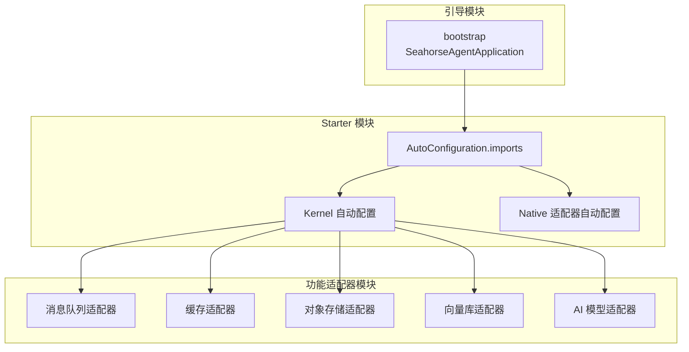
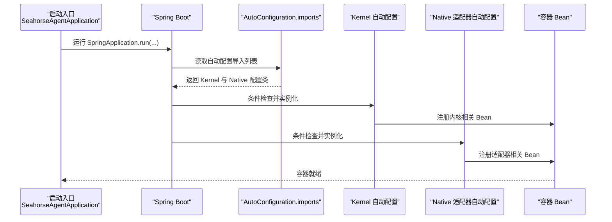
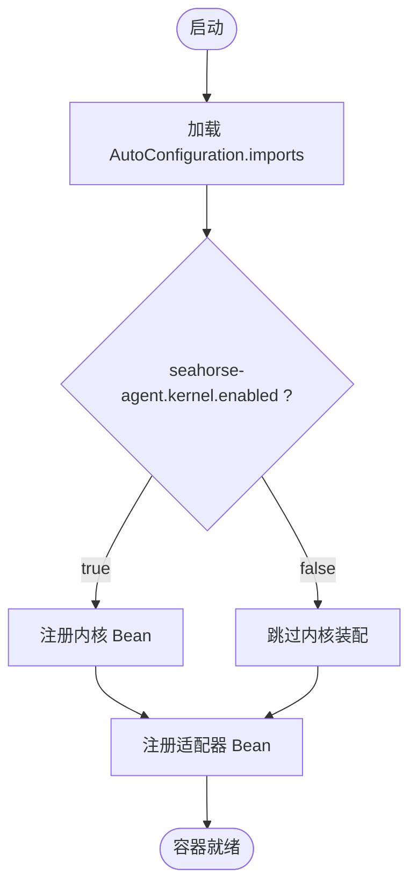
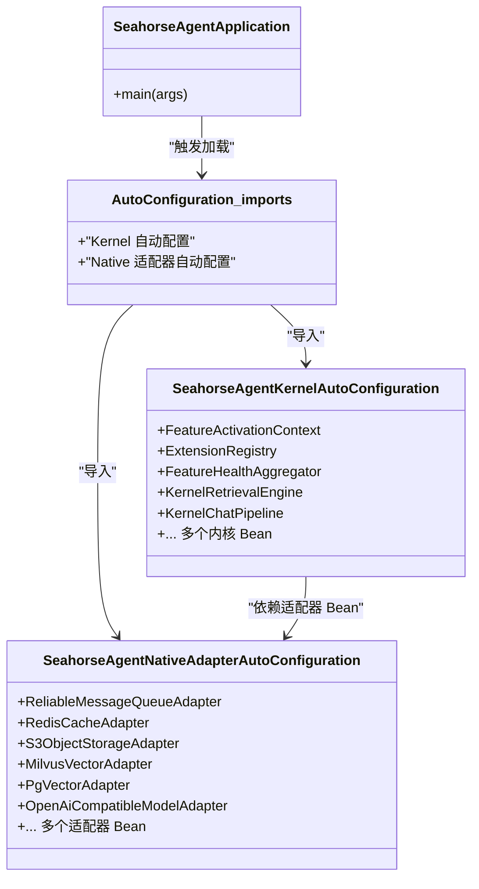
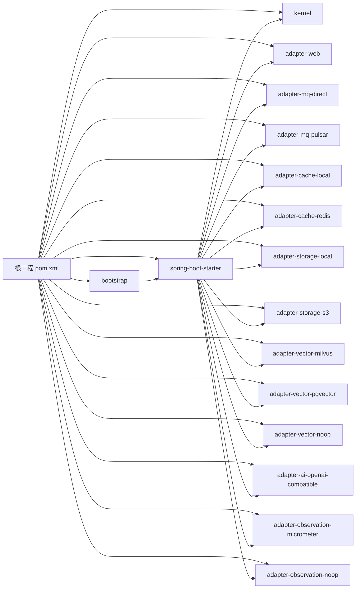

# 应用启动

<cite>
**本文引用的文件**
- [SeahorseAgentApplication.java](file://seahorse-agent-bootstrap/src/main/java/com/miracle/ai/seahorse/agent/SeahorseAgentApplication.java)
- [application.properties（引导模块）](file://seahorse-agent-bootstrap/src/main/resources/application.properties)
- [application.properties（Starter 模块）](file://seahorse-agent-spring-boot-starter/src/main/resources/application.properties)
- [application.yml（MCP 服务）](file://seahorse-agent-mcp-server/src/main/resources/application.yml)
- [pom.xml（根工程）](file://pom.xml)
- [SeahorseAgentKernelAutoConfiguration.java](file://seahorse-agent-spring-boot-starter/src/main/java/com/miracle/ai/seahorse/agent/adapters/spring/SeahorseAgentKernelAutoConfiguration.java)
- [SeahorseAgentNativeAdapterAutoConfiguration.java](file://seahorse-agent-spring-boot-starter/src/main/java/com/miracle/ai/seahorse/agent/adapters/spring/SeahorseAgentNativeAdapterAutoConfiguration.java)
- [org.springframework.boot.autoconfigure.AutoConfiguration.imports](file://seahorse-agent-spring-boot-starter/src/main/resources/META-INF/spring/org.springframework.boot.autoconfigure.AutoConfiguration.imports)
- [SeahorseWebGovernanceConfiguration.java](file://seahorse-agent-adapter-web/src/main/java/com/miracle/ai/seahorse/agent/adapters/web/SeahorseWebGovernanceConfiguration.java)
- [PulsarMessageQueueProperties.java](file://seahorse-agent-adapter-mq-pulsar/src/main/java/com/miracle/ai/seahorse/agent/adapters/mq/pulsar/PulsarMessageQueueProperties.java)
- [MilvusVectorProperties.java](file://seahorse-agent-adapter-vector-milvus/src/main/java/com/miracle/ai/seahorse/agent/adapters/vector/milvus/MilvusVectorProperties.java)
</cite>

## 目录
1. [引言](#引言)
2. [项目结构](#项目结构)
3. [核心组件](#核心组件)
4. [架构总览](#架构总览)
5. [详细组件分析](#详细组件分析)
6. [依赖分析](#依赖分析)
7. [性能考虑](#性能考虑)
8. [故障排查指南](#故障排查指南)
9. [结论](#结论)
10. [附录](#附录)

## 引言
本文件聚焦 Seahorse Agent 应用启动模块，系统性阐述 Spring Boot 启动流程、自动配置加载机制、Bean 初始化顺序、关键配置项与环境差异、启动故障排查以及性能优化与启动时间监控方法。目标是帮助开发者快速理解并高效运维该应用。

## 项目结构
Seahorse Agent 采用多模块 Maven 结构，核心启动模块位于 seahorse-agent-bootstrap，其内部通过 Spring Boot Starter 将内核与适配器自动装配到容器中；其他模块提供适配器实现（消息队列、缓存、存储、向量库、AI 模型等），并在运行时按条件装配。

图表来源
- [SeahorseAgentApplication.java:30-36](file://seahorse-agent-bootstrap/src/main/java/com/miracle/ai/seahorse/agent/SeahorseAgentApplication.java#L30-L36)
- [org.springframework.boot.autoconfigure.AutoConfiguration.imports:1-3](file://seahorse-agent-spring-boot-starter/src/main/resources/META-INF/spring/org.springframework.boot.autoconfigure.AutoConfiguration.imports#L1-L3)
- [SeahorseAgentKernelAutoConfiguration.java:181-188](file://seahorse-agent-spring-boot-starter/src/main/java/com/miracle/ai/seahorse/agent/adapters/spring/SeahorseAgentKernelAutoConfiguration.java#L181-L188)
- [SeahorseAgentNativeAdapterAutoConfiguration.java:160-162](file://seahorse-agent-spring-boot-starter/src/main/java/com/miracle/ai/seahorse/agent/adapters/spring/SeahorseAgentNativeAdapterAutoConfiguration.java#L160-L162)

章节来源
- [pom.xml（根工程）:37-60](file://pom.xml#L37-L60)
- [SeahorseAgentApplication.java:30-36](file://seahorse-agent-bootstrap/src/main/java/com/miracle/ai/seahorse/agent/SeahorseAgentApplication.java#L30-L36)

## 核心组件
- 启动入口：SeahorseAgentApplication 使用 SpringBootApplication 注解限定扫描包域并启用调度，作为应用启动入口。
- 自动配置导入：Starter 模块通过 AutoConfiguration.imports 显式声明 Kernel 与 Native 适配器自动配置类，确保在引导模块启动时被加载。
- 内核自动配置：SeahorseAgentKernelAutoConfiguration 负责注册内核编排、Feature 注册表、检索引擎、聊天流水线、内存治理、模型路由等核心 Bean，并通过条件注解控制装配。
- 原生适配器自动配置：SeahorseAgentNativeAdapterAutoConfiguration 将具体适配器（MQ、缓存、存储、向量库、AI 模型、认证、JDBC 仓库等）按配置条件注入容器，保持可插拔替换能力。
- Web 治理配置：SeahorseWebGovernanceConfiguration 提供 Demo 模式读写限制与字符集过滤等横切治理能力。

章节来源
- [SeahorseAgentApplication.java:30-36](file://seahorse-agent-bootstrap/src/main/java/com/miracle/ai/seahorse/agent/SeahorseAgentApplication.java#L30-L36)
- [org.springframework.boot.autoconfigure.AutoConfiguration.imports:1-3](file://seahorse-agent-spring-boot-starter/src/main/resources/META-INF/spring/org.springframework.boot.autoconfigure.AutoConfiguration.imports#L1-L3)
- [SeahorseAgentKernelAutoConfiguration.java:181-188](file://seahorse-agent-spring-boot-starter/src/main/java/com/miracle/ai/seahorse/agent/adapters/spring/SeahorseAgentKernelAutoConfiguration.java#L181-L188)
- [SeahorseAgentNativeAdapterAutoConfiguration.java:160-162](file://seahorse-agent-spring-boot-starter/src/main/java/com/miracle/ai/seahorse/agent/adapters/spring/SeahorseAgentNativeAdapterAutoConfiguration.java#L160-L162)
- [SeahorseWebGovernanceConfiguration.java:40-50](file://seahorse-agent-adapter-web/src/main/java/com/miracle/ai/seahorse/agent/adapters/web/SeahorseWebGovernanceConfiguration.java#L40-L50)

## 架构总览
下图展示从启动入口到自动配置加载、Bean 注册与条件装配的关键流程：

图表来源
- [SeahorseAgentApplication.java:34-36](file://seahorse-agent-bootstrap/src/main/java/com/miracle/ai/seahorse/agent/SeahorseAgentApplication.java#L34-L36)
- [org.springframework.boot.autoconfigure.AutoConfiguration.imports:1-3](file://seahorse-agent-spring-boot-starter/src/main/resources/META-INF/spring/org.springframework.boot.autoconfigure.AutoConfiguration.imports#L1-L3)
- [SeahorseAgentKernelAutoConfiguration.java:181-188](file://seahorse-agent-spring-boot-starter/src/main/java/com/miracle/ai/seahorse/agent/adapters/spring/SeahorseAgentKernelAutoConfiguration.java#L181-L188)
- [SeahorseAgentNativeAdapterAutoConfiguration.java:160-162](file://seahorse-agent-spring-boot-starter/src/main/java/com/miracle/ai/seahorse/agent/adapters/spring/SeahorseAgentNativeAdapterAutoConfiguration.java#L160-L162)

## 详细组件分析

### 启动类与扫描范围
- 扫描包域：仅扫描 com.miracle.ai.seahorse.agent 命名空间，避免误扫描外部包。
- 调度启用：开启基于注解的定时任务支持。
- 入口调用：通过 SpringApplication.run(...) 触发启动流程。

章节来源
- [SeahorseAgentApplication.java:30-36](file://seahorse-agent-bootstrap/src/main/java/com/miracle/ai/seahorse/agent/SeahorseAgentApplication.java#L30-L36)

### 自动配置加载机制
- 导入清单：Starter 模块通过 META-INF/spring 的 AutoConfiguration.imports 显式声明 Kernel 与 Native 适配器自动配置类。
- 条件装配：两类自动配置均使用 @ConditionalOnProperty(seahorse-agent.kernel.enabled=true) 控制是否生效，且默认值为 true，便于独立内核模式使用。
- Bean 优先级：部分 Bean 使用 @Primary 保证在存在多个实现时的默认选择。

章节来源
- [org.springframework.boot.autoconfigure.AutoConfiguration.imports:1-3](file://seahorse-agent-spring-boot-starter/src/main/resources/META-INF/spring/org.springframework.boot.autoconfigure.AutoConfiguration.imports#L1-L3)
- [SeahorseAgentKernelAutoConfiguration.java:181-188](file://seahorse-agent-spring-boot-starter/src/main/java/com/miracle/ai/seahorse/agent/adapters/spring/SeahorseAgentKernelAutoConfiguration.java#L181-L188)
- [SeahorseAgentNativeAdapterAutoConfiguration.java:160-162](file://seahorse-agent-spring-boot-starter/src/main/java/com/miracle/ai/seahorse/agent/adapters/spring/SeahorseAgentNativeAdapterAutoConfiguration.java#L160-L162)

### Bean 初始化顺序与关键依赖链
- 内核编排层：先注册 FeatureActivationContext、ExtensionRegistry、FeatureHealthAggregator，再注册各类 Feature（抓取、解析、增强、索引、检索通道等），最后构建 KernelRetrievalEngine、KernelChatPipeline 等核心编排 Bean。
- 适配器层：根据外部依赖（如 RedissonClient、PulsarClient、S3Client、DataSource 等）与配置开关（如 seahorse-agent.adapters.*.type）动态装配 MQ、缓存、存储、向量库、AI 模型等端口实现。
- Web 层：注册本地流式回调工厂、聊天入站端口、认证与用户服务、知识库与文档管理、内存治理与调度等。

图表来源
- [org.springframework.boot.autoconfigure.AutoConfiguration.imports:1-3](file://seahorse-agent-spring-boot-starter/src/main/resources/META-INF/spring/org.springframework.boot.autoconfigure.AutoConfiguration.imports#L1-L3)
- [SeahorseAgentKernelAutoConfiguration.java:181-188](file://seahorse-agent-spring-boot-starter/src/main/java/com/miracle/ai/seahorse/agent/adapters/spring/SeahorseAgentKernelAutoConfiguration.java#L181-L188)
- [SeahorseAgentNativeAdapterAutoConfiguration.java:160-162](file://seahorse-agent-spring-boot-starter/src/main/java/com/miracle/ai/seahorse/agent/adapters/spring/SeahorseAgentNativeAdapterAutoConfiguration.java#L160-L162)

### 配置文件与关键参数
- 引导模块 application.properties
  - spring.application.name：应用名称
  - seahorse-agent.kernel.enabled：内核开关（默认启用）
  - seahorse-agent.kernel.migration-mode：迁移模式（用于内核迁移场景）

- Starter 模块 application.properties
  - seahorse-agent.kernel.mode：内核运行模式（kernel）

- MCP 服务 application.yml
  - server.port：服务端口
  - spring.application.name：应用名称

章节来源
- [application.properties（引导模块）:1-4](file://seahorse-agent-bootstrap/src/main/resources/application.properties#L1-L4)
- [application.properties（Starter 模块）:1-2](file://seahorse-agent-spring-boot-starter/src/main/resources/application.properties#L1-L2)
- [application.yml（MCP 服务）:1-7](file://seahorse-agent-mcp-server/src/main/resources/application.yml#L1-L7)

### 不同环境下的配置差异与切换方法
- 内核开关：通过 seahorse-agent.kernel.enabled 控制是否装配内核与适配器 Bean。
- 适配器类型：通过 seahorse-agent.adapters.*.type 切换 MQ（direct/pulsar）、缓存（local/redis）、存储（local/s3）、向量库（milvus/pgvector/noop）、AI（openai-compatible）等。
- Demo 模式：通过 seahorse-agent.web.demo-mode.enabled 控制是否启用只读拦截。
- MQ 主题与批大小：通过 knowledge-document-chunk 主题与批处理大小参数影响文档增量刷新与订阅行为。
- 向量库参数：通过 collection 名称、维度、度量类型等参数控制 Milvus 行为。

章节来源
- [SeahorseAgentKernelAutoConfiguration.java:603-610](file://seahorse-agent-spring-boot-starter/src/main/java/com/miracle/ai/seahorse/agent/adapters/spring/SeahorseAgentKernelAutoConfiguration.java#L603-L610)
- [SeahorseAgentNativeAdapterAutoConfiguration.java:164-190](file://seahorse-agent-spring-boot-starter/src/main/java/com/miracle/ai/seahorse/agent/adapters/spring/SeahorseAgentNativeAdapterAutoConfiguration.java#L164-L190)
- [SeahorseWebGovernanceConfiguration.java:47-50](file://seahorse-agent-adapter-web/src/main/java/com/miracle/ai/seahorse/agent/adapters/web/SeahorseWebGovernanceConfiguration.java#L47-L50)
- [MilvusVectorProperties.java:29-37](file://seahorse-agent-adapter-vector-milvus/src/main/java/com/miracle/ai/seahorse/agent/adapters/vector/milvus/MilvusVectorProperties.java#L29-L37)

### 启动流程与 Bean 关系（代码级）

图表来源
- [SeahorseAgentApplication.java:30-36](file://seahorse-agent-bootstrap/src/main/java/com/miracle/ai/seahorse/agent/SeahorseAgentApplication.java#L30-L36)
- [org.springframework.boot.autoconfigure.AutoConfiguration.imports:1-3](file://seahorse-agent-spring-boot-starter/src/main/resources/META-INF/spring/org.springframework.boot.autoconfigure.AutoConfiguration.imports#L1-L3)
- [SeahorseAgentKernelAutoConfiguration.java:181-188](file://seahorse-agent-spring-boot-starter/src/main/java/com/miracle/ai/seahorse/agent/adapters/spring/SeahorseAgentKernelAutoConfiguration.java#L181-L188)
- [SeahorseAgentNativeAdapterAutoConfiguration.java:160-162](file://seahorse-agent-spring-boot-starter/src/main/java/com/miracle/ai/seahorse/agent/adapters/spring/SeahorseAgentNativeAdapterAutoConfiguration.java#L160-L162)

## 依赖分析
- 模块依赖：根 pom 定义了完整的模块矩阵，包含 MCP 服务、内核、Web 适配器、MQ、缓存、存储、向量库、AI、观察与 Starter 等模块。
- 版本管理：集中管理 Spring Boot、Milvus、Pulsar、OkHttp、Redisson、AWS S3、MyBatis Plus 等依赖版本。
- 启动依赖：bootstrap 模块依赖 Starter，Starter 通过 AutoConfiguration.imports 引入内核与适配器自动配置。

图表来源
- [pom.xml（根工程）:37-60](file://pom.xml#L37-L60)

章节来源
- [pom.xml（根工程）:62-165](file://pom.xml#L62-L165)

## 性能考虑
- 启动阶段优化
  - 减少不必要的自动配置：通过 seahorse-agent.kernel.enabled 与各适配器 type 精准装配，避免加载未使用的 Bean。
  - 选择轻量适配器：在开发或测试环境优先使用 local 类型缓存、存储与向量库，降低外部依赖开销。
  - 合理设置批处理参数：如 Outbox Relay 批大小、MQ 批量发送参数等，平衡吞吐与延迟。
- 运行阶段优化
  - 向量库参数：合理设置 Milvus 维度、度量类型与集合命名，避免过大或过小导致性能问题。
  - 缓存策略：结合本地与 Redis 缓存，针对热点数据提升命中率。
  - MQ 配置：根据业务流量调整 Pulsar 批量大小与超时，减少网络往返与序列化开销。
- 启动时间监控
  - 使用 Spring Boot Actuator 的启动指标与日志级别，定位耗时步骤。
  - 分模块验证：先启动 bootstrap + kernel，再逐步引入适配器模块，定位瓶颈模块。
  - JVM 参数：结合 GC 日志与 JIT 分析，识别启动阶段的 CPU/内存热点。

## 故障排查指南
- 启动失败（找不到 Bean 或循环依赖）
  - 检查 seahorse-agent.kernel.enabled 是否正确设置。
  - 确认所需外部依赖已引入（如 RedissonClient、PulsarClient、S3Client、DataSource）。
  - 排查适配器类型配置是否与实际依赖匹配。
- MQ 相关问题
  - 确认 seahorse-agent.adapters.mq.type 设置与 PulsarClient/Redis 实例一致。
  - 检查 Outbox Relay 批大小与分布式锁配置，避免并发冲突。
- 向量库问题
  - 校验 Milvus 维度与度量类型参数，确保与模型输出一致。
  - 检查集合命名与权限，避免初始化失败。
- Web 访问受限
  - 若启用 demo 模式，非认证接口的写操作会被拒绝，需关闭 demo 模式或放行特定路径。
- 启动慢
  - 关闭非必要适配器，缩小扫描范围。
  - 调整批处理与超时参数，减少 IO 等待。
  - 使用更轻量的向量库或禁用向量库（noop）进行基准测试。

章节来源
- [SeahorseAgentKernelAutoConfiguration.java:650-659](file://seahorse-agent-spring-boot-starter/src/main/java/com/miracle/ai/seahorse/agent/adapters/spring/SeahorseAgentKernelAutoConfiguration.java#L650-L659)
- [SeahorseAgentNativeAdapterAutoConfiguration.java:175-186](file://seahorse-agent-spring-boot-starter/src/main/java/com/miracle/ai/seahorse/agent/adapters/spring/SeahorseAgentNativeAdapterAutoConfiguration.java#L175-L186)
- [PulsarMessageQueueProperties.java:25-42](file://seahorse-agent-adapter-mq-pulsar/src/main/java/com/miracle/ai/seahorse/agent/adapters/mq/pulsar/PulsarMessageQueueProperties.java#L25-L42)
- [MilvusVectorProperties.java:29-37](file://seahorse-agent-adapter-vector-milvus/src/main/java/com/miracle/ai/seahorse/agent/adapters/vector/milvus/MilvusVectorProperties.java#L29-L37)
- [SeahorseWebGovernanceConfiguration.java:68-91](file://seahorse-agent-adapter-web/src/main/java/com/miracle/ai/seahorse/agent/adapters/web/SeahorseWebGovernanceConfiguration.java#L68-L91)

## 结论
Seahorse Agent 的启动模块以 Spring Boot Starter 为核心，通过 AutoConfiguration.imports 将内核与适配器自动装配到容器，配合条件注解与属性配置实现灵活的环境切换与按需装配。通过合理配置与性能优化，可在不同环境下获得稳定高效的启动与运行体验。

## 附录
- 常用配置键位速览
  - 内核开关：seahorse-agent.kernel.enabled
  - 内核模式：seahorse-agent.kernel.mode
  - 迁移模式：seahorse-agent.kernel.migration-mode
  - MQ 类型：seahorse-agent.adapters.mq.type
  - 缓存类型：seahorse-agent.adapters.cache.type
  - 存储类型：seahorse-agent.adapters.storage.type
  - 向量库类型：seahorse-agent.adapters.vector.type
  - AI 类型：seahorse-agent.adapters.ai.type
  - Demo 模式：seahorse-agent.web.demo-mode.enabled
  - 文档刷新调度：seahorse-agent.document-refresh.scheduler-enabled
  - 内存治理调度：seahorse-agent.memory.governance.scheduler-enabled
  - Outbox Relay 批大小：seahorse-agent.adapters.mq.outbox.relay.batch-size
  - 向量库维度：seahorse-agent.adapters.vector.dimension
  - 向量库度量类型：seahorse-agent.adapters.vector.metric-type
  - 向量库集合名：seahorse-agent.adapters.vector.collection-name
  - MQ 发送超时：seahorse-agent.adapters.mq.pulsar.send-timeout-ms
  - MQ 批量大小：seahorse-agent.adapters.mq.pulsar.batching-max-messages