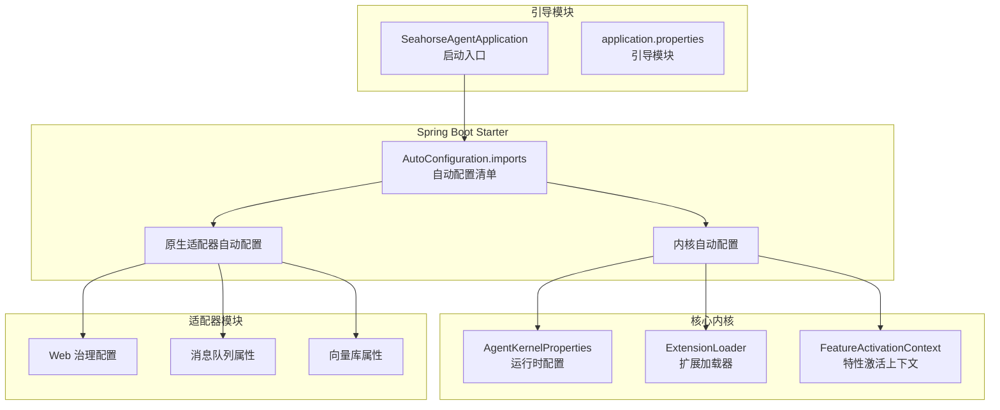
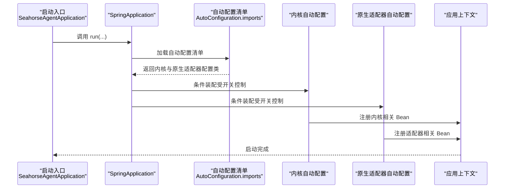
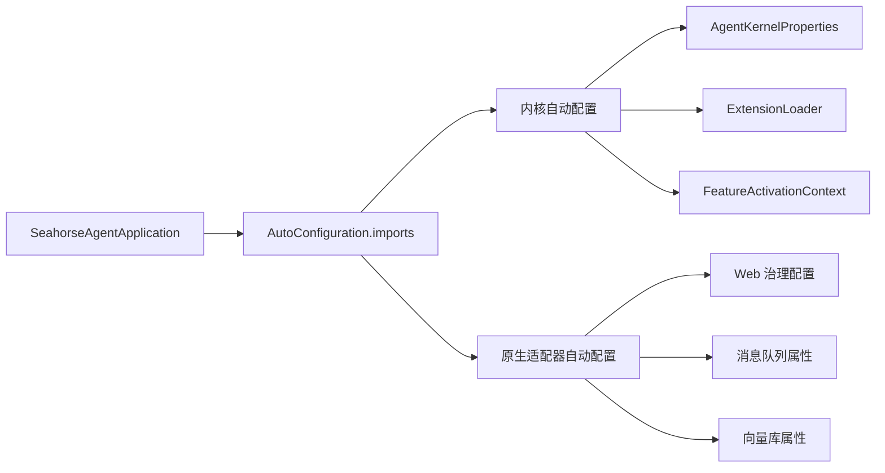

# 应用启动模块

<cite>
**本文引用的文件**
- [SeahorseAgentApplication.java](file://seahorse-agent-bootstrap/src/main/java/com/miracle/ai/seahorse/agent/SeahorseAgentApplication.java)
- [application.properties（引导模块）](file://seahorse-agent-bootstrap/src/main/resources/application.properties)
- [application.properties（Spring Boot Starter 模块）](file://seahorse-agent-spring-boot-starter/src/main/resources/application.properties)
- [org.springframework.boot.autoconfigure.AutoConfiguration.imports](file://seahorse-agent-spring-boot-starter/src/main/resources/META-INF/spring/org.springframework.boot.autoconfigure.AutoConfiguration.imports)
- [SeahorseAgentKernelAutoConfiguration.java](file://seahorse-agent-spring-boot-starter/src/main/java/com/miracle/ai/seahorse/agent/adapters/spring/SeahorseAgentKernelAutoConfiguration.java)
- [SeahorseAgentNativeAdapterAutoConfiguration.java](file://seahorse-agent-spring-boot-starter/src/main/java/com/miracle/ai/seahorse/agent/adapters/spring/SeahorseAgentNativeAdapterAutoConfiguration.java)
- [SeahorseWebGovernanceConfiguration.java](file://seahorse-agent-adapter-web/src/main/java/com/miracle/ai/seahorse/agent/adapters/web/SeahorseWebGovernanceConfiguration.java)
- [PulsarMessageQueueProperties.java](file://seahorse-agent-adapter-mq-pulsar/src/main/java/com/miracle/ai/seahorse/agent/adapters/mq/pulsar/PulsarMessageQueueProperties.java)
- [MilvusVectorProperties.java](file://seahorse-agent-adapter-vector-milvus/src/main/java/com/miracle/ai/seahorse/agent/adapters/vector/milvus/MilvusVectorProperties.java)
- [pom.xml（根工程）](file://pom.xml)
- [seahorse-agent-bootstrap/pom.xml](file://seahorse-agent-bootstrap/pom.xml)
- [seahorse-agent-spring-boot-starter/pom.xml](file://seahorse-agent-spring-boot-starter/pom.xml)
- [application.yml（MCP 服务）](file://seahorse-agent-mcp-server/src/main/resources/application.yml)
</cite>

## 目录
1. [引言](#引言)
2. [项目结构](#项目结构)
3. [核心组件](#核心组件)
4. [架构总览](#架构总览)
5. [详细组件分析](#详细组件分析)
6. [依赖分析](#依赖分析)
7. [性能考虑](#性能考虑)
8. [故障排查指南](#故障排查指南)
9. [结论](#结论)
10. [附录](#附录)

## 引言
本文件聚焦于 Seahorse Agent 应用启动模块，系统性阐述 SeahorseAgentApplication 主启动类的设计与实现，包括 Spring Boot 应用初始化流程、自动配置加载机制、应用上下文构建过程；详解启动参数配置、环境变量设置与运行时配置选项；说明启动模块与核心组件（内核、适配器、插件系统）的集成方式；并提供启动故障排查与性能优化建议。文档兼顾初学者与高级开发者的需求，既给出高层概览，也提供代码级的可视化与溯源。

## 项目结构
启动模块位于 seahorse-agent-bootstrap 子模块，包含启动入口类与基础配置资源；自动配置由 seahorse-agent-spring-boot-starter 提供，通过 Spring Boot 的条件化装配机制按需启用内核与原生适配器；其他适配器模块（如 MQ、向量库、存储等）以 Starter 或适配器形式存在，按需引入并在自动配置中被激活。

**图表来源**
- [SeahorseAgentApplication.java:30-36](file://seahorse-agent-bootstrap/src/main/java/com/miracle/ai/seahorse/agent/SeahorseAgentApplication.java#L30-L36)
- [org.springframework.boot.autoconfigure.AutoConfiguration.imports:1-3](file://seahorse-agent-spring-boot-starter/src/main/resources/META-INF/spring/org.springframework.boot.autoconfigure.AutoConfiguration.imports#L1-L3)
- [SeahorseAgentKernelAutoConfiguration.java:181-188](file://seahorse-agent-spring-boot-starter/src/main/java/com/miracle/ai/seahorse/agent/adapters/spring/SeahorseAgentKernelAutoConfiguration.java#L181-L188)
- [SeahorseAgentNativeAdapterAutoConfiguration.java:160-162](file://seahorse-agent-spring-boot-starter/src/main/java/com/miracle/ai/seahorse/agent/adapters/spring/SeahorseAgentNativeAdapterAutoConfiguration.java#L160-L162)

**章节来源**
- [pom.xml（根工程）:37-60](file://pom.xml#L37-L60)
- [SeahorseAgentApplication.java:30-36](file://seahorse-agent-bootstrap/src/main/java/com/miracle/ai/seahorse/agent/SeahorseAgentApplication.java#L30-L36)

## 核心组件
- 启动入口类：SeahorseAgentApplication，定义扫描包域、排除特定自动配置、启用调度能力，并通过 SpringApplication.run(...) 触发启动。
- 自动配置清单：Spring Boot Starter 中的 AutoConfiguration.imports 显式声明内核与原生适配器自动配置类。
- 内核自动配置：根据运行时配置（如开关、模式）装配内核相关 Bean，并与扩展加载器、特性激活上下文协作。
- 原生适配器自动配置：按需装配 Web、消息队列、向量库等适配器 Bean。
- 运行时配置：application.properties（引导模块与 Starter 模块）提供默认值与开关项，支撑自动配置条件判断。

**章节来源**
- [SeahorseAgentApplication.java:30-36](file://seahorse-agent-bootstrap/src/main/java/com/miracle/ai/seahorse/agent/SeahorseAgentApplication.java#L30-L36)
- [org.springframework.boot.autoconfigure.AutoConfiguration.imports:1-3](file://seahorse-agent-spring-boot-starter/src/main/resources/META-INF/spring/org.springframework.boot.autoconfigure.AutoConfiguration.imports#L1-L3)
- [SeahorseAgentKernelAutoConfiguration.java:181-188](file://seahorse-agent-spring-boot-starter/src/main/java/com/miracle/ai/seahorse/agent/adapters/spring/SeahorseAgentKernelAutoConfiguration.java#L181-L188)
- [SeahorseAgentNativeAdapterAutoConfiguration.java:160-162](file://seahorse-agent-spring-boot-starter/src/main/java/com/miracle/ai/seahorse/agent/adapters/spring/SeahorseAgentNativeAdapterAutoConfiguration.java#L160-L162)

## 架构总览
下图展示从启动入口到自动配置加载、再到内核与适配器装配的整体流程。

**图表来源**
- [SeahorseAgentApplication.java:38-40](file://seahorse-agent-bootstrap/src/main/java/com/miracle/ai/seahorse/agent/SeahorseAgentApplication.java#L38-L40)
- [org.springframework.boot.autoconfigure.AutoConfiguration.imports:1-3](file://seahorse-agent-spring-boot-starter/src/main/resources/META-INF/spring/org.springframework.boot.autoconfigure.AutoConfiguration.imports#L1-L3)
- [SeahorseAgentKernelAutoConfiguration.java:181-188](file://seahorse-agent-spring-boot-starter/src/main/java/com/miracle/ai/seahorse/agent/adapters/spring/SeahorseAgentKernelAutoConfiguration.java#L181-L188)
- [SeahorseAgentNativeAdapterAutoConfiguration.java:160-162](file://seahorse-agent-spring-boot-starter/src/main/java/com/miracle/ai/seahorse/agent/adapters/spring/SeahorseAgentNativeAdapterAutoConfiguration.java#L160-L162)

## 详细组件分析

### 启动类与扫描范围
- 扫描包域：仅扫描 com.miracle.ai.seahorse.agent 命名空间，避免误扫描外部包，降低启动复杂度与风险。
- 调度启用：开启基于注解的定时任务支持，便于后续内核或适配器使用定时能力。
- 入口调用：通过 SpringApplication.run(...) 触发完整的启动流程，包括自动配置加载与 Bean 初始化。

**章节来源**
- [SeahorseAgentApplication.java:30-36](file://seahorse-agent-bootstrap/src/main/java/com/miracle/ai/seahorse/agent/SeahorseAgentApplication.java#L30-L36)

### 自动配置加载机制
- 导入清单：Starter 模块通过 META-INF/spring 的 AutoConfiguration.imports 显式声明内核与原生适配器自动配置类。
- 条件装配：两类自动配置均使用 @ConditionalOnProperty(seahorse-agent.kernel.enabled=true) 控制是否生效，默认值为 true，便于独立内核模式使用。
- Bean 优先级：部分 Bean 使用 @Primary 保证在存在多个实现时的默认选择，避免歧义。

**章节来源**
- [org.springframework.boot.autoconfigure.AutoConfiguration.imports:1-3](file://seahorse-agent-spring-boot-starter/src/main/resources/META-INF/spring/org.springframework.boot.autoconfigure.AutoConfiguration.imports#L1-L3)
- [SeahorseAgentKernelAutoConfiguration.java:181-188](file://seahorse-agent-spring-boot-starter/src/main/java/com/miracle/ai/seahorse/agent/adapters/spring/SeahorseAgentKernelAutoConfiguration.java#L181-L188)
- [SeahorseAgentNativeAdapterAutoConfiguration.java:160-162](file://seahorse-agent-spring-boot-starter/src/main/java/com/miracle/ai/seahorse/agent/adapters/spring/SeahorseAgentNativeAdapterAutoConfiguration.java#L160-L162)

### 运行时配置与环境变量
- 引导模块配置：application.properties（引导模块）提供基础运行参数与默认开关，作为启动期的初始配置。
- Starter 模块配置：application.properties（Starter 模块）提供自动配置相关的默认值与开关项，支撑内核与适配器的条件装配。
- 环境变量：可通过环境变量覆盖 application.properties 中的键值，实现不同环境的差异化配置（如数据库连接、日志级别、功能开关等）。
- 运行时模式：通过配置项解析运行时模式（如内核模式），影响 Bean 的装配与行为。

**章节来源**
- [application.properties（引导模块）:1-4](file://seahorse-agent-bootstrap/src/main/resources/application.properties#L1-L4)
- [application.properties（Spring Boot Starter 模块）:1](file://seahorse-agent-spring-boot-starter/src/main/resources/application.properties#L1)
- [application.yml（MCP 服务）:1-50](file://seahorse-agent-mcp-server/src/main/resources/application.yml#L1-L50)

### 启动参数与构建配置
- Maven 插件：根工程与引导模块分别配置了 maven-jar-plugin 与 spring-boot-maven-plugin，确保打包产物包含启动类、配置文件与必要的资源。
- 可执行 JAR：通过 spring-boot-maven-plugin 指定 mainClass 为启动入口类，生成可执行 JAR。
- 资源包含：引导模块与 Starter 模块的 maven-jar-plugin 配置确保 application.properties 与 META-INF 自动配置清单被打包进最终产物。

**章节来源**
- [pom.xml（根工程）:37-60](file://pom.xml#L37-L60)
- [seahorse-agent-bootstrap/pom.xml:67-86](file://seahorse-agent-bootstrap/pom.xml#L67-L86)
- [seahorse-agent-spring-boot-starter/pom.xml:151-169](file://seahorse-agent-spring-boot-starter/pom.xml#L151-L169)

### 与核心组件的集成
- 内核集成：内核自动配置根据 AgentKernelProperties 的开关与模式装配内核 Bean，并与 ExtensionLoader、FeatureActivationContext 协作，驱动插件系统初始化。
- 适配器集成：原生适配器自动配置按需装配 Web、消息队列、向量库等适配器 Bean，形成统一的运行时能力集合。
- Web 治理：Web 适配器通过治理配置参与请求处理链路，与内核运行时协同工作。
- 外部依赖：消息队列与向量库等外部组件通过各自的属性类进行配置绑定，影响自动配置的可用性与行为。

**章节来源**
- [SeahorseAgentKernelAutoConfiguration.java:181-188](file://seahorse-agent-spring-boot-starter/src/main/java/com/miracle/ai/seahorse/agent/adapters/spring/SeahorseAgentKernelAutoConfiguration.java#L181-L188)
- [SeahorseAgentNativeAdapterAutoConfiguration.java:160-162](file://seahorse-agent-spring-boot-starter/src/main/java/com/miracle/ai/seahorse/agent/adapters/spring/SeahorseAgentNativeAdapterAutoConfiguration.java#L160-L162)
- [SeahorseWebGovernanceConfiguration.java:1-200](file://seahorse-agent-adapter-web/src/main/java/com/miracle/ai/seahorse/agent/adapters/web/SeahorseWebGovernanceConfiguration.java#L1-L200)
- [PulsarMessageQueueProperties.java:1-120](file://seahorse-agent-adapter-mq-pulsar/src/main/java/com/miracle/ai/seahorse/agent/adapters/mq/pulsar/PulsarMessageQueueProperties.java#L1-L120)
- [MilvusVectorProperties.java:1-120](file://seahorse-agent-adapter-vector-milvus/src/main/java/com/miracle/ai/seahorse/agent/adapters/vector/milvus/MilvusVectorProperties.java#L1-L120)

## 依赖分析
启动模块与自动配置之间的依赖关系如下：

**图表来源**
- [SeahorseAgentApplication.java:30-36](file://seahorse-agent-bootstrap/src/main/java/com/miracle/ai/seahorse/agent/SeahorseAgentApplication.java#L30-L36)
- [org.springframework.boot.autoconfigure.AutoConfiguration.imports:1-3](file://seahorse-agent-spring-boot-starter/src/main/resources/META-INF/spring/org.springframework.boot.autoconfigure.AutoConfiguration.imports#L1-L3)
- [SeahorseAgentKernelAutoConfiguration.java:181-188](file://seahorse-agent-spring-boot-starter/src/main/java/com/miracle/ai/seahorse/agent/adapters/spring/SeahorseAgentKernelAutoConfiguration.java#L181-L188)
- [SeahorseAgentNativeAdapterAutoConfiguration.java:160-162](file://seahorse-agent-spring-boot-starter/src/main/java/com/miracle/ai/seahorse/agent/adapters/spring/SeahorseAgentNativeAdapterAutoConfiguration.java#L160-L162)

**章节来源**
- [pom.xml（根工程）:37-60](file://pom.xml#L37-L60)
- [SeahorseAgentApplication.java:30-36](file://seahorse-agent-bootstrap/src/main/java/com/miracle/ai/seahorse/agent/SeahorseAgentApplication.java#L30-L36)

## 性能考虑
- 启动扫描范围：仅扫描必要包域，减少类加载与反射开销，缩短启动时间。
- 自动配置条件：通过开关控制自动配置装配，避免不必要的 Bean 创建与依赖注入。
- 资源打包：合理配置 maven-jar-plugin 与 spring-boot-maven-plugin，确保只包含必需资源，减小镜像体积与启动负载。
- 外部依赖延迟：消息队列、向量库等外部组件的初始化可在首次使用时按需进行，降低冷启动成本。
- 定时任务：启用调度能力但应谨慎使用，避免在启动阶段执行耗时任务。

[本节为通用性能建议，不直接分析具体文件]

## 故障排查指南
- 启动失败（找不到主类）
  - 检查 spring-boot-maven-plugin 的 mainClass 是否正确指向启动入口类。
  - 确认 maven-jar-plugin 包含启动类与 application.properties。
  - 参考：[seahorse-agent-bootstrap/pom.xml:77-83](file://seahorse-agent-bootstrap/pom.xml#L77-L83)、[seahorse-agent-bootstrap/pom.xml:67-86](file://seahorse-agent-bootstrap/pom.xml#L67-L86)
- 自动配置未生效
  - 检查 AutoConfiguration.imports 是否包含目标自动配置类。
  - 确认开关项（如 seahorse-agent.kernel.enabled）已正确设置。
  - 参考：[org.springframework.boot.autoconfigure.AutoConfiguration.imports:1-3](file://seahorse-agent-spring-boot-starter/src/main/resources/META-INF/spring/org.springframework.boot.autoconfigure.AutoConfiguration.imports#L1-L3)
- Bean 冲突或选择异常
  - 检查是否存在多个实现且未使用 @Primary 指定默认 Bean。
  - 参考：[SeahorseAgentKernelAutoConfiguration.java:181-188](file://seahorse-agent-spring-boot-starter/src/main/java/com/miracle/ai/seahorse/agent/adapters/spring/SeahorseAgentKernelAutoConfiguration.java#L181-L188)
- 外部组件初始化问题
  - 检查对应属性类（如消息队列、向量库）的配置项是否正确。
  - 参考：[PulsarMessageQueueProperties.java:1-120](file://seahorse-agent-adapter-mq-pulsar/src/main/java/com/miracle/ai/seahorse/agent/adapters/mq/pulsar/PulsarMessageQueueProperties.java#L1-L120)、[MilvusVectorProperties.java:1-120](file://seahorse-agent-adapter-vector-milvus/src/main/java/com/miracle/ai/seahorse/agent/adapters/vector/milvus/MilvusVectorProperties.java#L1-L120)
- Web 治理异常
  - 检查 Web 治理配置是否正确加载，确认相关拦截器与过滤器生效。
  - 参考：[SeahorseWebGovernanceConfiguration.java:1-200](file://seahorse-agent-adapter-web/src/main/java/com/miracle/ai/seahorse/agent/adapters/web/SeahorseWebGovernanceConfiguration.java#L1-L200)

**章节来源**
- [seahorse-agent-bootstrap/pom.xml:67-86](file://seahorse-agent-bootstrap/pom.xml#L67-L86)
- [seahorse-agent-spring-boot-starter/pom.xml:151-169](file://seahorse-agent-spring-boot-starter/pom.xml#L151-L169)
- [org.springframework.boot.autoconfigure.AutoConfiguration.imports:1-3](file://seahorse-agent-spring-boot-starter/src/main/resources/META-INF/spring/org.springframework.boot.autoconfigure.AutoConfiguration.imports#L1-L3)
- [SeahorseAgentKernelAutoConfiguration.java:181-188](file://seahorse-agent-spring-boot-starter/src/main/java/com/miracle/ai/seahorse/agent/adapters/spring/SeahorseAgentKernelAutoConfiguration.java#L181-L188)
- [SeahorseAgentNativeAdapterAutoConfiguration.java:160-162](file://seahorse-agent-spring-boot-starter/src/main/java/com/miracle/ai/seahorse/agent/adapters/spring/SeahorseAgentNativeAdapterAutoConfiguration.java#L160-L162)
- [SeahorseWebGovernanceConfiguration.java:1-200](file://seahorse-agent-adapter-web/src/main/java/com/miracle/ai/seahorse/agent/adapters/web/SeahorseWebGovernanceConfiguration.java#L1-L200)
- [PulsarMessageQueueProperties.java:1-120](file://seahorse-agent-adapter-mq-pulsar/src/main/java/com/miracle/ai/seahorse/agent/adapters/mq/pulsar/PulsarMessageQueueProperties.java#L1-L120)
- [MilvusVectorProperties.java:1-120](file://seahorse-agent-adapter-vector-milvus/src/main/java/com/miracle/ai/seahorse/agent/adapters/vector/milvus/MilvusVectorProperties.java#L1-L120)

## 结论
Seahorse Agent 启动模块通过明确的扫描域、条件化的自动配置与精简的资源打包，实现了稳定、可控且可扩展的应用启动。启动入口类与 Starter 的配合，使得内核与适配器能够在运行时按需装配，同时通过配置文件与环境变量灵活适配不同环境。结合本文提供的故障排查与性能建议，可有效提升启动成功率与运行效率。

[本节为总结性内容，不直接分析具体文件]

## 附录
- 关键配置项参考
  - 引导模块：基础运行参数与默认开关
  - Starter 模块：自动配置相关默认值与开关项
  - 环境变量：用于覆盖 application.properties 中的键值
- 构建与打包
  - 确保启动类与配置文件被打包进最终产物
  - 正确配置 spring-boot-maven-plugin 的 mainClass

**章节来源**
- [application.properties（引导模块）:1-4](file://seahorse-agent-bootstrap/src/main/resources/application.properties#L1-L4)
- [application.properties（Spring Boot Starter 模块）:1](file://seahorse-agent-spring-boot-starter/src/main/resources/application.properties#L1)
- [application.yml（MCP 服务）:1-50](file://seahorse-agent-mcp-server/src/main/resources/application.yml#L1-L50)
- [seahorse-agent-bootstrap/pom.xml:67-86](file://seahorse-agent-bootstrap/pom.xml#L67-L86)
- [seahorse-agent-spring-boot-starter/pom.xml:151-169](file://seahorse-agent-spring-boot-starter/pom.xml#L151-L169)