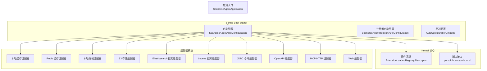
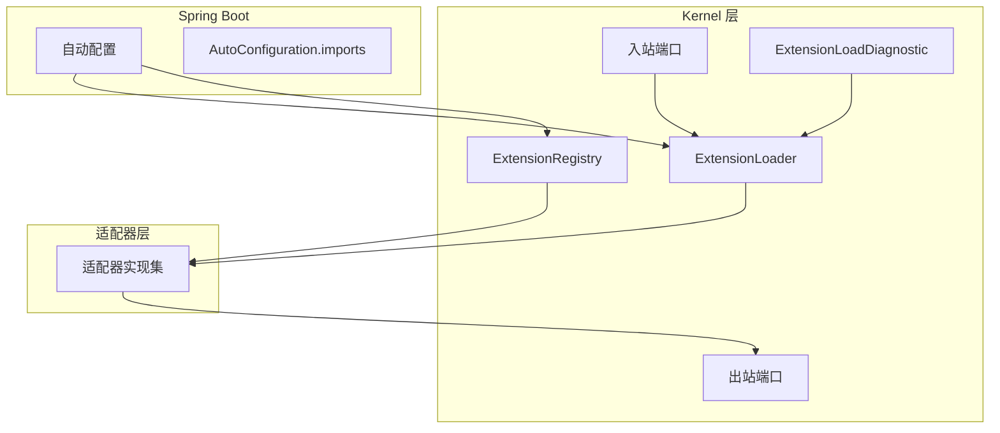
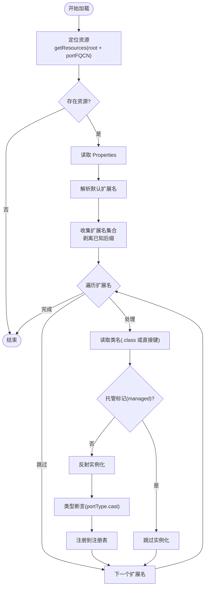
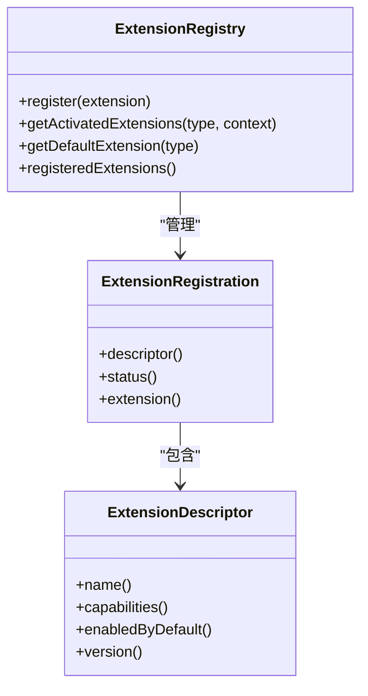
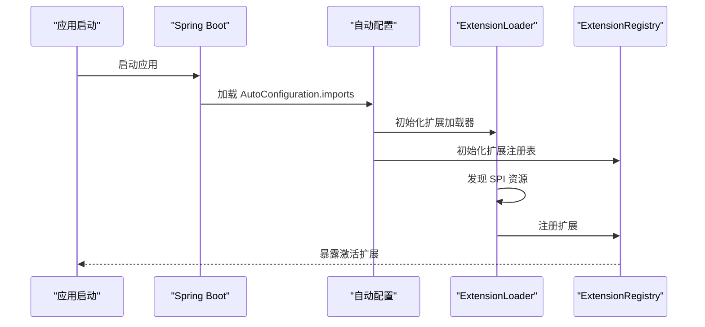
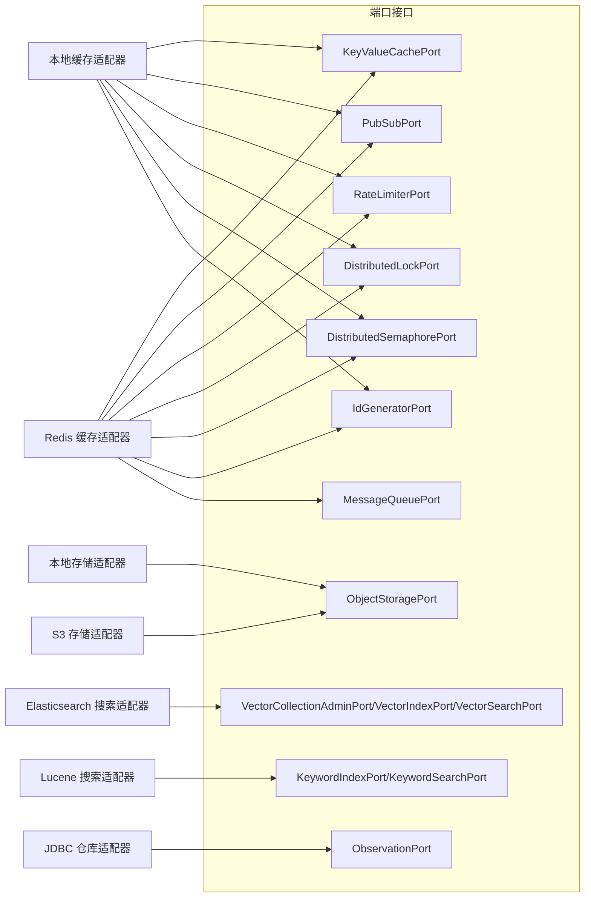
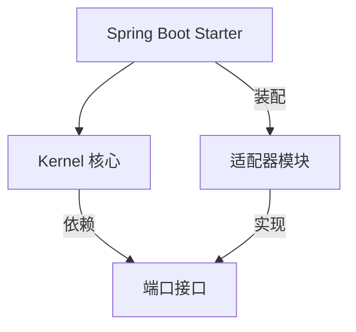

# 插件化架构

<cite>
**本文引用的文件**
- [ExtensionLoader.java](file://seahorse-agent-kernel/src/main/java/com/miracle/ai/seahorse/agent/kernel/plugin/ExtensionLoader.java)
- [ExtensionRegistry.java](file://seahorse-agent-kernel/src/main/java/com/miracle/ai/seahorse/agent/kernel/plugin/ExtensionRegistry.java)
- [ExtensionDescriptor.java](file://seahorse-agent-kernel/src/main/java/com/miracle/ai/seahorse/agent/kernel/plugin/ExtensionDescriptor.java)
- [ExtensionRegistration.java](file://seahorse-agent-kernel/src/main/java/com/miracle/ai/seahorse/agent/kernel/plugin/ExtensionRegistration.java)
- [ExtensionLoadDiagnostic.java](file://seahorse-agent-kernel/src/main/java/com/miracle/ai/seahorse/agent/kernel/plugin/ExtensionLoadDiagnostic.java)
- [ExtensionLoaderTests.java](file://seahorse-agent-tests/src/test/java/com/miracle/ai/seahorse/agent/kernel/plugin/ExtensionLoaderTests.java)
- [端口接口.md](file://docs/zh/content/后端系统/核心内核/端口接口/端口接口.md)
- [加载机制.md](file://docs/zh/content/后端系统/核心内核/插件系统/加载机制.md)
- [Spring Boot Starter 配置](file://seahorse-agent-spring-boot-starter/src/main/resources/META-INF/spring/org.springframework.boot.autoconfigure.AutoConfiguration.imports)
- [Spring Boot Starter 自动配置](file://seahorse-agent-spring-boot-starter/src/main/java/com/miracle/ai/seahorse/agent/adapters/spring/SeahorseAgentAutoConfiguration.java)
- [Spring Boot Starter 注册器](file://seahorse-agent-spring-boot-starter/src/main/java/com/miracle/ai/seahorse/agent/adapters/spring/SeahorseAgentRegistryAutoConfiguration.java)
- [Spring Boot Starter 核心模块](file://seahorse-agent-spring-boot-starter-core/pom.xml)
- [Spring Boot Starter 全量模块](file://seahorse-agent-spring-boot-starter-all/pom.xml)
- [适配器模块示例：本地缓存](file://seahorse-agent-adapter-cache-local/src/main/resources/META-INF/seahorse-agent/)
- [适配器模块示例：Redis 缓存](file://seahorse-agent-adapter-cache-redis/src/main/resources/META-INF/seahorse-agent/)
- [适配器模块示例：本地存储](file://seahorse-agent-adapter-storage-local/src/main/resources/META-INF/seahorse-agent/)
- [适配器模块示例：S3 存储](file://seahorse-agent-adapter-storage-s3/src/main/resources/META-INF/seahorse-agent/)
- [适配器模块示例：Elasticsearch 搜索](file://seahorse-agent-adapter-search-elasticsearch/src/main/resources/META-INF/seahorse-agent/)
- [适配器模块示例：Lucene 搜索](file://seahorse-agent-adapter-search-lucene/src/main/resources/META-INF/seahorse-agent/)
- [适配器模块示例：JDBC 仓库](file://seahorse-agent-adapter-repository-jdbc/src/main/resources/META-INF/seahorse-agent/)
- [适配器模块示例：OpenAPI](file://seahorse-agent-adapter-openapi/src/main/resources/META-INF/spring/)
- [适配器模块示例：MCP HTTP](file://seahorse-agent-adapter-mcp-http/src/main/resources/META-INF/)
- [适配器模块示例：Web 适配器](file://seahorse-agent-adapter-web/src/main/resources/META-INF/)
- [Bootstrap 应用入口](file://seahorse-agent-bootstrap/src/main/java/com/miracle/ai/seahorse/agent/SeahorseAgentApplication.java)
- [应用配置](file://seahorse-agent-bootstrap/src/main/resources/application.properties)
- [Docker Compose](file://docker-compose.yml)
- [Docker Compose Full](file://docker-compose.full.yml)
- [Dockerfile 后端](file://Dockerfile.backend)
- [部署脚本](file://deploy.sh)
- [部署脚本（Windows）](file://deploy.ps1)
- [项目根 POM](file://pom.xml)
</cite>

## 目录
1. [引言](#引言)
2. [项目结构](#项目结构)
3. [核心组件](#核心组件)
4. [架构总览](#架构总览)
5. [详细组件分析](#详细组件分析)
6. [依赖分析](#依赖分析)
7. [性能考虑](#性能考虑)
8. [故障排查指南](#故障排查指南)
9. [结论](#结论)
10. [附录](#附录)

## 引言
本文件系统性阐述 Seahorse Agent 微内核的插件化架构与实现，重点覆盖以下内容：
- 基于 SPI 的扩展点注册与动态加载机制
- 扩展生命周期管理（发现、加载、初始化、卸载）
- 插件与 Kernel 端口接口的交互与依赖注入
- 插件配置管理、版本控制与兼容性检查
- 插件开发指南（接口定义、实现规范、测试方法）
- 安全机制与沙箱隔离策略
- 性能优化与资源管理最佳实践

## 项目结构
Seahorse Agent 采用多模块分层架构，插件系统主要由 Kernel 核心与 Spring Boot Starter 提供装配能力，并通过适配器模块实现对外部系统的解耦接入。

**图表来源**
- [Spring Boot Starter 自动配置:1-200](file://seahorse-agent-spring-boot-starter/src/main/java/com/miracle/ai/seahorse/agent/adapters/spring/SeahorseAgentAutoConfiguration.java#L1-L200)
- [Spring Boot Starter 注册器:1-200](file://seahorse-agent-spring-boot-starter/src/main/java/com/miracle/ai/seahorse/agent/adapters/spring/SeahorseAgentRegistryAutoConfiguration.java#L1-L200)
- [Bootstrap 应用入口:1-200](file://seahorse-agent-bootstrap/src/main/java/com/miracle/ai/seahorse/agent/SeahorseAgentApplication.java#L1-L200)

**章节来源**
- [项目根 POM:1-200](file://pom.xml#L1-L200)
- [Spring Boot Starter 核心模块:1-200](file://seahorse-agent-spring-boot-starter-core/pom.xml#L1-L200)
- [Spring Boot Starter 全量模块:1-200](file://seahorse-agent-spring-boot-starter-all/pom.xml#L1-L200)

## 核心组件
- ExtensionLoader：负责基于 SPI 的扩展发现与实例化，支持托管标记、默认扩展解析与类型断言。
- ExtensionRegistry：维护扩展注册表，提供激活扩展查询、默认扩展选择与能力声明管理。
- ExtensionDescriptor：描述扩展元数据（名称、能力、启用状态、版本等）。
- ExtensionRegistration：封装扩展注册信息与生命周期状态。
- ExtensionLoadDiagnostic：提供加载阶段的诊断与异常报告能力。

**章节来源**
- [ExtensionLoader.java:1-200](file://seahorse-agent-kernel/src/main/java/com/miracle/ai/seahorse/agent/kernel/plugin/ExtensionLoader.java#L1-L200)
- [ExtensionRegistry.java:1-200](file://seahorse-agent-kernel/src/main/java/com/miracle/ai/seahorse/agent/kernel/plugin/ExtensionRegistry.java#L1-L200)
- [ExtensionDescriptor.java:1-200](file://seahorse-agent-kernel/src/main/java/com/miracle/ai/seahorse/agent/kernel/plugin/ExtensionDescriptor.java#L1-L200)
- [ExtensionRegistration.java:1-200](file://seahorse-agent-kernel/src/main/java/com/miracle/ai/seahorse/agent/kernel/plugin/ExtensionRegistration.java#L1-L200)
- [ExtensionLoadDiagnostic.java:1-200](file://seahorse-agent-kernel/src/main/java/com/miracle/ai/seahorse/agent/kernel/plugin/ExtensionLoadDiagnostic.java#L1-L200)

## 架构总览
插件系统围绕“端口接口 + 适配器实现”的整洁架构展开，Kernel 通过 ExtensionLoader 动态加载适配器模块中声明的 SPI 实现，再由 ExtensionRegistry 统一管理扩展的激活与依赖关系。Spring Boot Starter 负责自动装配与条件化启用，确保在运行时正确加载所需插件。

**图表来源**
- [端口接口.md:38-49](file://docs/zh/content/后端系统/核心内核/端口接口/端口接口.md#L38-L49)
- [Spring Boot Starter 配置:1-200](file://seahorse-agent-spring-boot-starter/src/main/resources/META-INF/spring/org.springframework.boot.autoconfigure.AutoConfiguration.imports#L1-L200)
- [Spring Boot Starter 自动配置:1-200](file://seahorse-agent-spring-boot-starter/src/main/java/com/miracle/ai/seahorse/agent/adapters/spring/SeahorseAgentAutoConfiguration.java#L1-L200)

## 详细组件分析

### ExtensionLoader：基于 SPI 的动态加载算法
- 资源发现：通过 classpath 查找 META-INF/seahorse-agent 下的 SPI 资源文件，文件名对应端口接口全限定名。
- 类加载与实例化：读取 Properties 中的扩展名，过滤托管扩展，反射实例化并进行类型断言。
- 默认扩展解析：从资源中解析默认扩展名，用于未显式指定时的回退。
- 错误处理：结合 ExtensionLoadDiagnostic 捕获加载异常并生成诊断报告。

**图表来源**
- [ExtensionLoader.java:95-114](file://seahorse-agent-kernel/src/main/java/com/miracle/ai/seahorse/agent/kernel/plugin/ExtensionLoader.java#L95-L114)
- [ExtensionLoader.java:156-171](file://seahorse-agent-kernel/src/main/java/com/miracle/ai/seahorse/agent/kernel/plugin/ExtensionLoader.java#L156-L171)
- [ExtensionLoader.java:227-238](file://seahorse-agent-kernel/src/main/java/com/miracle/ai/seahorse/agent/kernel/plugin/ExtensionLoader.java#L227-L238)

**章节来源**
- [ExtensionLoader.java:1-200](file://seahorse-agent-kernel/src/main/java/com/miracle/ai/seahorse/agent/kernel/plugin/ExtensionLoader.java#L1-L200)
- [加载机制.md:150-175](file://docs/zh/content/后端系统/核心内核/插件系统/加载机制.md#L150-L175)

### ExtensionRegistry：扩展注册与激活管理
- 注册：将通过 ExtensionLoader 发现并实例化的扩展注册到注册表。
- 查找：根据端口类型与激活上下文查询已激活扩展，支持默认扩展与能力匹配。
- 排序：依据扩展优先级与依赖关系进行排序，确保加载顺序可控。
- 生命周期：与 ExtensionRegistration 协作，跟踪扩展状态（已注册、已激活、已停用）。

**图表来源**
- [ExtensionRegistry.java:1-200](file://seahorse-agent-kernel/src/main/java/com/miracle/ai/seahorse/agent/kernel/plugin/ExtensionRegistry.java#L1-L200)
- [ExtensionRegistration.java:1-200](file://seahorse-agent-kernel/src/main/java/com/miracle/ai/seahorse/agent/kernel/plugin/ExtensionRegistration.java#L1-L200)
- [ExtensionDescriptor.java:1-200](file://seahorse-agent-kernel/src/main/java/com/miracle/ai/seahorse/agent/kernel/plugin/ExtensionDescriptor.java#L1-L200)

**章节来源**
- [ExtensionRegistry.java:1-200](file://seahorse-agent-kernel/src/main/java/com/miracle/ai/seahorse/agent/kernel/plugin/ExtensionRegistry.java#L1-L200)
- [ExtensionRegistration.java:1-200](file://seahorse-agent-kernel/src/main/java/com/miracle/ai/seahorse/agent/kernel/plugin/ExtensionRegistration.java#L1-L200)
- [ExtensionDescriptor.java:1-200](file://seahorse-agent-kernel/src/main/java/com/miracle/ai/seahorse/agent/kernel/plugin/ExtensionDescriptor.java#L1-L200)

### ExtensionLoadDiagnostic：加载诊断与异常报告
- 捕获：在扩展加载过程中捕获异常，记录失败原因与扩展名。
- 报告：提供统一的诊断输出，便于定位 SPI 资源缺失、类加载失败或类型不匹配等问题。

**章节来源**
- [ExtensionLoadDiagnostic.java:1-200](file://seahorse-agent-kernel/src/main/java/com/miracle/ai/seahorse/agent/kernel/plugin/ExtensionLoadDiagnostic.java#L1-L200)

### Spring Boot Starter：自动装配与条件化启用
- AutoConfiguration.imports：集中声明自动配置类，简化插件系统的装配。
- SeahorseAgentAutoConfiguration：主自动配置类，负责初始化 Kernel 与插件系统。
- SeahorseAgentRegistryAutoConfiguration：注册器自动配置，负责扩展注册与激活。
- 条件化启用：结合特性开关与环境变量，按需启用特定扩展。

**图表来源**
- [Spring Boot Starter 配置:1-200](file://seahorse-agent-spring-boot-starter/src/main/resources/META-INF/spring/org.springframework.boot.autoconfigure.AutoConfiguration.imports#L1-L200)
- [Spring Boot Starter 自动配置:1-200](file://seahorse-agent-spring-boot-starter/src/main/java/com/miracle/ai/seahorse/agent/adapters/spring/SeahorseAgentAutoConfiguration.java#L1-L200)
- [Spring Boot Starter 注册器:1-200](file://seahorse-agent-spring-boot-starter/src/main/java/com/miracle/ai/seahorse/agent/adapters/spring/SeahorseAgentRegistryAutoConfiguration.java#L1-L200)

**章节来源**
- [Spring Boot Starter 配置:1-200](file://seahorse-agent-spring-boot-starter/src/main/resources/META-INF/spring/org.springframework.boot.autoconfigure.AutoConfiguration.imports#L1-L200)
- [Spring Boot Starter 自动配置:1-200](file://seahorse-agent-spring-boot-starter/src/main/java/com/miracle/ai/seahorse/agent/adapters/spring/SeahorseAgentAutoConfiguration.java#L1-L200)
- [Spring Boot Starter 注册器:1-200](file://seahorse-agent-spring-boot-starter/src/main/java/com/miracle/ai/seahorse/agent/adapters/spring/SeahorseAgentRegistryAutoConfiguration.java#L1-L200)

### 适配器模块：端口接口的实现与依赖注入
- 本地缓存适配器：实现 KeyValueCachePort、PubSubPort、RateLimiterPort、DistributedLockPort、DistributedSemaphorePort、IdGeneratorPort。
- Redis 缓存适配器：实现与本地缓存相同的端口接口，并扩展 StreamTaskPort。
- 本地存储适配器：实现 ObjectStoragePort。
- S3 存储适配器：实现 ObjectStoragePort。
- Elasticsearch 搜索适配器：实现 VectorCollectionAdminPort、VectorIndexPort、VectorSearchPort。
- Lucene 搜索适配器：实现 KeywordIndexPort、KeywordSearchPort。
- JDBC 仓库适配器：实现大量领域仓库端口接口。
- OpenAPI 适配器：通过 Spring 配置集成 OpenAPI 规范解析。
- MCP HTTP 适配器：实现工具调用与参数提取。
- Web 适配器：提供 Web 层适配与暴露。

**图表来源**
- [适配器模块示例：本地缓存:1-200](file://seahorse-agent-adapter-cache-local/src/main/resources/META-INF/seahorse-agent/com.miracle.ai.seahorse.agent.ports.outbound.cache.KeyValueCachePort#L1-L200)
- [适配器模块示例：Redis 缓存:1-200](file://seahorse-agent-adapter-cache-redis/src/main/resources/META-INF/seahorse-agent/com.miracle.ai.seahorse.agent.ports.outbound.cache.KeyValueCachePort#L1-L200)
- [适配器模块示例：本地存储:1-200](file://seahorse-agent-adapter-storage-local/src/main/resources/META-INF/seahorse-agent/com.miracle.ai.seahorse.agent.ports.outbound.storage.ObjectStoragePort#L1-L200)
- [适配器模块示例：S3 存储:1-200](file://seahorse-agent-adapter-storage-s3/src/main/resources/META-INF/seahorse-agent/com.miracle.ai.seahorse.agent.ports.outbound.storage.ObjectStoragePort#L1-L200)
- [适配器模块示例：Elasticsearch 搜索:1-200](file://seahorse-agent-adapter-search-elasticsearch/src/main/resources/META-INF/seahorse-agent/com.miracle.ai.seahorse.agent.ports.outbound.vector.VectorCollectionAdminPort#L1-L200)
- [适配器模块示例：Lucene 搜索:1-200](file://seahorse-agent-adapter-search-lucene/src/main/resources/META-INF/seahorse-agent/com.miracle.ai.seahorse.agent.ports.outbound.cache.KeyValueCachePort#L1-L200)
- [适配器模块示例：JDBC 仓库:1-200](file://seahorse-agent-adapter-repository-jdbc/src/main/resources/META-INF/seahorse-agent/com.miracle.ai.seahorse.agent.ports.outbound.observation.ObservationPort#L1-L200)

**章节来源**
- [适配器模块示例：本地缓存](file://seahorse-agent-adapter-cache-local/src/main/resources/META-INF/seahorse-agent/)
- [适配器模块示例：Redis 缓存](file://seahorse-agent-adapter-cache-redis/src/main/resources/META-INF/seahorse-agent/)
- [适配器模块示例：本地存储](file://seahorse-agent-adapter-storage-local/src/main/resources/META-INF/seahorse-agent/)
- [适配器模块示例：S3 存储](file://seahorse-agent-adapter-storage-s3/src/main/resources/META-INF/seahorse-agent/)
- [适配器模块示例：Elasticsearch 搜索](file://seahorse-agent-adapter-search-elasticsearch/src/main/resources/META-INF/seahorse-agent/)
- [适配器模块示例：Lucene 搜索](file://seahorse-agent-adapter-search-lucene/src/main/resources/META-INF/seahorse-agent/)
- [适配器模块示例：JDBC 仓库](file://seahorse-agent-adapter-repository-jdbc/src/main/resources/META-INF/seahorse-agent/)
- [适配器模块示例：OpenAPI](file://seahorse-agent-adapter-openapi/src/main/resources/META-INF/spring/)
- [适配器模块示例：MCP HTTP](file://seahorse-agent-adapter-mcp-http/src/main/resources/META-INF/)
- [适配器模块示例：Web 适配器](file://seahorse-agent-adapter-web/src/main/resources/META-INF/)

## 依赖分析
- Kernel 与适配器：Kernel 仅依赖端口接口，适配器实现具体端口，形成清晰的依赖方向。
- Spring Boot Starter：作为装配层，向上依赖 Kernel，向下依赖各适配器模块。
- 版本与兼容性：通过 ExtensionDescriptor.version 与能力声明（capabilities）实现版本与兼容性检查；测试用例验证默认扩展与激活顺序。

**图表来源**
- [端口接口.md:38-49](file://docs/zh/content/后端系统/核心内核/端口接口/端口接口.md#L38-L49)
- [ExtensionDescriptor.java:1-200](file://seahorse-agent-kernel/src/main/java/com/miracle/ai/seahorse/agent/kernel/plugin/ExtensionDescriptor.java#L1-L200)

**章节来源**
- [ExtensionDescriptor.java:1-200](file://seahorse-agent-kernel/src/main/java/com/miracle/ai/seahorse/agent/kernel/plugin/ExtensionDescriptor.java#L1-L200)
- [ExtensionLoaderTests.java:35-66](file://seahorse-agent-tests/src/test/java/com/miracle/ai/seahorse/agent/kernel/plugin/ExtensionLoaderTests.java#L35-L66)

## 性能考虑
- SPI 资源扫描：建议将 SPI 资源文件数量控制在合理范围，避免过多端口导致扫描开销增大。
- 类加载与反射：尽量减少反射实例化的次数，可引入缓存或延迟加载策略。
- 内存管理：及时释放不再使用的扩展实例，避免内存泄漏；对大规模扩展场景建议分批加载。
- 并发安全：在多线程环境下访问扩展注册表时，确保线程安全与一致性。
- 诊断与监控：利用 ExtensionLoadDiagnostic 输出加载日志，结合 Micrometer 观察指标进行性能评估。

## 故障排查指南
- SPI 资源缺失：确认 META-INF/seahorse-agent 下的资源文件是否正确命名且包含目标端口接口的全限定名。
- 类加载失败：检查扩展类是否在 classpath 中可见，且无版本冲突。
- 类型不匹配：确保扩展实现类实现了正确的端口接口，类型断言应通过。
- 托管扩展：若扩展被标记为托管，将跳过实例化，需检查托管标记配置。
- 诊断输出：通过 ExtensionLoadDiagnostic 获取详细的加载错误信息，定位问题根因。

**章节来源**
- [ExtensionLoadDiagnostic.java:1-200](file://seahorse-agent-kernel/src/main/java/com/miracle/ai/seahorse/agent/kernel/plugin/ExtensionLoadDiagnostic.java#L1-L200)
- [加载机制.md:150-175](file://docs/zh/content/后端系统/核心内核/插件系统/加载机制.md#L150-L175)

## 结论
Seahorse Agent 的插件化架构通过 Kernel 的端口接口与 Spring Boot Starter 的自动装配，结合基于 SPI 的动态加载机制，实现了高内聚、低耦合的扩展体系。ExtensionLoader、ExtensionRegistry 与 ExtensionDescriptor 共同构成了扩展生命周期管理的核心，配合 ExtensionLoadDiagnostic 提供了完善的诊断能力。适配器模块以端口接口为契约，屏蔽外部系统差异，满足企业级 AI Infra 的可扩展性与可演进性需求。

## 附录
- 开发者快速入门：参考端口接口文档与适配器示例，实现新的端口接口与适配器。
- 部署与运行：通过 Bootstrap 应用入口与 Docker Compose 进行本地与容器化部署。
- 测试方法：参考 ExtensionLoaderTests 的测试用例，验证扩展加载、默认扩展与激活顺序。

**章节来源**
- [Bootstrap 应用入口:1-200](file://seahorse-agent-bootstrap/src/main/java/com/miracle/ai/seahorse/agent/SeahorseAgentApplication.java#L1-L200)
- [应用配置:1-200](file://seahorse-agent-bootstrap/src/main/resources/application.properties#L1-L200)
- [Docker Compose:1-200](file://docker-compose.yml#L1-L200)
- [Docker Compose Full:1-200](file://docker-compose.full.yml#L1-L200)
- [Dockerfile 后端:1-200](file://Dockerfile.backend#L1-L200)
- [部署脚本:1-200](file://deploy.sh#L1-L200)
- [部署脚本（Windows）:1-200](file://deploy.ps1#L1-L200)
- [端口接口.md:38-49](file://docs/zh/content/后端系统/核心内核/端口接口/端口接口.md#L38-L49)
- [ExtensionLoaderTests.java:35-66](file://seahorse-agent-tests/src/test/java/com/miracle/ai/seahorse/agent/kernel/plugin/ExtensionLoaderTests.java#L35-L66)