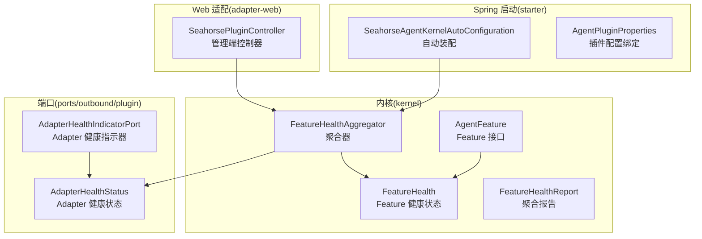
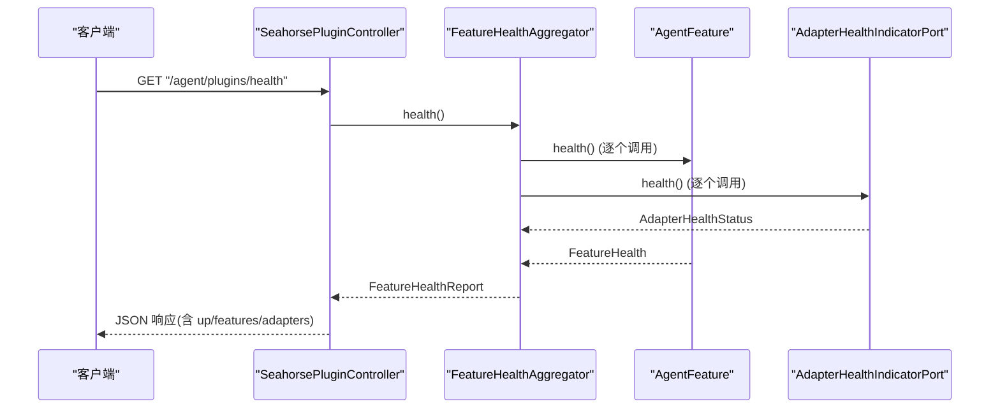
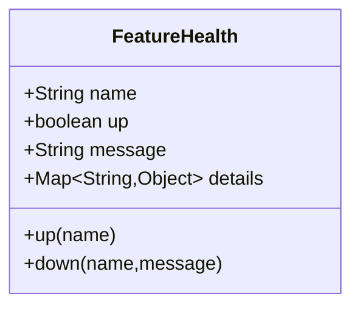
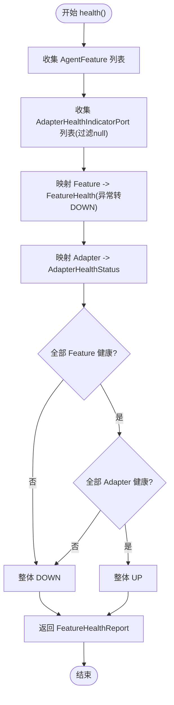
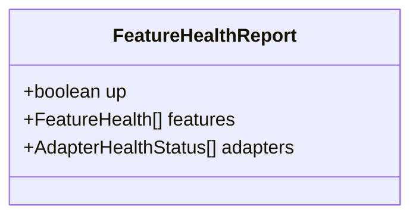
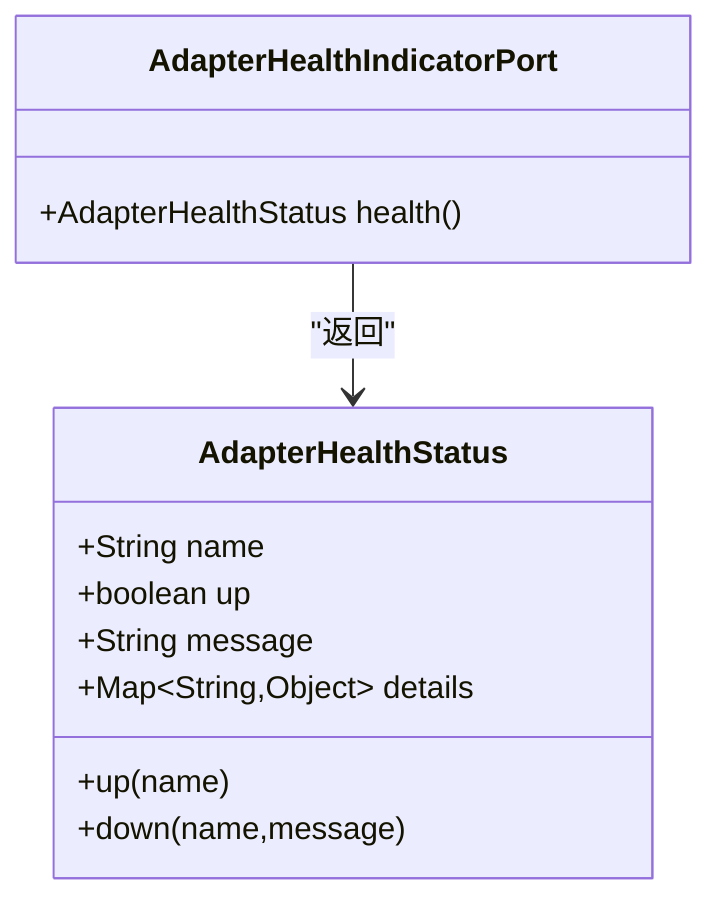
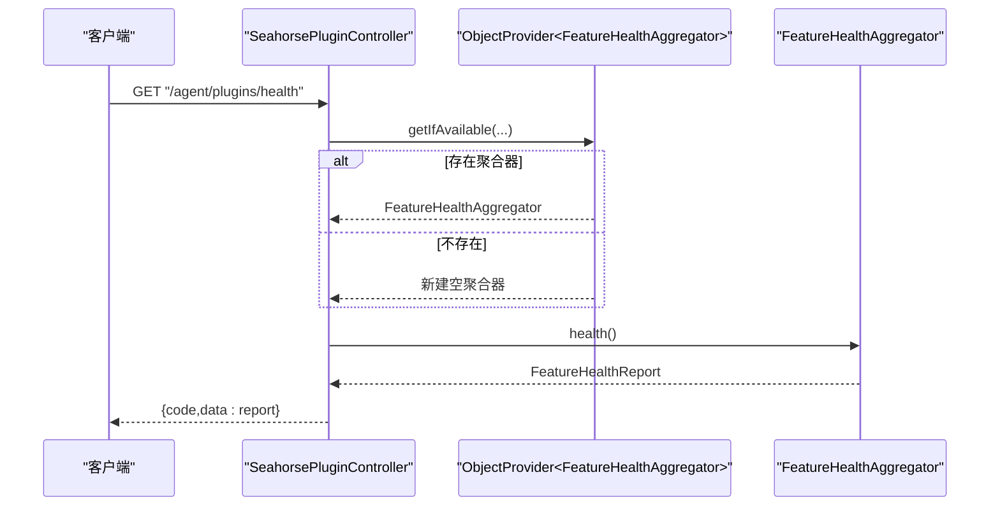
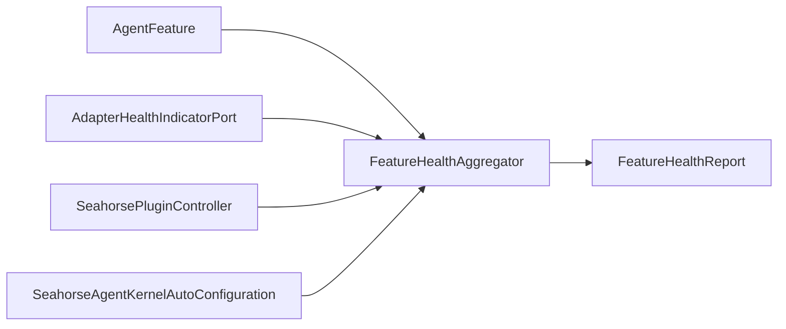

# 插件健康监控

<cite>
**本文引用的文件**
- [FeatureHealth.java](file://seahorse-agent-kernel/src/main/java/com/miracle/ai/seahorse/agent/kernel/plugin/FeatureHealth.java)
- [FeatureHealthAggregator.java](file://seahorse-agent-kernel/src/main/java/com/miracle/ai/seahorse/agent/kernel/plugin/FeatureHealthAggregator.java)
- [FeatureHealthReport.java](file://seahorse-agent-kernel/src/main/java/com/miracle/ai/seahorse/agent/kernel/plugin/FeatureHealthReport.java)
- [AdapterHealthIndicatorPort.java](file://seahorse-agent-kernel/src/main/java/com/miracle/ai/seahorse/agent/ports/outbound/plugin/AdapterHealthIndicatorPort.java)
- [AdapterHealthStatus.java](file://seahorse-agent-kernel/src/main/java/com/miracle/ai/seahorse/agent/ports/outbound/plugin/AdapterHealthStatus.java)
- [AgentFeature.java](file://seahorse-agent-kernel/src/main/java/com/miracle/ai/seahorse/agent/kernel/plugin/AgentFeature.java)
- [SeahorsePluginController.java](file://seahorse-agent-adapter-web/src/main/java/com/miracle/ai/seahorse/agent/adapters/web/SeahorsePluginController.java)
- [SeahorseAgentKernelAutoConfiguration.java](file://seahorse-agent-spring-boot-starter/src/main/java/com/miracle/ai/seahorse/agent/adapters/spring/SeahorseAgentKernelAutoConfiguration.java)
- [AgentPluginProperties.java](file://seahorse-agent-spring-boot-starter/src/main/java/com/miracle/ai/seahorse/agent/adapters/spring/config/AgentPluginProperties.java)
- [FeatureHealthAggregatorTests.java](file://seahorse-agent-tests/src/test/java/com/miracle/ai/seahorse/agent/kernel/plugin/FeatureHealthAggregatorTests.java)
</cite>

## 目录
1. [简介](#简介)
2. [项目结构](#项目结构)
3. [核心组件](#核心组件)
4. [架构总览](#架构总览)
5. [组件详解](#组件详解)
6. [依赖关系分析](#依赖关系分析)
7. [性能考量](#性能考量)
8. [故障排查指南](#故障排查指南)
9. [结论](#结论)
10. [附录](#附录)

## 简介
本文件系统化阐述插件健康监控体系，围绕 FeatureHealth 健康状态管理、FeatureHealthAggregator 聚合机制、FeatureHealthReport 报告生成、AdapterHealthIndicatorPort 健康指示器接口以及与 Web 控制器的集成方式，帮助开发者快速构建稳定可靠的插件监控与诊断能力。

## 项目结构
健康监控相关代码主要分布在以下模块：
- kernel 层：定义 Feature 健康模型、聚合器、报告模型与默认健康接口
- ports/outbound/plugin：定义 Adapter 健康指示器端口与状态模型
- spring-boot-starter：自动装配 Bean（如 FeatureHealthAggregator），并提供配置绑定
- adapter-web：对外暴露 /agent/plugins/health 等管理端接口
- tests：对聚合器行为进行单元测试验证

图表来源
- [FeatureHealth.java:33-66](file://seahorse-agent-kernel/src/main/java/com/miracle/ai/seahorse/agent/kernel/plugin/FeatureHealth.java#L33-L66)
- [FeatureHealthReport.java:32-42](file://seahorse-agent-kernel/src/main/java/com/miracle/ai/seahorse/agent/kernel/plugin/FeatureHealthReport.java#L32-L42)
- [FeatureHealthAggregator.java:31-62](file://seahorse-agent-kernel/src/main/java/com/miracle/ai/seahorse/agent/kernel/plugin/FeatureHealthAggregator.java#L31-L62)
- [AdapterHealthIndicatorPort.java:23-26](file://seahorse-agent-kernel/src/main/java/com/miracle/ai/seahorse/agent/ports/outbound/plugin/AdapterHealthIndicatorPort.java#L23-L26)
- [AdapterHealthStatus.java:31-46](file://seahorse-agent-kernel/src/main/java/com/miracle/ai/seahorse/agent/ports/outbound/plugin/AdapterHealthStatus.java#L31-L46)
- [AgentFeature.java:26-79](file://seahorse-agent-kernel/src/main/java/com/miracle/ai/seahorse/agent/kernel/plugin/AgentFeature.java#L26-L79)
- [SeahorseAgentKernelAutoConfiguration.java:202-209](file://seahorse-agent-spring-boot-starter/src/main/java/com/miracle/ai/seahorse/agent/adapters/spring/SeahorseAgentKernelAutoConfiguration.java#L202-L209)
- [SeahorsePluginController.java:40-62](file://seahorse-agent-adapter-web/src/main/java/com/miracle/ai/seahorse/agent/adapters/web/SeahorsePluginController.java#L40-L62)

章节来源
- [FeatureHealth.java:23-66](file://seahorse-agent-kernel/src/main/java/com/miracle/ai/seahorse/agent/kernel/plugin/FeatureHealth.java#L23-L66)
- [FeatureHealthAggregator.java:26-62](file://seahorse-agent-kernel/src/main/java/com/miracle/ai/seahorse/agent/kernel/plugin/FeatureHealthAggregator.java#L26-L62)
- [AdapterHealthStatus.java:23-46](file://seahorse-agent-kernel/src/main/java/com/miracle/ai/seahorse/agent/ports/outbound/plugin/AdapterHealthStatus.java#L23-L46)
- [SeahorseAgentKernelAutoConfiguration.java:202-209](file://seahorse-agent-spring-boot-starter/src/main/java/com/miracle/ai/seahorse/agent/adapters/spring/SeahorseAgentKernelAutoConfiguration.java#L202-L209)
- [SeahorsePluginController.java:40-62](file://seahorse-agent-adapter-web/src/main/java/com/miracle/ai/seahorse/agent/adapters/web/SeahorsePluginController.java#L40-L62)

## 核心组件
- FeatureHealth：记录单个 Feature 的健康状态，包含名称、是否健康、消息与额外详情。提供 up/down 静态工厂方法，默认健康状态为 UP。
- AdapterHealthStatus：记录 Adapter 的健康状态，包含名称、是否健康、消息与详情 Map。提供 up/down 静态工厂方法。
- AdapterHealthIndicatorPort：Adapter 健康检查端口，仅暴露 health() 方法返回 AdapterHealthStatus。
- AgentFeature：Feature 基础接口，默认 health() 返回 FeatureHealth.up(name())；可由具体 Feature 覆盖实现更严格的健康检查。
- FeatureHealthAggregator：聚合器，负责收集所有 AgentFeature 与 AdapterHealthIndicatorPort 的健康状态，并计算整体 up/down。
- FeatureHealthReport：聚合结果载体，包含整体 up、Feature 健康列表与 Adapter 健康列表。
- SeahorsePluginController：Web 控制器，提供 /agent/plugins/health 接口，返回 FeatureHealthReport。
- SeahorseAgentKernelAutoConfiguration：自动装配 FeatureHealthAggregator，按 Spring 容器中的 AgentFeature 与 AdapterHealthIndicatorPort 实例进行装配。
- AgentPluginProperties：Spring Boot 配置绑定，支持插件默认启用与按 Feature 名称的启用开关、透传配置。

章节来源
- [FeatureHealth.java:23-66](file://seahorse-agent-kernel/src/main/java/com/miracle/ai/seahorse/agent/kernel/plugin/FeatureHealth.java#L23-L66)
- [AdapterHealthStatus.java:23-46](file://seahorse-agent-kernel/src/main/java/com/miracle/ai/seahorse/agent/ports/outbound/plugin/AdapterHealthStatus.java#L23-L46)
- [AdapterHealthIndicatorPort.java:23-26](file://seahorse-agent-kernel/src/main/java/com/miracle/ai/seahorse/agent/ports/outbound/plugin/AdapterHealthIndicatorPort.java#L23-L26)
- [AgentFeature.java:26-79](file://seahorse-agent-kernel/src/main/java/com/miracle/ai/seahorse/agent/kernel/plugin/AgentFeature.java#L26-L79)
- [FeatureHealthAggregator.java:26-62](file://seahorse-agent-kernel/src/main/java/com/miracle/ai/seahorse/agent/kernel/plugin/FeatureHealthAggregator.java#L26-L62)
- [FeatureHealthReport.java:25-42](file://seahorse-agent-kernel/src/main/java/com/miracle/ai/seahorse/agent/kernel/plugin/FeatureHealthReport.java#L25-L42)
- [SeahorsePluginController.java:40-62](file://seahorse-agent-adapter-web/src/main/java/com/miracle/ai/seahorse/agent/adapters/web/SeahorsePluginController.java#L40-L62)
- [SeahorseAgentKernelAutoConfiguration.java:202-209](file://seahorse-agent-spring-boot-starter/src/main/java/com/miracle/ai/seahorse/agent/adapters/spring/SeahorseAgentKernelAutoConfiguration.java#L202-L209)
- [AgentPluginProperties.java:30-63](file://seahorse-agent-spring-boot-starter/src/main/java/com/miracle/ai/seahorse/agent/adapters/spring/config/AgentPluginProperties.java#L30-L63)

## 架构总览
健康监控采用“内核定义 + 端口约束 + 适配器实现 + Web 暴露”的分层设计。Feature 健康检查与 Adapter 健康检查分别由各自端口实现，最终由聚合器统一汇总，供 Web 控制器对外输出。

图表来源
- [SeahorsePluginController.java:58-62](file://seahorse-agent-adapter-web/src/main/java/com/miracle/ai/seahorse/agent/adapters/web/SeahorsePluginController.java#L58-L62)
- [FeatureHealthAggregator.java:42-53](file://seahorse-agent-kernel/src/main/java/com/miracle/ai/seahorse/agent/kernel/plugin/FeatureHealthAggregator.java#L42-L53)
- [AdapterHealthIndicatorPort.java:23-26](file://seahorse-agent-kernel/src/main/java/com/miracle/ai/seahorse/agent/ports/outbound/plugin/AdapterHealthIndicatorPort.java#L23-L26)
- [AgentFeature.java:69-78](file://seahorse-agent-kernel/src/main/java/com/miracle/ai/seahorse/agent/kernel/plugin/AgentFeature.java#L69-L78)

## 组件详解

### FeatureHealth 健康状态管理
- 数据结构：包含 name、up、message、details 四要素，均提供默认值保障健壮性。
- 工厂方法：up(name) 与 down(name, message) 快速构造健康状态。
- 设计要点：默认 Feature 健康检查返回 UP，具体 Feature 可覆盖 health() 实现更严格检查；异常情况会转为 DOWN 并携带错误消息。

图表来源
- [FeatureHealth.java:33-66](file://seahorse-agent-kernel/src/main/java/com/miracle/ai/seahorse/agent/kernel/plugin/FeatureHealth.java#L33-L66)

章节来源
- [FeatureHealth.java:23-66](file://seahorse-agent-kernel/src/main/java/com/miracle/ai/seahorse/agent/kernel/plugin/FeatureHealth.java#L23-L66)
- [AgentFeature.java:69-78](file://seahorse-agent-kernel/src/main/java/com/miracle/ai/seahorse/agent/kernel/plugin/AgentFeature.java#L69-L78)

### FeatureHealthAggregator 聚合机制
- 输入：AgentFeature 列表与 AdapterHealthIndicatorPort 列表（过滤空值）。
- 处理：对每个 AgentFeature 调用 health()，捕获运行时异常并转为 FeatureHealth.DOWN；对每个 Adapter 调用 health()。
- 输出：整体 up 条件为“所有 Feature 健康且所有 Adapter 健康”，否则为 DOWN。
- 线程安全：内部集合为只读副本，避免并发修改。

图表来源
- [FeatureHealthAggregator.java:42-53](file://seahorse-agent-kernel/src/main/java/com/miracle/ai/seahorse/agent/kernel/plugin/FeatureHealthAggregator.java#L42-L53)

章节来源
- [FeatureHealthAggregator.java:26-62](file://seahorse-agent-kernel/src/main/java/com/miracle/ai/seahorse/agent/kernel/plugin/FeatureHealthAggregator.java#L26-L62)
- [FeatureHealthAggregatorTests.java:29-51](file://seahorse-agent-tests/src/test/java/com/miracle/ai/seahorse/agent/kernel/plugin/FeatureHealthAggregatorTests.java#L29-L51)

### FeatureHealthReport 报告生成
- 结构：包含 up、features（FeatureHealth 列表）、adapters（AdapterHealthStatus 列表）。
- 不可变性：构造时对集合进行防御性复制，确保线程安全与只读语义。
- 使用场景：Web 控制器直接返回该对象，便于前端展示与自动化监控系统消费。

图表来源
- [FeatureHealthReport.java:32-42](file://seahorse-agent-kernel/src/main/java/com/miracle/ai/seahorse/agent/kernel/plugin/FeatureHealthReport.java#L32-L42)

章节来源
- [FeatureHealthReport.java:25-42](file://seahorse-agent-kernel/src/main/java/com/miracle/ai/seahorse/agent/kernel/plugin/FeatureHealthReport.java#L25-L42)

### AdapterHealthIndicatorPort 健康指示器接口
- 角色：Adapter 对外暴露健康检查能力的统一端口。
- 实现：各 Adapter 实现 health() 返回 AdapterHealthStatus，可携带名称、健康标志、消息与诊断详情。
- 典型用途：数据库连接、缓存集群、消息队列、向量库等外部依赖的可用性检查。

图表来源
- [AdapterHealthIndicatorPort.java:23-26](file://seahorse-agent-kernel/src/main/java/com/miracle/ai/seahorse/agent/ports/outbound/plugin/AdapterHealthIndicatorPort.java#L23-L26)
- [AdapterHealthStatus.java:31-46](file://seahorse-agent-kernel/src/main/java/com/miracle/ai/seahorse/agent/ports/outbound/plugin/AdapterHealthStatus.java#L31-L46)

章节来源
- [AdapterHealthIndicatorPort.java:20-26](file://seahorse-agent-kernel/src/main/java/com/miracle/ai/seahorse/agent/ports/outbound/plugin/AdapterHealthIndicatorPort.java#L20-L26)
- [AdapterHealthStatus.java:23-46](file://seahorse-agent-kernel/src/main/java/com/miracle/ai/seahorse/agent/ports/outbound/plugin/AdapterHealthStatus.java#L23-L46)

### Web 控制器集成与报告分发
- 接口：GET /agent/plugins/health 返回 FeatureHealthReport。
- 依赖注入：通过 ObjectProvider 获取 FeatureHealthAggregator，若不存在则使用空列表构造临时聚合器。
- 分发：响应体包含 code 与 data（即 FeatureHealthReport），便于前端与监控系统统一解析。

图表来源
- [SeahorsePluginController.java:58-62](file://seahorse-agent-adapter-web/src/main/java/com/miracle/ai/seahorse/agent/adapters/web/SeahorsePluginController.java#L58-L62)

章节来源
- [SeahorsePluginController.java:40-62](file://seahorse-agent-adapter-web/src/main/java/com/miracle/ai/seahorse/agent/adapters/web/SeahorsePluginController.java#L40-L62)

### Spring 自动装配与配置绑定
- 自动装配：在缺少 Bean 时，自动创建 FeatureHealthAggregator，按容器中已注册的 AgentFeature 与 AdapterHealthIndicatorPort 顺序装配。
- 配置绑定：AgentPluginProperties 支持 seahorse-agent.plugins.* 前缀的配置，提供默认启用与按 Feature 名称的启用开关、透传配置，便于在启动期决定 Feature 的激活状态。

章节来源
- [SeahorseAgentKernelAutoConfiguration.java:202-209](file://seahorse-agent-spring-boot-starter/src/main/java/com/miracle/ai/seahorse/agent/adapters/spring/SeahorseAgentKernelAutoConfiguration.java#L202-L209)
- [AgentPluginProperties.java:30-63](file://seahorse-agent-spring-boot-starter/src/main/java/com/miracle/ai/seahorse/agent/adapters/spring/config/AgentPluginProperties.java#L30-L63)

## 依赖关系分析
- 聚合器耦合：FeatureHealthAggregator 依赖 AgentFeature 与 AdapterHealthIndicatorPort，二者均为接口，降低耦合度。
- 端口契约：AdapterHealthIndicatorPort 仅暴露 health()，职责单一，易于替换与扩展。
- Web 层解耦：SeahorsePluginController 通过 ObjectProvider 延迟获取聚合器，避免循环依赖与启动失败风险。
- 测试验证：FeatureHealthAggregatorTests 验证了聚合逻辑与异常处理路径。

图表来源
- [FeatureHealthAggregator.java:31-62](file://seahorse-agent-kernel/src/main/java/com/miracle/ai/seahorse/agent/kernel/plugin/FeatureHealthAggregator.java#L31-L62)
- [SeahorseAgentKernelAutoConfiguration.java:202-209](file://seahorse-agent-spring-boot-starter/src/main/java/com/miracle/ai/seahorse/agent/adapters/spring/SeahorseAgentKernelAutoConfiguration.java#L202-L209)
- [SeahorsePluginController.java:40-62](file://seahorse-agent-adapter-web/src/main/java/com/miracle/ai/seahorse/agent/adapters/web/SeahorsePluginController.java#L40-L62)

章节来源
- [FeatureHealthAggregator.java:26-62](file://seahorse-agent-kernel/src/main/java/com/miracle/ai/seahorse/agent/kernel/plugin/FeatureHealthAggregator.java#L26-L62)
- [FeatureHealthAggregatorTests.java:29-51](file://seahorse-agent-tests/src/test/java/com/miracle/ai/seahorse/agent/kernel/plugin/FeatureHealthAggregatorTests.java#L29-L51)

## 性能考量
- 聚合器非主链路：注释明确指出聚合器仅在诊断入口或启动检查中调用，不进入请求主链路，避免对在线请求造成额外延迟。
- 异常隔离：Feature 健康检查异常被捕获并转为 DOWN，防止个别 Feature 的异常扩散至整体健康判断。
- 只读集合：内部集合为只读副本，减少并发写入开销与数据竞争。
- 适配器健康检查：AdapterHealthIndicatorPort.health() 应尽量轻量，避免阻塞或重 IO，必要时可引入超时与缓存策略。

## 故障排查指南
- 健康接口返回 DOWN：
  - 检查 Feature.health() 是否抛出异常；根据 FeatureHealthReport.features 中的 message 定位具体 Feature。
  - 检查 AdapterHealthIndicatorPort.health() 返回状态，关注 adapters 列表中的 down 项与 details。
- Web 接口无法访问：
  - 确认 Spring 容器中存在 FeatureHealthAggregator Bean 或自动装配生效。
  - 检查 /agent/plugins/health 路由是否正确映射。
- 单元测试参考：
  - FeatureHealthAggregatorTests 验证了聚合逻辑与异常转 DOWN 的行为，可据此对照实现自测。

章节来源
- [FeatureHealthAggregatorTests.java:29-51](file://seahorse-agent-tests/src/test/java/com/miracle/ai/seahorse/agent/kernel/plugin/FeatureHealthAggregatorTests.java#L29-L51)
- [SeahorsePluginController.java:58-62](file://seahorse-agent-adapter-web/src/main/java/com/miracle/ai/seahorse/agent/adapters/web/SeahorsePluginController.java#L58-L62)

## 结论
该健康监控体系通过清晰的接口契约与分层设计，实现了 Feature 与 Adapter 健康状态的统一采集、聚合与对外输出。配合 Spring 自动装配与 Web 控制器，开发者可以快速集成并扩展健康检查能力，满足生产环境的可观测性与可诊断性需求。

## 附录
- 配置选项建议：
  - seahorse-agent.plugins.defaultEnabled：全局默认启用开关
  - seahorse-agent.plugins.enabledFeatures：按 Feature 名称精确控制启用
  - seahorse-agent.plugins.featureSettings：透传给具体 Feature 的配置
- 扩展建议：
  - 为 Adapter 实现 AdapterHealthIndicatorPort，确保 health() 轻量可靠
  - 在 Feature 中覆盖 health()，加入必要的本地状态检查（如资源初始化、配置校验）
  - 将 AdapterHealthStatus.details 用于补充诊断信息（如连接池使用率、最近错误码）