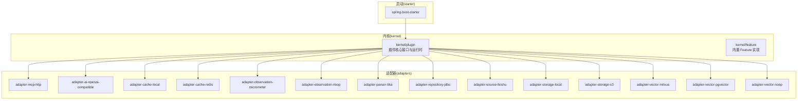
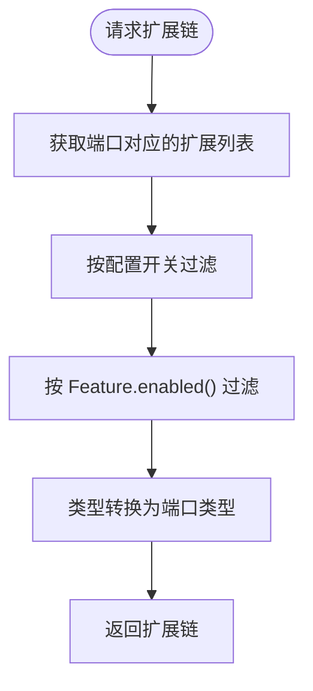
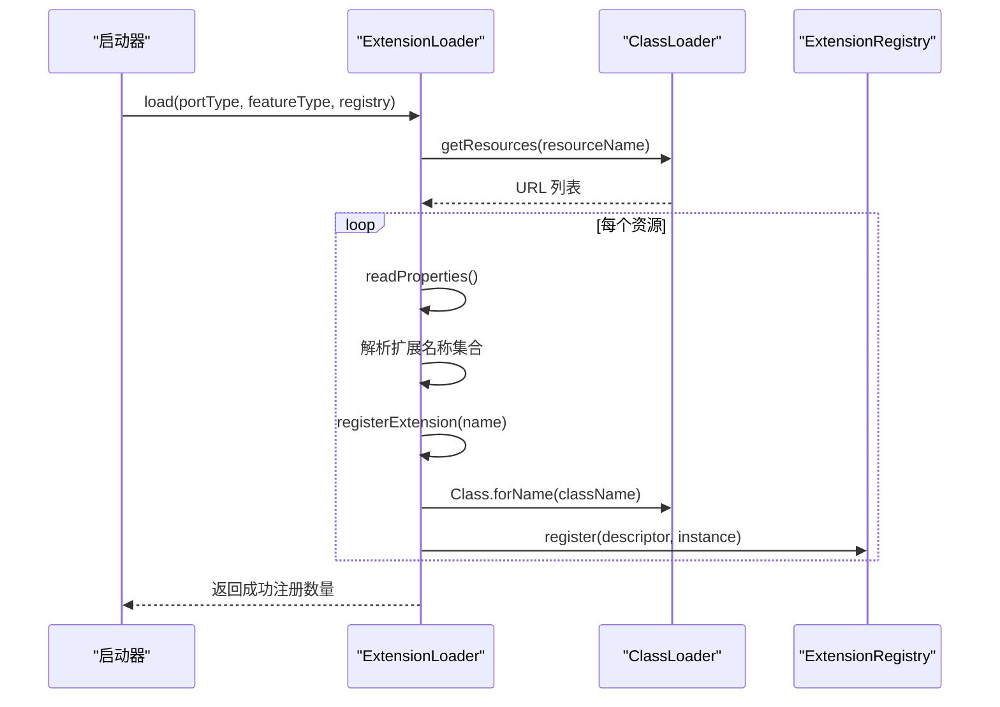
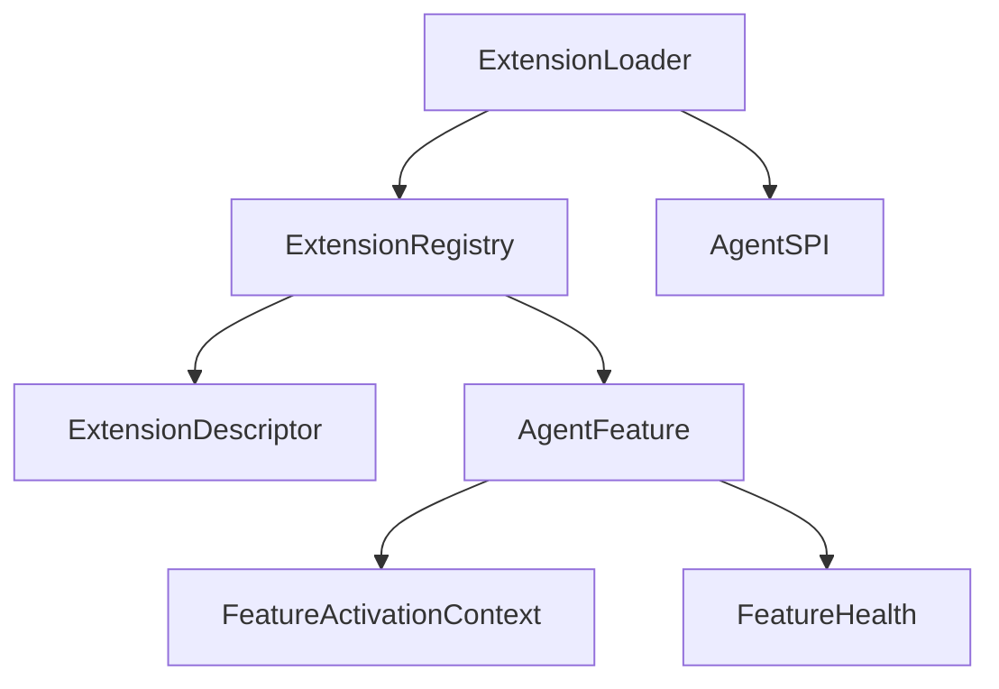

# 插件架构设计

<cite>
**本文档引用的文件**
- [AgentFeature.java](file://seahorse-agent-kernel/src/main/java/com/miracle/ai/seahorse/agent/kernel/plugin/AgentFeature.java)
- [AgentExtension.java](file://seahorse-agent-kernel/src/main/java/com/miracle/ai/seahorse/agent/kernel/plugin/AgentExtension.java)
- [AgentSPI.java](file://seahorse-agent-kernel/src/main/java/com/miracle/ai/seahorse/agent/kernel/plugin/AgentSPI.java)
- [FeatureType.java](file://seahorse-agent-kernel/src/main/java/com/miracle/ai/seahorse/agent/kernel/plugin/FeatureType.java)
- [ExtensionRegistry.java](file://seahorse-agent-kernel/src/main/java/com/miracle/ai/seahorse/agent/kernel/plugin/ExtensionRegistry.java)
- [DefaultExtensionRegistry.java](file://seahorse-agent-kernel/src/main/java/com/miracle/ai/seahorse/agent/kernel/plugin/DefaultExtensionRegistry.java)
- [ExtensionLoader.java](file://seahorse-agent-kernel/src/main/java/com/miracle/ai/seahorse/agent/kernel/plugin/ExtensionLoader.java)
- [ExtensionDescriptor.java](file://seahorse-agent-kernel/src/main/java/com/miracle/ai/seahorse/agent/kernel/plugin/ExtensionDescriptor.java)
- [FeatureActivationContext.java](file://seahorse-agent-kernel/src/main/java/com/miracle/ai/seahorse/agent/kernel/plugin/FeatureActivationContext.java)
- [FeatureHealth.java](file://seahorse-agent-kernel/src/main/java/com/miracle/ai/seahorse/agent/kernel/plugin/FeatureHealth.java)
- [FeatureHealthReport.java](file://seahorse-agent-kernel/src/main/java/com/miracle/ai/seahorse/agent/kernel/plugin/FeatureHealthReport.java)
- [ExtensionRegistration.java](file://seahorse-agent-kernel/src/main/java/com/miracle/ai/seahorse/agent/kernel/plugin/ExtensionRegistration.java)
- [McpToolFeature.java](file://seahorse-agent-kernel/src/main/java/com/miracle/ai/seahorse/agent/kernel/feature/mcp/McpToolFeature.java)
- [SearchChannelFeature.java](file://seahorse-agent-kernel/src/main/java/com/miracle/ai/seahorse/agent/kernel/feature/retrieval/SearchChannelFeature.java)
- [VectorGlobalSearchFeature.java](file://seahorse-agent-kernel/src/main/java/com/miracle/ai/seahorse/agent/kernel/feature/retrieval/VectorGlobalSearchFeature.java)
- [IntentDirectedSearchFeature.java](file://seahorse-agent-kernel/src/main/java/com/miracle/ai/seahorse/agent/kernel/feature/retrieval/IntentDirectedSearchFeature.java)
- [SearchResultPostProcessorFeature.java](file://seahorse-agent-kernel/src/main/java/com/miracle/ai/seahorse/agent/kernel/feature/retrieval/SearchResultPostProcessorFeature.java)
- [IngestionNodeFeature.java](file://seahorse-agent-kernel/src/main/java/com/miracle/ai/seahorse/agent/kernel/feature/ingestion/IngestionNodeFeature.java)
- [ChunkerNodeFeature.java](file://seahorse-agent-kernel/src/main/java/com/miracle/ai/seahorse/agent/kernel/feature/ingestion/ChunkerNodeFeature.java)
- [ParserNodeFeature.java](file://seahorse-agent-kernel/src/main/java/com/miracle/ai/seahorse/agent/kernel/feature/ingestion/ParserNodeFeature.java)
- [EmbedderNodeFeature.java](file://seahorse-agent-kernel/src/main/java/com/miracle/ai/seahorse/agent/kernel/feature/ingestion/EmbedderNodeFeature.java)
- [IndexerNodeFeature.java](file://seahorse-agent-kernel/src/main/java/com/miracle/ai/seahorse/agent/kernel/feature/ingestion/IndexerNodeFeature.java)
- [MemoryGovernanceFeature.java](file://seahorse-agent-kernel/src/main/java/com/miracle/ai/seahorse/agent/kernel/feature/memory/MemoryGovernanceFeature.java)
- [ModelRoutingPolicyFeature.java](file://seahorse-agent-kernel/src/main/java/com/miracle/ai/seahorse/agent/kernel/feature/model/ModelRoutingPolicyFeature.java)
- [RemoteMcpToolFeature.java](file://seahorse-agent-adapter-mcp-http/src/main/java/com/miracle/ai/seahorse/agent/adapters/mcp/http/RemoteMcpToolFeature.java)
- [OpenAiCompatibleModelAdapter.java](file://seahorse-agent-adapter-ai-openai-compatible/src/main/java/com/miracle/ai/seahorse/agent/adapters/ai/openai/OpenAiCompatibleModelAdapter.java)
- [LocalCacheAdapter.java](file://seahorse-agent-adapter-cache-local/src/main/java/com/miracle/ai/seahorse/agent/adapters/cache/local/LocalCacheAdapter.java)
- [RedisCacheAdapter.java](file://seahorse-agent-adapter-cache-redis/src/main/java/com/miracle/ai/seahorse/agent/adapters/cache/redis/RedisCacheAdapter.java)
- [MicrometerObservationAdapter.java](file://seahorse-agent-adapter-observation-micrometer/src/main/java/com/miracle/ai/seahorse/agent/adapters/observation/micrometer/MicrometerObservationAdapter.java)
- [NoopObservationAdapter.java](file://seahorse-agent-adapter-observation-noop/src/main/java/com/miracle/ai/seahorse/agent/adapters/observation/noop/NoopObservationAdapter.java)
- [TikaDocumentParserAdapter.java](file://seahorse-agent-adapter-parser-tika/src/main/java/com/miracle/ai/seahorse/agent/adapters/parser/tika/TikaDocumentParserAdapter.java)
- [JdbcKnowledgeBaseRepositoryAdapter.java](file://seahorse-agent-adapter-repository-jdbc/src/main/java/com/miracle/ai/seahorse/agent/adapters/repository/jdbc/JdbcKnowledgeBaseRepositoryAdapter.java)
- [FeishuDocumentFetcherAdapter.java](file://seahorse-agent-adapter-source-feishu/src/main/java/com/miracle/ai/seahorse/agent/adapters/source/feishu/FeishuDocumentFetcherAdapter.java)
- [LocalObjectStorageAdapter.java](file://seahorse-agent-adapter-storage-local/src/main/java/com/miracle/ai/seahorse/agent/adapters/storage/local/LocalObjectStorageAdapter.java)
- [S3ObjectStorageAdapter.java](file://seahorse-agent-adapter-storage-s3/src/main/java/com/miracle/ai/seahorse/agent/adapters/storage/s3/S3ObjectStorageAdapter.java)
- [MilvusVectorAdapter.java](file://seahorse-agent-adapter-vector-milvus/src/main/java/com/miracle/ai/seahorse/agent/adapters/vector/milvus/MilvusVectorAdapter.java)
- [PgVectorAdapter.java](file://seahorse-agent-adapter-vector-pgvector/src/main/java/com/miracle/ai/seahorse/agent/adapters/vector/pgvector/PgVectorAdapter.java)
- [NoopVectorStoreAdapter.java](file://seahorse-agent-adapter-vector-noop/src/main/java/com/miracle/ai/seahorse/agent/adapters/vector/noop/NoopVectorStoreAdapter.java)
</cite>

## 目录
1. [简介](#简介)
2. [项目结构](#项目结构)
3. [核心组件](#核心组件)
4. [架构总览](#架构总览)
5. [详细组件分析](#详细组件分析)
6. [依赖关系分析](#依赖关系分析)
7. [性能考量](#性能考量)
8. [故障排查指南](#故障排查指南)
9. [结论](#结论)
10. [附录](#附录)

## 简介
本文件系统性阐述 Seahorse Agent 的插件架构设计，重点围绕以下核心理念展开：
- AgentFeature 接口的设计原则：统一识别、启停判断、排序与健康检查，确保扩展能力在内核层面可治理。
- AgentExtension 扩展机制：通过注解声明扩展元数据（名称、顺序、能力标签），支持显式注册与自动发现。
- AgentSPI 服务提供接口：标记端口是否参与扩展加载，仅承载契约元数据，避免运行期反射开销。
- 插件类型分类：FeatureType 定义稳定的扩展点，涵盖检索通道、后处理、入库节点、MCP 工具、记忆治理、模型路由策略与观测包装器等。
- 动态功能扩展：基于 ExtensionLoader 的 classpath 资源发现与 ExtensionRegistry 的启动期索引，实现运行期零反射的扩展链构建。
- 与 Clean Architecture 的契合：端口（Port）位于内核边界，适配器（Adapter）实现具体技术细节，Feature 作为业务扩展点，清晰分离关注点。

## 项目结构
Seahorse Agent 插件体系由“内核插件模块 + 多种适配器模块”组成，遵循 Clean Architecture 的分层思想：
- kernel/plugin：定义插件核心接口与运行时基础设施（AgentFeature、AgentExtension、AgentSPI、FeatureType、ExtensionRegistry、ExtensionLoader 等）
- adapter-*：实现具体技术能力的适配器，通过 META-INF/seahorse-agent 下的端口资源文件声明扩展
- starter：提供自动装配与运行时集成

图表来源
- [ExtensionLoader.java:39-262](file://seahorse-agent-kernel/src/main/java/com/miracle/ai/seahorse/agent/kernel/plugin/ExtensionLoader.java#L39-L262)
- [DefaultExtensionRegistry.java:34-124](file://seahorse-agent-kernel/src/main/java/com/miracle/ai/seahorse/agent/kernel/plugin/DefaultExtensionRegistry.java#L34-L124)

章节来源
- [ExtensionLoader.java:39-262](file://seahorse-agent-kernel/src/main/java/com/miracle/ai/seahorse/agent/kernel/plugin/ExtensionLoader.java#L39-L262)
- [DefaultExtensionRegistry.java:34-124](file://seahorse-agent-kernel/src/main/java/com/miracle/ai/seahorse/agent/kernel/plugin/DefaultExtensionRegistry.java#L34-L124)

## 核心组件
本节深入解析插件系统的关键构件及其职责与协作方式。

- AgentFeature 接口
  - 设计目标：统一表达业务扩展能力，提供名称、类型、启用判断、排序与健康检查的最小公分母能力，避免主干逻辑被拆成不可治理的散装插件。
  - 关键方法：name()、type()、enabled()、order()、health()。
  - 设计要点：type() 用于区分扩展点；enabled() 支持基于上下文的细粒度控制；order() 控制扩展链顺序；health() 提供非阻塞的健康报告。

- AgentExtension 注解
  - 作用：为 Adapter 或 Feature 声明扩展元数据（名称、顺序、能力标签），便于显式注册与扩展加载器读取。
  - 字段：name()、order()、capabilities()。

- AgentSPI 注解
  - 作用：标记端口是否参与微内核扩展加载，仅承载契约元数据，不触发类扫描或实例化，避免请求期引入反射开销。
  - 字段：defaultName()、required()。

- FeatureType 枚举
  - 定义稳定的扩展点：SEARCH_CHANNEL、SEARCH_RESULT_POST_PROCESSOR、INGESTION_NODE、MCP_TOOL、MEMORY_GOVERNANCE、MODEL_ROUTING_POLICY、OBSERVATION_WRAPPER。
  - 设计原则：新增业务扩展优先复用现有类型，避免无限制插件化导致核心能力空心化。

- ExtensionRegistry 接口
  - 职责：启动期索引扩展，运行期提供默认扩展与按上下文激活的扩展链。
  - 方法：getDefaultExtension()、getActivatedExtensions()、registeredExtensions()、register()。
  - 设计原则：L1 内核只通过端口类型获取扩展链，不依赖 Spring Bean 名称或外部技术 SDK。

- DefaultExtensionRegistry 实现
  - 特性：启动期注册、请求期只做轻量过滤与类型转换；使用 LinkedHashMap 保持注册稳定性；拒绝同一端口下的重复名称；按 order 排序。
  - 过滤逻辑：先按配置开关过滤，再按 Feature.enabled() 过滤。

- ExtensionLoader 加载器
  - 机制：基于 classpath 资源 META-INF/seahorse-agent/{port-fqcn} 的 Properties 文件发现扩展，读取默认实现、排序、能力标签与启用状态，实例化并注册到注册表。
  - 设计原则：只在启动期加载，运行期请求链路使用已构建好的注册表，避免反射扫描影响性能。

- ExtensionDescriptor 描述符
  - 字段：name、portType、featureType、order、defaultCandidate、capabilities、enabledByDefault。
  - 校验：name 与 portType 必填，缺失时快速失败。

- FeatureActivationContext 激活上下文
  - 字段：tenantId、userId、attributes、properties。
  - 设计：对空值进行安全兜底，避免 Feature 中出现空指针分支。

- FeatureHealth 健康状态
  - 字段：name、up、message、details。
  - 方法：up()、down()，提供健康状态构造与默认值。

- FeatureHealthReport 健康聚合报告
  - 字段：up、features、adapters。
  - 用途：聚合 Feature 与 Adapter 的健康状态，用于启动检查与管理端展示。

- ExtensionRegistration 注册快照
  - 字段：descriptor、implementationClass。
  - 用途：启动期注册扩展的快照记录。

章节来源
- [AgentFeature.java:26-80](file://seahorse-agent-kernel/src/main/java/com/miracle/ai/seahorse/agent/kernel/plugin/AgentFeature.java#L26-L80)
- [AgentExtension.java:35-58](file://seahorse-agent-kernel/src/main/java/com/miracle/ai/seahorse/agent/kernel/plugin/AgentExtension.java#L35-L58)
- [AgentSPI.java:35-51](file://seahorse-agent-kernel/src/main/java/com/miracle/ai/seahorse/agent/kernel/plugin/AgentSPI.java#L35-L51)
- [FeatureType.java:26-63](file://seahorse-agent-kernel/src/main/java/com/miracle/ai/seahorse/agent/kernel/plugin/FeatureType.java#L26-L63)
- [ExtensionRegistry.java:28-84](file://seahorse-agent-kernel/src/main/java/com/miracle/ai/seahorse/agent/kernel/plugin/ExtensionRegistry.java#L28-L84)
- [DefaultExtensionRegistry.java:34-124](file://seahorse-agent-kernel/src/main/java/com/miracle/ai/seahorse/agent/kernel/plugin/DefaultExtensionRegistry.java#L34-L124)
- [ExtensionLoader.java:39-262](file://seahorse-agent-kernel/src/main/java/com/miracle/ai/seahorse/agent/kernel/plugin/ExtensionLoader.java#L39-L262)
- [ExtensionDescriptor.java:37-66](file://seahorse-agent-kernel/src/main/java/com/miracle/ai/seahorse/agent/kernel/plugin/ExtensionDescriptor.java#L37-L66)
- [FeatureActivationContext.java:33-61](file://seahorse-agent-kernel/src/main/java/com/miracle/ai/seahorse/agent/kernel/plugin/FeatureActivationContext.java#L33-L61)
- [FeatureHealth.java:33-68](file://seahorse-agent-kernel/src/main/java/com/miracle/ai/seahorse/agent/kernel/plugin/FeatureHealth.java#L33-L68)
- [FeatureHealthReport.java:32-44](file://seahorse-agent-kernel/src/main/java/com/miracle/ai/seahorse/agent/kernel/plugin/FeatureHealthReport.java#L32-L44)
- [ExtensionRegistration.java:28-36](file://seahorse-agent-kernel/src/main/java/com/miracle/ai/seahorse/agent/kernel/plugin/ExtensionRegistration.java#L28-L36)

## 架构总览
Seahorse Agent 插件架构采用“端口驱动 + 适配器实现 + Feature 扩展”的 Clean Architecture 分层模式：
- 端口（Port）：位于内核边界，定义抽象能力契约（如模型、缓存、消息队列、存储、向量检索等）。
- 适配器（Adapter）：实现具体技术细节，通过 AgentSPI 标记端口并提供默认实现或可选实现。
- Feature：实现业务扩展能力，实现 AgentFeature 接口，通过 AgentExtension 注解声明元数据。
- 扩展加载：ExtensionLoader 在启动期扫描 classpath 资源，构建 ExtensionRegistry；运行期通过注册表获取默认扩展与按上下文激活的扩展链。

```mermaid
classDiagram
class AgentFeature {
+name() String
+type() FeatureType
+enabled(context) boolean
+order() int
+health() FeatureHealth
}
class AgentExtension {
+name() String
+order() int
+capabilities() String[]
}
class AgentSPI {
+defaultName() String
+required() boolean
}
class FeatureType {
<<enumeration>>
SEARCH_CHANNEL
SEARCH_RESULT_POST_PROCESSOR
INGESTION_NODE
MCP_TOOL
MEMORY_GOVERNANCE
MODEL_ROUTING_POLICY
OBSERVATION_WRAPPER
}
class ExtensionRegistry {
+getDefaultExtension(portType) T
+getActivatedExtensions(portType, context) T[]
+registeredExtensions() ExtensionRegistration[]
+register(descriptor, instance) void
}
class DefaultExtensionRegistry {
+register(descriptor, instance) void
+getDefaultExtension(portType) T
+getActivatedExtensions(portType, context) T[]
}
class ExtensionLoader {
+load(portType, featureType, registry) int
+diagnostics() ExtensionLoadDiagnostic[]
}
class ExtensionDescriptor {
+name String
+portType Class
+featureType FeatureType
+order int
+defaultCandidate boolean
+capabilities Set~String~
+enabledByDefault boolean
}
class FeatureActivationContext {
+tenantId String
+userId String
+attributes Map~String,Object~
+properties AgentFeatureProperties
}
class FeatureHealth {
+name String
+up boolean
+message String
+details Map~String,Object~
}
class FeatureHealthReport {
+up boolean
+features FeatureHealth[]
+adapters AdapterHealthStatus[]
}
AgentFeature <|.. McpToolFeature
AgentFeature <|.. SearchChannelFeature
AgentFeature <|.. VectorGlobalSearchFeature
AgentFeature <|.. IntentDirectedSearchFeature
AgentFeature <|.. SearchResultPostProcessorFeature
AgentFeature <|.. IngestionNodeFeature
AgentFeature <|.. ChunkerNodeFeature
AgentFeature <|.. ParserNodeFeature
AgentFeature <|.. EmbedderNodeFeature
AgentFeature <|.. IndexerNodeFeature
AgentFeature <|.. MemoryGovernanceFeature
AgentFeature <|.. ModelRoutingPolicyFeature
DefaultExtensionRegistry ..|> ExtensionRegistry
ExtensionLoader --> ExtensionRegistry : "注册扩展"
ExtensionDescriptor --> ExtensionRegistry : "描述符索引"
FeatureActivationContext --> ExtensionRegistry : "激活过滤"
FeatureHealth --> FeatureHealthReport : "聚合"
```

图表来源
- [AgentFeature.java:26-80](file://seahorse-agent-kernel/src/main/java/com/miracle/ai/seahorse/agent/kernel/plugin/AgentFeature.java#L26-L80)
- [FeatureType.java:26-63](file://seahorse-agent-kernel/src/main/java/com/miracle/ai/seahorse/agent/kernel/plugin/FeatureType.java#L26-L63)
- [ExtensionRegistry.java:28-84](file://seahorse-agent-kernel/src/main/java/com/miracle/ai/seahorse/agent/kernel/plugin/ExtensionRegistry.java#L28-L84)
- [DefaultExtensionRegistry.java:34-124](file://seahorse-agent-kernel/src/main/java/com/miracle/ai/seahorse/agent/kernel/plugin/DefaultExtensionRegistry.java#L34-L124)
- [ExtensionLoader.java:39-262](file://seahorse-agent-kernel/src/main/java/com/miracle/ai/seahorse/agent/kernel/plugin/ExtensionLoader.java#L39-L262)
- [ExtensionDescriptor.java:37-66](file://seahorse-agent-kernel/src/main/java/com/miracle/ai/seahorse/agent/kernel/plugin/ExtensionDescriptor.java#L37-L66)
- [FeatureActivationContext.java:33-61](file://seahorse-agent-kernel/src/main/java/com/miracle/ai/seahorse/agent/kernel/plugin/FeatureActivationContext.java#L33-L61)
- [FeatureHealth.java:33-68](file://seahorse-agent-kernel/src/main/java/com/miracle/ai/seahorse/agent/kernel/plugin/FeatureHealth.java#L33-L68)
- [FeatureHealthReport.java:32-44](file://seahorse-agent-kernel/src/main/java/com/miracle/ai/seahorse/agent/kernel/plugin/FeatureHealthReport.java#L32-L44)

## 详细组件分析

### AgentFeature 接口设计
- 设计原则
  - 统一识别：name() 用于配置开关、日志、监控与冲突检测，同一端口下唯一。
  - 类型区分：type() 将扩展映射到稳定的功能域（检索、后处理、入库、MCP、记忆治理、模型路由、观测包装）。
  - 启用控制：enabled() 支持基于租户、用户、灰度属性与配置的细粒度控制，默认启用。
  - 顺序控制：order() 数字越小优先级越高，注册表按此排序。
  - 健康检查：health() 报告自身状态，不参与请求链路，避免增加主链路耗时。

- 实现建议
  - 对于需要外部依赖的 Feature，health() 应仅做自检，不主动访问外部服务。
  - enabled() 可结合 FeatureActivationContext 的属性与 AgentFeatureProperties 进行条件判断。

章节来源
- [AgentFeature.java:26-80](file://seahorse-agent-kernel/src/main/java/com/miracle/ai/seahorse/agent/kernel/plugin/AgentFeature.java#L26-L80)

### AgentExtension 扩展机制
- 元数据声明
  - name：扩展唯一标识，同一端口下必须唯一。
  - order：排序值，数字越小越靠前。
  - capabilities：能力标签，便于按标签筛选与组合。
- 读取路径
  - 显式注册：通过 ExtensionRegistry.register() 注册。
  - 自动发现：ExtensionLoader 从 classpath 资源读取 Properties 并实例化。

章节来源
- [AgentExtension.java:35-58](file://seahorse-agent-kernel/src/main/java/com/miracle/ai/seahorse/agent/kernel/plugin/AgentExtension.java#L35-L58)
- [ExtensionLoader.java:156-171](file://seahorse-agent-kernel/src/main/java/com/miracle/ai/seahorse/agent/kernel/plugin/ExtensionLoader.java#L156-L171)

### AgentSPI 服务提供接口
- 元数据语义
  - defaultName：默认扩展名称，用于 getDefaultExtension()。
  - required：是否为启动必需端口，缺失实现时启动失败。
- 设计要点
  - 仅承载契约元数据，不触发类扫描或实例化，避免请求期反射开销。

章节来源
- [AgentSPI.java:35-51](file://seahorse-agent-kernel/src/main/java/com/miracle/ai/seahorse/agent/kernel/plugin/AgentSPI.java#L35-L51)

### FeatureType 类型体系
- 检索通道：全局向量检索、意图定向检索、关键词检索等。
- 检索结果后处理：去重、版本过滤、Rerank 等。
- 入库流水线节点：解析、分块、增强、索引等。
- MCP 工具扩展：远程工具调用、参数提取等。
- 记忆治理策略：晋升、衰减、质量快照等。
- 模型路由策略：优先级、健康状态与 fallback。
- 观测包装器：tracing、metrics、审计等。

章节来源
- [FeatureType.java:26-63](file://seahorse-agent-kernel/src/main/java/com/miracle/ai/seahorse/agent/kernel/plugin/FeatureType.java#L26-L63)

### ExtensionRegistry 与 DefaultExtensionRegistry
- DefaultExtensionRegistry 的关键行为
  - 注册校验：validatePortType() 确保实例实现端口类型；rejectDuplicateName() 拒绝同端口重复名称。
  - 排序：entries.sort(Comparator.comparingInt(entry -> entry.descriptor().order()))。
  - 激活过滤：enabledByConfiguration() 与 enabledByFeature() 双重过滤。
  - 默认扩展：defaultCandidate() 为 true 的扩展作为默认实现。

图表来源
- [DefaultExtensionRegistry.java:50-58](file://seahorse-agent-kernel/src/main/java/com/miracle/ai/seahorse/agent/kernel/plugin/DefaultExtensionRegistry.java#L50-L58)

章节来源
- [ExtensionRegistry.java:28-84](file://seahorse-agent-kernel/src/main/java/com/miracle/ai/seahorse/agent/kernel/plugin/ExtensionRegistry.java#L28-L84)
- [DefaultExtensionRegistry.java:34-124](file://seahorse-agent-kernel/src/main/java/com/miracle/ai/seahorse/agent/kernel/plugin/DefaultExtensionRegistry.java#L34-L124)

### ExtensionLoader 扩展加载流程
- 资源发现：classpath 下的 META-INF/seahorse-agent/{port-fqcn} Properties 文件。
- 属性解析：default、{name}.class、{name}.order、{name}.default、{name}.managed、{name}.capabilities、{name}.enabled-by-default。
- 实例化：Class.forName + 无参构造 + portType.cast。
- 注册：ExtensionRegistry.register(descriptor, instance)。

图表来源
- [ExtensionLoader.java:79-114](file://seahorse-agent-kernel/src/main/java/com/miracle/ai/seahorse/agent/kernel/plugin/ExtensionLoader.java#L79-L114)
- [ExtensionLoader.java:156-171](file://seahorse-agent-kernel/src/main/java/com/miracle/ai/seahorse/agent/kernel/plugin/ExtensionLoader.java#L156-L171)
- [ExtensionLoader.java:227-238](file://seahorse-agent-kernel/src/main/java/com/miracle/ai/seahorse/agent/kernel/plugin/ExtensionLoader.java#L227-L238)

章节来源
- [ExtensionLoader.java:39-262](file://seahorse-agent-kernel/src/main/java/com/miracle/ai/seahorse/agent/kernel/plugin/ExtensionLoader.java#L39-L262)

### FeatureActivationContext 激活上下文
- 设计目的：在选择扩展链时传入租户、用户、灰度属性与配置，Feature 可据此决定是否启用。
- 安全兜底：对空值进行默认填充，避免空指针分支。

章节来源
- [FeatureActivationContext.java:33-61](file://seahorse-agent-kernel/src/main/java/com/miracle/ai/seahorse/agent/kernel/plugin/FeatureActivationContext.java#L33-L61)

### FeatureHealth 与 FeatureHealthReport
- FeatureHealth：提供 up()/down() 构造方法与不可变结构，避免请求链路中的副作用。
- FeatureHealthReport：聚合 Feature 与 Adapter 的健康状态，便于管理端展示与问题定位。

章节来源
- [FeatureHealth.java:33-68](file://seahorse-agent-kernel/src/main/java/com/miracle/ai/seahorse/agent/kernel/plugin/FeatureHealth.java#L33-L68)
- [FeatureHealthReport.java:32-44](file://seahorse-agent-kernel/src/main/java/com/miracle/ai/seahorse/agent/kernel/plugin/FeatureHealthReport.java#L32-L44)

### 典型 Feature 实现示例
- 检索相关
  - SearchChannelFeature：基础检索通道 Feature。
  - VectorGlobalSearchFeature：全局向量检索 Feature。
  - IntentDirectedSearchFeature：意图定向检索 Feature。
  - SearchResultPostProcessorFeature：检索结果后处理 Feature。
- 入库相关
  - IngestionNodeFeature：入库流水线节点 Feature。
  - ChunkerNodeFeature：分块节点 Feature。
  - ParserNodeFeature：解析节点 Feature。
  - EmbedderNodeFeature：嵌入节点 Feature。
  - IndexerNodeFeature：索引节点 Feature。
- 其他
  - McpToolFeature：MCP 工具 Feature。
  - MemoryGovernanceFeature：记忆治理 Feature。
  - ModelRoutingPolicyFeature：模型路由策略 Feature。

章节来源
- [SearchChannelFeature.java](file://seahorse-agent-kernel/src/main/java/com/miracle/ai/seahorse/agent/kernel/feature/retrieval/SearchChannelFeature.java)
- [VectorGlobalSearchFeature.java](file://seahorse-agent-kernel/src/main/java/com/miracle/ai/seahorse/agent/kernel/feature/retrieval/VectorGlobalSearchFeature.java)
- [IntentDirectedSearchFeature.java](file://seahorse-agent-kernel/src/main/java/com/miracle/ai/seahorse/agent/kernel/feature/retrieval/IntentDirectedSearchFeature.java)
- [SearchResultPostProcessorFeature.java](file://seahorse-agent-kernel/src/main/java/com/miracle/ai/seahorse/agent/kernel/feature/retrieval/SearchResultPostProcessorFeature.java)
- [IngestionNodeFeature.java](file://seahorse-agent-kernel/src/main/java/com/miracle/ai/seahorse/agent/kernel/feature/ingestion/IngestionNodeFeature.java)
- [ChunkerNodeFeature.java](file://seahorse-agent-kernel/src/main/java/com/miracle/ai/seahorse/agent/kernel/feature/ingestion/ChunkerNodeFeature.java)
- [ParserNodeFeature.java](file://seahorse-agent-kernel/src/main/java/com/miracle/ai/seahorse/agent/kernel/feature/ingestion/ParserNodeFeature.java)
- [EmbedderNodeFeature.java](file://seahorse-agent-kernel/src/main/java/com/miracle/ai/seahorse/agent/kernel/feature/ingestion/EmbedderNodeFeature.java)
- [IndexerNodeFeature.java](file://seahorse-agent-kernel/src/main/java/com/miracle/ai/seahorse/agent/kernel/feature/ingestion/IndexerNodeFeature.java)
- [McpToolFeature.java](file://seahorse-agent-kernel/src/main/java/com/miracle/ai/seahorse/agent/kernel/feature/mcp/McpToolFeature.java)
- [MemoryGovernanceFeature.java](file://seahorse-agent-kernel/src/main/java/com/miracle/ai/seahorse/agent/kernel/feature/memory/MemoryGovernanceFeature.java)
- [ModelRoutingPolicyFeature.java](file://seahorse-agent-kernel/src/main/java/com/miracle/ai/seahorse/agent/kernel/feature/model/ModelRoutingPolicyFeature.java)

### 典型适配器实现示例
- AI 模型适配器
  - OpenAiCompatibleModelAdapter：兼容 OpenAI 协议的模型适配器。
- 缓存适配器
  - LocalCacheAdapter、RedisCacheAdapter：本地与 Redis 缓存适配器。
- 观测适配器
  - MicrometerObservationAdapter、NoopObservationAdapter：Micrometer 与空实现观测适配器。
- 文档解析适配器
  - TikaDocumentParserAdapter：基于 Apache Tika 的文档解析适配器。
- 知识库仓库适配器
  - JdbcKnowledgeBaseRepositoryAdapter：基于 JDBC 的知识库仓库适配器。
- 文档源适配器
  - FeishuDocumentFetcherAdapter：飞书文档抓取适配器。
- 存储适配器
  - LocalObjectStorageAdapter、S3ObjectStorageAdapter：本地与 S3 对象存储适配器。
- 向量存储适配器
  - MilvusVectorAdapter、PgVectorAdapter、NoopVectorStoreAdapter：Milvus、PGVector 与空实现向量存储适配器。

章节来源
- [OpenAiCompatibleModelAdapter.java](file://seahorse-agent-adapter-ai-openai-compatible/src/main/java/com/miracle/ai/seahorse/agent/adapters/ai/openai/OpenAiCompatibleModelAdapter.java)
- [LocalCacheAdapter.java](file://seahorse-agent-adapter-cache-local/src/main/java/com/miracle/ai/seahorse/agent/adapters/cache/local/LocalCacheAdapter.java)
- [RedisCacheAdapter.java](file://seahorse-agent-adapter-cache-redis/src/main/java/com/miracle/ai/seahorse/agent/adapters/cache/redis/RedisCacheAdapter.java)
- [MicrometerObservationAdapter.java](file://seahorse-agent-adapter-observation-micrometer/src/main/java/com/miracle/ai/seahorse/agent/adapters/observation/micrometer/MicrometerObservationAdapter.java)
- [NoopObservationAdapter.java](file://seahorse-agent-adapter-observation-noop/src/main/java/com/miracle/ai/seahorse/agent/adapters/observation/noop/NoopObservationAdapter.java)
- [TikaDocumentParserAdapter.java](file://seahorse-agent-adapter-parser-tika/src/main/java/com/miracle/ai/seahorse/agent/adapters/parser/tika/TikaDocumentParserAdapter.java)
- [JdbcKnowledgeBaseRepositoryAdapter.java](file://seahorse-agent-adapter-repository-jdbc/src/main/java/com/miracle/ai/seahorse/agent/adapters/repository/jdbc/JdbcKnowledgeBaseRepositoryAdapter.java)
- [FeishuDocumentFetcherAdapter.java](file://seahorse-agent-adapter-source-feishu/src/main/java/com/miracle/ai/seahorse/agent/adapters/source/feishu/FeishuDocumentFetcherAdapter.java)
- [LocalObjectStorageAdapter.java](file://seahorse-agent-adapter-storage-local/src/main/java/com/miracle/ai/seahorse/agent/adapters/storage/local/LocalObjectStorageAdapter.java)
- [S3ObjectStorageAdapter.java](file://seahorse-agent-adapter-storage-s3/src/main/java/com/miracle/ai/seahorse/agent/adapters/storage/s3/S3ObjectStorageAdapter.java)
- [MilvusVectorAdapter.java](file://seahorse-agent-adapter-vector-milvus/src/main/java/com/miracle/ai/seahorse/agent/adapters/vector/milvus/MilvusVectorAdapter.java)
- [PgVectorAdapter.java](file://seahorse-agent-adapter-vector-pgvector/src/main/java/com/miracle/ai/seahorse/agent/adapters/vector/pgvector/PgVectorAdapter.java)
- [NoopVectorStoreAdapter.java](file://seahorse-agent-adapter-vector-noop/src/main/java/com/miracle/ai/seahorse/agent/adapters/vector/noop/NoopVectorStoreAdapter.java)

## 依赖关系分析
- 组件耦合
  - ExtensionLoader 依赖 ClassLoader 与 Properties 解析，最终依赖 ExtensionRegistry 完成注册。
  - DefaultExtensionRegistry 依赖 ExtensionDescriptor 与 AgentFeature 的 enabled() 进行过滤。
  - AgentFeature 与 FeatureType、FeatureActivationContext、FeatureHealth 协作，形成完整的扩展生命周期管理。
- 外部依赖与集成点
  - 适配器通过 META-INF/seahorse-agent/{port-fqcn} 资源文件声明扩展，与内核解耦。
  - AgentSPI 标记端口是否必需，required=true 时缺失实现会导致启动失败。

图表来源
- [ExtensionLoader.java:79-114](file://seahorse-agent-kernel/src/main/java/com/miracle/ai/seahorse/agent/kernel/plugin/ExtensionLoader.java#L79-L114)
- [DefaultExtensionRegistry.java:103-114](file://seahorse-agent-kernel/src/main/java/com/miracle/ai/seahorse/agent/kernel/plugin/DefaultExtensionRegistry.java#L103-L114)
- [AgentFeature.java:54-56](file://seahorse-agent-kernel/src/main/java/com/miracle/ai/seahorse/agent/kernel/plugin/AgentFeature.java#L54-L56)
- [FeatureActivationContext.java:33-61](file://seahorse-agent-kernel/src/main/java/com/miracle/ai/seahorse/agent/kernel/plugin/FeatureActivationContext.java#L33-L61)
- [FeatureHealth.java:33-68](file://seahorse-agent-kernel/src/main/java/com/miracle/ai/seahorse/agent/kernel/plugin/FeatureHealth.java#L33-L68)
- [AgentSPI.java:35-51](file://seahorse-agent-kernel/src/main/java/com/miracle/ai/seahorse/agent/kernel/plugin/AgentSPI.java#L35-L51)

章节来源
- [ExtensionLoader.java:39-262](file://seahorse-agent-kernel/src/main/java/com/miracle/ai/seahorse/agent/kernel/plugin/ExtensionLoader.java#L39-L262)
- [DefaultExtensionRegistry.java:34-124](file://seahorse-agent-kernel/src/main/java/com/miracle/ai/seahorse/agent/kernel/plugin/DefaultExtensionRegistry.java#L34-L124)
- [AgentFeature.java:26-80](file://seahorse-agent-kernel/src/main/java/com/miracle/ai/seahorse/agent/kernel/plugin/AgentFeature.java#L26-L80)
- [FeatureActivationContext.java:33-61](file://seahorse-agent-kernel/src/main/java/com/miracle/ai/seahorse/agent/kernel/plugin/FeatureActivationContext.java#L33-L61)
- [FeatureHealth.java:33-68](file://seahorse-agent-kernel/src/main/java/com/miracle/ai/seahorse/agent/kernel/plugin/FeatureHealth.java#L33-L68)
- [AgentSPI.java:35-51](file://seahorse-agent-kernel/src/main/java/com/miracle/ai/seahorse/agent/kernel/plugin/AgentSPI.java#L35-L51)

## 性能考量
- 启动期加载，运行期零反射
  - ExtensionLoader 仅在启动期扫描 classpath 资源并实例化扩展，运行期请求链路直接使用 ExtensionRegistry 的预构建结果，避免反射扫描带来的性能抖动。
- 健康检查非阻塞
  - Feature.health() 仅做自检，不主动访问外部服务，避免增加主链路耗时。
- 过滤策略
  - DefaultExtensionRegistry 在请求期仅执行轻量过滤与类型转换，减少不必要的计算。
- 排序与去重
  - 注册时按 order 排序，注册时拒绝同端口重复名称，降低运行期查找成本。

## 故障排查指南
- 启动期错误
  - 类型不匹配：扩展实例不匹配端口类型，抛出异常。检查实现类是否正确实现对应端口。
  - 重复名称：同一端口下扩展名称重复，抛出异常。修正 AgentExtension.name()。
  - 实例化失败：类找不到、无参构造不可用、构造异常等。检查实现类的可见性与构造函数。
  - 资源读取失败：classpath 资源无法读取。检查 META-INF/seahorse-agent/{port-fqcn} 文件是否存在且格式正确。
- 运行期问题
  - 未找到默认扩展：当不存在 defaultCandidate=true 的扩展时，getDefaultExtension() 抛出异常。确认至少有一个默认扩展或显式指定扩展。
  - 扩展未启用：enabledByConfiguration() 或 enabledByFeature() 返回 false 导致扩展未进入链路。检查配置与 Feature.enabled() 实现。
- 健康检查
  - 健康状态异常：Feature.health() 返回 down 状态。根据 message 与 details 定位问题，避免在请求链路中执行外部访问。

章节来源
- [DefaultExtensionRegistry.java:88-101](file://seahorse-agent-kernel/src/main/java/com/miracle/ai/seahorse/agent/kernel/plugin/DefaultExtensionRegistry.java#L88-L101)
- [ExtensionLoader.java:227-238](file://seahorse-agent-kernel/src/main/java/com/miracle/ai/seahorse/agent/kernel/plugin/ExtensionLoader.java#L227-L238)
- [ExtensionLoader.java:240-248](file://seahorse-agent-kernel/src/main/java/com/miracle/ai/seahorse/agent/kernel/plugin/ExtensionLoader.java#L240-L248)
- [ExtensionRegistry.java:66-82](file://seahorse-agent-kernel/src/main/java/com/miracle/ai/seahorse/agent/kernel/plugin/ExtensionRegistry.java#L66-L82)

## 结论
Seahorse Agent 的插件架构通过“端口 + 适配器 + Feature”的 Clean Architecture 分层，结合 AgentFeature、AgentExtension、AgentSPI、FeatureType、ExtensionRegistry 与 ExtensionLoader 等核心组件，实现了：
- 清晰的扩展点划分与稳定的类型体系；
- 启动期可治理、运行期高性能的扩展加载与选择；
- 基于上下文的细粒度启用控制与健康状态报告；
- 与 Clean Architecture 的深度契合，既保证了内核的稳定性，又提供了强大的动态扩展能力。

## 附录
- 插件开发最佳实践
  - 使用 AgentSPI 标记端口，明确 defaultName 与 required。
  - 使用 AgentExtension 声明扩展元数据，确保 name 唯一、order 合理、capabilities 清晰。
  - 实现 AgentFeature 时，enabled() 与 health() 应尽量无副作用，避免阻塞请求链路。
  - 适配器通过 META-INF/seahorse-agent/{port-fqcn} 资源文件声明扩展，遵循 Properties 格式约定。
  - 在启动期完成扩展注册，运行期仅使用 ExtensionRegistry 的查询结果。