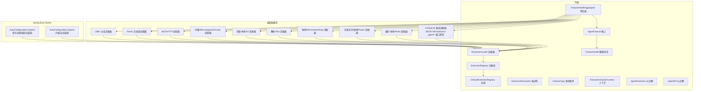
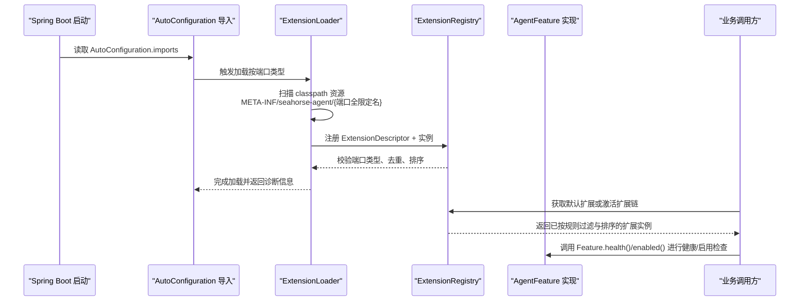
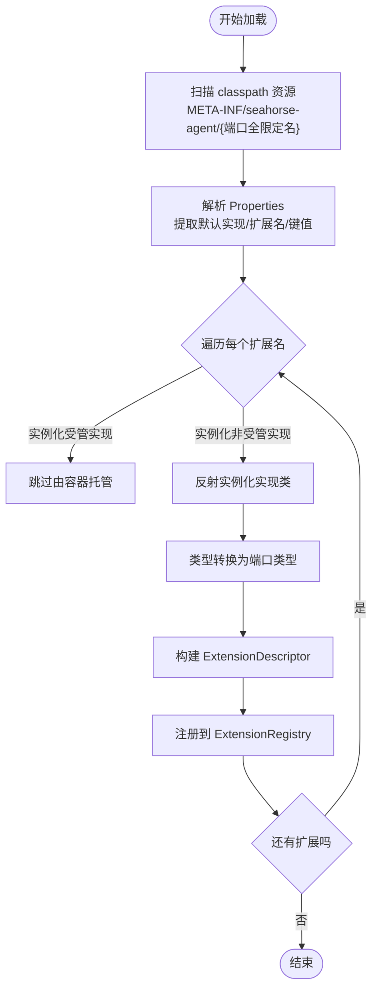
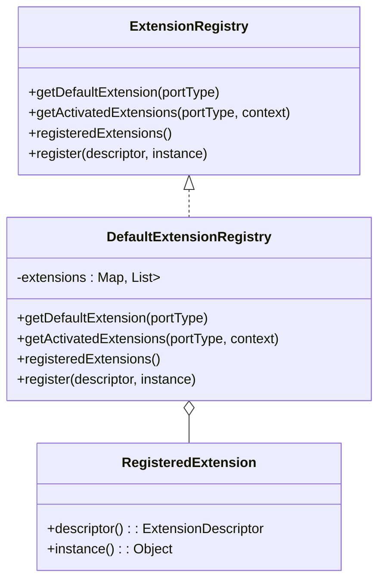
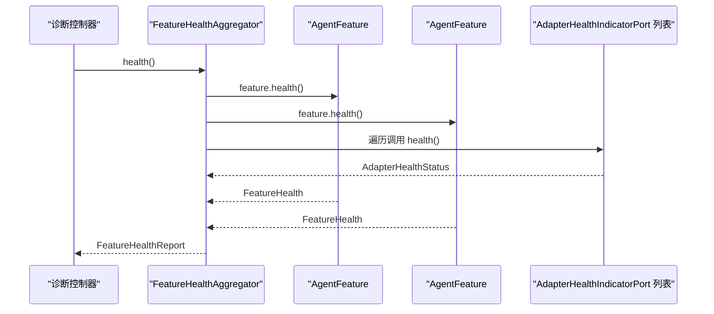
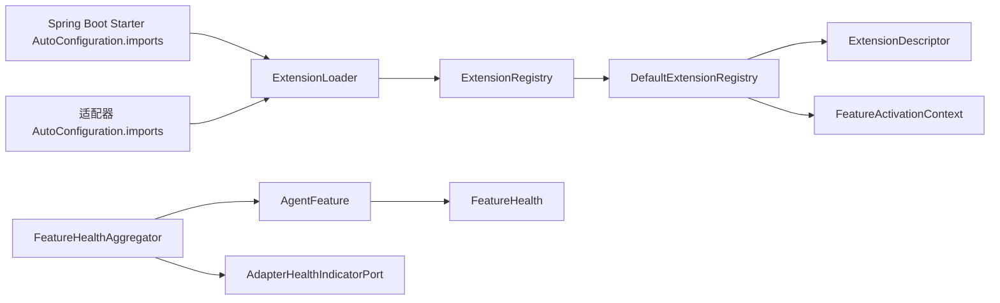

# 插件系统

<cite>
**本文引用的文件**
- [AgentFeature.java](file://seahorse-agent-kernel/src/main/java/com/miracle/ai/seahorse/agent/kernel/plugin/AgentFeature.java)
- [ExtensionLoader.java](file://seahorse-agent-kernel/src/main/java/com/miracle/ai/seahorse/agent/kernel/plugin/ExtensionLoader.java)
- [ExtensionRegistry.java](file://seahorse-agent-kernel/src/main/java/com/miracle/ai/seahorse/agent/kernel/plugin/ExtensionRegistry.java)
- [DefaultExtensionRegistry.java](file://seahorse-agent-kernel/src/main/java/com/miracle/ai/seahorse/agent/kernel/plugin/DefaultExtensionRegistry.java)
- [ExtensionDescriptor.java](file://seahorse-agent-kernel/src/main/java/com/miracle/ai/seahorse/agent/kernel/plugin/ExtensionDescriptor.java)
- [FeatureType.java](file://seahorse-agent-kernel/src/main/java/com/miracle/ai/seahorse/agent/kernel/plugin/FeatureType.java)
- [FeatureActivationContext.java](file://seahorse-agent-kernel/src/main/java/com/miracle/ai/seahorse/agent/kernel/plugin/FeatureActivationContext.java)
- [FeatureHealth.java](file://seahorse-agent-kernel/src/main/java/com/miracle/ai/seahorse/agent/kernel/plugin/FeatureHealth.java)
- [FeatureHealthAggregator.java](file://seahorse-agent-kernel/src/main/java/com/miracle/ai/seahorse/agent/kernel/plugin/FeatureHealthAggregator.java)
- [ExtensionLoadDiagnostic.java](file://seahorse-agent-kernel/src/main/java/com/miracle/ai/seahorse/agent/kernel/plugin/ExtensionLoadDiagnostic.java)
- [AgentExtension.java](file://seahorse-agent-kernel/src/main/java/com/miracle/ai/seahorse/agent/kernel/plugin/AgentExtension.java)
- [AgentSPI.java](file://seahorse-agent-kernel/src/main/java/com/miracle/ai/seahorse/agent/kernel/plugin/AgentSPI.java)
- [org.springframework.boot.autoconfigure.AutoConfiguration.imports（Spring Boot Starter）](file://seahorse-agent-spring-boot-starter/src/main/resources/META-INF/spring/org.springframework.boot.autoconfigure.AutoConfiguration.imports)
- [org.springframework.boot.autoconfigure.AutoConfiguration.imports（MCP HTTP 适配器）](file://seahorse-agent-adapter-mcp-http/src/main/resources/META-INF/spring/org.springframework.boot.autoconfigure.AutoConfiguration.imports)
</cite>

## 目录
1. [简介](#简介)
2. [项目结构](#项目结构)
3. [核心组件](#核心组件)
4. [架构总览](#架构总览)
5. [组件详解](#组件详解)
6. [依赖关系分析](#依赖关系分析)
7. [性能考量](#性能考量)
8. [故障排查指南](#故障排查指南)
9. [结论](#结论)
10. [附录](#附录)

## 简介
本文件系统性阐述 Seahorse Agent 的插件体系设计与实现，重点覆盖以下方面：
- 插件架构理念：以端口（Port）为中心的可插拔扩展模型，强调启动期装配、运行期稳定、可诊断与可观测。
- 核心组件：AgentFeature 接口、ExtensionLoader 加载机制、ExtensionRegistry 注册表、ExtensionDescriptor 描述符、FeatureType 类型枚举、FeatureActivationContext 激活上下文、FeatureHealth 健康状态与 FeatureHealthAggregator 聚合器、AgentExtension 与 AgentSPI 元注解。
- 生命周期管理：插件加载、初始化、激活、卸载（含健康检查与诊断）。
- 分类与功能：AgentFeature、AgentExtension、AgentSPI 的差异与用途。
- 自定义开发指南：接口实现、配置文件编写、依赖声明。
- 扩展点与定制化：如何在现有扩展点上扩展，以及如何新增稳定的扩展点。

## 项目结构
Seahorse Agent 将“内核插件系统”置于 kernel 模块，各适配器模块通过标准 SPI 资源文件（META-INF/seahorse-agent/{端口全限定名}）声明扩展实现；Spring Boot Starter 通过 AutoConfiguration 导入内核自动装配与原生适配器自动装配，从而在启动期完成扩展加载与注册。

图表来源
- [ExtensionLoader.java:33-38](file://seahorse-agent-kernel/src/main/java/com/miracle/ai/seahorse/agent/kernel/plugin/ExtensionLoader.java#L33-L38)
- [ExtensionRegistry.java:22-27](file://seahorse-agent-kernel/src/main/java/com/miracle/ai/seahorse/agent/kernel/plugin/ExtensionRegistry.java#L22-L27)
- [DefaultExtensionRegistry.java:27-33](file://seahorse-agent-kernel/src/main/java/com/miracle/ai/seahorse/agent/kernel/plugin/DefaultExtensionRegistry.java#L27-L33)
- [FeatureHealthAggregator.java:26-30](file://seahorse-agent-kernel/src/main/java/com/miracle/ai/seahorse/agent/kernel/plugin/FeatureHealthAggregator.java#L26-L30)
- [org.springframework.boot.autoconfigure.AutoConfiguration.imports（Spring Boot Starter）:1-2](file://seahorse-agent-spring-boot-starter/src/main/resources/META-INF/spring/org.springframework.boot.autoconfigure.AutoConfiguration.imports#L1-L2)
- [org.springframework.boot.autoconfigure.AutoConfiguration.imports（MCP HTTP 适配器）:1-1](file://seahorse-agent-adapter-mcp-http/src/main/resources/META-INF/spring/org.springframework.boot.autoconfigure.AutoConfiguration.imports#L1-L1)

章节来源
- [ExtensionLoader.java:33-38](file://seahorse-agent-kernel/src/main/java/com/miracle/ai/seahorse/agent/kernel/plugin/ExtensionLoader.java#L33-L38)
- [ExtensionRegistry.java:22-27](file://seahorse-agent-kernel/src/main/java/com/miracle/ai/seahorse/agent/kernel/plugin/ExtensionRegistry.java#L22-L27)
- [DefaultExtensionRegistry.java:27-33](file://seahorse-agent-kernel/src/main/java/com/miracle/ai/seahorse/agent/kernel/plugin/DefaultExtensionRegistry.java#L27-L33)
- [FeatureHealthAggregator.java:26-30](file://seahorse-agent-kernel/src/main/java/com/miracle/ai/seahorse/agent/kernel/plugin/FeatureHealthAggregator.java#L26-L30)
- [org.springframework.boot.autoconfigure.AutoConfiguration.imports（Spring Boot Starter）:1-2](file://seahorse-agent-spring-boot-starter/src/main/resources/META-INF/spring/org.springframework.boot.autoconfigure.AutoConfiguration.imports#L1-L2)
- [org.springframework.boot.autoconfigure.AutoConfiguration.imports（MCP HTTP 适配器）:1-1](file://seahorse-agent-adapter-mcp-http/src/main/resources/META-INF/spring/org.springframework.boot.autoconfigure.AutoConfiguration.imports#L1-L1)

## 核心组件
- AgentFeature：微内核 Feature 基础接口，统一标识名称、类型、启用条件、排序与健康状态，便于注册表统一管理与健康检查。
- ExtensionLoader：基于 classpath 资源（META-INF/seahorse-agent/{端口全限定名}）的扩展加载器，负责读取配置、实例化实现、生成描述符并注册到注册表。
- ExtensionRegistry：扩展注册表接口，提供默认扩展获取、激活扩展链获取、已注册扩展快照查询与注册能力。
- DefaultExtensionRegistry：默认注册表实现，维护端口到扩展列表的映射，确保同端口下名称唯一、按 order 排序、按配置与 Feature 启用策略过滤。
- ExtensionDescriptor：扩展描述符，记录扩展名称、端口类型、Feature 类型、排序、默认候选、能力标签与默认启用标志。
- FeatureType：Feature 类型枚举，定义内核认可的稳定扩展点集合（检索通道、后处理器、入库节点、MCP 工具、记忆治理、模型路由策略、观测包装器）。
- FeatureActivationContext：Feature 激活上下文，承载租户、用户、灰度属性与配置快照，驱动 Feature 的启用判断。
- FeatureHealth：Feature 健康状态，包含名称、健康布尔值、消息与详情，支持 up/down 快捷构造。
- FeatureHealthAggregator：Feature 与 Adapter 健康状态聚合器，用于诊断入口或启动检查，不参与请求主链路。
- AgentExtension：扩展实现标记，用于显式声明扩展名称、排序与能力标签，可被加载器与注册表读取。
- AgentSPI：扩展点标记，标注端口是否参与微内核扩展加载，仅表达契约元数据，避免请求期反射开销。

章节来源
- [AgentFeature.java:20-79](file://seahorse-agent-kernel/src/main/java/com/miracle/ai/seahorse/agent/kernel/plugin/AgentFeature.java#L20-L79)
- [ExtensionLoader.java:33-38](file://seahorse-agent-kernel/src/main/java/com/miracle/ai/seahorse/agent/kernel/plugin/ExtensionLoader.java#L33-L38)
- [ExtensionRegistry.java:22-83](file://seahorse-agent-kernel/src/main/java/com/miracle/ai/seahorse/agent/kernel/plugin/ExtensionRegistry.java#L22-L83)
- [DefaultExtensionRegistry.java:27-123](file://seahorse-agent-kernel/src/main/java/com/miracle/ai/seahorse/agent/kernel/plugin/DefaultExtensionRegistry.java#L27-L123)
- [ExtensionDescriptor.java:23-65](file://seahorse-agent-kernel/src/main/java/com/miracle/ai/seahorse/agent/kernel/plugin/ExtensionDescriptor.java#L23-L65)
- [FeatureType.java:20-62](file://seahorse-agent-kernel/src/main/java/com/miracle/ai/seahorse/agent/kernel/plugin/FeatureType.java#L20-L62)
- [FeatureActivationContext.java:23-60](file://seahorse-agent-kernel/src/main/java/com/miracle/ai/seahorse/agent/kernel/plugin/FeatureActivationContext.java#L23-L60)
- [FeatureHealth.java:23-67](file://seahorse-agent-kernel/src/main/java/com/miracle/ai/seahorse/agent/kernel/plugin/FeatureHealth.java#L23-L67)
- [FeatureHealthAggregator.java:26-61](file://seahorse-agent-kernel/src/main/java/com/miracle/ai/seahorse/agent/kernel/plugin/FeatureHealthAggregator.java#L26-L61)
- [AgentExtension.java:26-57](file://seahorse-agent-kernel/src/main/java/com/miracle/ai/seahorse/agent/kernel/plugin/AgentExtension.java#L26-L57)
- [AgentSPI.java:26-50](file://seahorse-agent-kernel/src/main/java/com/miracle/ai/seahorse/agent/kernel/plugin/AgentSPI.java#L26-L50)

## 架构总览
下图展示了从 Spring Boot 启动到扩展加载、注册与运行期使用的整体流程。

图表来源
- [org.springframework.boot.autoconfigure.AutoConfiguration.imports（Spring Boot Starter）:1-2](file://seahorse-agent-spring-boot-starter/src/main/resources/META-INF/spring/org.springframework.boot.autoconfigure.AutoConfiguration.imports#L1-L2)
- [ExtensionLoader.java:79-84](file://seahorse-agent-kernel/src/main/java/com/miracle/ai/seahorse/agent/kernel/plugin/ExtensionLoader.java#L79-L84)
- [ExtensionRegistry.java:37-64](file://seahorse-agent-kernel/src/main/java/com/miracle/ai/seahorse/agent/kernel/plugin/ExtensionRegistry.java#L37-L64)
- [DefaultExtensionRegistry.java:68-78](file://seahorse-agent-kernel/src/main/java/com/miracle/ai/seahorse/agent/kernel/plugin/DefaultExtensionRegistry.java#L68-L78)
- [AgentFeature.java:44-78](file://seahorse-agent-kernel/src/main/java/com/miracle/ai/seahorse/agent/kernel/plugin/AgentFeature.java#L44-L78)

## 组件详解

### AgentFeature 接口
- 职责：统一抽象 Feature 的标识、启用策略、排序与健康状态。
- 关键点：
  - name()：唯一标识，用于配置开关、日志、监控与冲突检测。
  - type()：扩展点类型，决定 Feature 在内核中的归属与调度。
  - enabled(context)：基于上下文的启用判断，默认启用。
  - order()：排序语义，数值越小优先级越高。
  - health()：健康状态，默认返回 UP。

章节来源
- [AgentFeature.java:20-79](file://seahorse-agent-kernel/src/main/java/com/miracle/ai/seahorse/agent/kernel/plugin/AgentFeature.java#L20-L79)

### ExtensionLoader 加载机制
- 职责：扫描 classpath 下的扩展资源文件，解析扩展实现类、默认实现、排序、能力标签与启用策略，最终注册到注册表。
- 关键点：
  - 资源根路径：META-INF/seahorse-agent/
  - 支持的键：
    - default：默认扩展名称
    - {扩展名}.class：实现类名
    - {扩展名}.order：排序值
    - {扩展名}.default：是否为候选默认实现
    - {扩展名}.managed：是否由容器托管（不通过加载器实例化）
    - {扩展名}.capabilities：能力标签集合
    - {扩展名}.enabled-by-default：未显式配置时是否默认启用
  - 实例化策略：通过无参构造函数反射创建实例，并强制类型转换为端口类型。
  - 错误处理：捕获实例化与类型转换异常，记录 ExtensionLoadDiagnostic 并抛出。

图表来源
- [ExtensionLoader.java:33-38](file://seahorse-agent-kernel/src/main/java/com/miracle/ai/seahorse/agent/kernel/plugin/ExtensionLoader.java#L33-L38)
- [ExtensionLoader.java:108-171](file://seahorse-agent-kernel/src/main/java/com/miracle/ai/seahorse/agent/kernel/plugin/ExtensionLoader.java#L108-L171)
- [ExtensionLoader.java:227-238](file://seahorse-agent-kernel/src/main/java/com/miracle/ai/seahorse/agent/kernel/plugin/ExtensionLoader.java#L227-L238)

章节来源
- [ExtensionLoader.java:33-38](file://seahorse-agent-kernel/src/main/java/com/miracle/ai/seahorse/agent/kernel/plugin/ExtensionLoader.java#L33-L38)
- [ExtensionLoader.java:108-171](file://seahorse-agent-kernel/src/main/java/com/miracle/ai/seahorse/agent/kernel/plugin/ExtensionLoader.java#L108-L171)
- [ExtensionLoader.java:227-238](file://seahorse-agent-kernel/src/main/java/com/miracle/ai/seahorse/agent/kernel/plugin/ExtensionLoader.java#L227-L238)

### ExtensionRegistry 注册表与 DefaultExtensionRegistry 实现
- 职责：提供默认扩展获取、激活扩展链获取、已注册扩展快照查询与注册能力。
- DefaultExtensionRegistry 关键行为：
  - 同端口下扩展名称唯一性校验。
  - 注册时按 order 排序。
  - 激活时先按配置开关（AgentFeatureProperties.enabled），再按 Feature.enabled(context) 判断。
  - 提供 registeredExtensions() 快照，便于诊断与运维。

图表来源
- [ExtensionRegistry.java:22-83](file://seahorse-agent-kernel/src/main/java/com/miracle/ai/seahorse/agent/kernel/plugin/ExtensionRegistry.java#L22-L83)
- [DefaultExtensionRegistry.java:27-123](file://seahorse-agent-kernel/src/main/java/com/miracle/ai/seahorse/agent/kernel/plugin/DefaultExtensionRegistry.java#L27-L123)

章节来源
- [ExtensionRegistry.java:22-83](file://seahorse-agent-kernel/src/main/java/com/miracle/ai/seahorse/agent/kernel/plugin/ExtensionRegistry.java#L22-L83)
- [DefaultExtensionRegistry.java:27-123](file://seahorse-agent-kernel/src/main/java/com/miracle/ai/seahorse/agent/kernel/plugin/DefaultExtensionRegistry.java#L27-L123)

### ExtensionDescriptor 描述符
- 职责：在启动期固化扩展的元数据，包括名称、端口类型、Feature 类型、排序、默认候选、能力标签与默认启用标志。
- 校验：名称与端口类型必填，能力标签集合不可变。

章节来源
- [ExtensionDescriptor.java:23-65](file://seahorse-agent-kernel/src/main/java/com/miracle/ai/seahorse/agent/kernel/plugin/ExtensionDescriptor.java#L23-L65)

### FeatureType 类型枚举
- 职责：定义内核认可的稳定扩展点集合，新增扩展需优先复用既有类型，避免核心能力过度插件化。

章节来源
- [FeatureType.java:20-62](file://seahorse-agent-kernel/src/main/java/com/miracle/ai/seahorse/agent/kernel/plugin/FeatureType.java#L20-L62)

### FeatureActivationContext 激活上下文
- 职责：承载租户、用户、灰度属性与配置快照，驱动 Feature 的启用判断。
- 设计：对空值进行兜底，避免 Feature 内部空指针分支。

章节来源
- [FeatureActivationContext.java:23-60](file://seahorse-agent-kernel/src/main/java/com/miracle/ai/seahorse/agent/kernel/plugin/FeatureActivationContext.java#L23-L60)

### FeatureHealth 与 FeatureHealthAggregator 健康检查
- FeatureHealth：不可变健康状态，支持 up/down 快捷构造。
- FeatureHealthAggregator：聚合所有 Feature 与 Adapter 的健康状态，用于诊断入口或启动检查，不参与请求主链路。

图表来源
- [FeatureHealth.java:23-67](file://seahorse-agent-kernel/src/main/java/com/miracle/ai/seahorse/agent/kernel/plugin/FeatureHealth.java#L23-L67)
- [FeatureHealthAggregator.java:26-61](file://seahorse-agent-kernel/src/main/java/com/miracle/ai/seahorse/agent/kernel/plugin/FeatureHealthAggregator.java#L26-L61)

章节来源
- [FeatureHealth.java:23-67](file://seahorse-agent-kernel/src/main/java/com/miracle/ai/seahorse/agent/kernel/plugin/FeatureHealth.java#L23-L67)
- [FeatureHealthAggregator.java:26-61](file://seahorse-agent-kernel/src/main/java/com/miracle/ai/seahorse/agent/kernel/plugin/FeatureHealthAggregator.java#L26-L61)

### AgentExtension 与 AgentSPI 元注解
- AgentExtension：用于扩展实现类，声明名称、排序与能力标签，可被加载器与注册表读取。
- AgentSPI：用于端口类型，声明默认扩展名称与是否为启动必需端口，仅表达契约元数据，避免请求期反射开销。

章节来源
- [AgentExtension.java:26-57](file://seahorse-agent-kernel/src/main/java/com/miracle/ai/seahorse/agent/kernel/plugin/AgentExtension.java#L26-L57)
- [AgentSPI.java:26-50](file://seahorse-agent-kernel/src/main/java/com/miracle/ai/seahorse/agent/kernel/plugin/AgentSPI.java#L26-L50)

## 依赖关系分析
- ExtensionLoader 依赖 ClassLoader 扫描资源，读取 Properties 并实例化实现类，随后调用 ExtensionRegistry.register 完成注册。
- DefaultExtensionRegistry 依赖 ExtensionDescriptor 的端口类型与名称进行校验与排序，同时依据 AgentFeatureProperties 与 Feature.enabled(context) 过滤激活扩展。
- FeatureHealthAggregator 依赖 Feature 列表与 Adapter 健康指示器端口，聚合健康状态。
- Spring Boot Starter 通过 AutoConfiguration.imports 导入内核与原生适配器自动装配，从而在启动期触发加载。

图表来源
- [ExtensionLoader.java:79-84](file://seahorse-agent-kernel/src/main/java/com/miracle/ai/seahorse/agent/kernel/plugin/ExtensionLoader.java#L79-L84)
- [ExtensionRegistry.java:64-64](file://seahorse-agent-kernel/src/main/java/com/miracle/ai/seahorse/agent/kernel/plugin/ExtensionRegistry.java#L64-L64)
- [DefaultExtensionRegistry.java:68-78](file://seahorse-agent-kernel/src/main/java/com/miracle/ai/seahorse/agent/kernel/plugin/DefaultExtensionRegistry.java#L68-L78)
- [FeatureHealthAggregator.java:36-40](file://seahorse-agent-kernel/src/main/java/com/miracle/ai/seahorse/agent/kernel/plugin/FeatureHealthAggregator.java#L36-L40)
- [org.springframework.boot.autoconfigure.AutoConfiguration.imports（Spring Boot Starter）:1-2](file://seahorse-agent-spring-boot-starter/src/main/resources/META-INF/spring/org.springframework.boot.autoconfigure.AutoConfiguration.imports#L1-L2)
- [org.springframework.boot.autoconfigure.AutoConfiguration.imports（MCP HTTP 适配器）:1-1](file://seahorse-agent-adapter-mcp-http/src/main/resources/META-INF/spring/org.springframework.boot.autoconfigure.AutoConfiguration.imports#L1-L1)

章节来源
- [ExtensionLoader.java:79-84](file://seahorse-agent-kernel/src/main/java/com/miracle/ai/seahorse/agent/kernel/plugin/ExtensionLoader.java#L79-L84)
- [ExtensionRegistry.java:64-64](file://seahorse-agent-kernel/src/main/java/com/miracle/ai/seahorse/agent/kernel/plugin/ExtensionRegistry.java#L64-L64)
- [DefaultExtensionRegistry.java:68-78](file://seahorse-agent-kernel/src/main/java/com/miracle/ai/seahorse/agent/kernel/plugin/DefaultExtensionRegistry.java#L68-L78)
- [FeatureHealthAggregator.java:36-40](file://seahorse-agent-kernel/src/main/java/com/miracle/ai/seahorse/agent/kernel/plugin/FeatureHealthAggregator.java#L36-L40)
- [org.springframework.boot.autoconfigure.AutoConfiguration.imports（Spring Boot Starter）:1-2](file://seahorse-agent-spring-boot-starter/src/main/resources/META-INF/spring/org.springframework.boot.autoconfigure.AutoConfiguration.imports#L1-L2)
- [org.springframework.boot.autoconfigure.AutoConfiguration.imports（MCP HTTP 适配器）:1-1](file://seahorse-agent-adapter-mcp-http/src/main/resources/META-INF/spring/org.springframework.boot.autoconfigure.AutoConfiguration.imports#L1-L1)

## 性能考量
- 启动期装配：扩展加载仅发生在启动期，运行期请求链路直接使用已构建好的注册表，避免反射扫描带来的性能抖动。
- 轻量过滤：注册表在请求期仅执行配置开关与 Feature 启用判断，不进行动态扫描。
- 健康检查隔离：FeatureHealthAggregator 仅在诊断入口或启动检查中调用，不参与请求主链路，避免健康检查影响在线请求。
- 排序与去重：注册表在注册时完成排序与名称去重，确保后续查询 O(1) 级别命中。

## 故障排查指南
- 加载诊断：ExtensionLoader 在实例化或类型转换失败时会记录 ExtensionLoadDiagnostic，可通过 ExtensionLoader.diagnostics() 获取最近一次加载过程中的诊断快照。
- 注册校验：DefaultExtensionRegistry 在注册时校验端口类型与名称唯一性，若违反将抛出异常，便于快速定位配置错误。
- 健康聚合：使用 FeatureHealthAggregator.health() 聚合 Feature 与 Adapter 健康状态，结合 FeatureHealth 的 down 快捷构造与错误消息定位问题。
- 启动必需端口：AgentSPI.required() 标记的端口若缺少实现会导致启动失败，便于在早期发现缺失实现。

章节来源
- [ExtensionLoader.java:91-93](file://seahorse-agent-kernel/src/main/java/com/miracle/ai/seahorse/agent/kernel/plugin/ExtensionLoader.java#L91-L93)
- [ExtensionLoadDiagnostic.java:22-44](file://seahorse-agent-kernel/src/main/java/com/miracle/ai/seahorse/agent/kernel/plugin/ExtensionLoadDiagnostic.java#L22-L44)
- [DefaultExtensionRegistry.java:88-101](file://seahorse-agent-kernel/src/main/java/com/miracle/ai/seahorse/agent/kernel/plugin/DefaultExtensionRegistry.java#L88-L101)
- [FeatureHealthAggregator.java:42-53](file://seahorse-agent-kernel/src/main/java/com/miracle/ai/seahorse/agent/kernel/plugin/FeatureHealthAggregator.java#L42-L53)
- [AgentSPI.java:45-49](file://seahorse-agent-kernel/src/main/java/com/miracle/ai/seahorse/agent/kernel/plugin/AgentSPI.java#L45-L49)

## 结论
Seahorse Agent 的插件系统以“端口为中心”的可插拔架构为核心理念，通过启动期装配与运行期稳定的设计，实现了高扩展性与高性能的平衡。AgentFeature、ExtensionLoader、ExtensionRegistry、ExtensionDescriptor、FeatureType、FeatureActivationContext、FeatureHealth 与 FeatureHealthAggregator 等组件协同工作，既满足了灵活扩展的需求，又保障了线上请求的稳定性与可观测性。开发者可在现有扩展点上快速实现新功能，或通过 AgentSPI 新增稳定的扩展点，进一步增强系统能力。

## 附录

### 插件生命周期管理
- 加载：启动期由 ExtensionLoader 扫描 classpath 资源并实例化扩展实现，生成 ExtensionDescriptor 并注册到 ExtensionRegistry。
- 初始化：扩展实例在注册表中完成排序与去重，等待激活。
- 激活：根据 FeatureActivationContext 与 AgentFeatureProperties 进行启用判断，形成激活扩展链。
- 卸载：注册表提供注册能力，理论上可通过重新注册或替换实现“卸载”效果；实际场景中建议通过配置禁用与健康检查替代。

章节来源
- [ExtensionLoader.java:79-84](file://seahorse-agent-kernel/src/main/java/com/miracle/ai/seahorse/agent/kernel/plugin/ExtensionLoader.java#L79-L84)
- [DefaultExtensionRegistry.java:50-58](file://seahorse-agent-kernel/src/main/java/com/miracle/ai/seahorse/agent/kernel/plugin/DefaultExtensionRegistry.java#L50-L58)
- [AgentFeature.java:54-56](file://seahorse-agent-kernel/src/main/java/com/miracle/ai/seahorse/agent/kernel/plugin/AgentFeature.java#L54-L56)

### 插件分类与功能
- AgentFeature：表达业务扩展能力，统一启用、排序与健康检查。
- AgentExtension：扩展实现标记，声明名称、排序与能力标签。
- AgentSPI：扩展点标记，声明默认扩展与启动必需性。

章节来源
- [AgentFeature.java:20-79](file://seahorse-agent-kernel/src/main/java/com/miracle/ai/seahorse/agent/kernel/plugin/AgentFeature.java#L20-L79)
- [AgentExtension.java:26-57](file://seahorse-agent-kernel/src/main/java/com/miracle/ai/seahorse/agent/kernel/plugin/AgentExtension.java#L26-L57)
- [AgentSPI.java:26-50](file://seahorse-agent-kernel/src/main/java/com/miracle/ai/seahorse/agent/kernel/plugin/AgentSPI.java#L26-L50)

### 自定义插件开发指南
- 实现端口：确保实现类实现对应的端口类型（由 AgentSPI 标记）。
- 编写配置文件：在资源目录 resources/META-INF/seahorse-agent 下创建以“端口全限定名”命名的属性文件，按加载器支持的键编写扩展实现与元数据。
- 依赖声明：在 Maven 项目中添加对内核与所需适配器的依赖，确保 AutoConfiguration 导入正确。
- 启动期装配：通过 Spring Boot Starter 的 AutoConfiguration.imports 导入内核与原生适配器自动装配，触发扩展加载与注册。

章节来源
- [org.springframework.boot.autoconfigure.AutoConfiguration.imports（Spring Boot Starter）:1-2](file://seahorse-agent-spring-boot-starter/src/main/resources/META-INF/spring/org.springframework.boot.autoconfigure.AutoConfiguration.imports#L1-L2)
- [org.springframework.boot.autoconfigure.AutoConfiguration.imports（MCP HTTP 适配器）:1-1](file://seahorse-agent-adapter-mcp-http/src/main/resources/META-INF/spring/org.springframework.boot.autoconfigure.AutoConfiguration.imports#L1-L1)