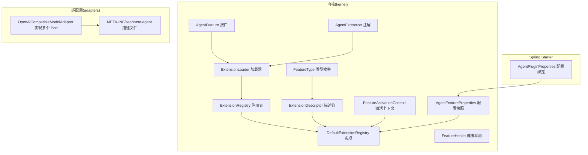
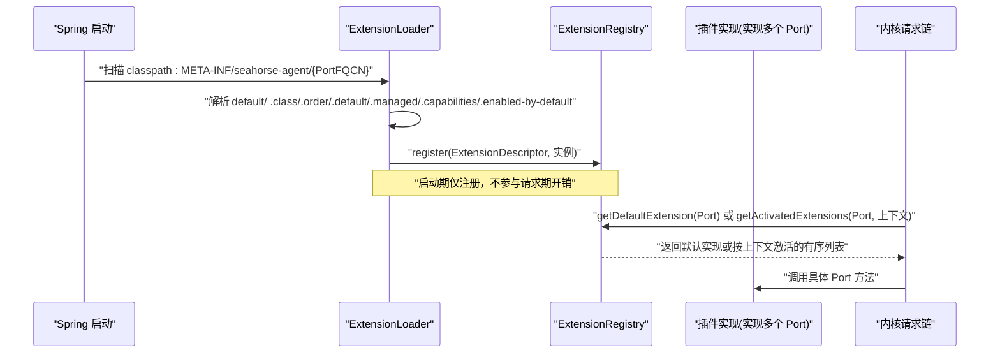
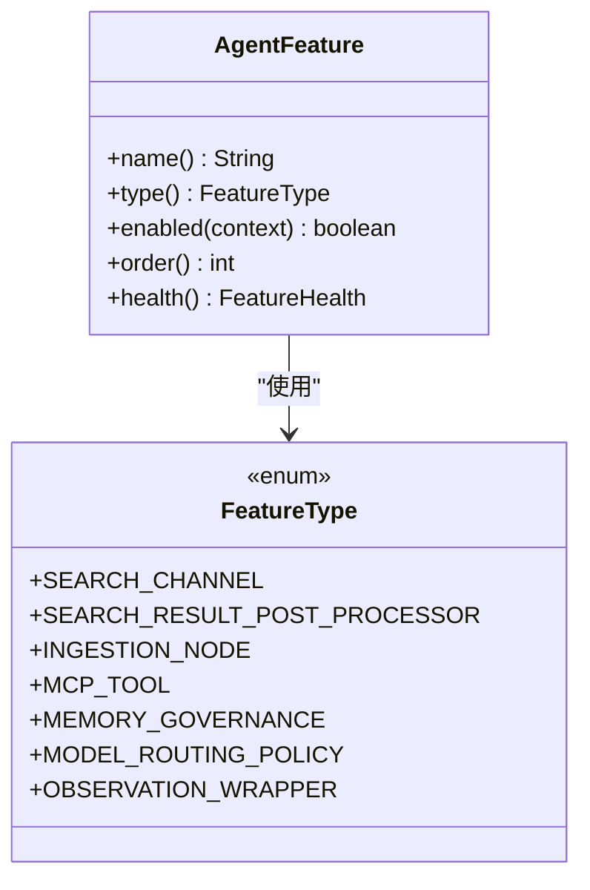
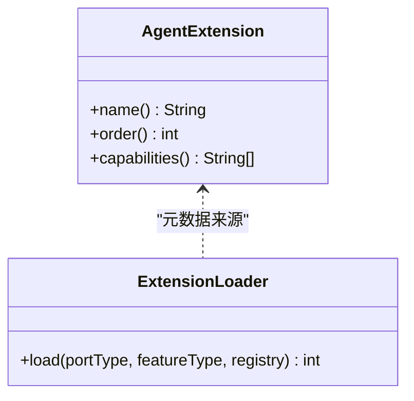
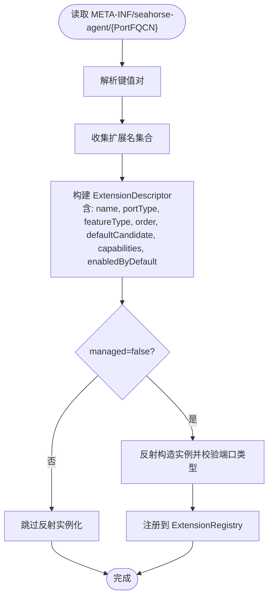
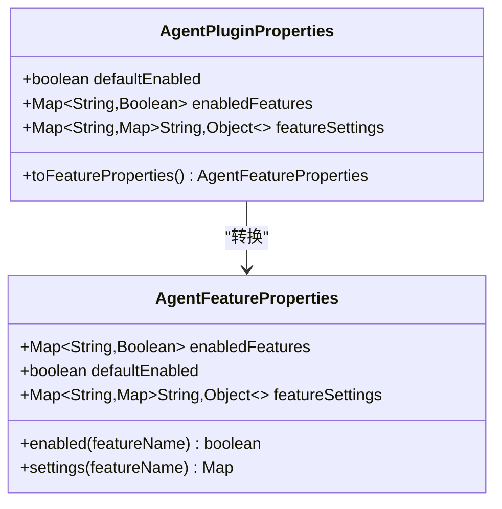
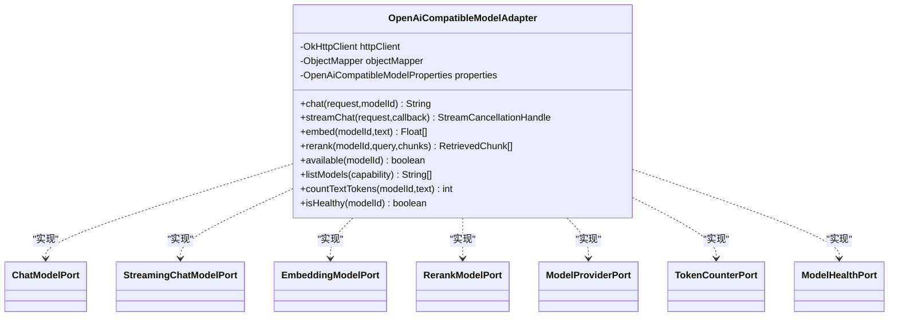
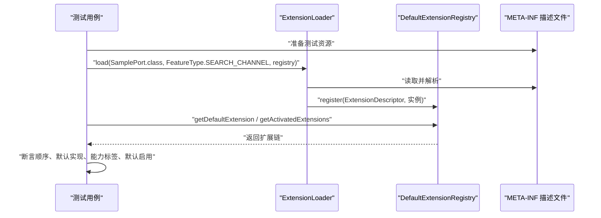
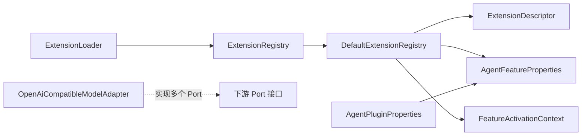

# 自定义插件开发

<cite>
**本文引用的文件**
- [AgentFeature.java](file://seahorse-agent-kernel/src/main/java/com/miracle/ai/seahorse/agent/kernel/plugin/AgentFeature.java)
- [AgentExtension.java](file://seahorse-agent-kernel/src/main/java/com/miracle/ai/seahorse/agent/kernel/plugin/AgentExtension.java)
- [ExtensionLoader.java](file://seahorse-agent-kernel/src/main/java/com/miracle/ai/seahorse/agent/kernel/plugin/ExtensionLoader.java)
- [ExtensionRegistry.java](file://seahorse-agent-kernel/src/main/java/com/miracle/ai/seahorse/agent/kernel/plugin/ExtensionRegistry.java)
- [DefaultExtensionRegistry.java](file://seahorse-agent-kernel/src/main/java/com/miracle/ai/seahorse/agent/kernel/plugin/DefaultExtensionRegistry.java)
- [ExtensionDescriptor.java](file://seahorse-agent-kernel/src/main/java/com/miracle/ai/seahorse/agent/kernel/plugin/ExtensionDescriptor.java)
- [FeatureType.java](file://seahorse-agent-kernel/src/main/java/com/miracle/ai/seahorse/agent/kernel/plugin/FeatureType.java)
- [FeatureActivationContext.java](file://seahorse-agent-kernel/src/main/java/com/miracle/ai/seahorse/agent/kernel/plugin/FeatureActivationContext.java)
- [AgentFeatureProperties.java](file://seahorse-agent-kernel/src/main/java/com/miracle/ai/seahorse/agent/kernel/plugin/AgentFeatureProperties.java)
- [FeatureHealth.java](file://seahorse-agent-kernel/src/main/java/com/miracle/ai/seahorse/agent/kernel/plugin/FeatureHealth.java)
- [OpenAiCompatibleModelAdapter.java](file://seahorse-agent-adapter-ai-openai-compatible/src/main/java/com/miracle/ai/seahorse/agent/adapters/ai/openai/OpenAiCompatibleModelAdapter.java)
- [ChatModelPort 配置](file://seahorse-agent-adapter-ai-openai-compatible/src/main/resources/META-INF/seahorse-agent/com.miracle.ai.seahorse.agent.ports.outbound.model.ChatModelPort)
- [AgentPluginProperties.java](file://seahorse-agent-spring-boot-starter/src/main/java/com/miracle/ai/seahorse/agent/adapters/spring/config/AgentPluginProperties.java)
- [ExtensionLoader 测试资源](file://seahorse-agent-tests/src/test/resources/META-INF/seahorse-agent/com.miracle.ai.seahorse.agent.kernel.plugin.ExtensionLoaderTests$SamplePort)
- [ExtensionLoader 测试用例](file://seahorse-agent-tests/src/test/java/com/miracle/ai/seahorse/agent/kernel/plugin/ExtensionLoaderTests.java)
</cite>

## 目录
1. [简介](#简介)
2. [项目结构](#项目结构)
3. [核心组件](#核心组件)
4. [架构总览](#架构总览)
5. [详细组件分析](#详细组件分析)
6. [依赖分析](#依赖分析)
7. [性能考虑](#性能考虑)
8. [故障排查指南](#故障排查指南)
9. [结论](#结论)
10. [附录](#附录)

## 简介
本指南面向需要在 Seahorse Agent 微内核上开发“自定义插件”的工程师，系统讲解如何实现 AgentFeature 接口、通过 AgentExtension 注解进行注册、定义配置属性、编写 META-INF 配置文件，以及如何进行测试、调试、打包与发布。文档同时给出最佳实践、常见陷阱与性能优化建议，帮助你在保持内核稳定性的前提下，安全地扩展检索通道、MCP 工具、记忆治理、模型路由等扩展点。

## 项目结构
Seahorse Agent 将“插件”抽象为“Feature”，并通过“端口（Port）”隔离具体实现。插件的加载与注册由 ExtensionLoader 基于 classpath 下的 META-INF/seahorse-agent/* 描述文件完成；Spring 启动阶段将配置绑定为只读快照 AgentFeatureProperties，供请求期快速决策。

图表来源
- [AgentFeature.java:26-79](file://seahorse-agent-kernel/src/main/java/com/miracle/ai/seahorse/agent/kernel/plugin/AgentFeature.java#L26-L79)
- [AgentExtension.java:35-57](file://seahorse-agent-kernel/src/main/java/com/miracle/ai/seahorse/agent/kernel/plugin/AgentExtension.java#L35-L57)
- [ExtensionLoader.java:39-261](file://seahorse-agent-kernel/src/main/java/com/miracle/ai/seahorse/agent/kernel/plugin/ExtensionLoader.java#L39-L261)
- [ExtensionRegistry.java:28-83](file://seahorse-agent-kernel/src/main/java/com/miracle/ai/seahorse/agent/kernel/plugin/ExtensionRegistry.java#L28-L83)
- [DefaultExtensionRegistry.java:34-123](file://seahorse-agent-kernel/src/main/java/com/miracle/ai/seahorse/agent/kernel/plugin/DefaultExtensionRegistry.java#L34-L123)
- [ExtensionDescriptor.java:37-65](file://seahorse-agent-kernel/src/main/java/com/miracle/ai/seahorse/agent/kernel/plugin/ExtensionDescriptor.java#L37-L65)
- [FeatureType.java:26-62](file://seahorse-agent-kernel/src/main/java/com/miracle/ai/seahorse/agent/kernel/plugin/FeatureType.java#L26-L62)
- [FeatureActivationContext.java:33-60](file://seahorse-agent-kernel/src/main/java/com/miracle/ai/seahorse/agent/kernel/plugin/FeatureActivationContext.java#L33-L60)
- [AgentFeatureProperties.java:33-94](file://seahorse-agent-kernel/src/main/java/com/miracle/ai/seahorse/agent/kernel/plugin/AgentFeatureProperties.java#L33-L94)
- [FeatureHealth.java:33-67](file://seahorse-agent-kernel/src/main/java/com/miracle/ai/seahorse/agent/kernel/plugin/FeatureHealth.java#L33-L67)
- [OpenAiCompatibleModelAdapter.java:60-82](file://seahorse-agent-adapter-ai-openai-compatible/src/main/java/com/miracle/ai/seahorse/agent/adapters/ai/openai/OpenAiCompatibleModelAdapter.java#L60-L82)
- [ChatModelPort 配置:1-5](file://seahorse-agent-adapter-ai-openai-compatible/src/main/resources/META-INF/seahorse-agent/com.miracle.ai.seahorse.agent.ports.outbound.model.ChatModelPort#L1-L5)
- [AgentPluginProperties.java:30-64](file://seahorse-agent-spring-boot-starter/src/main/java/com/miracle/ai/seahorse/agent/adapters/spring/config/AgentPluginProperties.java#L30-L64)

章节来源
- [AgentFeature.java:26-79](file://seahorse-agent-kernel/src/main/java/com/miracle/ai/seahorse/agent/kernel/plugin/AgentFeature.java#L26-L79)
- [ExtensionLoader.java:39-261](file://seahorse-agent-kernel/src/main/java/com/miracle/ai/seahorse/agent/kernel/plugin/ExtensionLoader.java#L39-L261)
- [DefaultExtensionRegistry.java:34-123](file://seahorse-agent-kernel/src/main/java/com/miracle/ai/seahorse/agent/kernel/plugin/DefaultExtensionRegistry.java#L34-L123)
- [OpenAiCompatibleModelAdapter.java:60-82](file://seahorse-agent-adapter-ai-openai-compatible/src/main/java/com/miracle/ai/seahorse/agent/adapters/ai/openai/OpenAiCompatibleModelAdapter.java#L60-L82)

## 核心组件
- AgentFeature：定义 Feature 的唯一名称、类型、启用条件、排序与健康状态。所有插件实现均需遵循此接口，确保内核统一治理。
- AgentExtension：用于标注扩展实现的名称、顺序与能力标签，便于加载器与注册表读取元数据。
- ExtensionLoader：基于 classpath 的 META-INF/seahorse-agent/* 描述文件进行加载，解析默认实现、排序、能力标签与启用开关。
- ExtensionRegistry/DefaultExtensionRegistry：注册表负责存储扩展实例与描述符，提供默认扩展与按上下文激活的扩展链。
- ExtensionDescriptor：描述符记录扩展的名称、端口类型、Feature 类型、排序、默认候选、能力标签与默认启用标志。
- FeatureType：稳定扩展点枚举，如 SEARCH_CHANNEL、SEARCH_RESULT_POST_PROCESSOR、INGESTION_NODE、MCP_TOOL、MEMORY_GOVERNANCE、MODEL_ROUTING_POLICY、OBSERVATION_WRAPPER。
- FeatureActivationContext/AgentFeatureProperties：激活上下文与配置快照，支持按租户、用户、灰度属性与配置控制 Feature 启用。
- FeatureHealth：健康状态记录，用于启动检查与运维监控。

章节来源
- [AgentFeature.java:26-79](file://seahorse-agent-kernel/src/main/java/com/miracle/ai/seahorse/agent/kernel/plugin/AgentFeature.java#L26-L79)
- [AgentExtension.java:35-57](file://seahorse-agent-kernel/src/main/java/com/miracle/ai/seahorse/agent/kernel/plugin/AgentExtension.java#L35-L57)
- [ExtensionLoader.java:39-261](file://seahorse-agent-kernel/src/main/java/com/miracle/ai/seahorse/agent/kernel/plugin/ExtensionLoader.java#L39-L261)
- [ExtensionRegistry.java:28-83](file://seahorse-agent-kernel/src/main/java/com/miracle/ai/seahorse/agent/kernel/plugin/ExtensionRegistry.java#L28-L83)
- [DefaultExtensionRegistry.java:34-123](file://seahorse-agent-kernel/src/main/java/com/miracle/ai/seahorse/agent/kernel/plugin/DefaultExtensionRegistry.java#L34-L123)
- [ExtensionDescriptor.java:37-65](file://seahorse-agent-kernel/src/main/java/com/miracle/ai/seahorse/agent/kernel/plugin/ExtensionDescriptor.java#L37-L65)
- [FeatureType.java:26-62](file://seahorse-agent-kernel/src/main/java/com/miracle/ai/seahorse/agent/kernel/plugin/FeatureType.java#L26-L62)
- [FeatureActivationContext.java:33-60](file://seahorse-agent-kernel/src/main/java/com/miracle/ai/seahorse/agent/kernel/plugin/FeatureActivationContext.java#L33-L60)
- [AgentFeatureProperties.java:33-94](file://seahorse-agent-kernel/src/main/java/com/miracle/ai/seahorse/agent/kernel/plugin/AgentFeatureProperties.java#L33-L94)
- [FeatureHealth.java:33-67](file://seahorse-agent-kernel/src/main/java/com/miracle/ai/seahorse/agent/kernel/plugin/FeatureHealth.java#L33-L67)

## 架构总览
下图展示了从 Spring 启动到请求期的插件生命周期：启动期加载 META-INF 描述文件，构建注册表；请求期根据 FeatureActivationContext 与 AgentFeatureProperties 过滤并排序扩展。

图表来源
- [ExtensionLoader.java:79-114](file://seahorse-agent-kernel/src/main/java/com/miracle/ai/seahorse/agent/kernel/plugin/ExtensionLoader.java#L79-L114)
- [DefaultExtensionRegistry.java:38-58](file://seahorse-agent-kernel/src/main/java/com/miracle/ai/seahorse/agent/kernel/plugin/DefaultExtensionRegistry.java#L38-L58)
- [ChatModelPort 配置:1-5](file://seahorse-agent-adapter-ai-openai-compatible/src/main/resources/META-INF/seahorse-agent/com.miracle.ai.seahorse.agent.ports.outbound.model.ChatModelPort#L1-L5)

## 详细组件分析

### AgentFeature 接口实现指南
- 唯一名称与类型：name() 与 type() 必须稳定且唯一，type() 选择 FeatureType 中的合适枚举。
- 启用控制：enabled(FeatureActivationContext) 支持基于租户、用户、灰度属性与配置的细粒度开关。
- 排序：order() 数值越小优先级越高；未设置时以 ExtensionDescriptor.order 为准。
- 健康检查：health() 返回 FeatureHealth，避免在请求链路中主动访问外部服务。

图表来源
- [AgentFeature.java:26-79](file://seahorse-agent-kernel/src/main/java/com/miracle/ai/seahorse/agent/kernel/plugin/AgentFeature.java#L26-L79)
- [FeatureType.java:26-62](file://seahorse-agent-kernel/src/main/java/com/miracle/ai/seahorse/agent/kernel/plugin/FeatureType.java#L26-L62)

章节来源
- [AgentFeature.java:26-79](file://seahorse-agent-kernel/src/main/java/com/miracle/ai/seahorse/agent/kernel/plugin/AgentFeature.java#L26-L79)
- [FeatureType.java:26-62](file://seahorse-agent-kernel/src/main/java/com/miracle/ai/seahorse/agent/kernel/plugin/FeatureType.java#L26-L62)

### AgentExtension 注册与元数据
- name()：扩展名称，同一端口下必须唯一。
- order()：数字越小越靠前。
- capabilities()：能力标签集合，用于能力筛选与运维展示。
- 与 ExtensionLoader 的配合：加载器会读取 .class、.order、.default、.managed、.capabilities、.enabled-by-default 等键。

图表来源
- [AgentExtension.java:35-57](file://seahorse-agent-kernel/src/main/java/com/miracle/ai/seahorse/agent/kernel/plugin/AgentExtension.java#L35-L57)
- [ExtensionLoader.java:156-190](file://seahorse-agent-kernel/src/main/java/com/miracle/ai/seahorse/agent/kernel/plugin/ExtensionLoader.java#L156-L190)

章节来源
- [AgentExtension.java:35-57](file://seahorse-agent-kernel/src/main/java/com/miracle/ai/seahorse/agent/kernel/plugin/AgentExtension.java#L35-L57)
- [ExtensionLoader.java:156-190](file://seahorse-agent-kernel/src/main/java/com/miracle/ai/seahorse/agent/kernel/plugin/ExtensionLoader.java#L156-L190)

### META-INF 配置机制与示例
- 路径约定：META-INF/seahorse-agent/{端口全限定名}
- 关键键值：
  - default：默认实现名称
  - {name}.class：实现类全限定名
  - {name}.order：排序
  - {name}.default：是否为默认候选
  - {name}.managed：是否由容器托管（不通过反射实例化）
  - {name}.capabilities：能力标签
  - {name}.enabled-by-default：未显式配置时是否默认启用
- 示例参考：OpenAI 兼容模型适配器对 ChatModelPort 的配置。

图表来源
- [ExtensionLoader.java:95-171](file://seahorse-agent-kernel/src/main/java/com/miracle/ai/seahorse/agent/kernel/plugin/ExtensionLoader.java#L95-L171)
- [ChatModelPort 配置:1-5](file://seahorse-agent-adapter-ai-openai-compatible/src/main/resources/META-INF/seahorse-agent/com.miracle.ai.seahorse.agent.ports.outbound.model.ChatModelPort#L1-L5)

章节来源
- [ExtensionLoader.java:95-171](file://seahorse-agent-kernel/src/main/java/com/miracle/ai/seahorse/agent/kernel/plugin/ExtensionLoader.java#L95-L171)
- [ChatModelPort 配置:1-5](file://seahorse-agent-adapter-ai-openai-compatible/src/main/resources/META-INF/seahorse-agent/com.miracle.ai.seahorse.agent.ports.outbound.model.ChatModelPort#L1-L5)

### 配置属性与 Spring 绑定
- Spring 配置前缀：seahorse-agent.plugins
- AgentPluginProperties 提供：
  - defaultEnabled：全局默认启用开关
  - enabledFeatures：按 Feature 名称的启用映射
  - featureSettings：Feature 透传配置
- toFeatureProperties() 输出只读快照，供请求期直接使用，避免反复读取配置。

图表来源
- [AgentPluginProperties.java:30-64](file://seahorse-agent-spring-boot-starter/src/main/java/com/miracle/ai/seahorse/agent/adapters/spring/config/AgentPluginProperties.java#L30-L64)
- [AgentFeatureProperties.java:33-94](file://seahorse-agent-kernel/src/main/java/com/miracle/ai/seahorse/agent/kernel/plugin/AgentFeatureProperties.java#L33-L94)

章节来源
- [AgentPluginProperties.java:30-64](file://seahorse-agent-spring-boot-starter/src/main/java/com/miracle/ai/seahorse/agent/adapters/spring/config/AgentPluginProperties.java#L30-L64)
- [AgentFeatureProperties.java:33-94](file://seahorse-agent-kernel/src/main/java/com/miracle/ai/seahorse/agent/kernel/plugin/AgentFeatureProperties.java#L33-L94)

### 插件实现示例：多端口适配器
- OpenAiCompatibleModelAdapter 实现多个下游 Port（聊天、流式聊天、嵌入、重排、模型发现、令牌计数、健康检查），体现“L2 Feature 只表达业务扩展能力，不直接暴露底层 SDK”的原则。
- 通过构造函数注入 OkHttpClient、ObjectMapper 与属性对象，确保可测试与可替换。

图表来源
- [OpenAiCompatibleModelAdapter.java:60-82](file://seahorse-agent-adapter-ai-openai-compatible/src/main/java/com/miracle/ai/seahorse/agent/adapters/ai/openai/OpenAiCompatibleModelAdapter.java#L60-L82)

章节来源
- [OpenAiCompatibleModelAdapter.java:60-82](file://seahorse-agent-adapter-ai-openai-compatible/src/main/java/com/miracle/ai/seahorse/agent/adapters/ai/openai/OpenAiCompatibleModelAdapter.java#L60-L82)

### 测试策略与调试技巧
- 单元测试：使用 ExtensionLoaderTests 展示如何通过 classpath 描述文件加载扩展、验证默认实现与排序、读取能力标签与默认启用标志。
- 集成测试：通过 Spring Boot 自动装配与 AgentFeatureProperties 快照，验证 Feature 在不同上下文下的启用行为。
- 调试技巧：
  - 检查 META-INF 描述文件键值拼写与命名空间一致性。
  - 使用 ExtensionLoader.diagnostics() 获取加载诊断信息。
  - 在 DefaultExtensionRegistry.register() 处断点，观察重复名称与端口类型校验。
  - 使用 FeatureHealth.up()/down() 记录健康状态，便于运维监控。

图表来源
- [ExtensionLoader 测试资源:1-11](file://seahorse-agent-tests/src/test/resources/META-INF/seahorse-agent/com.miracle.ai.seahorse.agent.kernel.plugin.ExtensionLoaderTests$SamplePort#L1-L11)
- [ExtensionLoader 测试用例:31-50](file://seahorse-agent-tests/src/test/java/com/miracle/ai/seahorse/agent/kernel/plugin/ExtensionLoaderTests.java#L31-L50)

章节来源
- [ExtensionLoader 测试资源:1-11](file://seahorse-agent-tests/src/test/resources/META-INF/seahorse-agent/com.miracle.ai.seahorse.agent.kernel.plugin.ExtensionLoaderTests$SamplePort#L1-L11)
- [ExtensionLoader 测试用例:31-50](file://seahorse-agent-tests/src/test/java/com/miracle/ai/seahorse/agent/kernel/plugin/ExtensionLoaderTests.java#L31-L50)

## 依赖分析
- 组件耦合与内聚：
  - ExtensionLoader 与 ExtensionRegistry 解耦，加载期与请求期职责分离。
  - DefaultExtensionRegistry 对 ExtensionDescriptor 的强约束（名称唯一、端口类型一致）提升内核稳定性。
  - AgentFeature 与 FeatureActivationContext/AgentFeatureProperties 解耦配置与实现，便于灰度与实验。
- 外部依赖：
  - 适配器通过构造函数注入第三方客户端（如 OkHttp），避免在 Feature 中直接引入 SDK。
  - Spring 配置绑定 AgentPluginProperties，输出只读 AgentFeatureProperties。

图表来源
- [ExtensionLoader.java:79-114](file://seahorse-agent-kernel/src/main/java/com/miracle/ai/seahorse/agent/kernel/plugin/ExtensionLoader.java#L79-L114)
- [DefaultExtensionRegistry.java:68-78](file://seahorse-agent-kernel/src/main/java/com/miracle/ai/seahorse/agent/kernel/plugin/DefaultExtensionRegistry.java#L68-L78)
- [AgentPluginProperties.java:61-63](file://seahorse-agent-spring-boot-starter/src/main/java/com/miracle/ai/seahorse/agent/adapters/spring/config/AgentPluginProperties.java#L61-L63)

章节来源
- [DefaultExtensionRegistry.java:68-78](file://seahorse-agent-kernel/src/main/java/com/miracle/ai/seahorse/agent/kernel/plugin/DefaultExtensionRegistry.java#L68-L78)
- [AgentPluginProperties.java:61-63](file://seahorse-agent-spring-boot-starter/src/main/java/com/miracle/ai/seahorse/agent/adapters/spring/config/AgentPluginProperties.java#L61-L63)

## 性能考虑
- 启动期加载，请求期只读：ExtensionLoader 仅在启动期扫描 classpath 并注册；请求期通过 ExtensionRegistry 快速获取默认或激活的扩展链，避免反射扫描带来的抖动。
- 健康检查非阻塞：FeatureHealth 仅报告自身状态，不参与请求链路，降低主链路耗时。
- 配置快照化：AgentFeatureProperties 防御性复制 Map，避免请求期频繁 IO 与解析。
- 适配器最小化：L2 Feature 不直接暴露底层 SDK，减少耦合并便于替换。

## 故障排查指南
- 加载失败：
  - 检查 META-INF 描述文件是否存在、键值拼写是否正确。
  - 查看 ExtensionLoader.diagnostics() 获取诊断信息。
- 实例化异常：
  - 确认 .class 指向的类存在且可无参构造。
  - 确保实现类实现了正确的端口类型。
- 注册冲突：
  - 同一端口下扩展名称重复会导致抛出异常，需调整 name() 或删除重复项。
- 启用问题：
  - 检查 AgentPluginProperties 中的 enabledFeatures 与 defaultEnabled 设置。
  - 若 Feature 实现了 AgentFeature，确认 enabled(FeatureActivationContext) 返回预期值。

章节来源
- [ExtensionLoader.java:166-171](file://seahorse-agent-kernel/src/main/java/com/miracle/ai/seahorse/agent/kernel/plugin/ExtensionLoader.java#L166-L171)
- [DefaultExtensionRegistry.java:94-101](file://seahorse-agent-kernel/src/main/java/com/miracle/ai/seahorse/agent/kernel/plugin/DefaultExtensionRegistry.java#L94-L101)
- [AgentFeatureProperties.java:75-80](file://seahorse-agent-kernel/src/main/java/com/miracle/ai/seahorse/agent/kernel/plugin/AgentFeatureProperties.java#L75-L80)

## 结论
通过 AgentFeature 与 AgentExtension 的标准化接口与注解，结合 ExtensionLoader 与 ExtensionRegistry 的启动期加载与请求期只读机制，Seahorse Agent 实现了稳定、可治理、高性能的插件化架构。开发者只需专注于实现业务能力（L2 Feature），并通过 META-INF 描述文件与 Spring 配置完成注册与治理，即可安全地扩展检索、MCP 工具、记忆治理、模型路由等关键能力。

## 附录

### 插件开发最佳实践清单
- 设计稳定的 Feature 名称与类型，避免频繁变更。
- 使用 AgentExtension 注解明确 order 与 capabilities，便于运维与灰度。
- 在 META-INF 中提供 default 与 .order，确保默认实现清晰。
- 通过构造函数注入第三方客户端，避免在 Feature 中直接引入 SDK。
- 使用 AgentFeatureProperties 与 FeatureActivationContext 实现细粒度启用控制。
- 编写单元与集成测试，覆盖加载、排序、默认实现与健康状态。
- 严格遵守端口隔离原则，L2 Feature 不直接暴露底层实现细节。

### 发布与部署流程（建议）
- 打包：将适配器模块打包为独立 artifact，包含 META-INF 配置与必要的依赖。
- 版本管理：遵循语义化版本，为插件提供独立的版本号与变更日志。
- 签名：对 artifact 进行数字签名，确保供应链安全。
- 部署：将 artifact 放入应用 classpath 或通过容器镜像分发，确保 META-INF 配置路径正确。
- 回滚：保留上一个版本的 artifact，以便快速回滚。