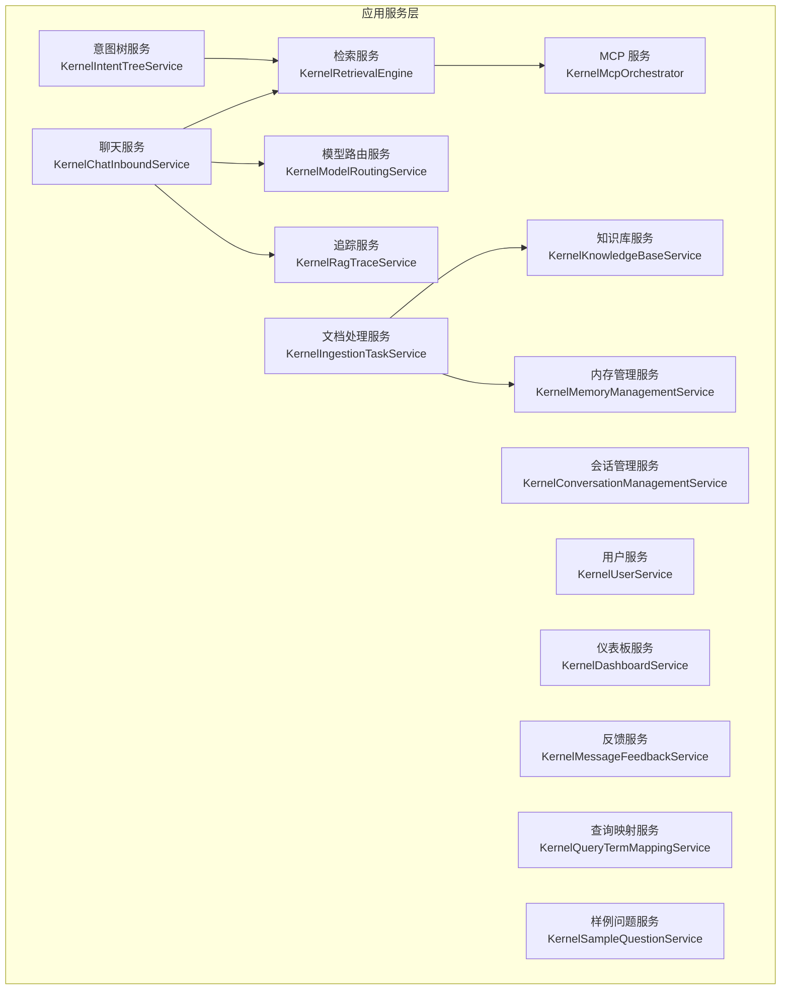
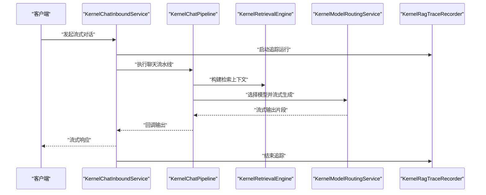
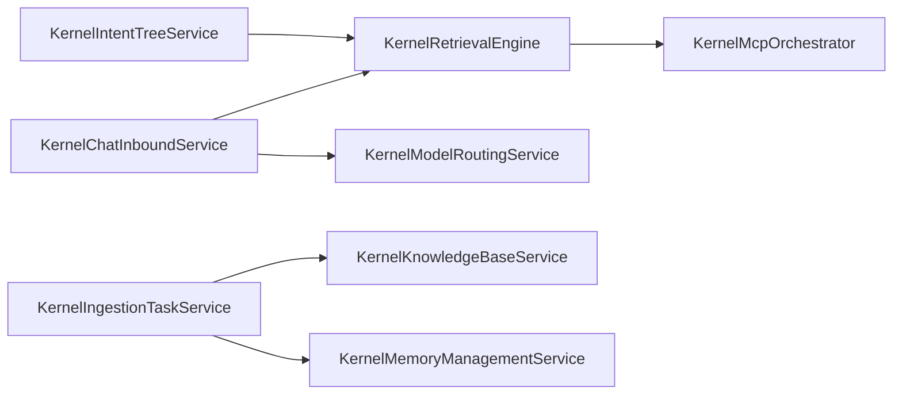

# 应用服务层

<cite>
**本文引用的文件**
- [KernelChatInboundService.java](file://seahorse-agent-kernel/src/main/java/com/miracle/ai/seahorse/agent/kernel/application/chat/KernelChatInboundService.java)
- [KernelKnowledgeBaseService.java](file://seahorse-agent-kernel/src/main/java/com/miracle/ai/seahorse/agent/kernel/application/knowledge/KernelKnowledgeBaseService.java)
- [KernelConversationManagementService.java](file://seahorse-agent-kernel/src/main/java/com/miracle/ai/seahorse/agent/kernel/application/conversation/KernelConversationManagementService.java)
- [KernelIngestionTaskService.java](file://seahorse-agent-kernel/src/main/java/com/miracle/ai/seahorse/agent/kernel/application/ingestion/KernelIngestionTaskService.java)
- [KernelMemoryManagementService.java](file://seahorse-agent-kernel/src/main/java/com/miracle/ai/seahorse/agent/kernel/application/memory/KernelMemoryManagementService.java)
- [KernelUserService.java](file://seahorse-agent-kernel/src/main/java/com/miracle/ai/seahorse/agent/kernel/application/user/KernelUserService.java)
- [KernelDashboardService.java](file://seahorse-agent-kernel/src/main/java/com/miracle/ai/seahorse/agent/kernel/application/dashboard/KernelDashboardService.java)
- [KernelMessageFeedbackService.java](file://seahorse-agent-kernel/src/main/java/com/miracle/ai/seahorse/agent/kernel/application/feedback/KernelMessageFeedbackService.java)
- [KernelQueryTermMappingService.java](file://seahorse-agent-kernel/src/main/java/com/miracle/ai/seahorse/agent/kernel/application/mapping/KernelQueryTermMappingService.java)
- [KernelSampleQuestionService.java](file://seahorse-agent-kernel/src/main/java/com/miracle/ai/seahorse/agent/kernel/application/sample/KernelSampleQuestionService.java)
- [KernelRagTraceService.java](file://seahorse-agent-kernel/src/main/java/com/miracle/ai/seahorse/agent/kernel/application/trace/KernelRagTraceService.java)
- [KernelMcpOrchestrator.java](file://seahorse-agent-kernel/src/main/java/com/miracle/ai/seahorse/agent/kernel/application/mcp/KernelMcpOrchestrator.java)
- [KernelModelRoutingService.java](file://seahorse-agent-kernel/src/main/java/com/miracle/ai/seahorse/agent/kernel/application/model/KernelModelRoutingService.java)
- [KernelRetrievalEngine.java](file://seahorse-agent-kernel/src/main/java/com/miracle/ai/seahorse/agent/kernel/application/retrieval/KernelRetrievalEngine.java)
- [KernelIntentTreeService.java](file://seahorse-agent-kernel/src/main/java/com/miracle/ai/seahorse/agent/kernel/application/intent/KernelIntentTreeService.java)
</cite>

## 目录
1. [引言](#引言)
2. [项目结构](#项目结构)
3. [核心组件](#核心组件)
4. [架构总览](#架构总览)
5. [详细组件分析](#详细组件分析)
6. [依赖分析](#依赖分析)
7. [性能考虑](#性能考虑)
8. [故障排查指南](#故障排查指南)
9. [结论](#结论)
10. [附录](#附录)

## 引言
本文件面向应用服务层，系统性梳理并深入解析各业务领域应用服务的职责、流程与协作关系，覆盖聊天服务、知识库服务、会话管理服务、文档处理服务、内存管理服务、用户服务、仪表板服务、反馈服务、查询映射服务、样例问题服务、追踪服务、MCP 服务、模型路由服务、检索服务、意图树服务等。文档同时阐述设计原则（如端口隔离、职责单一、可替换性）、业务逻辑组织方式、事务与错误处理策略，并提供使用示例与最佳实践建议，帮助开发者在不深入底层实现的前提下高效使用与扩展。

## 项目结构
应用服务层位于内核模块中，以“领域 + 入站端口实现”的方式组织，每个服务实现对应领域的 Inbound Port，协调下游端口完成业务闭环。整体采用端口-适配器风格，确保业务逻辑与外部基础设施解耦。

图表来源
- [KernelChatInboundService.java:34-94](file://seahorse-agent-kernel/src/main/java/com/miracle/ai/seahorse/agent/kernel/application/chat/KernelChatInboundService.java#L34-L94)
- [KernelKnowledgeBaseService.java:40-142](file://seahorse-agent-kernel/src/main/java/com/miracle/ai/seahorse/agent/kernel/application/knowledge/KernelKnowledgeBaseService.java#L40-L142)
- [KernelConversationManagementService.java:31-87](file://seahorse-agent-kernel/src/main/java/com/miracle/ai/seahorse/agent/kernel/application/conversation/KernelConversationManagementService.java#L31-L87)
- [KernelIngestionTaskService.java:53-407](file://seahorse-agent-kernel/src/main/java/com/miracle/ai/seahorse/agent/kernel/application/ingestion/KernelIngestionTaskService.java#L53-L407)
- [KernelMemoryManagementService.java:32-108](file://seahorse-agent-kernel/src/main/java/com/miracle/ai/seahorse/agent/kernel/application/memory/KernelMemoryManagementService.java#L32-L108)
- [KernelUserService.java:35-176](file://seahorse-agent-kernel/src/main/java/com/miracle/ai/seahorse/agent/kernel/application/user/KernelUserService.java#L35-L176)
- [KernelDashboardService.java:31-54](file://seahorse-agent-kernel/src/main/java/com/miracle/ai/seahorse/agent/kernel/application/dashboard/KernelDashboardService.java#L31-L54)
- [KernelMessageFeedbackService.java:33-53](file://seahorse-agent-kernel/src/main/java/com/miracle/ai/seahorse/agent/kernel/application/feedback/KernelMessageFeedbackService.java#L33-L53)
- [KernelQueryTermMappingService.java:32-137](file://seahorse-agent-kernel/src/main/java/com/miracle/ai/seahorse/agent/kernel/application/mapping/KernelQueryTermMappingService.java#L32-L137)
- [KernelSampleQuestionService.java:35-128](file://seahorse-agent-kernel/src/main/java/com/miracle/ai/seahorse/agent/kernel/application/sample/KernelSampleQuestionService.java#L35-L128)
- [KernelRagTraceService.java:35-83](file://seahorse-agent-kernel/src/main/java/com/miracle/ai/seahorse/agent/kernel/application/trace/KernelRagTraceService.java#L35-L83)
- [KernelMcpOrchestrator.java:45-137](file://seahorse-agent-kernel/src/main/java/com/miracle/ai/seahorse/agent/kernel/application/mcp/KernelMcpOrchestrator.java#L45-L137)
- [KernelModelRoutingService.java:41-185](file://seahorse-agent-kernel/src/main/java/com/miracle/ai/seahorse/agent/kernel/application/model/KernelModelRoutingService.java#L41-L185)
- [KernelRetrievalEngine.java:53-244](file://seahorse-agent-kernel/src/main/java/com/miracle/ai/seahorse/agent/kernel/application/retrieval/KernelRetrievalEngine.java#L53-L244)
- [KernelIntentTreeService.java:41-231](file://seahorse-agent-kernel/src/main/java/com/miracle/ai/seahorse/agent/kernel/application/intent/KernelIntentTreeService.java#L41-L231)

章节来源
- [KernelChatInboundService.java:34-94](file://seahorse-agent-kernel/src/main/java/com/miracle/ai/seahorse/agent/kernel/application/chat/KernelChatInboundService.java#L34-L94)
- [KernelRetrievalEngine.java:53-244](file://seahorse-agent-kernel/src/main/java/com/miracle/ai/seahorse/agent/kernel/application/retrieval/KernelRetrievalEngine.java#L53-L244)

## 核心组件
- 设计原则
  - 端口隔离：通过 Inbound/Outbound 端口定义边界，业务服务只依赖抽象。
  - 职责单一：每个应用服务聚焦一个业务域，避免跨域耦合。
  - 可替换性：通过注入不同适配器实现运行时替换，便于测试与扩展。
  - 错误显式：对非法输入与业务异常进行显式校验与抛错，便于上层处理。
  - 可观测性：内置追踪入口，记录运行生命周期，便于诊断与审计。
- 事务与一致性
  - 对于写操作，服务内部进行前置校验与必要约束检查，但不直接管理分布式事务；持久化一致性由下游仓储端口保障。
  - 流式任务通过任务端口取消，保证资源可控。
- 错误处理
  - 统一参数校验与业务断言，抛出明确异常信息。
  - 流式回调中捕获异常并回传给调用方，确保客户端可观测错误。

章节来源
- [KernelChatInboundService.java:56-73](file://seahorse-agent-kernel/src/main/java/com/miracle/ai/seahorse/agent/kernel/application/chat/KernelChatInboundService.java#L56-L73)
- [KernelUserService.java:65-114](file://seahorse-agent-kernel/src/main/java/com/miracle/ai/seahorse/agent/kernel/application/user/KernelUserService.java#L65-L114)

## 架构总览
应用服务层作为 L1 边界内的业务编排者，向上承接控制器/前端请求，向下协调模型、检索、存储、缓存、消息队列等基础设施端口，形成稳定的业务闭环。

图表来源
- [KernelChatInboundService.java:56-73](file://seahorse-agent-kernel/src/main/java/com/miracle/ai/seahorse/agent/kernel/application/chat/KernelChatInboundService.java#L56-L73)
- [KernelRetrievalEngine.java:90-107](file://seahorse-agent-kernel/src/main/java/com/miracle/ai/seahorse/agent/kernel/application/retrieval/KernelRetrievalEngine.java#L90-L107)
- [KernelModelRoutingService.java:106-112](file://seahorse-agent-kernel/src/main/java/com/miracle/ai/seahorse/agent/kernel/application/model/KernelModelRoutingService.java#L106-L112)

## 详细组件分析

### 聊天服务（KernelChatInboundService）
- 核心功能
  - 提供流式对话入口，接收命令与回调，启动追踪，驱动聊天流水线执行，并在异常时回传错误。
  - 支持按 taskId 取消流式任务。
- 业务流程
  - 参数校验 → 启动追踪 → 构建上下文 → 执行流水线 → 结束追踪 → 回调通知。
- 关键交互
  - 与 KernelChatPipeline 协作完成对话编排。
  - 与 KernelRagTraceRecorder 集成追踪。
  - 与 StreamTaskPort 协作实现任务取消。
- 使用示例
  - 前端发起流式对话请求，服务端应用层接收命令与回调，调用 streamChat 完成一次问答。
- 最佳实践
  - 在回调 onError 中统一处理异常，避免未捕获异常导致连接中断。
  - 合理设置 deepThinking 与 taskId，便于追踪与取消。

章节来源
- [KernelChatInboundService.java:34-94](file://seahorse-agent-kernel/src/main/java/com/miracle/ai/seahorse/agent/kernel/application/chat/KernelChatInboundService.java#L34-L94)

### 知识库服务（KernelKnowledgeBaseService）
- 核心功能
  - 创建、更新、删除、查询知识库；分页查询；列举切片策略。
- 业务流程
  - 创建：校验名称唯一性 → 确保对象存储桶与向量集合存在 → 写入仓储。
  - 更新：校验名称唯一性与模型变更限制 → 更新仓储。
  - 删除：校验无文档残留 → 删除仓储记录。
- 关键交互
  - 与 KnowledgeBaseRepositoryPort 交互仓储。
  - 与 ObjectStoragePort、VectorCollectionAdminPort 协作基础设施准备。
- 使用示例
  - 创建知识库时指定名称、嵌入模型与集合名，服务自动初始化存储与向量集合。
- 最佳实践
  - 嵌入模型一旦已有向量化文档，禁止修改，确保检索一致性。
  - 建议在 UI 层提供切片策略预览，辅助用户选择。

章节来源
- [KernelKnowledgeBaseService.java:40-142](file://seahorse-agent-kernel/src/main/java/com/miracle/ai/seahorse/agent/kernel/application/knowledge/KernelKnowledgeBaseService.java#L40-L142)

### 会话管理服务（KernelConversationManagementService）
- 核心功能
  - 列出会话、重命名、删除；列出会话消息。
- 业务流程
  - 列表/消息：校验参数 → 调用仓储 → 返回结果。
  - 重命名/删除：校验标题长度与存在性 → 调用仓储 → 失败抛错。
- 关键交互
  - 与 ConversationRepositoryPort 交互仓储。
- 使用示例
  - 用户重命名会话时，服务端校验标题长度并更新。
- 最佳实践
  - 标题长度限制统一在服务层控制，避免前端重复校验。

章节来源
- [KernelConversationManagementService.java:31-87](file://seahorse-agent-kernel/src/main/java/com/miracle/ai/seahorse/agent/kernel/application/conversation/KernelConversationManagementService.java#L31-L87)

### 文档处理服务（KernelIngestionTaskService）
- 核心功能
  - 执行入库任务（创建/上传）、查询任务、列出节点日志、分页查询。
- 业务流程
  - 解析源与内容 → 校验管道存在 → 创建运行中任务 → 执行引擎 → 记录日志与结果 → 返回执行结果。
- 关键交互
  - 与 KernelIngestionEngine 协作执行流水线。
  - 与 PipelineDefinitionRepositoryPort、IngestionTaskRepositoryPort 交互仓储。
- 使用示例
  - 上传文件后触发入库任务，服务端返回任务 ID 与状态。
- 最佳实践
  - 上传内容需校验非空；管道 ID 必填；节点顺序基于拓扑推导，避免手工配置错误。

章节来源
- [KernelIngestionTaskService.java:53-407](file://seahorse-agent-kernel/src/main/java/com/miracle/ai/seahorse/agent/kernel/application/ingestion/KernelIngestionTaskService.java#L53-L407)

### 内存管理服务（KernelMemoryManagementService）
- 核心功能
  - 分页列出不同层级记忆（工作、短期、长期、语义），按用户或会话过滤；查询/删除记忆；质量快照与冲突列表。
- 业务流程
  - 根据层级选择对应存储端口 → 执行查询/删除 → 返回分页结果。
- 关键交互
  - 通过 MemoryManagementServicePorts 注入各层存储端口。
- 使用示例
  - 列举用户短期记忆，限制条数，用于前端展示。
- 最佳实践
  - 层级归一化处理，避免大小写与连字符差异导致的错误。

章节来源
- [KernelMemoryManagementService.java:32-108](file://seahorse-agent-kernel/src/main/java/com/miracle/ai/seahorse/agent/kernel/application/memory/KernelMemoryManagementService.java#L32-L108)

### 用户服务（KernelUserService）
- 核心功能
  - 当前用户查询、分页查询、创建、更新、删除、改密。
- 业务流程
  - 管理员权限校验 → 校验用户名可用 → 密码加密 → 写入仓储。
  - 自己改密：校验当前密码 → 加密新密码 → 更新。
- 关键交互
  - 与 UserRepositoryPort、PasswordHasherPort、CurrentUserPort 交互。
- 使用示例
  - 管理员批量维护用户，支持角色与头像更新。
- 最佳实践
  - 默认管理员账号不可被修改或删除，防止系统被锁定。

章节来源
- [KernelUserService.java:35-176](file://seahorse-agent-kernel/src/main/java/com/miracle/ai/seahorse/agent/kernel/application/user/KernelUserService.java#L35-L176)

### 仪表板服务（KernelDashboardService）
- 核心功能
  - 概览、性能、趋势指标查询。
- 业务流程
  - 直接委托仓储端口返回聚合结果。
- 关键交互
  - 与 DashboardRepositoryPort 交互。
- 使用示例
  - 前端按时间窗口请求趋势图数据。
- 最佳实践
  - 时间窗口与粒度参数由服务层标准化，避免前端传递非法值。

章节来源
- [KernelDashboardService.java:31-54](file://seahorse-agent-kernel/src/main/java/com/miracle/ai/seahorse/agent/kernel/application/dashboard/KernelDashboardService.java#L31-L54)

### 反馈服务（KernelMessageFeedbackService）
- 核心功能
  - 提交消息反馈（点赞/踩、原因、评论）。
- 业务流程
  - 参数校验 → 写入反馈仓储。
- 关键交互
  - 与 MessageFeedbackRepositoryPort 交互。
- 使用示例
  - 用户点击“有用/没用”按钮提交反馈。
- 最佳实践
  - 默认直接写入，保证可靠性；若需异步化，可在适配层切换。

章节来源
- [KernelMessageFeedbackService.java:33-53](file://seahorse-agent-kernel/src/main/java/com/miracle/ai/seahorse/agent/kernel/application/feedback/KernelMessageFeedbackService.java#L33-L53)

### 查询映射服务（KernelQueryTermMappingService）
- 核心功能
  - 映射词条的增删改查与分页。
- 业务流程
  - 校验参数 → 写入仓储 → 清理缓存。
- 关键交互
  - 与 QueryTermMappingRepositoryPort、KeyValueCachePort 交互。
- 使用示例
  - 将“OA”映射到“办公自动化”，提升检索召回。
- 最佳实践
  - 缓存键统一管理，变更即清空，避免脏读。

章节来源
- [KernelQueryTermMappingService.java:32-137](file://seahorse-agent-kernel/src/main/java/com/miracle/ai/seahorse/agent/kernel/application/mapping/KernelQueryTermMappingService.java#L32-L137)

### 样例问题服务（KernelSampleQuestionService）
- 核心功能
  - 随机问题、分页查询、详情、创建、更新、删除。
- 业务流程
  - 校验参数 → 写入/更新仓储 → 抛错处理。
- 关键交互
  - 与 SampleQuestionRepositoryPort 交互。
- 使用示例
  - 首屏展示随机样例问题，引导用户提问。
- 最佳实践
  - 分页大小上限控制，避免超大请求。

章节来源
- [KernelSampleQuestionService.java:35-128](file://seahorse-agent-kernel/src/main/java/com/miracle/ai/seahorse/agent/kernel/application/sample/KernelSampleQuestionService.java#L35-L128)

### 追踪服务（KernelRagTraceService）
- 核心功能
  - 分页查询 RAG 运行、查看明细与节点列表。
- 业务流程
  - 参数标准化 → 委托仓储 → 返回分页与明细。
- 关键交互
  - 与 RagTraceRepositoryPort 交互。
- 使用示例
  - 查看某次对话的完整追踪链路与节点耗时。
- 最佳实践
  - 控制分页大小，避免一次性拉取过多数据。

章节来源
- [KernelRagTraceService.java:35-83](file://seahorse-agent-kernel/src/main/java/com/miracle/ai/seahorse/agent/kernel/application/trace/KernelRagTraceService.java#L35-L83)

### MCP 服务（KernelMcpOrchestrator）
- 核心功能
  - 工具发现、参数抽取、并发执行、异常降级与结果封装。
- 业务流程
  - 根据意图候选并发执行工具 → 参数抽取失败降级为空参数 → 执行失败降级为失败结果。
- 关键交互
  - 与 McpToolRegistryPort、McpParameterExtractionPort、McpToolExecutorPort 交互。
- 使用示例
  - 将子问题与意图评分交给编排器，自动选择并执行工具。
- 最佳实践
  - 使用独立线程池执行，避免阻塞主线程；参数抽取异常不影响主流程。

章节来源
- [KernelMcpOrchestrator.java:45-137](file://seahorse-agent-kernel/src/main/java/com/miracle/ai/seahorse/agent/kernel/application/mcp/KernelMcpOrchestrator.java#L45-L137)

### 模型路由服务（KernelModelRoutingService）
- 核心功能
  - 模型选择、健康探测、回退、令牌计数、能力查询。
- 业务流程
  - 依据能力与健康状态选择模型 → 成功记录成功 → 失败尝试回退 → 无法回退则抛原始异常。
- 关键交互
  - 与 ChatModelPort、StreamingChatModelPort、ModelProviderPort、Embedding/Rerank 端口、ModelHealthPort、ModelRoutingStatePort 交互。
- 使用示例
  - 发起对话时选择健康可用模型，失败自动回退。
- 最佳实践
  - 优先使用健康探测与状态端口，确保高可用；回退策略应覆盖常见异常场景。

章节来源
- [KernelModelRoutingService.java:41-185](file://seahorse-agent-kernel/src/main/java/com/miracle/ai/seahorse/agent/kernel/application/model/KernelModelRoutingService.java#L41-L185)

### 检索服务（KernelRetrievalEngine）
- 核心功能
  - 并发构建子问题上下文、KB 多通道检索、MCP 工具执行与上下文合并。
- 业务流程
  - 子问题并发执行 → KB 检索与重排 → MCP 工具执行 → 上下文格式化与合并。
- 关键交互
  - 与 KernelMultiChannelRetrievalEngine、KernelMcpOrchestrator、RetrievalContextFormatPort 交互。
- 使用示例
  - 将复杂问题拆分为多个子问题，分别检索知识库与工具，最终合并为统一上下文。
- 最佳实践
  - 子问题 TopK 动态计算，避免过度检索；异常降级为空上下文，保证主流程稳定。

章节来源
- [KernelRetrievalEngine.java:53-244](file://seahorse-agent-kernel/src/main/java/com/miracle/ai/seahorse/agent/kernel/application/retrieval/KernelRetrievalEngine.java#L53-L244)

### 意图树服务（KernelIntentTreeService）
- 核心功能
  - 意图树查询、节点增删改、批量启用/禁用/删除。
- 业务流程
  - 校验父子关系与启用规则 → 写入仓储 → 清理缓存。
- 关键交互
  - 与 IntentTreeRepositoryPort、KeyValueCachePort 交互。
- 使用示例
  - 管理意图树节点，控制检索意图与 TopK。
- 最佳实践
  - 禁用/删除父节点前必须先选中其所有后代节点，保证一致性。

章节来源
- [KernelIntentTreeService.java:41-231](file://seahorse-agent-kernel/src/main/java/com/miracle/ai/seahorse/agent/kernel/application/intent/KernelIntentTreeService.java#L41-L231)

## 依赖分析
应用服务层内部低耦合，通过端口与适配器解耦基础设施。下图展示部分关键服务之间的依赖关系：

图表来源
- [KernelChatInboundService.java:40-54](file://seahorse-agent-kernel/src/main/java/com/miracle/ai/seahorse/agent/kernel/application/chat/KernelChatInboundService.java#L40-L54)
- [KernelRetrievalEngine.java:62-81](file://seahorse-agent-kernel/src/main/java/com/miracle/ai/seahorse/agent/kernel/application/retrieval/KernelRetrievalEngine.java#L62-L81)
- [KernelIngestionTaskService.java:66-77](file://seahorse-agent-kernel/src/main/java/com/miracle/ai/seahorse/agent/kernel/application/ingestion/KernelIngestionTaskService.java#L66-L77)
- [KernelIntentTreeService.java:48-54](file://seahorse-agent-kernel/src/main/java/com/miracle/ai/seahorse/agent/kernel/application/intent/KernelIntentTreeService.java#L48-L54)

章节来源
- [KernelChatInboundService.java:40-54](file://seahorse-agent-kernel/src/main/java/com/miracle/ai/seahorse/agent/kernel/application/chat/KernelChatInboundService.java#L40-L54)
- [KernelRetrievalEngine.java:62-81](file://seahorse-agent-kernel/src/main/java/com/miracle/ai/seahorse/agent/kernel/application/retrieval/KernelRetrievalEngine.java#L62-L81)
- [KernelIngestionTaskService.java:66-77](file://seahorse-agent-kernel/src/main/java/com/miracle/ai/seahorse/agent/kernel/application/ingestion/KernelIngestionTaskService.java#L66-L77)
- [KernelIntentTreeService.java:48-54](file://seahorse-agent-kernel/src/main/java/com/miracle/ai/seahorse/agent/kernel/application/intent/KernelIntentTreeService.java#L48-L54)

## 性能考虑
- 并发与线程池
  - 检索与 MCP 执行采用并发任务，建议配置独立线程池，避免阻塞。
- 缓存与降级
  - 意图树与查询映射使用缓存，变更时及时清理，避免脏读。
  - MCP 参数抽取与工具执行异常降级为空参数或失败结果，保证主流程可用。
- 分页与限流
  - 分页大小上限控制，避免过大请求；内存与仪表板接口同样适用。
- 模型健康与回退
  - 健康探测与回退策略减少失败率，提升用户体验。

## 故障排查指南
- 常见问题定位
  - 输入参数校验失败：检查必填字段与格式，服务层会抛出明确异常。
  - 知识库模型变更失败：已有向量化文档时禁止修改嵌入模型。
  - 会话重命名/删除失败：确认会话存在且归属当前用户。
  - 入库任务失败：查看节点日志与错误信息，定位具体节点。
  - MCP 工具执行失败：检查工具是否存在、参数抽取是否成功。
- 日志与追踪
  - 使用追踪服务查看运行链路与节点耗时，快速定位瓶颈。
- 最佳实践
  - 在适配层开启更详细的日志级别，便于问题复现。
  - 对外暴露的错误信息保持简洁，内部保留详细日志。

章节来源
- [KernelKnowledgeBaseService.java:76-88](file://seahorse-agent-kernel/src/main/java/com/miracle/ai/seahorse/agent/kernel/application/knowledge/KernelKnowledgeBaseService.java#L76-L88)
- [KernelIngestionTaskService.java:140-148](file://seahorse-agent-kernel/src/main/java/com/miracle/ai/seahorse/agent/kernel/application/ingestion/KernelIngestionTaskService.java#L140-L148)
- [KernelRagTraceService.java:62-70](file://seahorse-agent-kernel/src/main/java/com/miracle/ai/seahorse/agent/kernel/application/trace/KernelRagTraceService.java#L62-L70)

## 结论
应用服务层以清晰的端口边界与单一职责为核心，将复杂的业务编排下沉至内核，既保证了对外接口的稳定性，也为扩展与替换提供了弹性空间。通过严格的参数校验、可观测的追踪与稳健的回退机制，服务层能够有效支撑上层控制器与前端交互，满足生产环境的高可用与可维护性需求。

## 附录
- 使用示例路径参考
  - 聊天服务：[KernelChatInboundService.java:56-73](file://seahorse-agent-kernel/src/main/java/com/miracle/ai/seahorse/agent/kernel/application/chat/KernelChatInboundService.java#L56-L73)
  - 知识库服务：[KernelKnowledgeBaseService.java:57-69](file://seahorse-agent-kernel/src/main/java/com/miracle/ai/seahorse/agent/kernel/application/knowledge/KernelKnowledgeBaseService.java#L57-L69)
  - 会话管理服务：[KernelConversationManagementService.java:49-55](file://seahorse-agent-kernel/src/main/java/com/miracle/ai/seahorse/agent/kernel/application/conversation/KernelConversationManagementService.java#L49-L55)
  - 文档处理服务：[KernelIngestionTaskService.java:79-90](file://seahorse-agent-kernel/src/main/java/com/miracle/ai/seahorse/agent/kernel/application/ingestion/KernelIngestionTaskService.java#L79-L90)
  - 内存管理服务：[KernelMemoryManagementService.java:42-50](file://seahorse-agent-kernel/src/main/java/com/miracle/ai/seahorse/agent/kernel/application/memory/KernelMemoryManagementService.java#L42-L50)
  - 用户服务：[KernelUserService.java:65-77](file://seahorse-agent-kernel/src/main/java/com/miracle/ai/seahorse/agent/kernel/application/user/KernelUserService.java#L65-L77)
  - 仪表板服务：[KernelDashboardService.java:39-42](file://seahorse-agent-kernel/src/main/java/com/miracle/ai/seahorse/agent/kernel/application/dashboard/KernelDashboardService.java#L39-L42)
  - 反馈服务：[KernelMessageFeedbackService.java:41-51](file://seahorse-agent-kernel/src/main/java/com/miracle/ai/seahorse/agent/kernel/application/feedback/KernelMessageFeedbackService.java#L41-L51)
  - 查询映射服务：[KernelQueryTermMappingService.java:58-64](file://seahorse-agent-kernel/src/main/java/com/miracle/ai/seahorse/agent/kernel/application/mapping/KernelQueryTermMappingService.java#L58-L64)
  - 样例问题服务：[KernelSampleQuestionService.java:68-73](file://seahorse-agent-kernel/src/main/java/com/miracle/ai/seahorse/agent/kernel/application/sample/KernelSampleQuestionService.java#L68-L73)
  - 追踪服务：[KernelRagTraceService.java:47-52](file://seahorse-agent-kernel/src/main/java/com/miracle/ai/seahorse/agent/kernel/application/trace/KernelRagTraceService.java#L47-L52)
  - MCP 服务：[KernelMcpOrchestrator.java:72-79](file://seahorse-agent-kernel/src/main/java/com/miracle/ai/seahorse/agent/kernel/application/mcp/KernelMcpOrchestrator.java#L72-L79)
  - 模型路由服务：[KernelModelRoutingService.java:90-104](file://seahorse-agent-kernel/src/main/java/com/miracle/ai/seahorse/agent/kernel/application/model/KernelModelRoutingService.java#L90-L104)
  - 检索服务：[KernelRetrievalEngine.java:90-107](file://seahorse-agent-kernel/src/main/java/com/miracle/ai/seahorse/agent/kernel/application/retrieval/KernelRetrievalEngine.java#L90-L107)
  - 意图树服务：[KernelIntentTreeService.java:66-72](file://seahorse-agent-kernel/src/main/java/com/miracle/ai/seahorse/agent/kernel/application/intent/KernelIntentTreeService.java#L66-L72)