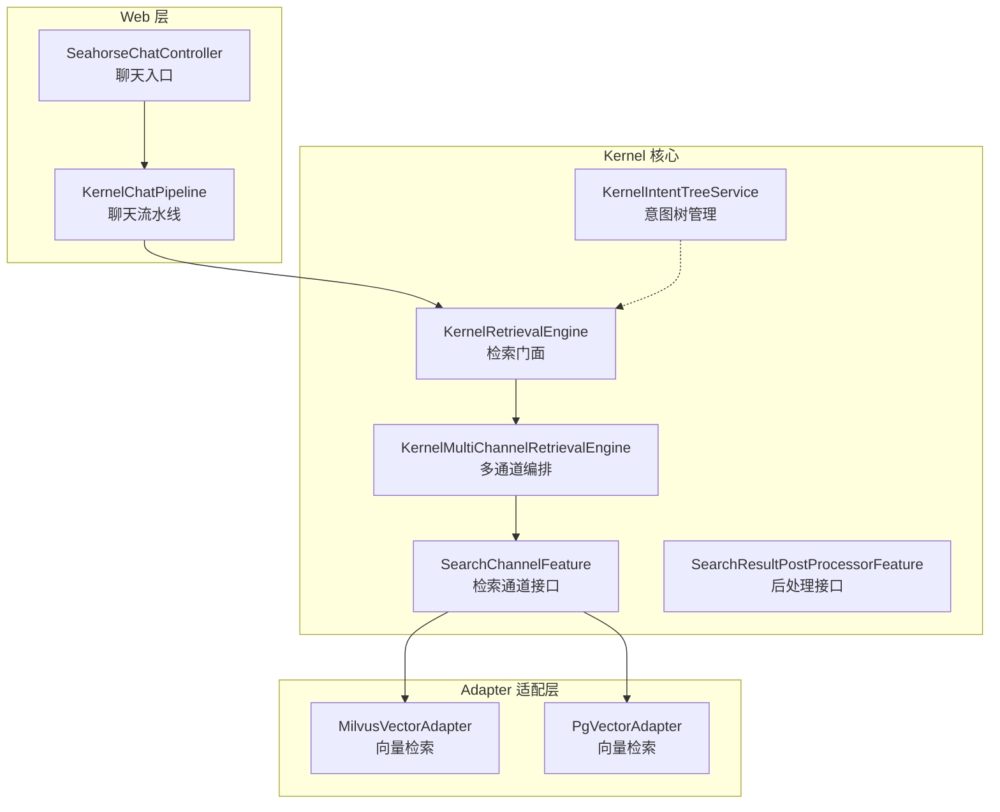
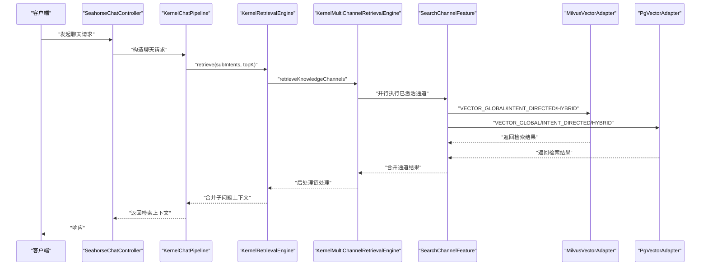
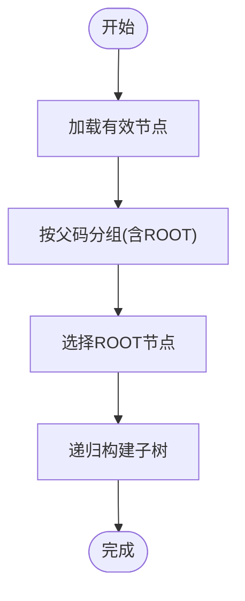
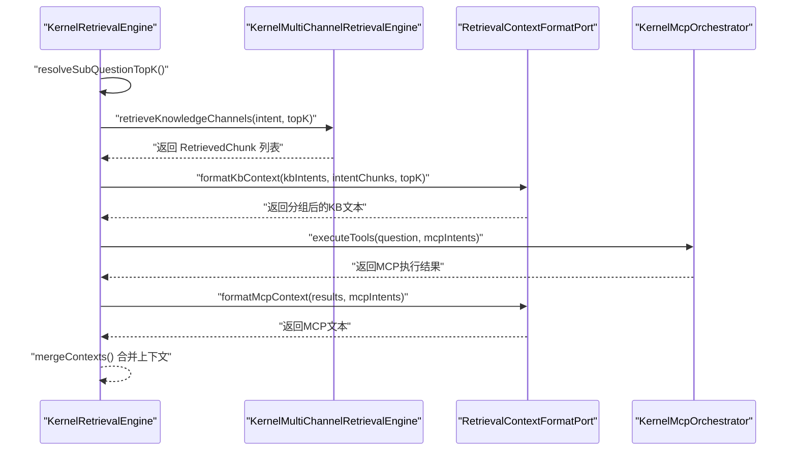
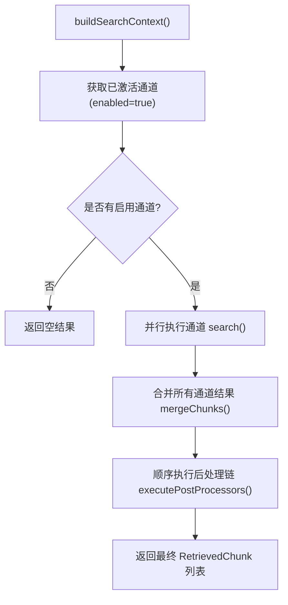
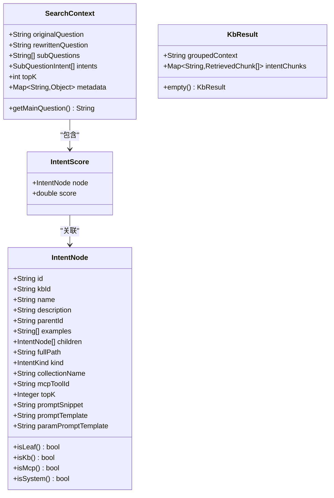
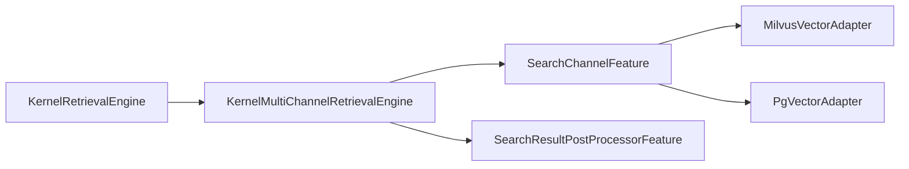

# 意图和检索服务

<cite>
**本文引用的文件**
- [KernelIntentTreeService.java](file://seahorse-agent-kernel/src/main/java/com/miracle/ai/seahorse/agent/kernel/application/intent/KernelIntentTreeService.java)
- [KernelRetrievalEngine.java](file://seahorse-agent-kernel/src/main/java/com/miracle/ai/seahorse/agent/kernel/application/retrieval/KernelRetrievalEngine.java)
- [KernelMultiChannelRetrievalEngine.java](file://seahorse-agent-kernel/src/main/java/com/miracle/ai/seahorse/agent/kernel/application/retrieval/KernelMultiChannelRetrievalEngine.java)
- [IntentNode.java](file://seahorse-agent-kernel/src/main/java/com/miracle/ai/seahorse/agent/kernel/domain/intent/IntentNode.java)
- [IntentScore.java](file://seahorse-agent-kernel/src/main/java/com/miracle/ai/seahorse/agent/kernel/domain/intent/IntentScore.java)
- [SearchContext.java](file://seahorse-agent-kernel/src/main/java/com/miracle/ai/seahorse/agent/kernel/domain/retrieval/SearchContext.java)
- [KbResult.java](file://seahorse-agent-kernel/src/main/java/com/miracle/ai/seahorse/agent/kernel/domain/retrieval/KbResult.java)
- [SearchChannelFeature.java](file://seahorse-agent-kernel/src/main/java/com/miracle/ai/seahorse/agent/kernel/feature/retrieval/SearchChannelFeature.java)
- [SearchResultPostProcessorFeature.java](file://seahorse-agent-kernel/src/main/java/com/miracle/ai/seahorse/agent/kernel/feature/retrieval/SearchResultPostProcessorFeature.java)
- [SearchChannelType.java](file://seahorse-agent-kernel/src/main/java/com/miracle/ai/seahorse/agent/kernel/domain/retrieval/SearchChannelType.java)
- [MilvusVectorAdapter.java](file://seahorse-agent-adapter-vector-milvus/src/main/java/com/miracle/ai/seahorse/agent/adapters/vector/milvus/MilvusVectorAdapter.java)
- [PgVectorAdapter.java](file://seahorse-agent-adapter-vector-pgvector/src/main/java/com/miracle/ai/seahorse/agent/adapters/vector/pgvector/PgVectorAdapter.java)
- [SeahorseChatController.java](file://seahorse-agent-adapter-web/src/main/java/com/miracle/ai/seahorse/agent/adapters/web/SeahorseChatController.java)
- [KernelChatPipeline.java](file://seahorse-agent-kernel/src/main/java/com/miracle/ai/seahorse/agent/kernel/application/chat/KernelChatPipeline.java)
</cite>

## 目录
1. [简介](#简介)
2. [项目结构](#项目结构)
3. [核心组件](#核心组件)
4. [架构总览](#架构总览)
5. [详细组件分析](#详细组件分析)
6. [依赖分析](#依赖分析)
7. [性能考虑](#性能考虑)
8. [故障排查指南](#故障排查指南)
9. [结论](#结论)
10. [附录](#附录)

## 简介
本文件面向意图识别与检索服务的技术文档，重点覆盖以下内容：
- 意图树服务（KernelIntentTreeService）的实现原理与意图层次结构管理，包括意图识别、分类、推理与持久化。
- 检索引擎（KernelRetrievalEngine）与多通道检索引擎（KernelMultiChannelRetrievalEngine）的工作机制，涵盖向量检索、关键词检索、混合检索等策略的编排与执行。
- 检索优化的技术细节：索引管理、查询重写、结果合并与排序、相关性评分与后处理链。
- 性能调优方法：缓存策略、并行处理、线程池配置与负载均衡建议。
- 配置示例与典型使用场景。

## 项目结构
本项目采用分层与插件化的架构设计：
- kernel 层：定义领域模型、应用服务与检索内核编排。
- adapter 层：对接外部系统（向量库、消息队列、缓存、存储等），通过 outbound/inbound 端口解耦。
- web 层：对外提供 HTTP 控制器，接入聊天与检索流程。

图表来源
- [KernelIntentTreeService.java:41-231](file://seahorse-agent-kernel/src/main/java/com/miracle/ai/seahorse/agent/kernel/application/intent/KernelIntentTreeService.java#L41-L231)
- [KernelRetrievalEngine.java:53-244](file://seahorse-agent-kernel/src/main/java/com/miracle/ai/seahorse/agent/kernel/application/retrieval/KernelRetrievalEngine.java#L53-L244)
- [KernelMultiChannelRetrievalEngine.java:43-166](file://seahorse-agent-kernel/src/main/java/com/miracle/ai/seahorse/agent/kernel/application/retrieval/KernelMultiChannelRetrievalEngine.java#L43-L166)
- [SearchChannelFeature.java:32-64](file://seahorse-agent-kernel/src/main/java/com/miracle/ai/seahorse/agent/kernel/feature/retrieval/SearchChannelFeature.java#L32-L64)
- [SearchResultPostProcessorFeature.java:34-61](file://seahorse-agent-kernel/src/main/java/com/miracle/ai/seahorse/agent/kernel/feature/retrieval/SearchResultPostProcessorFeature.java#L34-L61)
- [MilvusVectorAdapter.java](file://seahorse-agent-adapter-vector-milvus/src/main/java/com/miracle/ai/seahorse/agent/adapters/vector/milvus/MilvusVectorAdapter.java)
- [PgVectorAdapter.java](file://seahorse-agent-adapter-vector-pgvector/src/main/java/com/miracle/ai/seahorse/agent/adapters/vector/pgvector/PgVectorAdapter.java)
- [SeahorseChatController.java](file://seahorse-agent-adapter-web/src/main/java/com/miracle/ai/seahorse/agent/adapters/web/SeahorseChatController.java)
- [KernelChatPipeline.java](file://seahorse-agent-kernel/src/main/java/com/miracle/ai/seahorse/agent/kernel/application/chat/KernelChatPipeline.java)

章节来源
- [KernelIntentTreeService.java:41-231](file://seahorse-agent-kernel/src/main/java/com/miracle/ai/seahorse/agent/kernel/application/intent/KernelIntentTreeService.java#L41-L231)
- [KernelRetrievalEngine.java:53-244](file://seahorse-agent-kernel/src/main/java/com/miracle/ai/seahorse/agent/kernel/application/retrieval/KernelRetrievalEngine.java#L53-L244)
- [KernelMultiChannelRetrievalEngine.java:43-166](file://seahorse-agent-kernel/src/main/java/com/miracle/ai/seahorse/agent/kernel/application/retrieval/KernelMultiChannelRetrievalEngine.java#L43-L166)

## 核心组件
- KernelIntentTreeService：负责意图树的增删改查、批量启用/禁用/删除、父子节点一致性校验、树构建与缓存清理。
- KernelRetrievalEngine：检索门面，按子问题并发构建上下文，调用多通道检索与 MCP 工具，最终合并为统一检索上下文。
- KernelMultiChannelRetrievalEngine：多通道编排器，负责并行执行已激活的检索通道，合并结果并顺序执行后处理链。
- SearchChannelFeature/SearchResultPostProcessorFeature：检索通道与后处理的 SPI 接口，通过扩展注册表统一治理。
- 领域模型：IntentNode、IntentScore、SearchContext、KbResult 等，承载意图与检索上下文的数据契约。

章节来源
- [KernelIntentTreeService.java:41-231](file://seahorse-agent-kernel/src/main/java/com/miracle/ai/seahorse/agent/kernel/application/intent/KernelIntentTreeService.java#L41-L231)
- [KernelRetrievalEngine.java:53-244](file://seahorse-agent-kernel/src/main/java/com/miracle/ai/seahorse/agent/kernel/application/retrieval/KernelRetrievalEngine.java#L53-L244)
- [KernelMultiChannelRetrievalEngine.java:43-166](file://seahorse-agent-kernel/src/main/java/com/miracle/ai/seahorse/agent/kernel/application/retrieval/KernelMultiChannelRetrievalEngine.java#L43-L166)
- [IntentNode.java:31-83](file://seahorse-agent-kernel/src/main/java/com/miracle/ai/seahorse/agent/kernel/domain/intent/IntentNode.java#L31-L83)
- [IntentScore.java:32-38](file://seahorse-agent-kernel/src/main/java/com/miracle/ai/seahorse/agent/kernel/domain/intent/IntentScore.java#L32-L38)
- [SearchContext.java:35-54](file://seahorse-agent-kernel/src/main/java/com/miracle/ai/seahorse/agent/kernel/domain/retrieval/SearchContext.java#L35-L54)
- [KbResult.java:26-32](file://seahorse-agent-kernel/src/main/java/com/miracle/ai/seahorse/agent/kernel/domain/retrieval/KbResult.java#L26-L32)
- [SearchChannelFeature.java:32-64](file://seahorse-agent-kernel/src/main/java/com/miracle/ai/seahorse/agent/kernel/feature/retrieval/SearchChannelFeature.java#L32-L64)
- [SearchResultPostProcessorFeature.java:34-61](file://seahorse-agent-kernel/src/main/java/com/miracle/ai/seahorse/agent/kernel/feature/retrieval/SearchResultPostProcessorFeature.java#L34-L61)

## 架构总览
检索服务从 Web 控制器进入，经聊天流水线与检索门面，到多通道编排器，再由检索通道执行具体检索策略（向量、关键词、混合），最后经过后处理链生成统一上下文。

图表来源
- [SeahorseChatController.java](file://seahorse-agent-adapter-web/src/main/java/com/miracle/ai/seahorse/agent/adapters/web/SeahorseChatController.java)
- [KernelChatPipeline.java](file://seahorse-agent-kernel/src/main/java/com/miracle/ai/seahorse/agent/kernel/application/chat/KernelChatPipeline.java)
- [KernelRetrievalEngine.java:90-107](file://seahorse-agent-kernel/src/main/java/com/miracle/ai/seahorse/agent/kernel/application/retrieval/KernelRetrievalEngine.java#L90-L107)
- [KernelMultiChannelRetrievalEngine.java:68-75](file://seahorse-agent-kernel/src/main/java/com/miracle/ai/seahorse/agent/kernel/application/retrieval/KernelMultiChannelRetrievalEngine.java#L68-L75)
- [SearchChannelFeature.java:32-64](file://seahorse-agent-kernel/src/main/java/com/miracle/ai/seahorse/agent/kernel/feature/retrieval/SearchChannelFeature.java#L32-L64)
- [MilvusVectorAdapter.java](file://seahorse-agent-adapter-vector-milvus/src/main/java/com/miracle/ai/seahorse/agent/adapters/vector/milvus/MilvusVectorAdapter.java)
- [PgVectorAdapter.java](file://seahorse-agent-adapter-vector-pgvector/src/main/java/com/miracle/ai/seahorse/agent/adapters/vector/pgvector/PgVectorAdapter.java)

## 详细组件分析

### 意图树服务 KernelIntentTreeService
- 职责
  - 加载与构建意图树：从仓库端口读取有效节点，按父码分组，递归构建树形结构。
  - 意图管理：创建、更新、删除、批量启用/禁用/删除；对父子节点变更进行一致性校验。
  - 缓存管理：变更后清理缓存键，确保后续读取最新树结构。
- 关键算法
  - 子节点映射构建：以 ROOT 或父码为键分组，便于快速定位子节点。
  - 树递归构建：自顶向下递归组装子树。
  - 后代收集：使用栈遍历收集指定节点的所有后代，用于批量删除/禁用前的完整性校验。
- 数据结构与复杂度
  - 子节点映射：O(n) 构建，查询子节点 O(1)。
  - 树递归构建：O(n)。
  - 后代收集：每个节点最多访问一次，O(n)。
- 错误处理
  - 参数校验：非空、正整数 topK、主题 KB 节点必须绑定知识库 ID。
  - 批量操作：未选中所有后代即禁用/删除父节点时抛出异常。
  - 删除/更新不存在节点时抛出异常。
- 性能与优化
  - 变更后立即清理缓存，避免脏读。
  - 使用流式处理与不可变集合减少中间对象。

图表来源
- [KernelIntentTreeService.java:57-63](file://seahorse-agent-kernel/src/main/java/com/miracle/ai/seahorse/agent/kernel/application/intent/KernelIntentTreeService.java#L57-L63)
- [KernelIntentTreeService.java:178-187](file://seahorse-agent-kernel/src/main/java/com/miracle/ai/seahorse/agent/kernel/application/intent/KernelIntentTreeService.java#L178-L187)

章节来源
- [KernelIntentTreeService.java:41-231](file://seahorse-agent-kernel/src/main/java/com/miracle/ai/seahorse/agent/kernel/application/intent/KernelIntentTreeService.java#L41-L231)
- [IntentNode.java:31-83](file://seahorse-agent-kernel/src/main/java/com/miracle/ai/seahorse/agent/kernel/domain/intent/IntentNode.java#L31-L83)

### 检索引擎 KernelRetrievalEngine
- 职责
  - 并发构建子问题上下文：针对每个子问题，解析意图分数，区分 KB 与 MCP 两类意图，分别执行检索与工具调用。
  - 统一上下文合并：将各子问题的 KB 文本与 MCP 文本拼接，按意图维度聚合 RetrievedChunk。
  - 查询 TopK 解析：根据意图节点的 topK 配置动态调整每子问题的检索规模。
- 关键流程
  - retrieve：校验输入，按子问题异步构建上下文，失败时降级为空上下文。
  - retrieveKnowledgeChannels：委托多通道引擎执行知识库检索。
  - retrieveAndRerank：KB 检索后按意图分桶并格式化上下文。
  - executeMcpAndMerge：执行 MCP 工具并格式化结果。
- 并发与容错
  - 使用线程池并发执行子问题上下文构建。
  - 单个子问题构建异常记录日志并降级为空上下文，不影响其他子问题。

图表来源
- [KernelRetrievalEngine.java:90-107](file://seahorse-agent-kernel/src/main/java/com/miracle/ai/seahorse/agent/kernel/application/retrieval/KernelRetrievalEngine.java#L90-L107)
- [KernelRetrievalEngine.java:120-129](file://seahorse-agent-kernel/src/main/java/com/miracle/ai/seahorse/agent/kernel/application/retrieval/KernelRetrievalEngine.java#L120-L129)
- [KernelRetrievalEngine.java:178-186](file://seahorse-agent-kernel/src/main/java/com/miracle/ai/seahorse/agent/kernel/application/retrieval/KernelRetrievalEngine.java#L178-L186)
- [KernelRetrievalEngine.java:208-215](file://seahorse-agent-kernel/src/main/java/com/miracle/ai/seahorse/agent/kernel/application/retrieval/KernelRetrievalEngine.java#L208-L215)

章节来源
- [KernelRetrievalEngine.java:53-244](file://seahorse-agent-kernel/src/main/java/com/miracle/ai/seahorse/agent/kernel/application/retrieval/KernelRetrievalEngine.java#L53-L244)

### 多通道检索引擎 KernelMultiChannelRetrievalEngine
- 职责
  - 构建检索上下文：封装原始问题、重写问题、意图列表与 topK。
  - 并行执行检索通道：基于扩展注册表与激活上下文筛选已启用通道，使用线程池并发执行。
  - 结果合并与后处理：将各通道结果合并为 RetrievedChunk 列表，顺序执行后处理链。
- 容错与降级
  - 单通道异常记录日志并返回空结果，不影响其他通道。
  - 后处理器异常记录日志并跳过该处理器，保持整体流程继续。
- 扩展点
  - 检索通道：按 SearchChannelType（向量全局、意图定向、关键词、混合）实现不同策略。
  - 后处理：对合并后的结果进行去重、重排、过滤等策略化处理。

图表来源
- [KernelMultiChannelRetrievalEngine.java:155-164](file://seahorse-agent-kernel/src/main/java/com/miracle/ai/seahorse/agent/kernel/application/retrieval/KernelMultiChannelRetrievalEngine.java#L155-L164)
- [KernelMultiChannelRetrievalEngine.java:77-97](file://seahorse-agent-kernel/src/main/java/com/miracle/ai/seahorse/agent/kernel/application/retrieval/KernelMultiChannelRetrievalEngine.java#L77-L97)
- [KernelMultiChannelRetrievalEngine.java:116-128](file://seahorse-agent-kernel/src/main/java/com/miracle/ai/seahorse/agent/kernel/application/retrieval/KernelMultiChannelRetrievalEngine.java#L116-L128)

章节来源
- [KernelMultiChannelRetrievalEngine.java:43-166](file://seahorse-agent-kernel/src/main/java/com/miracle/ai/seahorse/agent/kernel/application/retrieval/KernelMultiChannelRetrievalEngine.java#L43-L166)
- [SearchChannelFeature.java:32-64](file://seahorse-agent-kernel/src/main/java/com/miracle/ai/seahorse/agent/kernel/feature/retrieval/SearchChannelFeature.java#L32-L64)
- [SearchResultPostProcessorFeature.java:34-61](file://seahorse-agent-kernel/src/main/java/com/miracle/ai/seahorse/agent/kernel/feature/retrieval/SearchResultPostProcessorFeature.java#L34-L61)

### 检索通道与后处理接口
- SearchChannelFeature
  - 角色：定义检索通道类型、上下文启用判断与检索执行。
  - 类型：VECTOR_GLOBAL、INTENT_DIRECTED、KEYWORD_ES、HYBRID。
- SearchResultPostProcessorFeature
  - 角色：对合并后的检索结果进行策略化后处理，保证处理顺序与失败容错。

章节来源
- [SearchChannelFeature.java:32-64](file://seahorse-agent-kernel/src/main/java/com/miracle/ai/seahorse/agent/kernel/feature/retrieval/SearchChannelFeature.java#L32-L64)
- [SearchResultPostProcessorFeature.java:34-61](file://seahorse-agent-kernel/src/main/java/com/miracle/ai/seahorse/agent/kernel/feature/retrieval/SearchResultPostProcessorFeature.java#L34-L61)
- [SearchChannelType.java:23-44](file://seahorse-agent-kernel/src/main/java/com/miracle/ai/seahorse/agent/kernel/domain/retrieval/SearchChannelType.java#L23-L44)

### 领域模型与数据契约
- IntentNode：意图节点数据模型，包含 ID、父 ID、名称、描述、示例、子节点、路径、类型（KB/MCP/SYSTEM）、集合名、MCP 工具 ID、topK、提示模板等。
- IntentScore：意图节点与匹配分数的组合。
- SearchContext：检索上下文，包含原始问题、重写问题、子问题列表、意图列表、topK 与元数据。
- KbResult：KB 检索聚合结果，包含分组后的上下文文本与按意图分桶的 Chunk 列表。

图表来源
- [IntentNode.java:31-83](file://seahorse-agent-kernel/src/main/java/com/miracle/ai/seahorse/agent/kernel/domain/intent/IntentNode.java#L31-L83)
- [IntentScore.java:32-38](file://seahorse-agent-kernel/src/main/java/com/miracle/ai/seahorse/agent/kernel/domain/intent/IntentScore.java#L32-L38)
- [SearchContext.java:35-54](file://seahorse-agent-kernel/src/main/java/com/miracle/ai/seahorse/agent/kernel/domain/retrieval/SearchContext.java#L35-L54)
- [KbResult.java:26-32](file://seahorse-agent-kernel/src/main/java/com/miracle/ai/seahorse/agent/kernel/domain/retrieval/KbResult.java#L26-L32)

章节来源
- [IntentNode.java:31-83](file://seahorse-agent-kernel/src/main/java/com/miracle/ai/seahorse/agent/kernel/domain/intent/IntentNode.java#L31-L83)
- [IntentScore.java:32-38](file://seahorse-agent-kernel/src/main/java/com/miracle/ai/seahorse/agent/kernel/domain/intent/IntentScore.java#L32-L38)
- [SearchContext.java:35-54](file://seahorse-agent-kernel/src/main/java/com/miracle/ai/seahorse/agent/kernel/domain/retrieval/SearchContext.java#L35-L54)
- [KbResult.java:26-32](file://seahorse-agent-kernel/src/main/java/com/miracle/ai/seahorse/agent/kernel/domain/retrieval/KbResult.java#L26-L32)

## 依赖分析
- 组件耦合
  - KernelRetrievalEngine 依赖 KernelMultiChannelRetrievalEngine、MCP 编排器与上下文格式化端口。
  - KernelMultiChannelRetrievalEngine 通过扩展注册表与激活上下文发现检索通道与后处理器。
  - 检索通道与后处理器通过 SPI 接口注入，降低与具体实现的耦合。
- 外部依赖
  - 向量库适配器（Milvus、PgVector）通过 SearchChannelFeature 注入，支持 VECTOR_GLOBAL、INTENT_DIRECTED、HYBRID 等策略。
- 循环依赖
  - 未见循环依赖迹象，内核层通过接口与扩展注册表进行松耦合。

图表来源
- [KernelRetrievalEngine.java:53-81](file://seahorse-agent-kernel/src/main/java/com/miracle/ai/seahorse/agent/kernel/application/retrieval/KernelRetrievalEngine.java#L53-L81)
- [KernelMultiChannelRetrievalEngine.java:49-59](file://seahorse-agent-kernel/src/main/java/com/miracle/ai/seahorse/agent/kernel/application/retrieval/KernelMultiChannelRetrievalEngine.java#L49-L59)
- [SearchChannelFeature.java:32-64](file://seahorse-agent-kernel/src/main/java/com/miracle/ai/seahorse/agent/kernel/feature/retrieval/SearchChannelFeature.java#L32-L64)
- [MilvusVectorAdapter.java](file://seahorse-agent-adapter-vector-milvus/src/main/java/com/miracle/ai/seahorse/agent/adapters/vector/milvus/MilvusVectorAdapter.java)
- [PgVectorAdapter.java](file://seahorse-agent-adapter-vector-pgvector/src/main/java/com/miracle/ai/seahorse/agent/adapters/vector/pgvector/PgVectorAdapter.java)

章节来源
- [KernelRetrievalEngine.java:53-81](file://seahorse-agent-kernel/src/main/java/com/miracle/ai/seahorse/agent/kernel/application/retrieval/KernelRetrievalEngine.java#L53-L81)
- [KernelMultiChannelRetrievalEngine.java:49-59](file://seahorse-agent-kernel/src/main/java/com/miracle/ai/seahorse/agent/kernel/application/retrieval/KernelMultiChannelRetrievalEngine.java#L49-L59)

## 性能考虑
- 并行与线程池
  - 子问题上下文构建与通道检索均使用独立线程池，避免阻塞主线程。
  - 建议根据 CPU 核心数与 IO 特性调优线程池大小与队列容量。
- 缓存策略
  - 意图树变更后主动清理缓存键，避免陈旧树导致重复扫描。
  - 可在上层引入分布式缓存（如 Redis）存放意图树与检索热点，降低数据库压力。
- 索引与查询优化
  - 向量检索：合理设置向量维度、索引类型与刷新周期；对高频查询建立预热索引。
  - 关键词检索：使用合适的分词器与同义词表；对高选择性字段建立倒排索引。
  - 混合检索：平衡向量相似度与关键词匹配权重，结合重排序器提升相关性。
- 结果合并与后处理
  - 合并阶段可做去重与重排；后处理链应尽量轻量化，避免长尾延迟。
- 负载均衡
  - 多通道并行时，建议按通道类型与资源占用做任务切分，避免单通道成为瓶颈。
- 监控与可观测性
  - 记录检索耗时、命中率、错误率与线程池排队长度，辅助容量规划与性能调优。

## 故障排查指南
- 意图树相关
  - 现象：批量禁用/删除父节点失败。
  - 原因：存在未选中的启用子节点。
  - 处理：先选中并处理所有子节点后再执行父节点操作。
- 检索相关
  - 现象：某子问题上下文为空。
  - 原因：子问题上下文构建异常被降级。
  - 处理：查看对应子问题的意图分数与通道执行日志，确认是否存在通道异常或无结果。
- 通道异常
  - 现象：某检索通道报错但未影响整体流程。
  - 原因：通道异常被记录并返回空结果，后处理异常被记录并跳过。
  - 处理：检查通道实现与外部依赖（如向量库连接、权限、网络）。
- 后处理异常
  - 现象：后处理链中断。
  - 原因：某个后处理器抛出异常。
  - 处理：隔离并修复异常处理器，确保不影响其他处理器。

章节来源
- [KernelIntentTreeService.java:101-134](file://seahorse-agent-kernel/src/main/java/com/miracle/ai/seahorse/agent/kernel/application/intent/KernelIntentTreeService.java#L101-L134)
- [KernelRetrievalEngine.java:131-138](file://seahorse-agent-kernel/src/main/java/com/miracle/ai/seahorse/agent/kernel/application/retrieval/KernelRetrievalEngine.java#L131-L138)
- [KernelMultiChannelRetrievalEngine.java:100-106](file://seahorse-agent-kernel/src/main/java/com/miracle/ai/seahorse/agent/kernel/application/retrieval/KernelMultiChannelRetrievalEngine.java#L100-L106)
- [KernelMultiChannelRetrievalEngine.java:134-139](file://seahorse-agent-kernel/src/main/java/com/miracle/ai/seahorse/agent/kernel/application/retrieval/KernelMultiChannelRetrievalEngine.java#L134-L139)

## 结论
本方案通过意图树与检索内核的清晰分层，实现了意图识别、分类与推理的可扩展架构。KernelRetrievalEngine 与 KernelMultiChannelRetrievalEngine 将检索策略与后处理链解耦，配合 SearchChannelFeature 与 SearchResultPostProcessorFeature 的 SPI 设计，既保证了核心流程的稳定性，又提供了灵活的扩展空间。结合合理的缓存、并行与索引策略，可在大规模场景下获得稳定的检索性能与用户体验。

## 附录
- 配置示例（概念性）
  - 线程池配置：为检索与上下文构建分别配置独立线程池，核心线程数与最大线程数依据 QPS 与 RT 目标设定。
  - 缓存配置：为意图树设置短 TTL 的本地缓存与长 TTL 的分布式缓存，变更时主动失效。
  - 检索通道启用：通过激活上下文控制通道开关，按租户/知识库/意图粒度启用或禁用。
  - 后处理链：按“去重 → 重排 → 过滤”的顺序执行，确保链路可控且失败不传播。
- 使用场景
  - 多轮对话：按子问题并发构建上下文，合并 KB 与 MCP 结果，提升响应速度与准确性。
  - 知识库检索：按意图定向检索与向量全局检索混合，提高召回与精排效果。
  - 动态路由：根据意图节点的 topK 与集合名动态调整检索策略与目标集合。