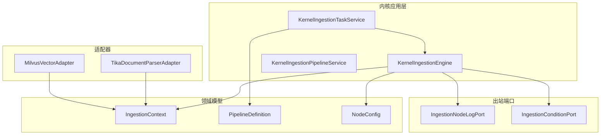
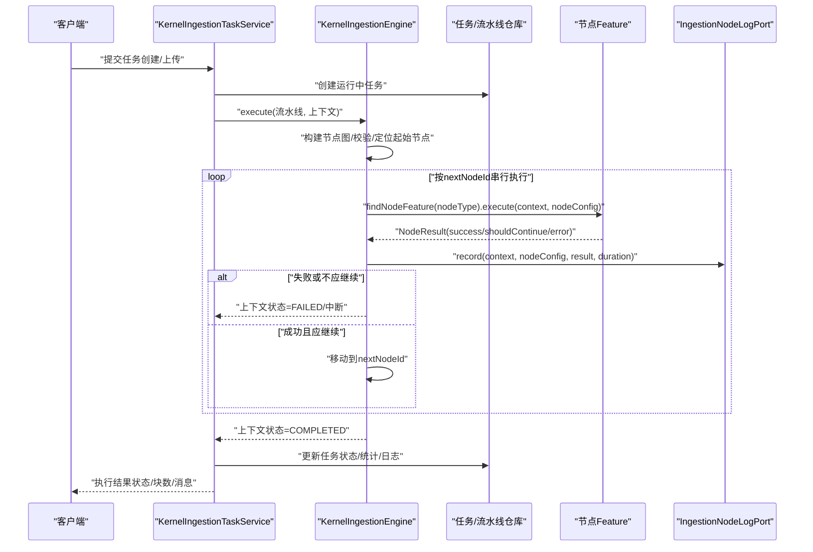
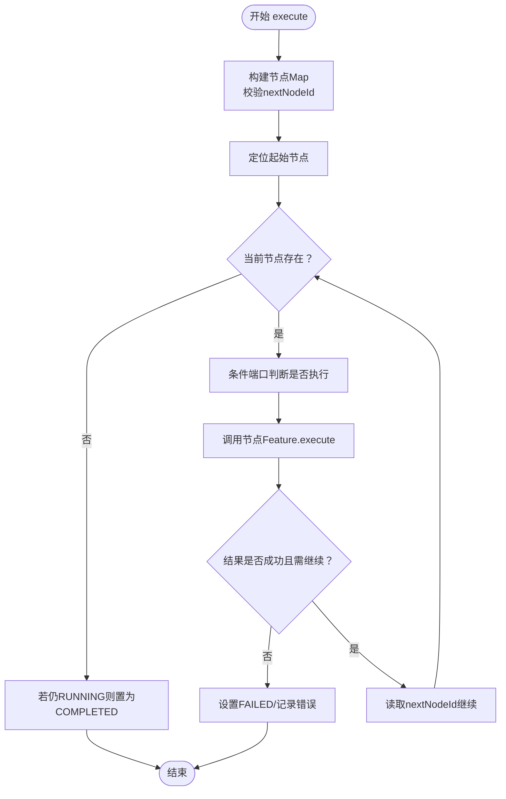
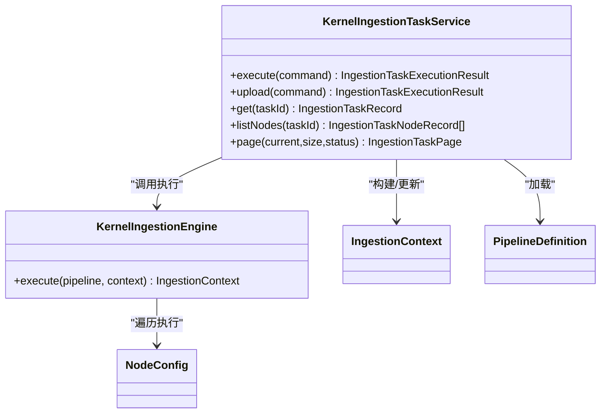
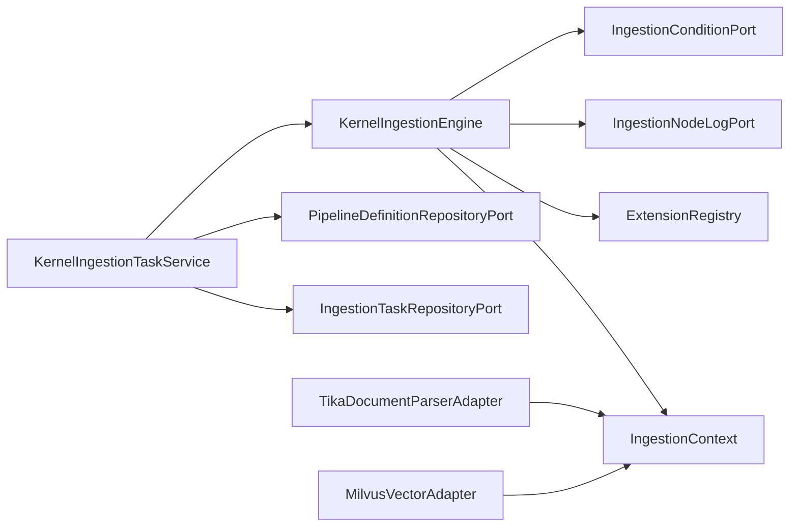

# 文档处理应用服务

<cite>
**本文引用的文件**
- [KernelIngestionEngine.java](file://seahorse-agent-kernel/src/main/java/com/miracle/ai/seahorse/agent/kernel/application/ingestion/KernelIngestionEngine.java)
- [KernelIngestionPipelineService.java](file://seahorse-agent-kernel/src/main/java/com/miracle/ai/seahorse/agent/kernel/application/ingestion/KernelIngestionPipelineService.java)
- [KernelIngestionTaskService.java](file://seahorse-agent-kernel/src/main/java/com/miracle/ai/seahorse/agent/kernel/application/ingestion/KernelIngestionTaskService.java)
- [IngestionContext.java](file://seahorse-agent-kernel/src/main/java/com/miracle/ai/seahorse/agent/kernel/domain/ingestion/IngestionContext.java)
- [PipelineDefinition.java](file://seahorse-agent-kernel/src/main/java/com/miracle/ai/seahorse/agent/kernel/domain/ingestion/PipelineDefinition.java)
- [NodeConfig.java](file://seahorse-agent-kernel/src/main/java/com/miracle/ai/seahorse/agent/kernel/domain/ingestion/NodeConfig.java)
- [IngestionNodeLogPort.java](file://seahorse-agent-kernel/src/main/java/com/miracle/ai/seahorse/agent/ports/outbound/ingestion/IngestionNodeLogPort.java)
- [IngestionConditionPort.java](file://seahorse-agent-kernel/src/main/java/com/miracle/ai/seahorse/agent/ports/outbound/ingestion/IngestionConditionPort.java)
- [TikaDocumentParserAdapter.java](file://seahorse-agent-adapter-parser-tika/src/main/java/com/miracle/ai/seahorse/agent/adapters/parser/tika/TikaDocumentParserAdapter.java)
- [MilvusVectorAdapter.java](file://seahorse-agent-adapter-vector-milvus/src/main/java/com/miracle/ai/seahorse/agent/adapters/vector/milvus/MilvusVectorAdapter.java)
- [pdf-ingestion-example.md](file://docs/examples/pdf-ingestion-example.md)
- [pdf-pipeline-request.json](file://docs/examples/pdf-pipeline-request.json)
</cite>

## 目录
1. [简介](#简介)
2. [项目结构](#项目结构)
3. [核心组件](#核心组件)
4. [架构总览](#架构总览)
5. [详细组件分析](#详细组件分析)
6. [依赖分析](#依赖分析)
7. [性能考虑](#性能考虑)
8. [故障排查指南](#故障排查指南)
9. [结论](#结论)
10. [附录](#附录)

## 简介
本文件面向文档处理应用服务，聚焦于内核层的文档摄取流水线体系，包括：
- 文档摄取引擎（KernelIngestionEngine）：负责流水线的拓扑解析、节点串行执行、条件判断、日志记录与失败中断。
- 摄取流水线服务（KernelIngestionPipelineService）：提供流水线的创建、查询、分页与删除等管理能力。
- 摄取任务服务（KernelIngestionTaskService）：封装任务生命周期，协调引擎执行，持久化任务与节点日志，汇总执行结果。

文档处理流水线涵盖从文档获取、解析、AI增强、分块到向量化与索引的完整链路，支持条件执行、节点跳过、错误恢复与可观测性记录。本文将结合源码与示例，给出工作原理、调度机制、配置项与性能调优建议，并提供使用示例与故障排查指引。

## 项目结构
围绕文档摄取的模块分布如下：
- kernel 应用层：KernelIngestionEngine、KernelIngestionPipelineService、KernelIngestionTaskService
- kernel 领域模型：IngestionContext、PipelineDefinition、NodeConfig
- kernel 出站端口：IngestionNodeLogPort、IngestionConditionPort
- 适配器层：Tika 文档解析适配器、Milvus 向量存储适配器
- 示例与文档：PDF 摄取示例与请求模板

图表来源
- [KernelIngestionEngine.java:46-198](file://seahorse-agent-kernel/src/main/java/com/miracle/ai/seahorse/agent/kernel/application/ingestion/KernelIngestionEngine.java#L46-L198)
- [KernelIngestionPipelineService.java:31-93](file://seahorse-agent-kernel/src/main/java/com/miracle/ai/seahorse/agent/kernel/application/ingestion/KernelIngestionPipelineService.java#L31-L93)
- [KernelIngestionTaskService.java:53-407](file://seahorse-agent-kernel/src/main/java/com/miracle/ai/seahorse/agent/kernel/application/ingestion/KernelIngestionTaskService.java#L53-L407)
- [IngestionContext.java:30-52](file://seahorse-agent-kernel/src/main/java/com/miracle/ai/seahorse/agent/kernel/domain/ingestion/IngestionContext.java#L30-L52)
- [PipelineDefinition.java:30-41](file://seahorse-agent-kernel/src/main/java/com/miracle/ai/seahorse/agent/kernel/domain/ingestion/PipelineDefinition.java#L30-L41)
- [NodeConfig.java:29-41](file://seahorse-agent-kernel/src/main/java/com/miracle/ai/seahorse/agent/kernel/domain/ingestion/NodeConfig.java#L29-L41)
- [IngestionNodeLogPort.java:27-36](file://seahorse-agent-kernel/src/main/java/com/miracle/ai/seahorse/agent/ports/outbound/ingestion/IngestionNodeLogPort.java#L27-L36)
- [IngestionConditionPort.java:26-34](file://seahorse-agent-kernel/src/main/java/com/miracle/ai/seahorse/agent/ports/outbound/ingestion/IngestionConditionPort.java#L26-L34)
- [TikaDocumentParserAdapter.java:35-80](file://seahorse-agent-adapter-parser-tika/src/main/java/com/miracle/ai/seahorse/agent/adapters/parser/tika/TikaDocumentParserAdapter.java#L35-L80)
- [MilvusVectorAdapter.java:56-319](file://seahorse-agent-adapter-vector-milvus/src/main/java/com/miracle/ai/seahorse/agent/adapters/vector/milvus/MilvusVectorAdapter.java#L56-L319)

章节来源
- [KernelIngestionEngine.java:46-198](file://seahorse-agent-kernel/src/main/java/com/miracle/ai/seahorse/agent/kernel/application/ingestion/KernelIngestionEngine.java#L46-L198)
- [KernelIngestionPipelineService.java:31-93](file://seahorse-agent-kernel/src/main/java/com/miracle/ai/seahorse/agent/kernel/application/ingestion/KernelIngestionPipelineService.java#L31-L93)
- [KernelIngestionTaskService.java:53-407](file://seahorse-agent-kernel/src/main/java/com/miracle/ai/seahorse/agent/kernel/application/ingestion/KernelIngestionTaskService.java#L53-L407)

## 核心组件
- 文档摄取引擎（KernelIngestionEngine）
  - 负责流水线拓扑校验、起始节点发现、按 nextNodeId 串行执行节点、失败中断与日志记录。
  - 支持条件端口（IngestionConditionPort）与节点日志端口（IngestionNodeLogPort）扩展。
- 摄取流水线服务（KernelIngestionPipelineService）
  - 提供流水线的创建、更新、查询、分页与删除，参数规范化与存在性校验。
- 摄取任务服务（KernelIngestionTaskService）
  - 将任务创建、上下文构建、引擎执行、结果回写与节点日志落盘整合为统一入口。
  - 负责任务状态转换、统计指标（块数、日志摘要）、元数据聚合与节点顺序映射。

章节来源
- [KernelIngestionEngine.java:46-198](file://seahorse-agent-kernel/src/main/java/com/miracle/ai/seahorse/agent/kernel/application/ingestion/KernelIngestionEngine.java#L46-L198)
- [KernelIngestionPipelineService.java:31-93](file://seahorse-agent-kernel/src/main/java/com/miracle/ai/seahorse/agent/kernel/application/ingestion/KernelIngestionPipelineService.java#L31-L93)
- [KernelIngestionTaskService.java:53-407](file://seahorse-agent-kernel/src/main/java/com/miracle/ai/seahorse/agent/kernel/application/ingestion/KernelIngestionTaskService.java#L53-L407)

## 架构总览
文档处理流水线以“任务驱动 + 节点特征（Feature）”为核心，通过内核引擎串联各节点，适配器层提供具体能力（解析、向量检索/索引）。任务服务负责编排与持久化，引擎负责执行与可观测性。

图表来源
- [KernelIngestionEngine.java:79-198](file://seahorse-agent-kernel/src/main/java/com/miracle/ai/seahorse/agent/kernel/application/ingestion/KernelIngestionEngine.java#L79-L198)
- [KernelIngestionTaskService.java:128-148](file://seahorse-agent-kernel/src/main/java/com/miracle/ai/seahorse/agent/kernel/application/ingestion/KernelIngestionTaskService.java#L128-L148)
- [IngestionNodeLogPort.java:27-36](file://seahorse-agent-kernel/src/main/java/com/miracle/ai/seahorse/agent/ports/outbound/ingestion/IngestionNodeLogPort.java#L27-L36)

## 详细组件分析

### 文档摄取引擎（KernelIngestionEngine）
- 关键职责
  - 流水线拓扑解析：将节点列表转为 Map，校验 nextNodeId 引用合法性，检测环与缺失节点。
  - 起始节点发现：未被其他节点引用的节点即为起始节点。
  - 节点执行：根据条件端口决定是否执行；捕获异常并记录日志；依据 NodeResult 控制是否继续。
  - 结束处理：若仍在运行则标记为完成。
- 执行链路要点
  - 通过 ExtensionRegistry 获取激活的 IngestionNodeFeature，按 nodeType 匹配。
  - 使用 IngestionConditionPort 决策节点是否执行。
  - 使用 IngestionNodeLogPort 记录每次节点执行的耗时与结果摘要。
- 错误处理
  - 节点返回空结果、失败或抛出异常均会导致任务失败并中断后续节点。
  - 对环形依赖与缺失 nextNodeId 进行显式校验并抛出异常。

图表来源
- [KernelIngestionEngine.java:79-198](file://seahorse-agent-kernel/src/main/java/com/miracle/ai/seahorse/agent/kernel/application/ingestion/KernelIngestionEngine.java#L79-L198)
- [IngestionConditionPort.java:26-34](file://seahorse-agent-kernel/src/main/java/com/miracle/ai/seahorse/agent/ports/outbound/ingestion/IngestionConditionPort.java#L26-L34)
- [IngestionNodeLogPort.java:27-36](file://seahorse-agent-kernel/src/main/java/com/miracle/ai/seahorse/agent/ports/outbound/ingestion/IngestionNodeLogPort.java#L27-L36)

章节来源
- [KernelIngestionEngine.java:79-198](file://seahorse-agent-kernel/src/main/java/com/miracle/ai/seahorse/agent/kernel/application/ingestion/KernelIngestionEngine.java#L79-L198)

### 摄取流水线服务（KernelIngestionPipelineService）
- 职责
  - 接收 IngestionPipelinePayload，进行名称必填与描述默认值处理。
  - 调用仓库端口完成创建、更新、查询、分页与删除。
- 参数校验
  - pipelineId/name 必填，空白将抛出非法参数异常。
- 返回
  - create/update/get/page/delete 的标准返回与异常。

章节来源
- [KernelIngestionPipelineService.java:31-93](file://seahorse-agent-kernel/src/main/java/com/miracle/ai/seahorse/agent/kernel/application/ingestion/KernelIngestionPipelineService.java#L31-L93)

### 摄取任务服务（KernelIngestionTaskService）
- 任务生命周期
  - 接收创建/上传命令，解析源与内容，创建运行中任务记录。
  - 构建 IngestionContext（含 taskId、pipelineId、原始字节、mimeType、初始元数据、向量空间标识等）。
  - 调用引擎执行流水线，捕获异常并设置失败状态。
  - 更新任务状态、统计块数、生成日志摘要与节点明细、汇总任务元数据（关键词、问题）。
- 关键方法
  - execute：处理内联文本或外部源，解析字节后执行。
  - upload：处理文件上传，构造 IngestionDocumentSource 并执行。
  - listNodes/page/get：查询节点明细与任务分页。
  - 节点顺序映射：基于链式拓扑计算每个节点的顺序，便于前端展示。
- 数据模型
  - IngestionContext：承载任务上下文，包括 chunks、enhancedText、keywords、questions、metadata、vectorSpaceId、status、logs、error 等。
  - PipelineDefinition/NodeConfig：定义节点拓扑与配置。

图表来源
- [KernelIngestionTaskService.java:53-407](file://seahorse-agent-kernel/src/main/java/com/miracle/ai/seahorse/agent/kernel/application/ingestion/KernelIngestionTaskService.java#L53-L407)
- [KernelIngestionEngine.java:79-198](file://seahorse-agent-kernel/src/main/java/com/miracle/ai/seahorse/agent/kernel/application/ingestion/KernelIngestionEngine.java#L79-L198)
- [IngestionContext.java:30-52](file://seahorse-agent-kernel/src/main/java/com/miracle/ai/seahorse/agent/kernel/domain/ingestion/IngestionContext.java#L30-L52)
- [PipelineDefinition.java:30-41](file://seahorse-agent-kernel/src/main/java/com/miracle/ai/seahorse/agent/kernel/domain/ingestion/PipelineDefinition.java#L30-L41)
- [NodeConfig.java:29-41](file://seahorse-agent-kernel/src/main/java/com/miracle/ai/seahorse/agent/kernel/domain/ingestion/NodeConfig.java#L29-L41)

章节来源
- [KernelIngestionTaskService.java:53-407](file://seahorse-agent-kernel/src/main/java/com/miracle/ai/seahorse/agent/kernel/application/ingestion/KernelIngestionTaskService.java#L53-L407)
- [IngestionContext.java:30-52](file://seahorse-agent-kernel/src/main/java/com/miracle/ai/seahorse/agent/kernel/domain/ingestion/IngestionContext.java#L30-L52)
- [PipelineDefinition.java:30-41](file://seahorse-agent-kernel/src/main/java/com/miracle/ai/seahorse/agent/kernel/domain/ingestion/PipelineDefinition.java#L30-L41)
- [NodeConfig.java:29-41](file://seahorse-agent-kernel/src/main/java/com/miracle/ai/seahorse/agent/kernel/domain/ingestion/NodeConfig.java#L29-L41)

### 文档解析与向量化适配器
- 文档解析（TikaDocumentParserAdapter）
  - 支持纯文本与常见格式（PDF/Word/Excel/PPT/HTML/Markdown 等）。
  - 对纯文本与特定文件名后缀直接清理并返回文本；其他格式通过 Tika 解析。
  - 清洗策略：归一换行、水平空白规整、多余空行压缩。
- 向量存储（MilvusVectorAdapter）
  - 固定字段：id/content/metadata/embedding，兼容默认检索/入库行为。
  - 支持 collection 存在性检查、创建、插入/更新/删除、搜索。
  - 搜索参数包含 metricType 与 ef；索引采用 HNSW；默认一致性级别 BOUNDED。

章节来源
- [TikaDocumentParserAdapter.java:35-80](file://seahorse-agent-adapter-parser-tika/src/main/java/com/miracle/ai/seahorse/agent/adapters/parser/tika/TikaDocumentParserAdapter.java#L35-L80)
- [MilvusVectorAdapter.java:56-319](file://seahorse-agent-adapter-vector-milvus/src/main/java/com/miracle/ai/seahorse/agent/adapters/vector/milvus/MilvusVectorAdapter.java#L56-L319)

## 依赖分析
- 组件耦合
  - KernelIngestionTaskService 依赖 KernelIngestionEngine、PipelineDefinitionRepositoryPort、IngestionTaskRepositoryPort。
  - KernelIngestionEngine 依赖 ExtensionRegistry、FeatureActivationContext、IngestionConditionPort、IngestionNodeLogPort。
  - 适配器通过端口对接内核，避免与具体实现耦合。
- 外部依赖
  - Tika 用于多格式文档解析。
  - Milvus 客户端用于向量检索与索引管理。
- 循环依赖与风险
  - 引擎在执行前进行拓扑校验，防止 nextNodeId 引发的环与缺失节点导致死循环。

图表来源
- [KernelIngestionTaskService.java:66-77](file://seahorse-agent-kernel/src/main/java/com/miracle/ai/seahorse/agent/kernel/application/ingestion/KernelIngestionTaskService.java#L66-L77)
- [KernelIngestionEngine.java:50-70](file://seahorse-agent-kernel/src/main/java/com/miracle/ai/seahorse/agent/kernel/application/ingestion/KernelIngestionEngine.java#L50-L70)
- [TikaDocumentParserAdapter.java:35-80](file://seahorse-agent-adapter-parser-tika/src/main/java/com/miracle/ai/seahorse/agent/adapters/parser/tika/TikaDocumentParserAdapter.java#L35-L80)
- [MilvusVectorAdapter.java:56-319](file://seahorse-agent-adapter-vector-milvus/src/main/java/com/miracle/ai/seahorse/agent/adapters/vector/milvus/MilvusVectorAdapter.java#L56-L319)

章节来源
- [KernelIngestionTaskService.java:66-77](file://seahorse-agent-kernel/src/main/java/com/miracle/ai/seahorse/agent/kernel/application/ingestion/KernelIngestionTaskService.java#L66-L77)
- [KernelIngestionEngine.java:50-70](file://seahorse-agent-kernel/src/main/java/com/miracle/ai/seahorse/agent/kernel/application/ingestion/KernelIngestionEngine.java#L50-L70)

## 性能考虑
- 并发与批处理
  - 当前任务服务以单任务为主线程执行，未内置并发队列或限流。建议在上层网关或消息队列层实现限流与背压。
- 内存管理
  - 任务上下文包含原始字节与分块集合，大文档会占用较多堆内存。建议：
    - 控制分块大小与重叠，避免过度切分。
    - 在解析阶段尽量先做必要的清洗与裁剪，减少中间文本体积。
- 超时控制
  - 引擎未内置节点级超时，可在节点 Feature 层面自行实现超时控制与中断。
- I/O 与网络
  - 文档解析与向量索引写入均为 IO 密集。建议：
    - 合理设置 Milvus 的批量写入批次与超时参数。
    - 使用连接池与合理的重试策略。
- 调优建议
  - 分块策略：固定大小与重叠大小需平衡召回与检索速度。
  - 向量维度与索引参数：根据业务规模与延迟目标调整 HNSW 参数与 ef。
  - 日志与可观测性：启用 IngestionNodeLogPort 记录耗时，便于定位瓶颈。

## 故障排查指南
- 常见错误与定位
  - 循环依赖：引擎在执行前校验 nextNodeId 引用，若形成环将抛出异常。检查节点连线，确保链式拓扑无环。
  - 缺失下一节点：当 nextNodeId 指向不存在的节点时，抛出“找不到下一个节点配置”。请核对节点 ID。
  - 无起始节点：若所有节点均被引用，引擎无法定位起始节点。请确保至少一个节点未被其他节点引用。
  - 节点 Feature 未找到：根据 nodeType 无法匹配到激活的节点 Feature。请检查扩展注册与 Feature 激活上下文。
  - 节点执行失败：节点抛出异常或返回失败结果，引擎将设置 FAILED 并中断后续节点。查看节点日志与错误消息。
- 日志与诊断
  - 通过任务节点详情接口查看每个节点的状态、耗时与消息；利用日志摘要快速定位失败节点。
  - 使用 IngestionNodeLogPort 记录每次节点执行的耗时与结果，辅助性能分析。
- 示例参考
  - PDF 摄取示例展示了完整的流水线创建、文档上传、任务状态轮询与节点明细查看流程。

章节来源
- [KernelIngestionEngine.java:105-144](file://seahorse-agent-kernel/src/main/java/com/miracle/ai/seahorse/agent/kernel/application/ingestion/KernelIngestionEngine.java#L105-L144)
- [KernelIngestionTaskService.java:128-148](file://seahorse-agent-kernel/src/main/java/com/miracle/ai/seahorse/agent/kernel/application/ingestion/KernelIngestionTaskService.java#L128-L148)
- [pdf-ingestion-example.md:149-198](file://docs/examples/pdf-ingestion-example.md#L149-L198)

## 结论
本文档系统梳理了文档处理应用服务的内核组件与执行机制，明确了任务服务、引擎与节点特征之间的协作关系，并结合解析与向量化适配器给出了实际落地方案。通过规范的流水线拓扑、条件执行与可观测性记录，系统能够稳定地完成从文档获取到索引的全流程处理。建议在生产环境中配合消息队列与限流策略实现高吞吐与高可用，并持续优化分块与向量参数以获得最佳检索效果。

## 附录

### 使用示例
- 完整 PDF 摄取示例与一键创建命令参见：
  - [pdf-ingestion-example.md:1-288](file://docs/examples/pdf-ingestion-example.md#L1-L288)
  - [pdf-pipeline-request.json:1-60](file://docs/examples/pdf-pipeline-request.json#L1-L60)

章节来源
- [pdf-ingestion-example.md:1-288](file://docs/examples/pdf-ingestion-example.md#L1-L288)
- [pdf-pipeline-request.json:1-60](file://docs/examples/pdf-pipeline-request.json#L1-L60)