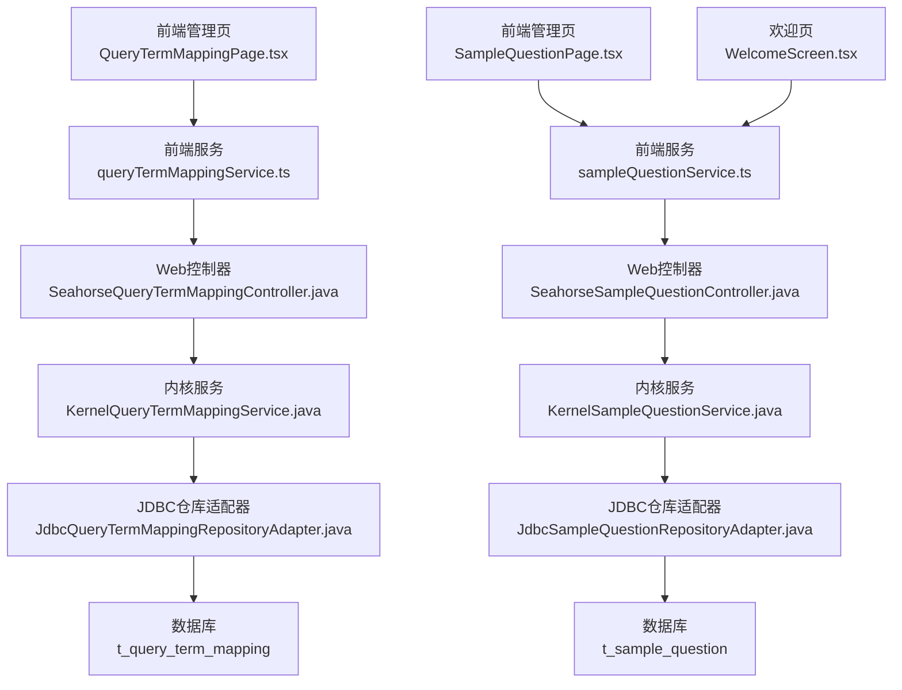
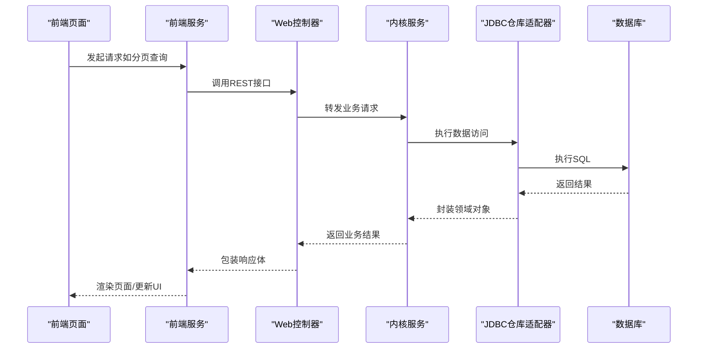
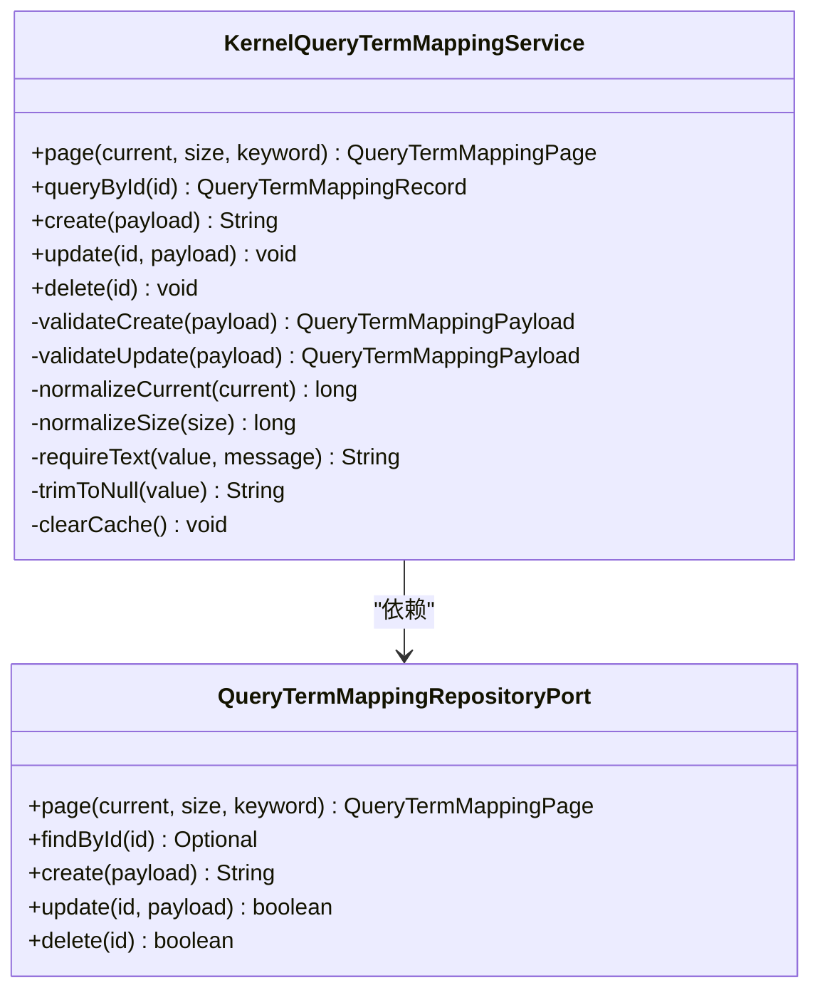
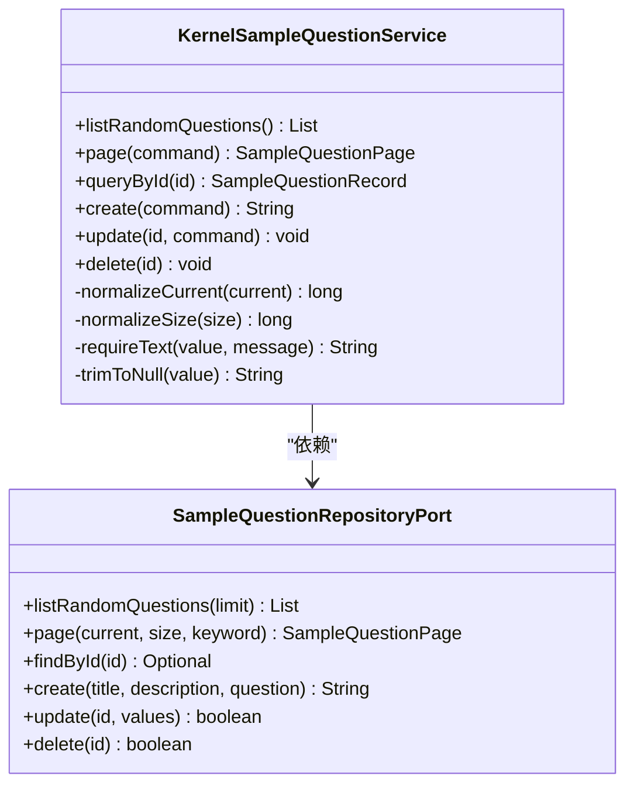
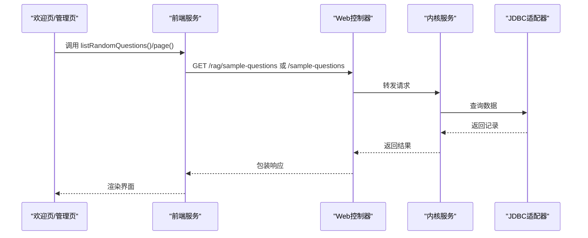
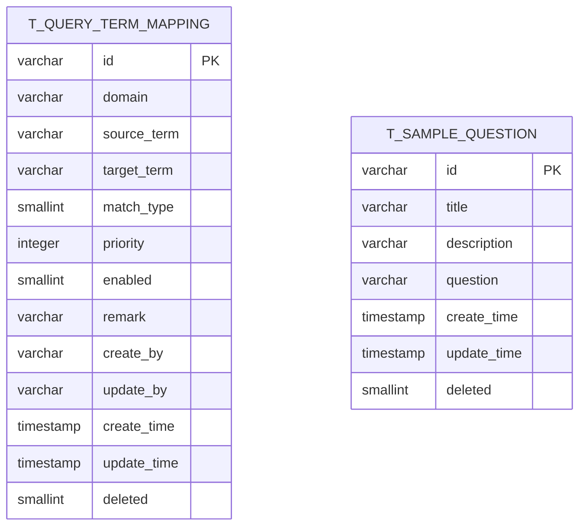
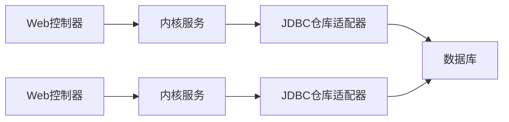

# 查询映射和样例问题服务

<cite>
**本文档引用的文件**
- [KernelQueryTermMappingService.java](file://seahorse-agent-kernel/src/main/java/com/miracle/ai/seahorse/agent/kernel/application/mapping/KernelQueryTermMappingService.java)
- [KernelSampleQuestionService.java](file://seahorse-agent-kernel/src/main/java/com/miracle/ai/seahorse/agent/kernel/application/sample/KernelSampleQuestionService.java)
- [SeahorseQueryTermMappingController.java](file://seahorse-agent-adapter-web/src/main/java/com/miracle/ai/seahorse/agent/adapters/web/SeahorseQueryTermMappingController.java)
- [SeahorseSampleQuestionController.java](file://seahorse-agent-adapter-web/src/main/java/com/miracle/ai/seahorse/agent/adapters/web/SeahorseSampleQuestionController.java)
- [QueryTermMappingInboundPort.java](file://seahorse-agent-kernel/src/main/java/com/miracle/ai/seahorse/agent/ports/inbound/mapping/QueryTermMappingInboundPort.java)
- [SampleQuestionInboundPort.java](file://seahorse-agent-kernel/src/main/java/com/miracle/ai/seahorse/agent/ports/inbound/sample/SampleQuestionInboundPort.java)
- [QueryTermMappingRepositoryPort.java](file://seahorse-agent-kernel/src/main/java/com/miracle/ai/seahorse/agent/ports/outbound/mapping/QueryTermMappingRepositoryPort.java)
- [SampleQuestionRepositoryPort.java](file://seahorse-agent-kernel/src/main/java/com/miracle/ai/seahorse/agent/ports/outbound/sample/SampleQuestionRepositoryPort.java)
- [JdbcQueryTermMappingRepositoryAdapter.java](file://seahorse-agent-adapter-repository-jdbc/src/main/java/com/miracle/ai/seahorse/agent/adapters/repository/jdbc/JdbcQueryTermMappingRepositoryAdapter.java)
- [JdbcSampleQuestionRepositoryAdapter.java](file://seahorse-agent-adapter-repository-jdbc/src/main/java/com/miracle/ai/seahorse/agent/adapters/repository/jdbc/JdbcSampleQuestionRepositoryAdapter.java)
- [schema_pg.sql](file://resources/database/schema_pg.sql)
- [queryTermMappingService.ts](file://frontend/src/services/queryTermMappingService.ts)
- [sampleQuestionService.ts](file://frontend/src/services/sampleQuestionService.ts)
- [QueryTermMappingPage.tsx](file://frontend/src/pages/admin/query-term-mapping/QueryTermMappingPage.tsx)
- [SampleQuestionPage.tsx](file://frontend/src/pages/admin/sample-questions/SampleQuestionPage.tsx)
- [WelcomeScreen.tsx](file://frontend/src/components/chat/WelcomeScreen.tsx)
</cite>

## 目录
1. [简介](#简介)
2. [项目结构](#项目结构)
3. [核心组件](#核心组件)
4. [架构总览](#架构总览)
5. [详细组件分析](#详细组件分析)
6. [依赖分析](#依赖分析)
7. [性能考虑](#性能考虑)
8. [故障排查指南](#故障排查指南)
9. [结论](#结论)
10. [附录](#附录)

## 简介
本文件聚焦于“查询映射”和“样例问题”两大能力域，系统性阐述其在内核层的服务实现、前后端集成方式、数据库模型以及前端页面与交互流程。重点包括：
- 查询词映射服务（KernelQueryTermMappingService）：负责建立用户查询与标准术语之间的对应关系，支持多类型匹配与优先级控制，具备分页、校验、缓存清理等能力。
- 样例问题服务（KernelSampleQuestionService）：负责维护欢迎页推荐问题与后台管理的分页维护，支持随机推荐、分页查询、CRUD 等。

通过本文档，读者可以理解从请求到内核服务、再到持久层适配器的完整调用链路，并掌握查询优化策略、配置示例与最佳实践。

## 项目结构
围绕查询映射与样例问题的关键模块分布如下：
- 内核层（Kernel）：提供应用服务与领域逻辑封装，屏蔽外部依赖。
- 适配器层（Web）：暴露 REST 接口，对接前端。
- 适配器层（Repository-JDBC）：实现持久化访问，基于 JDBC 访问数据库。
- 前端（Frontend）：提供管理页面与欢迎页交互，调用后端服务。

图表来源
- [SeahorseQueryTermMappingController.java:52-80](file://seahorse-agent-adapter-web/src/main/java/com/miracle/ai/seahorse/agent/adapters/web/SeahorseQueryTermMappingController.java#L52-L80)
- [SeahorseSampleQuestionController.java:56-99](file://seahorse-agent-adapter-web/src/main/java/com/miracle/ai/seahorse/agent/adapters/web/SeahorseSampleQuestionController.java#L56-L99)
- [KernelQueryTermMappingService.java:47-81](file://seahorse-agent-kernel/src/main/java/com/miracle/ai/seahorse/agent/kernel/application/mapping/KernelQueryTermMappingService.java#L47-L81)
- [KernelSampleQuestionService.java:48-99](file://seahorse-agent-kernel/src/main/java/com/miracle/ai/seahorse/agent/kernel/application/sample/KernelSampleQuestionService.java#L48-L99)
- [JdbcQueryTermMappingRepositoryAdapter.java:62-137](file://seahorse-agent-adapter-repository-jdbc/src/main/java/com/miracle/ai/seahorse/agent/adapters/repository/jdbc/JdbcQueryTermMappingRepositoryAdapter.java#L62-L137)
- [JdbcSampleQuestionRepositoryAdapter.java:75-141](file://seahorse-agent-adapter-repository-jdbc/src/main/java/com/miracle/ai/seahorse/agent/adapters/repository/jdbc/JdbcSampleQuestionRepositoryAdapter.java#L75-L141)
- [schema_pg.sql:274-291](file://resources/database/schema_pg.sql#L274-L291)
- [schema_pg.sql:100-110](file://resources/database/schema_pg.sql#L100-L110)

章节来源
- [SeahorseQueryTermMappingController.java:1-82](file://seahorse-agent-adapter-web/src/main/java/com/miracle/ai/seahorse/agent/adapters/web/SeahorseQueryTermMappingController.java#L1-L82)
- [SeahorseSampleQuestionController.java:1-101](file://seahorse-agent-adapter-web/src/main/java/com/miracle/ai/seahorse/agent/adapters/web/SeahorseSampleQuestionController.java#L1-L101)
- [KernelQueryTermMappingService.java:1-137](file://seahorse-agent-kernel/src/main/java/com/miracle/ai/seahorse/agent/kernel/application/mapping/KernelQueryTermMappingService.java#L1-L137)
- [KernelSampleQuestionService.java:1-128](file://seahorse-agent-kernel/src/main/java/com/miracle/ai/seahorse/agent/kernel/application/sample/KernelSampleQuestionService.java#L1-L128)
- [JdbcQueryTermMappingRepositoryAdapter.java:1-207](file://seahorse-agent-adapter-repository-jdbc/src/main/java/com/miracle/ai/seahorse/agent/adapters/repository/jdbc/JdbcQueryTermMappingRepositoryAdapter.java#L1-L207)
- [JdbcSampleQuestionRepositoryAdapter.java:1-205](file://seahorse-agent-adapter-repository-jdbc/src/main/java/com/miracle/ai/seahorse/agent/adapters/repository/jdbc/JdbcSampleQuestionRepositoryAdapter.java#L1-L205)
- [schema_pg.sql:100-110](file://resources/database/schema_pg.sql#L100-L110)
- [schema_pg.sql:274-291](file://resources/database/schema_pg.sql#L274-L291)

## 核心组件
- 查询词映射服务（KernelQueryTermMappingService）
  - 提供分页查询、按ID查询、创建、更新、删除等能力。
  - 对输入进行严格校验（非空、去空白），并统一处理默认值与边界值。
  - 维护缓存键，变更后主动清理缓存，确保一致性。
- 样例问题服务（KernelSampleQuestionService）
  - 支持欢迎页随机问题列表与后台管理分页查询。
  - 提供创建、更新（部分字段可选更新）、删除等操作。
  - 统一处理分页参数与字符串裁剪。

章节来源
- [KernelQueryTermMappingService.java:47-135](file://seahorse-agent-kernel/src/main/java/com/miracle/ai/seahorse/agent/kernel/application/mapping/KernelQueryTermMappingService.java#L47-L135)
- [KernelSampleQuestionService.java:48-126](file://seahorse-agent-kernel/src/main/java/com/miracle/ai/seahorse/agent/kernel/application/sample/KernelSampleQuestionService.java#L48-L126)

## 架构总览
下图展示了从前端到内核、再到持久层的整体调用链与职责划分：

图表来源
- [SeahorseQueryTermMappingController.java:52-80](file://seahorse-agent-adapter-web/src/main/java/com/miracle/ai/seahorse/agent/adapters/web/SeahorseQueryTermMappingController.java#L52-L80)
- [SeahorseSampleQuestionController.java:56-99](file://seahorse-agent-adapter-web/src/main/java/com/miracle/ai/seahorse/agent/adapters/web/SeahorseSampleQuestionController.java#L56-L99)
- [KernelQueryTermMappingService.java:47-81](file://seahorse-agent-kernel/src/main/java/com/miracle/ai/seahorse/agent/kernel/application/mapping/KernelQueryTermMappingService.java#L47-L81)
- [KernelSampleQuestionService.java:48-99](file://seahorse-agent-kernel/src/main/java/com/miracle/ai/seahorse/agent/kernel/application/sample/KernelSampleQuestionService.java#L48-L99)
- [JdbcQueryTermMappingRepositoryAdapter.java:62-137](file://seahorse-agent-adapter-repository-jdbc/src/main/java/com/miracle/ai/seahorse/agent/adapters/repository/jdbc/JdbcQueryTermMappingRepositoryAdapter.java#L62-L137)
- [JdbcSampleQuestionRepositoryAdapter.java:75-141](file://seahorse-agent-adapter-repository-jdbc/src/main/java/com/miracle/ai/seahorse/agent/adapters/repository/jdbc/JdbcSampleQuestionRepositoryAdapter.java#L75-L141)

## 详细组件分析

### 查询词映射服务（KernelQueryTermMappingService）
- 输入校验与默认值
  - 必填字段校验（如 sourceTerm、targetTerm），去除空白后为空则抛出异常。
  - 分页参数规范化：current 最小为 1；size 最小为 1，最大限制为 100。
- 数据变更与缓存
  - 创建/更新/删除后清理缓存键，避免脏读。
- 关键方法
  - page(current, size, keyword)：分页查询，支持关键字模糊匹配。
  - queryById(id)：按ID查询。
  - create/update/delete：标准 CRUD，均进行参数校验与存在性检查。

图表来源
- [KernelQueryTermMappingService.java:32-135](file://seahorse-agent-kernel/src/main/java/com/miracle/ai/seahorse/agent/kernel/application/mapping/KernelQueryTermMappingService.java#L32-L135)
- [QueryTermMappingRepositoryPort.java:25-36](file://seahorse-agent-kernel/src/main/java/com/miracle/ai/seahorse/agent/ports/outbound/mapping/QueryTermMappingRepositoryPort.java#L25-L36)

章节来源
- [KernelQueryTermMappingService.java:47-135](file://seahorse-agent-kernel/src/main/java/com/miracle/ai/seahorse/agent/kernel/application/mapping/KernelQueryTermMappingService.java#L47-L135)
- [JdbcQueryTermMappingRepositoryAdapter.java:62-137](file://seahorse-agent-adapter-repository-jdbc/src/main/java/com/miracle/ai/seahorse/agent/adapters/repository/jdbc/JdbcQueryTermMappingRepositoryAdapter.java#L62-L137)

### 样例问题服务（KernelSampleQuestionService）
- 随机推荐与分页
  - listRandomQuestions：返回最多 3 条随机样例问题，用于欢迎页推荐。
  - page(command)：支持关键字模糊匹配（标题/描述/问题），分页参数规范化。
- 更新策略
  - 使用 UpdateSampleQuestionCommand 的 present 标记，仅对传入字段进行更新，避免误清空。
- 关键方法
  - listRandomQuestions()：欢迎页随机问题。
  - page(command)：后台管理分页。
  - queryById/create/update/delete：标准 CRUD。

图表来源
- [KernelSampleQuestionService.java:35-126](file://seahorse-agent-kernel/src/main/java/com/miracle/ai/seahorse/agent/kernel/application/sample/KernelSampleQuestionService.java#L35-L126)
- [SampleQuestionRepositoryPort.java:26-39](file://seahorse-agent-kernel/src/main/java/com/miracle/ai/seahorse/agent/ports/outbound/sample/SampleQuestionRepositoryPort.java#L26-L39)

章节来源
- [KernelSampleQuestionService.java:48-126](file://seahorse-agent-kernel/src/main/java/com/miracle/ai/seahorse/agent/kernel/application/sample/KernelSampleQuestionService.java#L48-L126)
- [JdbcSampleQuestionRepositoryAdapter.java:67-141](file://seahorse-agent-adapter-repository-jdbc/src/main/java/com/miracle/ai/seahorse/agent/adapters/repository/jdbc/JdbcSampleQuestionRepositoryAdapter.java#L67-L141)

### Web 控制器与前端集成
- 查询词映射控制器
  - 提供 GET/POST/PUT/DELETE 接口，统一返回 code/data 结构。
  - 与内核服务 QueryTermMappingInboundPort 解耦。
- 样例问题控制器
  - 提供 GET/POST/PUT/DELETE 接口，其中 GET /rag/sample-questions 用于欢迎页随机问题。
  - 与内核服务 SampleQuestionInboundPort 解耦。
- 前端服务与页面
  - queryTermMappingService.ts/sampleQuestionService.ts：封装 API 请求。
  - QueryTermMappingPage.tsx/SampleQuestionPage.tsx：管理分页、搜索、新增/编辑/删除弹窗。
  - WelcomeScreen.tsx：加载随机样例问题并渲染推荐卡片。

图表来源
- [SeahorseSampleQuestionController.java:56-99](file://seahorse-agent-adapter-web/src/main/java/com/miracle/ai/seahorse/agent/adapters/web/SeahorseSampleQuestionController.java#L56-L99)
- [SeahorseQueryTermMappingController.java:52-80](file://seahorse-agent-adapter-web/src/main/java/com/miracle/ai/seahorse/agent/adapters/web/SeahorseQueryTermMappingController.java#L52-L80)
- [KernelSampleQuestionService.java:48-99](file://seahorse-agent-kernel/src/main/java/com/miracle/ai/seahorse/agent/kernel/application/sample/KernelSampleQuestionService.java#L48-L99)
- [KernelQueryTermMappingService.java:47-81](file://seahorse-agent-kernel/src/main/java/com/miracle/ai/seahorse/agent/kernel/application/mapping/KernelQueryTermMappingService.java#L47-L81)
- [sampleQuestionService.ts:26-28](file://frontend/src/services/sampleQuestionService.ts#L26-L28)
- [queryTermMappingService.ts:32-40](file://frontend/src/services/queryTermMappingService.ts#L32-L40)
- [WelcomeScreen.tsx:69-101](file://frontend/src/components/chat/WelcomeScreen.tsx#L69-L101)

章节来源
- [SeahorseSampleQuestionController.java:1-101](file://seahorse-agent-adapter-web/src/main/java/com/miracle/ai/seahorse/agent/adapters/web/SeahorseSampleQuestionController.java#L1-L101)
- [SeahorseQueryTermMappingController.java:1-82](file://seahorse-agent-adapter-web/src/main/java/com/miracle/ai/seahorse/agent/adapters/web/SeahorseQueryTermMappingController.java#L1-L82)
- [sampleQuestionService.ts:1-51](file://frontend/src/services/sampleQuestionService.ts#L1-L51)
- [queryTermMappingService.ts:1-53](file://frontend/src/services/queryTermMappingService.ts#L1-L53)
- [WelcomeScreen.tsx:69-101](file://frontend/src/components/chat/WelcomeScreen.tsx#L69-L101)

### 数据模型与索引
- t_query_term_mapping：关键词归一化映射表，包含领域、源词、目标词、匹配类型、优先级、启用状态、备注等字段，并有 domain/source 索引。
- t_sample_question：示例问题表，包含标题、描述、问题正文等字段，并有删除标记索引。

图表来源
- [schema_pg.sql:274-291](file://resources/database/schema_pg.sql#L274-L291)
- [schema_pg.sql:100-110](file://resources/database/schema_pg.sql#L100-L110)

章节来源
- [schema_pg.sql:100-110](file://resources/database/schema_pg.sql#L100-L110)
- [schema_pg.sql:274-291](file://resources/database/schema_pg.sql#L274-L291)

## 依赖分析
- 内核服务依赖端口接口（Inbound/Outbound），实现解耦与可替换性。
- Web 控制器依赖内核服务端口，不直接操作数据库。
- JDBC 适配器实现 Outbound Repository Port，封装 SQL 与实体映射。
- 前端通过服务层调用控制器，控制器再调用内核服务，形成清晰的单向依赖。

图表来源
- [SeahorseQueryTermMappingController.java:46-50](file://seahorse-agent-adapter-web/src/main/java/com/miracle/ai/seahorse/agent/adapters/web/SeahorseQueryTermMappingController.java#L46-L50)
- [SeahorseSampleQuestionController.java:50-54](file://seahorse-agent-adapter-web/src/main/java/com/miracle/ai/seahorse/agent/adapters/web/SeahorseSampleQuestionController.java#L50-L54)
- [KernelQueryTermMappingService.java:39-45](file://seahorse-agent-kernel/src/main/java/com/miracle/ai/seahorse/agent/kernel/application/mapping/KernelQueryTermMappingService.java#L39-L45)
- [KernelSampleQuestionService.java:42-46](file://seahorse-agent-kernel/src/main/java/com/miracle/ai/seahorse/agent/kernel/application/sample/KernelSampleQuestionService.java#L42-L46)
- [JdbcQueryTermMappingRepositoryAdapter.java:56-60](file://seahorse-agent-adapter-repository-jdbc/src/main/java/com/miracle/ai/seahorse/agent/adapters/repository/jdbc/JdbcQueryTermMappingRepositoryAdapter.java#L56-L60)
- [JdbcSampleQuestionRepositoryAdapter.java:61-65](file://seahorse-agent-adapter-repository-jdbc/src/main/java/com/miracle/ai/seahorse/agent/adapters/repository/jdbc/JdbcSampleQuestionRepositoryAdapter.java#L61-L65)

章节来源
- [QueryTermMappingInboundPort.java:27-38](file://seahorse-agent-kernel/src/main/java/com/miracle/ai/seahorse/agent/ports/inbound/mapping/QueryTermMappingInboundPort.java#L27-L38)
- [SampleQuestionInboundPort.java:28-41](file://seahorse-agent-kernel/src/main/java/com/miracle/ai/seahorse/agent/ports/inbound/sample/SampleQuestionInboundPort.java#L28-L41)
- [QueryTermMappingRepositoryPort.java:25-36](file://seahorse-agent-kernel/src/main/java/com/miracle/ai/seahorse/agent/ports/outbound/mapping/QueryTermMappingRepositoryPort.java#L25-L36)
- [SampleQuestionRepositoryPort.java:26-39](file://seahorse-agent-kernel/src/main/java/com/miracle/ai/seahorse/agent/ports/outbound/sample/SampleQuestionRepositoryPort.java#L26-L39)

## 性能考虑
- 分页与索引
  - 分页 size 最大限制为 100，避免超大结果集导致资源消耗。
  - 数据库对 t_query_term_mapping 的 domain/source_term 建有索引，有利于高频查询。
- 随机查询
  - t_sample_question 的随机查询使用 ORDER BY RANDOM()，在大数据量下可能成为瓶颈，建议结合业务量评估是否引入更高效的随机采样策略。
- 缓存策略
  - 内核服务在变更映射规则后主动清理缓存键，保证一致性；若后续引入缓存中间件，建议在查询侧增加缓存命中与失效策略。
- SQL 参数化
  - JDBC 适配器使用参数化 SQL，避免注入风险并提升执行计划复用率。

章节来源
- [KernelQueryTermMappingService.java:106-115](file://seahorse-agent-kernel/src/main/java/com/miracle/ai/seahorse/agent/kernel/application/mapping/KernelQueryTermMappingService.java#L106-L115)
- [JdbcQueryTermMappingRepositoryAdapter.java:139-147](file://seahorse-agent-adapter-repository-jdbc/src/main/java/com/miracle/ai/seahorse/agent/adapters/repository/jdbc/JdbcQueryTermMappingRepositoryAdapter.java#L139-L147)
- [schema_pg.sql:289-291](file://resources/database/schema_pg.sql#L289-L291)

## 故障排查指南
- 常见错误与定位
  - 参数非法：当 sourceTerm/targetTerm 为空或仅含空白时，内核服务会抛出非法参数异常；前端应提示用户输入有效内容。
  - 记录不存在：更新/删除时若找不到对应 ID，会抛出“未找到”异常；需检查 ID 是否正确或已被删除。
  - 数据库约束：t_query_term_mapping 中 match_type 默认值为 1，priority 默认值为 100，注意避免越界或无效值。
- 建议排查步骤
  - 检查前端服务调用是否携带必要字段（如 question/title/sourceTerm/targetTerm）。
  - 查看控制器返回的统一响应结构，确认 code 与 data 字段。
  - 核对数据库中对应记录是否存在且未被软删除（deleted=0）。
  - 若出现性能问题，优先检查分页 size 与关键字过滤条件，必要时调整索引或引入缓存。

章节来源
- [KernelQueryTermMappingService.java:83-104](file://seahorse-agent-kernel/src/main/java/com/miracle/ai/seahorse/agent/kernel/application/mapping/KernelQueryTermMappingService.java#L83-L104)
- [KernelSampleQuestionService.java:76-99](file://seahorse-agent-kernel/src/main/java/com/miracle/ai/seahorse/agent/kernel/application/sample/KernelSampleQuestionService.java#L76-L99)
- [JdbcQueryTermMappingRepositoryAdapter.java:126-137](file://seahorse-agent-adapter-repository-jdbc/src/main/java/com/miracle/ai/seahorse/agent/adapters/repository/jdbc/JdbcQueryTermMappingRepositoryAdapter.java#L126-L137)
- [JdbcSampleQuestionRepositoryAdapter.java:130-141](file://seahorse-agent-adapter-repository-jdbc/src/main/java/com/miracle/ai/seahorse/agent/adapters/repository/jdbc/JdbcSampleQuestionRepositoryAdapter.java#L130-L141)

## 结论
查询映射与样例问题服务通过清晰的分层设计实现了高内聚、低耦合的架构：前端仅关注交互与展示，Web 控制器负责协议转换，内核服务承载业务规则与校验，JDBC 适配器负责持久化细节。该设计便于扩展与维护，同时为后续引入缓存、分布式锁、可观测性等能力提供了良好基础。

## 附录

### 查询映射与样例问题的典型使用场景
- 查询映射
  - 场景：用户输入“请假条”“加班费”等口语化词汇，系统将其归一化为“OA流程”“薪酬发放”等标准术语，提升检索准确率。
  - 建议：为高频业务词设置较低 priority 值以提高优先级；启用精确匹配以减少歧义。
- 样例问题
  - 场景：欢迎页展示“任务拆解”“内容总结”“灵感扩展”等推荐问法，降低用户思考成本。
  - 建议：定期更新样例问题，结合用户行为数据选择高点击率的问法作为推荐。

### 配置示例与最佳实践
- 分页参数
  - current：默认 1，最小 1。
  - size：默认 10，最小 1，最大 100。
- 匹配类型
  - 精确匹配、前缀匹配、正则匹配、整词匹配；根据业务需求选择合适类型。
- 优先级
  - 数值越小优先级越高；建议为常用业务词预留较小优先级。
- 启用状态
  - 通过 enabled 字段快速开关规则，便于灰度与回滚。

章节来源
- [KernelQueryTermMappingService.java:106-115](file://seahorse-agent-kernel/src/main/java/com/miracle/ai/seahorse/agent/kernel/application/mapping/KernelQueryTermMappingService.java#L106-L115)
- [KernelSampleQuestionService.java:101-110](file://seahorse-agent-kernel/src/main/java/com/miracle/ai/seahorse/agent/kernel/application/sample/KernelSampleQuestionService.java#L101-L110)
- [QueryTermMappingPage.tsx:46-51](file://frontend/src/pages/admin/query-term-mapping/QueryTermMappingPage.tsx#L46-L51)