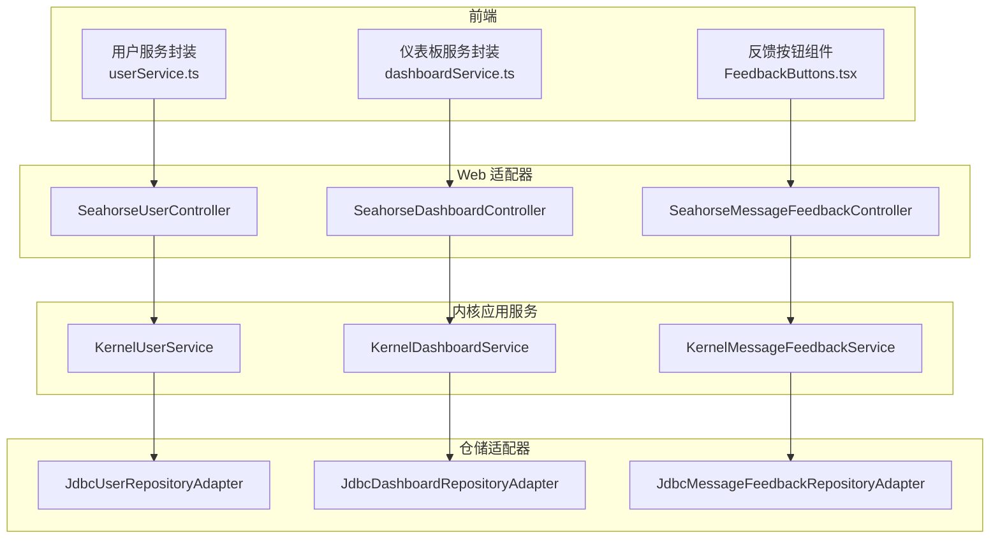
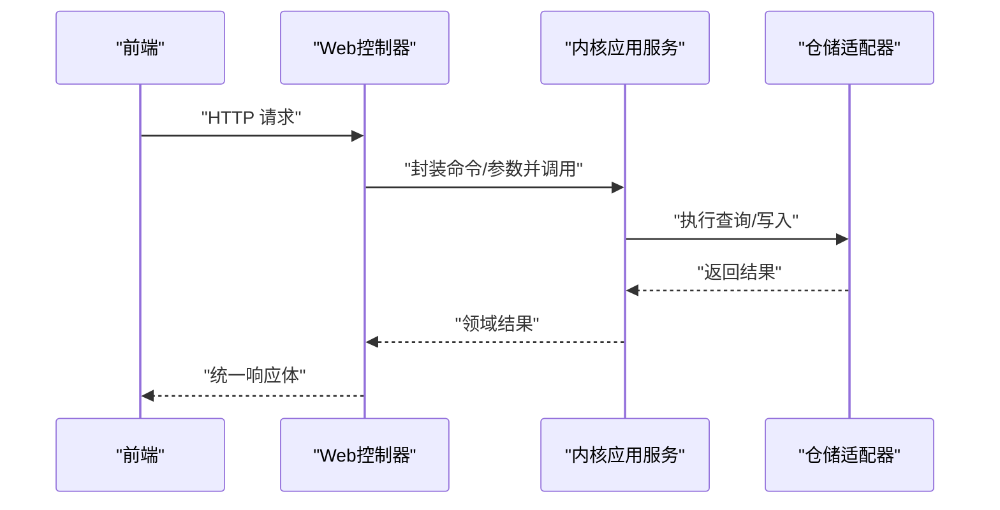
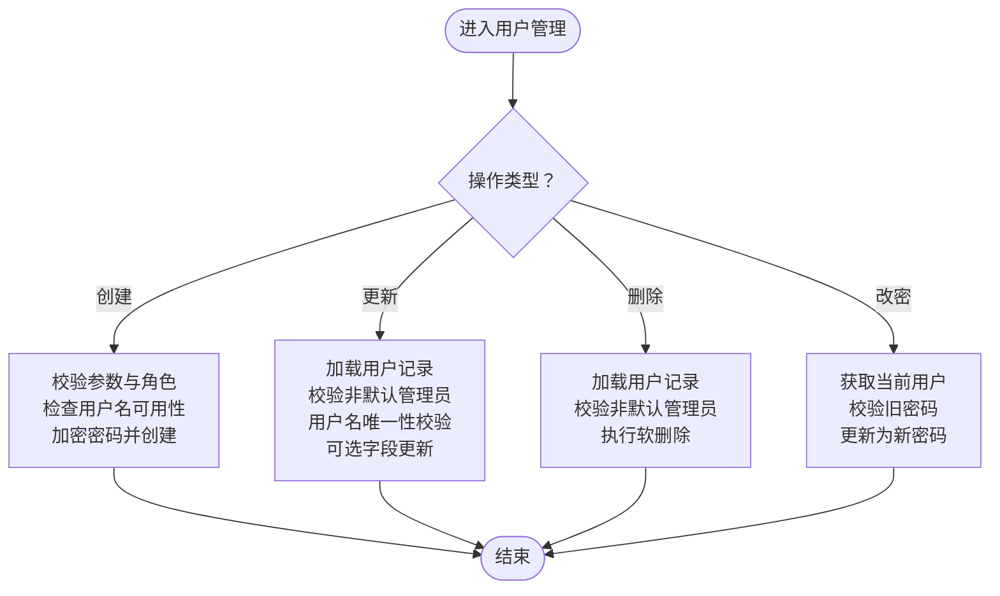
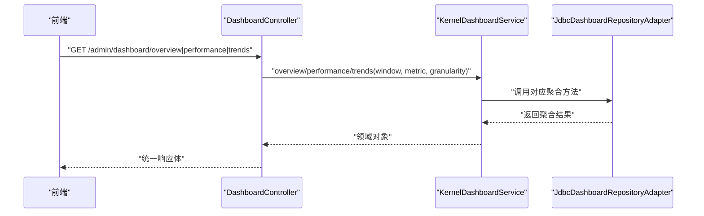
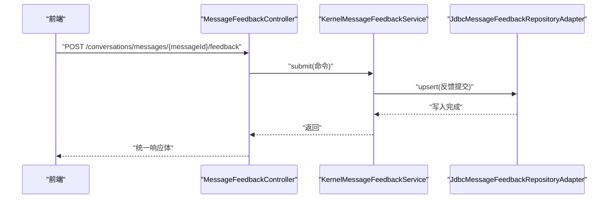
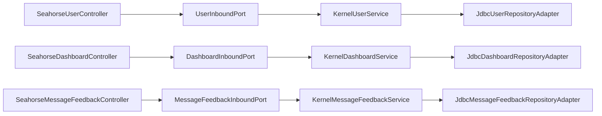

# 用户、仪表板和反馈服务

<cite>
**本文引用的文件**
- [KernelUserService.java](file://seahorse-agent-kernel/src/main/java/com/miracle/ai/seahorse/agent/kernel/application/user/KernelUserService.java)
- [KernelDashboardService.java](file://seahorse-agent-kernel/src/main/java/com/miracle/ai/seahorse/agent/kernel/application/dashboard/KernelDashboardService.java)
- [KernelMessageFeedbackService.java](file://seahorse-agent-kernel/src/main/java/com/miracle/ai/seahorse/agent/kernel/application/feedback/KernelMessageFeedbackService.java)
- [UserInboundPort.java](file://seahorse-agent-kernel/src/main/java/com/miracle/ai/seahorse/agent/ports/inbound/user/UserInboundPort.java)
- [DashboardInboundPort.java](file://seahorse-agent-kernel/src/main/java/com/miracle/ai/seahorse/agent/ports/inbound/dashboard/DashboardInboundPort.java)
- [MessageFeedbackInboundPort.java](file://seahorse-agent-kernel/src/main/java/com/miracle/ai/seahorse/agent/ports/inbound/feedback/MessageFeedbackInboundPort.java)
- [SeahorseUserController.java](file://seahorse-agent-adapter-web/src/main/java/com/miracle/ai/seahorse/agent/adapters/web/SeahorseUserController.java)
- [SeahorseDashboardController.java](file://seahorse-agent-adapter-web/src/main/java/com/miracle/ai/seahorse/agent/adapters/web/SeahorseDashboardController.java)
- [SeahorseMessageFeedbackController.java](file://seahorse-agent-adapter-web/src/main/java/com/miracle/ai/seahorse/agent/adapters/web/SeahorseMessageFeedbackController.java)
- [JdbcUserRepositoryAdapter.java](file://seahorse-agent-adapter-repository-jdbc/src/main/java/com/miracle/ai/seahorse/agent/adapters/repository/jdbc/JdbcUserRepositoryAdapter.java)
- [JdbcDashboardRepositoryAdapter.java](file://seahorse-agent-adapter-repository-jdbc/src/main/java/com/miracle/ai/seahorse/agent/adapters/repository/jdbc/JdbcDashboardRepositoryAdapter.java)
- [JdbcMessageFeedbackRepositoryAdapter.java](file://seahorse-agent-adapter-repository-jdbc/src/main/java/com/miracle/ai/seahorse/agent/adapters/repository/jdbc/JdbcMessageFeedbackRepositoryAdapter.java)
- [userService.ts](file://frontend/src/services/userService.ts)
- [dashboardService.ts](file://frontend/src/services/dashboardService.ts)
- [FeedbackButtons.tsx](file://frontend/src/components/chat/FeedbackButtons.tsx)
</cite>

## 目录
1. [简介](#简介)
2. [项目结构](#项目结构)
3. [核心组件](#核心组件)
4. [架构总览](#架构总览)
5. [详细组件分析](#详细组件分析)
6. [依赖分析](#依赖分析)
7. [性能考虑](#性能考虑)
8. [故障排查指南](#故障排查指南)
9. [结论](#结论)
10. [附录](#附录)

## 简介
本文件聚焦于用户、仪表板与反馈三大应用服务的技术文档，覆盖以下目标：
- 用户服务：用户注册、认证、权限管理、个人信息维护的完整流程与安全策略
- 仪表板服务：关键指标聚合、趋势分析、性能监控的数据来源与计算逻辑
- 反馈服务：消息反馈的采集、去重更新、查询与处理流程
同时提供权限设计、数据可视化与用户体验优化的最佳实践建议。

## 项目结构
后端采用分层与端口适配器模式：
- kernel 层：应用服务（KernelUserService、KernelDashboardService、KernelMessageFeedbackService）
- adapter-web 层：REST 控制器适配器（SeahorseUserController、SeahorseDashboardController、SeahorseMessageFeedbackController）
- adapter-repository-jdbc 层：数据库适配器（JdbcUserRepositoryAdapter、JdbcDashboardRepositoryAdapter、JdbcMessageFeedbackRepositoryAdapter）
- 前端：用户管理、仪表板与反馈交互的 API 封装与 UI 组件

图表来源
- [SeahorseUserController.java:37-92](file://seahorse-agent-adapter-web/src/main/java/com/miracle/ai/seahorse/agent/adapters/web/SeahorseUserController.java#L37-L92)
- [SeahorseDashboardController.java:33-64](file://seahorse-agent-adapter-web/src/main/java/com/miracle/ai/seahorse/agent/adapters/web/SeahorseDashboardController.java#L33-L64)
- [SeahorseMessageFeedbackController.java:38-86](file://seahorse-agent-adapter-web/src/main/java/com/miracle/ai/seahorse/agent/adapters/web/SeahorseMessageFeedbackController.java#L38-L86)
- [KernelUserService.java:35-176](file://seahorse-agent-kernel/src/main/java/com/miracle/ai/seahorse/agent/kernel/application/user/KernelUserService.java#L35-L176)
- [KernelDashboardService.java:31-53](file://seahorse-agent-kernel/src/main/java/com/miracle/ai/seahorse/agent/kernel/application/dashboard/KernelDashboardService.java#L31-L53)
- [KernelMessageFeedbackService.java:33-52](file://seahorse-agent-kernel/src/main/java/com/miracle/ai/seahorse/agent/kernel/application/feedback/KernelMessageFeedbackService.java#L33-L52)
- [JdbcUserRepositoryAdapter.java:39-200](file://seahorse-agent-adapter-repository-jdbc/src/main/java/com/miracle/ai/seahorse/agent/adapters/repository/jdbc/JdbcUserRepositoryAdapter.java#L39-L200)
- [JdbcDashboardRepositoryAdapter.java:48-200](file://seahorse-agent-adapter-repository-jdbc/src/main/java/com/miracle/ai/seahorse/agent/adapters/repository/jdbc/JdbcDashboardRepositoryAdapter.java#L48-L200)
- [JdbcMessageFeedbackRepositoryAdapter.java:37-168](file://seahorse-agent-adapter-repository-jdbc/src/main/java/com/miracle/ai/seahorse/agent/adapters/repository/jdbc/JdbcMessageFeedbackRepositoryAdapter.java#L37-L168)

章节来源
- [SeahorseUserController.java:37-92](file://seahorse-agent-adapter-web/src/main/java/com/miracle/ai/seahorse/agent/adapters/web/SeahorseUserController.java#L37-L92)
- [SeahorseDashboardController.java:33-64](file://seahorse-agent-adapter-web/src/main/java/com/miracle/ai/seahorse/agent/adapters/web/SeahorseDashboardController.java#L33-L64)
- [SeahorseMessageFeedbackController.java:38-86](file://seahorse-agent-adapter-web/src/main/java/com/miracle/ai/seahorse/agent/adapters/web/SeahorseMessageFeedbackController.java#L38-L86)

## 核心组件
- 用户服务（KernelUserService）：负责当前用户查询、分页查询、创建、更新、删除、改密；内置角色校验与默认管理员保护；密码加密与用户名唯一性约束
- 仪表板服务（KernelDashboardService）：提供概览、性能与趋势三类查询，委托底层仓储适配器完成统计
- 反馈服务（KernelMessageFeedbackService）：接收消息反馈提交，写入反馈仓储，支持点赞/点踩与原因、评论字段

章节来源
- [KernelUserService.java:35-176](file://seahorse-agent-kernel/src/main/java/com/miracle/ai/seahorse/agent/kernel/application/user/KernelUserService.java#L35-L176)
- [KernelDashboardService.java:31-53](file://seahorse-agent-kernel/src/main/java/com/miracle/ai/seahorse/agent/kernel/application/dashboard/KernelDashboardService.java#L31-L53)
- [KernelMessageFeedbackService.java:33-52](file://seahorse-agent-kernel/src/main/java/com/miracle/ai/seahorse/agent/kernel/application/feedback/KernelMessageFeedbackService.java#L33-L52)

## 架构总览
三层职责清晰：
- Web 适配器：暴露 REST 接口，参数校验与错误码封装
- 内核应用服务：业务规则与权限控制，调用仓储端口
- 仓储适配器：基于 JDBC 的数据访问与聚合计算

图表来源
- [SeahorseUserController.java:51-91](file://seahorse-agent-adapter-web/src/main/java/com/miracle/ai/seahorse/agent/adapters/web/SeahorseUserController.java#L51-L91)
- [SeahorseDashboardController.java:48-63](file://seahorse-agent-adapter-web/src/main/java/com/miracle/ai/seahorse/agent/adapters/web/SeahorseDashboardController.java#L48-L63)
- [SeahorseMessageFeedbackController.java:50-64](file://seahorse-agent-adapter-web/src/main/java/com/miracle/ai/seahorse/agent/adapters/web/SeahorseMessageFeedbackController.java#L50-L64)
- [KernelUserService.java:53-114](file://seahorse-agent-kernel/src/main/java/com/miracle/ai/seahorse/agent/kernel/application/user/KernelUserService.java#L53-L114)
- [KernelDashboardService.java:39-52](file://seahorse-agent-kernel/src/main/java/com/miracle/ai/seahorse/agent/kernel/application/dashboard/KernelDashboardService.java#L39-L52)
- [KernelMessageFeedbackService.java:41-51](file://seahorse-agent-kernel/src/main/java/com/miracle/ai/seahorse/agent/kernel/application/feedback/KernelMessageFeedbackService.java#L41-L51)

## 详细组件分析

### 用户服务 KernelUserService
- 角色与权限
  - 管理员角色常量与校验，限制对默认管理员账户的修改与删除
  - 当前用户必须具备管理员角色才能进行用户管理操作
- 用户生命周期
  - 创建：校验用户名与密码非空、角色归一化、用户名唯一性、密码加密后入库
  - 更新：支持用户名、密码、角色、头像的可选更新，用户名变更时同样校验唯一性与默认管理员保护
  - 删除：禁止删除默认管理员账户
  - 改密：当前用户需提供正确旧密码，通过哈希匹配后更新为新密码
- 数据一致性
  - 所有敏感输入均进行空值与空白裁剪校验，避免脏数据
  - 默认管理员用户名不可用，防止系统被锁定

图表来源
- [KernelUserService.java:58-114](file://seahorse-agent-kernel/src/main/java/com/miracle/ai/seahorse/agent/kernel/application/user/KernelUserService.java#L58-L114)
- [JdbcUserRepositoryAdapter.java:78-158](file://seahorse-agent-adapter-repository-jdbc/src/main/java/com/miracle/ai/seahorse/agent/adapters/repository/jdbc/JdbcUserRepositoryAdapter.java#L78-L158)

章节来源
- [KernelUserService.java:35-176](file://seahorse-agent-kernel/src/main/java/com/miracle/ai/seahorse/agent/kernel/application/user/KernelUserService.java#L35-L176)
- [JdbcUserRepositoryAdapter.java:39-200](file://seahorse-agent-adapter-repository-jdbc/src/main/java/com/miracle/ai/seahorse/agent/adapters/repository/jdbc/JdbcUserRepositoryAdapter.java#L39-L200)

### 仪表板服务 KernelDashboardService
- 查询能力
  - 概览：总用户、活跃用户、会话、消息等 KPI 及同比变化
  - 性能：平均/95 分位延迟、成功率、错误率、无知识率、慢请求率
  - 趋势：按粒度（小时/天）聚合会话、消息、活跃用户、平均延迟、质量指标（错误率、无知识率）
- 数据来源与窗口
  - 基于 t_user、t_conversation、t_message、t_rag_trace_run 等历史表
  - 支持窗口参数与环比窗口对比，趋势按时间桶聚合
- 计算要点
  - 活跃用户：在窗口内产生消息的不同用户数
  - 质量指标：错误率=错误/总计，无知识率=未检索到文档的助手消息占比

图表来源
- [KernelDashboardService.java:39-52](file://seahorse-agent-kernel/src/main/java/com/miracle/ai/seahorse/agent/kernel/application/dashboard/KernelDashboardService.java#L39-L52)
- [JdbcDashboardRepositoryAdapter.java:65-121](file://seahorse-agent-adapter-repository-jdbc/src/main/java/com/miracle/ai/seahorse/agent/adapters/repository/jdbc/JdbcDashboardRepositoryAdapter.java#L65-L121)

章节来源
- [KernelDashboardService.java:31-53](file://seahorse-agent-kernel/src/main/java/com/miracle/ai/seahorse/agent/kernel/application/dashboard/KernelDashboardService.java#L31-L53)
- [JdbcDashboardRepositoryAdapter.java:48-200](file://seahorse-agent-adapter-repository-jdbc/src/main/java/com/miracle/ai/seahorse/agent/adapters/repository/jdbc/JdbcDashboardRepositoryAdapter.java#L48-L200)

### 反馈服务 KernelMessageFeedbackService
- 提交流程
  - Web 层解析请求参数与请求头中的用户标识，构造提交命令
  - 应用服务校验命令非空，写入反馈仓储（upsert）
- 仓储策略
  - 基于消息与用户维度查找已有反馈记录，存在则更新，否则插入
  - 插入时自动补全对话 ID，并使用毫秒级+随机后缀生成唯一 ID
- 查询能力
  - 支持批量查询某用户的投票情况，便于 UI 展示当前状态

图表来源
- [KernelMessageFeedbackService.java:41-51](file://seahorse-agent-kernel/src/main/java/com/miracle/ai/seahorse/agent/kernel/application/feedback/KernelMessageFeedbackService.java#L41-L51)
- [JdbcMessageFeedbackRepositoryAdapter.java:74-147](file://seahorse-agent-adapter-repository-jdbc/src/main/java/com/miracle/ai/seahorse/agent/adapters/repository/jdbc/JdbcMessageFeedbackRepositoryAdapter.java#L74-L147)

章节来源
- [KernelMessageFeedbackService.java:33-52](file://seahorse-agent-kernel/src/main/java/com/miracle/ai/seahorse/agent/kernel/application/feedback/KernelMessageFeedbackService.java#L33-L52)
- [JdbcMessageFeedbackRepositoryAdapter.java:37-168](file://seahorse-agent-adapter-repository-jdbc/src/main/java/com/miracle/ai/seahorse/agent/adapters/repository/jdbc/JdbcMessageFeedbackRepositoryAdapter.java#L37-L168)

## 依赖分析
- Web 控制器依赖对应的 InboundPort 接口，确保仅在装配了实现时启用
- 应用服务依赖 OutboundPort 接口，保持内核与外部实现解耦
- 仓储适配器依赖 DataSource 与 JdbcTemplate，提供只读聚合与写入能力

图表来源
- [SeahorseUserController.java:37-49](file://seahorse-agent-adapter-web/src/main/java/com/miracle/ai/seahorse/agent/adapters/web/SeahorseUserController.java#L37-L49)
- [SeahorseDashboardController.java:33-45](file://seahorse-agent-adapter-web/src/main/java/com/miracle/ai/seahorse/agent/adapters/web/SeahorseDashboardController.java#L33-L45)
- [SeahorseMessageFeedbackController.java:38-47](file://seahorse-agent-adapter-web/src/main/java/com/miracle/ai/seahorse/agent/adapters/web/SeahorseMessageFeedbackController.java#L38-L47)
- [KernelUserService.java:35-51](file://seahorse-agent-kernel/src/main/java/com/miracle/ai/seahorse/agent/kernel/application/user/KernelUserService.java#L35-L51)
- [KernelDashboardService.java:31-37](file://seahorse-agent-kernel/src/main/java/com/miracle/ai/seahorse/agent/kernel/application/dashboard/KernelDashboardService.java#L31-L37)
- [KernelMessageFeedbackService.java:33-39](file://seahorse-agent-kernel/src/main/java/com/miracle/ai/seahorse/agent/kernel/application/feedback/KernelMessageFeedbackService.java#L33-L39)

章节来源
- [UserInboundPort.java:23-36](file://seahorse-agent-kernel/src/main/java/com/miracle/ai/seahorse/agent/ports/inbound/user/UserInboundPort.java#L23-L36)
- [DashboardInboundPort.java:27-34](file://seahorse-agent-kernel/src/main/java/com/miracle/ai/seahorse/agent/ports/inbound/dashboard/DashboardInboundPort.java#L27-L34)
- [MessageFeedbackInboundPort.java:23-31](file://seahorse-agent-kernel/src/main/java/com/miracle/ai/seahorse/agent/ports/inbound/feedback/MessageFeedbackInboundPort.java#L23-L31)

## 性能考虑
- 仪表板聚合
  - 使用时间桶与预聚合减少大表扫描；按需选择粒度（小时/天）平衡精度与性能
  - 趋势系列按指标拆分查询，避免单 SQL 过度复杂
- 用户分页
  - 分页查询带条件过滤与排序，注意索引覆盖（username、role、update_time）
- 反馈写入
  - upsert 流程先查后写，建议在 message_id 与 user_id 组合上建立索引以降低锁竞争
- 前端体验
  - 反馈按钮悬停可见、点赞/点踩即时态切换，减少重复点击带来的网络开销

## 故障排查指南
- 用户相关
  - “用户名已存在”：检查用户名唯一性校验与排除自身 ID 的逻辑
  - “默认管理员不可修改/删除”：确认操作对象是否为默认管理员账户
  - “当前密码不正确”：确认旧密码哈希匹配逻辑与输入格式
- 仪表板相关
  - “无数据”：确认窗口范围与表中数据的时间范围是否匹配
  - “趋势为空”：检查时间粒度与窗口设置是否合理
- 反馈相关
  - “assistant message not found”：确认消息角色与用户身份匹配，以及消息与对话关联正确
  - “vote must not be null”：前端需强制传递投票值，避免空值

章节来源
- [KernelUserService.java:103-114](file://seahorse-agent-kernel/src/main/java/com/miracle/ai/seahorse/agent/kernel/application/user/KernelUserService.java#L103-L114)
- [KernelMessageFeedbackService.java:41-51](file://seahorse-agent-kernel/src/main/java/com/miracle/ai/seahorse/agent/kernel/application/feedback/KernelMessageFeedbackService.java#L41-L51)
- [JdbcMessageFeedbackRepositoryAdapter.java:106-114](file://seahorse-agent-adapter-repository-jdbc/src/main/java/com/miracle/ai/seahorse/agent/adapters/repository/jdbc/JdbcMessageFeedbackRepositoryAdapter.java#L106-L114)

## 结论
本方案通过清晰的分层与端口分离，实现了用户、仪表板与反馈三大核心能力：
- 用户服务强调安全与合规（角色校验、默认管理员保护、密码哈希）
- 仪表板服务提供多维聚合与趋势分析，支撑运营决策
- 反馈服务保障数据完整性与可追溯性，支持后续分析与优化
建议在生产环境进一步完善鉴权、缓存与异步化策略，持续优化查询性能与用户体验。

## 附录
- 前端集成要点
  - 用户管理：分页查询、创建/更新弹窗、改密表单
  - 仪表板：KPI 卡片、性能指标、趋势图（按小时/天切换）
  - 反馈：消息级点赞/点踩按钮，支持原因与评论

章节来源
- [userService.ts:39-63](file://frontend/src/services/userService.ts#L39-L63)
- [dashboardService.ts:50-70](file://frontend/src/services/dashboardService.ts#L50-L70)
- [FeedbackButtons.tsx:17-83](file://frontend/src/components/chat/FeedbackButtons.tsx#L17-L83)