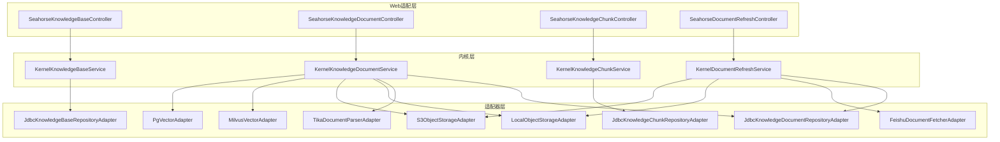
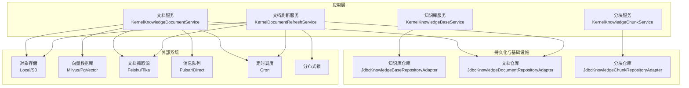
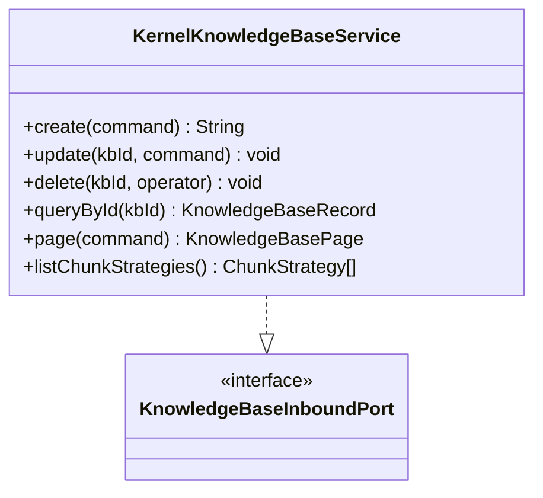
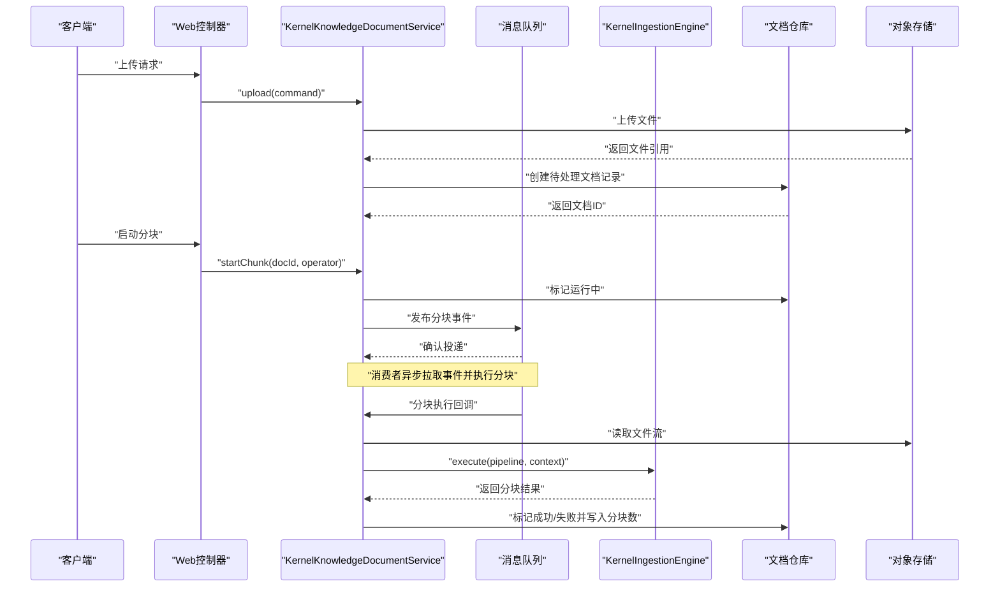
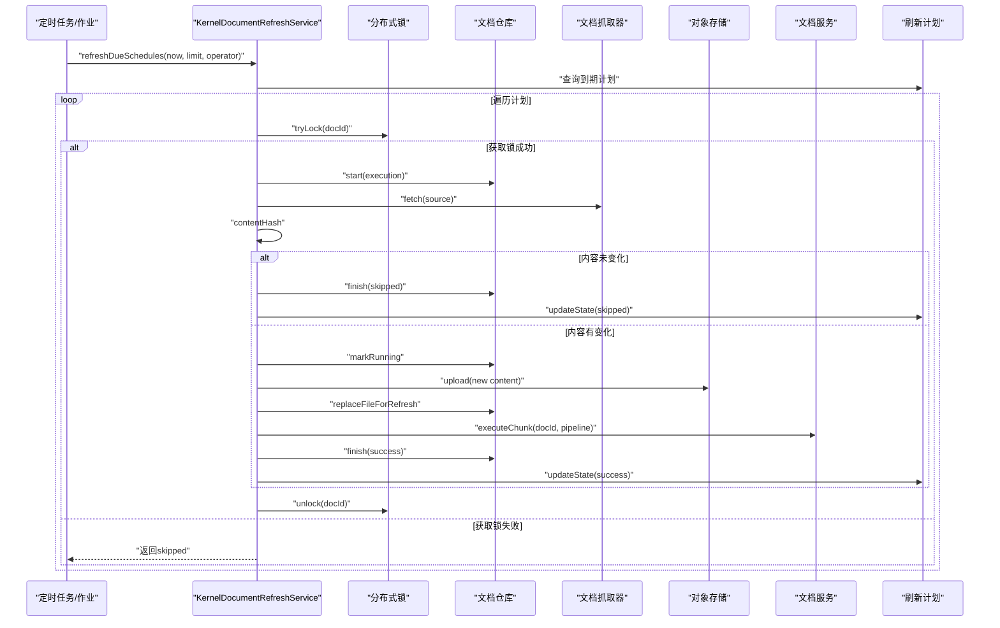
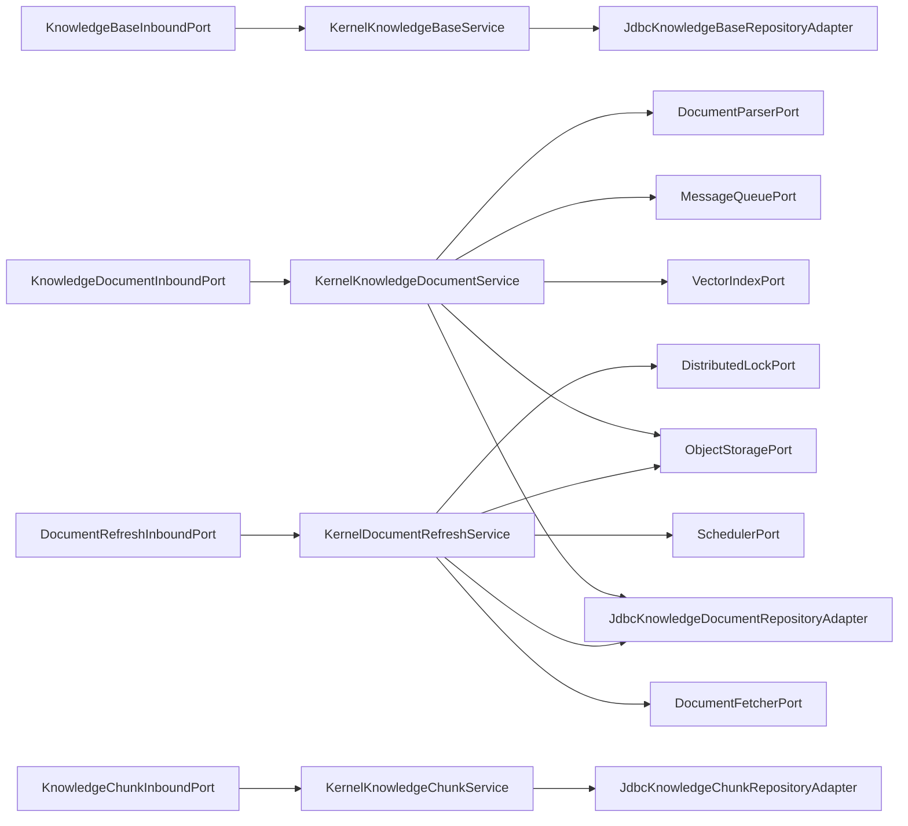

# 知识管理应用服务

<cite>
**本文引用的文件**
- [KernelKnowledgeBaseService.java](file://seahorse-agent-kernel/src/main/java/com/miracle/ai/seahorse/agent/kernel/application/knowledge/KernelKnowledgeBaseService.java)
- [KernelKnowledgeDocumentService.java](file://seahorse-agent-kernel/src/main/java/com/miracle/ai/seahorse/agent/kernel/application/knowledge/KernelKnowledgeDocumentService.java)
- [KernelKnowledgeChunkService.java](file://seahorse-agent-kernel/src/main/java/com/miracle/ai/seahorse/agent/kernel/application/knowledge/KernelKnowledgeChunkService.java)
- [KernelDocumentRefreshService.java](file://seahorse-agent-kernel/src/main/java/com/miracle/ai/seahorse/agent/kernel/application/knowledge/KernelDocumentRefreshService.java)
- [KnowledgeBaseInboundPort.java](file://seahorse-agent-kernel/src/main/java/com/miracle/ai/seahorse/agent/ports/inbound/knowledge/KnowledgeBaseInboundPort.java)
- [KnowledgeDocumentInboundPort.java](file://seahorse-agent-kernel/src/main/java/com/miracle/ai/seahorse/agent/ports/inbound/knowledge/KnowledgeDocumentInboundPort.java)
- [KnowledgeChunkInboundPort.java](file://seahorse-agent-kernel/src/main/java/com/miracle/ai/seahorse/agent/ports/inbound/knowledge/KnowledgeChunkInboundPort.java)
- [DocumentRefreshInboundPort.java](file://seahorse-agent-kernel/src/main/java/com/miracle/ai/seahorse/agent/ports/inbound/knowledge/DocumentRefreshInboundPort.java)
- [JdbcKnowledgeBaseRepositoryAdapter.java](file://seahorse-agent-adapter-repository-jdbc/src/main/java/com/miracle/ai/seahorse/agent/adapters/repository/jdbc/JdbcKnowledgeBaseRepositoryAdapter.java)
- [JdbcKnowledgeDocumentRepositoryAdapter.java](file://seahorse-agent-adapter-repository-jdbc/src/main/java/com/miracle/ai/seahorse/agent/adapters/repository/jdbc/JdbcKnowledgeDocumentRepositoryAdapter.java)
- [JdbcKnowledgeChunkRepositoryAdapter.java](file://seahorse-agent-adapter-repository-jdbc/src/main/java/com/miracle/ai/seahorse/agent/adapters/repository/jdbc/JdbcKnowledgeChunkRepositoryAdapter.java)
- [MilvusVectorAdapter.java](file://seahorse-agent-adapter-vector-milvus/src/main/java/com/miracle/ai/seahorse/agent/adapters/vector/milvus/MilvusVectorAdapter.java)
- [PgVectorAdapter.java](file://seahorse-agent-adapter-vector-pgvector/src/main/java/com/miracle/ai/seahorse/agent/adapters/vector/pgvector/PgVectorAdapter.java)
- [LocalObjectStorageAdapter.java](file://seahorse-agent-adapter-storage-local/src/main/java/com/miracle/ai/seahorse/agent/adapters/storage/local/LocalObjectStorageAdapter.java)
- [S3ObjectStorageAdapter.java](file://seahorse-agent-adapter-storage-s3/src/main/java/com/miracle/ai/seahorse/agent/adapters/storage/s3/S3ObjectStorageAdapter.java)
- [TikaDocumentParserAdapter.java](file://seahorse-agent-adapter-parser-tika/src/main/java/com/miracle/ai/seahorse/agent/adapters/parser/tika/TikaDocumentParserAdapter.java)
- [FeishuDocumentFetcherAdapter.java](file://seahorse-agent-adapter-source-feishu/src/main/java/com/miracle/ai/seahorse/agent/adapters/source/feishu/FeishuDocumentFetcherAdapter.java)
- [SeahorseDocumentRefreshController.java](file://seahorse-agent-adapter-web/src/main/java/com/miracle/ai/seahorse/agent/adapters/web/SeahorseDocumentRefreshController.java)
- [SeahorseKnowledgeBaseController.java](file://seahorse-agent-adapter-web/src/main/java/com/miracle/ai/seahorse/agent/adapters/web/SeahorseKnowledgeBaseController.java)
- [SeahorseKnowledgeDocumentController.java](file://seahorse-agent-adapter-web/src/main/java/com/miracle/ai/seahorse/agent/adapters/web/SeahorseKnowledgeDocumentController.java)
- [SeahorseKnowledgeChunkController.java](file://seahorse-agent-adapter-web/src/main/java/com/miracle/ai/seahorse/agent/adapters/web/SeahorseKnowledgeChunkController.java)
- [SeahorseKnowledgeBaseService.java](file://seahorse-agent-adapter-web/src/main/java/com/miracle/ai/seahorse/agent/adapters/web/SeahorseKnowledgeBaseService.java)
- [SeahorseKnowledgeDocumentService.java](file://seahorse-agent-adapter-web/src/main/java/com/miracle/ai/seahorse/agent/adapters/web/SeahorseKnowledgeDocumentService.java)
- [SeahorseKnowledgeChunkService.java](file://seahorse-agent-adapter-web/src/main/java/com/miracle/ai/seahorse/agent/adapters/web/SeahorseKnowledgeChunkService.java)
- [SeahorseDocumentRefreshService.java](file://seahorse-agent-adapter-web/src/main/java/com/miracle/ai/seahorse/agent/adapters/web/SeahorseDocumentRefreshService.java)
</cite>

## 目录
1. [简介](#简介)
2. [项目结构](#项目结构)
3. [核心组件](#核心组件)
4. [架构总览](#架构总览)
5. [详细组件分析](#详细组件分析)
6. [依赖关系分析](#依赖关系分析)
7. [性能考量](#性能考量)
8. [故障排查指南](#故障排查指南)
9. [结论](#结论)
10. [附录](#附录)

## 简介
本文件面向知识管理应用服务，围绕以下四个核心服务展开：知识库服务(KernelKnowledgeBaseService)、文档服务(KernelKnowledgeDocumentService)、分块服务(KernelKnowledgeChunkService)、文档刷新服务(KernelDocumentRefreshService)。文档将系统性阐述知识文档的全生命周期管理：从上传、解析、分块到向量化存储；解释文档刷新机制的实现原理，包括增量更新、版本控制、冲突处理；并提供最佳实践与常见问题解决方案。

## 项目结构
本项目采用“内核(kernel)+适配器(adapter)+Web适配(web adapter)”的分层架构：
- 内核层(seahorse-agent-kernel)：定义领域模型、应用服务与端口接口，屏蔽外部依赖细节。
- 适配器层(seahorse-agent-adapter-*)：对接对象存储、向量数据库、消息队列、定时调度、文档抓取与解析等。
- Web适配层(seahorse-agent-adapter-web)：暴露REST API控制器，作为前端调用入口。

图表来源
- [KernelKnowledgeBaseService.java:40-141](file://seahorse-agent-kernel/src/main/java/com/miracle/ai/seahorse/agent/kernel/application/knowledge/KernelKnowledgeBaseService.java#L40-L141)
- [KernelKnowledgeDocumentService.java:59-356](file://seahorse-agent-kernel/src/main/java/com/miracle/ai/seahorse/agent/kernel/application/knowledge/KernelKnowledgeDocumentService.java#L59-L356)
- [KernelKnowledgeChunkService.java:40-218](file://seahorse-agent-kernel/src/main/java/com/miracle/ai/seahorse/agent/kernel/application/knowledge/KernelKnowledgeChunkService.java#L40-L218)
- [KernelDocumentRefreshService.java:54-314](file://seahorse-agent-kernel/src/main/java/com/miracle/ai/seahorse/agent/kernel/application/knowledge/KernelDocumentRefreshService.java#L54-L314)
- [JdbcKnowledgeBaseRepositoryAdapter.java](file://seahorse-agent-adapter-repository-jdbc/src/main/java/com/miracle/ai/seahorse/agent/adapters/repository/jdbc/JdbcKnowledgeBaseRepositoryAdapter.java)
- [JdbcKnowledgeDocumentRepositoryAdapter.java](file://seahorse-agent-adapter-repository-jdbc/src/main/java/com/miracle/ai/seahorse/agent/adapters/repository/jdbc/JdbcKnowledgeDocumentRepositoryAdapter.java)
- [JdbcKnowledgeChunkRepositoryAdapter.java](file://seahorse-agent-adapter-repository-jdbc/src/main/java/com/miracle/ai/seahorse/agent/adapters/repository/jdbc/JdbcKnowledgeChunkRepositoryAdapter.java)
- [MilvusVectorAdapter.java](file://seahorse-agent-adapter-vector-milvus/src/main/java/com/miracle/ai/seahorse/agent/adapters/vector/milvus/MilvusVectorAdapter.java)
- [PgVectorAdapter.java](file://seahorse-agent-adapter-vector-pgvector/src/main/java/com/miracle/ai/seahorse/agent/adapters/vector/pgvector/PgVectorAdapter.java)
- [LocalObjectStorageAdapter.java](file://seahorse-agent-adapter-storage-local/src/main/java/com/miracle/ai/seahorse/agent/adapters/storage/local/LocalObjectStorageAdapter.java)
- [S3ObjectStorageAdapter.java](file://seahorse-agent-adapter-storage-s3/src/main/java/com/miracle/ai/seahorse/agent/adapters/storage/s3/S3ObjectStorageAdapter.java)
- [TikaDocumentParserAdapter.java](file://seahorse-agent-adapter-parser-tika/src/main/java/com/miracle/ai/seahorse/agent/adapters/parser/tika/TikaDocumentParserAdapter.java)
- [FeishuDocumentFetcherAdapter.java](file://seahorse-agent-adapter-source-feishu/src/main/java/com/miracle/ai/seahorse/agent/adapters/source/feishu/FeishuDocumentFetcherAdapter.java)

章节来源
- [KernelKnowledgeBaseService.java:40-141](file://seahorse-agent-kernel/src/main/java/com/miracle/ai/seahorse/agent/kernel/application/knowledge/KernelKnowledgeBaseService.java#L40-L141)
- [KernelKnowledgeDocumentService.java:59-356](file://seahorse-agent-kernel/src/main/java/com/miracle/ai/seahorse/agent/kernel/application/knowledge/KernelKnowledgeDocumentService.java#L59-L356)
- [KernelKnowledgeChunkService.java:40-218](file://seahorse-agent-kernel/src/main/java/com/miracle/ai/seahorse/agent/kernel/application/knowledge/KernelKnowledgeChunkService.java#L40-L218)
- [KernelDocumentRefreshService.java:54-314](file://seahorse-agent-kernel/src/main/java/com/miracle/ai/seahorse/agent/kernel/application/knowledge/KernelDocumentRefreshService.java#L54-L314)

## 核心组件
- 知识库服务(KernelKnowledgeBaseService)：负责知识库的创建、更新、删除、查询与分块策略列表。在创建时确保对象存储桶与向量集合存在，并持久化元数据。
- 文档服务(KernelKnowledgeDocumentService)：负责文档上传、启动分块、执行入库流水线、查询、分页、搜索、更新、启用/禁用、删除、查看分块日志。通过消息队列派发分块任务，调用内核入库引擎执行解析与分块，并回写状态。
- 分块服务(KernelKnowledgeChunkService)：负责分块的增删改、启用/禁用、批量启用/禁用。对变更进行向量索引的同步维护。
- 文档刷新服务(KernelDocumentRefreshService)：负责按计划刷新可检索文档，支持分布式锁避免并发冲突，基于内容哈希判断是否需要更新，必要时替换文件并重新执行分块与向量化。

章节来源
- [KernelKnowledgeBaseService.java:40-141](file://seahorse-agent-kernel/src/main/java/com/miracle/ai/seahorse/agent/kernel/application/knowledge/KernelKnowledgeBaseService.java#L40-L141)
- [KernelKnowledgeDocumentService.java:59-356](file://seahorse-agent-kernel/src/main/java/com/miracle/ai/seahorse/agent/kernel/application/knowledge/KernelKnowledgeDocumentService.java#L59-L356)
- [KernelKnowledgeChunkService.java:40-218](file://seahorse-agent-kernel/src/main/java/com/miracle/ai/seahorse/agent/kernel/application/knowledge/KernelKnowledgeChunkService.java#L40-L218)
- [KernelDocumentRefreshService.java:54-314](file://seahorse-agent-kernel/src/main/java/com/miracle/ai/seahorse/agent/kernel/application/knowledge/KernelDocumentRefreshService.java#L54-L314)

## 架构总览
下图展示知识管理服务在内核与适配器之间的交互关系，以及与外部系统的集成点（对象存储、向量数据库、文档抓取源、消息队列、定时调度）。

图表来源
- [KernelKnowledgeBaseService.java:44-55](file://seahorse-agent-kernel/src/main/java/com/miracle/ai/seahorse/agent/kernel/application/knowledge/KernelKnowledgeBaseService.java#L44-L55)
- [KernelKnowledgeDocumentService.java:84-101](file://seahorse-agent-kernel/src/main/java/com/miracle/ai/seahorse/agent/kernel/application/knowledge/KernelKnowledgeDocumentService.java#L84-L101)
- [KernelKnowledgeChunkService.java:50-56](file://seahorse-agent-kernel/src/main/java/com/miracle/ai/seahorse/agent/kernel/application/knowledge/KernelKnowledgeChunkService.java#L50-L56)
- [KernelDocumentRefreshService.java:74-92](file://seahorse-agent-kernel/src/main/java/com/miracle/ai/seahorse/agent/kernel/application/knowledge/KernelDocumentRefreshService.java#L74-L92)
- [JdbcKnowledgeBaseRepositoryAdapter.java](file://seahorse-agent-adapter-repository-jdbc/src/main/java/com/miracle/ai/seahorse/agent/adapters/repository/jdbc/JdbcKnowledgeBaseRepositoryAdapter.java)
- [JdbcKnowledgeDocumentRepositoryAdapter.java](file://seahorse-agent-adapter-repository-jdbc/src/main/java/com/miracle/ai/seahorse/agent/adapters/repository/jdbc/JdbcKnowledgeDocumentRepositoryAdapter.java)
- [JdbcKnowledgeChunkRepositoryAdapter.java](file://seahorse-agent-adapter-repository-jdbc/src/main/java/com/miracle/ai/seahorse/agent/adapters/repository/jdbc/JdbcKnowledgeChunkRepositoryAdapter.java)
- [LocalObjectStorageAdapter.java](file://seahorse-agent-adapter-storage-local/src/main/java/com/miracle/ai/seahorse/agent/adapters/storage/local/LocalObjectStorageAdapter.java)
- [S3ObjectStorageAdapter.java](file://seahorse-agent-adapter-storage-s3/src/main/java/com/miracle/ai/seahorse/agent/adapters/storage/s3/S3ObjectStorageAdapter.java)
- [MilvusVectorAdapter.java](file://seahorse-agent-adapter-vector-milvus/src/main/java/com/miracle/ai/seahorse/agent/adapters/vector/milvus/MilvusVectorAdapter.java)
- [PgVectorAdapter.java](file://seahorse-agent-adapter-vector-pgvector/src/main/java/com/miracle/ai/seahorse/agent/adapters/vector/pgvector/PgVectorAdapter.java)
- [FeishuDocumentFetcherAdapter.java](file://seahorse-agent-adapter-source-feishu/src/main/java/com/miracle/ai/seahorse/agent/adapters/source/feishu/FeishuDocumentFetcherAdapter.java)
- [TikaDocumentParserAdapter.java](file://seahorse-agent-adapter-parser-tika/src/main/java/com/miracle/ai/seahorse/agent/adapters/parser/tika/TikaDocumentParserAdapter.java)

## 详细组件分析

### 知识库服务(KernelKnowledgeBaseService)
职责与特性
- 创建知识库：校验名称唯一性，确保对象存储桶与向量集合存在，持久化元数据。
- 更新知识库：校验名称唯一性；若已有向量化文档则禁止修改嵌入模型；支持更新操作人。
- 删除知识库：若知识库下仍有文档则拒绝删除；支持操作人标记。
- 查询与分页：提供按名称过滤的分页查询。
- 分块策略：内置两种分块策略（固定大小、语义感知），并提供默认参数。

图表来源
- [KernelKnowledgeBaseService.java:40-141](file://seahorse-agent-kernel/src/main/java/com/miracle/ai/seahorse/agent/kernel/application/knowledge/KernelKnowledgeBaseService.java#L40-L141)
- [KnowledgeBaseInboundPort.java:29-42](file://seahorse-agent-kernel/src/main/java/com/miracle/ai/seahorse/agent/ports/inbound/knowledge/KnowledgeBaseInboundPort.java#L29-L42)

章节来源
- [KernelKnowledgeBaseService.java:57-121](file://seahorse-agent-kernel/src/main/java/com/miracle/ai/seahorse/agent/kernel/application/knowledge/KernelKnowledgeBaseService.java#L57-L121)

### 文档服务(KernelKnowledgeDocumentService)
职责与特性
- 上传：将文件上传至对象存储，创建“待处理”文档记录。
- 启动分块：将文档标记为“运行中”，并向消息队列发布可靠事件，触发分块执行。
- 执行分块：打开文件流，构建入库上下文，调用内核入库引擎执行流水线，回写成功/失败状态与分块数量。
- 查询与分页：支持按状态与关键字分页查询。
- 搜索：基于知识库查询端口进行文档级搜索。
- 更新：支持更新文档名称、处理模式、分块策略、分块配置、流水线ID、来源位置、刷新计划等；更新后同步刷新计划。
- 启用/禁用：启用时重索引已启用分块；禁用时删除对应向量。
- 删除：删除文档记录、向量、对象存储中的文件。
- 分块日志：查询分块执行日志。

图表来源
- [KernelKnowledgeDocumentService.java:103-143](file://seahorse-agent-kernel/src/main/java/com/miracle/ai/seahorse/agent/kernel/application/knowledge/KernelKnowledgeDocumentService.java#L103-L143)
- [KernelKnowledgeDocumentService.java:216-232](file://seahorse-agent-kernel/src/main/java/com/miracle/ai/seahorse/agent/kernel/application/knowledge/KernelKnowledgeDocumentService.java#L216-L232)

章节来源
- [KernelKnowledgeDocumentService.java:103-214](file://seahorse-agent-kernel/src/main/java/com/miracle/ai/seahorse/agent/kernel/application/knowledge/KernelKnowledgeDocumentService.java#L103-L214)
- [KernelKnowledgeDocumentService.java:280-299](file://seahorse-agent-kernel/src/main/java/com/miracle/ai/seahorse/agent/kernel/application/knowledge/KernelKnowledgeDocumentService.java#L280-L299)

### 分块服务(KernelKnowledgeChunkService)
职责与特性
- 分页查询：支持按启用状态筛选分块。
- 新增：仅当文档启用时允许新增分块；新增后立即向量索引。
- 更新：内容不变则跳过；否则更新并同步更新向量索引。
- 删除：删除分块并同步删除向量。
- 启用/禁用：仅当文档启用时允许启用分块；启用时索引，禁用时删除向量。
- 批量启用/禁用：限制最大批次大小，校验ID有效性，按需更新并批量索引或删除。

```mermaid
flowchart TD
Start(["开始"]) --> CheckDoc["检查文档上下文"]
CheckDoc --> IsRunning{"文档处于运行中？"}
IsRunning --> |是| Reject["抛出异常：禁止修改"]
IsRunning --> |否| OpSel{"选择操作"}
OpSel --> Create["新增分块"]
OpSel --> Update["更新分块"]
OpSel --> Delete["删除分块"]
OpSel --> Enable["启用/禁用分块"]
Create --> IndexNew["索引新分块"]
Update --> ContentChanged{"内容是否变化？"}
ContentChanged --> |否| End
ContentChanged --> |是| UpdateIdx["更新向量索引"]
Delete --> DelIdx["删除向量索引"]
Enable --> DocEnabled{"文档已启用？"}
DocEnabled --> |否| Reject
DocEnabled --> |是| ToggleIdx["启用则索引，禁用则删除"]
IndexNew --> End(["结束"])
UpdateIdx --> End
DelIdx --> End
ToggleIdx --> End
Reject --> End
```

图表来源
- [KernelKnowledgeChunkService.java:58-154](file://seahorse-agent-kernel/src/main/java/com/miracle/ai/seahorse/agent/kernel/application/knowledge/KernelKnowledgeChunkService.java#L58-L154)

章节来源
- [KernelKnowledgeChunkService.java:58-154](file://seahorse-agent-kernel/src/main/java/com/miracle/ai/seahorse/agent/kernel/application/knowledge/KernelKnowledgeChunkService.java#L58-L154)

### 文档刷新服务(KernelDocumentRefreshService)
职责与特性
- 单文档刷新：对指定文档加分布式锁，获取计划，记录执行开始，执行刷新，记录执行结束并更新计划状态与下次运行时间。
- 批量刷新：查询到期计划，逐个调用单文档刷新。
- 刷新流程：若文档正在运行则跳过；抓取源文件，计算内容哈希；若与上次一致则跳过；否则标记运行中、上传新文件、替换文件引用、执行分块。
- 版本控制与冲突处理：基于内容哈希去重；分布式锁避免并发冲突；文档状态机保证并发安全。

图表来源
- [KernelDocumentRefreshService.java:94-151](file://seahorse-agent-kernel/src/main/java/com/miracle/ai/seahorse/agent/kernel/application/knowledge/KernelDocumentRefreshService.java#L94-L151)
- [KernelDocumentRefreshService.java:185-217](file://seahorse-agent-kernel/src/main/java/com/miracle/ai/seahorse/agent/kernel/application/knowledge/KernelDocumentRefreshService.java#L185-L217)

章节来源
- [KernelDocumentRefreshService.java:94-151](file://seahorse-agent-kernel/src/main/java/com/miracle/ai/seahorse/agent/kernel/application/knowledge/KernelDocumentRefreshService.java#L94-L151)
- [KernelDocumentRefreshService.java:185-217](file://seahorse-agent-kernel/src/main/java/com/miracle/ai/seahorse/agent/kernel/application/knowledge/KernelDocumentRefreshService.java#L185-L217)

## 依赖关系分析
- 端口接口：各服务通过统一的入站端口接口对外暴露能力，便于替换实现与测试。
- 仓库适配器：JDBC适配器提供知识库、文档、分块的持久化能力。
- 外部系统：对象存储用于文件存取；向量数据库用于分块向量化；消息队列用于异步分块；定时调度与分布式锁用于刷新作业。
- Web控制器：Web适配器层提供REST接口，绑定到内核服务。

图表来源
- [KnowledgeBaseInboundPort.java:29-42](file://seahorse-agent-kernel/src/main/java/com/miracle/ai/seahorse/agent/ports/inbound/knowledge/KnowledgeBaseInboundPort.java#L29-L42)
- [KnowledgeDocumentInboundPort.java:34-121](file://seahorse-agent-kernel/src/main/java/com/miracle/ai/seahorse/agent/ports/inbound/knowledge/KnowledgeDocumentInboundPort.java#L34-L121)
- [KnowledgeChunkInboundPort.java:28-41](file://seahorse-agent-kernel/src/main/java/com/miracle/ai/seahorse/agent/ports/inbound/knowledge/KnowledgeChunkInboundPort.java#L28-L41)
- [DocumentRefreshInboundPort.java:26-31](file://seahorse-agent-kernel/src/main/java/com/miracle/ai/seahorse/agent/ports/inbound/knowledge/DocumentRefreshInboundPort.java#L26-L31)
- [KernelKnowledgeBaseService.java:44-55](file://seahorse-agent-kernel/src/main/java/com/miracle/ai/seahorse/agent/kernel/application/knowledge/KernelKnowledgeBaseService.java#L44-L55)
- [KernelKnowledgeDocumentService.java:84-101](file://seahorse-agent-kernel/src/main/java/com/miracle/ai/seahorse/agent/kernel/application/knowledge/KernelKnowledgeDocumentService.java#L84-L101)
- [KernelKnowledgeChunkService.java:50-56](file://seahorse-agent-kernel/src/main/java/com/miracle/ai/seahorse/agent/kernel/application/knowledge/KernelKnowledgeChunkService.java#L50-L56)
- [KernelDocumentRefreshService.java:74-92](file://seahorse-agent-kernel/src/main/java/com/miracle/ai/seahorse/agent/kernel/application/knowledge/KernelDocumentRefreshService.java#L74-L92)

章节来源
- [KernelKnowledgeBaseService.java:44-55](file://seahorse-agent-kernel/src/main/java/com/miracle/ai/seahorse/agent/kernel/application/knowledge/KernelKnowledgeBaseService.java#L44-L55)
- [KernelKnowledgeDocumentService.java:84-101](file://seahorse-agent-kernel/src/main/java/com/miracle/ai/seahorse/agent/kernel/application/knowledge/KernelKnowledgeDocumentService.java#L84-L101)
- [KernelKnowledgeChunkService.java:50-56](file://seahorse-agent-kernel/src/main/java/com/miracle/ai/seahorse/agent/kernel/application/knowledge/KernelKnowledgeChunkService.java#L50-L56)
- [KernelDocumentRefreshService.java:74-92](file://seahorse-agent-kernel/src/main/java/com/miracle/ai/seahorse/agent/kernel/application/knowledge/KernelDocumentRefreshService.java#L74-L92)

## 性能考量
- 分块策略
  - 固定大小：适合结构化文本，分块边界可控，便于并行处理与缓存命中。
  - 语义感知：针对Markdown等富文本，按语义单元切分，提升检索质量但可能增加解析成本。
- 向量索引优化
  - 批量索引：分块服务在启用/批量启用时采用批量索引，减少多次往返。
  - 向量维度与相似度：根据嵌入模型维度选择合适的索引类型（如HNSW、IVF）与距离度量。
  - 热点分块：对高频访问的分块优先索引，降低延迟。
- 存储与网络
  - 对象存储：建议开启压缩与CDN加速；对热点文档预热缓存。
  - 流式处理：上传与解析采用流式读取，避免大文件内存峰值。
- 并发与锁
  - 分布式锁：刷新服务使用短租期锁，避免长时间阻塞；超时自动释放。
  - 消息幂等：分块事件应具备幂等性，避免重复执行导致的资源浪费。
- 定时调度
  - 合理设置刷新频率，结合内容变更率与业务SLA；对高价值文档缩短周期。

## 故障排查指南
- 上传后无法分块
  - 检查消息队列是否可用、消费者是否在线；确认topic配置正确。
  - 查看分块日志以定位具体阶段错误。
- 分块失败
  - 查看文档状态是否被标记为“运行中”；确认解析器支持的文件类型。
  - 检查对象存储权限与网络连通性。
- 向量索引异常
  - 确认向量集合存在且字段映射正确；检查嵌入模型输出维度与索引期望一致。
- 刷新未生效
  - 检查刷新计划是否启用与cron表达式是否正确；确认内容哈希是否发生变化。
  - 查看分布式锁是否被占用；确认文档处于启用状态。
- 文档删除遗留数据
  - 确认删除流程是否同时清理向量与对象存储文件；检查删除逻辑是否执行。

章节来源
- [KernelKnowledgeDocumentService.java:139-142](file://seahorse-agent-kernel/src/main/java/com/miracle/ai/seahorse/agent/kernel/application/knowledge/KernelKnowledgeDocumentService.java#L139-L142)
- [KernelDocumentRefreshService.java:198-216](file://seahorse-agent-kernel/src/main/java/com/miracle/ai/seahorse/agent/kernel/application/knowledge/KernelDocumentRefreshService.java#L198-L216)

## 结论
本文档系统梳理了知识管理应用服务的四大核心服务及其与适配器的协作关系，覆盖了从上传、解析、分块到向量化的完整生命周期，以及文档刷新的增量更新与冲突处理机制。通过合理的分块策略、向量索引优化与并发控制，可在保证检索质量的同时提升整体性能与稳定性。

## 附录

### API使用示例（路径指引）
- 知识库管理
  - 创建知识库：[SeahorseKnowledgeBaseController](file://seahorse-agent-adapter-web/src/main/java/com/miracle/ai/seahorse/agent/adapters/web/SeahorseKnowledgeBaseController.java)
  - 更新/删除/查询/分页：同上控制器文件
- 文档管理
  - 上传：[SeahorseKnowledgeDocumentController](file://seahorse-agent-adapter-web/src/main/java/com/miracle/ai/seahorse/agent/adapters/web/SeahorseKnowledgeDocumentController.java)
  - 启动分块/执行分块/查询/分页/搜索/更新/启用/删除/分块日志：同上控制器文件
- 分块管理
  - 分页/新增/更新/删除/启用/批量启用：[SeahorseKnowledgeChunkController](file://seahorse-agent-adapter-web/src/main/java/com/miracle/ai/seahorse/agent/adapters/web/SeahorseKnowledgeChunkController.java)
- 文档刷新
  - 单文档刷新/批量刷新：[SeahorseDocumentRefreshController](file://seahorse-agent-adapter-web/src/main/java/com/miracle/ai/seahorse/agent/adapters/web/SeahorseDocumentRefreshController.java)

### 最佳实践
- 文档格式支持
  - 解析器支持：Tika解析器支持多种格式；抓取源支持飞书等外部系统。
- 分块策略
  - 根据内容类型选择策略；富文本优先语义感知；长文档考虑重叠窗口。
- 向量索引优化
  - 维度与索引类型匹配；批量写入与定期compact；监控索引延迟与召回率。
- 刷新与版本控制
  - 基于内容哈希判断变更；合理设置刷新周期；启用分布式锁避免并发冲突。
- 错误处理与可观测性
  - 记录分块日志与刷新执行日志；对异常进行分类与告警；提供重试与降级策略。