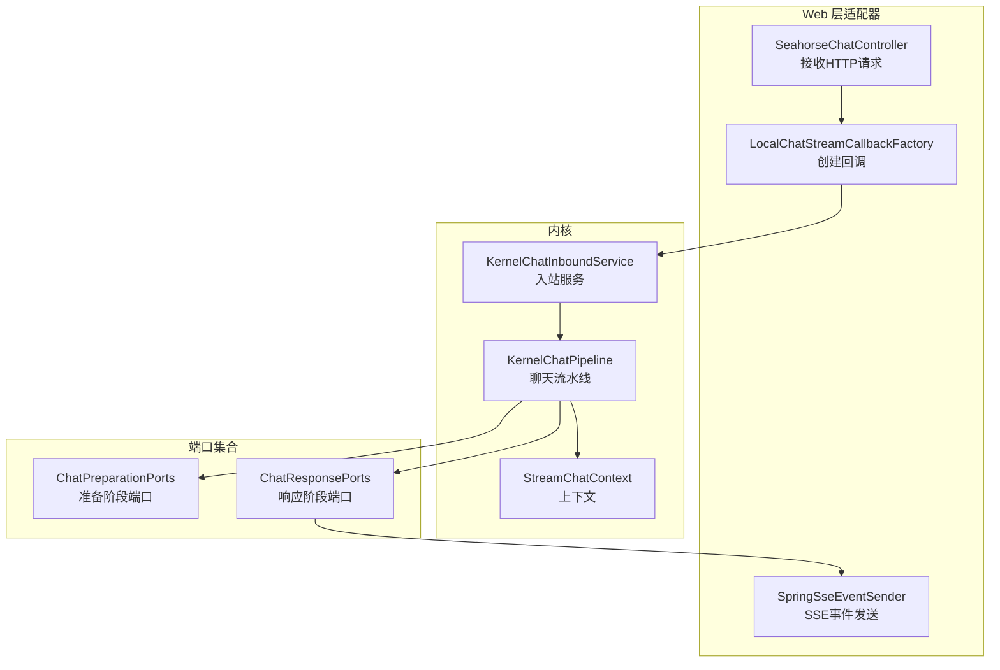
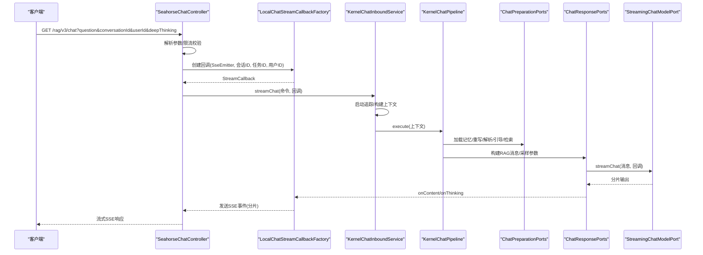
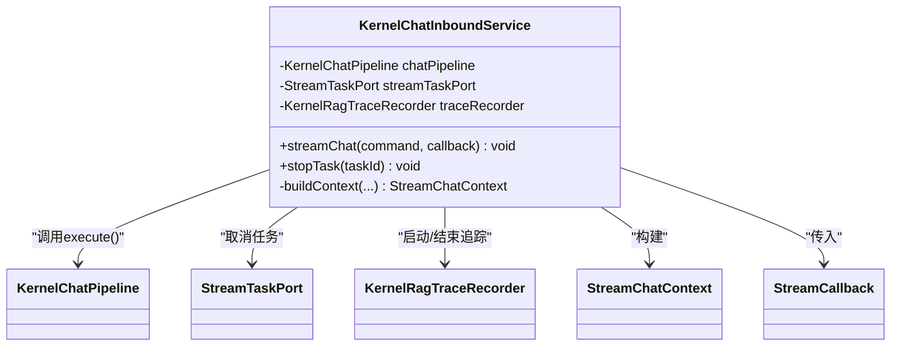
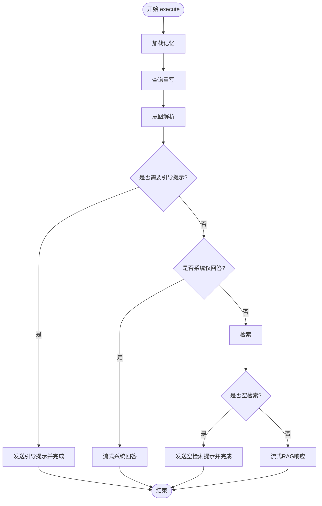
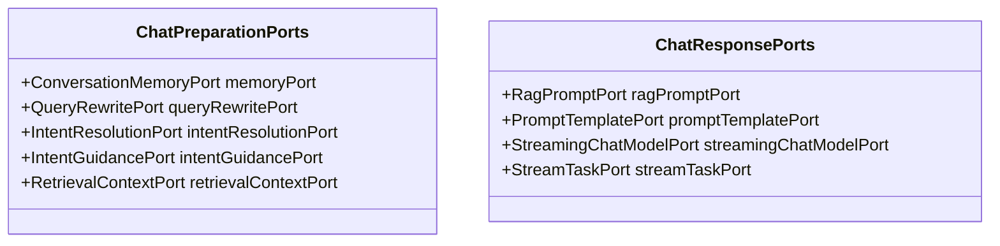
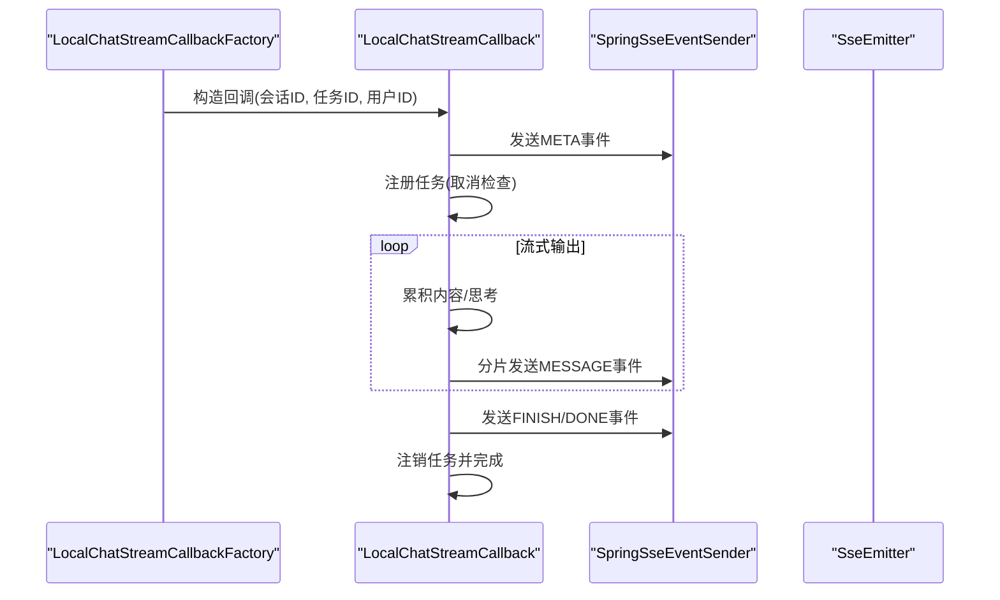
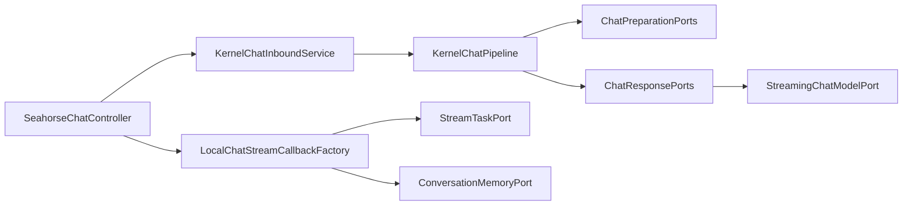

# 聊天应用服务

<cite>
**本文引用的文件**
- [KernelChatInboundService.java](file://seahorse-agent-kernel/src/main/java/com/miracle/ai/seahorse/agent/kernel/application/chat/KernelChatInboundService.java)
- [KernelChatPipeline.java](file://seahorse-agent-kernel/src/main/java/com/miracle/ai/seahorse/agent/kernel/application/chat/KernelChatPipeline.java)
- [ChatPreparationPorts.java](file://seahorse-agent-kernel/src/main/java/com/miracle/ai/seahorse/agent/kernel/application/chat/ChatPreparationPorts.java)
- [ChatResponsePorts.java](file://seahorse-agent-kernel/src/main/java/com/miracle/ai/seahorse/agent/kernel/application/chat/ChatResponsePorts.java)
- [StreamCallback.java](file://seahorse-agent-kernel/src/main/java/com/miracle/ai/seahorse/agent/kernel/domain/chat/StreamCallback.java)
- [StreamChatContext.java](file://seahorse-agent-kernel/src/main/java/com/miracle/ai/seahorse/agent/kernel/domain/chat/StreamChatContext.java)
- [ChatInboundPort.java](file://seahorse-agent-kernel/src/main/java/com/miracle/ai/seahorse/agent/ports/inbound/chat/ChatInboundPort.java)
- [StreamChatCommand.java](file://seahorse-agent-kernel/src/main/java/com/miracle/ai/seahorse/agent/ports/inbound/chat/StreamChatCommand.java)
- [SeahorseChatController.java](file://seahorse-agent-adapter-web/src/main/java/com/miracle/ai/seahorse/agent/adapters/web/SeahorseChatController.java)
- [LocalChatStreamCallbackFactory.java](file://seahorse-agent-adapter-web/src/main/java/com/miracle/ai/seahorse/agent/adapters/local/LocalChatStreamCallbackFactory.java)
- [SpringSseEventSender.java](file://seahorse-agent-adapter-web/src/main/java/com/miracle/ai/seahorse/agent/adapters/local/SpringSseEventSender.java)
- [ChatStreamCallbackFactoryPort.java](file://seahorse-agent-adapter-web/src/main/java/com/miracle/ai/seahorse/agent/adapters/web/ChatStreamCallbackFactoryPort.java)
</cite>

## 目录
1. [简介](#简介)
2. [项目结构](#项目结构)
3. [核心组件](#核心组件)
4. [架构总览](#架构总览)
5. [详细组件分析](#详细组件分析)
6. [依赖分析](#依赖分析)
7. [性能考虑](#性能考虑)
8. [故障排查指南](#故障排查指南)
9. [结论](#结论)
10. [附录](#附录)

## 简介
本文件面向聊天应用服务的技术文档，聚焦于 KernelChatInboundService 的核心能力与 KernelChatPipeline 的完整处理链路，涵盖：
- 流式对话处理：从用户输入到实时响应的完整链路
- 多轮对话上下文管理：历史消息加载与合并
- 深度思考模式：通过采样参数控制推理过程
- 聊天准备端口与响应端口：如何解耦不同阶段职责
- 流式响应实现：SSE 事件发送、消息分片、连接管理
- 扩展与自定义：如何在不破坏契约的前提下扩展功能

## 项目结构
聊天服务采用“端口-适配器”架构，核心内核位于 kernel 模块，Web 层适配器位于 adapter-web 模块。关键交互路径如下：
- Web 控制器接收请求，构造命令与回调
- 入站服务将命令与回调封装为上下文，交由内核流水线执行
- 流水线按阶段编排：加载记忆 → 查询重写 → 意图解析 → 引导提示 → 系统仅回答 → 检索 → 空检索处理 → 流式 RAG 响应
- 回调工厂将模型输出转为 SSE 事件，分片推送至前端

图表来源
- [SeahorseChatController.java:83-102](file://seahorse-agent-adapter-web/src/main/java/com/miracle/ai/seahorse/agent/adapters/web/SeahorseChatController.java#L83-L102)
- [LocalChatStreamCallbackFactory.java:56-64](file://seahorse-agent-adapter-web/src/main/java/com/miracle/ai/seahorse/agent/adapters/local/LocalChatStreamCallbackFactory.java#L56-L64)
- [KernelChatInboundService.java:56-73](file://seahorse-agent-kernel/src/main/java/com/miracle/ai/seahorse/agent/kernel/application/chat/KernelChatInboundService.java#L56-L73)
- [KernelChatPipeline.java:83-106](file://seahorse-agent-kernel/src/main/java/com/miracle/ai/seahorse/agent/kernel/application/chat/KernelChatPipeline.java#L83-L106)
- [ChatPreparationPorts.java:31-35](file://seahorse-agent-kernel/src/main/java/com/miracle/ai/seahorse/agent/kernel/application/chat/ChatPreparationPorts.java#L31-L35)
- [ChatResponsePorts.java:30-33](file://seahorse-agent-kernel/src/main/java/com/miracle/ai/seahorse/agent/kernel/application/chat/ChatResponsePorts.java#L30-L33)
- [SpringSseEventSender.java:31-77](file://seahorse-agent-adapter-web/src/main/java/com/miracle/ai/seahorse/agent/adapters/local/SpringSseEventSender.java#L31-L77)

章节来源
- [SeahorseChatController.java:44-133](file://seahorse-agent-adapter-web/src/main/java/com/miracle/ai/seahorse/agent/adapters/web/SeahorseChatController.java#L44-L133)
- [KernelChatInboundService.java:34-94](file://seahorse-agent-kernel/src/main/java/com/miracle/ai/seahorse/agent/kernel/application/chat/KernelChatInboundService.java#L34-L94)
- [KernelChatPipeline.java:52-281](file://seahorse-agent-kernel/src/main/java/com/miracle/ai/seahorse/agent/kernel/application/chat/KernelChatPipeline.java#L52-L281)

## 核心组件
- KernelChatInboundService：L1 应用服务，负责启动追踪、构建上下文、调度流水线、错误处理与任务取消
- KernelChatPipeline：L1 编排器，严格遵循固定顺序的多阶段流水线，支持系统仅回答、空检索提示、流式 RAG 响应
- ChatPreparationPorts：准备阶段端口集合（记忆、查询重写、意图解析、意图引导、检索上下文）
- ChatResponsePorts：响应阶段端口集合（RAG Prompt、Prompt 模板、流式模型、流式任务）
- StreamCallback：统一的流式回调接口，支持内容、思考、完成、错误
- StreamChatContext：流式问答上下文，承载问题、会话、任务、用户、深度思考开关、历史、重写结果、子意图、回调与追踪作用域
- ChatInboundPort/StreamChatCommand：入站端口与命令对象，约束外部调用契约

章节来源
- [KernelChatInboundService.java:34-94](file://seahorse-agent-kernel/src/main/java/com/miracle/ai/seahorse/agent/kernel/application/chat/KernelChatInboundService.java#L34-L94)
- [KernelChatPipeline.java:52-281](file://seahorse-agent-kernel/src/main/java/com/miracle/ai/seahorse/agent/kernel/application/chat/KernelChatPipeline.java#L52-L281)
- [ChatPreparationPorts.java:31-44](file://seahorse-agent-kernel/src/main/java/com/miracle/ai/seahorse/agent/kernel/application/chat/ChatPreparationPorts.java#L31-L44)
- [ChatResponsePorts.java:30-41](file://seahorse-agent-kernel/src/main/java/com/miracle/ai/seahorse/agent/kernel/application/chat/ChatResponsePorts.java#L30-L41)
- [StreamCallback.java:23-33](file://seahorse-agent-kernel/src/main/java/com/miracle/ai/seahorse/agent/kernel/domain/chat/StreamCallback.java#L23-L33)
- [StreamChatContext.java:30-99](file://seahorse-agent-kernel/src/main/java/com/miracle/ai/seahorse/agent/kernel/domain/chat/StreamChatContext.java#L30-L99)
- [ChatInboundPort.java:27-43](file://seahorse-agent-kernel/src/main/java/com/miracle/ai/seahorse/agent/ports/inbound/chat/ChatInboundPort.java#L27-L43)
- [StreamChatCommand.java:25-45](file://seahorse-agent-kernel/src/main/java/com/miracle/ai/seahorse/agent/ports/inbound/chat/StreamChatCommand.java#L25-L45)

## 架构总览
下图展示从 Web 请求到模型流式输出的端到端流程，以及各组件之间的依赖关系。

图表来源
- [SeahorseChatController.java:83-102](file://seahorse-agent-adapter-web/src/main/java/com/miracle/ai/seahorse/agent/adapters/web/SeahorseChatController.java#L83-L102)
- [LocalChatStreamCallbackFactory.java:56-64](file://seahorse-agent-adapter-web/src/main/java/com/miracle/ai/seahorse/agent/adapters/local/LocalChatStreamCallbackFactory.java#L56-L64)
- [KernelChatInboundService.java:56-73](file://seahorse-agent-kernel/src/main/java/com/miracle/ai/seahorse/agent/kernel/application/chat/KernelChatInboundService.java#L56-L73)
- [KernelChatPipeline.java:83-106](file://seahorse-agent-kernel/src/main/java/com/miracle/ai/seahorse/agent/kernel/application/chat/KernelChatPipeline.java#L83-L106)
- [ChatPreparationPorts.java:31-35](file://seahorse-agent-kernel/src/main/java/com/miracle/ai/seahorse/agent/kernel/application/chat/ChatPreparationPorts.java#L31-L35)
- [ChatResponsePorts.java:30-33](file://seahorse-agent-kernel/src/main/java/com/miracle/ai/seahorse/agent/kernel/application/chat/ChatResponsePorts.java#L30-L33)

## 详细组件分析

### KernelChatInboundService 组件分析
- 职责
  - 接收外部命令与回调，启动追踪，构建上下文，调用流水线执行
  - 提供任务取消能力，委托给流式任务端口
  - 统一异常处理，确保回调 onError 被调用
- 关键点
  - 上下文构建使用 builder 模式，保证可读性与可扩展性
  - 追踪入口名与方法名固定，便于可观测性
  - 对空值进行严格校验，避免运行时异常

图表来源
- [KernelChatInboundService.java:34-94](file://seahorse-agent-kernel/src/main/java/com/miracle/ai/seahorse/agent/kernel/application/chat/KernelChatInboundService.java#L34-L94)
- [KernelChatPipeline.java:52-76](file://seahorse-agent-kernel/src/main/java/com/miracle/ai/seahorse/agent/kernel/application/chat/KernelChatPipeline.java#L52-L76)

章节来源
- [KernelChatInboundService.java:34-94](file://seahorse-agent-kernel/src/main/java/com/miracle/ai/seahorse/agent/kernel/application/chat/KernelChatInboundService.java#L34-L94)

### KernelChatPipeline 组件分析
- 职责
  - 严格按顺序执行多阶段编排：加载记忆 → 查询重写 → 意图解析 → 引导提示 → 系统仅回答 → 检索 → 空检索处理 → 流式 RAG 响应
  - 根据检索上下文动态选择温度与 topP 参数
  - 将任务句柄绑定到任务端口，支持取消
- 关键点
  - 使用追踪记录每个阶段耗时与失败
  - 系统仅回答场景直接走系统提示模板，绕过检索
  - 空检索时返回预置提示，避免无意义输出
  - 深度思考模式通过采样参数传递给模型

图表来源
- [KernelChatPipeline.java:83-106](file://seahorse-agent-kernel/src/main/java/com/miracle/ai/seahorse/agent/kernel/application/chat/KernelChatPipeline.java#L83-L106)
- [KernelChatPipeline.java:129-140](file://seahorse-agent-kernel/src/main/java/com/miracle/ai/seahorse/agent/kernel/application/chat/KernelChatPipeline.java#L129-L140)
- [KernelChatPipeline.java:142-151](file://seahorse-agent-kernel/src/main/java/com/miracle/ai/seahorse/agent/kernel/application/chat/KernelChatPipeline.java#L142-L151)
- [KernelChatPipeline.java:157-165](file://seahorse-agent-kernel/src/main/java/com/miracle/ai/seahorse/agent/kernel/application/chat/KernelChatPipeline.java#L157-L165)
- [KernelChatPipeline.java:167-173](file://seahorse-agent-kernel/src/main/java/com/miracle/ai/seahorse/agent/kernel/application/chat/KernelChatPipeline.java#L167-L173)

章节来源
- [KernelChatPipeline.java:52-281](file://seahorse-agent-kernel/src/main/java/com/miracle/ai/seahorse/agent/kernel/application/chat/KernelChatPipeline.java#L52-L281)

### 聊天准备端口与响应端口设计
- 准备端口集合
  - ConversationMemoryPort：加载并追加历史消息
  - QueryRewritePort：对问题与历史进行重写与拆分
  - IntentResolutionPort：解析子意图并判断系统仅回答
  - IntentGuidancePort：检测歧义并给出引导提示
  - RetrievalContextPort：检索上下文（MCP/Knowledge Base）
- 响应端口集合
  - RagPromptPort：构建结构化消息
  - PromptTemplatePort：加载系统提示模板
  - StreamingChatModelPort：流式模型调用
  - StreamTaskPort：任务注册、取消、注销

图表来源
- [ChatPreparationPorts.java:31-44](file://seahorse-agent-kernel/src/main/java/com/miracle/ai/seahorse/agent/kernel/application/chat/ChatPreparationPorts.java#L31-L44)
- [ChatResponsePorts.java:30-41](file://seahorse-agent-kernel/src/main/java/com/miracle/ai/seahorse/agent/kernel/application/chat/ChatResponsePorts.java#L30-L41)

章节来源
- [ChatPreparationPorts.java:28-44](file://seahorse-agent-kernel/src/main/java/com/miracle/ai/seahorse/agent/kernel/application/chat/ChatPreparationPorts.java#L28-L44)
- [ChatResponsePorts.java:27-41](file://seahorse-agent-kernel/src/main/java/com/miracle/ai/seahorse/agent/kernel/application/chat/ChatResponsePorts.java#L27-L41)

### 流式响应实现细节（SSE）
- 回调工厂
  - LocalChatStreamCallbackFactory：创建本地回调，负责初始化元数据、注册任务、分片发送、完成与错误处理
  - 默认消息分片大小为固定窗口，逐字符聚合后发送
- SSE 事件发送
  - SpringSseEventSender：封装 SseEmitter，处理完成、超时、错误与幂等关闭
  - 事件类型：META（会话与任务元信息）、MESSAGE（分片内容，区分 think/response）、FINISH（完成标记）、DONE（结束标记）
- 连接管理
  - 初始化时发送 META 事件
  - 注册任务句柄，支持取消与注销
  - 完成或错误时清理资源并关闭连接

图表来源
- [LocalChatStreamCallbackFactory.java:56-64](file://seahorse-agent-adapter-web/src/main/java/com/miracle/ai/seahorse/agent/adapters/local/LocalChatStreamCallbackFactory.java#L56-L64)
- [LocalChatStreamCallbackFactory.java:131-142](file://seahorse-agent-adapter-web/src/main/java/com/miracle/ai/seahorse/agent/adapters/local/LocalChatStreamCallbackFactory.java#L131-L142)
- [LocalChatStreamCallbackFactory.java:144-167](file://seahorse-agent-adapter-web/src/main/java/com/miracle/ai/seahorse/agent/adapters/local/LocalChatStreamCallbackFactory.java#L144-L167)
- [SpringSseEventSender.java:44-76](file://seahorse-agent-adapter-web/src/main/java/com/miracle/ai/seahorse/agent/adapters/local/SpringSseEventSender.java#L44-L76)

章节来源
- [LocalChatStreamCallbackFactory.java:37-174](file://seahorse-agent-adapter-web/src/main/java/com/miracle/ai/seahorse/agent/adapters/local/LocalChatStreamCallbackFactory.java#L37-L174)
- [SpringSseEventSender.java:31-78](file://seahorse-agent-adapter-web/src/main/java/com/miracle/ai/seahorse/agent/adapters/local/SpringSseEventSender.java#L31-L78)
- [ChatStreamCallbackFactoryPort.java:26-33](file://seahorse-agent-adapter-web/src/main/java/com/miracle/ai/seahorse/agent/adapters/web/ChatStreamCallbackFactoryPort.java#L26-L33)

### 深度思考模式实现
- 触发方式：通过命令对象 deepThinking 字段开启
- 传递路径：入站服务构建上下文 → 流水线将 deepThinking 传入采样选项 → 流式模型据此调整推理策略
- 效果：提升模型推理稳定性与准确性，适合复杂问题

章节来源
- [StreamChatCommand.java:25-30](file://seahorse-agent-kernel/src/main/java/com/miracle/ai/seahorse/agent/ports/inbound/chat/StreamChatCommand.java#L25-L30)
- [KernelChatInboundService.java:80-92](file://seahorse-agent-kernel/src/main/java/com/miracle/ai/seahorse/agent/kernel/application/chat/KernelChatInboundService.java#L80-L92)
- [KernelChatPipeline.java:229-235](file://seahorse-agent-kernel/src/main/java/com/miracle/ai/seahorse/agent/kernel/application/chat/KernelChatPipeline.java#L229-L235)

### 多轮对话上下文管理
- 历史加载：准备阶段通过记忆端口加载历史并追加当前用户问题
- 上下文注入：流水线将历史与重写后的问句组合为结构化消息
- 记忆持久化：完成时将助手回复与思考内容追加到记忆端口（条件满足）

章节来源
- [KernelChatPipeline.java:108-115](file://seahorse-agent-kernel/src/main/java/com/miracle/ai/seahorse/agent/kernel/application/chat/KernelChatPipeline.java#L108-L115)
- [KernelChatPipeline.java:221-226](file://seahorse-agent-kernel/src/main/java/com/miracle/ai/seahorse/agent/kernel/application/chat/KernelChatPipeline.java#L221-L226)
- [LocalChatStreamCallbackFactory.java:136-142](file://seahorse-agent-adapter-web/src/main/java/com/miracle/ai/seahorse/agent/adapters/local/LocalChatStreamCallbackFactory.java#L136-L142)

### 聊天准备端口与响应端口的参数配置
- Web 控制器
  - 支持 deepThinking 查询参数，用于开启深度思考模式
  - 会话 ID 为空时自动生成
  - 用户 ID 为空时使用默认值
  - SSE 超时时间、速率限制参数可通过配置注入
- 回调工厂
  - 任务注册与取消检查贯穿整个生命周期
  - 分片大小可调，影响前端渲染体验与网络负载

章节来源
- [SeahorseChatController.java:83-102](file://seahorse-agent-adapter-web/src/main/java/com/miracle/ai/seahorse/agent/adapters/web/SeahorseChatController.java#L83-L102)
- [SeahorseChatController.java:118-131](file://seahorse-agent-adapter-web/src/main/java/com/miracle/ai/seahorse/agent/adapters/web/SeahorseChatController.java#L118-L131)
- [LocalChatStreamCallbackFactory.java:131-134](file://seahorse-agent-adapter-web/src/main/java/com/miracle/ai/seahorse/agent/adapters/local/LocalChatStreamCallbackFactory.java#L131-L134)
- [LocalChatStreamCallbackFactory.java:144-167](file://seahorse-agent-adapter-web/src/main/java/com/miracle/ai/seahorse/agent/adapters/local/LocalChatStreamCallbackFactory.java#L144-L167)

## 依赖分析
- 组件耦合
  - KernelChatInboundService 依赖 KernelChatPipeline 与 StreamTaskPort
  - KernelChatPipeline 依赖 ChatPreparationPorts 与 ChatResponsePorts
  - Web 控制器依赖 ChatInboundPort 与 ChatStreamCallbackFactoryPort
  - 回调工厂依赖 StreamTaskPort 与 ConversationMemoryPort
- 外部集成
  - Spring MVC/SSE：SseEmitter 作为事件载体
  - 流式模型端口：抽象出具体模型实现，便于替换

图表来源
- [SeahorseChatController.java:48-81](file://seahorse-agent-adapter-web/src/main/java/com/miracle/ai/seahorse/agent/adapters/web/SeahorseChatController.java#L48-L81)
- [KernelChatInboundService.java:40-54](file://seahorse-agent-kernel/src/main/java/com/miracle/ai/seahorse/agent/kernel/application/chat/KernelChatInboundService.java#L40-L54)
- [KernelChatPipeline.java:62-76](file://seahorse-agent-kernel/src/main/java/com/miracle/ai/seahorse/agent/kernel/application/chat/KernelChatPipeline.java#L62-L76)
- [ChatPreparationPorts.java:31-35](file://seahorse-agent-kernel/src/main/java/com/miracle/ai/seahorse/agent/kernel/application/chat/ChatPreparationPorts.java#L31-L35)
- [ChatResponsePorts.java:30-33](file://seahorse-agent-kernel/src/main/java/com/miracle/ai/seahorse/agent/kernel/application/chat/ChatResponsePorts.java#L30-L33)
- [LocalChatStreamCallbackFactory.java:47-54](file://seahorse-agent-adapter-web/src/main/java/com/miracle/ai/seahorse/agent/adapters/local/LocalChatStreamCallbackFactory.java#L47-L54)

章节来源
- [SeahorseChatController.java:44-81](file://seahorse-agent-adapter-web/src/main/java/com/miracle/ai/seahorse/agent/adapters/web/SeahorseChatController.java#L44-L81)
- [KernelChatInboundService.java:40-54](file://seahorse-agent-kernel/src/main/java/com/miracle/ai/seahorse/agent/kernel/application/chat/KernelChatInboundService.java#L40-L54)
- [KernelChatPipeline.java:62-76](file://seahorse-agent-kernel/src/main/java/com/miracle/ai/seahorse/agent/kernel/application/chat/KernelChatPipeline.java#L62-L76)

## 性能考虑
- 分片策略：合理设置分片大小，在延迟与带宽之间平衡
- 追踪开销：阶段化追踪有助于定位瓶颈，但需注意额外开销
- 任务取消：及时检查取消状态，避免无效输出
- 速率限制：结合用户维度限流，防止突发流量冲击
- 温度与 topP：根据检索来源自动选择参数，减少人工调参成本

## 故障排查指南
- SSE 连接异常
  - 检查超时配置与网络状况
  - 确认回调工厂已正确注册任务并发送 META 事件
- 流式输出中断
  - 核查任务是否被提前取消
  - 检查模型端口是否抛出异常并触发 onError
- 空检索提示
  - 确认检索上下文是否为空
  - 检查意图解析与检索逻辑是否正常
- 深度思考无效
  - 确认命令对象 deepThinking 已正确传入
  - 检查采样参数是否被正确应用

章节来源
- [SpringSseEventSender.java:44-76](file://seahorse-agent-adapter-web/src/main/java/com/miracle/ai/seahorse/agent/adapters/local/SpringSseEventSender.java#L44-L76)
- [LocalChatStreamCallbackFactory.java:122-129](file://seahorse-agent-adapter-web/src/main/java/com/miracle/ai/seahorse/agent/adapters/local/LocalChatStreamCallbackFactory.java#L122-L129)
- [KernelChatPipeline.java:157-165](file://seahorse-agent-kernel/src/main/java/com/miracle/ai/seahorse/agent/kernel/application/chat/KernelChatPipeline.java#L157-L165)
- [KernelChatPipeline.java:229-235](file://seahorse-agent-kernel/src/main/java/com/miracle/ai/seahorse/agent/kernel/application/chat/KernelChatPipeline.java#L229-L235)

## 结论
本聊天应用服务以 KernelChatPipeline 为核心，通过清晰的阶段化编排与端口抽象，实现了从用户输入到流式响应的完整闭环。配合 Web 层的 SSE 实现与回调工厂的分片策略，既保证了用户体验，又具备良好的可扩展性。通过深度思考模式、系统仅回答、空检索提示等机制，能够覆盖多样化的业务场景。

## 附录
- 使用场景建议
  - 复杂问答：启用深度思考模式，提升推理质量
  - 快速问答：关闭深度思考，降低延迟
  - 引导式问答：利用意图引导端口，减少歧义
- 扩展与自定义
  - 新增准备/响应阶段：在对应端口集合中注入新实现
  - 自定义流式模型：实现 StreamingChatModelPort 并接入适配器
  - 自定义分片策略：调整回调工厂中的分片大小与事件类型
- 配置项参考
  - SSE 超时：seahorse-agent.web.sse-timeout-ms
  - 聊天速率限制：permits 与 window-ms