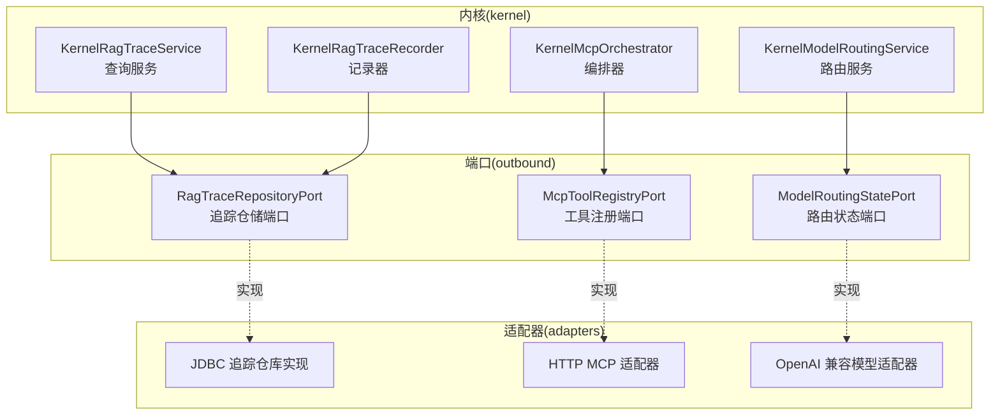
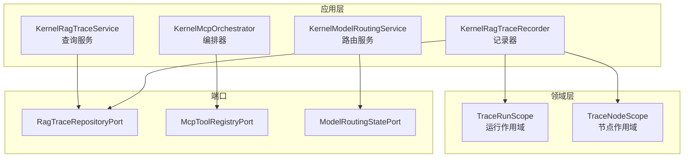
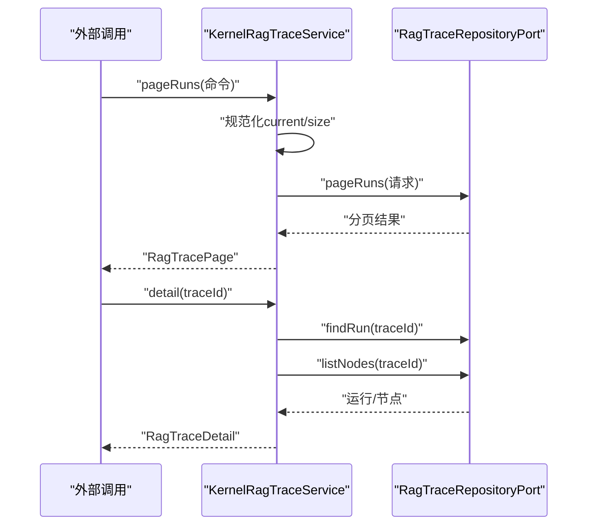
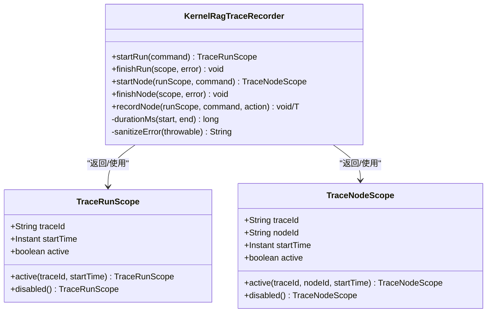
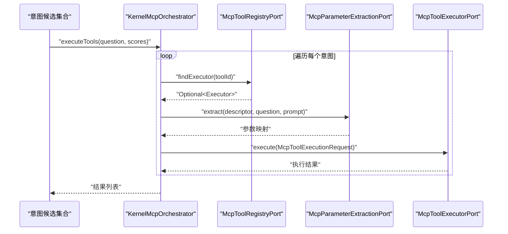
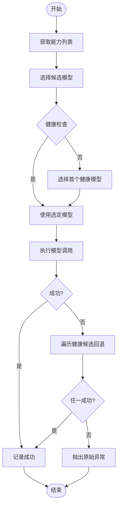
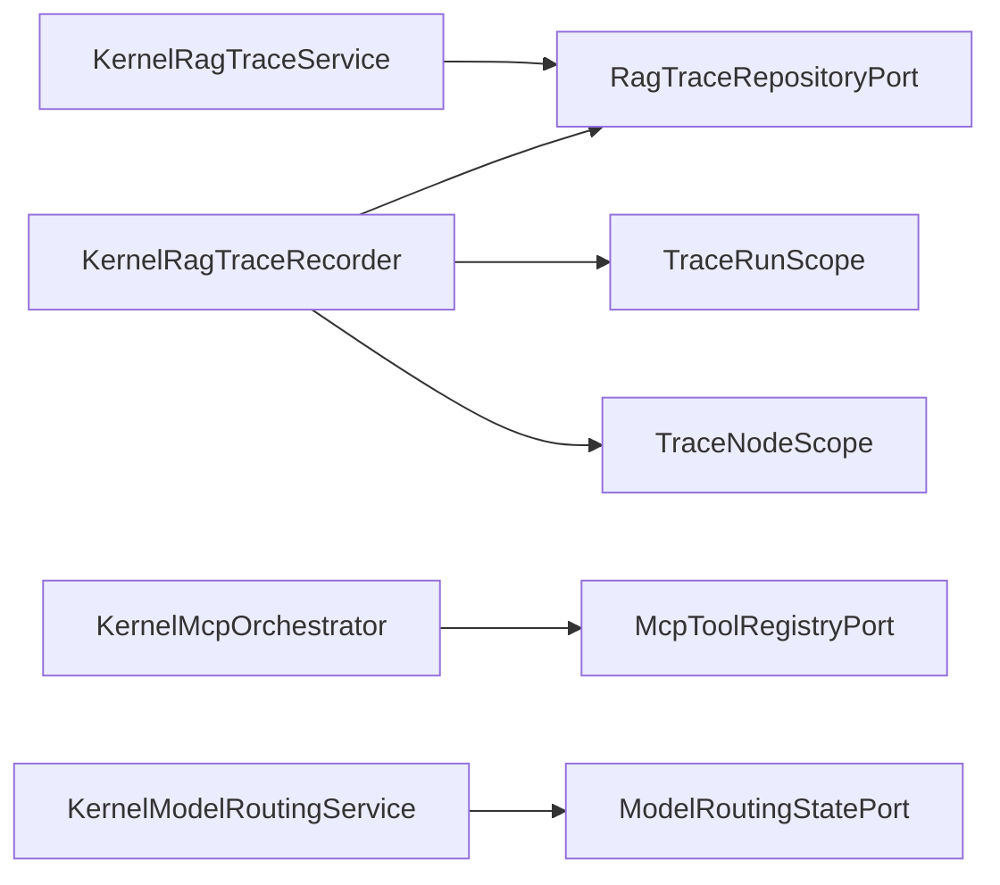

# 追踪、MCP和模型服务

<cite>
**本文引用的文件**
- [KernelRagTraceService.java](file://seahorse-agent-kernel/src/main/java/com/miracle/ai/seahorse/agent/kernel/application/trace/KernelRagTraceService.java)
- [KernelRagTraceRecorder.java](file://seahorse-agent-kernel/src/main/java/com/miracle/ai/seahorse/agent/kernel/application/trace/KernelRagTraceRecorder.java)
- [TraceRunScope.java](file://seahorse-agent-kernel/src/main/java/com/miracle/ai/seahorse/agent/kernel/domain/trace/TraceRunScope.java)
- [TraceNodeScope.java](file://seahorse-agent-kernel/src/main/java/com/miracle/ai/seahorse/agent/kernel/domain/trace/TraceNodeScope.java)
- [RagTraceRepositoryPort.java](file://seahorse-agent-kernel/src/main/java/com/miracle/ai/seahorse/agent/ports/outbound/trace/RagTraceRepositoryPort.java)
- [KernelMcpOrchestrator.java](file://seahorse-agent-kernel/src/main/java/com/miracle/ai/seahorse/agent/kernel/application/mcp/KernelMcpOrchestrator.java)
- [McpToolExecutionRequest.java](file://seahorse-agent-kernel/src/main/java/com/miracle/ai/seahorse/agent/kernel/feature/mcp/McpToolExecutionRequest.java)
- [McpToolExecutionResult.java](file://seahorse-agent-kernel/src/main/java/com/miracle/ai/seahorse/agent/kernel/feature/mcp/McpToolExecutionResult.java)
- [McpToolExecutionStatus.java](file://seahorse-agent-kernel/src/main/java/com/miracle/ai/seahorse/agent/kernel/feature/mcp/McpToolExecutionStatus.java)
- [McpToolRegistryPort.java](file://seahorse-agent-kernel/src/main/java/com/miracle/ai/seahorse/agent/ports/outbound/mcp/McpToolRegistryPort.java)
- [KernelModelRoutingService.java](file://seahorse-agent-kernel/src/main/java/com/miracle/ai/seahorse/agent/kernel/application/model/KernelModelRoutingService.java)
- [ModelRoutingStatePort.java](file://seahorse-agent-kernel/src/main/java/com/miracle/ai/seahorse/agent/ports/outbound/model/ModelRoutingStatePort.java)
- [ragTraceService.ts](file://frontend/src/services/ragTraceService.ts)
</cite>

## 目录
1. [简介](#简介)
2. [项目结构](#项目结构)
3. [核心组件](#核心组件)
4. [架构总览](#架构总览)
5. [详细组件分析](#详细组件分析)
6. [依赖分析](#依赖分析)
7. [性能考虑](#性能考虑)
8. [故障排查指南](#故障排查指南)
9. [结论](#结论)
10. [附录](#附录)

## 简介
本文件聚焦于系统中三条关键链路：RAG追踪（KernelRagTraceService 与 KernelRagTraceRecorder）、MCP工具编排（KernelMcpOrchestrator）以及模型路由（KernelModelRoutingService）。文档从架构设计、数据流、处理逻辑、集成点到错误处理与性能特性进行深入解析，并提供系统监控与调试的最佳实践。

## 项目结构
本项目采用分层与端口适配器模式组织内核与适配器模块。追踪、MCP与模型路由分别位于内核(kernel)应用层与领域层之间，通过端口对接不同适配器实现数据库、消息队列、观察度量、向量存储等基础设施能力。

图表来源
- [KernelRagTraceService.java:35-82](file://seahorse-agent-kernel/src/main/java/com/miracle/ai/seahorse/agent/kernel/application/trace/KernelRagTraceService.java#L35-L82)
- [KernelRagTraceRecorder.java:41-110](file://seahorse-agent-kernel/src/main/java/com/miracle/ai/seahorse/agent/kernel/application/trace/KernelRagTraceRecorder.java#L41-L110)
- [RagTraceRepositoryPort.java:28-43](file://seahorse-agent-kernel/src/main/java/com/miracle/ai/seahorse/agent/ports/outbound/trace/RagTraceRepositoryPort.java#L28-L43)
- [KernelMcpOrchestrator.java:45-136](file://seahorse-agent-kernel/src/main/java/com/miracle/ai/seahorse/agent/kernel/application/mcp/KernelMcpOrchestrator.java#L45-L136)
- [McpToolRegistryPort.java:27-55](file://seahorse-agent-kernel/src/main/java/com/miracle/ai/seahorse/agent/ports/outbound/mcp/McpToolRegistryPort.java#L27-L55)
- [KernelModelRoutingService.java:41-184](file://seahorse-agent-kernel/src/main/java/com/miracle/ai/seahorse/agent/kernel/application/model/KernelModelRoutingService.java#L41-L184)
- [ModelRoutingStatePort.java:28-44](file://seahorse-agent-kernel/src/main/java/com/miracle/ai/seahorse/agent/ports/outbound/model/ModelRoutingStatePort.java#L28-L44)

章节来源
- [KernelRagTraceService.java:35-82](file://seahorse-agent-kernel/src/main/java/com/miracle/ai/seahorse/agent/kernel/application/trace/KernelRagTraceService.java#L35-L82)
- [KernelRagTraceRecorder.java:41-110](file://seahorse-agent-kernel/src/main/java/com/miracle/ai/seahorse/agent/kernel/application/trace/KernelRagTraceRecorder.java#L41-L110)
- [KernelMcpOrchestrator.java:45-136](file://seahorse-agent-kernel/src/main/java/com/miracle/ai/seahorse/agent/kernel/application/mcp/KernelMcpOrchestrator.java#L45-L136)
- [KernelModelRoutingService.java:41-184](file://seahorse-agent-kernel/src/main/java/com/miracle/ai/seahorse/agent/kernel/application/model/KernelModelRoutingService.java#L41-L184)

## 核心组件
- RAG追踪服务：提供分页查询运行记录、详情与节点列表，统一入口封装查询命令与分页参数规范化。
- 追踪记录器：在运行与节点两个粒度上开启/结束生命周期，记录状态、耗时、错误信息；支持“无痕降级”以保证业务可用性。
- MCP编排器：基于意图候选并发执行工具，参数抽取与执行异常安全包装，返回标准化结果。
- 模型路由服务：根据能力与健康状态选择模型，支持同步聊天、流式聊天、嵌入、重排序与令牌计数；具备失败回退与健康上报。

章节来源
- [KernelRagTraceService.java:35-82](file://seahorse-agent-kernel/src/main/java/com/miracle/ai/seahorse/agent/kernel/application/trace/KernelRagTraceService.java#L35-L82)
- [KernelRagTraceRecorder.java:41-211](file://seahorse-agent-kernel/src/main/java/com/miracle/ai/seahorse/agent/kernel/application/trace/KernelRagTraceRecorder.java#L41-L211)
- [KernelMcpOrchestrator.java:45-136](file://seahorse-agent-kernel/src/main/java/com/miracle/ai/seahorse/agent/kernel/application/mcp/KernelMcpOrchestrator.java#L45-L136)
- [KernelModelRoutingService.java:41-184](file://seahorse-agent-kernel/src/main/java/com/miracle/ai/seahorse/agent/kernel/application/model/KernelModelRoutingService.java#L41-L184)

## 架构总览
下图展示追踪、MCP与模型路由三者在内核中的交互关系与职责边界：

图表来源
- [KernelRagTraceService.java:35-82](file://seahorse-agent-kernel/src/main/java/com/miracle/ai/seahorse/agent/kernel/application/trace/KernelRagTraceService.java#L35-L82)
- [KernelRagTraceRecorder.java:41-211](file://seahorse-agent-kernel/src/main/java/com/miracle/ai/seahorse/agent/kernel/application/trace/KernelRagTraceRecorder.java#L41-L211)
- [TraceRunScope.java:25-36](file://seahorse-agent-kernel/src/main/java/com/miracle/ai/seahorse/agent/kernel/domain/trace/TraceRunScope.java#L25-L36)
- [TraceNodeScope.java:25-37](file://seahorse-agent-kernel/src/main/java/com/miracle/ai/seahorse/agent/kernel/domain/trace/TraceNodeScope.java#L25-L37)
- [RagTraceRepositoryPort.java:28-43](file://seahorse-agent-kernel/src/main/java/com/miracle/ai/seahorse/agent/ports/outbound/trace/RagTraceRepositoryPort.java#L28-L43)
- [McpToolRegistryPort.java:27-55](file://seahorse-agent-kernel/src/main/java/com/miracle/ai/seahorse/agent/ports/outbound/mcp/McpToolRegistryPort.java#L27-L55)
- [ModelRoutingStatePort.java:28-44](file://seahorse-agent-kernel/src/main/java/com/miracle/ai/seahorse/agent/ports/outbound/model/ModelRoutingStatePort.java#L28-L44)

## 详细组件分析

### RAG追踪服务（KernelRagTraceService）
- 职责：对外提供RAG运行记录的分页查询、详情聚合与节点列表读取。
- 关键点：
  - 分页参数规范化：默认页码与大小、最大页大小限制，避免超大请求。
  - 细节聚合：运行记录与节点列表组合为详情对象。
  - 仓储解耦：通过RagTraceRepositoryPort屏蔽具体持久化实现。

图表来源
- [KernelRagTraceService.java:47-70](file://seahorse-agent-kernel/src/main/java/com/miracle/ai/seahorse/agent/kernel/application/trace/KernelRagTraceService.java#L47-L70)
- [RagTraceRepositoryPort.java:30-34](file://seahorse-agent-kernel/src/main/java/com/miracle/ai/seahorse/agent/ports/outbound/trace/RagTraceRepositoryPort.java#L30-L34)

章节来源
- [KernelRagTraceService.java:35-82](file://seahorse-agent-kernel/src/main/java/com/miracle/ai/seahorse/agent/kernel/application/trace/KernelRagTraceService.java#L35-L82)
- [RagTraceRepositoryPort.java:28-43](file://seahorse-agent-kernel/src/main/java/com/miracle/ai/seahorse/agent/ports/outbound/trace/RagTraceRepositoryPort.java#L28-L43)

### 追踪记录器（KernelRagTraceRecorder）
- 职责：在运行与节点两个维度开启/结束生命周期，记录状态、耗时与错误摘要；支持“禁用模式”与异常降级。
- 关键点：
  - 生命周期句柄：TraceRunScope/TraceNodeScope封装traceId、nodeId、起止时间与激活状态。
  - 安全记录：启动/结束阶段捕获运行时异常并告警，不中断业务主流程。
  - 错误摘要：截断过长错误信息，避免日志污染。
  - 无痕降级：当记录失败或追踪禁用时，返回disabled作用域，业务透明。

图表来源
- [TraceRunScope.java:25-36](file://seahorse-agent-kernel/src/main/java/com/miracle/ai/seahorse/agent/kernel/domain/trace/TraceRunScope.java#L25-L36)
- [TraceNodeScope.java:25-37](file://seahorse-agent-kernel/src/main/java/com/miracle/ai/seahorse/agent/kernel/domain/trace/TraceNodeScope.java#L25-L37)
- [KernelRagTraceRecorder.java:66-185](file://seahorse-agent-kernel/src/main/java/com/miracle/ai/seahorse/agent/kernel/application/trace/KernelRagTraceRecorder.java#L66-L185)

章节来源
- [KernelRagTraceRecorder.java:41-211](file://seahorse-agent-kernel/src/main/java/com/miracle/ai/seahorse/agent/kernel/application/trace/KernelRagTraceRecorder.java#L41-L211)
- [TraceRunScope.java:25-36](file://seahorse-agent-kernel/src/main/java/com/miracle/ai/seahorse/agent/kernel/domain/trace/TraceRunScope.java#L25-L36)
- [TraceNodeScope.java:25-37](file://seahorse-agent-kernel/src/main/java/com/miracle/ai/seahorse/agent/kernel/domain/trace/TraceNodeScope.java#L25-L37)

### MCP编排器（KernelMcpOrchestrator）
- 职责：根据意图候选并发执行工具，完成参数抽取、异常安全执行与结果聚合。
- 关键点：
  - 工具发现：通过McpToolRegistryPort查找执行器与元数据。
  - 参数抽取：委托McpParameterExtractionPort从问题与模板中提取参数，失败时降级为空参数。
  - 并发执行：使用自定义线程池并发触发多个意图工具，收集结果并过滤空值。
  - 异常安全：执行异常包装为失败结果，避免影响主流程。

图表来源
- [KernelMcpOrchestrator.java:72-135](file://seahorse-agent-kernel/src/main/java/com/miracle/ai/seahorse/agent/kernel/application/mcp/KernelMcpOrchestrator.java#L72-L135)
- [McpToolRegistryPort.java:35-45](file://seahorse-agent-kernel/src/main/java/com/miracle/ai/seahorse/agent/ports/outbound/mcp/McpToolRegistryPort.java#L35-L45)
- [McpToolExecutionRequest.java:31-46](file://seahorse-agent-kernel/src/main/java/com/miracle/ai/seahorse/agent/kernel/feature/mcp/McpToolExecutionRequest.java#L31-L46)
- [McpToolExecutionResult.java:33-94](file://seahorse-agent-kernel/src/main/java/com/miracle/ai/seahorse/agent/kernel/feature/mcp/McpToolExecutionResult.java#L33-L94)

章节来源
- [KernelMcpOrchestrator.java:45-136](file://seahorse-agent-kernel/src/main/java/com/miracle/ai/seahorse/agent/kernel/application/mcp/KernelMcpOrchestrator.java#L45-L136)
- [McpToolRegistryPort.java:27-55](file://seahorse-agent-kernel/src/main/java/com/miracle/ai/seahorse/agent/ports/outbound/mcp/McpToolRegistryPort.java#L27-L55)
- [McpToolExecutionRequest.java:31-46](file://seahorse-agent-kernel/src/main/java/com/miracle/ai/seahorse/agent/kernel/feature/mcp/McpToolExecutionRequest.java#L31-L46)
- [McpToolExecutionResult.java:33-94](file://seahorse-agent-kernel/src/main/java/com/miracle/ai/seahorse/agent/kernel/feature/mcp/McpToolExecutionResult.java#L33-L94)

### 模型路由服务（KernelModelRoutingService）
- 职责：根据能力（聊天、流式聊天、嵌入、重排序）与健康状态选择模型，提供令牌计数与回退机制。
- 关键点：
  - 能力枚举：统一标识chat/streaming_chat/embedding/rerank。
  - 健康选择：优先使用请求模型，否则选择健康候选；若都不健康则回退到首个可用。
  - 回退策略：失败时遍历健康候选逐一尝试，记录每次成功/失败，最终抛出原始异常或返回回退结果。
  - 令牌计数：支持文本与消息两种计数方式，便于上下文裁剪与成本控制。

图表来源
- [KernelModelRoutingService.java:90-183](file://seahorse-agent-kernel/src/main/java/com/miracle/ai/seahorse/agent/kernel/application/model/KernelModelRoutingService.java#L90-L183)
- [ModelRoutingStatePort.java:30-43](file://seahorse-agent-kernel/src/main/java/com/miracle/ai/seahorse/agent/ports/outbound/model/ModelRoutingStatePort.java#L30-L43)

章节来源
- [KernelModelRoutingService.java:41-184](file://seahorse-agent-kernel/src/main/java/com/miracle/ai/seahorse/agent/kernel/application/model/KernelModelRoutingService.java#L41-L184)
- [ModelRoutingStatePort.java:28-44](file://seahorse-agent-kernel/src/main/java/com/miracle/ai/seahorse/agent/ports/outbound/model/ModelRoutingStatePort.java#L28-L44)

## 依赖分析
- 追踪服务依赖RagTraceRepositoryPort进行持久化操作，查询命令经规范化后传入仓储。
- 追踪记录器依赖RagTraceRepositoryPort写入运行与节点的生命周期事件，同时依赖TraceRunScope/TraceNodeScope管理作用域。
- MCP编排器依赖McpToolRegistryPort查找执行器，参数抽取依赖McpParameterExtractionPort，执行结果统一为McpToolExecutionResult。
- 模型路由服务依赖多端口：Chat/Streaming Chat、Embedding、Rerank、Token计数、健康上报与路由状态。

图表来源
- [KernelRagTraceService.java:41-45](file://seahorse-agent-kernel/src/main/java/com/miracle/ai/seahorse/agent/kernel/application/trace/KernelRagTraceService.java#L41-L45)
- [KernelRagTraceRecorder.java:50-60](file://seahorse-agent-kernel/src/main/java/com/miracle/ai/seahorse/agent/kernel/application/trace/KernelRagTraceRecorder.java#L50-L60)
- [KernelMcpOrchestrator.java:49-64](file://seahorse-agent-kernel/src/main/java/com/miracle/ai/seahorse/agent/kernel/application/mcp/KernelMcpOrchestrator.java#L49-L64)
- [KernelModelRoutingService.java:57-88](file://seahorse-agent-kernel/src/main/java/com/miracle/ai/seahorse/agent/kernel/application/model/KernelModelRoutingService.java#L57-L88)

章节来源
- [KernelRagTraceService.java:41-45](file://seahorse-agent-kernel/src/main/java/com/miracle/ai/seahorse/agent/kernel/application/trace/KernelRagTraceService.java#L41-L45)
- [KernelRagTraceRecorder.java:50-60](file://seahorse-agent-kernel/src/main/java/com/miracle/ai/seahorse/agent/kernel/application/trace/KernelRagTraceRecorder.java#L50-L60)
- [KernelMcpOrchestrator.java:49-64](file://seahorse-agent-kernel/src/main/java/com/miracle/ai/seahorse/agent/kernel/application/mcp/KernelMcpOrchestrator.java#L49-L64)
- [KernelModelRoutingService.java:57-88](file://seahorse-agent-kernel/src/main/java/com/miracle/ai/seahorse/agent/kernel/application/model/KernelModelRoutingService.java#L57-L88)

## 性能考虑
- 追踪记录器
  - 无阻塞降级：记录失败仅告警，不阻断主流程，适合高吞吐场景。
  - 错误摘要截断：避免超长错误信息导致日志膨胀与IO开销。
- MCP编排器
  - 并发执行：通过自定义线程池并发触发工具，缩短整体等待时间。
  - 参数抽取降级：抽取失败时以空参数继续，降低单点故障影响。
- 模型路由服务
  - 健康优先：优先使用健康模型，减少失败重试与回退成本。
  - 回退策略：在失败时快速尝试下一个健康候选，提升成功率与响应时间。

## 故障排查指南
- 追踪相关
  - 运行/节点记录失败：查看告警日志，确认RagTraceRepositoryPort实现是否可用；必要时启用禁用模式以排除追踪影响。
  - 详情为空：确认traceId有效且对应运行存在；检查listNodes是否返回节点数据。
- MCP相关
  - 工具未找到：检查McpToolRegistryPort是否正确注册工具；确认意图节点中的工具ID与注册ID一致。
  - 参数抽取失败：检查参数抽取端口实现与提示模板；确认问题文本与模板匹配。
  - 执行异常：查看工具执行器日志；确认网络/鉴权/资源限制等环境因素。
- 模型相关
  - 选择模型为空：检查模型提供端口与健康端口实现；确认候选列表非空。
  - 回退失败：检查各候选模型的健康状态与可用性；确认回退循环逻辑未被短路。

章节来源
- [KernelRagTraceRecorder.java:84-109](file://seahorse-agent-kernel/src/main/java/com/miracle/ai/seahorse/agent/kernel/application/trace/KernelRagTraceRecorder.java#L84-L109)
- [KernelMcpOrchestrator.java:118-135](file://seahorse-agent-kernel/src/main/java/com/miracle/ai/seahorse/agent/kernel/application/mcp/KernelMcpOrchestrator.java#L118-L135)
- [KernelModelRoutingService.java:155-183](file://seahorse-agent-kernel/src/main/java/com/miracle/ai/seahorse/agent/kernel/application/model/KernelModelRoutingService.java#L155-L183)

## 结论
本系统通过清晰的端口抽象与内核应用层组件，实现了可插拔的追踪、MCP编排与模型路由能力。追踪记录器提供稳健的生命周期记录与降级策略；MCP编排器以并发与安全包装提升工具调用效率与稳定性；模型路由服务结合健康状态与回退策略保障推理质量与性能。配合前端追踪查询服务，形成从采集、编排到可视化的完整闭环。

## 附录
- 前端追踪查询服务
  - 提供分页查询运行记录、详情与节点列表的API封装，便于管理后台与前端页面使用。

章节来源
- [ragTraceService.ts:57-79](file://frontend/src/services/ragTraceService.ts#L57-L79)