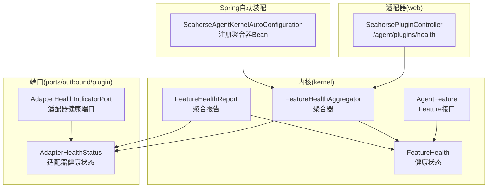
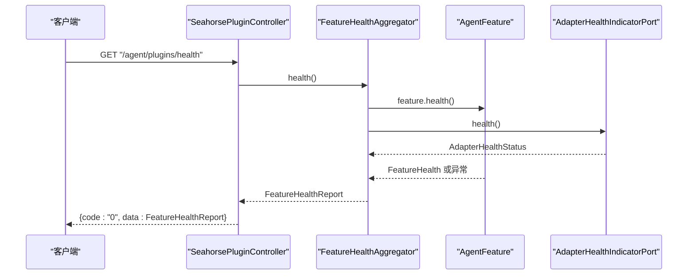
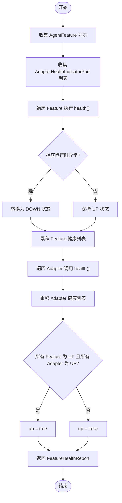
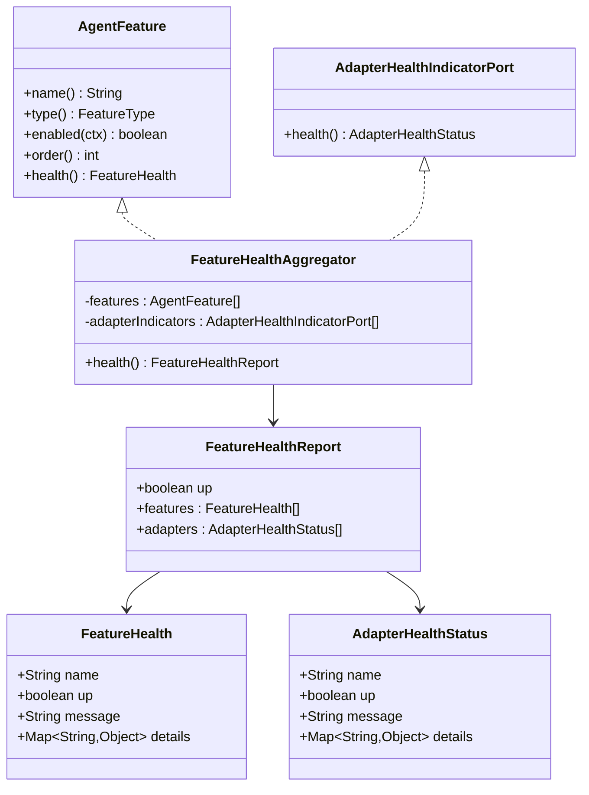

# 健康监控

<cite>
**本文引用的文件**
- [FeatureHealth.java](file://seahorse-agent-kernel/src/main/java/com/miracle/ai/seahorse/agent/kernel/plugin/FeatureHealth.java)
- [FeatureHealthAggregator.java](file://seahorse-agent-kernel/src/main/java/com/miracle/ai/seahorse/agent/kernel/plugin/FeatureHealthAggregator.java)
- [FeatureHealthReport.java](file://seahorse-agent-kernel/src/main/java/com/miracle/ai/seahorse/agent/kernel/plugin/FeatureHealthReport.java)
- [AdapterHealthIndicatorPort.java](file://seahorse-agent-kernel/src/main/java/com/miracle/ai/seahorse/agent/ports/outbound/plugin/AdapterHealthIndicatorPort.java)
- [AdapterHealthStatus.java](file://seahorse-agent-kernel/src/main/java/com/miracle/ai/seahorse/agent/ports/outbound/plugin/AdapterHealthStatus.java)
- [AgentFeature.java](file://seahorse-agent-kernel/src/main/java/com/miracle/ai/seahorse/agent/kernel/plugin/AgentFeature.java)
- [SeahorsePluginController.java](file://seahorse-agent-adapter-web/src/main/java/com/miracle/ai/seahorse/agent/adapters/web/SeahorsePluginController.java)
- [SeahorseAgentKernelAutoConfiguration.java](file://seahorse-agent-spring-boot-starter/src/main/java/com/miracle/ai/seahorse/agent/adapters/spring/SeahorseAgentKernelAutoConfiguration.java)
- [FeatureHealthAggregatorTests.java](file://seahorse-agent-tests/src/test/java/com/miracle/ai/seahorse/agent/kernel/plugin/FeatureHealthAggregatorTests.java)
- [McpHttpAdapterProperties.java](file://seahorse-agent-adapter-mcp-http/src/main/java/com/miracle/ai/seahorse/agent/adapters/mcp/http/McpHttpAdapterProperties.java)
- [AgentPluginProperties.java](file://seahorse-agent-spring-boot-starter/src/main/java/com/miracle/ai/seahorse/agent/adapters/spring/config/AgentPluginProperties.java)
</cite>

## 目录
1. [简介](#简介)
2. [项目结构](#项目结构)
3. [核心组件](#核心组件)
4. [架构总览](#架构总览)
5. [组件详解](#组件详解)
6. [依赖关系分析](#依赖关系分析)
7. [性能考量](#性能考量)
8. [故障排查指南](#故障排查指南)
9. [结论](#结论)
10. [附录](#附录)

## 简介
本文件面向插件健康监控系统，围绕 FeatureHealth、FeatureHealthAggregator、FeatureHealthReport 三元健康模型与聚合机制进行深入解析，覆盖状态定义与转换、聚合算法、报告格式、配置项与阈值、监控示例与故障处理策略，帮助开发者快速理解并实现插件的健康状态管理。

## 项目结构
健康监控相关代码主要分布在以下模块：
- kernel：定义健康状态模型与聚合器
- ports/outbound/plugin：定义适配器健康检查端口与状态
- adapter-web：对外暴露健康查询接口
- spring-boot-starter：自动装配健康聚合器
- tests：单元测试验证聚合行为

图表来源
- [FeatureHealth.java:33-66](file://seahorse-agent-kernel/src/main/java/com/miracle/ai/seahorse/agent/kernel/plugin/FeatureHealth.java#L33-L66)
- [FeatureHealthReport.java:32-42](file://seahorse-agent-kernel/src/main/java/com/miracle/ai/seahorse/agent/kernel/plugin/FeatureHealthReport.java#L32-L42)
- [FeatureHealthAggregator.java:31-62](file://seahorse-agent-kernel/src/main/java/com/miracle/ai/seahorse/agent/kernel/plugin/FeatureHealthAggregator.java#L31-L62)
- [AdapterHealthIndicatorPort.java:23-26](file://seahorse-agent-kernel/src/main/java/com/miracle/ai/seahorse/agent/ports/outbound/plugin/AdapterHealthIndicatorPort.java#L23-L26)
- [AdapterHealthStatus.java:31-46](file://seahorse-agent-kernel/src/main/java/com/miracle/ai/seahorse/agent/ports/outbound/plugin/AdapterHealthStatus.java#L31-L46)
- [SeahorsePluginController.java:58-62](file://seahorse-agent-adapter-web/src/main/java/com/miracle/ai/seahorse/agent/adapters/web/SeahorsePluginController.java#L58-L62)
- [SeahorseAgentKernelAutoConfiguration.java:202-209](file://seahorse-agent-spring-boot-starter/src/main/java/com/miracle/ai/seahorse/agent/adapters/spring/SeahorseAgentKernelAutoConfiguration.java#L202-L209)

章节来源
- [FeatureHealth.java:23-66](file://seahorse-agent-kernel/src/main/java/com/miracle/ai/seahorse/agent/kernel/plugin/FeatureHealth.java#L23-L66)
- [FeatureHealthAggregator.java:26-62](file://seahorse-agent-kernel/src/main/java/com/miracle/ai/seahorse/agent/kernel/plugin/FeatureHealthAggregator.java#L26-L62)
- [FeatureHealthReport.java:25-42](file://seahorse-agent-kernel/src/main/java/com/miracle/ai/seahorse/agent/kernel/plugin/FeatureHealthReport.java#L25-L42)
- [AdapterHealthIndicatorPort.java:20-26](file://seahorse-agent-kernel/src/main/java/com/miracle/ai/seahorse/agent/ports/outbound/plugin/AdapterHealthIndicatorPort.java#L20-L26)
- [AdapterHealthStatus.java:23-46](file://seahorse-agent-kernel/src/main/java/com/miracle/ai/seahorse/agent/ports/outbound/plugin/AdapterHealthStatus.java#L23-L46)
- [SeahorsePluginController.java:58-62](file://seahorse-agent-adapter-web/src/main/java/com/miracle/ai/seahorse/agent/adapters/web/SeahorsePluginController.java#L58-L62)
- [SeahorseAgentKernelAutoConfiguration.java:202-209](file://seahorse-agent-spring-boot-starter/src/main/java/com/miracle/ai/seahorse/agent/adapters/spring/SeahorseAgentKernelAutoConfiguration.java#L202-L209)

## 核心组件
- FeatureHealth：不可变记录类型，封装单个 Feature 的健康状态，包含名称、是否健康、消息与细节字段；提供 up/down 工厂方法。
- AdapterHealthStatus：不可变记录类型，封装 Adapter 的健康状态，包含名称、是否健康、消息与细节字段；提供 up/down 工厂方法。
- FeatureHealthAggregator：聚合器，负责收集所有 AgentFeature 与 AdapterHealthIndicatorPort 的健康状态，并按“全部为真”规则生成全局健康视图。
- FeatureHealthReport：聚合结果载体，包含整体 up 标志以及 Feature 与 Adapter 的健康列表。
- AdapterHealthIndicatorPort：适配器健康检查端口，由各适配器实现 health() 返回 AdapterHealthStatus。
- AgentFeature：Feature 接口，默认 health() 返回 UP，可被具体 Feature 覆盖实现自检逻辑。
- SeahorsePluginController：对外提供 /agent/plugins/health 接口，返回 FeatureHealthReport。
- AutoConfiguration：自动装配 FeatureHealthAggregator Bean，从容器中收集 AgentFeature 与 AdapterHealthIndicatorPort 实例。

章节来源
- [FeatureHealth.java:23-66](file://seahorse-agent-kernel/src/main/java/com/miracle/ai/seahorse/agent/kernel/plugin/FeatureHealth.java#L23-L66)
- [AdapterHealthStatus.java:23-46](file://seahorse-agent-kernel/src/main/java/com/miracle/ai/seahorse/agent/ports/outbound/plugin/AdapterHealthStatus.java#L23-L46)
- [FeatureHealthAggregator.java:26-62](file://seahorse-agent-kernel/src/main/java/com/miracle/ai/seahorse/agent/kernel/plugin/FeatureHealthAggregator.java#L26-L62)
- [FeatureHealthReport.java:25-42](file://seahorse-agent-kernel/src/main/java/com/miracle/ai/seahorse/agent/kernel/plugin/FeatureHealthReport.java#L25-L42)
- [AdapterHealthIndicatorPort.java:20-26](file://seahorse-agent-kernel/src/main/java/com/miracle/ai/seahorse/agent/ports/outbound/plugin/AdapterHealthIndicatorPort.java#L20-L26)
- [AgentFeature.java:69-78](file://seahorse-agent-kernel/src/main/java/com/miracle/ai/seahorse/agent/kernel/plugin/AgentFeature.java#L69-L78)
- [SeahorsePluginController.java:58-62](file://seahorse-agent-adapter-web/src/main/java/com/miracle/ai/seahorse/agent/adapters/web/SeahorsePluginController.java#L58-L62)
- [SeahorseAgentKernelAutoConfiguration.java:202-209](file://seahorse-agent-spring-boot-starter/src/main/java/com/miracle/ai/seahorse/agent/adapters/spring/SeahorseAgentKernelAutoConfiguration.java#L202-L209)

## 架构总览
健康监控系统采用“模型-聚合-接口”的分层设计：
- 模型层：FeatureHealth、AdapterHealthStatus 定义健康状态的数据结构与工厂方法。
- 聚合层：FeatureHealthAggregator 统一收集并合并健康状态，形成 FeatureHealthReport。
- 接口层：SeahorsePluginController 提供 HTTP 查询端点，返回聚合结果。
- 自动装配：Spring Boot 自动注册聚合器 Bean，注入 Feature 与 Adapter 健康端口。

图表来源
- [SeahorsePluginController.java:58-62](file://seahorse-agent-adapter-web/src/main/java/com/miracle/ai/seahorse/agent/adapters/web/SeahorsePluginController.java#L58-L62)
- [FeatureHealthAggregator.java:42-61](file://seahorse-agent-kernel/src/main/java/com/miracle/ai/seahorse/agent/kernel/plugin/FeatureHealthAggregator.java#L42-L61)
- [AdapterHealthIndicatorPort.java:23-26](file://seahorse-agent-kernel/src/main/java/com/miracle/ai/seahorse/agent/ports/outbound/plugin/AdapterHealthIndicatorPort.java#L23-L26)
- [AgentFeature.java:76-78](file://seahorse-agent-kernel/src/main/java/com/miracle/ai/seahorse/agent/kernel/plugin/AgentFeature.java#L76-L78)

## 组件详解

### FeatureHealth 健康状态模型
- 字段
  - name：Feature 名称（默认空字符串）
  - up：布尔健康标志
  - message：状态说明（默认“UP”或传入消息）
  - details：额外诊断详情（不可变映射）
- 工厂方法
  - up(name)：构造健康状态
  - down(name, message)：构造不健康状态
- 设计要点
  - 使用不可变记录类型，保证线程安全与可预测性
  - 构造函数对空值进行防御式填充，确保字段非空
  - 默认健康策略：未覆盖 health() 的 Feature 视为健康

章节来源
- [FeatureHealth.java:23-66](file://seahorse-agent-kernel/src/main/java/com/miracle/ai/seahorse/agent/kernel/plugin/FeatureHealth.java#L23-L66)
- [AgentFeature.java:69-78](file://seahorse-agent-kernel/src/main/java/com/miracle/ai/seahorse/agent/kernel/plugin/AgentFeature.java#L69-L78)

### AdapterHealthStatus 适配器健康状态
- 字段
  - name：适配器名称（默认空字符串）
  - up：布尔健康标志
  - message：状态说明（默认“UP”或传入消息）
  - details：额外诊断详情（不可变映射）
- 工厂方法
  - up(name)：构造健康状态
  - down(name, message)：构造不健康状态
- 设计要点
  - 与 FeatureHealth 对齐的数据结构与不可变特性
  - 便于在聚合器中统一处理

章节来源
- [AdapterHealthStatus.java:23-46](file://seahorse-agent-kernel/src/main/java/com/miracle/ai/seahorse/agent/ports/outbound/plugin/AdapterHealthStatus.java#L23-L46)

### FeatureHealthAggregator 聚合机制
- 输入
  - AgentFeature 列表：Feature 自检
  - AdapterHealthIndicatorPort 列表：适配器自检
- 聚合策略
  - Feature 端：逐个调用 feature.health()；若抛出运行时异常，则转为 down 状态
  - Adapter 端：过滤空值后逐一调用 health()，得到 AdapterHealthStatus 列表
  - 全局 up 条件：所有 Feature 健康且所有 Adapter 健康
- 输出
  - FeatureHealthReport：包含 up 标志与两个子列表

图表来源
- [FeatureHealthAggregator.java:42-61](file://seahorse-agent-kernel/src/main/java/com/miracle/ai/seahorse/agent/kernel/plugin/FeatureHealthAggregator.java#L42-L61)

章节来源
- [FeatureHealthAggregator.java:26-62](file://seahorse-agent-kernel/src/main/java/com/miracle/ai/seahorse/agent/kernel/plugin/FeatureHealthAggregator.java#L26-L62)
- [FeatureHealthAggregatorTests.java:29-51](file://seahorse-agent-tests/src/test/java/com/miracle/ai/seahorse/agent/kernel/plugin/FeatureHealthAggregatorTests.java#L29-L51)

### FeatureHealthReport 报告格式
- 字段
  - up：整体健康标志
  - features：FeatureHealth 列表（不可变）
  - adapters：AdapterHealthStatus 列表（不可变）
- 计算方法
  - up = 逐个 Feature 的 up 且逐个 Adapter 的 up
- 用途
  - 仅用于诊断与管理端展示，不参与在线请求主链路决策

章节来源
- [FeatureHealthReport.java:25-42](file://seahorse-agent-kernel/src/main/java/com/miracle/ai/seahorse/agent/kernel/plugin/FeatureHealthReport.java#L25-L42)

### AdapterHealthIndicatorPort 与 AdapterHealthStatus
- 端口职责
  - AdapterHealthIndicatorPort.health()：返回 AdapterHealthStatus
- 状态约定
  - up/down：与 FeatureHealth.message 一致的“UP/DOWN”风格
- 实现建议
  - 仅做本地可达性与轻量自检，避免访问外部系统
  - 将异常信息与诊断详情放入 details，便于定位

章节来源
- [AdapterHealthIndicatorPort.java:20-26](file://seahorse-agent-kernel/src/main/java/com/miracle/ai/seahorse/agent/ports/outbound/plugin/AdapterHealthIndicatorPort.java#L20-L26)
- [AdapterHealthStatus.java:23-46](file://seahorse-agent-kernel/src/main/java/com/miracle/ai/seahorse/agent/ports/outbound/plugin/AdapterHealthStatus.java#L23-L46)

### AgentFeature 健康接口
- 默认行为
  - health() 返回 FeatureHealth.up(name())
- 自定义策略
  - 可覆盖 health() 进行本地资源可用性检查
  - 严禁在 health() 中执行可能阻塞或高延迟的外部调用

章节来源
- [AgentFeature.java:69-78](file://seahorse-agent-kernel/src/main/java/com/miracle/ai/seahorse/agent/kernel/plugin/AgentFeature.java#L69-L78)

### 对外接口与自动装配
- HTTP 接口
  - GET /agent/plugins/health：返回 FeatureHealthReport
- Spring 自动装配
  - 自动注册 FeatureHealthAggregator Bean
  - 从容器有序收集 AgentFeature 与 AdapterHealthIndicatorPort 实例

章节来源
- [SeahorsePluginController.java:58-62](file://seahorse-agent-adapter-web/src/main/java/com/miracle/ai/seahorse/agent/adapters/web/SeahorsePluginController.java#L58-L62)
- [SeahorseAgentKernelAutoConfiguration.java:202-209](file://seahorse-agent-spring-boot-starter/src/main/java/com/miracle/ai/seahorse/agent/adapters/spring/SeahorseAgentKernelAutoConfiguration.java#L202-L209)

## 依赖关系分析
- 组件耦合
  - FeatureHealthAggregator 依赖 AgentFeature 与 AdapterHealthIndicatorPort
  - FeatureHealthReport 仅承载数据，无副作用
  - Controller 仅依赖聚合器 Bean，解耦具体实现
- 外部集成
  - Spring Boot 自动装配负责实例收集与 Bean 注册
  - 各适配器实现 AdapterHealthIndicatorPort，提供 Adapter 健康状态

图表来源
- [FeatureHealth.java:33-45](file://seahorse-agent-kernel/src/main/java/com/miracle/ai/seahorse/agent/kernel/plugin/FeatureHealth.java#L33-L45)
- [AdapterHealthStatus.java:31-37](file://seahorse-agent-kernel/src/main/java/com/miracle/ai/seahorse/agent/ports/outbound/plugin/AdapterHealthStatus.java#L31-L37)
- [AgentFeature.java:26-78](file://seahorse-agent-kernel/src/main/java/com/miracle/ai/seahorse/agent/kernel/plugin/AgentFeature.java#L26-L78)
- [AdapterHealthIndicatorPort.java:23-26](file://seahorse-agent-kernel/src/main/java/com/miracle/ai/seahorse/agent/ports/outbound/plugin/AdapterHealthIndicatorPort.java#L23-L26)
- [FeatureHealthAggregator.java:31-40](file://seahorse-agent-kernel/src/main/java/com/miracle/ai/seahorse/agent/kernel/plugin/FeatureHealthAggregator.java#L31-L40)
- [FeatureHealthReport.java:32-42](file://seahorse-agent-kernel/src/main/java/com/miracle/ai/seahorse/agent/kernel/plugin/FeatureHealthReport.java#L32-L42)

## 性能考量
- 聚合器不参与请求主链路，仅在诊断或启动检查场景调用，避免对在线延迟产生影响
- Adapter 健康检查应尽量轻量，避免访问外部系统或执行阻塞操作
- Feature 健康检查同样应避免高开销操作，必要时将重负载检查移至后台任务
- 若存在大量 Feature/Adapter，建议在上层缓存最近一次聚合结果，减少重复计算

## 故障排查指南
- 常见问题
  - 某 Feature 抛出异常导致整体 down：聚合器会捕获异常并将其转为 DOWN 状态
  - Adapter 端口缺失：聚合器会过滤空值，不影响其他端口的健康检查
- 定位步骤
  - 查看 /agent/plugins/health 返回的 features/adapters 列表，确认具体失败项
  - 检查 AdapterHealthIndicatorPort.health() 实现，关注 details 中的诊断信息
  - 检查 AgentFeature.health() 实现，确认是否存在未捕获的运行时异常
- 修复建议
  - 在 Adapter/Feature 的 health() 中捕获并记录异常，避免传播到聚合器
  - 将异常消息与堆栈信息写入 details，便于快速定位
  - 对外部依赖的检查改为异步或定时任务，避免在健康检查中阻塞

章节来源
- [FeatureHealthAggregator.java:55-61](file://seahorse-agent-kernel/src/main/java/com/miracle/ai/seahorse/agent/kernel/plugin/FeatureHealthAggregator.java#L55-L61)
- [FeatureHealthAggregatorTests.java:42-51](file://seahorse-agent-tests/src/test/java/com/miracle/ai/seahorse/agent/kernel/plugin/FeatureHealthAggregatorTests.java#L42-L51)

## 结论
本健康监控体系以不可变数据模型为核心，通过聚合器将 Feature 与 Adapter 的健康状态统一汇总为全局视图，既满足诊断与管理端展示需求，又不侵入在线请求主链路。通过清晰的状态定义、严格的聚合规则与可扩展的端口设计，开发者可以快速实现插件的健康状态管理与可视化监控。

## 附录

### 配置选项与阈值
- 插件通用配置
  - 默认启用开关：可通过插件配置的默认值与特性级开关进行控制
  - 特性级启用映射：支持针对特定 Feature 设置启用/禁用
- 适配器超时配置示例
  - MCP HTTP 适配器提供调用超时配置项，可用于控制远程调用等待时间
- 阈值与告警
  - 健康聚合规则为“全部为真”，即任一 Feature 或 Adapter 不健康则整体不健康
  - 建议在上层系统根据 features/adapters 列表实现二次阈值与告警策略（如错误率、延迟等）

章节来源
- [AgentPluginProperties.java:30-34](file://seahorse-agent-spring-boot-starter/src/main/java/com/miracle/ai/seahorse/agent/adapters/spring/config/AgentPluginProperties.java#L30-L34)
- [McpHttpAdapterProperties.java:32-56](file://seahorse-agent-adapter-mcp-http/src/main/java/com/miracle/ai/seahorse/agent/adapters/mcp/http/McpHttpAdapterProperties.java#L32-L56)