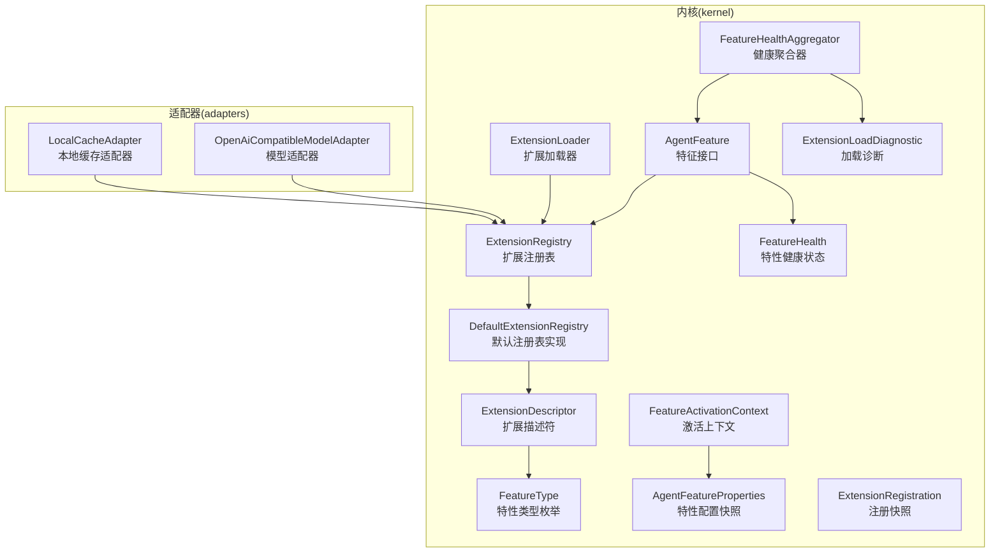
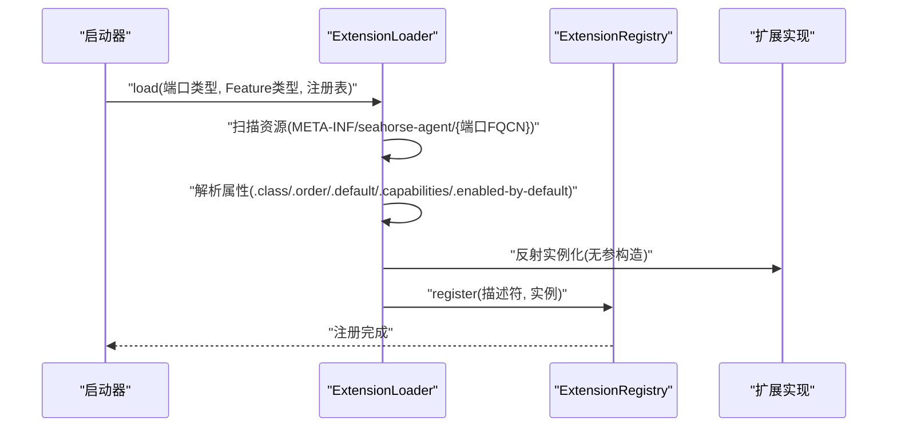
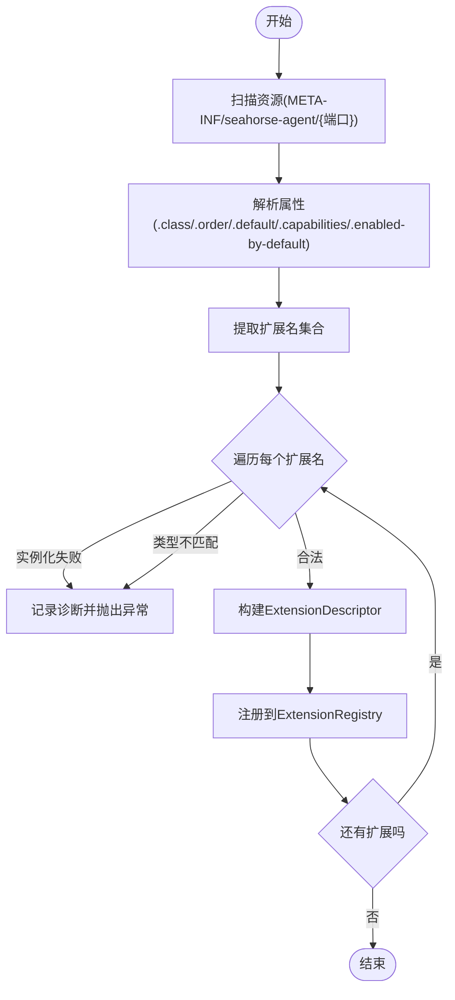
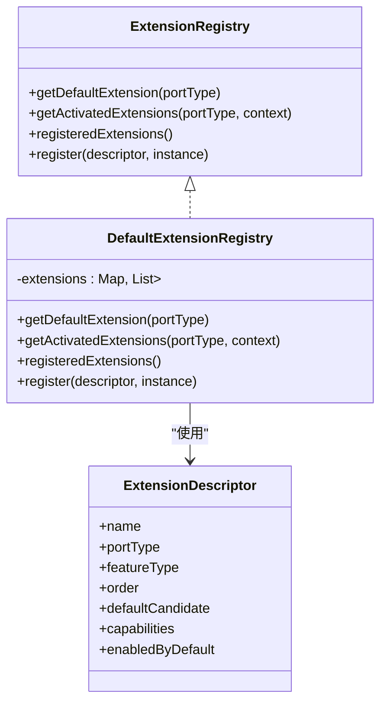
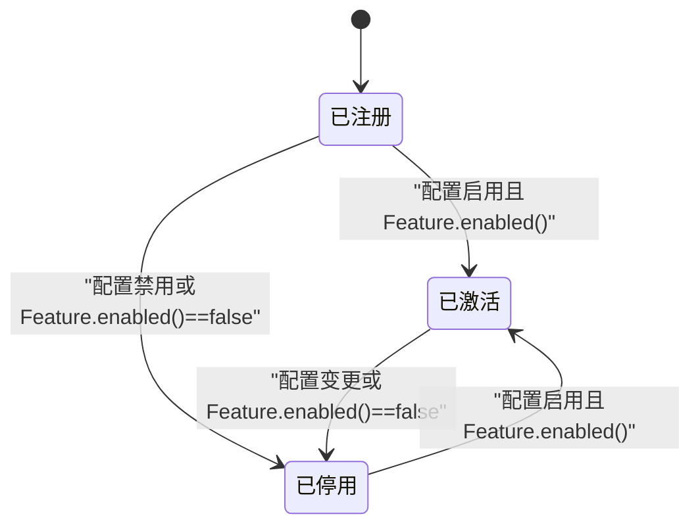
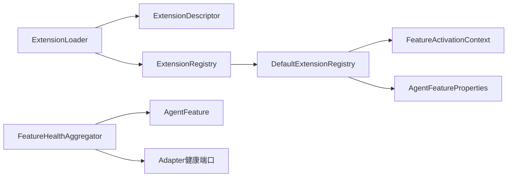

# 插件系统

<cite>
**本文引用的文件**
- [AgentFeature.java](file://seahorse-agent-kernel/src/main/java/com/miracle/ai/seahorse/agent/kernel/plugin/AgentFeature.java)
- [AgentExtension.java](file://seahorse-agent-kernel/src/main/java/com/miracle/ai/seahorse/agent/kernel/plugin/AgentExtension.java)
- [ExtensionLoader.java](file://seahorse-agent-kernel/src/main/java/com/miracle/ai/seahorse/agent/kernel/plugin/ExtensionLoader.java)
- [ExtensionRegistry.java](file://seahorse-agent-kernel/src/main/java/com/miracle/ai/seahorse/agent/kernel/plugin/ExtensionRegistry.java)
- [DefaultExtensionRegistry.java](file://seahorse-agent-kernel/src/main/java/com/miracle/ai/seahorse/agent/kernel/plugin/DefaultExtensionRegistry.java)
- [ExtensionDescriptor.java](file://seahorse-agent-kernel/src/main/java/com/miracle/ai/seahorse/agent/kernel/plugin/ExtensionDescriptor.java)
- [FeatureType.java](file://seahorse-agent-kernel/src/main/java/com/miracle/ai/seahorse/agent/kernel/plugin/FeatureType.java)
- [FeatureActivationContext.java](file://seahorse-agent-kernel/src/main/java/com/miracle/ai/seahorse/agent/kernel/plugin/FeatureActivationContext.java)
- [AgentFeatureProperties.java](file://seahorse-agent-kernel/src/main/java/com/miracle/ai/seahorse/agent/kernel/plugin/AgentFeatureProperties.java)
- [FeatureHealth.java](file://seahorse-agent-kernel/src/main/java/com/miracle/ai/seahorse/agent/kernel/plugin/FeatureHealth.java)
- [FeatureHealthAggregator.java](file://seahorse-agent-kernel/src/main/java/com/miracle/ai/seahorse/agent/kernel/plugin/FeatureHealthAggregator.java)
- [ExtensionLoadDiagnostic.java](file://seahorse-agent-kernel/src/main/java/com/miracle/ai/seahorse/agent/kernel/plugin/ExtensionLoadDiagnostic.java)
- [ExtensionRegistration.java](file://seahorse-agent-kernel/src/main/java/com/miracle/ai/seahorse/agent/kernel/plugin/ExtensionRegistration.java)
- [OpenAiCompatibleModelAdapter.java](file://seahorse-agent-adapter-ai-openai-compatible/src/main/java/com/miracle/ai/seahorse/agent/adapters/ai/openai/OpenAiCompatibleModelAdapter.java)
- [LocalCacheAdapter.java](file://seahorse-agent-adapter-cache-local/src/main/java/com/miracle/ai/seahorse/agent/adapters/cache/local/LocalCacheAdapter.java)
</cite>

## 目录
1. [简介](#简介)
2. [项目结构](#项目结构)
3. [核心组件](#核心组件)
4. [架构总览](#架构总览)
5. [组件详解](#组件详解)
6. [依赖关系分析](#依赖关系分析)
7. [性能考量](#性能考量)
8. [故障排查指南](#故障排查指南)
9. [结论](#结论)
10. [附录](#附录)

## 简介
本文件系统性阐述 Seahorse Agent 微内核的插件体系，重点覆盖 Kernel 的插件架构设计与实现，包括 AgentFeature、AgentExtension、ExtensionLoader、ExtensionRegistry 等核心组件；深入说明插件生命周期管理、动态加载机制、健康状态监控与诊断；解释 PortWrapper 包装器链的设计理念与横切关注点（审计、熔断、观测、限流、重试）的统一处理方式；介绍插件注册、激活、停用流程及依赖关系管理；并提供自定义插件开发指南与最佳实践。

## 项目结构
插件系统位于 kernel 模块的 plugin 包中，围绕“端口-适配器”模型组织，通过 classpath 资源进行扩展发现与注册，运行期仅依赖注册表索引，避免反射扫描对 RAG 主链路性能的影响。

图表来源
- [AgentFeature.java:26-79](file://seahorse-agent-kernel/src/main/java/com/miracle/ai/seahorse/agent/kernel/plugin/AgentFeature.java#L26-L79)
- [ExtensionLoader.java:39-261](file://seahorse-agent-kernel/src/main/java/com/miracle/ai/seahorse/agent/kernel/plugin/ExtensionLoader.java#L39-L261)
- [ExtensionRegistry.java:28-83](file://seahorse-agent-kernel/src/main/java/com/miracle/ai/seahorse/agent/kernel/plugin/ExtensionRegistry.java#L28-L83)
- [DefaultExtensionRegistry.java:34-123](file://seahorse-agent-kernel/src/main/java/com/miracle/ai/seahorse/agent/kernel/plugin/DefaultExtensionRegistry.java#L34-L123)
- [ExtensionDescriptor.java:37-65](file://seahorse-agent-kernel/src/main/java/com/miracle/ai/seahorse/agent/kernel/plugin/ExtensionDescriptor.java#L37-L65)
- [FeatureType.java:26-62](file://seahorse-agent-kernel/src/main/java/com/miracle/ai/seahorse/agent/kernel/plugin/FeatureType.java#L26-L62)
- [FeatureActivationContext.java:33-60](file://seahorse-agent-kernel/src/main/java/com/miracle/ai/seahorse/agent/kernel/plugin/FeatureActivationContext.java#L33-L60)
- [AgentFeatureProperties.java:33-94](file://seahorse-agent-kernel/src/main/java/com/miracle/ai/seahorse/agent/kernel/plugin/AgentFeatureProperties.java#L33-L94)
- [FeatureHealth.java:33-67](file://seahorse-agent-kernel/src/main/java/com/miracle/ai/seahorse/agent/kernel/plugin/FeatureHealth.java#L33-L67)
- [FeatureHealthAggregator.java:31-62](file://seahorse-agent-kernel/src/main/java/com/miracle/ai/seahorse/agent/kernel/plugin/FeatureHealthAggregator.java#L31-L62)
- [ExtensionLoadDiagnostic.java:30-44](file://seahorse-agent-kernel/src/main/java/com/miracle/ai/seahorse/agent/kernel/plugin/ExtensionLoadDiagnostic.java#L30-L44)
- [ExtensionRegistration.java:28-35](file://seahorse-agent-kernel/src/main/java/com/miracle/ai/seahorse/agent/kernel/plugin/ExtensionRegistration.java#L28-L35)
- [OpenAiCompatibleModelAdapter.java:60-82](file://seahorse-agent-adapter-ai-openai-compatible/src/main/java/com/miracle/ai/seahorse/agent/adapters/ai/openai/OpenAiCompatibleModelAdapter.java#L60-L82)
- [LocalCacheAdapter.java:44-51](file://seahorse-agent-adapter-cache-local/src/main/java/com/miracle/ai/seahorse/agent/adapters/cache/local/LocalCacheAdapter.java#L44-L51)

章节来源
- [AgentFeature.java:20-79](file://seahorse-agent-kernel/src/main/java/com/miracle/ai/seahorse/agent/kernel/plugin/AgentFeature.java#L20-L79)
- [ExtensionLoader.java:33-261](file://seahorse-agent-kernel/src/main/java/com/miracle/ai/seahorse/agent/kernel/plugin/ExtensionLoader.java#L33-L261)
- [ExtensionRegistry.java:22-83](file://seahorse-agent-kernel/src/main/java/com/miracle/ai/seahorse/agent/kernel/plugin/ExtensionRegistry.java#L22-L83)
- [DefaultExtensionRegistry.java:27-123](file://seahorse-agent-kernel/src/main/java/com/miracle/ai/seahorse/agent/kernel/plugin/DefaultExtensionRegistry.java#L27-L123)
- [ExtensionDescriptor.java:23-65](file://seahorse-agent-kernel/src/main/java/com/miracle/ai/seahorse/agent/kernel/plugin/ExtensionDescriptor.java#L23-L65)
- [FeatureType.java:20-62](file://seahorse-agent-kernel/src/main/java/com/miracle/ai/seahorse/agent/kernel/plugin/FeatureType.java#L20-L62)
- [FeatureActivationContext.java:23-60](file://seahorse-agent-kernel/src/main/java/com/miracle/ai/seahorse/agent/kernel/plugin/FeatureActivationContext.java#L23-L60)
- [AgentFeatureProperties.java:23-94](file://seahorse-agent-kernel/src/main/java/com/miracle/ai/seahorse/agent/kernel/plugin/AgentFeatureProperties.java#L23-L94)
- [FeatureHealth.java:23-67](file://seahorse-agent-kernel/src/main/java/com/miracle/ai/seahorse/agent/kernel/plugin/FeatureHealth.java#L23-L67)
- [FeatureHealthAggregator.java:26-62](file://seahorse-agent-kernel/src/main/java/com/miracle/ai/seahorse/agent/kernel/plugin/FeatureHealthAggregator.java#L26-L62)
- [ExtensionLoadDiagnostic.java:22-44](file://seahorse-agent-kernel/src/main/java/com/miracle/ai/seahorse/agent/kernel/plugin/ExtensionLoadDiagnostic.java#L22-L44)
- [ExtensionRegistration.java:22-35](file://seahorse-agent-kernel/src/main/java/com/miracle/ai/seahorse/agent/kernel/plugin/ExtensionRegistration.java#L22-L35)

## 核心组件
- AgentFeature：微内核 Feature 基础接口，统一标识 Feature 名称、类型、启用判定、排序与健康状态，确保内核对扩展的统一识别与治理。
- AgentExtension：扩展实现标记，提供名称、顺序与能力标签，支持显式注册与自动发现。
- ExtensionLoader：基于 classpath 资源的扩展加载器，读取 META-INF/seahorse-agent/{端口全限定名} 描述文件，构建扩展实例并注册到注册表。
- ExtensionRegistry：扩展注册表接口，提供默认扩展获取、激活扩展链查询与注册快照导出。
- DefaultExtensionRegistry：默认注册表实现，维护端口到扩展列表的映射，按描述符排序，执行配置与 Feature 层面的启用过滤。
- ExtensionDescriptor：扩展描述符，记录扩展名称、端口类型、Feature 类型、排序、默认候选、能力标签与默认启用标志。
- FeatureType：Feature 类型枚举，定义稳定的扩展点（检索通道、后处理、入库节点、MCP 工具、记忆治理、模型路由、观测包装器等）。
- FeatureActivationContext：Feature 激活上下文，承载租户、用户、灰度属性与配置快照，驱动 Feature 启用决策。
- AgentFeatureProperties：特性配置快照，面向请求链路的只读视图，提供启用开关与透传配置。
- FeatureHealth：特性健康状态，记录名称、健康状态、消息与详情，不参与主链路决策。
- FeatureHealthAggregator：健康聚合器，聚合 Feature 与 Adapter 健康状态，用于诊断与启动检查。
- ExtensionLoadDiagnostic：扩展加载诊断信息，记录资源名、扩展名、实现类与错误消息。
- ExtensionRegistration：启动期注册扩展快照，记录描述符与实现类名。

章节来源
- [AgentFeature.java:26-79](file://seahorse-agent-kernel/src/main/java/com/miracle/ai/seahorse/agent/kernel/plugin/AgentFeature.java#L26-L79)
- [AgentExtension.java:26-57](file://seahorse-agent-kernel/src/main/java/com/miracle/ai/seahorse/agent/kernel/plugin/AgentExtension.java#L26-L57)
- [ExtensionLoader.java:33-261](file://seahorse-agent-kernel/src/main/java/com/miracle/ai/seahorse/agent/kernel/plugin/ExtensionLoader.java#L33-L261)
- [ExtensionRegistry.java:22-83](file://seahorse-agent-kernel/src/main/java/com/miracle/ai/seahorse/agent/kernel/plugin/ExtensionRegistry.java#L22-L83)
- [DefaultExtensionRegistry.java:27-123](file://seahorse-agent-kernel/src/main/java/com/miracle/ai/seahorse/agent/kernel/plugin/DefaultExtensionRegistry.java#L27-L123)
- [ExtensionDescriptor.java:23-65](file://seahorse-agent-kernel/src/main/java/com/miracle/ai/seahorse/agent/kernel/plugin/ExtensionDescriptor.java#L23-L65)
- [FeatureType.java:20-62](file://seahorse-agent-kernel/src/main/java/com/miracle/ai/seahorse/agent/kernel/plugin/FeatureType.java#L20-L62)
- [FeatureActivationContext.java:23-60](file://seahorse-agent-kernel/src/main/java/com/miracle/ai/seahorse/agent/kernel/plugin/FeatureActivationContext.java#L23-L60)
- [AgentFeatureProperties.java:23-94](file://seahorse-agent-kernel/src/main/java/com/miracle/ai/seahorse/agent/kernel/plugin/AgentFeatureProperties.java#L23-L94)
- [FeatureHealth.java:23-67](file://seahorse-agent-kernel/src/main/java/com/miracle/ai/seahorse/agent/kernel/plugin/FeatureHealth.java#L23-L67)
- [FeatureHealthAggregator.java:26-62](file://seahorse-agent-kernel/src/main/java/com/miracle/ai/seahorse/agent/kernel/plugin/FeatureHealthAggregator.java#L26-L62)
- [ExtensionLoadDiagnostic.java:22-44](file://seahorse-agent-kernel/src/main/java/com/miracle/ai/seahorse/agent/kernel/plugin/ExtensionLoadDiagnostic.java#L22-L44)
- [ExtensionRegistration.java:22-35](file://seahorse-agent-kernel/src/main/java/com/miracle/ai/seahorse/agent/kernel/plugin/ExtensionRegistration.java#L22-L35)

## 架构总览
插件系统采用“启动期发现与注册 + 运行期索引”的双阶段设计：
- 启动期：ExtensionLoader 从 classpath 读取端口资源，解析扩展描述符，实例化实现类并通过 ExtensionRegistry.register 完成注册。
- 运行期：内核仅通过端口类型查询默认扩展或激活扩展链，不再进行反射扫描，降低主链路开销。

图表来源
- [ExtensionLoader.java:79-171](file://seahorse-agent-kernel/src/main/java/com/miracle/ai/seahorse/agent/kernel/plugin/ExtensionLoader.java#L79-L171)
- [DefaultExtensionRegistry.java:68-78](file://seahorse-agent-kernel/src/main/java/com/miracle/ai/seahorse/agent/kernel/plugin/DefaultExtensionRegistry.java#L68-L78)

章节来源
- [ExtensionLoader.java:33-261](file://seahorse-agent-kernel/src/main/java/com/miracle/ai/seahorse/agent/kernel/plugin/ExtensionLoader.java#L33-L261)
- [DefaultExtensionRegistry.java:27-123](file://seahorse-agent-kernel/src/main/java/com/miracle/ai/seahorse/agent/kernel/plugin/DefaultExtensionRegistry.java#L27-L123)

## 组件详解

### AgentFeature：统一特征抽象
- 职责：提供 Feature 唯一名、类型、启用判定、排序与健康状态，默认实现保证“启用 + 有序 + 健康上报”。
- 设计要点：将业务扩展能力与具体 SDK 解耦，内核通过该接口完成统一识别、启停判断、排序与健康检查，避免主干逻辑被拆成不可治理的散装插件。

章节来源
- [AgentFeature.java:20-79](file://seahorse-agent-kernel/src/main/java/com/miracle/ai/seahorse/agent/kernel/plugin/AgentFeature.java#L20-L79)

### AgentExtension：扩展实现标记
- 职责：为 Adapter 或 Feature 提供名称、顺序与能力标签，便于显式注册与扩展加载器读取元数据。
- 设计要点：注解级别元数据，与 ExtensionDescriptor 对齐，支持 capabilities 用于能力匹配与组合。

章节来源
- [AgentExtension.java:26-57](file://seahorse-agent-kernel/src/main/java/com/miracle/ai/seahorse/agent/kernel/plugin/AgentExtension.java#L26-L57)

### ExtensionLoader：动态加载机制
- 资源格式：META-INF/seahorse-agent/{端口全限定名}，键值对形式，支持 .class、.order、.default、.managed、.capabilities、.enabled-by-default 等后缀。
- 关键流程：
  - 读取资源集合 → 解析默认实现 → 遍历扩展名 → 实例化并校验端口类型 → 构建描述符 → 注册到注册表。
  - 异常场景：实例化失败、类型不匹配、非法 order 值，均记录 ExtensionLoadDiagnostic 并抛出异常。
- 性能策略：仅在启动期执行，运行期请求链路使用已构建好的注册表，避免反射扫描影响 RAG 性能。

图表来源
- [ExtensionLoader.java:95-171](file://seahorse-agent-kernel/src/main/java/com/miracle/ai/seahorse/agent/kernel/plugin/ExtensionLoader.java#L95-L171)

章节来源
- [ExtensionLoader.java:33-261](file://seahorse-agent-kernel/src/main/java/com/miracle/ai/seahorse/agent/kernel/plugin/ExtensionLoader.java#L33-L261)
- [ExtensionLoadDiagnostic.java:22-44](file://seahorse-agent-kernel/src/main/java/com/miracle/ai/seahorse/agent/kernel/plugin/ExtensionLoadDiagnostic.java#L22-L44)

### ExtensionRegistry 与 DefaultExtensionRegistry：注册与查询
- ExtensionRegistry：定义默认扩展获取、激活扩展链查询与注册快照导出。
- DefaultExtensionRegistry：
  - 使用 LinkedHashMap 保持注册顺序，拒绝同一端口下重复名称。
  - 按描述符 order 排序，启用过滤包含配置开关与 Feature.enabled 判定。
  - 提供 registeredExtensions 快照，便于诊断与运维。

图表来源
- [ExtensionRegistry.java:28-83](file://seahorse-agent-kernel/src/main/java/com/miracle/ai/seahorse/agent/kernel/plugin/ExtensionRegistry.java#L28-L83)
- [DefaultExtensionRegistry.java:34-123](file://seahorse-agent-kernel/src/main/java/com/miracle/ai/seahorse/agent/kernel/plugin/DefaultExtensionRegistry.java#L34-L123)
- [ExtensionDescriptor.java:37-65](file://seahorse-agent-kernel/src/main/java/com/miracle/ai/seahorse/agent/kernel/plugin/ExtensionDescriptor.java#L37-L65)

章节来源
- [ExtensionRegistry.java:22-83](file://seahorse-agent-kernel/src/main/java/com/miracle/ai/seahorse/agent/kernel/plugin/ExtensionRegistry.java#L22-L83)
- [DefaultExtensionRegistry.java:27-123](file://seahorse-agent-kernel/src/main/java/com/miracle/ai/seahorse/agent/kernel/plugin/DefaultExtensionRegistry.java#L27-L123)
- [ExtensionDescriptor.java:23-65](file://seahorse-agent-kernel/src/main/java/com/miracle/ai/seahorse/agent/kernel/plugin/ExtensionDescriptor.java#L23-L65)

### ExtensionDescriptor：扩展元数据
- 字段：name、portType、featureType、order、defaultCandidate、capabilities、enabledByDefault。
- 校验：name 与 portType 必填，capabilities 默认空集，构造时进行不可变拷贝，确保注册表索引稳定性。

章节来源
- [ExtensionDescriptor.java:23-65](file://seahorse-agent-kernel/src/main/java/com/miracle/ai/seahorse/agent/kernel/plugin/ExtensionDescriptor.java#L23-L65)

### FeatureType：扩展点类型
- 定义稳定的扩展点：SEARCH_CHANNEL、SEARCH_RESULT_POST_PROCESSOR、INGESTION_NODE、MCP_TOOL、MEMORY_GOVERNANCE、MODEL_ROUTING_POLICY、OBSERVATION_WRAPPER。
- 新增扩展点需谨慎，避免无限制插件化导致核心能力空心化。

章节来源
- [FeatureType.java:20-62](file://seahorse-agent-kernel/src/main/java/com/miracle/ai/seahorse/agent/kernel/plugin/FeatureType.java#L20-L62)

### FeatureActivationContext 与 AgentFeatureProperties：激活与配置
- FeatureActivationContext：封装 tenantId、userId、attributes、AgentFeatureProperties，提供空值兜底与不可变视图。
- AgentFeatureProperties：提供 enabled(featureName[, default]) 与 settings(featureName)，面向请求链路的只读配置快照，避免请求期反复读取松散 Map。

章节来源
- [FeatureActivationContext.java:23-60](file://seahorse-agent-kernel/src/main/java/com/miracle/ai/seahorse/agent/kernel/plugin/FeatureActivationContext.java#L23-L60)
- [AgentFeatureProperties.java:23-94](file://seahorse-agent-kernel/src/main/java/com/miracle/ai/seahorse/agent/kernel/plugin/AgentFeatureProperties.java#L23-L94)

### FeatureHealth 与 FeatureHealthAggregator：健康状态与聚合
- FeatureHealth：记录 name、up、message、details，提供 up/down 工厂方法。
- FeatureHealthAggregator：聚合 AgentFeature.health() 与 Adapter 健康指标，仅在诊断入口或启动检查中调用，不进入请求主链路。

章节来源
- [FeatureHealth.java:23-67](file://seahorse-agent-kernel/src/main/java/com/miracle/ai/seahorse/agent/kernel/plugin/FeatureHealth.java#L23-L67)
- [FeatureHealthAggregator.java:26-62](file://seahorse-agent-kernel/src/main/java/com/miracle/ai/seahorse/agent/kernel/plugin/FeatureHealthAggregator.java#L26-L62)

### PortWrapper 包装器链：横切关注点统一处理
- 设计理念：通过包装器链对端口调用进行横切增强，典型场景包括审计、熔断、观测、限流、重试等。
- 实现路径：内核在获取扩展链后，按 Feature 类型与配置对端口实例进行包装，形成“外层包装器包裹内部扩展”的链式结构，确保横切逻辑与业务逻辑分离。
- 优势：统一的包装器协议与可插拔的包装器实现，使横切关注点在不同端口间复用，降低重复实现成本。

[本节为概念性说明，不直接分析具体文件，故不附“章节来源”]

### 插件生命周期与控制流
- 注册：启动期 ExtensionLoader 读取资源 → 解析描述符 → 实例化 → DefaultExtensionRegistry.register。
- 激活：运行期根据 FeatureActivationContext 与 AgentFeatureProperties 过滤启用项，按 order 排序返回扩展链。
- 停用：通过配置禁用或 Feature.enabled 返回 false，扩展链中不再包含该实现。
- 健康：Feature.health() 上报自身状态，FeatureHealthAggregator 聚合输出健康报告。

图表来源
- [DefaultExtensionRegistry.java:103-114](file://seahorse-agent-kernel/src/main/java/com/miracle/ai/seahorse/agent/kernel/plugin/DefaultExtensionRegistry.java#L103-L114)
- [AgentFeatureProperties.java:64-80](file://seahorse-agent-kernel/src/main/java/com/miracle/ai/seahorse/agent/kernel/plugin/AgentFeatureProperties.java#L64-L80)

章节来源
- [DefaultExtensionRegistry.java:27-123](file://seahorse-agent-kernel/src/main/java/com/miracle/ai/seahorse/agent/kernel/plugin/DefaultExtensionRegistry.java#L27-L123)
- [AgentFeatureProperties.java:23-94](file://seahorse-agent-kernel/src/main/java/com/miracle/ai/seahorse/agent/kernel/plugin/AgentFeatureProperties.java#L23-L94)

### 适配器实现示例与端口对接
- OpenAiCompatibleModelAdapter：实现多个模型相关端口，体现“一个适配器对接多个端口”的模式，便于通过扩展注册表统一调度。
- LocalCacheAdapter：实现缓存、速率限制、发布订阅、分布式锁与 ID 生成等端口，展示适配器在基础设施领域的扩展能力。

章节来源
- [OpenAiCompatibleModelAdapter.java:54-82](file://seahorse-agent-adapter-ai-openai-compatible/src/main/java/com/miracle/ai/seahorse/agent/adapters/ai/openai/OpenAiCompatibleModelAdapter.java#L54-L82)
- [LocalCacheAdapter.java:39-51](file://seahorse-agent-adapter-cache-local/src/main/java/com/miracle/ai/seahorse/agent/adapters/cache/local/LocalCacheAdapter.java#L39-L51)

## 依赖关系分析
- 组件内聚与耦合：
  - ExtensionLoader 与 DefaultExtensionRegistry 通过 ExtensionDescriptor 强关联，Loader 负责构建，Registry 负责存储与查询。
  - FeatureActivationContext 与 AgentFeatureProperties 为 DefaultExtensionRegistry 的启用过滤提供输入。
  - FeatureHealthAggregator 依赖 Feature 与 Adapter 健康端口，独立于请求主链路。
- 外部依赖：
  - 适配器实现通过实现特定端口接口对接内核，不直接依赖 Spring Bean 名称或具体第三方 SDK，提升可替换性。
- 潜在循环依赖：
  - 插件系统内部无循环依赖；适配器与内核通过端口解耦，避免双向依赖。

图表来源
- [ExtensionLoader.java:181-190](file://seahorse-agent-kernel/src/main/java/com/miracle/ai/seahorse/agent/kernel/plugin/ExtensionLoader.java#L181-L190)
- [DefaultExtensionRegistry.java:103-114](file://seahorse-agent-kernel/src/main/java/com/miracle/ai/seahorse/agent/kernel/plugin/DefaultExtensionRegistry.java#L103-L114)
- [FeatureHealthAggregator.java:36-53](file://seahorse-agent-kernel/src/main/java/com/miracle/ai/seahorse/agent/kernel/plugin/FeatureHealthAggregator.java#L36-L53)

章节来源
- [ExtensionLoader.java:33-261](file://seahorse-agent-kernel/src/main/java/com/miracle/ai/seahorse/agent/kernel/plugin/ExtensionLoader.java#L33-L261)
- [DefaultExtensionRegistry.java:27-123](file://seahorse-agent-kernel/src/main/java/com/miracle/ai/seahorse/agent/kernel/plugin/DefaultExtensionRegistry.java#L27-L123)
- [FeatureHealthAggregator.java:26-62](file://seahorse-agent-kernel/src/main/java/com/miracle/ai/seahorse/agent/kernel/plugin/FeatureHealthAggregator.java#L26-L62)

## 性能考量
- 启动期一次性扫描与实例化，运行期仅做索引查询与轻量过滤，避免反射扫描带来的抖动。
- ExtensionRegistry 使用 LinkedHashMap 与排序缓存，查询与过滤为 O(n) 链表操作，n 通常较小。
- 健康检查与诊断仅在非主链路调用，避免健康状态采集影响在线请求。
- 建议：
  - 控制单端口扩展数量，避免扩展过多导致过滤成本上升。
  - 合理设置 order，减少扩展链长度与调用层级。
  - 将昂贵的初始化逻辑放在扩展内部懒加载，避免阻塞启动。

[本节为通用性能建议，不直接分析具体文件，故不附“章节来源”]

## 故障排查指南
- 加载失败诊断：
  - 使用 ExtensionLoader.diagnostics() 获取最近一次加载过程中的诊断信息，定位资源名、扩展名、实现类与错误消息。
- 启用异常：
  - 检查 AgentFeatureProperties 中的 enabledFeatures 与 defaultEnabled，确认 Feature 名称与配置一致。
  - 若扩展未出现在激活链中，确认 Feature.enabled(context) 返回值与配置开关。
- 健康问题：
  - 使用 FeatureHealthAggregator.health() 输出 Feature 与 Adapter 健康报告，结合 FeatureHealth.details 定位问题。
- 常见问题：
  - 重复名称：同一端口下扩展名重复会触发异常，需调整 AgentExtension.name。
  - 类型不匹配：扩展实现类未实现对应端口接口，实例化时抛出异常。
  - 非法 order：.order 键值非整数，解析失败。

章节来源
- [ExtensionLoadDiagnostic.java:22-44](file://seahorse-agent-kernel/src/main/java/com/miracle/ai/seahorse/agent/kernel/plugin/ExtensionLoadDiagnostic.java#L22-L44)
- [DefaultExtensionRegistry.java:94-101](file://seahorse-agent-kernel/src/main/java/com/miracle/ai/seahorse/agent/kernel/plugin/DefaultExtensionRegistry.java#L94-L101)
- [FeatureHealthAggregator.java:42-53](file://seahorse-agent-kernel/src/main/java/com/miracle/ai/seahorse/agent/kernel/plugin/FeatureHealthAggregator.java#L42-L53)

## 结论
Seahorse Agent 的插件系统通过“端口-适配器”与“启动期发现 + 运行期索引”的架构，实现了对扩展的统一治理与高性能运行。AgentFeature、AgentExtension、ExtensionLoader、ExtensionRegistry、ExtensionDescriptor 等核心组件协同工作，既满足业务扩展需求，又保障主链路性能与可观测性。通过 FeatureActivationContext 与 AgentFeatureProperties 支持细粒度的启用控制，借助 FeatureHealth 与 FeatureHealthAggregator 提供健康监控与诊断能力。PortWrapper 包装器链则为审计、熔断、观测、限流、重试等横切关注点提供了统一的处理框架。

[本节为总结性内容，不直接分析具体文件，故不附“章节来源”]

## 附录

### 自定义插件开发指南与最佳实践
- 设计原则
  - 以端口为中心：实现特定端口接口，避免直接依赖具体 SDK。
  - 明确 Feature 类型：优先复用 FeatureType 中的稳定扩展点，避免过度扩展。
  - 可观测与可诊断：实现 Feature.health()，提供健康状态与详情。
- 开发步骤
  - 定义扩展实现类，实现所需端口接口。
  - 在实现类上添加 AgentExtension 注解，设置 name、order、capabilities。
  - 在 classpath 下创建资源文件 META-INF/seahorse-agent/{端口全限定名}，写入扩展元数据（.class、.order、.default、.capabilities、.enabled-by-default）。
  - 启动应用，ExtensionLoader 将自动发现并注册扩展；通过 ExtensionRegistry 查询默认扩展或激活链。
- 最佳实践
  - 启动期初始化尽量轻量，将昂贵初始化延迟到首次使用。
  - 合理设置 order，确保扩展链顺序符合业务预期。
  - 使用 capabilities 标记扩展能力，便于组合与匹配。
  - 通过 AgentFeatureProperties.settings(featureName) 传递扩展所需的透传配置。
  - 为扩展编写单元测试与集成测试，覆盖正常路径与异常路径。

[本节为通用开发指南，不直接分析具体文件，故不附“章节来源”]