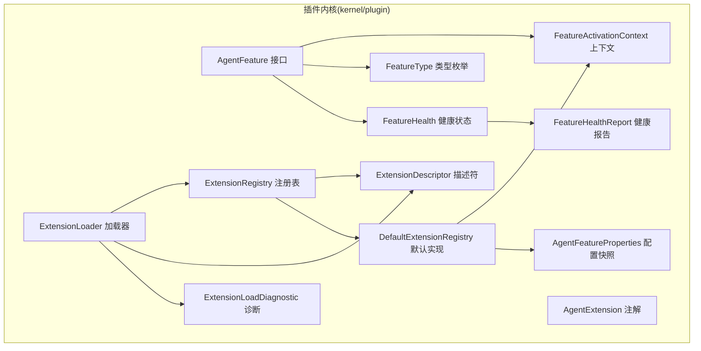
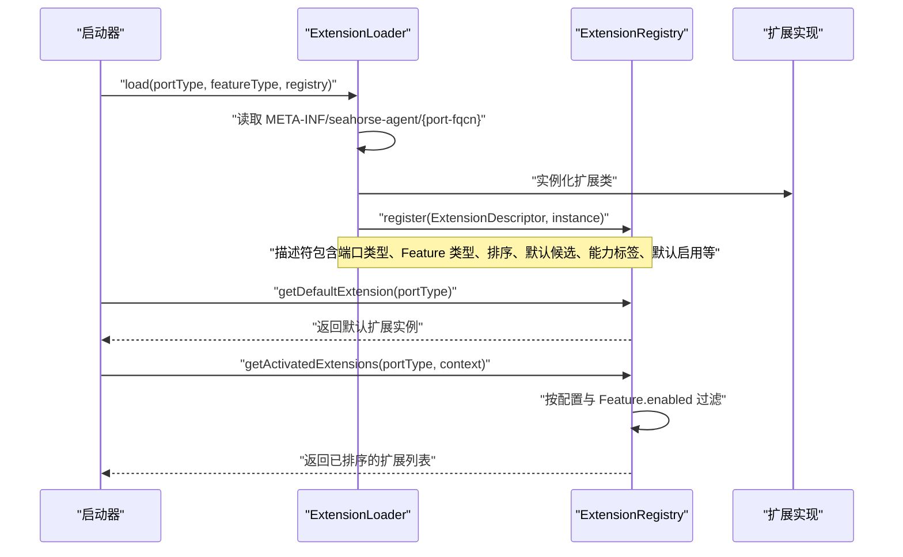
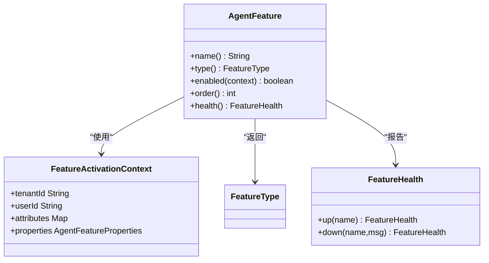
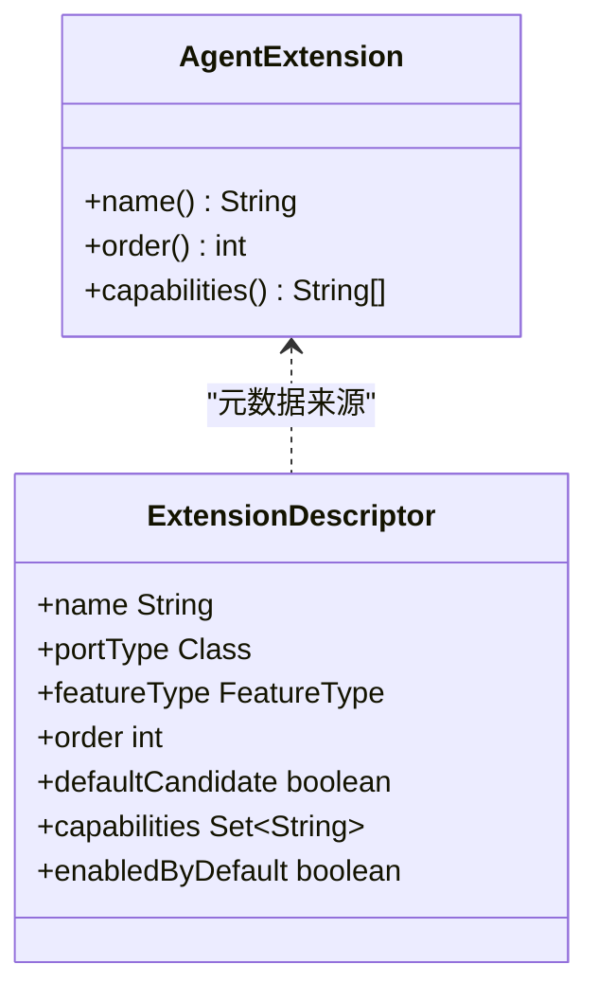
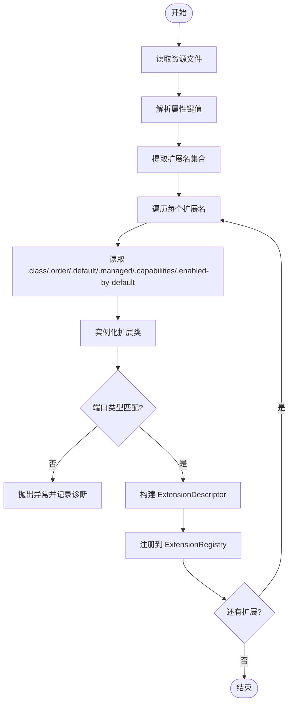
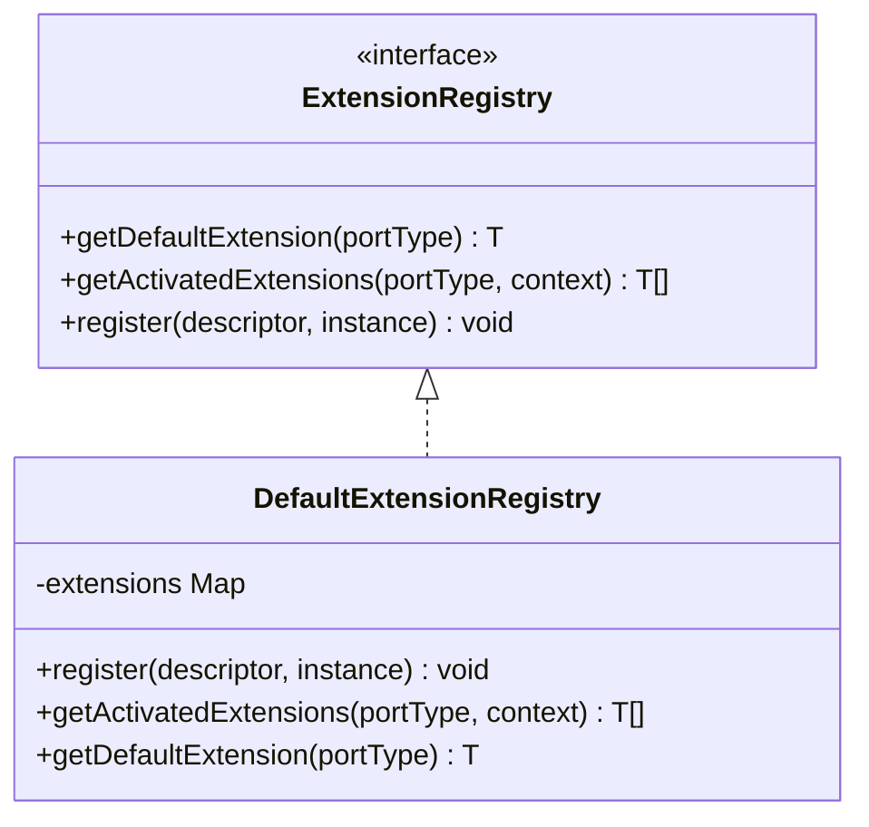
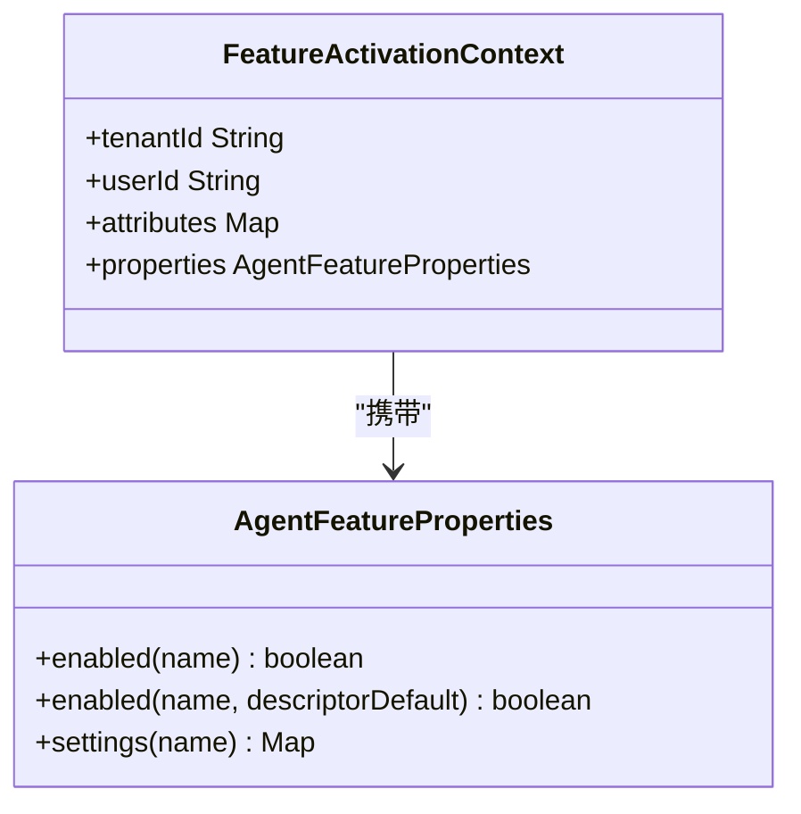
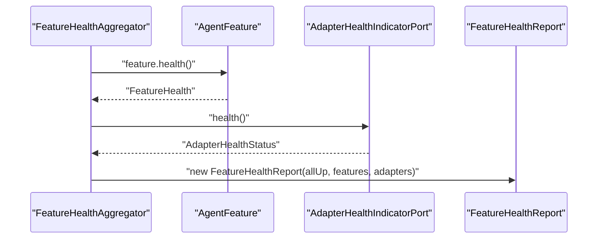
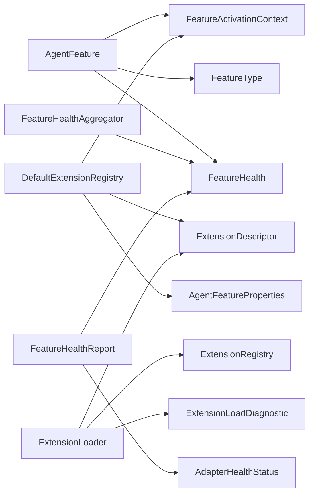

# 核心组件

<cite>
**本文引用的文件**
- [AgentFeature.java](file://seahorse-agent-kernel/src/main/java/com/miracle/ai/seahorse/agent/kernel/plugin/AgentFeature.java)
- [AgentExtension.java](file://seahorse-agent-kernel/src/main/java/com/miracle/ai/seahorse/agent/kernel/plugin/AgentExtension.java)
- [ExtensionDescriptor.java](file://seahorse-agent-kernel/src/main/java/com/miracle/ai/seahorse/agent/kernel/plugin/ExtensionDescriptor.java)
- [FeatureActivationContext.java](file://seahorse-agent-kernel/src/main/java/com/miracle/ai/seahorse/agent/kernel/plugin/FeatureActivationContext.java)
- [FeatureType.java](file://seahorse-agent-kernel/src/main/java/com/miracle/ai/seahorse/agent/kernel/plugin/FeatureType.java)
- [FeatureHealth.java](file://seahorse-agent-kernel/src/main/java/com/miracle/ai/seahorse/agent/kernel/plugin/FeatureHealth.java)
- [FeatureHealthAggregator.java](file://seahorse-agent-kernel/src/main/java/com/miracle/ai/seahorse/agent/kernel/plugin/FeatureHealthAggregator.java)
- [FeatureHealthReport.java](file://seahorse-agent-kernel/src/main/java/com/miracle/ai/seahorse/agent/kernel/plugin/FeatureHealthReport.java)
- [ExtensionRegistry.java](file://seahorse-agent-kernel/src/main/java/com/miracle/ai/seahorse/agent/kernel/plugin/ExtensionRegistry.java)
- [DefaultExtensionRegistry.java](file://seahorse-agent-kernel/src/main/java/com/miracle/ai/seahorse/agent/kernel/plugin/DefaultExtensionRegistry.java)
- [ExtensionLoader.java](file://seahorse-agent-kernel/src/main/java/com/miracle/ai/seahorse/agent/kernel/plugin/ExtensionLoader.java)
- [ExtensionRegistration.java](file://seahorse-agent-kernel/src/main/java/com/miracle/ai/seahorse/agent/kernel/plugin/ExtensionRegistration.java)
- [AgentFeatureProperties.java](file://seahorse-agent-kernel/src/main/java/com/miracle/ai/seahorse/agent/kernel/plugin/AgentFeatureProperties.java)
- [ExtensionLoadDiagnostic.java](file://seahorse-agent-kernel/src/main/java/com/miracle/ai/seahorse/agent/kernel/plugin/ExtensionLoadDiagnostic.java)
</cite>

## 目录
1. [简介](#简介)
2. [项目结构](#项目结构)
3. [核心组件](#核心组件)
4. [架构总览](#架构总览)
5. [详细组件分析](#详细组件分析)
6. [依赖关系分析](#依赖关系分析)
7. [性能考量](#性能考量)
8. [故障排查指南](#故障排查指南)
9. [结论](#结论)
10. [附录](#附录)

## 简介
本文件聚焦于插件系统的核心组件，系统性阐述 AgentFeature 接口的设计理念与实现要求，AgentExtension 注解的作用与生命周期管理，ExtensionDescriptor 描述符的元数据与配置驱动机制，FeatureActivationContext 上下文传递机制，FeatureType 类型枚举体系，以及它们如何协同构建完整的插件架构。同时提供实现自定义 Feature 与 Extension 的实践路径与参考。

## 项目结构
围绕插件系统的核心代码位于 seahorse-agent-kernel 模块的 kernel/plugin 包中，采用“接口 + 描述符 + 注册表 + 加载器”的分层设计，确保启动期装配与运行期调用分离，避免请求链路受反射扫描影响。

图表来源
- [AgentFeature.java:26-79](file://seahorse-agent-kernel/src/main/java/com/miracle/ai/seahorse/agent/kernel/plugin/AgentFeature.java#L26-L79)
- [AgentExtension.java:35-57](file://seahorse-agent-kernel/src/main/java/com/miracle/ai/seahorse/agent/kernel/plugin/AgentExtension.java#L35-L57)
- [ExtensionDescriptor.java:37-65](file://seahorse-agent-kernel/src/main/java/com/miracle/ai/seahorse/agent/kernel/plugin/ExtensionDescriptor.java#L37-L65)
- [FeatureActivationContext.java:33-60](file://seahorse-agent-kernel/src/main/java/com/miracle/ai/seahorse/agent/kernel/plugin/FeatureActivationContext.java#L33-L60)
- [FeatureType.java:26-62](file://seahorse-agent-kernel/src/main/java/com/miracle/ai/seahorse/agent/kernel/plugin/FeatureType.java#L26-L62)
- [FeatureHealth.java:33-67](file://seahorse-agent-kernel/src/main/java/com/miracle/ai/seahorse/agent/kernel/plugin/FeatureHealth.java#L33-L67)
- [FeatureHealthReport.java:32-42](file://seahorse-agent-kernel/src/main/java/com/miracle/ai/seahorse/agent/kernel/plugin/FeatureHealthReport.java#L32-L42)
- [ExtensionLoader.java:39-261](file://seahorse-agent-kernel/src/main/java/com/miracle/ai/seahorse/agent/kernel/plugin/ExtensionLoader.java#L39-L261)
- [ExtensionRegistry.java:28-83](file://seahorse-agent-kernel/src/main/java/com/miracle/ai/seahorse/agent/kernel/plugin/ExtensionRegistry.java#L28-L83)
- [DefaultExtensionRegistry.java:34-123](file://seahorse-agent-kernel/src/main/java/com/miracle/ai/seahorse/agent/kernel/plugin/DefaultExtensionRegistry.java#L34-L123)
- [ExtensionLoadDiagnostic.java:30-43](file://seahorse-agent-kernel/src/main/java/com/miracle/ai/seahorse/agent/kernel/plugin/ExtensionLoadDiagnostic.java#L30-L43)
- [AgentFeatureProperties.java:33-94](file://seahorse-agent-kernel/src/main/java/com/miracle/ai/seahorse/agent/kernel/plugin/AgentFeatureProperties.java#L33-L94)

章节来源
- [ExtensionLoader.java:39-261](file://seahorse-agent-kernel/src/main/java/com/miracle/ai/seahorse/agent/kernel/plugin/ExtensionLoader.java#L39-L261)
- [DefaultExtensionRegistry.java:34-123](file://seahorse-agent-kernel/src/main/java/com/miracle/ai/seahorse/agent/kernel/plugin/DefaultExtensionRegistry.java#L34-L123)

## 核心组件
本节从设计目标、职责边界、关键方法与行为约定四个维度，系统梳理核心组件。

- AgentFeature 接口
  - 设计理念：抽象微内核 Feature 的最小可用契约，强调“业务扩展能力”而非“SDK 直连”，统一识别、启停判断、排序与健康检查，避免主干逻辑被拆成不可治理的散装插件。
  - 关键方法
    - name(): 唯一标识，用于配置开关、日志、监控与冲突检测；同一端口下不可重复。
    - type(): Feature 类型，用于区分检索通道、后处理器、MCP 工具、记忆治理、模型路由、观测包装器等扩展点。
    - enabled(context): 基于租户、用户、灰度属性或配置进行启用控制，默认启用。
    - order(): 排序优先级（数字越小优先级越高），未提供描述符时的补充语义。
    - health(): 健康状态报告，仅报告自身状态，不参与请求链路，避免增加主链路耗时。
  - 实现建议
    - 在 enabled 中结合 FeatureActivationContext 的 tenantId、userId、attributes、properties 进行细粒度控制。
    - 在 health 中返回稳定的 FeatureHealth.up(name) 或 FeatureHealth.down(name, msg)。

- AgentExtension 注解
  - 作用：为 Adapter 或 Feature 提供声明式元数据，支持名称、顺序与能力标签，便于显式注册与扩展加载器读取。
  - 属性
    - name(): 扩展名称。
    - order(): 排序值，数字越小越靠前。
    - capabilities(): 能力标签数组，用于能力匹配与筛选。

- ExtensionDescriptor 描述符
  - 作用：启动期确定扩展所属端口、类型、排序、默认候选资格与能力标签；请求期只读取预注册结果，避免动态扫描带来的性能抖动。
  - 字段
    - name、portType、featureType、order、defaultCandidate、capabilities、enabledByDefault。
  - 校验
    - name、portType、featureType 必填且非空；capabilities 防御性复制为不可变集合。

- FeatureActivationContext 上下文
  - 作用：在选择扩展链时传入 Feature 的激活上下文，支持按租户、用户、灰度属性与配置决定启用与否。
  - 字段
    - tenantId、userId、attributes、properties。
  - 行为
    - 空值兜底，构造时对 Map 进行不可变复制；提供 empty() 快捷构造。

- FeatureType 类型枚举
  - 定义微内核认可的稳定扩展点，新增业务扩展优先复用现有类型，避免无限制插件化导致核心能力空心化。
  - 主要类型
    - 检索通道、检索结果后处理、入库流水线节点、MCP 工具扩展、记忆治理策略、模型路由策略、观测包装器。

- FeatureHealth 健康状态
  - 作用：健康信息用于启动检查、管理端展示与问题定位，不参与主链路决策。
  - 方法
    - up(name)、down(name, message) 快速构造健康/不健康状态；内部对字段进行不可变复制。

- FeatureHealthAggregator 聚合器
  - 作用：在诊断入口或启动检查中聚合 Feature 与 Adapter 的健康状态，整体 up 条件为所有 Feature 与 Adapter 健康。
  - 行为
    - 对 Feature 调用 health() 并捕获异常降级为 DOWN；对 Adapter 调用 AdapterHealthIndicatorPort.health()。

- ExtensionRegistry 与 DefaultExtensionRegistry
  - ExtensionRegistry：定义扩展注册表的对外契约，提供默认扩展获取、激活扩展链获取、注册扩展与注册快照查询。
  - DefaultExtensionRegistry：面向原生插件运行时的默认实现，启动期注册扩展，请求期执行轻量过滤与类型转换；拒绝同一端口下的重复名称，按 order 排序。

- ExtensionLoader 加载器
  - 作用：基于 classpath 资源 META-INF/seahorse-agent/{port-fqcn} 的属性文件加载扩展，构建 ExtensionDescriptor 并注册到注册表。
  - 关键流程
    - 解析 default、class、order、default、managed、capabilities、enabled-by-default 等键；
    - 实例化扩展类并校验其实现的端口类型；
    - 将扩展注册到注册表，记录诊断信息。

- AgentFeatureProperties 配置快照
  - 作用：面向请求链路的只读配置视图，启动期由 Spring 配置类转换而来，避免请求期反复读取松散 Map。
  - 方法
    - enabled(name)、enabled(name, descriptorDefault)、settings(name)。

- ExtensionRegistration 与 ExtensionLoadDiagnostic
  - ExtensionRegistration：启动期注册快照，包含描述符与实现类名。
  - ExtensionLoadDiagnostic：扩展加载诊断信息，记录资源名、扩展名、实现类名与错误消息。

章节来源
- [AgentFeature.java:26-79](file://seahorse-agent-kernel/src/main/java/com/miracle/ai/seahorse/agent/kernel/plugin/AgentFeature.java#L26-L79)
- [AgentExtension.java:35-57](file://seahorse-agent-kernel/src/main/java/com/miracle/ai/seahorse/agent/kernel/plugin/AgentExtension.java#L35-L57)
- [ExtensionDescriptor.java:37-65](file://seahorse-agent-kernel/src/main/java/com/miracle/ai/seahorse/agent/kernel/plugin/ExtensionDescriptor.java#L37-L65)
- [FeatureActivationContext.java:33-60](file://seahorse-agent-kernel/src/main/java/com/miracle/ai/seahorse/agent/kernel/plugin/FeatureActivationContext.java#L33-L60)
- [FeatureType.java:26-62](file://seahorse-agent-kernel/src/main/java/com/miracle/ai/seahorse/agent/kernel/plugin/FeatureType.java#L26-L62)
- [FeatureHealth.java:33-67](file://seahorse-agent-kernel/src/main/java/com/miracle/ai/seahorse/agent/kernel/plugin/FeatureHealth.java#L33-L67)
- [FeatureHealthAggregator.java:31-62](file://seahorse-agent-kernel/src/main/java/com/miracle/ai/seahorse/agent/kernel/plugin/FeatureHealthAggregator.java#L31-L62)
- [ExtensionRegistry.java:28-83](file://seahorse-agent-kernel/src/main/java/com/miracle/ai/seahorse/agent/kernel/plugin/ExtensionRegistry.java#L28-L83)
- [DefaultExtensionRegistry.java:34-123](file://seahorse-agent-kernel/src/main/java/com/miracle/ai/seahorse/agent/kernel/plugin/DefaultExtensionRegistry.java#L34-L123)
- [ExtensionLoader.java:39-261](file://seahorse-agent-kernel/src/main/java/com/miracle/ai/seahorse/agent/kernel/plugin/ExtensionLoader.java#L39-L261)
- [AgentFeatureProperties.java:33-94](file://seahorse-agent-kernel/src/main/java/com/miracle/ai/seahorse/agent/kernel/plugin/AgentFeatureProperties.java#L33-L94)
- [ExtensionRegistration.java:28-34](file://seahorse-agent-kernel/src/main/java/com/miracle/ai/seahorse/agent/kernel/plugin/ExtensionRegistration.java#L28-L34)
- [ExtensionLoadDiagnostic.java:30-43](file://seahorse-agent-kernel/src/main/java/com/miracle/ai/seahorse/agent/kernel/plugin/ExtensionLoadDiagnostic.java#L30-L43)

## 架构总览
插件系统采用“启动期装配 + 运行期调用”的双阶段设计。启动期通过 ExtensionLoader 读取 classpath 资源，构建 ExtensionDescriptor 并注册到 ExtensionRegistry；运行期通过 ExtensionRegistry 获取激活扩展链，结合 FeatureActivationContext 与 AgentFeatureProperties 进行启用控制与排序。

图表来源
- [ExtensionLoader.java:79-171](file://seahorse-agent-kernel/src/main/java/com/miracle/ai/seahorse/agent/kernel/plugin/ExtensionLoader.java#L79-L171)
- [DefaultExtensionRegistry.java:38-58](file://seahorse-agent-kernel/src/main/java/com/miracle/ai/seahorse/agent/kernel/plugin/DefaultExtensionRegistry.java#L38-L58)
- [ExtensionRegistry.java:37-47](file://seahorse-agent-kernel/src/main/java/com/miracle/ai/seahorse/agent/kernel/plugin/ExtensionRegistry.java#L37-L47)

## 详细组件分析

### AgentFeature 接口
- 设计要点
  - 唯一名称与类型：用于注册表索引与扩展链组织。
  - 启用控制：enabled(context) 支持租户、用户、灰度与配置多维控制。
  - 排序：order() 与 ExtensionDescriptor.order() 协同，确保稳定排序。
  - 健康检查：health() 仅报告自身状态，避免影响请求主链路。
- 复杂度与性能
  - enabled 与 health 为 O(1)，排序为 O(n log n)（注册时完成）。
- 错误处理
  - 建议在 health 中捕获异常并降级为 DOWN，配合 FeatureHealthAggregator 聚合。

图表来源
- [AgentFeature.java:26-79](file://seahorse-agent-kernel/src/main/java/com/miracle/ai/seahorse/agent/kernel/plugin/AgentFeature.java#L26-L79)
- [FeatureActivationContext.java:33-60](file://seahorse-agent-kernel/src/main/java/com/miracle/ai/seahorse/agent/kernel/plugin/FeatureActivationContext.java#L33-L60)
- [FeatureType.java:26-62](file://seahorse-agent-kernel/src/main/java/com/miracle/ai/seahorse/agent/kernel/plugin/FeatureType.java#L26-L62)
- [FeatureHealth.java:33-67](file://seahorse-agent-kernel/src/main/java/com/miracle/ai/seahorse/agent/kernel/plugin/FeatureHealth.java#L33-L67)

章节来源
- [AgentFeature.java:26-79](file://seahorse-agent-kernel/src/main/java/com/miracle/ai/seahorse/agent/kernel/plugin/AgentFeature.java#L26-L79)

### AgentExtension 注解与 ExtensionDescriptor
- AgentExtension
  - 通过注解声明扩展名称、顺序与能力标签，简化显式注册与加载器元数据读取。
- ExtensionDescriptor
  - 记录扩展的端口类型、Feature 类型、排序、默认候选、能力标签与默认启用策略。
  - 构造时进行必填字段校验，capabilities 防御性复制为不可变集合。

图表来源
- [AgentExtension.java:35-57](file://seahorse-agent-kernel/src/main/java/com/miracle/ai/seahorse/agent/kernel/plugin/AgentExtension.java#L35-L57)
- [ExtensionDescriptor.java:37-65](file://seahorse-agent-kernel/src/main/java/com/miracle/ai/seahorse/agent/kernel/plugin/ExtensionDescriptor.java#L37-L65)

章节来源
- [AgentExtension.java:35-57](file://seahorse-agent-kernel/src/main/java/com/miracle/ai/seahorse/agent/kernel/plugin/AgentExtension.java#L35-L57)
- [ExtensionDescriptor.java:37-65](file://seahorse-agent-kernel/src/main/java/com/miracle/ai/seahorse/agent/kernel/plugin/ExtensionDescriptor.java#L37-L65)

### ExtensionLoader 加载器
- 资源格式
  - 路径：META-INF/seahorse-agent/{port-fqcn}
  - 键：扩展名 + 后缀，如 .class、.order、.default、.managed、.capabilities、.enabled-by-default
- 关键流程
  - 读取资源 -> 解析默认扩展 -> 解析扩展名集合 -> 逐个注册 -> 记录诊断
  - 实例化扩展类并校验端口类型一致性
- 错误处理
  - 对非法 order、端口不匹配、实例化失败等情况抛出异常并记录诊断

图表来源
- [ExtensionLoader.java:95-171](file://seahorse-agent-kernel/src/main/java/com/miracle/ai/seahorse/agent/kernel/plugin/ExtensionLoader.java#L95-L171)
- [ExtensionLoader.java:181-238](file://seahorse-agent-kernel/src/main/java/com/miracle/ai/seahorse/agent/kernel/plugin/ExtensionLoader.java#L181-L238)

章节来源
- [ExtensionLoader.java:39-261](file://seahorse-agent-kernel/src/main/java/com/miracle/ai/seahorse/agent/kernel/plugin/ExtensionLoader.java#L39-L261)

### DefaultExtensionRegistry 与 ExtensionRegistry
- DefaultExtensionRegistry
  - 注册时拒绝同一端口下的重复名称；按 order 排序；请求期仅执行启用过滤与类型转换。
  - 启用规则
    - 配置层面：AgentFeatureProperties.enabled(name, descriptorDefault)
    - 功能层面：若实现 AgentFeature，则调用其 enabled(context)
- ExtensionRegistry
  - 对外契约：提供默认扩展获取、激活扩展链获取、注册扩展与注册快照查询。

图表来源
- [ExtensionRegistry.java:28-83](file://seahorse-agent-kernel/src/main/java/com/miracle/ai/seahorse/agent/kernel/plugin/ExtensionRegistry.java#L28-L83)
- [DefaultExtensionRegistry.java:34-123](file://seahorse-agent-kernel/src/main/java/com/miracle/ai/seahorse/agent/kernel/plugin/DefaultExtensionRegistry.java#L34-L123)

章节来源
- [ExtensionRegistry.java:28-83](file://seahorse-agent-kernel/src/main/java/com/miracle/ai/seahorse/agent/kernel/plugin/ExtensionRegistry.java#L28-L83)
- [DefaultExtensionRegistry.java:34-123](file://seahorse-agent-kernel/src/main/java/com/miracle/ai/seahorse/agent/kernel/plugin/DefaultExtensionRegistry.java#L34-L123)

### FeatureActivationContext 与 AgentFeatureProperties
- FeatureActivationContext
  - 提供租户、用户、灰度属性与配置快照，构造时进行空值兜底与不可变复制。
- AgentFeatureProperties
  - 面向请求链路的只读配置视图，提供 enabled(name) 与 settings(name) 查询。

图表来源
- [FeatureActivationContext.java:33-60](file://seahorse-agent-kernel/src/main/java/com/miracle/ai/seahorse/agent/kernel/plugin/FeatureActivationContext.java#L33-L60)
- [AgentFeatureProperties.java:33-94](file://seahorse-agent-kernel/src/main/java/com/miracle/ai/seahorse/agent/kernel/plugin/AgentFeatureProperties.java#L33-L94)

章节来源
- [FeatureActivationContext.java:33-60](file://seahorse-agent-kernel/src/main/java/com/miracle/ai/seahorse/agent/kernel/plugin/FeatureActivationContext.java#L33-L60)
- [AgentFeatureProperties.java:33-94](file://seahorse-agent-kernel/src/main/java/com/miracle/ai/seahorse/agent/kernel/plugin/AgentFeatureProperties.java#L33-L94)

### 健康检查机制
- FeatureHealth
  - up(name)/down(name, message) 快速构造健康/不健康状态。
- FeatureHealthAggregator
  - 聚合 Feature 与 Adapter 的健康状态，整体 up 条件为所有子项健康。
- FeatureHealthReport
  - 输出整体 up 与各 Feature/Adapter 的健康明细。

图表来源
- [FeatureHealthAggregator.java:42-53](file://seahorse-agent-kernel/src/main/java/com/miracle/ai/seahorse/agent/kernel/plugin/FeatureHealthAggregator.java#L42-L53)
- [FeatureHealth.java:53-66](file://seahorse-agent-kernel/src/main/java/com/miracle/ai/seahorse/agent/kernel/plugin/FeatureHealth.java#L53-L66)
- [FeatureHealthReport.java:32-42](file://seahorse-agent-kernel/src/main/java/com/miracle/ai/seahorse/agent/kernel/plugin/FeatureHealthReport.java#L32-L42)

章节来源
- [FeatureHealthAggregator.java:31-62](file://seahorse-agent-kernel/src/main/java/com/miracle/ai/seahorse/agent/kernel/plugin/FeatureHealthAggregator.java#L31-L62)
- [FeatureHealth.java:33-67](file://seahorse-agent-kernel/src/main/java/com/miracle/ai/seahorse/agent/kernel/plugin/FeatureHealth.java#L33-L67)
- [FeatureHealthReport.java:32-42](file://seahorse-agent-kernel/src/main/java/com/miracle/ai/seahorse/agent/kernel/plugin/FeatureHealthReport.java#L32-L42)

## 依赖关系分析
- 组件耦合
  - AgentFeature 依赖 FeatureActivationContext 与 FeatureType；通过 ExtensionDescriptor 与注册表交互。
  - DefaultExtensionRegistry 依赖 ExtensionDescriptor、AgentFeatureProperties 与 FeatureActivationContext。
  - ExtensionLoader 依赖 ExtensionDescriptor、ExtensionRegistry 与 ExtensionLoadDiagnostic。
  - FeatureHealthAggregator 依赖 FeatureHealth 与 Adapter 健康指标端口。
- 外部依赖
  - Spring 配置类可将配置转换为 AgentFeatureProperties，注入到 FeatureActivationContext。
- 循环依赖
  - 未发现循环依赖：接口契约清晰，加载器与注册表职责分离。

图表来源
- [AgentFeature.java:26-79](file://seahorse-agent-kernel/src/main/java/com/miracle/ai/seahorse/agent/kernel/plugin/AgentFeature.java#L26-L79)
- [FeatureActivationContext.java:33-60](file://seahorse-agent-kernel/src/main/java/com/miracle/ai/seahorse/agent/kernel/plugin/FeatureActivationContext.java#L33-L60)
- [FeatureType.java:26-62](file://seahorse-agent-kernel/src/main/java/com/miracle/ai/seahorse/agent/kernel/plugin/FeatureType.java#L26-L62)
- [FeatureHealth.java:33-67](file://seahorse-agent-kernel/src/main/java/com/miracle/ai/seahorse/agent/kernel/plugin/FeatureHealth.java#L33-L67)
- [DefaultExtensionRegistry.java:34-123](file://seahorse-agent-kernel/src/main/java/com/miracle/ai/seahorse/agent/kernel/plugin/DefaultExtensionRegistry.java#L34-L123)
- [ExtensionLoader.java:39-261](file://seahorse-agent-kernel/src/main/java/com/miracle/ai/seahorse/agent/kernel/plugin/ExtensionLoader.java#L39-L261)
- [ExtensionLoadDiagnostic.java:30-43](file://seahorse-agent-kernel/src/main/java/com/miracle/ai/seahorse/agent/kernel/plugin/ExtensionLoadDiagnostic.java#L30-L43)
- [FeatureHealthAggregator.java:31-62](file://seahorse-agent-kernel/src/main/java/com/miracle/ai/seahorse/agent/kernel/plugin/FeatureHealthAggregator.java#L31-L62)
- [FeatureHealthReport.java:32-42](file://seahorse-agent-kernel/src/main/java/com/miracle/ai/seahorse/agent/kernel/plugin/FeatureHealthReport.java#L32-L42)

章节来源
- [DefaultExtensionRegistry.java:34-123](file://seahorse-agent-kernel/src/main/java/com/miracle/ai/seahorse/agent/kernel/plugin/DefaultExtensionRegistry.java#L34-L123)
- [ExtensionLoader.java:39-261](file://seahorse-agent-kernel/src/main/java/com/miracle/ai/seahorse/agent/kernel/plugin/ExtensionLoader.java#L39-L261)

## 性能考量
- 启动期装配
  - ExtensionLoader 仅在启动期扫描 classpath 资源，避免请求期反射扫描带来的抖动。
- 请求期优化
  - DefaultExtensionRegistry 在注册时完成排序与重复名校验，请求期仅执行启用过滤与类型转换。
  - Feature.health() 仅报告自身状态，不参与请求主链路，避免增加主链路耗时。
- 配置快照
  - AgentFeatureProperties 为只读视图，减少请求期配置读取成本。

## 故障排查指南
- 加载失败
  - 检查 META-INF/seahorse-agent/{port-fqcn} 资源是否存在与格式正确。
  - 查看 ExtensionLoadDiagnostic 中的资源名、扩展名与错误消息定位问题。
- 端口不匹配
  - 实例类未实现声明的端口类型，加载器会抛出非法参数异常。
- 重复名称
  - 同一端口下扩展名称重复，注册时会抛出非法参数异常。
- 健康检查异常
  - Feature.health() 抛出异常会被 FeatureHealthAggregator 捕获并降级为 DOWN，检查 Feature 实现与依赖环境。

章节来源
- [ExtensionLoadDiagnostic.java:30-43](file://seahorse-agent-kernel/src/main/java/com/miracle/ai/seahorse/agent/kernel/plugin/ExtensionLoadDiagnostic.java#L30-L43)
- [ExtensionLoader.java:227-238](file://seahorse-agent-kernel/src/main/java/com/miracle/ai/seahorse/agent/kernel/plugin/ExtensionLoader.java#L227-L238)
- [DefaultExtensionRegistry.java:94-101](file://seahorse-agent-kernel/src/main/java/com/miracle/ai/seahorse/agent/kernel/plugin/DefaultExtensionRegistry.java#L94-L101)
- [FeatureHealthAggregator.java:55-61](file://seahorse-agent-kernel/src/main/java/com/miracle/ai/seahorse/agent/kernel/plugin/FeatureHealthAggregator.java#L55-L61)

## 结论
本插件系统通过 AgentFeature、AgentExtension、ExtensionDescriptor、FeatureActivationContext、FeatureType、FeatureHealth 与 ExtensionRegistry/Loader 的协作，实现了“启动期装配 + 运行期调用”的高性能插件架构。其设计强调类型约束、配置驱动、健康隔离与排序稳定，既满足灵活扩展需求，又保障请求主链路的低延迟与高可靠。

## 附录
- 如何实现自定义 Feature 与 Extension（实践路径）
  - 定义 Feature
    - 实现 AgentFeature 接口，提供 name、type、enabled(context)、order()、health()。
    - 示例参考：检索通道 Feature、MCP 工具 Feature、记忆治理策略 Feature 等。
  - 声明扩展元数据
    - 使用 AgentExtension 注解标注实现类，设置 name、order、capabilities。
  - 配置扩展
    - 在 META-INF/seahorse-agent/{port-fqcn} 中添加扩展名与后缀键值：
      - {name}.class=实现类全限定名
      - {name}.order=排序值
      - {name}.default=true/false（或设置 default=扩展名）
      - {name}.managed=true/false（容器托管）
      - {name}.capabilities=a,b,c
      - {name}.enabled-by-default=true/false
  - 注册与启用
    - 启动期由 ExtensionLoader 读取并注册到 ExtensionRegistry；
    - 请求期通过 DefaultExtensionRegistry 获取激活扩展链，结合 FeatureActivationContext 与 AgentFeatureProperties 决定启用与排序。

章节来源
- [AgentFeature.java:26-79](file://seahorse-agent-kernel/src/main/java/com/miracle/ai/seahorse/agent/kernel/plugin/AgentFeature.java#L26-L79)
- [AgentExtension.java:35-57](file://seahorse-agent-kernel/src/main/java/com/miracle/ai/seahorse/agent/kernel/plugin/AgentExtension.java#L35-L57)
- [ExtensionLoader.java:156-190](file://seahorse-agent-kernel/src/main/java/com/miracle/ai/seahorse/agent/kernel/plugin/ExtensionLoader.java#L156-L190)
- [DefaultExtensionRegistry.java:103-114](file://seahorse-agent-kernel/src/main/java/com/miracle/ai/seahorse/agent/kernel/plugin/DefaultExtensionRegistry.java#L103-L114)