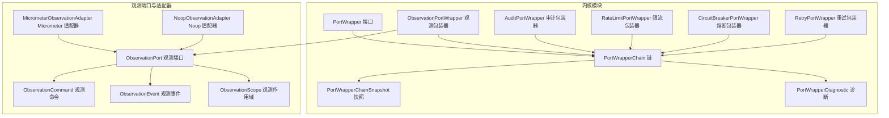
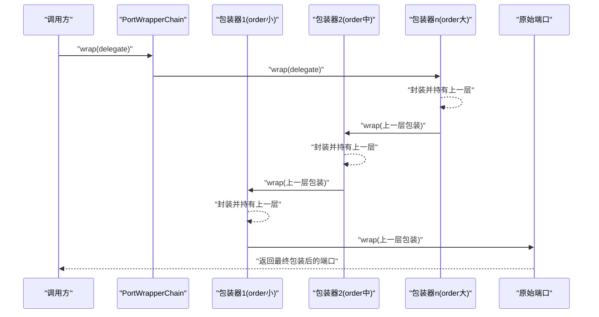
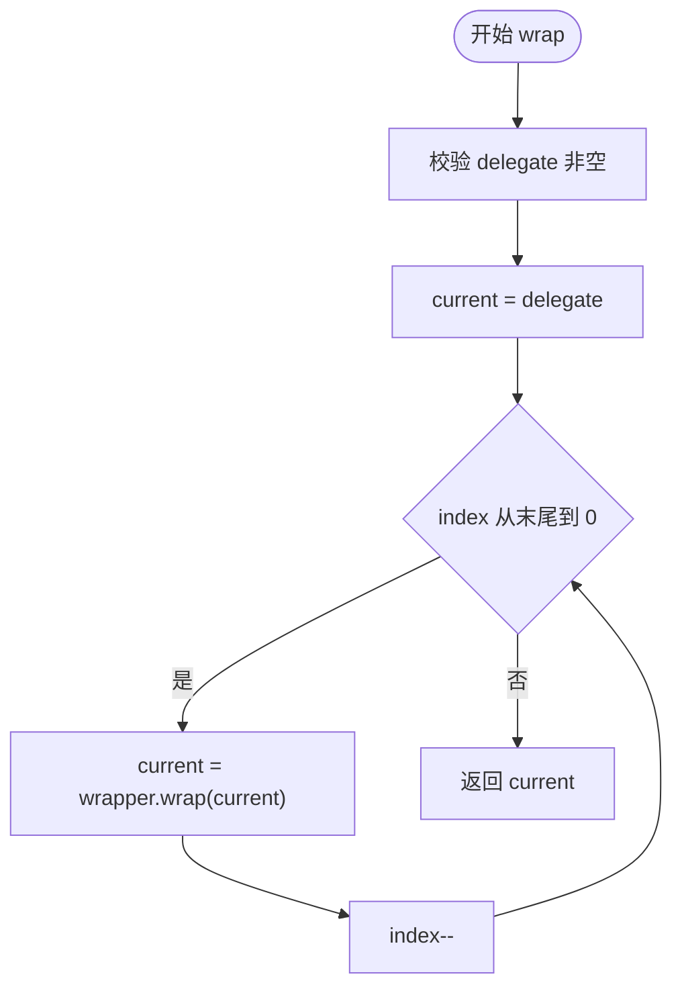
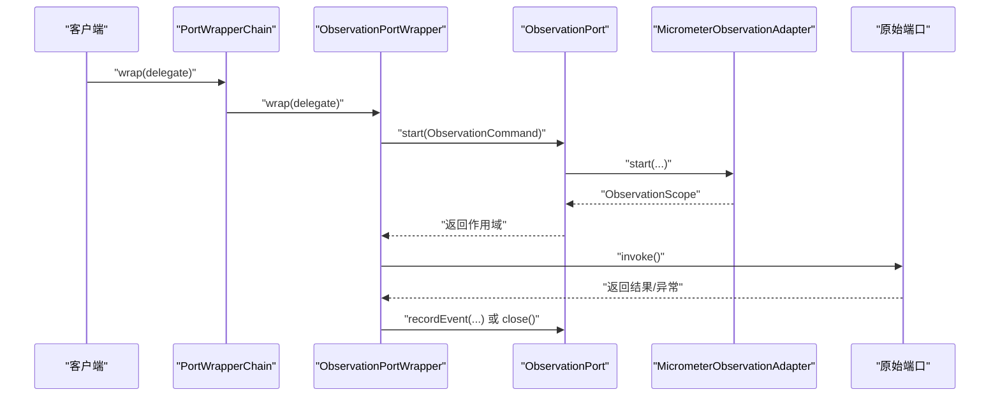
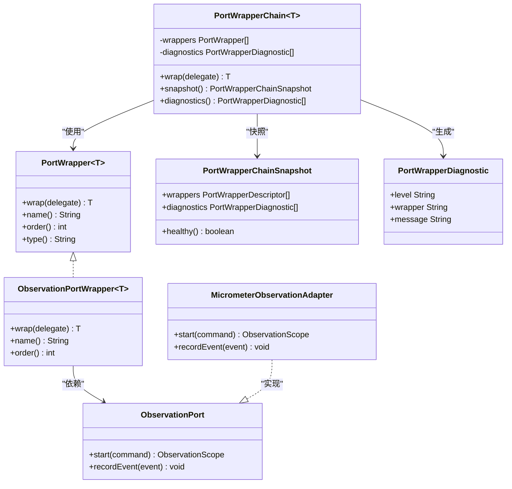

# 端口包装器链

<cite>
**本文引用的文件**
- [PortWrapper.java](file://seahorse-agent-kernel/src/main/java/com/miracle/ai/seahorse/agent/kernel/plugin/wrapper/PortWrapper.java)
- [PortWrapperChain.java](file://seahorse-agent-kernel/src/main/java/com/miracle/ai/seahorse/agent/kernel/plugin/wrapper/PortWrapperChain.java)
- [PortWrapperChainSnapshot.java](file://seahorse-agent-kernel/src/main/java/com/miracle/ai/seahorse/agent/kernel/plugin/wrapper/PortWrapperChainSnapshot.java)
- [PortWrapperDiagnostic.java](file://seahorse-agent-kernel/src/main/java/com/miracle/ai/seahorse/agent/kernel/plugin/wrapper/PortWrapperDiagnostic.java)
- [ObservationPortWrapper.java](file://seahorse-agent-kernel/src/main/java/com/miracle/ai/seahorse/agent/kernel/plugin/wrapper/ObservationPortWrapper.java)
- [AuditPortWrapper.java](file://seahorse-agent-kernel/src/main/java/com/miracle/ai/seahorse/agent/kernel/plugin/wrapper/AuditPortWrapper.java)
- [RateLimitPortWrapper.java](file://seahorse-agent-kernel/src/main/java/com/miracle/ai/seahorse/agent/kernel/plugin/wrapper/RateLimitPortWrapper.java)
- [CircuitBreakerPortWrapper.java](file://seahorse-agent-kernel/src/main/java/com/miracle/ai/seahorse/agent/kernel/plugin/wrapper/CircuitBreakerPortWrapper.java)
- [RetryPortWrapper.java](file://seahorse-agent-kernel/src/main/java/com/miracle/ai/seahorse/agent/kernel/plugin/wrapper/RetryPortWrapper.java)
- [ObservationPort.java](file://seahorse-agent-kernel/src/main/java/com/miracle/ai/seahorse/agent/ports/outbound/observation/ObservationPort.java)
- [ObservationCommand.java](file://seahorse-agent-kernel/src/main/java/com/miracle/ai/seahorse/agent/ports/outbound/observation/ObservationCommand.java)
- [ObservationEvent.java](file://seahorse-agent-kernel/src/main/java/com/miracle/ai/seahorse/agent/ports/outbound/observation/ObservationEvent.java)
- [ObservationScope.java](file://seahorse-agent-kernel/src/main/java/com/miracle/ai/seahorse/agent/ports/outbound/observation/ObservationScope.java)
- [MicrometerObservationAdapter.java](file://seahorse-agent-adapter-observation-micrometer/src/main/java/com/miracle/ai/seahorse/agent/adapters/observation/micrometer/MicrometerObservationAdapter.java)
- [NoopObservationAdapter.java](file://seahorse-agent-adapter-observation-noop/src/main/java/com/miracle/ai/seahorse/agent/adapters/observation/noop/NoopObservationAdapter.java)
- [RateLimitDecision.java](file://seahorse-agent-kernel/src/main/java/com/miracle/ai/seahorse/agent/ports/outbound/cache/RateLimitDecision.java)
- [PortWrapperChainTests.java](file://seahorse-agent-tests/src/test/java/com/miracle/ai/seahorse/agent/kernel/plugin/wrapper/PortWrapperChainTests.java)
- [ExtensionLoader.java](file://seahorse-agent-kernel/src/main/java/com/miracle/ai/seahorse/agent/kernel/plugin/ExtensionLoader.java)
</cite>

## 目录
1. [简介](#简介)
2. [项目结构](#项目结构)
3. [核心组件](#核心组件)
4. [架构总览](#架构总览)
5. [详细组件分析](#详细组件分析)
6. [依赖关系分析](#依赖关系分析)
7. [性能考量](#性能考量)
8. [故障排查指南](#故障排查指南)
9. [结论](#结论)
10. [附录：自定义包装器开发指南](#附录自定义包装器开发指南)

## 简介
本文件系统性阐述“端口包装器链”的设计与实现，覆盖以下主题：
- PortWrapper 接口的设计与职责边界（拦截点选择、上下文传递、异常处理）
- PortWrapperChain 的链式调用实现（组装顺序、执行流程、性能特性）
- PortWrapperChainSnapshot 的快照能力（状态捕获、健康度评估）
- PortWrapperDiagnostic 的诊断能力（错误追踪、告警级别）
- 典型横切关注点的实现示例（审计日志、熔断器、观测指标、限流控制、重试机制）
- 自定义包装器的开发指南与最佳实践

## 项目结构
围绕端口包装器链的核心代码位于内核模块的 wrapper 子包中，同时观测端口与适配器位于独立的适配器模块中。测试用例验证了包装器链的行为与诊断输出。

图表来源
- [PortWrapper.java:25-57](file://seahorse-agent-kernel/src/main/java/com/miracle/ai/seahorse/agent/kernel/plugin/wrapper/PortWrapper.java#L25-L57)
- [PortWrapperChain.java:31-94](file://seahorse-agent-kernel/src/main/java/com/miracle/ai/seahorse/agent/kernel/plugin/wrapper/PortWrapperChain.java#L31-L94)
- [PortWrapperChainSnapshot.java:29-50](file://seahorse-agent-kernel/src/main/java/com/miracle/ai/seahorse/agent/kernel/plugin/wrapper/PortWrapperChainSnapshot.java#L29-L50)
- [PortWrapperDiagnostic.java:29-44](file://seahorse-agent-kernel/src/main/java/com/miracle/ai/seahorse/agent/kernel/plugin/wrapper/PortWrapperDiagnostic.java#L29-L44)
- [ObservationPortWrapper.java:27-43](file://seahorse-agent-kernel/src/main/java/com/miracle/ai/seahorse/agent/kernel/plugin/wrapper/ObservationPortWrapper.java#L27-L43)
- [ObservationPort.java:25-42](file://seahorse-agent-kernel/src/main/java/com/miracle/ai/seahorse/agent/ports/outbound/observation/ObservationPort.java#L25-L42)
- [MicrometerObservationAdapter.java:56-89](file://seahorse-agent-adapter-observation-micrometer/src/main/java/com/miracle/ai/seahorse/agent/adapters/observation/micrometer/MicrometerObservationAdapter.java#L56-L89)
- [NoopObservationAdapter.java:32-54](file://seahorse-agent-adapter-observation-noop/src/main/java/com/miracle/ai/seahorse/agent/adapters/observation/noop/NoopObservationAdapter.java#L32-L54)

章节来源
- [PortWrapper.java:1-58](file://seahorse-agent-kernel/src/main/java/com/miracle/ai/seahorse/agent/kernel/plugin/wrapper/PortWrapper.java#L1-L58)
- [PortWrapperChain.java:1-95](file://seahorse-agent-kernel/src/main/java/com/miracle/ai/seahorse/agent/kernel/plugin/wrapper/PortWrapperChain.java#L1-L95)
- [PortWrapperChainSnapshot.java:1-51](file://seahorse-agent-kernel/src/main/java/com/miracle/ai/seahorse/agent/kernel/plugin/wrapper/PortWrapperChainSnapshot.java#L1-L51)
- [PortWrapperDiagnostic.java:1-44](file://seahorse-agent-kernel/src/main/java/com/miracle/ai/seahorse/agent/kernel/plugin/wrapper/PortWrapperDiagnostic.java#L1-L44)

## 核心组件
- PortWrapper 接口：定义包装器的统一契约，包括 wrap、name、order、type。order 数值越小越靠近调用入口，type 可用于区分不同类型的包装器。
- PortWrapperChain：负责对一组 PortWrapper 进行排序、组装与诊断；提供 wrap 方法按逆序应用包装器，形成洋葱模型。
- PortWrapperChainSnapshot：对当前链进行快照，暴露包装器元数据与诊断列表，并提供健康度判断。
- PortWrapperDiagnostic：记录诊断项，包含级别（INFO/WARN/ERROR）、包装器名与消息，便于运行时分析。

章节来源
- [PortWrapper.java:25-57](file://seahorse-agent-kernel/src/main/java/com/miracle/ai/seahorse/agent/kernel/plugin/wrapper/PortWrapper.java#L25-L57)
- [PortWrapperChain.java:31-94](file://seahorse-agent-kernel/src/main/java/com/miracle/ai/seahorse/agent/kernel/plugin/wrapper/PortWrapperChain.java#L31-L94)
- [PortWrapperChainSnapshot.java:29-50](file://seahorse-agent-kernel/src/main/java/com/miracle/ai/seahorse/agent/kernel/plugin/wrapper/PortWrapperChainSnapshot.java#L29-L50)
- [PortWrapperDiagnostic.java:29-44](file://seahorse-agent-kernel/src/main/java/com/miracle/ai/seahorse/agent/kernel/plugin/wrapper/PortWrapperDiagnostic.java#L29-L44)

## 架构总览
端口包装器链采用“洋葱模型”：最外层为靠近调用入口的包装器，内部逐层包裹原始端口。链在构建阶段完成排序与诊断，在运行阶段以 wrap 串联各包装器，最终返回被完整包装的端口实例。

图表来源
- [PortWrapperChain.java:51-58](file://seahorse-agent-kernel/src/main/java/com/miracle/ai/seahorse/agent/kernel/plugin/wrapper/PortWrapperChain.java#L51-L58)

章节来源
- [PortWrapperChain.java:36-58](file://seahorse-agent-kernel/src/main/java/com/miracle/ai/seahorse/agent/kernel/plugin/wrapper/PortWrapperChain.java#L36-L58)

## 详细组件分析

### PortWrapper 接口设计
- 拦截点：wrap 在调用前/后插入横切逻辑，典型位置在调用入口处（例如观测、审计）或调用出口处（例如熔断、重试）。
- 上下文传递：通过包装器链的顺序与嵌套，将上下文从外层向内层传递；在 wrap 中可读取/写入上下文。
- 异常处理：包装器可在调用前后捕获异常并进行转换、降级或重试策略。

章节来源
- [PortWrapper.java:25-57](file://seahorse-agent-kernel/src/main/java/com/miracle/ai/seahorse/agent/kernel/plugin/wrapper/PortWrapper.java#L25-L57)

### PortWrapperChain 链式调用实现
- 组装顺序：按 order 升序排序，构建时过滤空值；运行时以逆序遍历，确保最外层先 wrap。
- 执行流程：wrap 从 delegate 开始，逐层向内包裹，最终返回最外层包装后的端口。
- 性能考虑：排序与诊断仅在构建阶段发生；运行时为 O(n) 的简单迭代，开销极低。

图表来源
- [PortWrapperChain.java:51-58](file://seahorse-agent-kernel/src/main/java/com/miracle/ai/seahorse/agent/kernel/plugin/wrapper/PortWrapperChain.java#L51-L58)

章节来源
- [PortWrapperChain.java:36-58](file://seahorse-agent-kernel/src/main/java/com/miracle/ai/seahorse/agent/kernel/plugin/wrapper/PortWrapperChain.java#L36-L58)

### PortWrapperChainSnapshot 快照功能
- 捕获状态：快照包含每个包装器的 name、order、type 以及诊断列表。
- 健康度：healthy() 基于诊断级别判断，若存在 ERROR 则不健康。
- 分析用途：可用于运行时诊断、配置校验与可视化展示。

章节来源
- [PortWrapperChainSnapshot.java:29-50](file://seahorse-agent-kernel/src/main/java/com/miracle/ai/seahorse/agent/kernel/plugin/wrapper/PortWrapperChainSnapshot.java#L29-L50)

### PortWrapperDiagnostic 诊断能力
- 级别：INFO/WARN/ERROR，便于分级告警。
- 内容：包含包装器名与描述性消息，支持重复名称与顺序冲突检测。
- 生成：在诊断阶段收集，供快照与外部诊断工具使用。

章节来源
- [PortWrapperDiagnostic.java:29-44](file://seahorse-agent-kernel/src/main/java/com/miracle/ai/seahorse/agent/kernel/plugin/wrapper/PortWrapperDiagnostic.java#L29-L44)
- [PortWrapperChain.java:77-93](file://seahorse-agent-kernel/src/main/java/com/miracle/ai/seahorse/agent/kernel/plugin/wrapper/PortWrapperChain.java#L77-L93)

### 典型横切关注点实现示例

#### 观测（Observation）
- 顺序：固定在链最前端（order=10），确保所有后续包装器与业务调用均被观测。
- 适配器：MicrometerObservationAdapter 提供计时与事件上报；NoopObservationAdapter 提供空实现。
- 命令与事件：ObservationCommand/Event/Scope 定义观测生命周期与事件属性。

图表来源
- [ObservationPortWrapper.java:27-43](file://seahorse-agent-kernel/src/main/java/com/miracle/ai/seahorse/agent/kernel/plugin/wrapper/ObservationPortWrapper.java#L27-L43)
- [ObservationPort.java:25-42](file://seahorse-agent-kernel/src/main/java/com/miracle/ai/seahorse/agent/ports/outbound/observation/ObservationPort.java#L25-L42)
- [MicrometerObservationAdapter.java:56-89](file://seahorse-agent-adapter-observation-micrometer/src/main/java/com/miracle/ai/seahorse/agent/adapters/observation/micrometer/MicrometerObservationAdapter.java#L56-L89)

章节来源
- [ObservationPortWrapper.java:27-43](file://seahorse-agent-kernel/src/main/java/com/miracle/ai/seahorse/agent/kernel/plugin/wrapper/ObservationPortWrapper.java#L27-L43)
- [ObservationPort.java:25-42](file://seahorse-agent-kernel/src/main/java/com/miracle/ai/seahorse/agent/ports/outbound/observation/ObservationPort.java#L25-L42)
- [ObservationCommand.java:30-39](file://seahorse-agent-kernel/src/main/java/com/miracle/ai/seahorse/agent/ports/outbound/observation/ObservationCommand.java#L30-L39)
- [ObservationEvent.java:31-40](file://seahorse-agent-kernel/src/main/java/com/miracle/ai/seahorse/agent/ports/outbound/observation/ObservationEvent.java#L31-L40)
- [ObservationScope.java:23-34](file://seahorse-agent-kernel/src/main/java/com/miracle/ai/seahorse/agent/ports/outbound/observation/ObservationScope.java#L23-L34)
- [MicrometerObservationAdapter.java:56-89](file://seahorse-agent-adapter-observation-micrometer/src/main/java/com/miracle/ai/seahorse/agent/adapters/observation/micrometer/MicrometerObservationAdapter.java#L56-L89)
- [NoopObservationAdapter.java:32-54](file://seahorse-agent-adapter-observation-noop/src/main/java/com/miracle/ai/seahorse/agent/adapters/observation/noop/NoopObservationAdapter.java#L32-L54)

#### 审计（Audit）
- 顺序：在观测之后（order=20），用于记录调用上下文与结果。
- 作用：在 wrap 中记录调用者、参数、响应与耗时等信息。

章节来源
- [AuditPortWrapper.java:25-41](file://seahorse-agent-kernel/src/main/java/com/miracle/ai/seahorse/agent/kernel/plugin/wrapper/AuditPortWrapper.java#L25-L41)

#### 限流（Rate Limit）
- 顺序：在审计之后（order=30），用于在调用前检查配额与退避。
- 结果：使用 RateLimitDecision 表示允许/拒绝、剩余配额与建议等待时间。

章节来源
- [RateLimitPortWrapper.java:25-41](file://seahorse-agent-kernel/src/main/java/com/miracle/ai/seahorse/agent/kernel/plugin/wrapper/RateLimitPortWrapper.java#L25-L41)
- [RateLimitDecision.java:31-50](file://seahorse-agent-kernel/src/main/java/com/miracle/ai/seahorse/agent/ports/outbound/cache/RateLimitDecision.java#L31-L50)

#### 重试（Retry）
- 顺序：在限流之后（order=40），用于对可重试异常进行指数退避重试。
- 作用：在 wrap 中捕获异常并根据策略决定是否重试。

章节来源
- [RetryPortWrapper.java:25-41](file://seahorse-agent-kernel/src/main/java/com/miracle/ai/seahorse/agent/kernel/plugin/wrapper/RetryPortWrapper.java#L25-L41)

#### 熔断（Circuit Breaker）
- 顺序：在重试之后（order=50），用于在持续失败时快速失败，避免雪崩。
- 作用：在 wrap 中根据断路器状态决定放行或短路。

章节来源
- [CircuitBreakerPortWrapper.java:25-41](file://seahorse-agent-kernel/src/main/java/com/miracle/ai/seahorse/agent/kernel/plugin/wrapper/CircuitBreakerPortWrapper.java#L25-L41)

### 测试用例与行为验证
- 顺序验证：通过两个包装器的调用序列断言，验证最小 order 的包装器最先执行。
- 诊断验证：重复名称与相同 order 的冲突会生成诊断项，快照健康度为 false。

章节来源
- [PortWrapperChainTests.java:32-56](file://seahorse-agent-tests/src/test/java/com/miracle/ai/seahorse/agent/kernel/plugin/wrapper/PortWrapperChainTests.java#L32-L56)

## 依赖关系分析
- PortWrapperChain 依赖 PortWrapper 接口与诊断工具，构建时排序并生成诊断。
- 观测包装器依赖 ObservationPort，后者由 Micrometer 或 Noop 适配器实现。
- 限流、重试、熔断包装器为占位实现，实际行为由对应适配器或业务逻辑补充。

图表来源
- [PortWrapper.java:25-57](file://seahorse-agent-kernel/src/main/java/com/miracle/ai/seahorse/agent/kernel/plugin/wrapper/PortWrapper.java#L25-L57)
- [PortWrapperChain.java:31-94](file://seahorse-agent-kernel/src/main/java/com/miracle/ai/seahorse/agent/kernel/plugin/wrapper/PortWrapperChain.java#L31-L94)
- [PortWrapperChainSnapshot.java:29-50](file://seahorse-agent-kernel/src/main/java/com/miracle/ai/seahorse/agent/kernel/plugin/wrapper/PortWrapperChainSnapshot.java#L29-L50)
- [PortWrapperDiagnostic.java:29-44](file://seahorse-agent-kernel/src/main/java/com/miracle/ai/seahorse/agent/kernel/plugin/wrapper/PortWrapperDiagnostic.java#L29-L44)
- [ObservationPortWrapper.java:27-43](file://seahorse-agent-kernel/src/main/java/com/miracle/ai/seahorse/agent/kernel/plugin/wrapper/ObservationPortWrapper.java#L27-L43)
- [ObservationPort.java:25-42](file://seahorse-agent-kernel/src/main/java/com/miracle/ai/seahorse/agent/ports/outbound/observation/ObservationPort.java#L25-L42)
- [MicrometerObservationAdapter.java:56-89](file://seahorse-agent-adapter-observation-micrometer/src/main/java/com/miracle/ai/seahorse/agent/adapters/observation/micrometer/MicrometerObservationAdapter.java#L56-L89)

章节来源
- [PortWrapperChain.java:36-94](file://seahorse-agent-kernel/src/main/java/com/miracle/ai/seahorse/agent/kernel/plugin/wrapper/PortWrapperChain.java#L36-L94)

## 性能考量
- 构建期成本：排序与诊断在构造链时完成，复杂度 O(n log n)，n 为包装器数量。
- 运行期成本：wrap 为单次遍历，复杂度 O(n)，仅涉及对象引用与方法调用，开销极低。
- 顺序优化：合理设置 order 可减少不必要的包装层级，提升关键路径性能。
- 诊断与可观测：观测包装器在链首，可对所有后续调用进行统一观测，但需注意计时与事件上报的开销。

[本节为通用性能讨论，无需特定文件来源]

## 故障排查指南
- 快照健康度：通过 snapshot().healthy() 判断是否存在 ERROR 级诊断。
- 诊断项定位：查看 diagnostics 列表，结合包装器名称与消息定位问题。
- 常见问题：
  - 重复名称：触发错误诊断，需调整包装器名称。
  - 顺序冲突：同 order 多个包装器会触发警告诊断，建议统一顺序或拆分职责。
- 观测与事件：确认 ObservationPort 的适配器正确加载（Micrometer 或 Noop），并检查命令与事件标签是否符合预期。

章节来源
- [PortWrapperChainSnapshot.java:39-41](file://seahorse-agent-kernel/src/main/java/com/miracle/ai/seahorse/agent/kernel/plugin/wrapper/PortWrapperChainSnapshot.java#L39-L41)
- [PortWrapperChain.java:77-93](file://seahorse-agent-kernel/src/main/java/com/miracle/ai/seahorse/agent/kernel/plugin/wrapper/PortWrapperChain.java#L77-L93)
- [MicrometerObservationAdapter.java:56-89](file://seahorse-agent-adapter-observation-micrometer/src/main/java/com/miracle/ai/seahorse/agent/adapters/observation/micrometer/MicrometerObservationAdapter.java#L56-L89)

## 结论
端口包装器链通过清晰的接口与稳定的执行模型，为横切关注点提供了高内聚、低耦合的插拔式扩展机制。借助快照与诊断能力，可以在运行时对链的状态进行可观测与治理，保障系统的稳定性与可维护性。

[本节为总结性内容，无需特定文件来源]

## 附录：自定义包装器开发指南
- 实现 PortWrapper 接口
  - wrap：在调用前后插入横切逻辑，确保对 delegate 的非空校验与正确传递。
  - name：唯一且语义明确的名称，避免重复。
  - order：根据拦截点与职责设置顺序，越小越靠近调用入口。
  - type：可选，默认与 name 一致，用于区分类型。
- 最佳实践
  - 明确拦截点：在 wrap 中只做必要的包装，避免过度侵入。
  - 上下文传递：通过包装器链顺序与委托调用，将上下文从外层向内层传递。
  - 异常处理：在 wrap 中捕获并处理可恢复异常，必要时抛出或转换为业务异常。
  - 性能优先：避免在 wrap 中进行昂贵操作，如阻塞 IO、深度序列化等。
  - 诊断友好：在 wrap 中记录关键事件与耗时，便于观测与排障。
- 示例参考
  - 观测包装器：参考 ObservationPortWrapper 的顺序与依赖。
  - 审计包装器：参考 AuditPortWrapper 的顺序与职责。
  - 限流包装器：参考 RateLimitPortWrapper 的顺序与决策结果。
  - 重试包装器：参考 RetryPortWrapper 的顺序与重试策略。
  - 熔断包装器：参考 CircuitBreakerPortWrapper 的顺序与短路逻辑。

章节来源
- [PortWrapper.java:25-57](file://seahorse-agent-kernel/src/main/java/com/miracle/ai/seahorse/agent/kernel/plugin/wrapper/PortWrapper.java#L25-L57)
- [ObservationPortWrapper.java:27-43](file://seahorse-agent-kernel/src/main/java/com/miracle/ai/seahorse/agent/kernel/plugin/wrapper/ObservationPortWrapper.java#L27-L43)
- [AuditPortWrapper.java:25-41](file://seahorse-agent-kernel/src/main/java/com/miracle/ai/seahorse/agent/kernel/plugin/wrapper/AuditPortWrapper.java#L25-L41)
- [RateLimitPortWrapper.java:25-41](file://seahorse-agent-kernel/src/main/java/com/miracle/ai/seahorse/agent/kernel/plugin/wrapper/RateLimitPortWrapper.java#L25-L41)
- [RetryPortWrapper.java:25-41](file://seahorse-agent-kernel/src/main/java/com/miracle/ai/seahorse/agent/kernel/plugin/wrapper/RetryPortWrapper.java#L25-L41)
- [CircuitBreakerPortWrapper.java:25-41](file://seahorse-agent-kernel/src/main/java/com/miracle/ai/seahorse/agent/kernel/plugin/wrapper/CircuitBreakerPortWrapper.java#L25-L41)