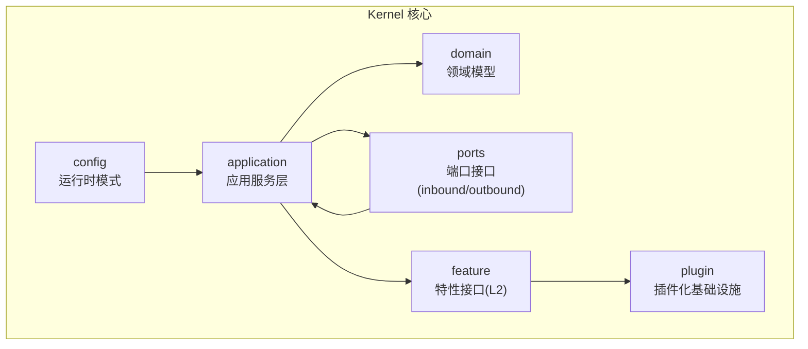
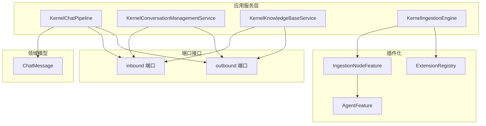
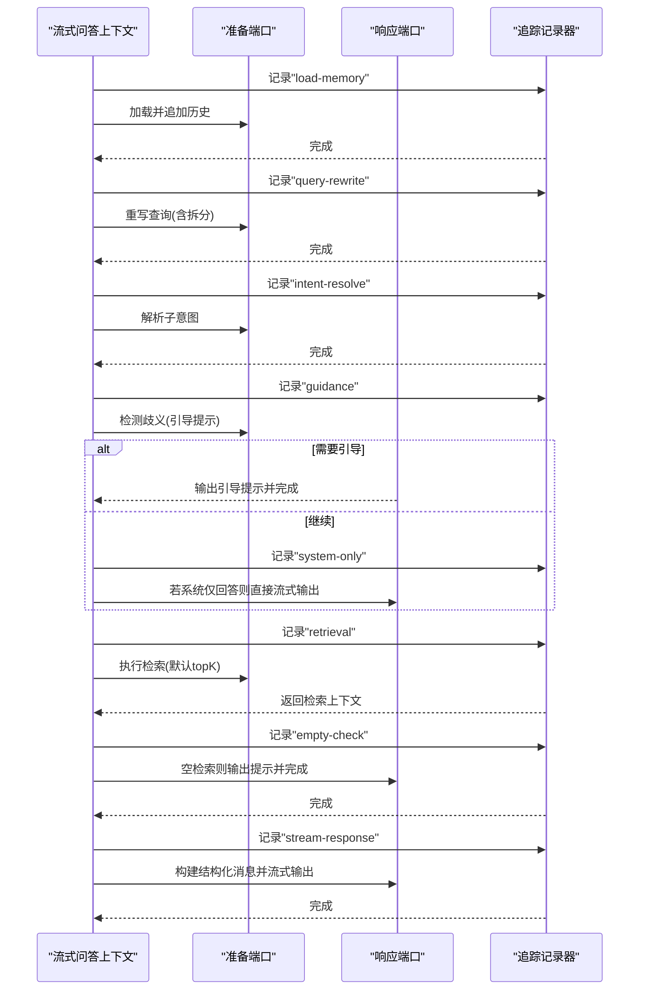
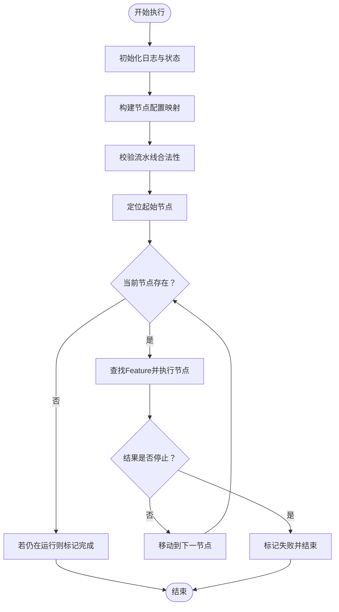
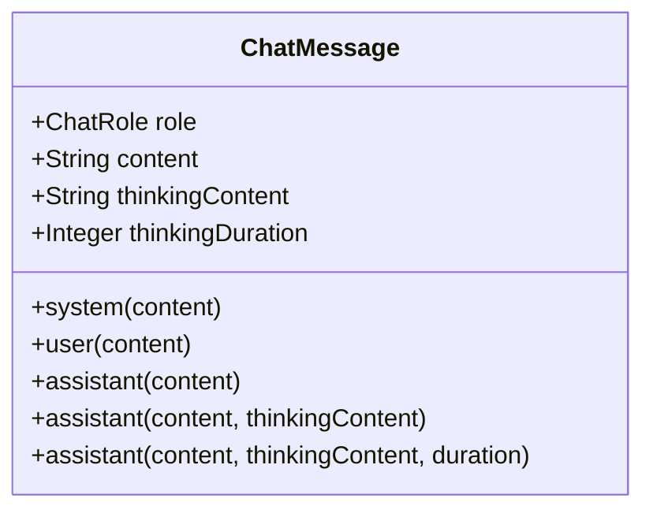
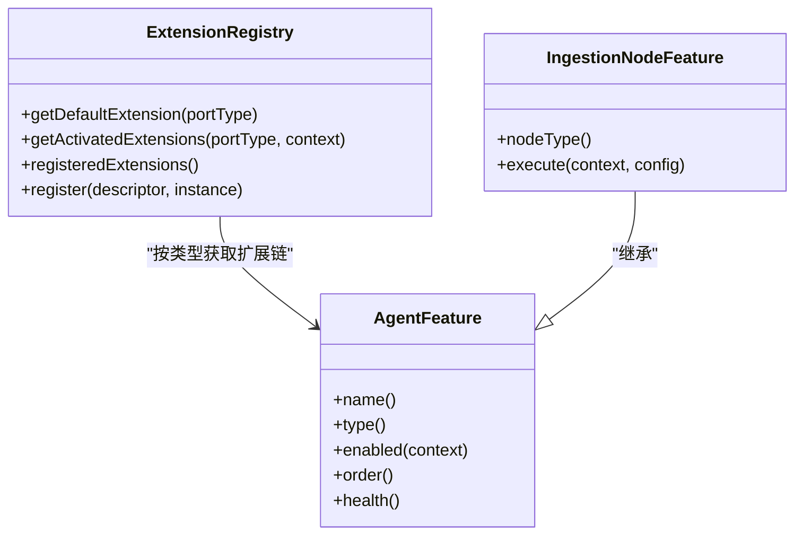
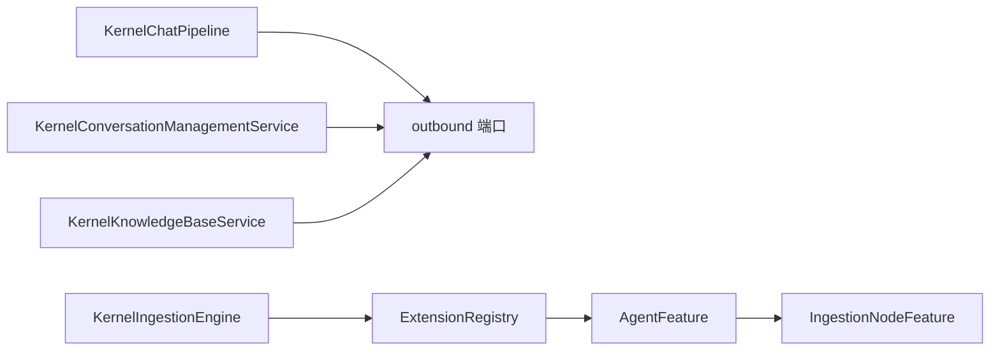

# 核心内核

<cite>
**本文引用的文件**   
- [KernelRuntimeMode.java](file://seahorse-agent-kernel/src/main/java/com/miracle/ai/seahorse/agent/kernel/config/KernelRuntimeMode.java)
- [KernelChatPipeline.java](file://seahorse-agent-kernel/src/main/java/com/miracle/ai/seahorse/agent/kernel/application/chat/KernelChatPipeline.java)
- [KernelConversationManagementService.java](file://seahorse-agent-kernel/src/main/java/com/miracle/ai/seahorse/agent/kernel/application/conversation/KernelConversationManagementService.java)
- [KernelKnowledgeBaseService.java](file://seahorse-agent-kernel/src/main/java/com/miracle/ai/seahorse/agent/kernel/application/knowledge/KernelKnowledgeBaseService.java)
- [KernelIngestionEngine.java](file://seahorse-agent-kernel/src/main/java/com/miracle/ai/seahorse/agent/kernel/application/ingestion/KernelIngestionEngine.java)
- [ChatMessage.java](file://seahorse-agent-kernel/src/main/java/com/miracle/ai/seahorse/agent/kernel/domain/chat/ChatMessage.java)
- [ExtensionRegistry.java](file://seahorse-agent-kernel/src/main/java/com/miracle/ai/seahorse/agent/kernel/plugin/ExtensionRegistry.java)
- [AgentFeature.java](file://seahorse-agent-kernel/src/main/java/com/miracle/ai/seahorse/agent/kernel/plugin/AgentFeature.java)
- [IngestionNodeFeature.java](file://seahorse-agent-kernel/src/main/java/com/miracle/ai/seahorse/agent/kernel/feature/ingestion/IngestionNodeFeature.java)
</cite>

## 目录
1. [简介](#简介)
2. [项目结构](#项目结构)
3. [核心组件](#核心组件)
4. [架构总览](#架构总览)
5. [详细组件分析](#详细组件分析)
6. [依赖分析](#依赖分析)
7. [性能考虑](#性能考虑)
8. [故障排查指南](#故障排查指南)
9. [结论](#结论)
10. [附录](#附录)

## 简介
本文件面向 Seahorse Agent 的核心内核模块，系统性梳理 Kernel 的整体架构设计与实现要点，重点覆盖以下方面：
- 应用服务层：聊天服务、知识库服务、会话管理服务、文档处理/入库编排等。
- 领域模型：实体、值对象、聚合根等在 Kernel 中的体现与职责边界。
- 端口接口：通过“端口-适配器”模式实现与外部系统的解耦。
- 运行模式：KernelRuntimeMode 的配置与切换机制。
- 扩展机制：插件化架构与 Feature 生命周期管理。

## 项目结构
Kernel 模块采用清晰的分层与职责划分：
- config：运行时模式配置
- application：应用服务层，封装业务用例与编排流程
- domain：领域模型与值对象
- feature：可插拔特性接口（L2 扩展）
- plugin：插件化基础设施（扩展注册、激活上下文、特征类型等）
- ports：端口接口（inbound/outbound），作为与外部交互的契约

图示来源
- [KernelRuntimeMode.java:25-46](file://seahorse-agent-kernel/src/main/java/com/miracle/ai/seahorse/agent/kernel/config/KernelRuntimeMode.java#L25-L46)
- [KernelChatPipeline.java:52-106](file://seahorse-agent-kernel/src/main/java/com/miracle/ai/seahorse/agent/kernel/application/chat/KernelChatPipeline.java#L52-L106)
- [KernelIngestionEngine.java:46-90](file://seahorse-agent-kernel/src/main/java/com/miracle/ai/seahorse/agent/kernel/application/ingestion/KernelIngestionEngine.java#L46-L90)
- [ExtensionRegistry.java:28-56](file://seahorse-agent-kernel/src/main/java/com/miracle/ai/seahorse/agent/kernel/plugin/ExtensionRegistry.java#L28-L56)

章节来源
- [KernelRuntimeMode.java:25-46](file://seahorse-agent-kernel/src/main/java/com/miracle/ai/seahorse/agent/kernel/config/KernelRuntimeMode.java#L25-L46)
- [KernelChatPipeline.java:52-106](file://seahorse-agent-kernel/src/main/java/com/miracle/ai/seahorse/agent/kernel/application/chat/KernelChatPipeline.java#L52-L106)
- [KernelIngestionEngine.java:46-90](file://seahorse-agent-kernel/src/main/java/com/miracle/ai/seahorse/agent/kernel/application/ingestion/KernelIngestionEngine.java#L46-L90)

## 核心组件
- KernelRuntimeMode：定义内核运行模式枚举及解析逻辑，默认模式为 kernel；支持从字符串标准化后解析为枚举值。
- KernelChatPipeline：问答主链路编排器，严格遵循加载记忆、重写查询、意图解析、引导提示、系统仅回答、检索、空结果处理、流式 RAG 响应的顺序。
- KernelConversationManagementService：会话管理应用服务，负责会话列表、重命名、删除、消息列表查询等。
- KernelKnowledgeBaseService：知识库管理应用服务，负责知识库的创建、更新、删除、分页查询、切片策略列举等，并协调对象存储桶与向量集合的准备。
- KernelIngestionEngine：入库编排引擎，负责流水线起始节点识别、串联执行、条件判断、失败中断、日志记录与最终状态收敛。

章节来源
- [KernelRuntimeMode.java:25-46](file://seahorse-agent-kernel/src/main/java/com/miracle/ai/seahorse/agent/kernel/config/KernelRuntimeMode.java#L25-L46)
- [KernelChatPipeline.java:52-106](file://seahorse-agent-kernel/src/main/java/com/miracle/ai/seahorse/agent/kernel/application/chat/KernelChatPipeline.java#L52-L106)
- [KernelConversationManagementService.java:31-86](file://seahorse-agent-kernel/src/main/java/com/miracle/ai/seahorse/agent/kernel/application/conversation/KernelConversationManagementService.java#L31-L86)
- [KernelKnowledgeBaseService.java:40-141](file://seahorse-agent-kernel/src/main/java/com/miracle/ai/seahorse/agent/kernel/application/knowledge/KernelKnowledgeBaseService.java#L40-L141)
- [KernelIngestionEngine.java:46-197](file://seahorse-agent-kernel/src/main/java/com/miracle/ai/seahorse/agent/kernel/application/ingestion/KernelIngestionEngine.java#L46-L197)

## 架构总览
Kernel 采用“端口-适配器”与“插件化”双层解耦：
- 端口接口：inbound/outbound 两类端口作为应用服务与外部系统的契约，避免直接依赖具体实现。
- 插件化：通过 ExtensionRegistry 与 AgentFeature 抽象，L2 特性以 Feature 形式注册与激活，内核仅通过端口类型获取扩展链。

图示来源
- [KernelChatPipeline.java:52-106](file://seahorse-agent-kernel/src/main/java/com/miracle/ai/seahorse/agent/kernel/application/chat/KernelChatPipeline.java#L52-L106)
- [KernelConversationManagementService.java:31-86](file://seahorse-agent-kernel/src/main/java/com/miracle/ai/seahorse/agent/kernel/application/conversation/KernelConversationManagementService.java#L31-L86)
- [KernelKnowledgeBaseService.java:40-141](file://seahorse-agent-kernel/src/main/java/com/miracle/ai/seahorse/agent/kernel/application/knowledge/KernelKnowledgeBaseService.java#L40-L141)
- [KernelIngestionEngine.java:46-197](file://seahorse-agent-kernel/src/main/java/com/miracle/ai/seahorse/agent/kernel/application/ingestion/KernelIngestionEngine.java#L46-L197)
- [ExtensionRegistry.java:28-56](file://seahorse-agent-kernel/src/main/java/com/miracle/ai/seahorse/agent/kernel/plugin/ExtensionRegistry.java#L28-L56)
- [AgentFeature.java:26-79](file://seahorse-agent-kernel/src/main/java/com/miracle/ai/seahorse/agent/kernel/plugin/AgentFeature.java#L26-L79)
- [IngestionNodeFeature.java:32-54](file://seahorse-agent-kernel/src/main/java/com/miracle/ai/seahorse/agent/kernel/feature/ingestion/IngestionNodeFeature.java#L32-L54)

## 详细组件分析

### KernelRuntimeMode：运行模式配置与切换
- 设计要点
  - 枚举值 KERNEL 对应默认内核模式。
  - 提供 from 方法，支持从字符串解析，进行空白校验、去横线转下划线、大写归一化后映射到枚举。
- 使用建议
  - 在启动阶段读取配置并调用 from 进行解析，确保运行模式的健壮性。
  - 未来可扩展其他模式（如兼容模式、调试模式）时，保持解析逻辑不变即可。

章节来源
- [KernelRuntimeMode.java:25-46](file://seahorse-agent-kernel/src/main/java/com/miracle/ai/seahorse/agent/kernel/config/KernelRuntimeMode.java#L25-L46)

### KernelChatPipeline：问答主链路编排
- 编排步骤
  - 加载记忆：从记忆端口加载历史并拼接当前用户问题。
  - 查询重写：对原始问题与历史进行重写与拆分。
  - 意图解析：将重写后的查询解析为子意图。
  - 引导提示：若检测到歧义，输出引导提示并结束。
  - 系统仅回答：当所有子意图均为系统仅回答时，直接流式输出系统提示。
  - 检索：基于子意图与默认 topK 执行检索，生成检索上下文。
  - 空检索处理：若无结果，输出提示并结束。
  - 流式 RAG 响应：构建结构化消息，按检索通道选择采样参数，流式输出。
- 关键端口
  - 准备端口：记忆、查询重写、意图解析、检索上下文。
  - 响应端口：提示模板、RAG 提示构建、流式模型、流式任务绑定。
- 性能与可观测性
  - 每个阶段均通过追踪记录节点开始命令，便于诊断与性能分析。
  - 根据检索通道动态调整温度与 topP，平衡质量与稳定性。

图示来源
- [KernelChatPipeline.java:83-106](file://seahorse-agent-kernel/src/main/java/com/miracle/ai/seahorse/agent/kernel/application/chat/KernelChatPipeline.java#L83-L106)
- [KernelChatPipeline.java:108-173](file://seahorse-agent-kernel/src/main/java/com/miracle/ai/seahorse/agent/kernel/application/chat/KernelChatPipeline.java#L108-L173)
- [KernelChatPipeline.java:167-236](file://seahorse-agent-kernel/src/main/java/com/miracle/ai/seahorse/agent/kernel/application/chat/KernelChatPipeline.java#L167-L236)

章节来源
- [KernelChatPipeline.java:52-281](file://seahorse-agent-kernel/src/main/java/com/miracle/ai/seahorse/agent/kernel/application/chat/KernelChatPipeline.java#L52-L281)

### KernelConversationManagementService：会话管理服务
- 职责
  - 列出会话、重命名会话、删除会话、列出消息。
  - 参数校验：标题长度限制、非空校验。
  - 与仓库端口交互，保证操作原子性与一致性。
- 错误处理
  - 当重命名/删除/查询不存在时抛出明确异常，便于上层处理。

章节来源
- [KernelConversationManagementService.java:31-86](file://seahorse-agent-kernel/src/main/java/com/miracle/ai/seahorse/agent/kernel/application/conversation/KernelConversationManagementService.java#L31-L86)

### KernelKnowledgeBaseService：知识库管理服务
- 职责
  - 创建知识库：校验名称唯一性、确保对象存储桶与向量集合存在，持久化记录。
  - 更新知识库：校验名称唯一性、禁止在已有向量化文档时变更嵌入模型、更新元数据。
  - 删除知识库：前置校验（存在文档则拒绝）、执行删除并校验归属。
  - 分页查询与切片策略列举。
- 外部协作
  - 对象存储端口：确保桶存在。
  - 向量集合管理端口：确保集合存在。
  - 仓库端口：CRUD 与查询。

章节来源
- [KernelKnowledgeBaseService.java:40-141](file://seahorse-agent-kernel/src/main/java/com/miracle/ai/seahorse/agent/kernel/application/knowledge/KernelKnowledgeBaseService.java#L40-L141)

### KernelIngestionEngine：入库编排引擎
- 职责
  - 解析并校验流水线：构建节点映射、验证 nextNodeId 引用合法性、检测环。
  - 执行链路：按起始节点串联执行，支持条件判断、失败中断、节点主动终止。
  - 日志与状态：记录节点执行日志、设置状态（运行中/已完成/失败）。
- 扩展机制
  - 通过 ExtensionRegistry 获取已激活的 IngestionNodeFeature，按 nodeType 查找对应节点实现。
  - FeatureActivationContext 控制 Feature 启用与排序。

图示来源
- [KernelIngestionEngine.java:79-90](file://seahorse-agent-kernel/src/main/java/com/miracle/ai/seahorse/agent/kernel/application/ingestion/KernelIngestionEngine.java#L79-L90)
- [KernelIngestionEngine.java:126-144](file://seahorse-agent-kernel/src/main/java/com/miracle/ai/seahorse/agent/kernel/application/ingestion/KernelIngestionEngine.java#L126-L144)
- [KernelIngestionEngine.java:146-186](file://seahorse-agent-kernel/src/main/java/com/miracle/ai/seahorse/agent/kernel/application/ingestion/KernelIngestionEngine.java#L146-L186)

章节来源
- [KernelIngestionEngine.java:46-197](file://seahorse-agent-kernel/src/main/java/com/miracle/ai/seahorse/agent/kernel/application/ingestion/KernelIngestionEngine.java#L46-L197)

### 领域模型：实体、值对象与聚合根
- ChatMessage：对话消息值对象，包含角色、内容、思考内容与思考时长等字段，提供多种构造工厂方法，用于统一消息表达。
- 其他领域模型：在 domain/chat、domain/ingestion、domain/intent、domain/memory、domain/retrieval、domain/stream、domain/trace、domain/vector 等包中定义，涵盖查询重写、意图树、检索上下文、流式回调、追踪节点等。

图示来源
- [ChatMessage.java:30-66](file://seahorse-agent-kernel/src/main/java/com/miracle/ai/seahorse/agent/kernel/domain/chat/ChatMessage.java#L30-L66)

章节来源
- [ChatMessage.java:30-66](file://seahorse-agent-kernel/src/main/java/com/miracle/ai/seahorse/agent/kernel/domain/chat/ChatMessage.java#L30-L66)

### 端口接口与解耦设计
- 端口契约：inbound/outbound 两类端口作为应用服务与外部系统的边界，避免直接依赖具体实现（如数据库、缓存、向量库、对象存储等）。
- 解耦策略：
  - 应用服务仅依赖端口接口，不关心具体适配器实现。
  - 适配器通过 SPI 或自动装配注入，实现环境无关的替换。
- 优势：
  - 易于测试（可用内存适配器替代真实外部系统）。
  - 易于扩展（新增适配器无需改动应用服务）。
  - 易于运维（通过配置切换适配器）。

### 插件化与扩展指南
- ExtensionRegistry：提供默认扩展获取、已激活扩展链获取、扩展注册等能力，屏蔽具体实现细节。
- AgentFeature：定义 Feature 的名称、类型、启用条件、排序与健康状态，统一治理 L2 扩展。
- IngestionNodeFeature：入库节点特性接口，保留现有节点扩展语义，由内核负责流水线控制与错误处理。

图示来源
- [ExtensionRegistry.java:28-82](file://seahorse-agent-kernel/src/main/java/com/miracle/ai/seahorse/agent/kernel/plugin/ExtensionRegistry.java#L28-L82)
- [AgentFeature.java:26-79](file://seahorse-agent-kernel/src/main/java/com/miracle/ai/seahorse/agent/kernel/plugin/AgentFeature.java#L26-L79)
- [IngestionNodeFeature.java:32-54](file://seahorse-agent-kernel/src/main/java/com/miracle/ai/seahorse/agent/kernel/feature/ingestion/IngestionNodeFeature.java#L32-L54)

章节来源
- [ExtensionRegistry.java:28-82](file://seahorse-agent-kernel/src/main/java/com/miracle/ai/seahorse/agent/kernel/plugin/ExtensionRegistry.java#L28-L82)
- [AgentFeature.java:26-79](file://seahorse-agent-kernel/src/main/java/com/miracle/ai/seahorse/agent/kernel/plugin/AgentFeature.java#L26-L79)
- [IngestionNodeFeature.java:32-54](file://seahorse-agent-kernel/src/main/java/com/miracle/ai/seahorse/agent/kernel/feature/ingestion/IngestionNodeFeature.java#L32-L54)

## 依赖分析
- 应用服务对端口的依赖：应用服务通过端口接口与外部交互，端口实现由适配器提供，内核不直接依赖具体实现。
- 插件化依赖：内核通过 ExtensionRegistry 获取 Feature 扩展链，Feature 通过 AgentFeature 接口统一治理。
- 数据流：应用服务接收 inbound 端口请求，经领域模型处理后，通过 outbound 端口与外部系统交互。

图示来源
- [KernelChatPipeline.java:62-76](file://seahorse-agent-kernel/src/main/java/com/miracle/ai/seahorse/agent/kernel/application/chat/KernelChatPipeline.java#L62-L76)
- [KernelConversationManagementService.java:35-39](file://seahorse-agent-kernel/src/main/java/com/miracle/ai/seahorse/agent/kernel/application/conversation/KernelConversationManagementService.java#L35-L39)
- [KernelKnowledgeBaseService.java:44-54](file://seahorse-agent-kernel/src/main/java/com/miracle/ai/seahorse/agent/kernel/application/knowledge/KernelKnowledgeBaseService.java#L44-L54)
- [KernelIngestionEngine.java:50-70](file://seahorse-agent-kernel/src/main/java/com/miracle/ai/seahorse/agent/kernel/application/ingestion/KernelIngestionEngine.java#L50-L70)
- [ExtensionRegistry.java:28-56](file://seahorse-agent-kernel/src/main/java/com/miracle/ai/seahorse/agent/kernel/plugin/ExtensionRegistry.java#L28-L56)
- [AgentFeature.java:26-79](file://seahorse-agent-kernel/src/main/java/com/miracle/ai/seahorse/agent/kernel/plugin/AgentFeature.java#L26-L79)
- [IngestionNodeFeature.java:32-54](file://seahorse-agent-kernel/src/main/java/com/miracle/ai/seahorse/agent/kernel/feature/ingestion/IngestionNodeFeature.java#L32-L54)

章节来源
- [KernelChatPipeline.java:62-76](file://seahorse-agent-kernel/src/main/java/com/miracle/ai/seahorse/agent/kernel/application/chat/KernelChatPipeline.java#L62-L76)
- [KernelIngestionEngine.java:50-70](file://seahorse-agent-kernel/src/main/java/com/miracle/ai/seahorse/agent/kernel/application/ingestion/KernelIngestionEngine.java#L50-L70)

## 性能考虑
- 流式输出：问答与检索均采用流式回调，降低首字节延迟，提升用户体验。
- 条件短路：在歧义引导、系统仅回答、空检索等场景提前返回，减少无效计算。
- 动态采样参数：根据检索通道自动选择温度与 topP，兼顾质量与稳定性。
- 日志与追踪：节点级追踪与执行日志有助于定位瓶颈与异常。

## 故障排查指南
- 运行模式解析失败
  - 现象：传入空或非法字符串导致模式解析异常。
  - 处理：确保配置值非空且符合枚举定义，必要时回退到默认模式。
- 会话管理异常
  - 现象：重命名/删除/查询不存在会话抛出异常。
  - 处理：上层捕获并提示用户或引导重新选择会话。
- 知识库操作异常
  - 现象：名称重复、已有向量化文档时变更嵌入模型、删除前仍有文档等。
  - 处理：先清理依赖再执行操作，或提示用户按指引处理。
- 入库流水线异常
  - 现象：找不到下一节点、节点配置缺失、节点返回空结果、执行环等。
  - 处理：检查流水线配置与节点映射，修复引用与节点类型，避免环形依赖。

章节来源
- [KernelRuntimeMode.java:39-45](file://seahorse-agent-kernel/src/main/java/com/miracle/ai/seahorse/agent/kernel/config/KernelRuntimeMode.java#L39-L45)
- [KernelConversationManagementService.java:50-61](file://seahorse-agent-kernel/src/main/java/com/miracle/ai/seahorse/agent/kernel/application/conversation/KernelConversationManagementService.java#L50-L61)
- [KernelKnowledgeBaseService.java:62-88](file://seahorse-agent-kernel/src/main/java/com/miracle/ai/seahorse/agent/kernel/application/knowledge/KernelKnowledgeBaseService.java#L62-L88)
- [KernelIngestionEngine.java:105-132](file://seahorse-agent-kernel/src/main/java/com/miracle/ai/seahorse/agent/kernel/application/ingestion/KernelIngestionEngine.java#L105-L132)

## 结论
Kernel 通过清晰的分层、严格的端口契约与插件化架构，实现了业务用例与外部系统的高内聚低耦合。问答编排、会话管理、知识库管理与入库编排等核心能力均以应用服务形式对外提供，既保证了可维护性，也为后续扩展与演进奠定了坚实基础。

## 附录
- 最佳实践
  - 以端口接口驱动开发，避免在应用服务中直接依赖具体实现。
  - 使用 ExtensionRegistry 管理 Feature，确保启用条件与排序可控。
  - 在关键路径引入追踪与日志，便于问题定位与性能优化。
  - 对外暴露的入参进行严格校验，异常信息明确可诊断。