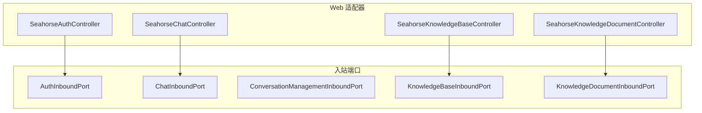
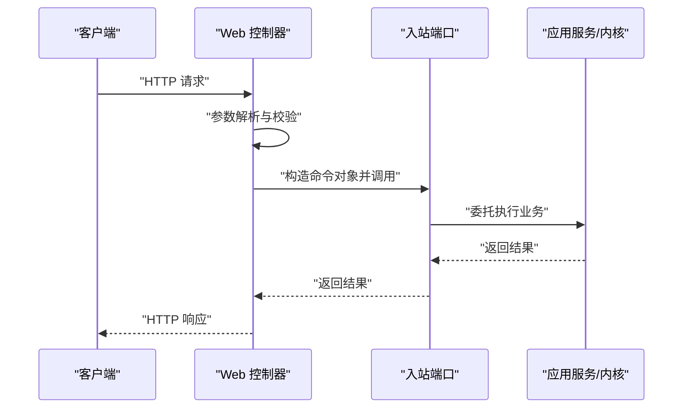
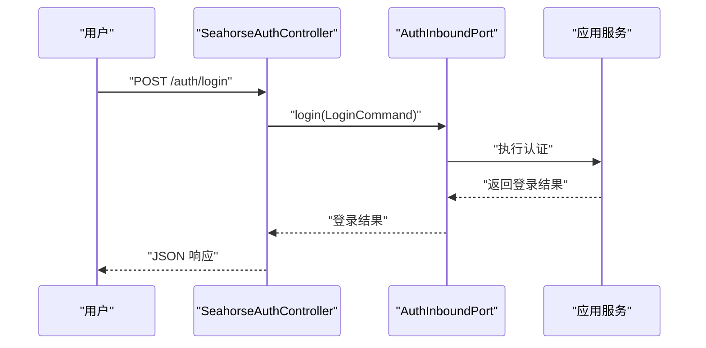
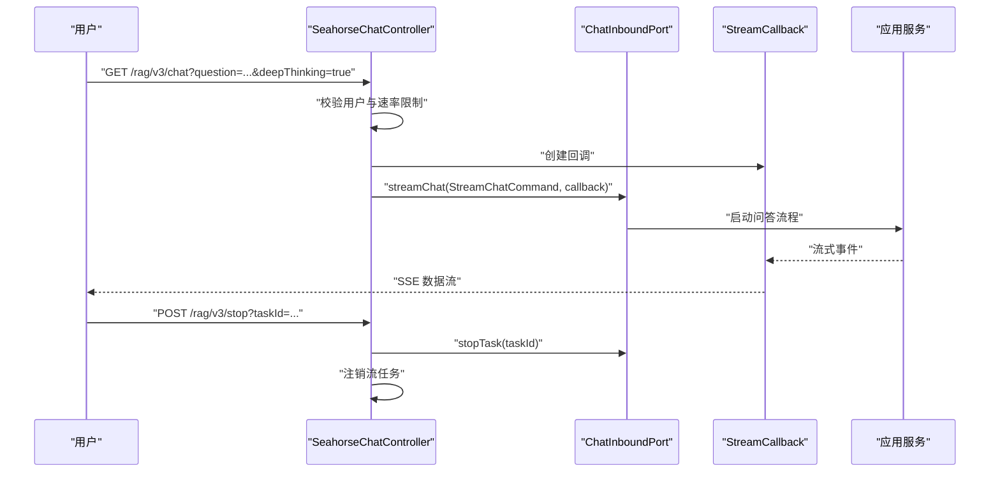
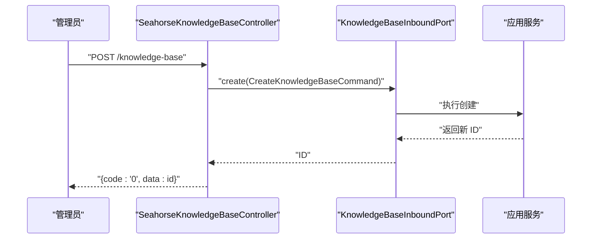
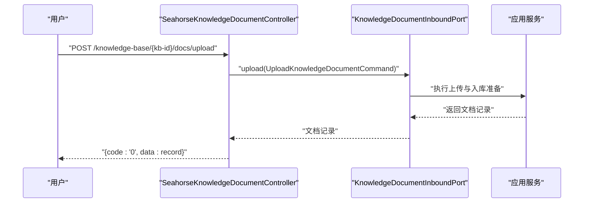
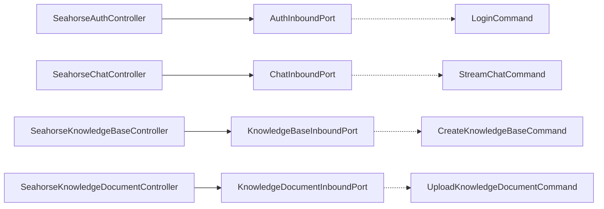

# 入站端口

<cite>
**本文引用的文件**
- [AuthInboundPort.java](file://seahorse-agent-kernel/src/main/java/com/miracle/ai/seahorse/agent/ports/inbound/auth/AuthInboundPort.java)
- [LoginCommand.java](file://seahorse-agent-kernel/src/main/java/com/miracle/ai/seahorse/agent/ports/inbound/auth/LoginCommand.java)
- [ChatInboundPort.java](file://seahorse-agent-kernel/src/main/java/com/miracle/ai/seahorse/agent/ports/inbound/chat/ChatInboundPort.java)
- [StreamChatCommand.java](file://seahorse-agent-kernel/src/main/java/com/miracle/ai/seahorse/agent/ports/inbound/chat/StreamChatCommand.java)
- [ConversationManagementInboundPort.java](file://seahorse-agent-kernel/src/main/java/com/miracle/ai/seahorse/agent/ports/inbound/conversation/ConversationManagementInboundPort.java)
- [KnowledgeBaseInboundPort.java](file://seahorse-agent-kernel/src/main/java/com/miracle/ai/seahorse/agent/ports/inbound/knowledge/KnowledgeBaseInboundPort.java)
- [CreateKnowledgeBaseCommand.java](file://seahorse-agent-kernel/src/main/java/com/miracle/ai/seahorse/agent/ports/inbound/knowledge/CreateKnowledgeBaseCommand.java)
- [KnowledgeDocumentInboundPort.java](file://seahorse-agent-kernel/src/main/java/com/miracle/ai/seahorse/agent/ports/inbound/knowledge/KnowledgeDocumentInboundPort.java)
- [UploadKnowledgeDocumentCommand.java](file://seahorse-agent-kernel/src/main/java/com/miracle/ai/seahorse/agent/ports/inbound/knowledge/UploadKnowledgeDocumentCommand.java)
- [SeahorseAuthController.java](file://seahorse-agent-adapter-web/src/main/java/com/miracle/ai/seahorse/agent/adapters/web/SeahorseAuthController.java)
- [SeahorseChatController.java](file://seahorse-agent-adapter-web/src/main/java/com/miracle/ai/seahorse/agent/adapters/web/SeahorseChatController.java)
- [SeahorseKnowledgeBaseController.java](file://seahorse-agent-adapter-web/src/main/java/com/miracle/ai/seahorse/agent/adapters/web/SeahorseKnowledgeBaseController.java)
- [SeahorseKnowledgeDocumentController.java](file://seahorse-agent-adapter-web/src/main/java/com/miracle/ai/seahorse/agent/adapters/web/SeahorseKnowledgeDocumentController.java)
</cite>

## 目录
1. [引言](#引言)
2. [项目结构](#项目结构)
3. [核心组件](#核心组件)
4. [架构总览](#架构总览)
5. [详细组件分析](#详细组件分析)
6. [依赖分析](#依赖分析)
7. [性能考虑](#性能考虑)
8. [故障排查指南](#故障排查指南)
9. [结论](#结论)
10. [附录](#附录)

## 引言
本文件聚焦于 Kernel 中的“入站端口”（Inbound Ports），系统性阐述其设计理念、命令对象设计、异常处理机制，以及与应用服务层的交互方式。入站端口作为领域驱动设计中的边界，隔离外部系统（如 Web 控制器、消息消费者、CLI）对内核业务逻辑的直接侵入，统一通过命令对象与领域服务交互，确保业务规则集中在内核层，便于测试、演进与维护。

## 项目结构
入站端口位于 Kernel 模块的 ports.inbound 包下，按功能域划分：认证、聊天、会话管理、知识库与知识文档等。Web 适配器通过 Spring MVC 将 HTTP 请求转换为命令对象，并调用对应的入站端口方法，完成从协议到领域的解耦。

图表来源
- [SeahorseAuthController.java:30-56](file://seahorse-agent-adapter-web/src/main/java/com/miracle/ai/seahorse/agent/adapters/web/SeahorseAuthController.java#L30-L56)
- [SeahorseChatController.java:43-81](file://seahorse-agent-adapter-web/src/main/java/com/miracle/ai/seahorse/agent/adapters/web/SeahorseChatController.java#L43-L81)
- [SeahorseKnowledgeBaseController.java:44-58](file://seahorse-agent-adapter-web/src/main/java/com/miracle/ai/seahorse/agent/adapters/web/SeahorseKnowledgeBaseController.java#L44-L58)
- [SeahorseKnowledgeDocumentController.java:50-64](file://seahorse-agent-adapter-web/src/main/java/com/miracle/ai/seahorse/agent/adapters/web/SeahorseKnowledgeDocumentController.java#L50-L64)

章节来源
- [AuthInboundPort.java:20-25](file://seahorse-agent-kernel/src/main/java/com/miracle/ai/seahorse/agent/ports/inbound/auth/AuthInboundPort.java#L20-L25)
- [ChatInboundPort.java:27-43](file://seahorse-agent-kernel/src/main/java/com/miracle/ai/seahorse/agent/ports/inbound/chat/ChatInboundPort.java#L27-L43)
- [ConversationManagementInboundPort.java:28-37](file://seahorse-agent-kernel/src/main/java/com/miracle/ai/seahorse/agent/ports/inbound/conversation/ConversationManagementInboundPort.java#L28-L37)
- [KnowledgeBaseInboundPort.java:29-42](file://seahorse-agent-kernel/src/main/java/com/miracle/ai/seahorse/agent/ports/inbound/knowledge/KnowledgeBaseInboundPort.java#L29-L42)
- [KnowledgeDocumentInboundPort.java:34-121](file://seahorse-agent-kernel/src/main/java/com/miracle/ai/seahorse/agent/ports/inbound/knowledge/KnowledgeDocumentInboundPort.java#L34-L121)

## 核心组件
- 认证入站端口（AuthInboundPort）
  - 方法：登录、登出
  - 输入：LoginCommand
  - 输出：登录结果对象（由实现返回）
- 聊天入站端口（ChatInboundPort）
  - 方法：流式问答、取消任务
  - 输入：StreamChatCommand + 流式回调
  - 输出：SSE 流式响应（由回调驱动）
- 会话管理入站端口（ConversationManagementInboundPort）
  - 方法：列出会话、重命名、删除、列出消息
  - 输入：用户标识、会话标识等
  - 输出：会话与消息记录列表
- 知识库入站端口（KnowledgeBaseInboundPort）
  - 方法：创建、更新、删除、查询、分页、列举分块策略
  - 输入：Create/Update 命令、分页命令、ID
  - 输出：记录、分页结果、策略列表
- 知识库文档入站端口（KnowledgeDocumentInboundPort）
  - 方法：上传、开始分块、执行分块、查询详情、分页、搜索、更新、启停、删除、查看分块日志
  - 输入：Upload/Update/Enable/Delete/Chunk/Logs 命令
  - 输出：文档记录、详情、分页、摘要、日志分页

章节来源
- [AuthInboundPort.java:20-25](file://seahorse-agent-kernel/src/main/java/com/miracle/ai/seahorse/agent/ports/inbound/auth/AuthInboundPort.java#L20-L25)
- [LoginCommand.java:20-21](file://seahorse-agent-kernel/src/main/java/com/miracle/ai/seahorse/agent/ports/inbound/auth/LoginCommand.java#L20-L21)
- [ChatInboundPort.java:27-43](file://seahorse-agent-kernel/src/main/java/com/miracle/ai/seahorse/agent/ports/inbound/chat/ChatInboundPort.java#L27-L43)
- [StreamChatCommand.java:25-45](file://seahorse-agent-kernel/src/main/java/com/miracle/ai/seahorse/agent/ports/inbound/chat/StreamChatCommand.java#L25-L45)
- [ConversationManagementInboundPort.java:28-37](file://seahorse-agent-kernel/src/main/java/com/miracle/ai/seahorse/agent/ports/inbound/conversation/ConversationManagementInboundPort.java#L28-L37)
- [KnowledgeBaseInboundPort.java:29-42](file://seahorse-agent-kernel/src/main/java/com/miracle/ai/seahorse/agent/ports/inbound/knowledge/KnowledgeBaseInboundPort.java#L29-L42)
- [CreateKnowledgeBaseCommand.java:23-24](file://seahorse-agent-kernel/src/main/java/com/miracle/ai/seahorse/agent/ports/inbound/knowledge/CreateKnowledgeBaseCommand.java#L23-L24)
- [KnowledgeDocumentInboundPort.java:34-121](file://seahorse-agent-kernel/src/main/java/com/miracle/ai/seahorse/agent/ports/inbound/knowledge/KnowledgeDocumentInboundPort.java#L34-L121)
- [UploadKnowledgeDocumentCommand.java:30-46](file://seahorse-agent-kernel/src/main/java/com/miracle/ai/seahorse/agent/ports/inbound/knowledge/UploadKnowledgeDocumentCommand.java#L30-L46)

## 架构总览
入站端口以“命令对象 + 接口”的形式暴露能力，Web 控制器仅承担协议转换职责，不包含业务逻辑。命令对象负责承载参数校验与默认值设置，确保调用方无需关心内核细节。

图表来源
- [SeahorseAuthController.java:44-55](file://seahorse-agent-adapter-web/src/main/java/com/miracle/ai/seahorse/agent/adapters/web/SeahorseAuthController.java#L44-L55)
- [SeahorseChatController.java:83-102](file://seahorse-agent-adapter-web/src/main/java/com/miracle/ai/seahorse/agent/adapters/web/SeahorseChatController.java#L83-L102)
- [SeahorseKnowledgeBaseController.java:60-97](file://seahorse-agent-adapter-web/src/main/java/com/miracle/ai/seahorse/agent/adapters/web/SeahorseKnowledgeBaseController.java#L60-L97)
- [SeahorseKnowledgeDocumentController.java:66-117](file://seahorse-agent-adapter-web/src/main/java/com/miracle/ai/seahorse/agent/adapters/web/SeahorseKnowledgeDocumentController.java#L66-L117)

## 详细组件分析

### 认入站端口（AuthInboundPort）
- 设计要点
  - 仅暴露登录与登出两个方法，职责单一。
  - 登录命令 LoginCommand 采用不可变记录类型，字段清晰。
- 参数与命令
  - 登录：LoginCommand(username, password)
- 异常处理
  - 登录失败由实现抛出业务异常；Web 层通过全局异常处理统一返回。
- 与应用服务交互
  - 控制器将请求体映射为 LoginCommand，调用入站端口后返回结果。

图表来源
- [SeahorseAuthController.java:44-55](file://seahorse-agent-adapter-web/src/main/java/com/miracle/ai/seahorse/agent/adapters/web/SeahorseAuthController.java#L44-L55)
- [AuthInboundPort.java:22-24](file://seahorse-agent-kernel/src/main/java/com/miracle/ai/seahorse/agent/ports/inbound/auth/AuthInboundPort.java#L22-L24)
- [LoginCommand.java:20-21](file://seahorse-agent-kernel/src/main/java/com/miracle/ai/seahorse/agent/ports/inbound/auth/LoginCommand.java#L20-L21)

章节来源
- [AuthInboundPort.java:20-25](file://seahorse-agent-kernel/src/main/java/com/miracle/ai/seahorse/agent/ports/inbound/auth/AuthInboundPort.java#L20-L25)
- [LoginCommand.java:20-21](file://seahorse-agent-kernel/src/main/java/com/miracle/ai/seahorse/agent/ports/inbound/auth/LoginCommand.java#L20-L21)
- [SeahorseAuthController.java:38-55](file://seahorse-agent-adapter-web/src/main/java/com/miracle/ai/seahorse/agent/adapters/web/SeahorseAuthController.java#L38-L55)

### 聊天入站端口（ChatInboundPort）
- 设计要点
  - 提供流式问答与任务取消能力，配合 SSE 回调输出。
  - StreamChatCommand 内含问题、会话、任务、用户与深度思考开关，构造时进行非空校验。
- 参数与命令
  - 流式问答：StreamChatCommand（问题、会话、任务、用户、深思）
  - 取消任务：任务 ID 字符串
- 异常处理
  - 速率限制：Web 层通过限流端口检查并发，超限抛出状态错误。
  - 任务取消：控制器调用入站端口后同步注销流任务。
- 与应用服务交互
  - 控制器创建回调工厂生成的回调，构造命令并调用入站端口，随后返回 SSE 流。

图表来源
- [SeahorseChatController.java:83-109](file://seahorse-agent-adapter-web/src/main/java/com/miracle/ai/seahorse/agent/adapters/web/SeahorseChatController.java#L83-L109)
- [ChatInboundPort.java:35-42](file://seahorse-agent-kernel/src/main/java/com/miracle/ai/seahorse/agent/ports/inbound/chat/ChatInboundPort.java#L35-L42)
- [StreamChatCommand.java:32-37](file://seahorse-agent-kernel/src/main/java/com/miracle/ai/seahorse/agent/ports/inbound/chat/StreamChatCommand.java#L32-L37)

章节来源
- [ChatInboundPort.java:27-43](file://seahorse-agent-kernel/src/main/java/com/miracle/ai/seahorse/agent/ports/inbound/chat/ChatInboundPort.java#L27-L43)
- [StreamChatCommand.java:25-45](file://seahorse-agent-kernel/src/main/java/com/miracle/ai/seahorse/agent/ports/inbound/chat/StreamChatCommand.java#L25-L45)
- [SeahorseChatController.java:48-131](file://seahorse-agent-adapter-web/src/main/java/com/miracle/ai/seahorse/agent/adapters/web/SeahorseChatController.java#L48-L131)

### 会话管理入站端口（ConversationManagementInboundPort）
- 设计要点
  - 面向用户维度的会话与消息管理，方法语义明确。
- 参数与命令
  - 列表：用户 ID
  - 重命名/删除：会话 ID + 用户 ID + 标题/操作人
  - 列表消息：会话 ID + 用户 ID
- 异常处理
  - 权限校验与存在性校验在实现中处理，控制器保持薄层。
- 与应用服务交互
  - 控制器解析路径与查询参数，构造入参并调用对应方法。

章节来源
- [ConversationManagementInboundPort.java:28-37](file://seahorse-agent-kernel/src/main/java/com/miracle/ai/seahorse/agent/ports/inbound/conversation/ConversationManagementInboundPort.java#L28-L37)
- [SeahorseChatController.java:83-102](file://seahorse-agent-adapter-web/src/main/java/com/miracle/ai/seahorse/agent/adapters/web/SeahorseChatController.java#L83-L102)

### 知识库入站端口（KnowledgeBaseInboundPort）
- 设计要点
  - 支持创建、更新、删除、查询、分页与策略列举。
  - 命令对象 CreateKnowledgeBaseCommand 精简且明确。
- 参数与命令
  - 创建：CreateKnowledgeBaseCommand（名称、嵌入模型、集合名、操作人）
  - 更新/删除/查询/分页：ID + 对应命令或分页参数
  - 策略：无参数
- 异常处理
  - 业务异常由实现抛出，Web 层统一包装响应码与数据字段。
- 与应用服务交互
  - 控制器将请求头中的用户 ID 作为操作人，构造命令并调用入站端口。

图表来源
- [SeahorseKnowledgeBaseController.java:60-67](file://seahorse-agent-adapter-web/src/main/java/com/miracle/ai/seahorse/agent/adapters/web/SeahorseKnowledgeBaseController.java#L60-L67)
- [KnowledgeBaseInboundPort.java:31-31](file://seahorse-agent-kernel/src/main/java/com/miracle/ai/seahorse/agent/ports/inbound/knowledge/KnowledgeBaseInboundPort.java#L31-L31)
- [CreateKnowledgeBaseCommand.java:23-24](file://seahorse-agent-kernel/src/main/java/com/miracle/ai/seahorse/agent/ports/inbound/knowledge/CreateKnowledgeBaseCommand.java#L23-L24)

章节来源
- [KnowledgeBaseInboundPort.java:29-42](file://seahorse-agent-kernel/src/main/java/com/miracle/ai/seahorse/agent/ports/inbound/knowledge/KnowledgeBaseInboundPort.java#L29-L42)
- [CreateKnowledgeBaseCommand.java:20-24](file://seahorse-agent-kernel/src/main/java/com/miracle/ai/seahorse/agent/ports/inbound/knowledge/CreateKnowledgeBaseCommand.java#L20-L24)
- [SeahorseKnowledgeBaseController.java:54-102](file://seahorse-agent-adapter-web/src/main/java/com/miracle/ai/seahorse/agent/adapters/web/SeahorseKnowledgeBaseController.java#L54-L102)

### 知识库文档入站端口（KnowledgeDocumentInboundPort）
- 设计要点
  - 支持上传、开始分块、执行分块、查询详情、分页、搜索、更新、启停、删除、查看分块日志。
  - UploadKnowledgeDocumentCommand 内置默认处理选项，保证调用健壮性。
- 参数与命令
  - 上传：UploadKnowledgeDocumentCommand（知识库 ID、文件内容、操作人、处理选项）
  - 其他：ID + 对应命令或分页参数
- 异常处理
  - 文件读取异常在控制器层捕获并返回；业务异常由实现抛出。
- 与应用服务交互
  - 控制器将 multipart/form-data 解析为 UploadFileContent，构造命令并调用入站端口。

图表来源
- [SeahorseKnowledgeDocumentController.java:66-81](file://seahorse-agent-adapter-web/src/main/java/com/miracle/ai/seahorse/agent/adapters/web/SeahorseKnowledgeDocumentController.java#L66-L81)
- [KnowledgeDocumentInboundPort.java:42-42](file://seahorse-agent-kernel/src/main/java/com/miracle/ai/seahorse/agent/ports/inbound/knowledge/KnowledgeDocumentInboundPort.java#L42-L42)
- [UploadKnowledgeDocumentCommand.java:40-45](file://seahorse-agent-kernel/src/main/java/com/miracle/ai/seahorse/agent/ports/inbound/knowledge/UploadKnowledgeDocumentCommand.java#L40-L45)

章节来源
- [KnowledgeDocumentInboundPort.java:34-121](file://seahorse-agent-kernel/src/main/java/com/miracle/ai/seahorse/agent/ports/inbound/knowledge/KnowledgeDocumentInboundPort.java#L34-L121)
- [UploadKnowledgeDocumentCommand.java:30-46](file://seahorse-agent-kernel/src/main/java/com/miracle/ai/seahorse/agent/ports/inbound/knowledge/UploadKnowledgeDocumentCommand.java#L30-L46)
- [SeahorseKnowledgeDocumentController.java:60-163](file://seahorse-agent-adapter-web/src/main/java/com/miracle/ai/seahorse/agent/adapters/web/SeahorseKnowledgeDocumentController.java#L60-L163)

## 依赖分析
- 控制器到入站端口
  - Web 控制器通过 @ConditionalOnBean 注入对应入站端口，确保模块化装配。
- 命令对象到入站端口
  - 所有入站端口方法均以命令对象为参数，避免直接依赖具体传输协议。
- 速率限制与流任务
  - 聊天控制器集成限流端口与流任务注销，保障系统稳定性。

图表来源
- [SeahorseAuthController.java:38-42](file://seahorse-agent-adapter-web/src/main/java/com/miracle/ai/seahorse/agent/adapters/web/SeahorseAuthController.java#L38-L42)
- [SeahorseChatController.java:56-77](file://seahorse-agent-adapter-web/src/main/java/com/miracle/ai/seahorse/agent/adapters/web/SeahorseChatController.java#L56-L77)
- [SeahorseKnowledgeBaseController.java:54-58](file://seahorse-agent-adapter-web/src/main/java/com/miracle/ai/seahorse/agent/adapters/web/SeahorseKnowledgeBaseController.java#L54-L58)
- [SeahorseKnowledgeDocumentController.java:60-64](file://seahorse-agent-adapter-web/src/main/java/com/miracle/ai/seahorse/agent/adapters/web/SeahorseKnowledgeDocumentController.java#L60-L64)

章节来源
- [SeahorseAuthController.java:20-56](file://seahorse-agent-adapter-web/src/main/java/com/miracle/ai/seahorse/agent/adapters/web/SeahorseAuthController.java#L20-L56)
- [SeahorseChatController.java:23-81](file://seahorse-agent-adapter-web/src/main/java/com/miracle/ai/seahorse/agent/adapters/web/SeahorseChatController.java#L23-L81)
- [SeahorseKnowledgeBaseController.java:20-58](file://seahorse-agent-adapter-web/src/main/java/com/miracle/ai/seahorse/agent/adapters/web/SeahorseKnowledgeBaseController.java#L20-L58)
- [SeahorseKnowledgeDocumentController.java:20-64](file://seahorse-agent-adapter-web/src/main/java/com/miracle/ai/seahorse/agent/adapters/web/SeahorseKnowledgeDocumentController.java#L20-L64)

## 性能考虑
- 速率限制
  - 聊天接口内置速率限制，防止突发流量冲击内核。
- SSE 超时
  - 控制器支持可配置的 SSE 超时时间，避免长连接占用资源。
- 流式回调
  - 通过回调工厂创建的回调，减少阻塞与内存占用。
- 命令对象默认值
  - 命令对象在构造阶段设置默认值，降低分支判断成本。

章节来源
- [SeahorseChatController.java:64-81](file://seahorse-agent-adapter-web/src/main/java/com/miracle/ai/seahorse/agent/adapters/web/SeahorseChatController.java#L64-L81)
- [SeahorseChatController.java:125-131](file://seahorse-agent-adapter-web/src/main/java/com/miracle/ai/seahorse/agent/adapters/web/SeahorseChatController.java#L125-L131)
- [UploadKnowledgeDocumentCommand.java:40-45](file://seahorse-agent-kernel/src/main/java/com/miracle/ai/seahorse/agent/ports/inbound/knowledge/UploadKnowledgeDocumentCommand.java#L40-L45)

## 故障排查指南
- 登录失败
  - 检查用户名/密码是否正确；查看实现层抛出的业务异常。
- 聊天无响应
  - 确认 SSE 超时配置；检查速率限制是否触发；确认回调工厂可用。
- 上传失败
  - 检查文件大小与类型；确认知识库 ID 存在；查看控制器异常处理。
- 任务取消无效
  - 确认 taskId 正确；检查流任务注销逻辑。

章节来源
- [SeahorseAuthController.java:44-55](file://seahorse-agent-adapter-web/src/main/java/com/miracle/ai/seahorse/agent/adapters/web/SeahorseAuthController.java#L44-L55)
- [SeahorseChatController.java:83-109](file://seahorse-agent-adapter-web/src/main/java/com/miracle/ai/seahorse/agent/adapters/web/SeahorseChatController.java#L83-L109)
- [SeahorseKnowledgeDocumentController.java:66-81](file://seahorse-agent-adapter-web/src/main/java/com/miracle/ai/seahorse/agent/adapters/web/SeahorseKnowledgeDocumentController.java#L66-L81)

## 结论
入站端口通过命令对象与接口抽象，将外部协议与内核业务解耦，形成清晰的边界与职责划分。Web 控制器仅做协议转换，命令对象承担参数校验与默认值，异常处理集中在实现层，整体设计利于扩展、测试与维护。遵循命令模式与接口隔离原则，是构建稳定内核的关键。

## 附录
- 命令对象设计最佳实践
  - 使用不可变记录类型承载输入参数
  - 在构造函数中进行非空与格式校验
  - 提供合理的默认值，避免空指针与歧义
- 控制器设计最佳实践
  - 保持薄层，仅做参数解析与异常包装
  - 通过条件装配注入端口，提升模块化程度
  - 对关键路径（如速率限制）进行显式保护