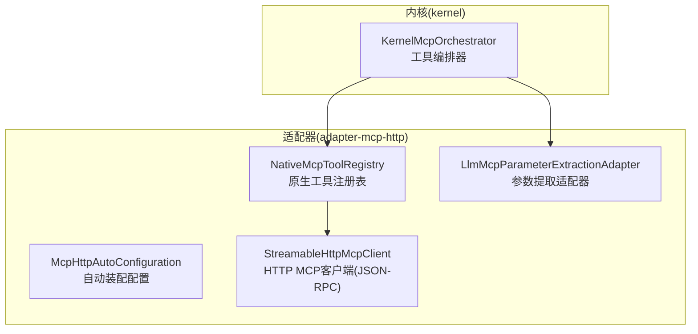
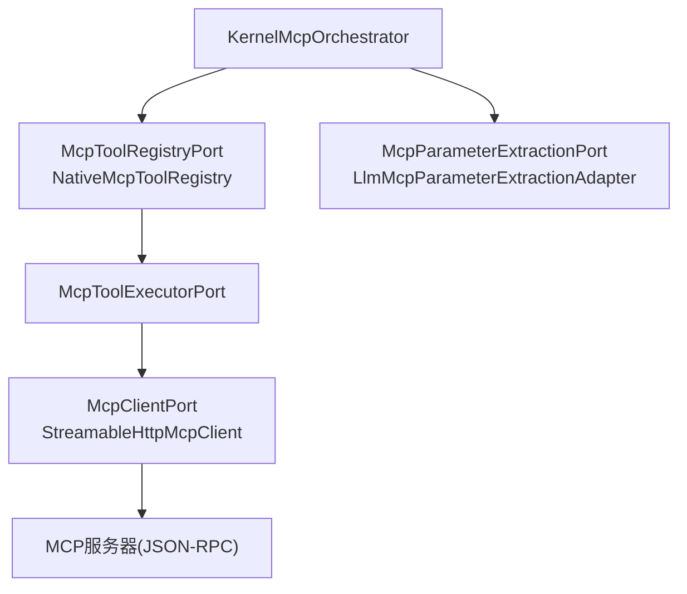
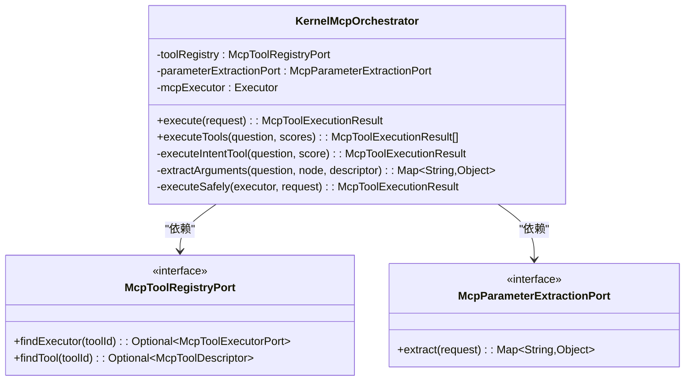
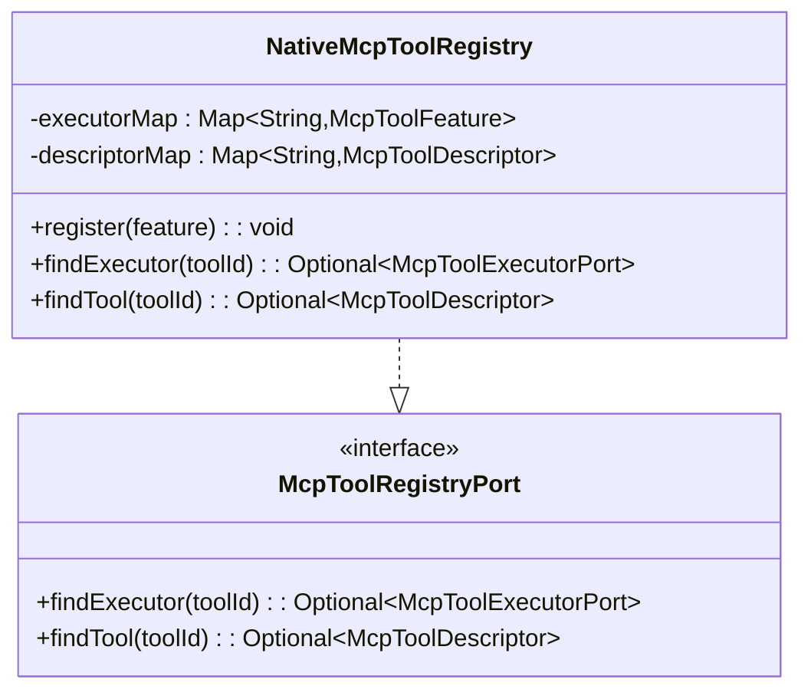
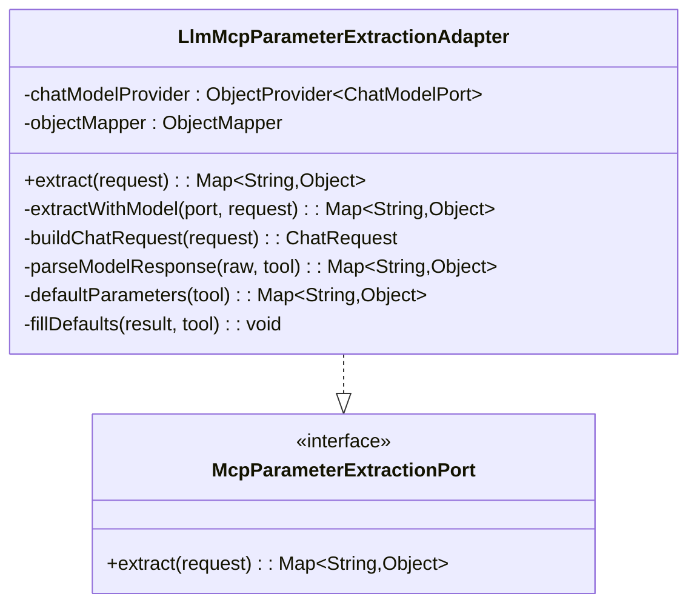
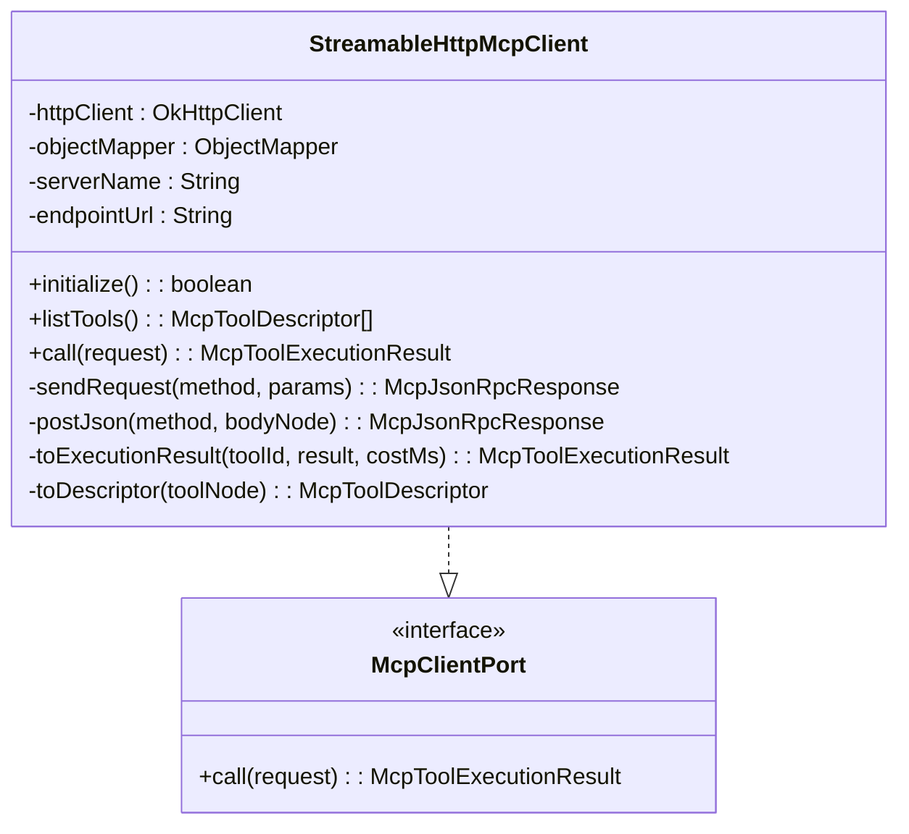
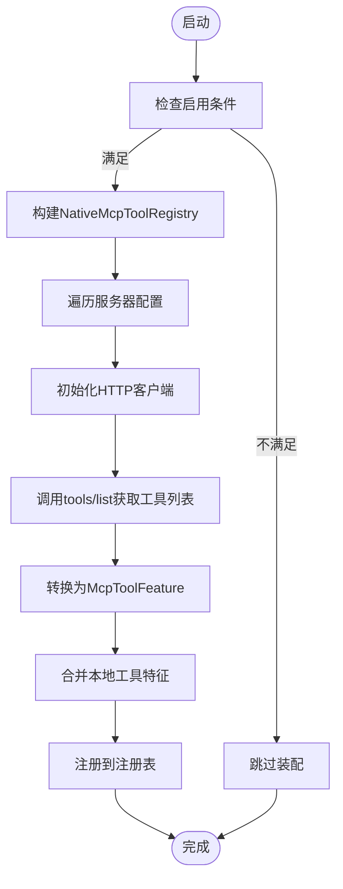
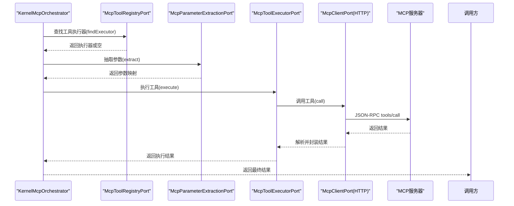
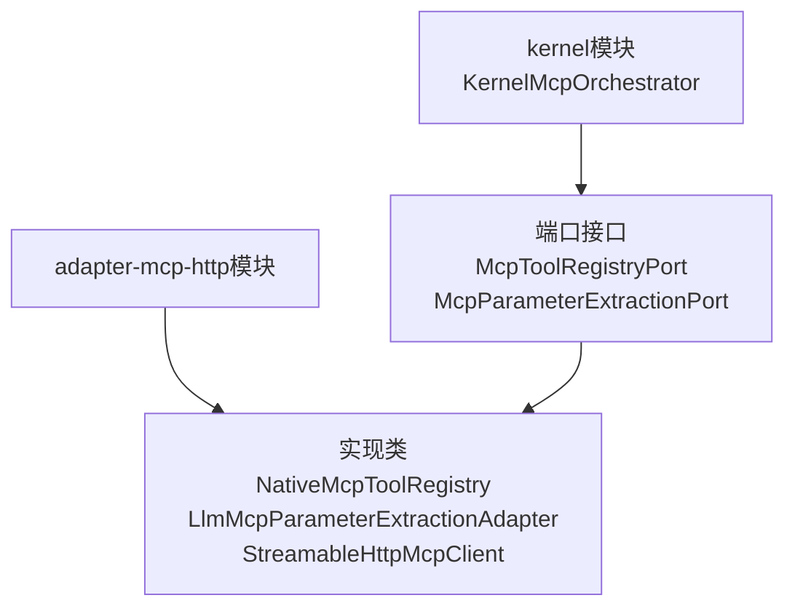

# MCP出站端口

<cite>
**本文引用的文件**
- [KernelMcpOrchestrator.java](file://seahorse-agent-kernel/src/main/java/com/miracle/ai/seahorse/agent/kernel/application/mcp/KernelMcpOrchestrator.java)
- [McpHttpAutoConfiguration.java](file://seahorse-agent-adapter-mcp-http/src/main/java/com/miracle/ai/seahorse/agent/adapters/mcp/http/McpHttpAutoConfiguration.java)
- [NativeMcpToolRegistry.java](file://seahorse-agent-adapter-mcp-http/src/main/java/com/miracle/ai/seahorse/agent/adapters/mcp/http/NativeMcpToolRegistry.java)
- [LlmMcpParameterExtractionAdapter.java](file://seahorse-agent-adapter-mcp-http/src/main/java/com/miracle/ai/seahorse/agent/adapters/mcp/http/LlmMcpParameterExtractionAdapter.java)
- [StreamableHttpMcpClient.java](file://seahorse-agent-adapter-mcp-http/src/main/java/com/miracle/ai/seahorse/agent/adapters/mcp/http/StreamableHttpMcpClient.java)
- [McpParameterExtractionPort 接口定义](file://seahorse-agent-adapter-mcp-http/src/main/resources/META-INF/seahorse-agent/com.miracle.ai.seahorse.agent.ports.outbound.mcp.McpParameterExtractionPort)
- [McpToolRegistryPort 接口定义](file://seahorse-agent-adapter-mcp-http/src/main/resources/META-INF/seahorse-agent/com.miracle.ai.seahorse.agent.ports.outbound.mcp.McpToolRegistryPort)
</cite>

## 目录
1. [引言](#引言)
2. [项目结构](#项目结构)
3. [核心组件](#核心组件)
4. [架构总览](#架构总览)
5. [详细组件分析](#详细组件分析)
6. [依赖关系分析](#依赖关系分析)
7. [性能考虑](#性能考虑)
8. [故障排查指南](#故障排查指南)
9. [结论](#结论)
10. [附录](#附录)

## 引言
本文件聚焦于MCP（Model Context Protocol）出站端口在Seahorse Agent中的实现与使用，围绕以下关键端口展开：McpToolRegistryPort（MCP工具注册端口）、McpParameterExtractionPort（参数提取端口）、McpToolExecutorPort（工具执行端口）、McpClientPort（MCP客户端端口）。文档将从系统架构、组件关系、数据流与处理逻辑、集成点与错误处理等方面进行深入解析，并结合序列图与流程图帮助读者理解工具发现、参数解析、远程工具调用与协议通信的完整链路。

## 项目结构
MCP出站端口相关代码主要分布在两个模块：
- kernel模块：提供内核级编排器KernelMcpOrchestrator，负责工具元数据查找、参数抽取、并发执行、异常封装与降级结果生成。
- adapter-mcp-http模块：提供HTTP适配器，包含自动装配配置、原生工具注册表、参数提取适配器以及基于OkHttp的JSON-RPC客户端。

**图表来源**
- [KernelMcpOrchestrator.java:45-137](file://seahorse-agent-kernel/src/main/java/com/miracle/ai/seahorse/agent/kernel/application/mcp/KernelMcpOrchestrator.java#L45-L137)
- [McpHttpAutoConfiguration.java:51-113](file://seahorse-agent-adapter-mcp-http/src/main/java/com/miracle/ai/seahorse/agent/adapters/mcp/http/McpHttpAutoConfiguration.java#L51-L113)
- [NativeMcpToolRegistry.java:37-77](file://seahorse-agent-adapter-mcp-http/src/main/java/com/miracle/ai/seahorse/agent/adapters/mcp/http/NativeMcpToolRegistry.java#L37-L77)
- [LlmMcpParameterExtractionAdapter.java:43-185](file://seahorse-agent-adapter-mcp-http/src/main/java/com/miracle/ai/seahorse/agent/adapters/mcp/http/LlmMcpParameterExtractionAdapter.java#L43-L185)
- [StreamableHttpMcpClient.java:49-304](file://seahorse-agent-adapter-mcp-http/src/main/java/com/miracle/ai/seahorse/agent/adapters/mcp/http/StreamableHttpMcpClient.java#L49-L304)

**章节来源**
- [KernelMcpOrchestrator.java:1-137](file://seahorse-agent-kernel/src/main/java/com/miracle/ai/seahorse/agent/kernel/application/mcp/KernelMcpOrchestrator.java#L1-L137)
- [McpHttpAutoConfiguration.java:1-113](file://seahorse-agent-adapter-mcp-http/src/main/java/com/miracle/ai/seahorse/agent/adapters/mcp/http/McpHttpAutoConfiguration.java#L1-L113)

## 核心组件
本节概述MCP出站端口涉及的核心组件及其职责：
- KernelMcpOrchestrator：内核级编排器，负责工具查找、参数抽取、并发执行、异常捕获与降级。
- McpToolRegistryPort：工具注册表端口，提供根据toolId查找执行器与工具描述的能力。
- McpParameterExtractionPort：参数提取端口，负责从用户问题中抽取工具所需参数。
- McpToolExecutorPort：工具执行端口，封装具体工具的执行逻辑。
- McpClientPort：MCP客户端端口，负责与远程MCP服务器进行JSON-RPC通信。
- NativeMcpToolRegistry：原生工具注册表，聚合本地与远程工具特征，向内核暴露统一端口。
- LlmMcpParameterExtractionAdapter：基于聊天模型的参数提取适配器，支持LLM辅助参数抽取与默认参数填充。
- StreamableHttpMcpClient：基于OkHttp的HTTP MCP客户端，实现initialize、tools/list、tools/call等方法的JSON-RPC封装与错误降级。

**章节来源**
- [KernelMcpOrchestrator.java:45-137](file://seahorse-agent-kernel/src/main/java/com/miracle/ai/seahorse/agent/kernel/application/mcp/KernelMcpOrchestrator.java#L45-L137)
- [NativeMcpToolRegistry.java:37-77](file://seahorse-agent-adapter-mcp-http/src/main/java/com/miracle/ai/seahorse/agent/adapters/mcp/http/NativeMcpToolRegistry.java#L37-L77)
- [LlmMcpParameterExtractionAdapter.java:43-185](file://seahorse-agent-adapter-mcp-http/src/main/java/com/miracle/ai/seahorse/agent/adapters/mcp/http/LlmMcpParameterExtractionAdapter.java#L43-L185)
- [StreamableHttpMcpClient.java:49-304](file://seahorse-agent-adapter-mcp-http/src/main/java/com/miracle/ai/seahorse/agent/adapters/mcp/http/StreamableHttpMcpClient.java#L49-L304)

## 架构总览
下图展示了MCP出站端口的整体架构与交互关系：内核通过编排器访问工具注册表与参数提取端口；注册表聚合本地与远程工具特征；远程工具通过HTTP客户端与MCP服务器通信；参数提取通过聊天模型端口进行LLM辅助抽取。

**图表来源**
- [KernelMcpOrchestrator.java:49-64](file://seahorse-agent-kernel/src/main/java/com/miracle/ai/seahorse/agent/kernel/application/mcp/KernelMcpOrchestrator.java#L49-L64)
- [NativeMcpToolRegistry.java:50-58](file://seahorse-agent-adapter-mcp-http/src/main/java/com/miracle/ai/seahorse/agent/adapters/mcp/http/NativeMcpToolRegistry.java#L50-L58)
- [LlmMcpParameterExtractionAdapter.java:67-77](file://seahorse-agent-adapter-mcp-http/src/main/java/com/miracle/ai/seahorse/agent/adapters/mcp/http/LlmMcpParameterExtractionAdapter.java#L67-L77)
- [StreamableHttpMcpClient.java:132-146](file://seahorse-agent-adapter-mcp-http/src/main/java/com/miracle/ai/seahorse/agent/adapters/mcp/http/StreamableHttpMcpClient.java#L132-L146)

## 详细组件分析

### 组件一：KernelMcpOrchestrator（内核编排器）
KernelMcpOrchestrator是L1内核的MCP工具编排器，职责包括：
- 从工具注册表查找执行器与工具描述
- 使用参数提取端口从用户问题中抽取参数
- 并发执行命中意图的工具
- 异常捕获与降级：工具不存在返回“未找到”，执行异常返回“失败”结果

**图表来源**
- [KernelMcpOrchestrator.java:49-64](file://seahorse-agent-kernel/src/main/java/com/miracle/ai/seahorse/agent/kernel/application/mcp/KernelMcpOrchestrator.java#L49-L64)
- [KernelMcpOrchestrator.java:72-135](file://seahorse-agent-kernel/src/main/java/com/miracle/ai/seahorse/agent/kernel/application/mcp/KernelMcpOrchestrator.java#L72-L135)

**章节来源**
- [KernelMcpOrchestrator.java:45-137](file://seahorse-agent-kernel/src/main/java/com/miracle/ai/seahorse/agent/kernel/application/mcp/KernelMcpOrchestrator.java#L45-L137)

### 组件二：McpToolRegistryPort 与 NativeMcpToolRegistry（工具注册与发现）
- McpToolRegistryPort：对外暴露的工具注册表端口，提供按toolId查找执行器与工具描述的能力。
- NativeMcpToolRegistry：实现McpToolRegistryPort，聚合本地与远程McpToolFeature，内部维护两个映射表（执行器与描述），支持注册、查找与覆盖策略。

**图表来源**
- [NativeMcpToolRegistry.java:37-77](file://seahorse-agent-adapter-mcp-http/src/main/java/com/miracle/ai/seahorse/agent/adapters/mcp/http/NativeMcpToolRegistry.java#L37-L77)

**章节来源**
- [NativeMcpToolRegistry.java:37-77](file://seahorse-agent-adapter-mcp-http/src/main/java/com/miracle/ai/seahorse/agent/adapters/mcp/http/NativeMcpToolRegistry.java#L37-L77)

### 组件三：McpParameterExtractionPort 与 LlmMcpParameterExtractionAdapter（参数提取）
- McpParameterExtractionPort：参数提取端口，定义从用户问题与工具描述中抽取参数的方法。
- LlmMcpParameterExtractionAdapter：基于ChatModelPort的参数提取适配器，构建系统消息与用户消息，调用模型生成JSON参数，解析失败时回退到默认参数。

**图表来源**
- [LlmMcpParameterExtractionAdapter.java:43-185](file://seahorse-agent-adapter-mcp-http/src/main/java/com/miracle/ai/seahorse/agent/adapters/mcp/http/LlmMcpParameterExtractionAdapter.java#L43-L185)

**章节来源**
- [LlmMcpParameterExtractionAdapter.java:43-185](file://seahorse-agent-adapter-mcp-http/src/main/java/com/miracle/ai/seahorse/agent/adapters/mcp/http/LlmMcpParameterExtractionAdapter.java#L43-L185)

### 组件四：McpClientPort 与 StreamableHttpMcpClient（远程工具调用）
- McpClientPort：MCP客户端端口，定义工具调用方法。
- StreamableHttpMcpClient：基于OkHttp的HTTP客户端，实现initialize、tools/list、tools/call等JSON-RPC方法，负责HTTP请求、响应解析与错误降级。

**图表来源**
- [StreamableHttpMcpClient.java:49-304](file://seahorse-agent-adapter-mcp-http/src/main/java/com/miracle/ai/seahorse/agent/adapters/mcp/http/StreamableHttpMcpClient.java#L49-L304)

**章节来源**
- [StreamableHttpMcpClient.java:49-304](file://seahorse-agent-adapter-mcp-http/src/main/java/com/miracle/ai/seahorse/agent/adapters/mcp/http/StreamableHttpMcpClient.java#L49-L304)

### 组件五：自动装配与工具发现（McpHttpAutoConfiguration）
- 自动装配条件：基于NativeMcpEnabledCondition，当启用远程MCP Server时生效。
- 工具发现：遍历配置的多个MCP服务器，初始化客户端、拉取工具列表并转换为McpToolFeature，合并本地工具特征，最终注入NativeMcpToolRegistry。
- 参数提取适配器：在缺少McpParameterExtractionPort时，注入LlmMcpParameterExtractionAdapter。

**图表来源**
- [McpHttpAutoConfiguration.java:51-113](file://seahorse-agent-adapter-mcp-http/src/main/java/com/miracle/ai/seahorse/agent/adapters/mcp/http/McpHttpAutoConfiguration.java#L51-L113)

**章节来源**
- [McpHttpAutoConfiguration.java:51-113](file://seahorse-agent-adapter-mcp-http/src/main/java/com/miracle/ai/seahorse/agent/adapters/mcp/http/McpHttpAutoConfiguration.java#L51-L113)

### 关键流程：工具执行序列（从意图到远程调用）
该序列展示了从内核编排器到远程MCP服务器的完整调用链路。

**图表来源**
- [KernelMcpOrchestrator.java:72-135](file://seahorse-agent-kernel/src/main/java/com/miracle/ai/seahorse/agent/kernel/application/mcp/KernelMcpOrchestrator.java#L72-L135)
- [StreamableHttpMcpClient.java:132-146](file://seahorse-agent-adapter-mcp-http/src/main/java/com/miracle/ai/seahorse/agent/adapters/mcp/http/StreamableHttpMcpClient.java#L132-L146)

## 依赖关系分析
- 内核与适配器解耦：内核仅依赖端口接口，不直接依赖HTTP或OkHttp实现，满足L1内核不依赖具体SDK的要求。
- 条件装配：自动装配仅在启用远程MCP Server时生效，避免无服务器时的无效依赖。
- 注册表聚合：原生注册表同时管理本地与远程工具特征，支持按toolId覆盖与替换。

**图表来源**
- [KernelMcpOrchestrator.java:49-64](file://seahorse-agent-kernel/src/main/java/com/miracle/ai/seahorse/agent/kernel/application/mcp/KernelMcpOrchestrator.java#L49-L64)
- [McpHttpAutoConfiguration.java:51-113](file://seahorse-agent-adapter-mcp-http/src/main/java/com/miracle/ai/seahorse/agent/adapters/mcp/http/McpHttpAutoConfiguration.java#L51-L113)

**章节来源**
- [KernelMcpOrchestrator.java:45-137](file://seahorse-agent-kernel/src/main/java/com/miracle/ai/seahorse/agent/kernel/application/mcp/KernelMcpOrchestrator.java#L45-L137)
- [McpHttpAutoConfiguration.java:51-113](file://seahorse-agent-adapter-mcp-http/src/main/java/com/miracle/ai/seahorse/agent/adapters/mcp/http/McpHttpAutoConfiguration.java#L51-L113)

## 性能考虑
- 并发执行：内核编排器使用线程池对命中意图的工具进行并发执行，提升整体吞吐。
- 超时控制：HTTP客户端基于配置设置调用超时，避免阻塞影响主链路。
- 降级策略：参数抽取失败与工具执行失败均返回降级结果，确保RAG主链路稳定性。
- JSON-RPC优化：客户端对响应体进行严格校验与错误解析，减少无效重试。

[本节为通用性能建议，无需特定文件来源]

## 故障排查指南
- 工具未发现：检查自动装配是否启用、服务器URL是否正确、initialize与tools/list是否成功返回。
- 参数抽取失败：确认ChatModelPort可用性、模型输出格式是否符合JSON对象要求、必要时回退到默认参数。
- 远程调用异常：查看HTTP状态码、响应体内容与错误字段，定位服务器端问题。
- 并发执行异常：关注线程池配置与任务隔离，避免相互影响。

**章节来源**
- [McpHttpAutoConfiguration.java:95-111](file://seahorse-agent-adapter-mcp-http/src/main/java/com/miracle/ai/seahorse/agent/adapters/mcp/http/McpHttpAutoConfiguration.java#L95-L111)
- [LlmMcpParameterExtractionAdapter.java:131-144](file://seahorse-agent-adapter-mcp-http/src/main/java/com/miracle/ai/seahorse/agent/adapters/mcp/http/LlmMcpParameterExtractionAdapter.java#L131-L144)
- [StreamableHttpMcpClient.java:185-198](file://seahorse-agent-adapter-mcp-http/src/main/java/com/miracle/ai/seahorse/agent/adapters/mcp/http/StreamableHttpMcpClient.java#L185-L198)

## 结论
本文档系统梳理了MCP出站端口在Seahorse Agent中的设计与实现，重点阐述了内核编排器、工具注册表、参数提取适配器与HTTP客户端之间的协作关系。通过端口抽象与条件装配，系统实现了本地与远程工具的统一管理与调用，具备良好的扩展性与稳定性。建议在生产环境中结合超时配置、并发策略与降级机制，持续优化工具发现与执行性能。

[本节为总结性内容，无需特定文件来源]

## 附录

### 端口接口定义与资源文件
- McpToolRegistryPort 接口定义资源文件路径：[McpToolRegistryPort 接口定义](file://seahorse-agent-adapter-mcp-http/src/main/resources/META-INF/seahorse-agent/com.miracle.ai.seahorse.agent.ports.outbound.mcp.McpToolRegistryPort)
- McpParameterExtractionPort 接口定义资源文件路径：[McpParameterExtractionPort 接口定义](file://seahorse-agent-adapter-mcp-http/src/main/resources/META-INF/seahorse-agent/com.miracle.ai.seahorse.agent.ports.outbound.mcp.McpParameterExtractionPort)

**章节来源**
- [McpToolRegistryPort 接口定义](file://seahorse-agent-adapter-mcp-http/src/main/resources/META-INF/seahorse-agent/com.miracle.ai.seahorse.agent.ports.outbound.mcp.McpToolRegistryPort)
- [McpParameterExtractionPort 接口定义](file://seahorse-agent-adapter-mcp-http/src/main/resources/META-INF/seahorse-agent/com.miracle.ai.seahorse.agent.ports.outbound.mcp.McpParameterExtractionPort)