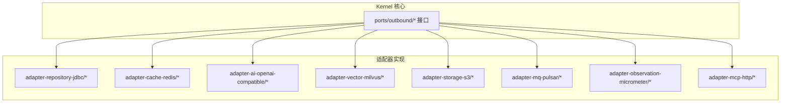
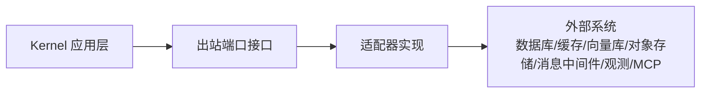

# 出站端口

<cite>
**本文引用的文件**
- [CurrentUserPort.java](file://seahorse-agent-kernel/src/main/java/com/miracle/ai/seahorse/agent/ports/outbound/auth/CurrentUserPort.java)
- [UserRepositoryPort.java](file://seahorse-agent-kernel/src/main/java/com/miracle/ai/seahorse/agent/ports/outbound/auth/UserRepositoryPort.java)
- [KeyValueCachePort.java](file://seahorse-agent-kernel/src/main/java/com/miracle/ai/seahorse/agent/ports/outbound/cache/KeyValueCachePort.java)
- [PubSubPort.java](file://seahorse-agent-kernel/src/main/java/com/miracle/ai/seahorse/agent/ports/outbound/cache/PubSubPort.java)
- [ConversationMemoryPort.java](file://seahorse-agent-kernel/src/main/java/com/miracle/ai/seahorse/agent/ports/outbound/chat/ConversationMemoryPort.java)
- [IntentGuidancePort.java](file://seahorse-agent-kernel/src/main/java/com/miracle/ai/seahorse/agent/ports/outbound/chat/IntentGuidancePort.java)
- [KnowledgeBaseRepositoryPort.java](file://seahorse-agent-kernel/src/main/java/com/miracle/ai/seahorse/agent/ports/outbound/knowledge/KnowledgeBaseRepositoryPort.java)
- [KnowledgeDocumentRepositoryPort.java](file://seahorse-agent-kernel/src/main/java/com/miracle/ai/seahorse/agent/ports/outbound/knowledge/KnowledgeDocumentRepositoryPort.java)
- [LongTermMemoryPort.java](file://seahorse-agent-kernel/src/main/java/com/miracle/ai/seahorse/agent/ports/outbound/memory/LongTermMemoryPort.java)
- [WorkingMemoryPort.java](file://seahorse-agent-kernel/src/main/java/com/miracle/ai/seahorse/agent/ports/outbound/memory/WorkingMemoryPort.java)
- [ChatModelPort.java](file://seahorse-agent-kernel/src/main/java/com/miracle/ai/seahorse/agent/ports/outbound/model/ChatModelPort.java)
- [EmbeddingModelPort.java](file://seahorse-agent-kernel/src/main/java/com/miracle/ai/seahorse/agent/ports/outbound/model/EmbeddingModelPort.java)
- [VectorSearchPort.java](file://seahorse-agent-kernel/src/main/java/com/miracle/ai/seahorse/agent/ports/outbound/vector/VectorSearchPort.java)
- [VectorIndexPort.java](file://seahorse-agent-kernel/src/main/java/com/miracle/ai/seahorse/agent/ports/outbound/vector/VectorIndexPort.java)
- [ObjectStoragePort.java](file://seahorse-agent-kernel/src/main/java/com/miracle/ai/seahorse/agent/ports/outbound/storage/ObjectStoragePort.java)
- [MessageQueuePort.java](file://seahorse-agent-kernel/src/main/java/com/miracle/ai/seahorse/agent/ports/outbound/mq/MessageQueuePort.java)
- [ObservationPort.java](file://seahorse-agent-kernel/src/main/java/com/miracle/ai/seahorse/agent/ports/outbound/observation/ObservationPort.java)
- [McpToolRegistryPort.java](file://seahorse-agent-kernel/src/main/java/com/miracle/ai/seahorse/agent/ports/outbound/mcp/McpToolRegistryPort.java)
- [McpParameterExtractionPort.java](file://seahorse-agent-kernel/src/main/java/com/miracle/ai/seahorse/agent/ports/outbound/mcp/McpParameterExtractionPort.java)
- [JdbcUserRepositoryAdapter.java](file://seahorse-agent-adapter-repository-jdbc/src/main/java/com/miracle/ai/seahorse/agent/adapters/repository/jdbc/JdbcUserRepositoryAdapter.java)
- [JdbcConversationMemoryAdapter.java](file://seahorse-agent-adapter-repository-jdbc/src/main/java/com/miracle/ai/seahorse/agent/adapters/repository/jdbc/JdbcConversationMemoryAdapter.java)
- [LocalCacheAdapter.java](file://seahorse-agent-adapter-cache-local/src/main/java/com/miracle/ai/seahorse/agent/adapters/cache/local/LocalCacheAdapter.java)
- [RedisCacheAdapter.java](file://seahorse-agent-adapter-cache-redis/src/main/java/com/miracle/ai/seahorse/agent/adapters/cache/redis/RedisCacheAdapter.java)
- [OpenAiCompatibleModelAdapter.java](file://seahorse-agent-adapter-ai-openai-compatible/src/main/java/com/miracle/ai/seahorse/agent/adapters/ai/openai/OpenAiCompatibleModelAdapter.java)
- [MilvusVectorAdapter.java](file://seahorse-agent-adapter-vector-milvus/src/main/java/com/miracle/ai/seahorse/agent/adapters/vector/milvus/MilvusVectorAdapter.java)
- [PgVectorAdapter.java](file://seahorse-agent-adapter-vector-pgvector/src/main/java/com/miracle/ai/seahorse/agent/adapters/vector/pgvector/PgVectorAdapter.java)
- [LocalObjectStorageAdapter.java](file://seahorse-agent-adapter-storage-local/src/main/java/com/miracle/ai/seahorse/agent/adapters/storage/local/LocalObjectStorageAdapter.java)
- [S3ObjectStorageAdapter.java](file://seahorse-agent-adapter-storage-s3/src/main/java/com/miracle/ai/seahorse/agent/adapters/storage/s3/S3ObjectStorageAdapter.java)
- [DirectMessageQueueAdapter.java](file://seahorse-agent-adapter-mq-direct/src/main/java/com/miracle/ai/seahorse/agent/adapters/mq/direct/DirectMessageQueueAdapter.java)
- [PulsarMessageQueueAdapter.java](file://seahorse-agent-adapter-mq-pulsar/src/main/java/com/miracle/ai/seahorse/agent/adapters/mq/pulsar/PulsarMessageQueueAdapter.java)
- [MicrometerObservationAdapter.java](file://seahorse-agent-adapter-observation-micrometer/src/main/java/com/miracle/ai/seahorse/agent/adapters/observation/micrometer/MicrometerObservationAdapter.java)
- [NativeMcpToolRegistry.java](file://seahorse-agent-adapter-mcp-http/src/main/java/com/miracle/ai/seahorse/agent/adapters/mcp/http/NativeMcpToolRegistry.java)
- [SeahorseAgentKernelAutoConfiguration.java](file://seahorse-agent-spring-boot-starter/src/main/java/com/miracle/ai/seahorse/agent/adapters/spring/SeahorseAgentKernelAutoConfiguration.java)
</cite>

## 目录
1. [简介](#简介)
2. [项目结构](#项目结构)
3. [核心组件](#核心组件)
4. [架构总览](#架构总览)
5. [详细组件分析](#详细组件分析)
6. [依赖分析](#依赖分析)
7. [性能考虑](#性能考虑)
8. [故障排查指南](#故障排查指南)
9. [结论](#结论)
10. [附录](#附录)

## 简介
本文件聚焦于 Kernel 中“出站端口（Outbound Ports）”的设计与实现，系统性梳理认证、缓存、聊天、知识库、内存、模型、向量、存储、消息队列、观测性、MCP 等多个维度的出站端口，阐明其职责边界、接口契约、异常处理策略，并结合适配器模式展示如何通过不同实现解耦外部系统。文档同时给出关键流程的时序图与类图，帮助开发者快速理解并正确使用这些端口。

## 项目结构
出站端口位于 kernel 模块的 ports/outbound 包下，按功能域划分子包；各适配器模块在对应 adapter-* 下提供具体实现，并通过 SPI/META-INF 配置进行装配。

图表来源
- [CurrentUserPort.java:22-36](file://seahorse-agent-kernel/src/main/java/com/miracle/ai/seahorse/agent/ports/outbound/auth/CurrentUserPort.java#L22-L36)
- [JdbcUserRepositoryAdapter.java](file://seahorse-agent-adapter-repository-jdbc/src/main/java/com/miracle/ai/seahorse/agent/adapters/repository/jdbc/JdbcUserRepositoryAdapter.java)
- [RedisCacheAdapter.java](file://seahorse-agent-adapter-cache-redis/src/main/java/com/miracle/ai/seahorse/agent/adapters/cache/redis/RedisCacheAdapter.java)
- [OpenAiCompatibleModelAdapter.java](file://seahorse-agent-adapter-ai-openai-compatible/src/main/java/com/miracle/ai/seahorse/agent/adapters/ai/openai/OpenAiCompatibleModelAdapter.java)
- [MilvusVectorAdapter.java](file://seahorse-agent-adapter-vector-milvus/src/main/java/com/miracle/ai/seahorse/agent/adapters/vector/milvus/MilvusVectorAdapter.java)
- [S3ObjectStorageAdapter.java](file://seahorse-agent-adapter-storage-s3/src/main/java/com/miracle/ai/seahorse/agent/adapters/storage/s3/S3ObjectStorageAdapter.java)
- [PulsarMessageQueueAdapter.java](file://seahorse-agent-adapter-mq-pulsar/src/main/java/com/miracle/ai/seahorse/agent/adapters/mq/pulsar/PulsarMessageQueueAdapter.java)
- [MicrometerObservationAdapter.java](file://seahorse-agent-adapter-observation-micrometer/src/main/java/com/miracle/ai/seahorse/agent/adapters/observation/micrometer/MicrometerObservationAdapter.java)
- [NativeMcpToolRegistry.java](file://seahorse-agent-adapter-mcp-http/src/main/java/com/miracle/ai/seahorse/agent/adapters/mcp/http/NativeMcpToolRegistry.java)

章节来源
- [CurrentUserPort.java:22-36](file://seahorse-agent-kernel/src/main/java/com/miracle/ai/seahorse/agent/ports/outbound/auth/CurrentUserPort.java#L22-L36)
- [UserRepositoryPort.java:22-37](file://seahorse-agent-kernel/src/main/java/com/miracle/ai/seahorse/agent/ports/outbound/auth/UserRepositoryPort.java#L22-L37)
- [KeyValueCachePort.java:26-33](file://seahorse-agent-kernel/src/main/java/com/miracle/ai/seahorse/agent/ports/outbound/cache/KeyValueCachePort.java#L26-L33)
- [PubSubPort.java:25-43](file://seahorse-agent-kernel/src/main/java/com/miracle/ai/seahorse/agent/ports/outbound/cache/PubSubPort.java#L25-L43)
- [ConversationMemoryPort.java:27-52](file://seahorse-agent-kernel/src/main/java/com/miracle/ai/seahorse/agent/ports/outbound/chat/ConversationMemoryPort.java#L27-L52)
- [IntentGuidancePort.java:28-42](file://seahorse-agent-kernel/src/main/java/com/miracle/ai/seahorse/agent/ports/outbound/chat/IntentGuidancePort.java#L28-L42)
- [KnowledgeBaseRepositoryPort.java:25-42](file://seahorse-agent-kernel/src/main/java/com/miracle/ai/seahorse/agent/ports/outbound/knowledge/KnowledgeBaseRepositoryPort.java#L25-L42)
- [KnowledgeDocumentRepositoryPort.java:26-154](file://seahorse-agent-kernel/src/main/java/com/miracle/ai/seahorse/agent/ports/outbound/knowledge/KnowledgeDocumentRepositoryPort.java#L26-L154)
- [LongTermMemoryPort.java:25-26](file://seahorse-agent-kernel/src/main/java/com/miracle/ai/seahorse/agent/ports/outbound/memory/LongTermMemoryPort.java#L25-L26)
- [WorkingMemoryPort.java:25-26](file://seahorse-agent-kernel/src/main/java/com/miracle/ai/seahorse/agent/ports/outbound/memory/WorkingMemoryPort.java#L25-L26)
- [ChatModelPort.java:30-58](file://seahorse-agent-kernel/src/main/java/com/miracle/ai/seahorse/agent/ports/outbound/model/ChatModelPort.java#L30-L58)
- [EmbeddingModelPort.java:27-46](file://seahorse-agent-kernel/src/main/java/com/miracle/ai/seahorse/agent/ports/outbound/model/EmbeddingModelPort.java#L27-L46)
- [VectorSearchPort.java:30-39](file://seahorse-agent-kernel/src/main/java/com/miracle/ai/seahorse/agent/ports/outbound/vector/VectorSearchPort.java#L30-L39)
- [VectorIndexPort.java:30-73](file://seahorse-agent-kernel/src/main/java/com/miracle/ai/seahorse/agent/ports/outbound/vector/VectorIndexPort.java#L30-L73)
- [ObjectStoragePort.java:25-47](file://seahorse-agent-kernel/src/main/java/com/miracle/ai/seahorse/agent/ports/outbound/storage/ObjectStoragePort.java#L25-L47)
- [MessageQueuePort.java](file://seahorse-agent-kernel/src/main/java/com/miracle/ai/seahorse/agent/ports/outbound/mq/MessageQueuePort.java)
- [ObservationPort.java](file://seahorse-agent-kernel/src/main/java/com/miracle/ai/seahorse/agent/ports/outbound/observation/ObservationPort.java)
- [McpToolRegistryPort.java](file://seahorse-agent-kernel/src/main/java/com/miracle/ai/seahorse/agent/ports/outbound/mcp/McpToolRegistryPort.java)
- [McpParameterExtractionPort.java](file://seahorse-agent-kernel/src/main/java/com/miracle/ai/seahorse/agent/ports/outbound/mcp/McpParameterExtractionPort.java)

## 核心组件
本节概述各类出站端口的职责与典型调用路径，便于快速定位与选用。

- 认证出站端口
  - CurrentUserPort：获取当前用户上下文，提供 requireCurrentUser、requireRole 等便捷方法。
  - UserRepositoryPort：用户实体的增删改查、分页与唯一性校验。
- 缓存出站端口
  - KeyValueCachePort：字符串键值缓存的 get/set/delete。
  - PubSubPort：发布订阅抽象，支持订阅句柄自动关闭。
- 聊天出站端口
  - ConversationMemoryPort：加载历史并追加消息，支持默认空实现。
  - IntentGuidancePort：歧义检测与引导决策。
- 知识库出站端口
  - KnowledgeBaseRepositoryPort：知识库的创建、查询、分页、更新、删除与状态检查。
  - KnowledgeDocumentRepositoryPort：文档的创建、查询、分页、状态流转、启用/禁用、删除与分块列表。
- 内存出站端口
  - LongTermMemoryPort、WorkingMemoryPort：长期/工作记忆的存储抽象。
- 模型出站端口
  - ChatModelPort：非流式对话，支持便捷重载。
  - EmbeddingModelPort：文本向量化。
- 向量出站端口
  - VectorSearchPort：向量检索。
  - VectorIndexPort：向量索引的批量/单条写入、更新与删除。
- 存储出站端口
  - ObjectStoragePort：对象存储上传、可靠上传、打开流、按 URL 删除。
- 消息队列出站端口
  - MessageQueuePort：消息发送抽象（适配器提供具体实现）。
- 观测性出站端口
  - ObservationPort：指标与追踪上报抽象（适配器提供具体实现）。
- MCP 出站端口
  - McpToolRegistryPort、McpParameterExtractionPort：工具注册与参数提取。

章节来源
- [CurrentUserPort.java:22-36](file://seahorse-agent-kernel/src/main/java/com/miracle/ai/seahorse/agent/ports/outbound/auth/CurrentUserPort.java#L22-L36)
- [UserRepositoryPort.java:22-37](file://seahorse-agent-kernel/src/main/java/com/miracle/ai/seahorse/agent/ports/outbound/auth/UserRepositoryPort.java#L22-L37)
- [KeyValueCachePort.java:26-33](file://seahorse-agent-kernel/src/main/java/com/miracle/ai/seahorse/agent/ports/outbound/cache/KeyValueCachePort.java#L26-L33)
- [PubSubPort.java:25-43](file://seahorse-agent-kernel/src/main/java/com/miracle/ai/seahorse/agent/ports/outbound/cache/PubSubPort.java#L25-L43)
- [ConversationMemoryPort.java:27-52](file://seahorse-agent-kernel/src/main/java/com/miracle/ai/seahorse/agent/ports/outbound/chat/ConversationMemoryPort.java#L27-L52)
- [IntentGuidancePort.java:28-42](file://seahorse-agent-kernel/src/main/java/com/miracle/ai/seahorse/agent/ports/outbound/chat/IntentGuidancePort.java#L28-L42)
- [KnowledgeBaseRepositoryPort.java:25-42](file://seahorse-agent-kernel/src/main/java/com/miracle/ai/seahorse/agent/ports/outbound/knowledge/KnowledgeBaseRepositoryPort.java#L25-L42)
- [KnowledgeDocumentRepositoryPort.java:26-154](file://seahorse-agent-kernel/src/main/java/com/miracle/ai/seahorse/agent/ports/outbound/knowledge/KnowledgeDocumentRepositoryPort.java#L26-L154)
- [LongTermMemoryPort.java:25-26](file://seahorse-agent-kernel/src/main/java/com/miracle/ai/seahorse/agent/ports/outbound/memory/LongTermMemoryPort.java#L25-L26)
- [WorkingMemoryPort.java:25-26](file://seahorse-agent-kernel/src/main/java/com/miracle/ai/seahorse/agent/ports/outbound/memory/WorkingMemoryPort.java#L25-L26)
- [ChatModelPort.java:30-58](file://seahorse-agent-kernel/src/main/java/com/miracle/ai/seahorse/agent/ports/outbound/model/ChatModelPort.java#L30-L58)
- [EmbeddingModelPort.java:27-46](file://seahorse-agent-kernel/src/main/java/com/miracle/ai/seahorse/agent/ports/outbound/model/EmbeddingModelPort.java#L27-L46)
- [VectorSearchPort.java:30-39](file://seahorse-agent-kernel/src/main/java/com/miracle/ai/seahorse/agent/ports/outbound/vector/VectorSearchPort.java#L30-L39)
- [VectorIndexPort.java:30-73](file://seahorse-agent-kernel/src/main/java/com/miracle/ai/seahorse/agent/ports/outbound/vector/VectorIndexPort.java#L30-L73)
- [ObjectStoragePort.java:25-47](file://seahorse-agent-kernel/src/main/java/com/miracle/ai/seahorse/agent/ports/outbound/storage/ObjectStoragePort.java#L25-L47)
- [MessageQueuePort.java](file://seahorse-agent-kernel/src/main/java/com/miracle/ai/seahorse/agent/ports/outbound/mq/MessageQueuePort.java)
- [ObservationPort.java](file://seahorse-agent-kernel/src/main/java/com/miracle/ai/seahorse/agent/ports/outbound/observation/ObservationPort.java)
- [McpToolRegistryPort.java](file://seahorse-agent-kernel/src/main/java/com/miracle/ai/seahorse/agent/ports/outbound/mcp/McpToolRegistryPort.java)
- [McpParameterExtractionPort.java](file://seahorse-agent-kernel/src/main/java/com/miracle/ai/seahorse/agent/ports/outbound/mcp/McpParameterExtractionPort.java)

## 架构总览
出站端口采用“接口隔离 + 适配器实现 + SPI 自动装配”的架构模式。Kernel 仅依赖接口，通过适配器对接具体外部系统（数据库、缓存、向量库、对象存储、消息中间件、观测系统、MCP 服务等）。Spring Boot Starter 提供自动装配入口，确保在运行时选择合适的实现。

```mermaid
graph TB
K["Kernel 应用层<br/>业务编排"]
P_AUTH["认证出站端口<br/>CurrentUserPort / UserRepositoryPort"]
P_CACHE["缓存出站端口<br/>KeyValueCachePort / PubSubPort"]
P_CHAT["聊天出站端口<br/>ConversationMemoryPort / IntentGuidancePort"]
P_KB["知识库出站端口<br/>KnowledgeBaseRepositoryPort / KnowledgeDocumentRepositoryPort"]
P_MEM["内存出站端口<br/>LongTermMemoryPort / WorkingMemoryPort"]
P_MODEL["模型出站端口<br/>ChatModelPort / EmbeddingModelPort"]
P_VEC["向量出站端口<br/>VectorSearchPort / VectorIndexPort"]
P_STORE["存储出出站端口<br/>ObjectStoragePort"]
P_MQ["消息队列出站端口<br/>MessageQueuePort"]
P_OBS["观测性出站端口<br/>ObservationPort"]
P_MCP["MCP 出站端口<br/>McpToolRegistryPort / McpParameterExtractionPort"]
A_JDBC["JDBC 适配器"]
A_REDIS["Redis 适配器"]
A_OPENAI["OpenAI 兼容模型适配器"]
A_MILVUS["Milvus 向量适配器"]
A_PG["pgvector 向量适配器"]
A_S3["S3 对象存储适配器"]
A_PULSAR["Pulsar 消息队列适配器"]
A_MICROMETER["Micrometer 观测适配器"]
A_MCP["MCP HTTP 适配器"]
K --> P_AUTH --> A_JDBC
K --> P_CACHE --> A_REDIS
K --> P_CHAT
K --> P_KB --> A_JDBC
K --> P_MEM
K --> P_MODEL --> A_OPENAI
K --> P_VEC --> A_MILVUS
K --> P_VEC --> A_PG
K --> P_STORE --> A_S3
K --> P_MQ --> A_PULSAR
K --> P_OBS --> A_MICROMETER
K --> P_MCP --> A_MCP
```

图表来源
- [SeahorseAgentKernelAutoConfiguration.java](file://seahorse-agent-spring-boot-starter/src/main/java/com/miracle/ai/seahorse/agent/adapters/spring/SeahorseAgentKernelAutoConfiguration.java)
- [JdbcUserRepositoryAdapter.java](file://seahorse-agent-adapter-repository-jdbc/src/main/java/com/miracle/ai/seahorse/agent/adapters/repository/jdbc/JdbcUserRepositoryAdapter.java)
- [RedisCacheAdapter.java](file://seahorse-agent-adapter-cache-redis/src/main/java/com/miracle/ai/seahorse/agent/adapters/cache/redis/RedisCacheAdapter.java)
- [OpenAiCompatibleModelAdapter.java](file://seahorse-agent-adapter-ai-openai-compatible/src/main/java/com/miracle/ai/seahorse/agent/adapters/ai/openai/OpenAiCompatibleModelAdapter.java)
- [MilvusVectorAdapter.java](file://seahorse-agent-adapter-vector-milvus/src/main/java/com/miracle/ai/seahorse/agent/adapters/vector/milvus/MilvusVectorAdapter.java)
- [PgVectorAdapter.java](file://seahorse-agent-adapter-vector-pgvector/src/main/java/com/miracle/ai/seahorse/agent/adapters/vector/pgvector/PgVectorAdapter.java)
- [S3ObjectStorageAdapter.java](file://seahorse-agent-adapter-storage-s3/src/main/java/com/miracle/ai/seahorse/agent/adapters/storage/s3/S3ObjectStorageAdapter.java)
- [PulsarMessageQueueAdapter.java](file://seahorse-agent-adapter-mq-pulsar/src/main/java/com/miracle/ai/seahorse/agent/adapters/mq/pulsar/PulsarMessageQueueAdapter.java)
- [MicrometerObservationAdapter.java](file://seahorse-agent-adapter-observation-micrometer/src/main/java/com/miracle/ai/seahorse/agent/adapters/observation/micrometer/MicrometerObservationAdapter.java)
- [NativeMcpToolRegistry.java](file://seahorse-agent-adapter-mcp-http/src/main/java/com/miracle/ai/seahorse/agent/adapters/mcp/http/NativeMcpToolRegistry.java)

## 详细组件分析

### 认证出站端口
- CurrentUserPort
  - 方法：currentUser() 返回 Optional<CurrentUser>；requireCurrentUser() 抛出非法状态异常；requireRole(role) 校验角色。
  - 使用场景：在 Kernel 业务层统一获取当前用户上下文，避免直接依赖 Web 层或框架。
  - 异常处理：未登录或过期抛出非法状态异常；权限不足抛出非法状态异常。
- UserRepositoryPort
  - 方法：按 id/用户名查询、唯一性校验、分页、创建、更新、删除。
  - 使用场景：用户管理、权限控制、审计日志。
  - 异常处理：查询不到返回空；更新/删除失败返回布尔值以表示操作结果。

章节来源
- [CurrentUserPort.java:22-36](file://seahorse-agent-kernel/src/main/java/com/miracle/ai/seahorse/agent/ports/outbound/auth/CurrentUserPort.java#L22-L36)
- [UserRepositoryPort.java:22-37](file://seahorse-agent-kernel/src/main/java/com/miracle/ai/seahorse/agent/ports/outbound/auth/UserRepositoryPort.java#L22-L37)

### 缓存出站端口
- KeyValueCachePort
  - 方法：get(key)、set(key, value, ttl)、delete(key)。
  - 使用场景：会话状态、配置缓存、限流令牌桶等。
  - 异常处理：无显式异常声明，适配器需保证幂等与一致性。
- PubSubPort
  - 方法：publish(message)、subscribe(topic, handler) 返回 AutoCloseable 取消订阅。
  - 使用场景：事件总线、跨模块通知、异步解耦。
  - 异常处理：订阅处理器异常应被适配器捕获并记录，避免影响其他订阅者。

章节来源
- [KeyValueCachePort.java:26-33](file://seahorse-agent-kernel/src/main/java/com/miracle/ai/seahorse/agent/ports/outbound/cache/KeyValueCachePort.java#L26-L33)
- [PubSubPort.java:25-43](file://seahorse-agent-kernel/src/main/java/com/miracle/ai/seahorse/agent/ports/outbound/cache/PubSubPort.java#L25-L43)

### 聊天出站端口
- ConversationMemoryPort
  - 方法：loadAndAppend(conversationId, userId, message) 返回历史消息；append 默认空实现；noop 静态工厂。
  - 使用场景：RAG 前后文拼接、上下文窗口管理。
  - 异常处理：默认实现返回空列表；业务层需自行处理空结果。
- IntentGuidancePort
  - 方法：detectAmbiguity(question, subIntents) 返回 GuidanceDecision；none 静态工厂。
  - 使用场景：多意图澄清、问题重写提示。
  - 异常处理：默认实现返回“无需引导”。

章节来源
- [ConversationMemoryPort.java:27-52](file://seahorse-agent-kernel/src/main/java/com/miracle/ai/seahorse/agent/ports/outbound/chat/ConversationMemoryPort.java#L27-L52)
- [IntentGuidancePort.java:28-42](file://seahorse-agent-kernel/src/main/java/com/miracle/ai/seahorse/agent/ports/outbound/chat/IntentGuidancePort.java#L28-L42)

### 知识库出站端口
- KnowledgeBaseRepositoryPort
  - 方法：create、nameExists、findById、page、hasDocuments、hasVectorizedDocuments、update、delete。
  - 使用场景：知识库生命周期管理、状态检查。
  - 异常处理：查询不存在返回空；删除/更新失败返回布尔值。
- KnowledgeDocumentRepositoryPort
  - 方法：createPendingDocument、findById、findDetailById、page、chunkLogs、markRunning/markSuccess/markFailed、update/updateEnabled、replaceFileForRefresh、delete、listEnabledChunks。
  - 使用场景：文档入库、状态机推进、分块日志查询、启用/禁用与删除。
  - 异常处理：默认实现返回空或空集合；业务层需判断返回值。

章节来源
- [KnowledgeBaseRepositoryPort.java:25-42](file://seahorse-agent-kernel/src/main/java/com/miracle/ai/seahorse/agent/ports/outbound/knowledge/KnowledgeBaseRepositoryPort.java#L25-L42)
- [KnowledgeDocumentRepositoryPort.java:26-154](file://seahorse-agent-kernel/src/main/java/com/miracle/ai/seahorse/agent/ports/outbound/knowledge/KnowledgeDocumentRepositoryPort.java#L26-L154)

### 内存出站端口
- LongTermMemoryPort、WorkingMemoryPort
  - 继承 MemoryStorePort（接口未在本节展开），用于长期与短期记忆存储抽象。
  - 使用场景：跨会话记忆、高并发短时记忆。
  - 异常处理：由具体适配器实现决定。

章节来源
- [LongTermMemoryPort.java:25-26](file://seahorse-agent-kernel/src/main/java/com/miracle/ai/seahorse/agent/ports/outbound/memory/LongTermMemoryPort.java#L25-L26)
- [WorkingMemoryPort.java:25-26](file://seahorse-agent-kernel/src/main/java/com/miracle/ai/seahorse/agent/ports/outbound/memory/WorkingMemoryPort.java#L25-L26)

### 模型出站端口
- ChatModelPort
  - 方法：chat(ChatRequest, modelId)、便捷重载 chat(modelId, messages)；noop 静态工厂。
  - 使用场景：非流式对话调用，屏蔽 Provider 差异。
  - 异常处理：默认实现返回空字符串；业务层需根据需求自定义异常策略。
- EmbeddingModelPort
  - 方法：embed(modelId, text)；noop 静态工厂。
  - 使用场景：RAG 检索与记忆向量化。
  - 异常处理：默认实现返回空列表。

章节来源
- [ChatModelPort.java:30-58](file://seahorse-agent-kernel/src/main/java/com/miracle/ai/seahorse/agent/ports/outbound/model/ChatModelPort.java#L30-L58)
- [EmbeddingModelPort.java:27-46](file://seahorse-agent-kernel/src/main/java/com/miracle/ai/seahorse/agent/ports/outbound/model/EmbeddingModelPort.java#L27-L46)

### 向量出站端口
- VectorSearchPort
  - 方法：search(request) 返回 RetrievedChunk 列表。
  - 使用场景：RAG 检索阶段。
  - 异常处理：由适配器实现负责。
- VectorIndexPort
  - 方法：indexDocumentChunks、updateChunk、deleteDocumentVectors、deleteChunkById、deleteChunksByIds。
  - 使用场景：入库链路的向量索引维护。
  - 异常处理：由适配器实现负责。

章节来源
- [VectorSearchPort.java:30-39](file://seahorse-agent-kernel/src/main/java/com/miracle/ai/seahorse/agent/ports/outbound/vector/VectorSearchPort.java#L30-L39)
- [VectorIndexPort.java:30-73](file://seahorse-agent-kernel/src/main/java/com/miracle/ai/seahorse/agent/ports/outbound/vector/VectorIndexPort.java#L30-L73)

### 存储出站端口
- ObjectStoragePort
  - 方法：ensureBucket、upload/reliableUpload、openStream、deleteByUrl。
  - 使用场景：知识库文档对象存储、可靠上传。
  - 异常处理：默认实现为空操作；适配器需实现幂等与一致性。

章节来源
- [ObjectStoragePort.java:25-47](file://seahorse-agent-kernel/src/main/java/com/miracle/ai/seahorse/agent/ports/outbound/storage/ObjectStoragePort.java#L25-L47)

### 消息队列出站端口
- MessageQueuePort
  - 职责：消息发送抽象，具体实现由适配器提供（如 Pulsar、Direct）。
  - 使用场景：异步任务、事件解耦、可靠投递。
  - 异常处理：由适配器实现负责。

章节来源
- [MessageQueuePort.java](file://seahorse-agent-kernel/src/main/java/com/miracle/ai/seahorse/agent/ports/outbound/mq/MessageQueuePort.java)

### 观测性出站端口
- ObservationPort
  - 职责：指标与追踪上报抽象，适配器可接入 Micrometer 等。
  - 使用场景：埋点、指标采集、链路追踪。
  - 异常处理：由适配器实现负责。

章节来源
- [ObservationPort.java](file://seahorse-agent-kernel/src/main/java/com/miracle/ai/seahorse/agent/ports/outbound/observation/ObservationPort.java)

### MCP 出站端口
- McpToolRegistryPort、McpParameterExtractionPort
  - 职责：工具注册与参数提取，适配器可提供本地或远程实现。
  - 使用场景：工具发现、参数解析、远程 MCP 服务集成。
  - 异常处理：由适配器实现负责。

章节来源
- [McpToolRegistryPort.java](file://seahorse-agent-kernel/src/main/java/com/miracle/ai/seahorse/agent/ports/outbound/mcp/McpToolRegistryPort.java)
- [McpParameterExtractionPort.java](file://seahorse-agent-kernel/src/main/java/com/miracle/ai/seahorse/agent/ports/outbound/mcp/McpParameterExtractionPort.java)

## 依赖分析
- Kernel 仅依赖接口，通过适配器实现与外部系统解耦。
- 适配器通过 META-INF 配置暴露 SPI，Spring Boot Starter 负责自动装配。
- 端口之间无直接耦合，遵循“依赖倒置”原则。

图表来源
- [SeahorseAgentKernelAutoConfiguration.java](file://seahorse-agent-spring-boot-starter/src/main/java/com/miracle/ai/seahorse/agent/adapters/spring/SeahorseAgentKernelAutoConfiguration.java)
- [JdbcUserRepositoryAdapter.java](file://seahorse-agent-adapter-repository-jdbc/src/main/java/com/miracle/ai/seahorse/agent/adapters/repository/jdbc/JdbcUserRepositoryAdapter.java)
- [RedisCacheAdapter.java](file://seahorse-agent-adapter-cache-redis/src/main/java/com/miracle/ai/seahorse/agent/adapters/cache/redis/RedisCacheAdapter.java)
- [OpenAiCompatibleModelAdapter.java](file://seahorse-agent-adapter-ai-openai-compatible/src/main/java/com/miracle/ai/seahorse/agent/adapters/ai/openai/OpenAiCompatibleModelAdapter.java)
- [MilvusVectorAdapter.java](file://seahorse-agent-adapter-vector-milvus/src/main/java/com/miracle/ai/seahorse/agent/adapters/vector/milvus/MilvusVectorAdapter.java)
- [S3ObjectStorageAdapter.java](file://seahorse-agent-adapter-storage-s3/src/main/java/com/miracle/ai/seahorse/agent/adapters/storage/s3/S3ObjectStorageAdapter.java)
- [PulsarMessageQueueAdapter.java](file://seahorse-agent-adapter-mq-pulsar/src/main/java/com/miracle/ai/seahorse/agent/adapters/mq/pulsar/PulsarMessageQueueAdapter.java)
- [MicrometerObservationAdapter.java](file://seahorse-agent-adapter-observation-micrometer/src/main/java/com/miracle/ai/seahorse/agent/adapters/observation/micrometer/MicrometerObservationAdapter.java)
- [NativeMcpToolRegistry.java](file://seahorse-agent-adapter-mcp-http/src/main/java/com/miracle/ai/seahorse/agent/adapters/mcp/http/NativeMcpToolRegistry.java)

## 性能考虑
- 缓存命中率：KeyValueCachePort 的 TTL 与键设计直接影响响应时间。
- 并发与限流：PubSubPort 的订阅处理应避免阻塞；必要时在适配器侧引入背压或限流。
- 向量检索：VectorSearchPort 的 topK、过滤条件与索引构建策略影响延迟与准确率。
- 模型调用：ChatModelPort/EmbeddingModelPort 的批处理与并发度需在适配器侧优化。
- 存储与网络：ObjectStoragePort 的可靠上传与断点续传策略影响吞吐。
- 观测与告警：ObservationPort 的采样与聚合策略避免对主干路径造成额外开销。

## 故障排查指南
- 未登录或登录过期
  - 现象：调用 requireCurrentUser 抛出非法状态异常。
  - 处理：检查认证适配器是否正确注入 CurrentUser；刷新 Token 或重新登录。
- 权限不足
  - 现象：调用 requireRole 抛出非法状态异常。
  - 处理：确认用户角色与资源授权范围；检查 UserRepositoryPort 的角色映射。
- 缓存读写异常
  - 现象：get/set/delete 返回不符合预期。
  - 处理：检查 KeyValueCachePort 适配器连接与 TTL 设置；确认键命名规范。
- 向量检索为空
  - 现象：VectorSearchPort 返回空列表。
  - 处理：确认 VectorIndexPort 已完成索引写入；检查集合名与过滤条件。
- 对象存储上传失败
  - 现象：upload/reliableUpload 抛错或返回异常对象。
  - 处理：检查存储桶权限、网络连通性与适配器配置。
- 消息队列投递失败
  - 现象：MessageQueuePort 投递异常。
  - 处理：检查中间件连接、Topic 权限与重试策略。
- 观测数据缺失
  - 现象：ObservationPort 未产生指标。
  - 处理：确认适配器已启用；检查采样率与标签设置。
- MCP 工具不可用
  - 现象：McpToolRegistryPort 注册/调用失败。
  - 处理：检查工具清单与参数提取逻辑；验证远程 MCP 服务可用性。

章节来源
- [CurrentUserPort.java:26-35](file://seahorse-agent-kernel/src/main/java/com/miracle/ai/seahorse/agent/ports/outbound/auth/CurrentUserPort.java#L26-L35)
- [KeyValueCachePort.java:28-32](file://seahorse-agent-kernel/src/main/java/com/miracle/ai/seahorse/agent/ports/outbound/cache/KeyValueCachePort.java#L28-L32)
- [VectorSearchPort.java:38-38](file://seahorse-agent-kernel/src/main/java/com/miracle/ai/seahorse/agent/ports/outbound/vector/VectorSearchPort.java#L38-L38)
- [ObjectStoragePort.java:38-46](file://seahorse-agent-kernel/src/main/java/com/miracle/ai/seahorse/agent/ports/outbound/storage/ObjectStoragePort.java#L38-L46)
- [MessageQueuePort.java](file://seahorse-agent-kernel/src/main/java/com/miracle/ai/seahorse/agent/ports/outbound/mq/MessageQueuePort.java)
- [ObservationPort.java](file://seahorse-agent-kernel/src/main/java/com/miracle/ai/seahorse/agent/ports/outbound/observation/ObservationPort.java)
- [McpToolRegistryPort.java](file://seahorse-agent-kernel/src/main/java/com/miracle/ai/seahorse/agent/ports/outbound/mcp/McpToolRegistryPort.java)

## 结论
出站端口通过清晰的接口边界与适配器模式，有效隔离了 Kernel 与外部系统的耦合，使系统具备良好的可替换性与可扩展性。建议在实际开发中：
- 明确端口职责，避免跨端口依赖；
- 在适配器中统一处理异常与超时；
- 为关键端口提供可观测性与降级策略；
- 通过 Spring Boot Starter 与 SPI 管理适配器装配。

## 附录
- 适配器实现参考
  - JDBC：用户与对话记忆、知识库与文档仓储等。
  - Redis：缓存与分布式锁/信号量等。
  - OpenAI 兼容：对话与嵌入模型。
  - Milvus/pgvector：向量检索与索引。
  - S3：对象存储。
  - Pulsar：消息队列。
  - Micrometer：观测性。
  - MCP HTTP：工具注册与参数提取。

章节来源
- [JdbcUserRepositoryAdapter.java](file://seahorse-agent-adapter-repository-jdbc/src/main/java/com/miracle/ai/seahorse/agent/adapters/repository/jdbc/JdbcUserRepositoryAdapter.java)
- [JdbcConversationMemoryAdapter.java](file://seahorse-agent-adapter-repository-jdbc/src/main/java/com/miracle/ai/seahorse/agent/adapters/repository/jdbc/JdbcConversationMemoryAdapter.java)
- [LocalCacheAdapter.java](file://seahorse-agent-adapter-cache-local/src/main/java/com/miracle/ai/seahorse/agent/adapters/cache/local/LocalCacheAdapter.java)
- [RedisCacheAdapter.java](file://seahorse-agent-adapter-cache-redis/src/main/java/com/miracle/ai/seahorse/agent/adapters/cache/redis/RedisCacheAdapter.java)
- [OpenAiCompatibleModelAdapter.java](file://seahorse-agent-adapter-ai-openai-compatible/src/main/java/com/miracle/ai/seahorse/agent/adapters/ai/openai/OpenAiCompatibleModelAdapter.java)
- [MilvusVectorAdapter.java](file://seahorse-agent-adapter-vector-milvus/src/main/java/com/miracle/ai/seahorse/agent/adapters/vector/milvus/MilvusVectorAdapter.java)
- [PgVectorAdapter.java](file://seahorse-agent-adapter-vector-pgvector/src/main/java/com/miracle/ai/seahorse/agent/adapters/vector/pgvector/PgVectorAdapter.java)
- [LocalObjectStorageAdapter.java](file://seahorse-agent-adapter-storage-local/src/main/java/com/miracle/ai/seahorse/agent/adapters/storage/local/LocalObjectStorageAdapter.java)
- [S3ObjectStorageAdapter.java](file://seahorse-agent-adapter-storage-s3/src/main/java/com/miracle/ai/seahorse/agent/adapters/storage/s3/S3ObjectStorageAdapter.java)
- [DirectMessageQueueAdapter.java](file://seahorse-agent-adapter-mq-direct/src/main/java/com/miracle/ai/seahorse/agent/adapters/mq/direct/DirectMessageQueueAdapter.java)
- [PulsarMessageQueueAdapter.java](file://seahorse-agent-adapter-mq-pulsar/src/main/java/com/miracle/ai/seahorse/agent/adapters/mq/pulsar/PulsarMessageQueueAdapter.java)
- [MicrometerObservationAdapter.java](file://seahorse-agent-adapter-observation-micrometer/src/main/java/com/miracle/ai/seahorse/agent/adapters/observation/micrometer/MicrometerObservationAdapter.java)
- [NativeMcpToolRegistry.java](file://seahorse-agent-adapter-mcp-http/src/main/java/com/miracle/ai/seahorse/agent/adapters/mcp/http/NativeMcpToolRegistry.java)