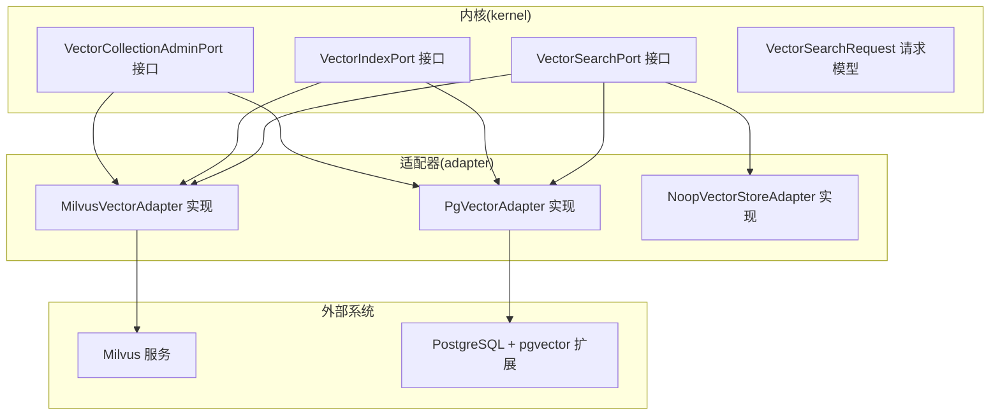
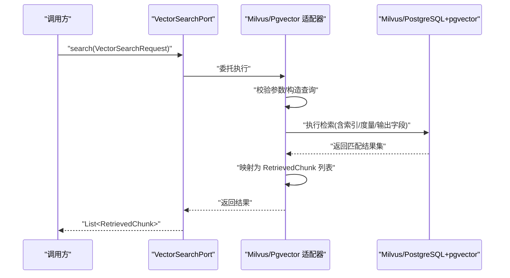
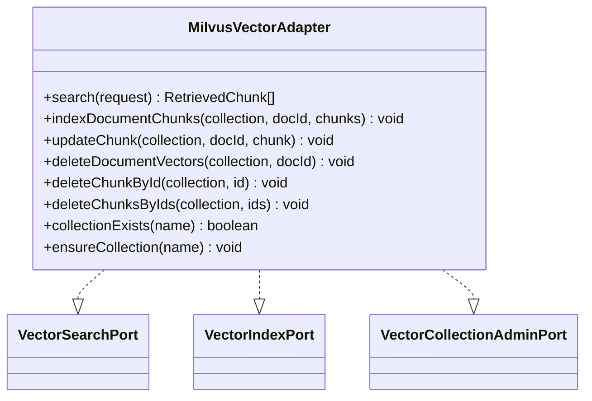
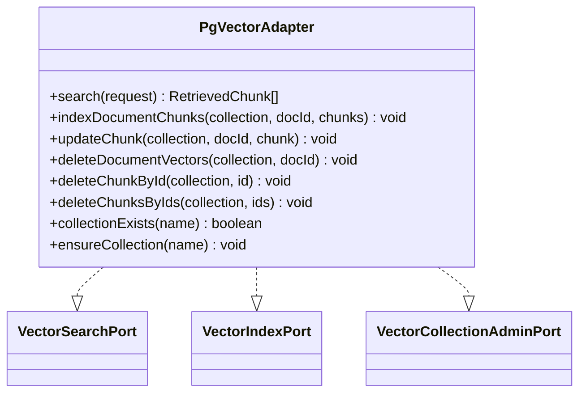
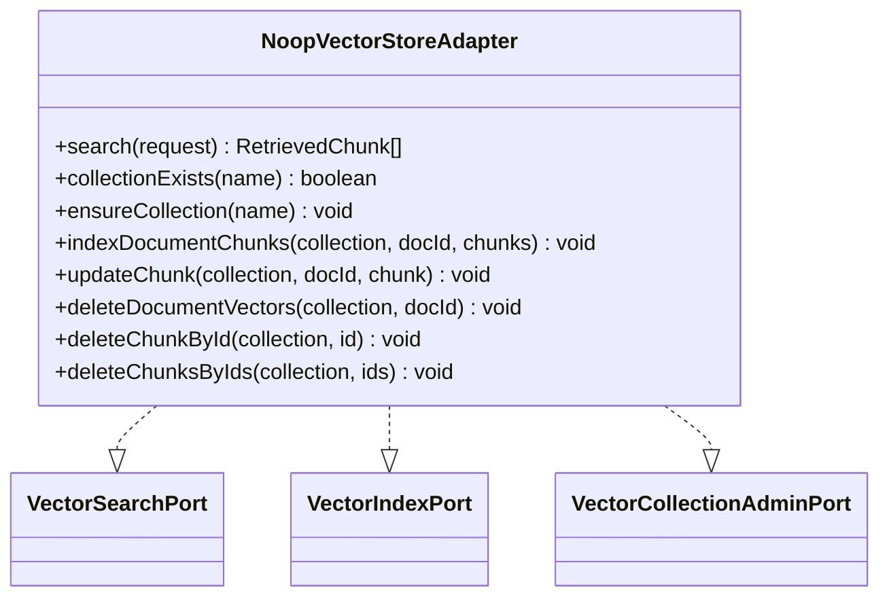
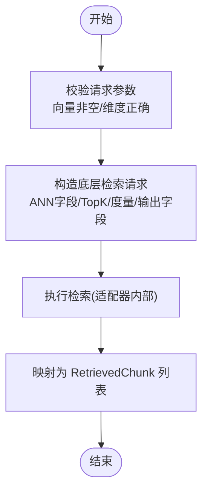
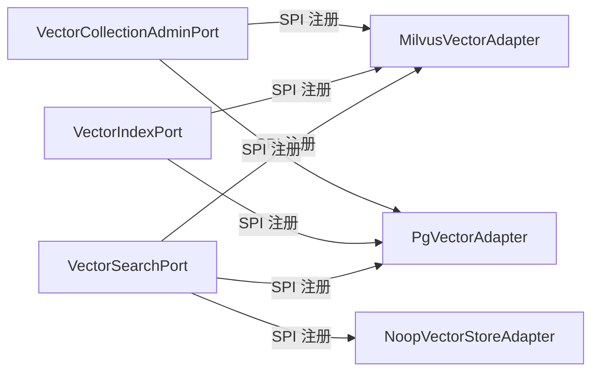

# 向量出站端口

<cite>
**本文引用的文件**
- [MilvusVectorAdapter.java](file://seahorse-agent-adapter-vector-milvus/src/main/java/com/miracle/ai/seahorse/agent/adapters/vector/milvus/MilvusVectorAdapter.java)
- [MilvusVectorProperties.java](file://seahorse-agent-adapter-vector-milvus/src/main/java/com/miracle/ai/seahorse/agent/adapters/vector/milvus/MilvusVectorProperties.java)
- [PgVectorAdapter.java](file://seahorse-agent-adapter-vector-pgvector/src/main/java/com/miracle/ai/seahorse/agent/adapters/vector/pgvector/PgVectorAdapter.java)
- [PgVectorProperties.java](file://seahorse-agent-adapter-vector-pgvector/src/main/java/com/miracle/ai/seahorse/agent/adapters/vector/pgvector/PgVectorProperties.java)
- [NoopVectorStoreAdapter.java](file://seahorse-agent-adapter-vector-noop/src/main/java/com/miracle/ai/seahorse/agent/adapters/vector/noop/NoopVectorStoreAdapter.java)
- [VectorSearchPort.java](file://seahorse-agent-kernel/src/main/java/com/miracle/ai/seahorse/agent/ports/outbound/vector/VectorSearchPort.java)
- [VectorIndexPort.java](file://seahorse-agent-kernel/src/main/java/com/miracle/ai/seahorse/agent/ports/outbound/vector/VectorIndexPort.java)
- [VectorCollectionAdminPort.java](file://seahorse-agent-kernel/src/main/java/com/miracle/ai/seahorse/agent/ports/outbound/vector/VectorCollectionAdminPort.java)
- [VectorSearchRequest.java](file://seahorse-agent-kernel/src/main/java/com/miracle/ai/seahorse/agent/ports/outbound/vector/VectorSearchRequest.java)
- [milvus 端口注册](file://seahorse-agent-adapter-vector-milvus/src/main/resources/META-INF/seahorse-agent/com.miracle.ai.seahorse.agent.ports.outbound.vector.VectorSearchPort)
- [pgvector 端口注册](file://seahorse-agent-adapter-vector-pgvector/src/main/resources/META-INF/seahorse-agent/com.miracle.ai.seahorse.agent.ports.outbound.vector.VectorSearchPort)
- [noop 端口注册](file://seahorse-agent-adapter-vector-noop/src/main/resources/META-INF/seahorse-agent/com.miracle.ai.seahorse.agent.ports.outbound.vector.VectorSearchPort)
</cite>

## 目录
1. [简介](#简介)
2. [项目结构](#项目结构)
3. [核心组件](#核心组件)
4. [架构总览](#架构总览)
5. [详细组件分析](#详细组件分析)
6. [依赖分析](#依赖分析)
7. [性能考虑](#性能考虑)
8. [故障排查指南](#故障排查指南)
9. [结论](#结论)
10. [附录](#附录)

## 简介
本文件面向“向量出站端口”的技术文档，聚焦于以下三类端口的设计与实现：
- VectorSearchPort：向量检索端口，负责执行语义相似度搜索，返回检索到的文本片段及相似度分数。
- VectorIndexPort：向量索引端口，负责文档分片的批量写入、更新与删除，屏蔽底层向量存储实现细节。
- VectorCollectionAdminPort：向量集合管理端口，负责集合（表）的存在性检查与确保创建，避免直接依赖具体 SDK 的管理 API。

当前仓库提供了三种实现：
- Milvus 实现：基于 Milvus 客户端 SDK，采用 HNSW 索引与多种度量类型，支持插入、更新、删除与检索。
- pgvector 实现：基于 PostgreSQL 的 pgvector 扩展，使用 HNSW 索引与余弦距离，支持 UPSERT、批量写入与检索。
- Noop 实现：用于禁用向量检索的占位实现，写入仅记录集合存在性，检索返回空结果。

## 项目结构
围绕向量出站端口，项目采用“端口 + 多实现”的分层设计：
- kernel 层定义统一端口与请求模型，隔离上层业务与具体实现。
- adapter 层提供多种实现，分别对接 Milvus、pgvector、noop 等后端。
- 配置通过资源文件中的 SPI 注册，实现可插拔与按需启用。

图表来源
- [VectorSearchPort.java:30-39](file://seahorse-agent-kernel/src/main/java/com/miracle/ai/seahorse/agent/ports/outbound/vector/VectorSearchPort.java#L30-L39)
- [VectorIndexPort.java:30-36](file://seahorse-agent-kernel/src/main/java/com/miracle/ai/seahorse/agent/ports/outbound/vector/VectorIndexPort.java#L30-L36)
- [VectorCollectionAdminPort.java:25-41](file://seahorse-agent-kernel/src/main/java/com/miracle/ai/seahorse/agent/ports/outbound/vector/VectorCollectionAdminPort.java#L25-L41)
- [VectorSearchRequest.java:35-52](file://seahorse-agent-kernel/src/main/java/com/miracle/ai/seahorse/agent/ports/outbound/vector/VectorSearchRequest.java#L35-L52)
- [MilvusVectorAdapter.java:56-90](file://seahorse-agent-adapter-vector-milvus/src/main/java/com/miracle/ai/seahorse/agent/adapters/vector/milvus/MilvusVectorAdapter.java#L56-L90)
- [PgVectorAdapter.java:48-109](file://seahorse-agent-adapter-vector-pgvector/src/main/java/com/miracle/ai/seahorse/agent/adapters/vector/pgvector/PgVectorAdapter.java#L48-L109)
- [NoopVectorStoreAdapter.java:36-81](file://seahorse-agent-adapter-vector-noop/src/main/java/com/miracle/ai/seahorse/agent/adapters/vector/noop/NoopVectorStoreAdapter.java#L36-L81)

章节来源
- [VectorSearchPort.java:24-39](file://seahorse-agent-kernel/src/main/java/com/miracle/ai/seahorse/agent/ports/outbound/vector/VectorSearchPort.java#L24-L39)
- [VectorIndexPort.java:24-36](file://seahorse-agent-kernel/src/main/java/com/miracle/ai/seahorse/agent/ports/outbound/vector/VectorIndexPort.java#L24-L36)
- [VectorCollectionAdminPort.java:20-41](file://seahorse-agent-kernel/src/main/java/com/miracle/ai/seahorse/agent/ports/outbound/vector/VectorCollectionAdminPort.java#L20-L41)
- [VectorSearchRequest.java:24-52](file://seahorse-agent-kernel/src/main/java/com/miracle/ai/seahorse/agent/ports/outbound/vector/VectorSearchRequest.java#L24-L52)

## 核心组件
- VectorSearchPort：统一检索入口，屏蔽底层 SDK 差异，上层仅依赖该接口进行相似度搜索。
- VectorIndexPort：统一索引写入入口，支持批量写入、单条更新、按文档/按 ID 删除，便于入库链路解耦。
- VectorCollectionAdminPort：统一集合管理入口，提供存在性检查与确保创建能力，避免直接调用具体 SDK 的管理 API。
- VectorSearchRequest：统一检索请求模型，包含集合名、查询文本、查询向量、返回数量与过滤条件，确保跨实现一致性。

章节来源
- [VectorSearchPort.java:30-39](file://seahorse-agent-kernel/src/main/java/com/miracle/ai/seahorse/agent/ports/outbound/vector/VectorSearchPort.java#L30-L39)
- [VectorIndexPort.java:30-36](file://seahorse-agent-kernel/src/main/java/com/miracle/ai/seahorse/agent/ports/outbound/vector/VectorIndexPort.java#L30-L36)
- [VectorCollectionAdminPort.java:25-41](file://seahorse-agent-kernel/src/main/java/com/miracle/ai/seahorse/agent/ports/outbound/vector/VectorCollectionAdminPort.java#L25-L41)
- [VectorSearchRequest.java:35-52](file://seahorse-agent-kernel/src/main/java/com/miracle/ai/seahorse/agent/ports/outbound/vector/VectorSearchRequest.java#L35-L52)

## 架构总览
下图展示了检索流程的关键步骤：上层通过 VectorSearchPort 发起检索，适配器解析请求、构造底层查询、执行检索并映射为统一的 RetrievedChunk 结果。

图表来源
- [MilvusVectorAdapter.java:76-90](file://seahorse-agent-adapter-vector-milvus/src/main/java/com/miracle/ai/seahorse/agent/adapters/vector/milvus/MilvusVectorAdapter.java#L76-L90)
- [PgVectorAdapter.java:67-80](file://seahorse-agent-adapter-vector-pgvector/src/main/java/com/miracle/ai/seahorse/agent/adapters/vector/pgvector/PgVectorAdapter.java#L67-L80)
- [VectorSearchPort.java:30-39](file://seahorse-agent-kernel/src/main/java/com/miracle/ai/seahorse/agent/ports/outbound/vector/VectorSearchPort.java#L30-L39)

## 详细组件分析

### Milvus 实现（MilvusVectorAdapter）
- 角色定位：实现 VectorSearchPort、VectorIndexPort、VectorCollectionAdminPort，屏蔽 Milvus SDK 细节。
- 关键特性
  - 检索：接收 VectorSearchRequest，构造 Milvus 搜索请求，设置 ANN 字段、TopK、度量类型与输出字段，返回 RetrievedChunk 列表。
  - 索引：支持批量写入文档分片、单条 Upsert 更新、按文档 ID 或分片 ID 删除。
  - 集合管理：检查集合是否存在、确保集合创建（含主键、内容、JSON 元数据、浮点向量字段与 HNSW 索引参数）。
  - 数据约束：严格校验向量维度与非空；对内容长度截断；元数据中嵌入集合名、文档 ID、分片索引等。
- 索引策略
  - 使用 HNSW 索引，支持多种度量类型（由属性配置决定），索引参数包含 M、efConstruction 等。
  - 检索时设置 ef 参数以平衡召回与性能。
- 性能要点
  - TopK 默认值保护与参数校验。
  - 输出字段最小化，减少网络与序列化开销。

图表来源
- [MilvusVectorAdapter.java:56-170](file://seahorse-agent-adapter-vector-milvus/src/main/java/com/miracle/ai/seahorse/agent/adapters/vector/milvus/MilvusVectorAdapter.java#L56-L170)
- [VectorSearchPort.java:30-39](file://seahorse-agent-kernel/src/main/java/com/miracle/ai/seahorse/agent/ports/outbound/vector/VectorSearchPort.java#L30-L39)
- [VectorIndexPort.java:30-36](file://seahorse-agent-kernel/src/main/java/com/miracle/ai/seahorse/agent/ports/outbound/vector/VectorIndexPort.java#L30-L36)
- [VectorCollectionAdminPort.java:25-41](file://seahorse-agent-kernel/src/main/java/com/miracle/ai/seahorse/agent/ports/outbound/vector/VectorCollectionAdminPort.java#L25-L41)

章节来源
- [MilvusVectorAdapter.java:76-170](file://seahorse-agent-adapter-vector-milvus/src/main/java/com/miracle/ai/seahorse/agent/adapters/vector/milvus/MilvusVectorAdapter.java#L76-L170)
- [MilvusVectorProperties.java:22-39](file://seahorse-agent-adapter-vector-milvus/src/main/java/com/miracle/ai/seahorse/agent/adapters/vector/milvus/MilvusVectorProperties.java#L22-L39)

### pgvector 实现（PgVectorAdapter）
- 角色定位：实现 VectorSearchPort、VectorIndexPort、VectorCollectionAdminPort，封装 PostgreSQL + pgvector 方言。
- 关键特性
  - 检索：将查询向量转为 SQL 字面量，设置 HNSW 检索参数，执行余弦距离排序并限制 TopK。
  - 索引：支持批量写入（UPSERT），按 ID 更新或删除，按文档 ID 删除整批向量。
  - 集合管理：检查数据库类型与扩展安装情况，确保表存在与 HNSW 索引存在。
  - 数据约束：严格校验维度、表名合法性，JSON 元数据序列化。
- 索引策略
  - 使用 HNSW 索引，向量列类型为 vector(dimension)，索引使用余弦距离操作符。
- 性能要点
  - 设置 HNSW 检索参数以提升召回质量。
  - 批量写入使用 PreparedStatement 批处理，减少往返。

图表来源
- [PgVectorAdapter.java:48-161](file://seahorse-agent-adapter-vector-pgvector/src/main/java/com/miracle/ai/seahorse/agent/adapters/vector/pgvector/PgVectorAdapter.java#L48-L161)
- [VectorSearchPort.java:30-39](file://seahorse-agent-kernel/src/main/java/com/miracle/ai/seahorse/agent/ports/outbound/vector/VectorSearchPort.java#L30-L39)
- [VectorIndexPort.java:30-36](file://seahorse-agent-kernel/src/main/java/com/miracle/ai/seahorse/agent/ports/outbound/vector/VectorIndexPort.java#L30-L36)
- [VectorCollectionAdminPort.java:25-41](file://seahorse-agent-kernel/src/main/java/com/miracle/ai/seahorse/agent/ports/outbound/vector/VectorCollectionAdminPort.java#L25-L41)

章节来源
- [PgVectorAdapter.java:67-161](file://seahorse-agent-adapter-vector-pgvector/src/main/java/com/miracle/ai/seahorse/agent/adapters/vector/pgvector/PgVectorAdapter.java#L67-L161)
- [PgVectorProperties.java:22-39](file://seahorse-agent-adapter-vector-pgvector/src/main/java/com/miracle/ai/seahorse/agent/adapters/vector/pgvector/PgVectorProperties.java#L22-L39)

### Noop 实现（NoopVectorStoreAdapter）
- 角色定位：用于禁用向量检索的占位实现，写入仅记录集合存在性，检索返回空列表。
- 适用场景：测试、演示或临时关闭向量检索功能。

图表来源
- [NoopVectorStoreAdapter.java:36-81](file://seahorse-agent-adapter-vector-noop/src/main/java/com/miracle/ai/seahorse/agent/adapters/vector/noop/NoopVectorStoreAdapter.java#L36-L81)
- [VectorSearchPort.java:30-39](file://seahorse-agent-kernel/src/main/java/com/miracle/ai/seahorse/agent/ports/outbound/vector/VectorSearchPort.java#L30-L39)
- [VectorIndexPort.java:30-36](file://seahorse-agent-kernel/src/main/java/com/miracle/ai/seahorse/agent/ports/outbound/vector/VectorIndexPort.java#L30-L36)
- [VectorCollectionAdminPort.java:25-41](file://seahorse-agent-kernel/src/main/java/com/miracle/ai/seahorse/agent/ports/outbound/vector/VectorCollectionAdminPort.java#L25-L41)

章节来源
- [NoopVectorStoreAdapter.java:36-81](file://seahorse-agent-adapter-vector-noop/src/main/java/com/miracle/ai/seahorse/agent/adapters/vector/noop/NoopVectorStoreAdapter.java#L36-L81)

### 检索流程（算法与数据流）
- 输入：VectorSearchRequest（集合名、查询文本、查询向量、TopK、过滤条件）。
- 处理：适配器根据实现选择合适的索引与度量（如余弦距离、内积等），执行相似度计算与排序。
- 输出：RetrievedChunk（分片 ID、文本内容、相似度分数）。

图表来源
- [MilvusVectorAdapter.java:76-90](file://seahorse-agent-adapter-vector-milvus/src/main/java/com/miracle/ai/seahorse/agent/adapters/vector/milvus/MilvusVectorAdapter.java#L76-L90)
- [PgVectorAdapter.java:67-80](file://seahorse-agent-adapter-vector-pgvector/src/main/java/com/miracle/ai/seahorse/agent/adapters/vector/pgvector/PgVectorAdapter.java#L67-L80)

章节来源
- [VectorSearchRequest.java:35-52](file://seahorse-agent-kernel/src/main/java/com/miracle/ai/seahorse/agent/ports/outbound/vector/VectorSearchRequest.java#L35-L52)

## 依赖分析
- 端口与实现的绑定通过资源文件中的 SPI 注册，实现可插拔与按需启用。
- 不同实现共享同一请求模型与接口契约，降低上层耦合度。
- 适配器内部对输入参数进行严格校验，避免越界与类型不匹配问题。

图表来源
- [milvus 端口注册:1-5](file://seahorse-agent-adapter-vector-milvus/src/main/resources/META-INF/seahorse-agent/com.miracle.ai.seahorse.agent.ports.outbound.vector.VectorSearchPort#L1-L5)
- [pgvector 端口注册:1-5](file://seahorse-agent-adapter-vector-pgvector/src/main/resources/META-INF/seahorse-agent/com.miracle.ai.seahorse.agent.ports.outbound.vector.VectorSearchPort#L1-L5)
- [noop 端口注册:1-5](file://seahorse-agent-adapter-vector-noop/src/main/resources/META-INF/seahorse-agent/com.miracle.ai.seahorse.agent.ports.outbound.vector.VectorSearchPort#L1-L5)

章节来源
- [milvus 端口注册:1-5](file://seahorse-agent-adapter-vector-milvus/src/main/resources/META-INF/seahorse-agent/com.miracle.ai.seahorse.agent.ports.outbound.vector.VectorSearchPort#L1-L5)
- [pgvector 端口注册:1-5](file://seahorse-agent-adapter-vector-pgvector/src/main/resources/META-INF/seahorse-agent/com.miracle.ai.seahorse.agent.ports.outbound.vector.VectorSearchPort#L1-L5)
- [noop 端口注册:1-5](file://seahorse-agent-adapter-vector-noop/src/main/resources/META-INF/seahorse-agent/com.miracle.ai.seahorse.agent.ports.outbound.vector.VectorSearchPort#L1-L5)

## 性能考虑
- 索引与度量
  - Milvus：HNSW 索引，支持多种度量类型；ef 参数影响召回与延迟的权衡。
  - pgvector：HNSW 索引，使用余弦距离；通过设置 HNSW 检索参数提升效果。
- TopK 与输出字段
  - 对 TopK 提供默认保护；仅返回必要字段，减少序列化与传输开销。
- 批处理与连接
  - pgvector 支持批量写入；Milvus 插入/更新接口支持批量提交。
- 数据约束
  - 严格校验向量维度与非空；内容长度截断；元数据 JSON 序列化失败即抛异常，避免脏数据进入索引。

章节来源
- [MilvusVectorAdapter.java:172-181](file://seahorse-agent-adapter-vector-milvus/src/main/java/com/miracle/ai/seahorse/agent/adapters/vector/milvus/MilvusVectorAdapter.java#L172-L181)
- [PgVectorAdapter.java:263-277](file://seahorse-agent-adapter-vector-pgvector/src/main/java/com/miracle/ai/seahorse/agent/adapters/vector/pgvector/PgVectorAdapter.java#L263-L277)
- [MilvusVectorAdapter.java:284-286](file://seahorse-agent-adapter-vector-milvus/src/main/java/com/miracle/ai/seahorse/agent/adapters/vector/milvus/MilvusVectorAdapter.java#L284-L286)
- [PgVectorAdapter.java:312-314](file://seahorse-agent-adapter-vector-pgvector/src/main/java/com/miracle/ai/seahorse/agent/adapters/vector/pgvector/PgVectorAdapter.java#L312-L314)

## 故障排查指南
- 常见错误与定位
  - 向量维度不匹配：任一实现均会校验维度，抛出非法参数异常，检查嵌入模型输出维度与配置一致。
  - 空向量或空集合：当查询向量为空或集合名为空时，Milvus 实现直接返回空结果；pgvector 实现同样会短路返回。
  - 数据库/SDK 异常：pgvector 在连接、扩展检查、SQL 执行失败时抛出非法状态异常；Milvus 在搜索/管理调用失败时抛出异常。
  - 元数据序列化失败：pgvector 在 JSON 序列化失败时抛出非法参数异常。
- 排查建议
  - 核对配置项（Milvus 度量类型、pgvector 表名与维度）。
  - 检查底层服务连通性与权限。
  - 查看日志中的异常堆栈，定位具体方法与参数。

章节来源
- [MilvusVectorAdapter.java:266-274](file://seahorse-agent-adapter-vector-milvus/src/main/java/com/miracle/ai/seahorse/agent/adapters/vector/milvus/MilvusVectorAdapter.java#L266-L274)
- [PgVectorAdapter.java:279-287](file://seahorse-agent-adapter-vector-pgvector/src/main/java/com/miracle/ai/seahorse/agent/adapters/vector/pgvector/PgVectorAdapter.java#L279-L287)
- [MilvusVectorAdapter.java:76-82](file://seahorse-agent-adapter-vector-milvus/src/main/java/com/miracle/ai/seahorse/agent/adapters/vector/milvus/MilvusVectorAdapter.java#L76-L82)
- [PgVectorAdapter.java:67-72](file://seahorse-agent-adapter-vector-pgvector/src/main/java/com/miracle/ai/seahorse/agent/adapters/vector/pgvector/PgVectorAdapter.java#L67-L72)
- [PgVectorAdapter.java:205-210](file://seahorse-agent-adapter-vector-pgvector/src/main/java/com/miracle/ai/seahorse/agent/adapters/vector/pgvector/PgVectorAdapter.java#L205-L210)

## 结论
通过统一的向量出站端口与多实现适配器，系统实现了：
- 上层业务与底层向量存储的解耦；
- 可插拔的实现选择（Milvus、pgvector、noop）；
- 明确的检索、索引与集合管理职责边界；
- 面向性能的索引策略与参数控制。

在实际部署中，建议结合数据规模、查询延迟与精度要求选择合适实现，并合理配置索引参数与 TopK，以获得最佳的检索体验。

## 附录
- 配置与注册
  - Milvus：通过 SPI 注册默认实现为 MilvusVectorAdapter，支持度量类型与维度配置。
  - pgvector：通过 SPI 注册默认实现为 PgVectorAdapter，支持表名与维度配置。
  - noop：通过 SPI 注册为占位实现，适合禁用向量检索的场景。

章节来源
- [milvus 端口注册:1-5](file://seahorse-agent-adapter-vector-milvus/src/main/resources/META-INF/seahorse-agent/com.miracle.ai.seahorse.agent.ports.outbound.vector.VectorSearchPort#L1-L5)
- [pgvector 端口注册:1-5](file://seahorse-agent-adapter-vector-pgvector/src/main/resources/META-INF/seahorse-agent/com.miracle.ai.seahorse.agent.ports.outbound.vector.VectorSearchPort#L1-L5)
- [noop 端口注册:1-5](file://seahorse-agent-adapter-vector-noop/src/main/resources/META-INF/seahorse-agent/com.miracle.ai.seahorse.agent.ports.outbound.vector.VectorSearchPort#L1-L5)