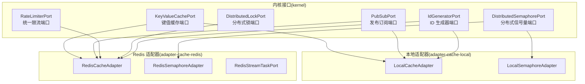
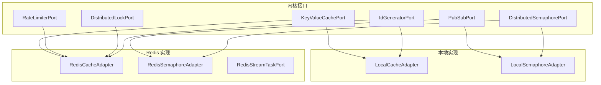
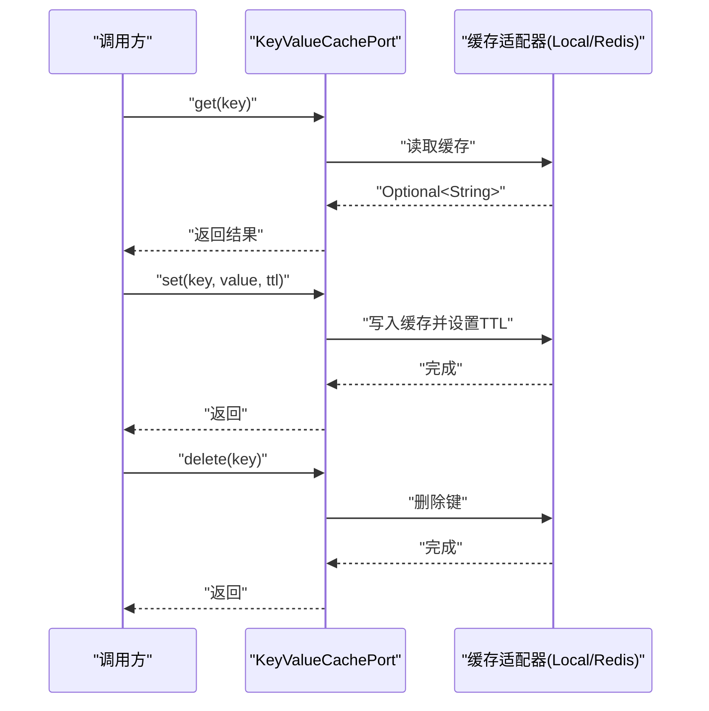
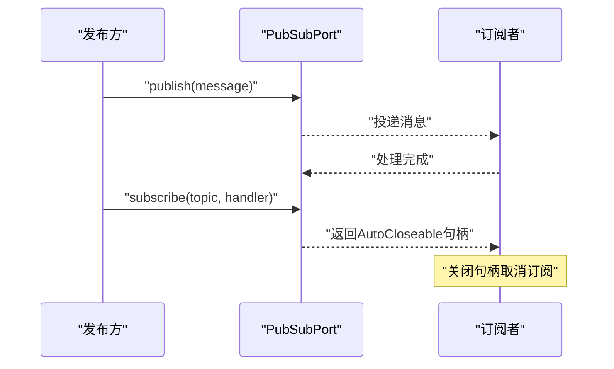
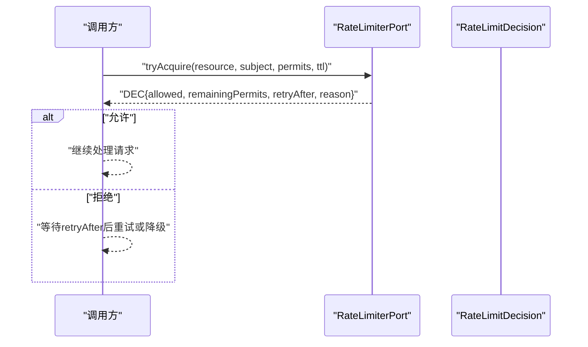
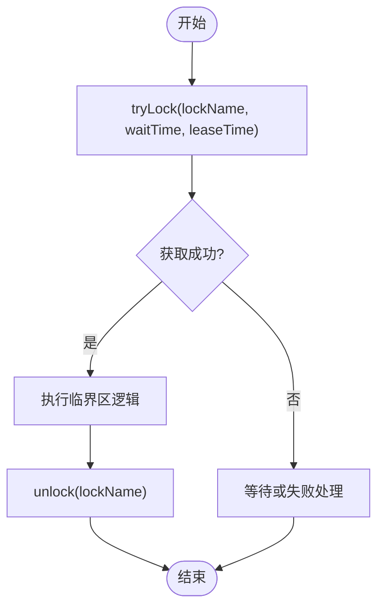
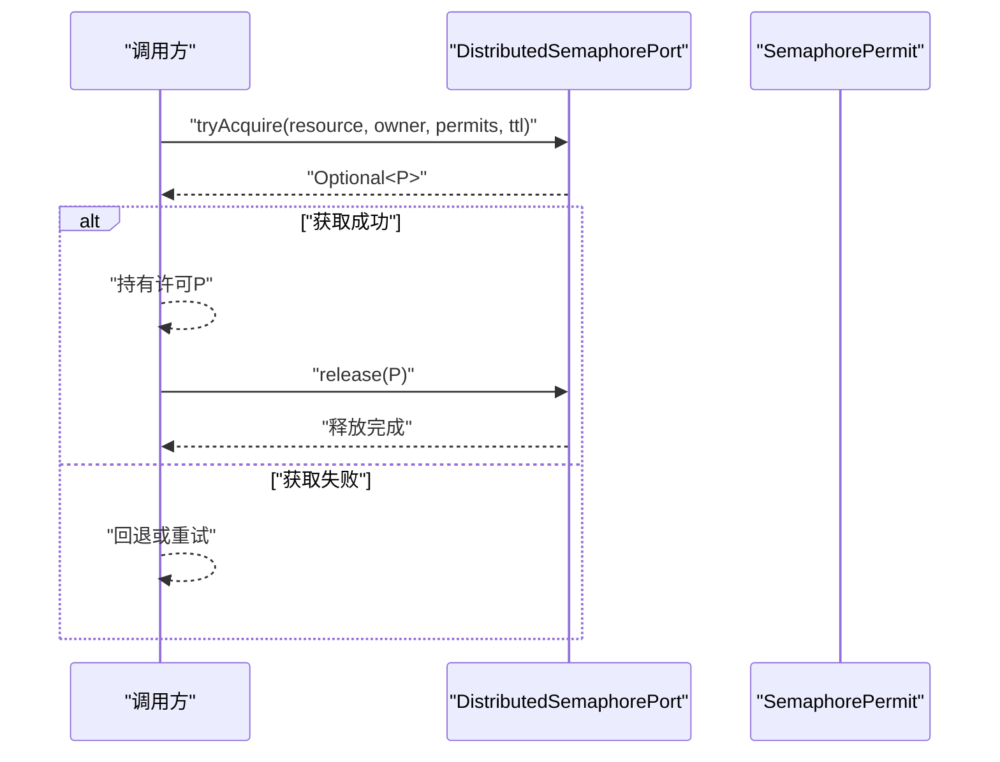
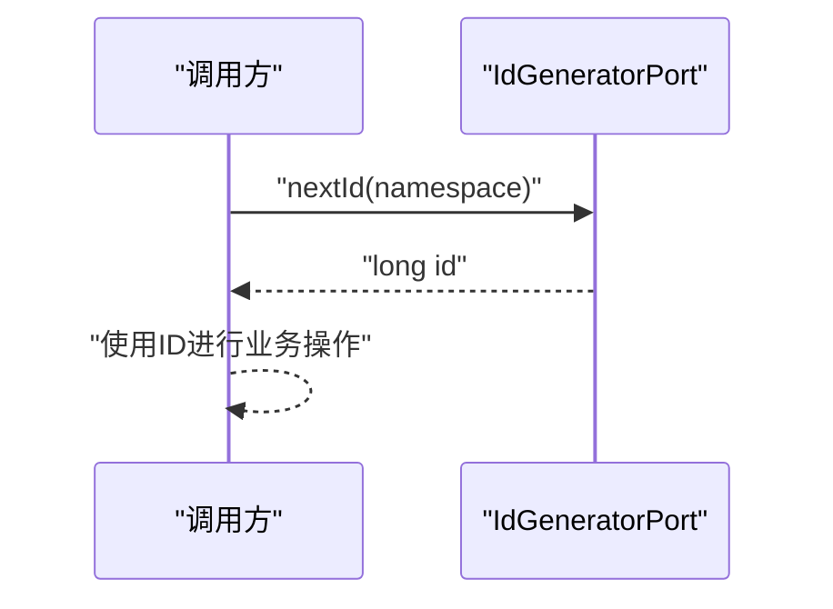
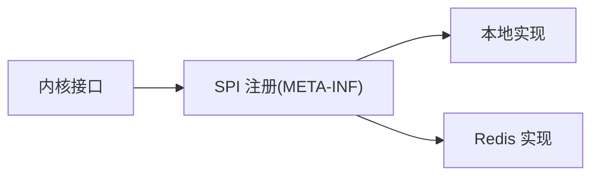

# 缓存出站端口

<cite>
**本文引用的文件**
- [KeyValueCachePort.java](file://seahorse-agent-kernel/src/main/java/com/miracle/ai/seahorse/agent/ports/outbound/cache/KeyValueCachePort.java)
- [PubSubPort.java](file://seahorse-agent-kernel/src/main/java/com/miracle/ai/seahorse/agent/ports/outbound/cache/PubSubPort.java)
- [PubSubMessage.java](file://seahorse-agent-kernel/src/main/java/com/miracle/ai/seahorse/agent/ports/outbound/cache/PubSubMessage.java)
- [PubSubMessageHandler.java](file://seahorse-agent-kernel/src/main/java/com/miracle/ai/seahorse/agent/ports/outbound/cache/PubSubMessageHandler.java)
- [RateLimiterPort.java](file://seahorse-agent-kernel/src/main/java/com/miracle/ai/seahorse/agent/ports/outbound/cache/RateLimiterPort.java)
- [RateLimitDecision.java](file://seahorse-agent-kernel/src/main/java/com/miracle/ai/seahorse/agent/ports/outbound/cache/RateLimitDecision.java)
- [DistributedLockPort.java](file://seahorse-agent-kernel/src/main/java/com/miracle/ai/seahorse/agent/ports/outbound/coordination/DistributedLockPort.java)
- [DistributedSemaphorePort.java](file://seahorse-agent-kernel/src/main/java/com/miracle/ai/seahorse/agent/ports/outbound/coordination/DistributedSemaphorePort.java)
- [IdGeneratorPort.java](file://seahorse-agent-kernel/src/main/java/com/miracle/ai/seahorse/agent/ports/outbound/id/IdGeneratorPort.java)
- [LocalCacheAdapter.java](file://seahorse-agent-adapter-cache-local/src/main/java/com/miracle/ai/seahorse/agent/adapters/cache/local/LocalCacheAdapter.java)
- [LocalSemaphoreAdapter.java](file://seahorse-agent-adapter-cache-local/src/main/java/com/miracle/ai/seahorse/agent/adapters/cache/local/LocalSemaphoreAdapter.java)
- [RedisCacheAdapter.java](file://seahorse-agent-adapter-cache-redis/src/main/java/com/miracle/ai/seahorse/agent/adapters/cache/redis/RedisCacheAdapter.java)
- [RedisSemaphoreAdapter.java](file://seahorse-agent-adapter-cache-redis/src/main/java/com/miracle/ai/seahorse/agent/adapters/cache/redis/RedisSemaphoreAdapter.java)
- [RedisStreamTaskPort.java](file://seahorse-agent-adapter-cache-redis/src/main/java/com/miracle/ai/seahorse/agent/adapters/cache/redis/RedisStreamTaskPort.java)
- [com.miracle.ai.seahorse.agent.ports.outbound.cache.KeyValueCachePort](file://seahorse-agent-adapter-cache-local/src/main/resources/META-INF/seahorse-agent/com.miracle.ai.seahorse.agent.ports.outbound.cache.KeyValueCachePort)
- [com.miracle.ai.seahorse.agent.ports.outbound.cache.PubSubPort](file://seahorse-agent-adapter-cache-local/src/main/resources/META-INF/seahorse-agent/com.miracle.ai.seahorse.agent.ports.outbound.cache.PubSubPort)
- [com.miracle.ai.seahorse.agent.ports.outbound.cache.RateLimiterPort](file://seahorse-agent-adapter-cache-local/src/main/resources/META-INF/seahorse-agent/com.miracle.ai.seahorse.agent.ports.outbound.cache.RateLimiterPort)
- [com.miracle.ai.seahorse.agent.ports.outbound.coordination.DistributedLockPort](file://seahorse-agent-adapter-cache-local/src/main/resources/META-INF/seahorse-agent/com.miracle.ai.seahorse.agent.ports.outbound.coordination.DistributedLockPort)
- [com.miracle.ai.seahorse.agent.ports.outbound.coordination.DistributedSemaphorePort](file://seahorse-agent-adapter-cache-local/src/main/resources/META-INF/seahorse-agent/com.miracle.ai.seahorse.agent.ports.outbound.coordination.DistributedSemaphorePort)
- [com.miracle.ai.seahorse.agent.ports.outbound.id.IdGeneratorPort](file://seahorse-agent-adapter-cache-local/src/main/resources/META-INF/seahorse-agent/com.miracle.ai.seahorse.agent.ports.outbound.id.IdGeneratorPort)
- [com.miracle.ai.seahorse.agent.ports.outbound.cache.KeyValueCachePort](file://seahorse-agent-adapter-cache-redis/src/main/resources/META-INF/seahorse-agent/com.miracle.ai.seahorse.agent.ports.outbound.cache.KeyValueCachePort)
- [com.miracle.ai.seahorse.agent.ports.outbound.cache.PubSubPort](file://seahorse-agent-adapter-cache-redis/src/main/resources/META-INF/seahorse-agent/com.miracle.ai.seahorse.agent.ports.outbound.cache.PubSubPort)
- [com.miracle.ai.seahorse.agent.ports.outbound.cache.RateLimiterPort](file://seahorse-agent-adapter-cache-redis/src/main/resources/META-INF/seahorse-agent/com.miracle.ai.seahorse.agent.ports.outbound.cache.RateLimiterPort)
- [com.miracle.ai.seahorse.agent.ports.outbound.coordination.DistributedLockPort](file://seahorse-agent-adapter-cache-redis/src/main/resources/META-INF/seahorse-agent/com.miracle.ai.seahorse.agent.ports.outbound.coordination.DistributedLockPort)
- [com.miracle.ai.seahorse.agent.ports.outbound.coordination.DistributedSemaphorePort](file://seahorse-agent-adapter-cache-redis/src/main/resources/META-INF/seahorse-agent/com.miracle.ai.seahorse.agent.ports.outbound.coordination.DistributedSemaphorePort)
- [com.miracle.ai.seahorse.agent.ports.outbound.id.IdGeneratorPort](file://seahorse-agent-adapter-cache-redis/src/main/resources/META-INF/seahorse-agent/com.miracle.ai.seahorse.agent.ports.outbound.id.IdGeneratorPort)
- [com.miracle.ai.seahorse.agent.ports.outbound.stream.StreamTaskPort](file://seahorse-agent-adapter-cache-redis/src/main/resources/META-INF/seahorse-agent/com.miracle.ai.seahorse.agent.ports.outbound.stream.StreamTaskPort)
</cite>

## 目录
1. [引言](#引言)
2. [项目结构](#项目结构)
3. [核心组件](#核心组件)
4. [架构总览](#架构总览)
5. [详细组件分析](#详细组件分析)
6. [依赖分析](#依赖分析)
7. [性能考虑](#性能考虑)
8. [故障排查指南](#故障排查指南)
9. [结论](#结论)
10. [附录](#附录)

## 引言
本文件聚焦于“缓存出站端口”的设计与实现，覆盖以下关键端口：键值缓存端口、发布订阅端口、统一限流端口、分布式锁端口、分布式信号量端口以及 ID 生成器端口。文档从接口定义、数据模型、适配器实现到集成配置进行系统化梳理，并给出流程图与时序图帮助读者快速理解各组件在实际系统中的协作关系。

## 项目结构
本项目采用模块化分层设计，核心接口位于 kernel 模块中定义，具体实现由适配器模块提供（本地实现与 Redis 实现）。META-INF 配置文件用于声明 SPI 扩展点及默认实现选择。

图表来源
- [KeyValueCachePort.java:26-33](file://seahorse-agent-kernel/src/main/java/com/miracle/ai/seahorse/agent/ports/outbound/cache/KeyValueCachePort.java#L26-L33)
- [PubSubPort.java:25-43](file://seahorse-agent-kernel/src/main/java/com/miracle/ai/seahorse/agent/ports/outbound/cache/PubSubPort.java#L25-L43)
- [RateLimiterPort.java:27-44](file://seahorse-agent-kernel/src/main/java/com/miracle/ai/seahorse/agent/ports/outbound/cache/RateLimiterPort.java#L27-L44)
- [DistributedLockPort.java:25-43](file://seahorse-agent-kernel/src/main/java/com/miracle/ai/seahorse/agent/ports/outbound/coordination/DistributedLockPort.java#L25-L43)
- [DistributedSemaphorePort.java:28-48](file://seahorse-agent-kernel/src/main/java/com/miracle/ai/seahorse/agent/ports/outbound/coordination/DistributedSemaphorePort.java#L28-L48)
- [IdGeneratorPort.java:25-35](file://seahorse-agent-kernel/src/main/java/com/miracle/ai/seahorse/agent/ports/outbound/id/IdGeneratorPort.java#L25-L35)
- [LocalCacheAdapter.java](file://seahorse-agent-adapter-cache-local/src/main/java/com/miracle/ai/seahorse/agent/adapters/cache/local/LocalCacheAdapter.java)
- [LocalSemaphoreAdapter.java](file://seahorse-agent-adapter-cache-local/src/main/java/com/miracle/ai/seahorse/agent/adapters/cache/local/LocalSemaphoreAdapter.java)
- [RedisCacheAdapter.java](file://seahorse-agent-adapter-cache-redis/src/main/java/com/miracle/ai/seahorse/agent/adapters/cache/redis/RedisCacheAdapter.java)
- [RedisSemaphoreAdapter.java](file://seahorse-agent-adapter-cache-redis/src/main/java/com/miracle/ai/seahorse/agent/adapters/cache/redis/RedisSemaphoreAdapter.java)
- [RedisStreamTaskPort.java](file://seahorse-agent-adapter-cache-redis/src/main/java/com/miracle/ai/seahorse/agent/adapters/cache/redis/RedisStreamTaskPort.java)

章节来源
- [KeyValueCachePort.java:26-33](file://seahorse-agent-kernel/src/main/java/com/miracle/ai/seahorse/agent/ports/outbound/cache/KeyValueCachePort.java#L26-L33)
- [PubSubPort.java:25-43](file://seahorse-agent-kernel/src/main/java/com/miracle/ai/seahorse/agent/ports/outbound/cache/PubSubPort.java#L25-L43)
- [RateLimiterPort.java:27-44](file://seahorse-agent-kernel/src/main/java/com/miracle/ai/seahorse/agent/ports/outbound/cache/RateLimiterPort.java#L27-L44)
- [DistributedLockPort.java:25-43](file://seahorse-agent-kernel/src/main/java/com/miracle/ai/seahorse/agent/ports/outbound/coordination/DistributedLockPort.java#L25-L43)
- [DistributedSemaphorePort.java:28-48](file://seahorse-agent-kernel/src/main/java/com/miracle/ai/seahorse/agent/ports/outbound/coordination/DistributedSemaphorePort.java#L28-L48)
- [IdGeneratorPort.java:25-35](file://seahorse-agent-kernel/src/main/java/com/miracle/ai/seahorse/agent/ports/outbound/id/IdGeneratorPort.java#L25-L35)

## 核心组件
本节对六大出站端口进行逐项解析，包括接口职责、参数语义、返回约定与典型用法。

- 键值缓存端口 KeyValueCachePort
  - 职责：提供字符串键值的读取、写入（带 TTL）与删除能力。
  - 关键方法：get(key)、set(key, value, ttl)、delete(key)。
  - 典型场景：会话状态、临时令牌、查询结果缓存。
  - 章节来源
    - [KeyValueCachePort.java:26-33](file://seahorse-agent-kernel/src/main/java/com/miracle/ai/seahorse/agent/ports/outbound/cache/KeyValueCachePort.java#L26-L33)

- 发布订阅端口 PubSubPort
  - 职责：发布消息与订阅主题，支持自动关闭的订阅句柄。
  - 关键类型：PubSubMessage（主题、负载、头部）、PubSubMessageHandler（消息处理函数式接口）。
  - 典型场景：事件广播、跨服务通知、异步任务编排。
  - 章节来源
    - [PubSubPort.java:25-43](file://seahorse-agent-kernel/src/main/java/com/miracle/ai/seahorse/agent/ports/outbound/cache/PubSubPort.java#L25-L43)
    - [PubSubMessage.java:30-39](file://seahorse-agent-kernel/src/main/java/com/miracle/ai/seahorse/agent/ports/outbound/cache/PubSubMessage.java#L30-L39)
    - [PubSubMessageHandler.java:23-32](file://seahorse-agent-kernel/src/main/java/com/miracle/ai/seahorse/agent/ports/outbound/cache/PubSubMessageHandler.java#L23-L32)

- 统一限流端口 RateLimiterPort
  - 职责：基于资源与主体的统一限流判定，返回是否允许、剩余许可与重试建议。
  - 关键类型：RateLimitDecision（允许标志、剩余许可、重试时间、原因）。
  - 典型场景：API 限流、下游依赖保护、突发流量削峰。
  - 章节来源
    - [RateLimiterPort.java:27-44](file://seahorse-agent-kernel/src/main/java/com/miracle/ai/seahorse/agent/ports/outbound/cache/RateLimiterPort.java#L27-L44)
    - [RateLimitDecision.java:31-50](file://seahorse-agent-kernel/src/main/java/com/miracle/ai/seahorse/agent/ports/outbound/cache/RateLimitDecision.java#L31-L50)

- 分布式锁端口 DistributedLockPort
  - 职责：尝试获取锁并在持有期间提供解锁；提供空实现以兼容无分布式锁环境。
  - 典型场景：分布式互斥、幂等执行、抢购/秒杀。
  - 章节来源
    - [DistributedLockPort.java:25-43](file://seahorse-agent-kernel/src/main/java/com/miracle/ai/seahorse/agent/ports/outbound/coordination/DistributedLockPort.java#L25-L43)

- 分布式信号量端口 DistributedSemaphorePort
  - 职责：按资源与持有者申请/释放许可，支持许可 TTL；提供空实现。
  - 典型场景：并发池控制、共享资源配额、限速令牌桶扩展。
  - 章节来源
    - [DistributedSemaphorePort.java:28-48](file://seahorse-agent-kernel/src/main/java/com/miracle/ai/seahorse/agent/ports/outbound/coordination/DistributedSemaphorePort.java#L28-L48)

- ID 生成器端口 IdGeneratorPort
  - 职责：为指定命名空间生成单调递增 ID，支持分布式唯一性。
  - 典型场景：订单号、任务 ID、日志追踪 ID。
  - 章节来源
    - [IdGeneratorPort.java:25-35](file://seahorse-agent-kernel/src/main/java/com/miracle/ai/seahorse/agent/ports/outbound/id/IdGeneratorPort.java#L25-L35)

## 架构总览
下图展示了内核端口与适配器之间的绑定关系，以及默认实现的选择策略（通过 SPI 注册与 META-INF 配置）。

图表来源
- [com.miracle.ai.seahorse.agent.ports.outbound.cache.KeyValueCachePort](file://seahorse-agent-adapter-cache-local/src/main/resources/META-INF/seahorse-agent/com.miracle.ai.seahorse.agent.ports.outbound.cache.KeyValueCachePort)
- [com.miracle.ai.seahorse.agent.ports.outbound.cache.PubSubPort](file://seahorse-agent-adapter-cache-local/src/main/resources/META-INF/seahorse-agent/com.miracle.ai.seahorse.agent.ports.outbound.cache.PubSubPort)
- [com.miracle.ai.seahorse.agent.ports.outbound.cache.RateLimiterPort](file://seahorse-agent-adapter-cache-local/src/main/resources/META-INF/seahorse-agent/com.miracle.ai.seahorse.agent.ports.outbound.cache.RateLimiterPort)
- [com.miracle.ai.seahorse.agent.ports.outbound.coordination.DistributedLockPort](file://seahorse-agent-adapter-cache-local/src/main/resources/META-INF/seahorse-agent/com.miracle.ai.seahorse.agent.ports.outbound.coordination.DistributedLockPort)
- [com.miracle.ai.seahorse.agent.ports.outbound.coordination.DistributedSemaphorePort](file://seahorse-agent-adapter-cache-local/src/main/resources/META-INF/seahorse-agent/com.miracle.ai.seahorse.agent.ports.outbound.coordination.DistributedSemaphorePort)
- [com.miracle.ai.seahorse.agent.ports.outbound.id.IdGeneratorPort](file://seahorse-agent-adapter-cache-local/src/main/resources/META-INF/seahorse-agent/com.miracle.ai.seahorse.agent.ports.outbound.id.IdGeneratorPort)
- [com.miracle.ai.seahorse.agent.ports.outbound.cache.KeyValueCachePort](file://seahorse-agent-adapter-cache-redis/src/main/resources/META-INF/seahorse-agent/com.miracle.ai.seahorse.agent.ports.outbound.cache.KeyValueCachePort)
- [com.miracle.ai.seahorse.agent.ports.outbound.cache.PubSubPort](file://seahorse-agent-adapter-cache-redis/src/main/resources/META-INF/seahorse-agent/com.miracle.ai.seahorse.agent.ports.outbound.cache.PubSubPort)
- [com.miracle.ai.seahorse.agent.ports.outbound.cache.RateLimiterPort](file://seahorse-agent-adapter-cache-redis/src/main/resources/META-INF/seahorse-agent/com.miracle.ai.seahorse.agent.ports.outbound.cache.RateLimiterPort)
- [com.miracle.ai.seahorse.agent.ports.outbound.coordination.DistributedLockPort](file://seahorse-agent-adapter-cache-redis/src/main/resources/META-INF/seahorse-agent/com.miracle.ai.seahorse.agent.ports.outbound.coordination.DistributedLockPort)
- [com.miracle.ai.seahorse.agent.ports.outbound.coordination.DistributedSemaphorePort](file://seahorse-agent-adapter-cache-redis/src/main/resources/META-INF/seahorse-agent/com.miracle.ai.seahorse.agent.ports.outbound.coordination.DistributedSemaphorePort)
- [com.miracle.ai.seahorse.agent.ports.outbound.id.IdGeneratorPort](file://seahorse-agent-adapter-cache-redis/src/main/resources/META-INF/seahorse-agent/com.miracle.ai.seahorse.agent.ports.outbound.id.IdGeneratorPort)

## 详细组件分析

### 键值缓存端口 KeyValueCachePort
- 设计要点
  - 接口简洁，仅包含 get、set、delete 三类基本操作，便于不同存储后端实现。
  - TTL 参数支持过期策略，适合短期缓存与热点数据。
- 数据流
  - 读路径：客户端调用 get(key)，若命中则返回值，否则返回空。
  - 写路径：客户端调用 set(key, value, ttl)，写入缓存并设置过期时间。
  - 删路径：客户端调用 delete(key)，删除对应键。
- 适配器实现
  - 本地实现：内存级缓存，适合单实例或测试环境。
  - Redis 实现：持久化与高可用，适合生产环境。
- 章节来源
  - [KeyValueCachePort.java:26-33](file://seahorse-agent-kernel/src/main/java/com/miracle/ai/seahorse/agent/ports/outbound/cache/KeyValueCachePort.java#L26-L33)
  - [LocalCacheAdapter.java](file://seahorse-agent-adapter-cache-local/src/main/java/com/miracle/ai/seahorse/agent/adapters/cache/local/LocalCacheAdapter.java)
  - [RedisCacheAdapter.java](file://seahorse-agent-adapter-cache-redis/src/main/java/com/miracle/ai/seahorse/agent/adapters/cache/redis/RedisCacheAdapter.java)

图表来源
- [KeyValueCachePort.java:26-33](file://seahorse-agent-kernel/src/main/java/com/miracle/ai/seahorse/agent/ports/outbound/cache/KeyValueCachePort.java#L26-L33)
- [LocalCacheAdapter.java](file://seahorse-agent-adapter-cache-local/src/main/java/com/miracle/ai/seahorse/agent/adapters/cache/local/LocalCacheAdapter.java)
- [RedisCacheAdapter.java](file://seahorse-agent-adapter-cache-redis/src/main/java/com/miracle/ai/seahorse/agent/adapters/cache/redis/RedisCacheAdapter.java)

### 发布订阅端口 PubSubPort
- 设计要点
  - 使用记录类 PubSubMessage 表达主题、负载与头部，确保不可变与校验。
  - 订阅返回 AutoCloseable 句柄，便于自动取消订阅。
- 流程图
  - 发布流程：调用方构造消息并调用 publish，消息被路由至订阅者。
  - 订阅流程：调用 subscribe 返回句柄，内部注册处理器；关闭句柄即取消订阅。
- 章节来源
  - [PubSubPort.java:25-43](file://seahorse-agent-kernel/src/main/java/com/miracle/ai/seahorse/agent/ports/outbound/cache/PubSubPort.java#L25-L43)
  - [PubSubMessage.java:30-39](file://seahorse-agent-kernel/src/main/java/com/miracle/ai/seahorse/agent/ports/outbound/cache/PubSubMessage.java#L30-L39)
  - [PubSubMessageHandler.java:23-32](file://seahorse-agent-kernel/src/main/java/com/miracle/ai/seahorse/agent/ports/outbound/cache/PubSubMessageHandler.java#L23-L32)

图表来源
- [PubSubPort.java:25-43](file://seahorse-agent-kernel/src/main/java/com/miracle/ai/seahorse/agent/ports/outbound/cache/PubSubPort.java#L25-L43)
- [PubSubMessage.java:30-39](file://seahorse-agent-kernel/src/main/java/com/miracle/ai/seahorse/agent/ports/outbound/cache/PubSubMessage.java#L30-L39)
- [PubSubMessageHandler.java:23-32](file://seahorse-agent-kernel/src/main/java/com/miracle/ai/seahorse/agent/ports/outbound/cache/PubSubMessageHandler.java#L23-L32)

### 统一限流端口 RateLimiterPort
- 设计要点
  - tryAcquire 提供资源维度的限流决策，返回 RateLimitDecision。
  - RateLimitDecision 包含 allowed、remainingPermits、retryAfter、reason，便于客户端自适应重试。
  - 提供 noop 实现，便于在无限流需求时使用。
- 时序图
  - 客户端在每次请求前调用 tryAcquire，根据返回决定放行或等待。
- 章节来源
  - [RateLimiterPort.java:27-44](file://seahorse-agent-kernel/src/main/java/com/miracle/ai/seahorse/agent/ports/outbound/cache/RateLimiterPort.java#L27-L44)
  - [RateLimitDecision.java:31-50](file://seahorse-agent-kernel/src/main/java/com/miracle/ai/seahorse/agent/ports/outbound/cache/RateLimitDecision.java#L31-L50)

图表来源
- [RateLimiterPort.java:27-44](file://seahorse-agent-kernel/src/main/java/com/miracle/ai/seahorse/agent/ports/outbound/cache/RateLimiterPort.java#L27-L44)
- [RateLimitDecision.java:31-50](file://seahorse-agent-kernel/src/main/java/com/miracle/ai/seahorse/agent/ports/outbound/cache/RateLimitDecision.java#L31-L50)

### 分布式锁端口 DistributedLockPort
- 设计要点
  - tryLock 支持等待时间与租约时间，避免死锁与长时间占用。
  - 提供空实现，便于在单机或测试环境下直接通过。
- 章节来源
  - [DistributedLockPort.java:25-43](file://seahorse-agent-kernel/src/main/java/com/miracle/ai/seahorse/agent/ports/outbound/coordination/DistributedLockPort.java#L25-L43)

图表来源
- [DistributedLockPort.java:25-43](file://seahorse-agent-kernel/src/main/java/com/miracle/ai/seahorse/agent/ports/outbound/coordination/DistributedLockPort.java#L25-L43)

### 分布式信号量端口 DistributedSemaphorePort
- 设计要点
  - tryAcquire 支持资源、持有者、许可数与 TTL，返回许可对象以便释放。
  - release 释放已持有的许可。
- 章节来源
  - [DistributedSemaphorePort.java:28-48](file://seahorse-agent-kernel/src/main/java/com/miracle/ai/seahorse/agent/ports/outbound/coordination/DistributedSemaphorePort.java#L28-L48)

图表来源
- [DistributedSemaphorePort.java:28-48](file://seahorse-agent-kernel/src/main/java/com/miracle/ai/seahorse/agent/ports/outbound/coordination/DistributedSemaphorePort.java#L28-L48)

### ID 生成器端口 IdGeneratorPort
- 设计要点
  - nextId(namespace) 为命名空间生成单调递增 ID，保证分布式唯一性。
  - 默认实现选择为 local，可通过 SPI 切换为 Redis 实现。
- 章节来源
  - [IdGeneratorPort.java:25-35](file://seahorse-agent-kernel/src/main/java/com/miracle/ai/seahorse/agent/ports/outbound/id/IdGeneratorPort.java#L25-L35)

图表来源
- [IdGeneratorPort.java:25-35](file://seahorse-agent-kernel/src/main/java/com/miracle/ai/seahorse/agent/ports/outbound/id/IdGeneratorPort.java#L25-L35)

## 依赖分析
- 接口与实现解耦
  - 内核仅定义端口接口，具体实现通过 SPI 与 META-INF 配置注入，降低耦合度。
- 适配器分布
  - 本地适配器：LocalCacheAdapter、LocalSemaphoreAdapter。
  - Redis 适配器：RedisCacheAdapter、RedisSemaphoreAdapter、RedisStreamTaskPort。
- 配置映射
  - 各端口在本地与 Redis 适配器中均有对应的 SPI 映射文件，确保运行时正确加载。

图表来源
- [com.miracle.ai.seahorse.agent.ports.outbound.cache.KeyValueCachePort](file://seahorse-agent-adapter-cache-local/src/main/resources/META-INF/seahorse-agent/com.miracle.ai.seahorse.agent.ports.outbound.cache.KeyValueCachePort)
- [com.miracle.ai.seahorse.agent.ports.outbound.cache.PubSubPort](file://seahorse-agent-adapter-cache-local/src/main/resources/META-INF/seahorse-agent/com.miracle.ai.seahorse.agent.ports.outbound.cache.PubSubPort)
- [com.miracle.ai.seahorse.agent.ports.outbound.cache.RateLimiterPort](file://seahorse-agent-adapter-cache-local/src/main/resources/META-INF/seahorse-agent/com.miracle.ai.seahorse.agent.ports.outbound.cache.RateLimiterPort)
- [com.miracle.ai.seahorse.agent.ports.outbound.coordination.DistributedLockPort](file://seahorse-agent-adapter-cache-local/src/main/resources/META-INF/seahorse-agent/com.miracle.ai.seahorse.agent.ports.outbound.coordination.DistributedLockPort)
- [com.miracle.ai.seahorse.agent.ports.outbound.coordination.DistributedSemaphorePort](file://seahorse-agent-adapter-cache-local/src/main/resources/META-INF/seahorse-agent/com.miracle.ai.seahorse.agent.ports.outbound.coordination.DistributedSemaphorePort)
- [com.miracle.ai.seahorse.agent.ports.outbound.id.IdGeneratorPort](file://seahorse-agent-adapter-cache-local/src/main/resources/META-INF/seahorse-agent/com.miracle.ai.seahorse.agent.ports.outbound.id.IdGeneratorPort)
- [com.miracle.ai.seahorse.agent.ports.outbound.cache.KeyValueCachePort](file://seahorse-agent-adapter-cache-redis/src/main/resources/META-INF/seahorse-agent/com.miracle.ai.seahorse.agent.ports.outbound.cache.KeyValueCachePort)
- [com.miracle.ai.seahorse.agent.ports.outbound.cache.PubSubPort](file://seahorse-agent-adapter-cache-redis/src/main/resources/META-INF/seahorse-agent/com.miracle.ai.seahorse.agent.ports.outbound.cache.PubSubPort)
- [com.miracle.ai.seahorse.agent.ports.outbound.cache.RateLimiterPort](file://seahorse-agent-adapter-cache-redis/src/main/resources/META-INF/seahorse-agent/com.miracle.ai.seahorse.agent.ports.outbound.cache.RateLimiterPort)
- [com.miracle.ai.seahorse.agent.ports.outbound.coordination.DistributedLockPort](file://seahorse-agent-adapter-cache-redis/src/main/resources/META-INF/seahorse-agent/com.miracle.ai.seahorse.agent.ports.outbound.coordination.DistributedLockPort)
- [com.miracle.ai.seahorse.agent.ports.outbound.coordination.DistributedSemaphorePort](file://seahorse-agent-adapter-cache-redis/src/main/resources/META-INF/seahorse-agent/com.miracle.ai.seahorse.agent.ports.outbound.coordination.DistributedSemaphorePort)
- [com.miracle.ai.seahorse.agent.ports.outbound.id.IdGeneratorPort](file://seahorse-agent-adapter-cache-redis/src/main/resources/META-INF/seahorse-agent/com.miracle.ai.seahorse.agent.ports.outbound.id.IdGeneratorPort)

章节来源
- [com.miracle.ai.seahorse.agent.ports.outbound.cache.KeyValueCachePort](file://seahorse-agent-adapter-cache-local/src/main/resources/META-INF/seahorse-agent/com.miracle.ai.seahorse.agent.ports.outbound.cache.KeyValueCachePort)
- [com.miracle.ai.seahorse.agent.ports.outbound.cache.PubSubPort](file://seahorse-agent-adapter-cache-local/src/main/resources/META-INF/seahorse-agent/com.miracle.ai.seahorse.agent.ports.outbound.cache.PubSubPort)
- [com.miracle.ai.seahorse.agent.ports.outbound.cache.RateLimiterPort](file://seahorse-agent-adapter-cache-local/src/main/resources/META-INF/seahorse-agent/com.miracle.ai.seahorse.agent.ports.outbound.cache.RateLimiterPort)
- [com.miracle.ai.seahorse.agent.ports.outbound.coordination.DistributedLockPort](file://seahorse-agent-adapter-cache-local/src/main/resources/META-INF/seahorse-agent/com.miracle.ai.seahorse.agent.ports.outbound.coordination.DistributedLockPort)
- [com.miracle.ai.seahorse.agent.ports.outbound.coordination.DistributedSemaphorePort](file://seahorse-agent-adapter-cache-local/src/main/resources/META-INF/seahorse-agent/com.miracle.ai.seahorse.agent.ports.outbound.coordination.DistributedSemaphorePort)
- [com.miracle.ai.seahorse.agent.ports.outbound.id.IdGeneratorPort](file://seahorse-agent-adapter-cache-local/src/main/resources/META-INF/seahorse-agent/com.miracle.ai.seahorse.agent.ports.outbound.id.IdGeneratorPort)
- [com.miracle.ai.seahorse.agent.ports.outbound.cache.KeyValueCachePort](file://seahorse-agent-adapter-cache-redis/src/main/resources/META-INF/seahorse-agent/com.miracle.ai.seahorse.agent.ports.outbound.cache.KeyValueCachePort)
- [com.miracle.ai.seahorse.agent.ports.outbound.cache.PubSubPort](file://seahorse-agent-adapter-cache-redis/src/main/resources/META-INF/seahorse-agent/com.miracle.ai.seahorse.agent.ports.outbound.cache.PubSubPort)
- [com.miracle.ai.seahorse.agent.ports.outbound.cache.RateLimiterPort](file://seahorse-agent-adapter-cache-redis/src/main/resources/META-INF/seahorse-agent/com.miracle.ai.seahorse.agent.ports.outbound.cache.RateLimiterPort)
- [com.miracle.ai.seahorse.agent.ports.outbound.coordination.DistributedLockPort](file://seahorse-agent-adapter-cache-redis/src/main/resources/META-INF/seahorse-agent/com.miracle.ai.seahorse.agent.ports.outbound.coordination.DistributedLockPort)
- [com.miracle.ai.seahorse.agent.ports.outbound.coordination.DistributedSemaphorePort](file://seahorse-agent-adapter-cache-redis/src/main/resources/META-INF/seahorse-agent/com.miracle.ai.seahorse.agent.ports.outbound.coordination.DistributedSemaphorePort)
- [com.miracle.ai.seahorse.agent.ports.outbound.id.IdGeneratorPort](file://seahorse-agent-adapter-cache-redis/src/main/resources/META-INF/seahorse-agent/com.miracle.ai.seahorse.agent.ports.outbound.id.IdGeneratorPort)

## 性能考虑
- 缓存策略
  - TTL 策略：为热点数据设置合理 TTL，避免陈旧数据影响一致性。
  - 命中率优化：优先使用短路径读取，减少序列化开销。
- 限流算法
  - 基于滑动窗口或令牌桶的统一限流，结合 RateLimitDecision 的 retryAfter 进行优雅降级。
- 并发控制
  - 分布式信号量与锁配合使用，避免资源争用导致的抖动。
- 存储选择
  - 本地适配器适合低延迟场景；Redis 适配器适合高可用与多实例部署。

## 故障排查指南
- 发布订阅
  - 检查主题合法性与消息头完整性；确认订阅句柄未提前关闭。
- 限流
  - 若频繁被拒绝，检查 permits 与 ttl 设置是否合理；利用 retryAfter 自适应退避。
- 分布式锁/信号量
  - 确认 tryLock 的等待时间与租约时间配置；避免死锁与资源泄漏。
- ID 生成
  - 核对命名空间唯一性；在 Redis 实现下检查集群一致性。

## 结论
本文档系统梳理了缓存与协调相关的出站端口设计与实现，明确了接口职责、数据模型与适配器边界，并通过流程与时序图帮助读者快速掌握关键交互。结合本地与 Redis 两种实现，可在不同部署环境中灵活选择，满足高性能、可扩展与易维护的需求。

## 附录
- 示例参考（以路径代替代码）
  - 键值缓存读取：[KeyValueCachePort.get](file://seahorse-agent-kernel/src/main/java/com/miracle/ai/seahorse/agent/ports/outbound/cache/KeyValueCachePort.java#L28)
  - 键值缓存写入：[KeyValueCachePort.set](file://seahorse-agent-kernel/src/main/java/com/miracle/ai/seahorse/agent/ports/outbound/cache/KeyValueCachePort.java#L30)
  - 发布消息：[PubSubPort.publish](file://seahorse-agent-kernel/src/main/java/com/miracle/ai/seahorse/agent/ports/outbound/cache/PubSubPort.java#L33)
  - 订阅消息：[PubSubPort.subscribe](file://seahorse-agent-kernel/src/main/java/com/miracle/ai/seahorse/agent/ports/outbound/cache/PubSubPort.java#L42)
  - 限流判定：[RateLimiterPort.tryAcquire](file://seahorse-agent-kernel/src/main/java/com/miracle/ai/seahorse/agent/ports/outbound/cache/RateLimiterPort.java#L39)
  - 信号量获取：[DistributedSemaphorePort.tryAcquire](file://seahorse-agent-kernel/src/main/java/com/miracle/ai/seahorse/agent/ports/outbound/coordination/DistributedSemaphorePort.java#L40)
  - 信号量释放：[DistributedSemaphorePort.release](file://seahorse-agent-kernel/src/main/java/com/miracle/ai/seahorse/agent/ports/outbound/coordination/DistributedSemaphorePort.java#L47)
  - 获取 ID：[IdGeneratorPort.nextId](file://seahorse-agent-kernel/src/main/java/com/miracle/ai/seahorse/agent/ports/outbound/id/IdGeneratorPort.java#L34)