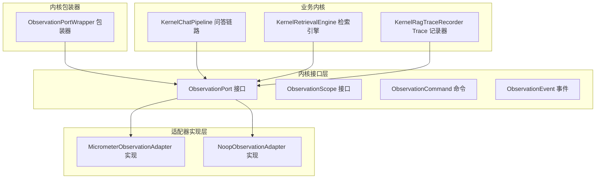
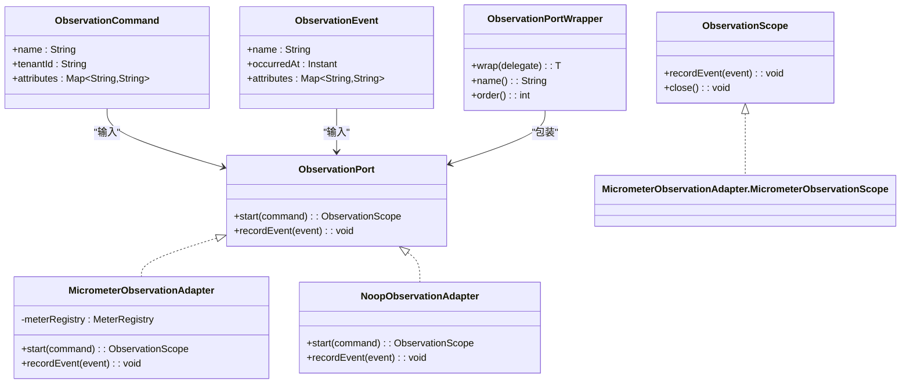
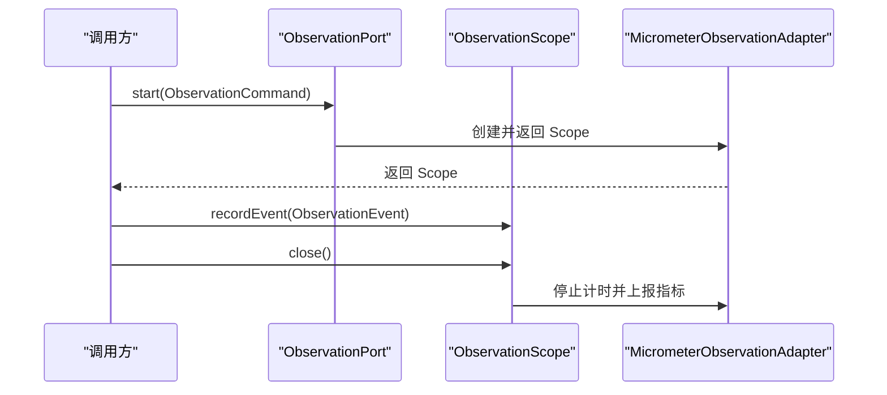
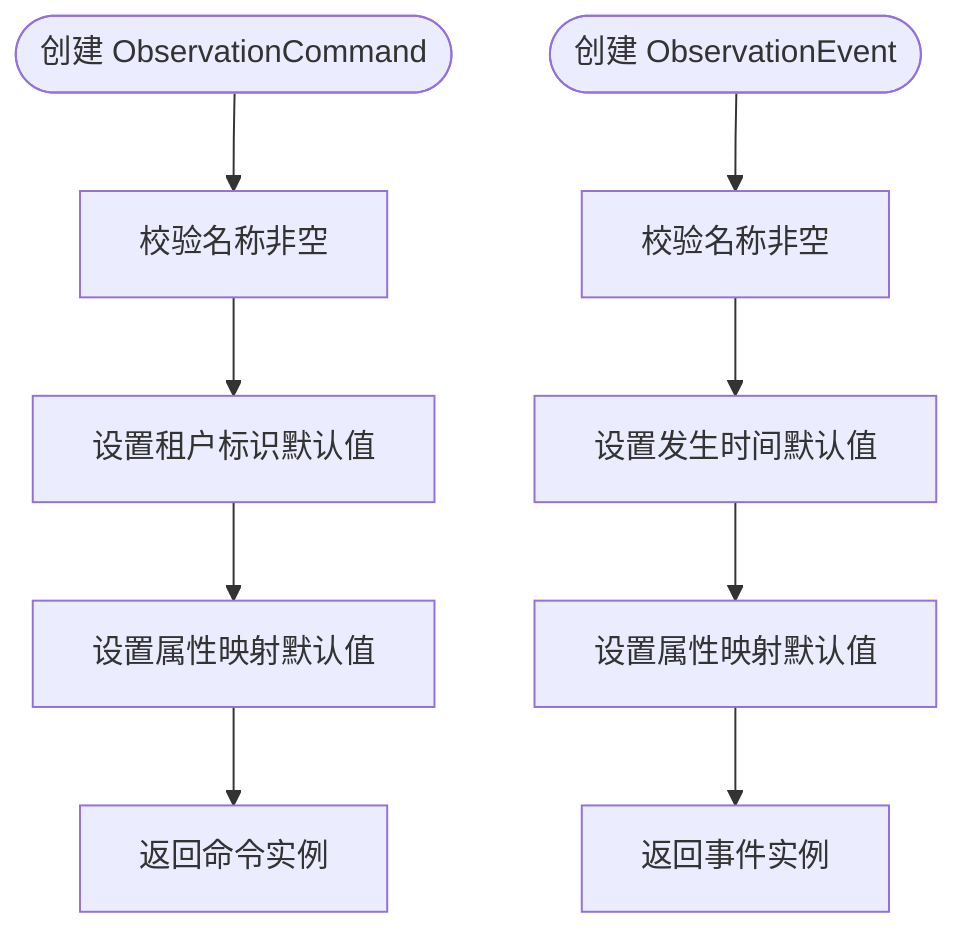
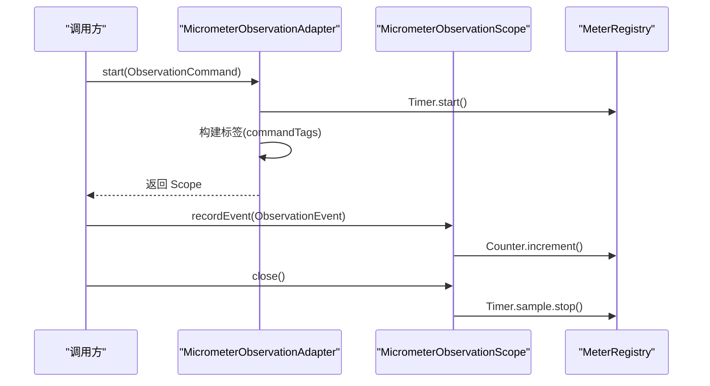
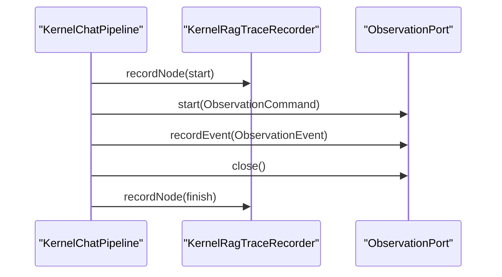
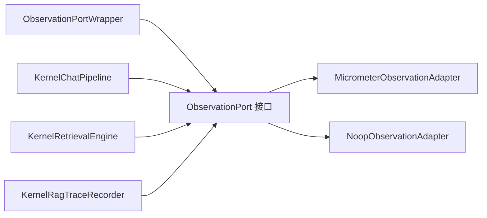

# 观测性出站端口

<cite>
**本文引用的文件**
- [ObservationPort.java](file://seahorse-agent-kernel/src/main/java/com/miracle/ai/seahorse/agent/ports/outbound/observation/ObservationPort.java)
- [ObservationScope.java](file://seahorse-agent-kernel/src/main/java/com/miracle/ai/seahorse/agent/ports/outbound/observation/ObservationScope.java)
- [ObservationCommand.java](file://seahorse-agent-kernel/src/main/java/com/miracle/ai/seahorse/agent/ports/outbound/observation/ObservationCommand.java)
- [ObservationEvent.java](file://seahorse-agent-kernel/src/main/java/com/miracle/ai/seahorse/agent/ports/outbound/observation/ObservationEvent.java)
- [MicrometerObservationAdapter.java](file://seahorse-agent-adapter-observation-micrometer/src/main/java/com/miracle/ai/seahorse/agent/adapters/observation/micrometer/MicrometerObservationAdapter.java)
- [NoopObservationAdapter.java](file://seahorse-agent-adapter-observation-noop/src/main/java/com/miracle/ai/seahorse/agent/adapters/observation/noop/NoopObservationAdapter.java)
- [ObservationPortWrapper.java](file://seahorse-agent-kernel/src/main/java/com/miracle/ai/seahorse/agent/kernel/plugin/wrapper/ObservationPortWrapper.java)
- [KernelRagTraceRecorder.java](file://seahorse-agent-kernel/src/main/java/com/miracle/ai/seahorse/agent/kernel/application/trace/KernelRagTraceRecorder.java)
- [KernelChatPipeline.java](file://seahorse-agent-kernel/src/main/java/com/miracle/ai/seahorse/agent/kernel/application/chat/KernelChatPipeline.java)
- [KernelRetrievalEngine.java](file://seahorse-agent-kernel/src/main/java/com/miracle/ai/seahorse/agent/kernel/application/retrieval/KernelRetrievalEngine.java)
</cite>

## 目录
1. [引言](#引言)
2. [项目结构](#项目结构)
3. [核心组件](#核心组件)
4. [架构总览](#架构总览)
5. [详细组件分析](#详细组件分析)
6. [依赖分析](#依赖分析)
7. [性能考虑](#性能考虑)
8. [故障排查指南](#故障排查指南)
9. [结论](#结论)

## 引言
本文件聚焦“观测性出站端口”，系统性阐述应用监控与可观测性的出站端口设计与实现，涵盖以下关键要素：
- 观测端口接口与生命周期管理：ObservationPort、ObservationScope
- 观测命令与事件模型：ObservationCommand、ObservationEvent
- 指标采集与上报：基于 Micrometer 的计数器与定时器
- 链路追踪与性能分析：结合内核 Trace 记录器的节点级观测
- 适配器模式与可插拔实现：Micrometer 与 Noop 两套实现
- 在问答主链路与检索引擎中的观测实践

目标是帮助读者快速理解并落地一套可扩展、可替换的观测体系，覆盖性能监控、日志记录、指标收集与链路追踪。

## 项目结构
观测性出站端口位于内核模块的 outbounds 层，通过 SPI 接口暴露给上层业务；适配器模块提供具体实现（Micrometer 与 Noop），并以包装器固定在调用链中的位置。

图表来源
- [ObservationPort.java:25-42](file://seahorse-agent-kernel/src/main/java/com/miracle/ai/seahorse/agent/ports/outbound/observation/ObservationPort.java#L25-L42)
- [MicrometerObservationAdapter.java:42-137](file://seahorse-agent-adapter-observation-micrometer/src/main/java/com/miracle/ai/seahorse/agent/adapters/observation/micrometer/MicrometerObservationAdapter.java#L42-L137)
- [NoopObservationAdapter.java:28-55](file://seahorse-agent-adapter-observation-noop/src/main/java/com/miracle/ai/seahorse/agent/adapters/observation/noop/NoopObservationAdapter.java#L28-L55)
- [ObservationPortWrapper.java:27-43](file://seahorse-agent-kernel/src/main/java/com/miracle/ai/seahorse/agent/kernel/plugin/wrapper/ObservationPortWrapper.java#L27-L43)
- [KernelChatPipeline.java:83-106](file://seahorse-agent-kernel/src/main/java/com/miracle/ai/seahorse/agent/kernel/application/chat/KernelChatPipeline.java#L83-L106)
- [KernelRetrievalEngine.java:90-107](file://seahorse-agent-kernel/src/main/java/com/miracle/ai/seahorse/agent/kernel/application/retrieval/KernelRetrievalEngine.java#L90-L107)
- [KernelRagTraceRecorder.java:162-185](file://seahorse-agent-kernel/src/main/java/com/miracle/ai/seahorse/agent/kernel/application/trace/KernelRagTraceRecorder.java#L162-L185)

章节来源
- [ObservationPort.java:25-42](file://seahorse-agent-kernel/src/main/java/com/miracle/ai/seahorse/agent/ports/outbound/observation/ObservationPort.java#L25-L42)
- [MicrometerObservationAdapter.java:42-137](file://seahorse-agent-adapter-observation-micrometer/src/main/java/com/miracle/ai/seahorse/agent/adapters/observation/micrometer/MicrometerObservationAdapter.java#L42-L137)
- [NoopObservationAdapter.java:28-55](file://seahorse-agent-adapter-observation-noop/src/main/java/com/miracle/ai/seahorse/agent/adapters/observation/noop/NoopObservationAdapter.java#L28-L55)
- [ObservationPortWrapper.java:27-43](file://seahorse-agent-kernel/src/main/java/com/miracle/ai/seahorse/agent/kernel/plugin/wrapper/ObservationPortWrapper.java#L27-L43)

## 核心组件
- 观测端口 ObservationPort：定义观测生命周期入口与事件记录入口，支持默认实现（Noop）与 Micrometer 实现。
- 观测作用域 ObservationScope：封装一次观测的生命周期，支持记录事件与关闭计时。
- 观测命令 ObservationCommand：描述一次观测的元信息（名称、租户、属性）。
- 观测事件 ObservationEvent：描述独立发生的观测事件（名称、时间、属性）。
- Micrometer 适配器：将观测映射为 Micrometer 的计数器与定时器，自动打点并聚合标签。
- Noop 适配器：空实现，便于在不需要观测的环境中启用默认行为。
- 包装器 ObservationPortWrapper：固定观测适配器在调用链中的顺序，确保观测贯穿各层。

章节来源
- [ObservationPort.java:25-42](file://seahorse-agent-kernel/src/main/java/com/miracle/ai/seahorse/agent/ports/outbound/observation/ObservationPort.java#L25-L42)
- [ObservationScope.java:23-34](file://seahorse-agent-kernel/src/main/java/com/miracle/ai/seahorse/agent/ports/outbound/observation/ObservationScope.java#L23-L34)
- [ObservationCommand.java:30-39](file://seahorse-agent-kernel/src/main/java/com/miracle/ai/seahorse/agent/ports/outbound/observation/ObservationCommand.java#L30-L39)
- [ObservationEvent.java:31-40](file://seahorse-agent-kernel/src/main/java/com/miracle/ai/seahorse/agent/ports/outbound/observation/ObservationEvent.java#L31-L40)
- [MicrometerObservationAdapter.java:42-137](file://seahorse-agent-adapter-observation-micrometer/src/main/java/com/miracle/ai/seahorse/agent/adapters/observation/micrometer/MicrometerObservationAdapter.java#L42-L137)
- [NoopObservationAdapter.java:28-55](file://seahorse-agent-adapter-observation-noop/src/main/java/com/miracle/ai/seahorse/agent/adapters/observation/noop/NoopObservationAdapter.java#L28-L55)
- [ObservationPortWrapper.java:27-43](file://seahorse-agent-kernel/src/main/java/com/miracle/ai/seahorse/agent/kernel/plugin/wrapper/ObservationPortWrapper.java#L27-L43)

## 架构总览
观测性出站端口采用“接口 + 适配器 + 包装器”的分层设计：
- 接口层提供稳定的 SPI，屏蔽实现细节
- 适配器层提供可替换的具体实现（Micrometer/Noop）
- 包装器层固定观测适配器在调用链中的顺序，保证观测贯穿内核各阶段
- 业务内核在关键路径中使用 ObservationPort 进行性能与事件观测

图表来源
- [ObservationPort.java:25-42](file://seahorse-agent-kernel/src/main/java/com/miracle/ai/seahorse/agent/ports/outbound/observation/ObservationPort.java#L25-L42)
- [ObservationScope.java:23-34](file://seahorse-agent-kernel/src/main/java/com/miracle/ai/seahorse/agent/ports/outbound/observation/ObservationScope.java#L23-L34)
- [ObservationCommand.java:30-39](file://seahorse-agent-kernel/src/main/java/com/miracle/ai/seahorse/agent/ports/outbound/observation/ObservationCommand.java#L30-L39)
- [ObservationEvent.java:31-40](file://seahorse-agent-kernel/src/main/java/com/miracle/ai/seahorse/agent/ports/outbound/observation/ObservationEvent.java#L31-L40)
- [MicrometerObservationAdapter.java:42-137](file://seahorse-agent-adapter-observation-micrometer/src/main/java/com/miracle/ai/seahorse/agent/adapters/observation/micrometer/MicrometerObservationAdapter.java#L42-L137)
- [NoopObservationAdapter.java:28-55](file://seahorse-agent-adapter-observation-noop/src/main/java/com/miracle/ai/seahorse/agent/adapters/observation/noop/NoopObservationAdapter.java#L28-L55)
- [ObservationPortWrapper.java:27-43](file://seahorse-agent-kernel/src/main/java/com/miracle/ai/seahorse/agent/kernel/plugin/wrapper/ObservationPortWrapper.java#L27-L43)

## 详细组件分析

### 观测端口与作用域
- ObservationPort：提供 start 与 recordEvent 两个核心方法，分别开启一次观测并记录独立事件。
- ObservationScope：实现 AutoCloseable，支持在作用域内多次记录事件，并在 close 时完成计时与指标上报。

图表来源
- [ObservationPort.java:25-42](file://seahorse-agent-kernel/src/main/java/com/miracle/ai/seahorse/agent/ports/outbound/observation/ObservationPort.java#L25-L42)
- [ObservationScope.java:23-34](file://seahorse-agent-kernel/src/main/java/com/miracle/ai/seahorse/agent/ports/outbound/observation/ObservationScope.java#L23-L34)
- [MicrometerObservationAdapter.java:56-62](file://seahorse-agent-adapter-observation-micrometer/src/main/java/com/miracle/ai/seahorse/agent/adapters/observation/micrometer/MicrometerObservationAdapter.java#L56-L62)
- [MicrometerObservationAdapter.java:126-134](file://seahorse-agent-adapter-observation-micrometer/src/main/java/com/miracle/ai/seahorse/agent/adapters/observation/micrometer/MicrometerObservationAdapter.java#L126-L134)

章节来源
- [ObservationPort.java:25-42](file://seahorse-agent-kernel/src/main/java/com/miracle/ai/seahorse/agent/ports/outbound/observation/ObservationPort.java#L25-L42)
- [ObservationScope.java:23-34](file://seahorse-agent-kernel/src/main/java/com/miracle/ai/seahorse/agent/ports/outbound/observation/ObservationScope.java#L23-L34)
- [MicrometerObservationAdapter.java:56-62](file://seahorse-agent-adapter-observation-micrometer/src/main/java/com/miracle/ai/seahorse/agent/adapters/observation/micrometer/MicrometerObservationAdapter.java#L56-L62)
- [MicrometerObservationAdapter.java:126-134](file://seahorse-agent-adapter-observation-micrometer/src/main/java/com/miracle/ai/seahorse/agent/adapters/observation/micrometer/MicrometerObservationAdapter.java#L126-L134)

### 观测命令与事件
- ObservationCommand：包含观测名称、租户标识与属性映射，构造时进行非空校验与默认值处理。
- ObservationEvent：包含事件名称、发生时间与属性映射，默认时间为当前时间，属性默认为空映射。

图表来源
- [ObservationCommand.java:30-39](file://seahorse-agent-kernel/src/main/java/com/miracle/ai/seahorse/agent/ports/outbound/observation/ObservationCommand.java#L30-L39)
- [ObservationEvent.java:31-40](file://seahorse-agent-kernel/src/main/java/com/miracle/ai/seahorse/agent/ports/outbound/observation/ObservationEvent.java#L31-L40)

章节来源
- [ObservationCommand.java:30-39](file://seahorse-agent-kernel/src/main/java/com/miracle/ai/seahorse/agent/ports/outbound/observation/ObservationCommand.java#L30-L39)
- [ObservationEvent.java:31-40](file://seahorse-agent-kernel/src/main/java/com/miracle/ai/seahorse/agent/ports/outbound/observation/ObservationEvent.java#L31-L40)

### Micrometer 适配器
- 指标维度：duration（定时器）、events（计数器）
- 标签策略：观测名称、租户、属性键值对；事件标签包含事件名与属性
- 生命周期：start 返回带采样与标签的作用域；close 时停止计时并上报 duration；作用域内 recordEvent 上报 events

图表来源
- [MicrometerObservationAdapter.java:56-62](file://seahorse-agent-adapter-observation-micrometer/src/main/java/com/miracle/ai/seahorse/agent/adapters/observation/micrometer/MicrometerObservationAdapter.java#L56-L62)
- [MicrometerObservationAdapter.java:117-134](file://seahorse-agent-adapter-observation-micrometer/src/main/java/com/miracle/ai/seahorse/agent/adapters/observation/micrometer/MicrometerObservationAdapter.java#L117-L134)

章节来源
- [MicrometerObservationAdapter.java:42-137](file://seahorse-agent-adapter-observation-micrometer/src/main/java/com/miracle/ai/seahorse/agent/adapters/observation/micrometer/MicrometerObservationAdapter.java#L42-L137)

### Noop 适配器
- 无实际观测逻辑，适合在开发或禁用观测场景下使用
- start 返回固定空作用域，recordEvent 与 close 均为空操作

章节来源
- [NoopObservationAdapter.java:28-55](file://seahorse-agent-adapter-observation-noop/src/main/java/com/miracle/ai/seahorse/agent/adapters/observation/noop/NoopObservationAdapter.java#L28-L55)

### 包装器与调用链
- ObservationPortWrapper 固定观测包装器在调用链中的顺序，确保观测贯穿内核各层
- 通过包装器，ObservationPort 可被统一注入到内核服务中

章节来源
- [ObservationPortWrapper.java:27-43](file://seahorse-agent-kernel/src/main/java/com/miracle/ai/seahorse/agent/kernel/plugin/wrapper/ObservationPortWrapper.java#L27-L43)

### 在业务内核中的观测实践
- KernelChatPipeline：在问答主链路的每个阶段使用 Trace 记录器进行节点级观测，同时可结合 ObservationPort 进行指标采集
- KernelRetrievalEngine：检索主流程中可插入观测命令与事件，记录检索耗时与关键事件

图表来源
- [KernelChatPipeline.java:83-106](file://seahorse-agent-kernel/src/main/java/com/miracle/ai/seahorse/agent/kernel/application/chat/KernelChatPipeline.java#L83-L106)
- [KernelRagTraceRecorder.java:162-185](file://seahorse-agent-kernel/src/main/java/com/miracle/ai/seahorse/agent/kernel/application/trace/KernelRagTraceRecorder.java#L162-L185)
- [ObservationPort.java:25-42](file://seahorse-agent-kernel/src/main/java/com/miracle/ai/seahorse/agent/ports/outbound/observation/ObservationPort.java#L25-L42)

章节来源
- [KernelChatPipeline.java:83-106](file://seahorse-agent-kernel/src/main/java/com/miracle/ai/seahorse/agent/kernel/application/chat/KernelChatPipeline.java#L83-L106)
- [KernelRetrievalEngine.java:90-107](file://seahorse-agent-kernel/src/main/java/com/miracle/ai/seahorse/agent/kernel/application/retrieval/KernelRetrievalEngine.java#L90-L107)
- [KernelRagTraceRecorder.java:162-185](file://seahorse-agent-kernel/src/main/java/com/miracle/ai/seahorse/agent/kernel/application/trace/KernelRagTraceRecorder.java#L162-L185)

## 依赖分析
- 观测端口接口与实现解耦：接口位于 kernel 模块，适配器位于 adapter 模块，通过 SPI 机制加载
- 包装器固定顺序：ObservationPortWrapper 将观测适配器置于固定顺序，避免观测逻辑散落于各处
- 与 Trace 记录器协作：内核 Trace 记录器负责节点级链路追踪，ObservationPort 负责指标与事件观测，二者互补

图表来源
- [ObservationPort.java:25-42](file://seahorse-agent-kernel/src/main/java/com/miracle/ai/seahorse/agent/ports/outbound/observation/ObservationPort.java#L25-L42)
- [MicrometerObservationAdapter.java:42-137](file://seahorse-agent-adapter-observation-micrometer/src/main/java/com/miracle/ai/seahorse/agent/adapters/observation/micrometer/MicrometerObservationAdapter.java#L42-L137)
- [NoopObservationAdapter.java:28-55](file://seahorse-agent-adapter-observation-noop/src/main/java/com/miracle/ai/seahorse/agent/adapters/observation/noop/NoopObservationAdapter.java#L28-L55)
- [ObservationPortWrapper.java:27-43](file://seahorse-agent-kernel/src/main/java/com/miracle/ai/seahorse/agent/kernel/plugin/wrapper/ObservationPortWrapper.java#L27-L43)
- [KernelChatPipeline.java:83-106](file://seahorse-agent-kernel/src/main/java/com/miracle/ai/seahorse/agent/kernel/application/chat/KernelChatPipeline.java#L83-L106)
- [KernelRetrievalEngine.java:90-107](file://seahorse-agent-kernel/src/main/java/com/miracle/ai/seahorse/agent/kernel/application/retrieval/KernelRetrievalEngine.java#L90-L107)
- [KernelRagTraceRecorder.java:162-185](file://seahorse-agent-kernel/src/main/java/com/miracle/ai/seahorse/agent/kernel/application/trace/KernelRagTraceRecorder.java#L162-L185)

章节来源
- [ObservationPort.java:25-42](file://seahorse-agent-kernel/src/main/java/com/miracle/ai/seahorse/agent/ports/outbound/observation/ObservationPort.java#L25-L42)
- [ObservationPortWrapper.java:27-43](file://seahorse-agent-kernel/src/main/java/com/miracle/ai/seahorse/agent/kernel/plugin/wrapper/ObservationPortWrapper.java#L27-L43)

## 性能考虑
- 指标开销最小化：Noop 适配器在无需观测时完全无副作用；Micrometer 适配器仅在 start/close 时创建与停止计时器，事件记录为轻量计数器增量
- 标签过滤：仅对有效键值对打标签，避免无效标签导致的指标膨胀
- 并发安全：作用域内部使用原子布尔标记防止重复关闭，确保计时器只上报一次
- 与 Trace 协同：Trace 记录器负责节点级链路追踪，ObservationPort 负责指标与事件观测，二者分离职责，互不干扰

## 故障排查指南
- 观测指标缺失
  - 检查是否正确注入 MicrometerObservationAdapter
  - 确认 MeterRegistry 初始化与可用
  - 核对标签键值是否有效（键非空且值非空）
- 观测事件未上报
  - 确认 recordEvent 调用发生在作用域内
  - 检查事件名称是否非空
- 观测作用域重复关闭
  - 作用域内部已做幂等保护，通常不会出现重复上报
- Trace 与观测混用
  - Trace 记录器负责链路追踪，ObservationPort 负责指标与事件观测，注意区分使用场景

章节来源
- [MicrometerObservationAdapter.java:98-102](file://seahorse-agent-adapter-observation-micrometer/src/main/java/com/miracle/ai/seahorse/agent/adapters/observation/micrometer/MicrometerObservationAdapter.java#L98-L102)
- [ObservationEvent.java:31-40](file://seahorse-agent-kernel/src/main/java/com/miracle/ai/seahorse/agent/ports/outbound/observation/ObservationEvent.java#L31-L40)
- [ObservationScope.java:23-34](file://seahorse-agent-kernel/src/main/java/com/miracle/ai/seahorse/agent/ports/outbound/observation/ObservationScope.java#L23-L34)

## 结论
观测性出站端口通过清晰的接口与可插拔的适配器，实现了对性能监控、事件记录与链路追踪的统一抽象。Micrometer 适配器提供生产级指标采集能力，Noop 适配器满足开发与禁用场景需求。结合内核 Trace 记录器与包装器机制，观测体系能够稳定地贯穿业务内核的各个阶段，为应用性能监控、错误追踪与用户体验分析提供坚实基础。