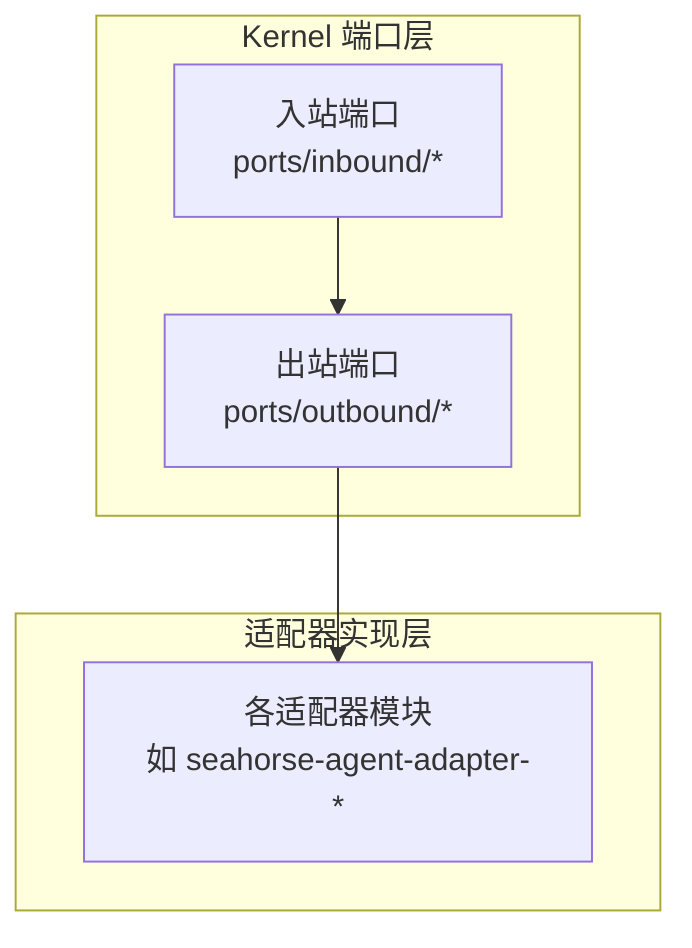
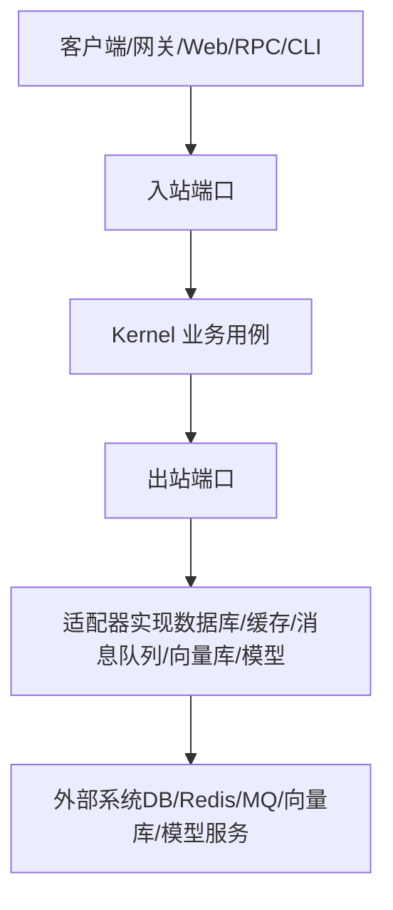
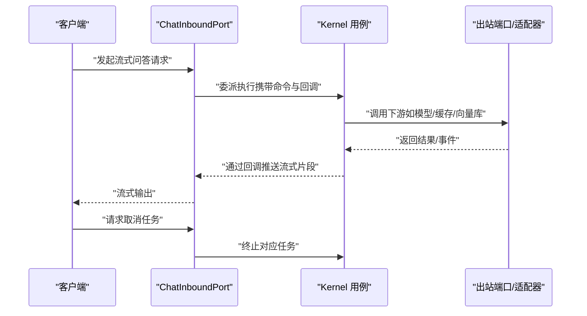
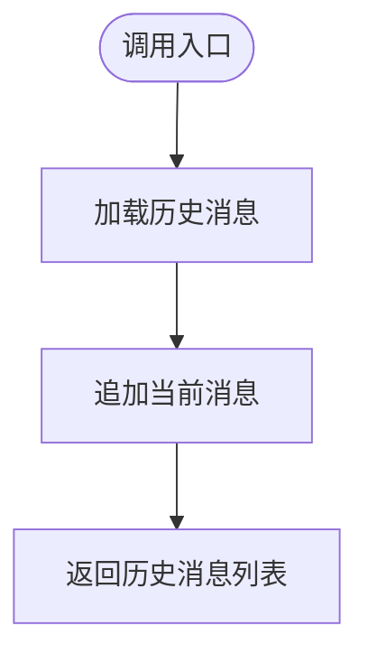
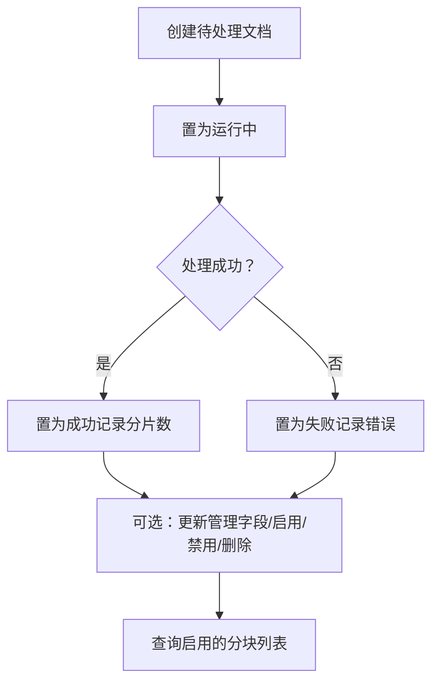
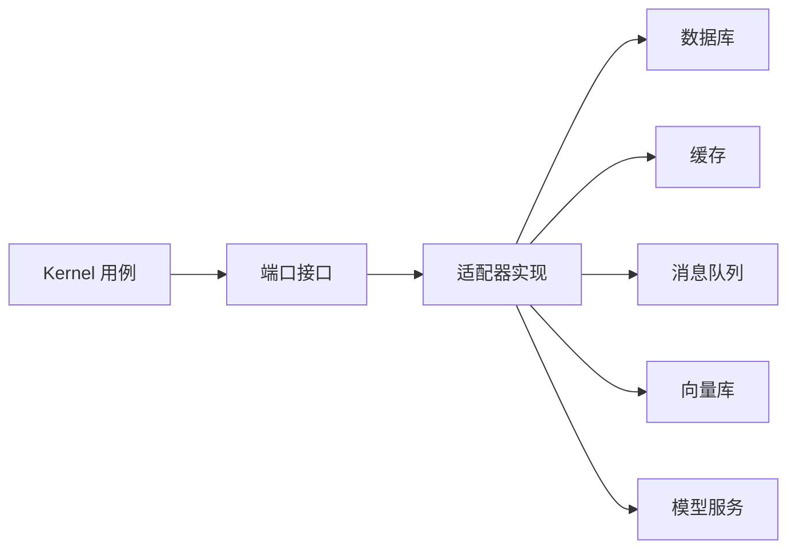

# 端口接口

<cite>
**本文引用的文件**
- [ChatInboundPort.java](file://seahorse-agent-kernel/src/main/java/com/miracle/ai/seahorse/agent/ports/inbound/chat/ChatInboundPort.java)
- [ConversationMemoryPort.java](file://seahorse-agent-kernel/src/main/java/com/miracle/ai/seahorse/agent/ports/outbound/chat/ConversationMemoryPort.java)
- [UserRepositoryPort.java](file://seahorse-agent-kernel/src/main/java/com/miracle/ai/seahorse/agent/ports/outbound/auth/UserRepositoryPort.java)
- [KnowledgeBaseRepositoryPort.java](file://seahorse-agent-kernel/src/main/java/com/miracle/ai/seahorse/agent/ports/outbound/knowledge/KnowledgeBaseRepositoryPort.java)
- [KnowledgeDocumentRepositoryPort.java](file://seahorse-agent-kernel/src/main/java/com/miracle/ai/seahorse/agent/ports/outbound/knowledge/KnowledgeDocumentRepositoryPort.java)
- [KeyValueCachePort.java](file://seahorse-agent-kernel/src/main/java/com/miracle/ai/seahorse/agent/ports/outbound/cache/KeyValueCachePort.java)
- [PubSubPort.java](file://seahorse-agent-kernel/src/main/java/com/miracle/ai/seahorse/agent/ports/outbound/cache/PubSubPort.java)
- [MessageQueuePort.java](file://seahorse-agent-kernel/src/main/java/com/miracle/ai/seahorse/agent/ports/outbound/mq/MessageQueuePort.java)
- [VectorSearchPort.java](file://seahorse-agent-kernel/src/main/java/com/miracle/ai/seahorse/agent/ports/outbound/vector/VectorSearchPort.java)
- [VectorIndexPort.java](file://seahorse-agent-kernel/src/main/java/com/miracle/ai/seahorse/agent/ports/outbound/vector/VectorIndexPort.java)
- [ChatModelPort.java](file://seahorse-agent-kernel/src/main/java/com/miracle/ai/seahorse/agent/ports/outbound/model/ChatModelPort.java)
- [EmbeddingModelPort.java](file://seahorse-agent-kernel/src/main/java/com/miracle/ai/seahorse/agent/ports/outbound/model/EmbeddingModelPort.java)
</cite>

## 目录
1. [简介](#简介)
2. [项目结构](#项目结构)
3. [核心组件](#核心组件)
4. [架构总览](#架构总览)
5. [详细组件分析](#详细组件分析)
6. [依赖分析](#依赖分析)
7. [性能考虑](#性能考虑)
8. [故障排查指南](#故障排查指南)
9. [结论](#结论)

## 简介
本文件系统性梳理 Kernel 中的“端口接口”设计与实现，重点覆盖入站端口（Inbound Port）与出站端口（Outbound Port）两类边界，阐述其在业务领域中的职责划分：以入站端口承接外部协议（HTTP/RPC/CLI），以出站端口抽象与隔离外部系统（数据库、缓存、消息队列、向量库、模型服务等）。同时，结合适配器模式，说明如何通过不同实现替换外部依赖，实现业务逻辑与基础设施的解耦。

## 项目结构
Kernel 的端口接口位于 ports 目录下，按“入站/出站 + 领域”进行组织：
- 入站端口：ports/inbound 下按业务域划分，如 chat、auth、knowledge、mq、vector 等
- 出站端口：ports/outbound 下按业务域划分，如 chat、auth、knowledge、cache、mq、vector、model 等

## 核心组件
本节对本次目标涉及的关键端口进行逐项解析，说明其职责、输入输出与典型使用场景，并给出与适配器对接的建议。

- 入站端口
  - ChatInboundPort：定义流式问答入口与任务取消能力，面向 Web/RPC/CLI 的协议转换层，将调用委派至 Kernel 层执行。
  - 其他入站端口（如 AuthInboundPort、Knowledge*InboundPort 等）职责类似，均作为外部接入的统一入口。

- 出站端口
  - ConversationMemoryPort：抽象对话记忆的加载与追加能力，提供默认空实现，便于在无持久化时快速回退。
  - UserRepositoryPort：抽象用户仓储的查询、分页、创建、更新、删除等操作，屏蔽底层存储差异。
  - KnowledgeBaseRepositoryPort：抽象知识库的创建、重名校验、查询、分页、状态检查、更新与删除。
  - KnowledgeDocumentRepositoryPort：抽象知识库文档的创建、查询、分页、状态变更、启用/禁用、删除、分块列表等。
  - KeyValueCachePort：抽象字符串键值缓存的读取、写入（含 TTL）、删除。
  - PubSubPort：抽象发布订阅能力，支持订阅返回可关闭句柄，便于生命周期管理。
  - MessageQueuePort：抽象消息发送与可靠发布能力，返回发送回执。
  - VectorSearchPort：抽象向量检索能力，屏蔽 Milvus/pgvector 等实现差异。
  - VectorIndexPort：抽象向量索引的批量/单条写入、更新、删除能力。
  - ChatModelPort：抽象对话模型调用，支持传入 ChatRequest 或便捷的消息列表形式。
  - EmbeddingModelPort：抽象文本向量生成能力，用于检索与记忆的向量化。

**章节来源**
- [ChatInboundPort.java:27-43](file://seahorse-agent-kernel/src/main/java/com/miracle/ai/seahorse/agent/ports/inbound/chat/ChatInboundPort.java#L27-L43)
- [ConversationMemoryPort.java:27-51](file://seahorse-agent-kernel/src/main/java/com/miracle/ai/seahorse/agent/ports/outbound/chat/ConversationMemoryPort.java#L27-L51)
- [UserRepositoryPort.java:22-37](file://seahorse-agent-kernel/src/main/java/com/miracle/ai/seahorse/agent/ports/outbound/auth/UserRepositoryPort.java#L22-L37)
- [KnowledgeBaseRepositoryPort.java:25-42](file://seahorse-agent-kernel/src/main/java/com/miracle/ai/seahorse/agent/ports/outbound/knowledge/KnowledgeBaseRepositoryPort.java#L25-L42)
- [KnowledgeDocumentRepositoryPort.java:26-154](file://seahorse-agent-kernel/src/main/java/com/miracle/ai/seahorse/agent/ports/outbound/knowledge/KnowledgeDocumentRepositoryPort.java#L26-L154)
- [KeyValueCachePort.java:26-33](file://seahorse-agent-kernel/src/main/java/com/miracle/ai/seahorse/agent/ports/outbound/cache/KeyValueCachePort.java#L26-L33)
- [PubSubPort.java:25-43](file://seahorse-agent-kernel/src/main/java/com/miracle/ai/seahorse/agent/ports/outbound/cache/PubSubPort.java#L25-L43)
- [MessageQueuePort.java:23-28](file://seahorse-agent-kernel/src/main/java/com/miracle/ai/seahorse/agent/ports/outbound/mq/MessageQueuePort.java#L23-L28)
- [VectorSearchPort.java:30-39](file://seahorse-agent-kernel/src/main/java/com/miracle/ai/seahorse/agent/ports/outbound/vector/VectorSearchPort.java#L30-L39)
- [VectorIndexPort.java:30-73](file://seahorse-agent-kernel/src/main/java/com/miracle/ai/seahorse/agent/ports/outbound/vector/VectorIndexPort.java#L30-L73)
- [ChatModelPort.java:30-58](file://seahorse-agent-kernel/src/main/java/com/miracle/ai/seahorse/agent/ports/outbound/model/ChatModelPort.java#L30-L58)
- [EmbeddingModelPort.java:27-46](file://seahorse-agent-kernel/src/main/java/com/miracle/ai/seahorse/agent/ports/outbound/model/EmbeddingModelPort.java#L27-L46)

## 架构总览
端口接口遵循整洁架构的“用例/内核”边界，入站端口负责协议转换，出站端口负责与外部系统交互。适配器模块通过实现这些端口接口，将具体实现注入到 Kernel。

**图表来源**
- [ChatInboundPort.java:27-43](file://seahorse-agent-kernel/src/main/java/com/miracle/ai/seahorse/agent/ports/inbound/chat/ChatInboundPort.java#L27-L43)
- [ConversationMemoryPort.java:27-51](file://seahorse-agent-kernel/src/main/java/com/miracle/ai/seahorse/agent/ports/outbound/chat/ConversationMemoryPort.java#L27-L51)
- [UserRepositoryPort.java:22-37](file://seahorse-agent-kernel/src/main/java/com/miracle/ai/seahorse/agent/ports/outbound/auth/UserRepositoryPort.java#L22-L37)
- [KnowledgeBaseRepositoryPort.java:25-42](file://seahorse-agent-kernel/src/main/java/com/miracle/ai/seahorse/agent/ports/outbound/knowledge/KnowledgeBaseRepositoryPort.java#L25-L42)
- [KnowledgeDocumentRepositoryPort.java:26-154](file://seahorse-agent-kernel/src/main/java/com/miracle/ai/seahorse/agent/ports/outbound/knowledge/KnowledgeDocumentRepositoryPort.java#L26-L154)
- [KeyValueCachePort.java:26-33](file://seahorse-agent-kernel/src/main/java/com/miracle/ai/seahorse/agent/ports/outbound/cache/KeyValueCachePort.java#L26-L33)
- [PubSubPort.java:25-43](file://seahorse-agent-kernel/src/main/java/com/miracle/ai/seahorse/agent/ports/outbound/cache/PubSubPort.java#L25-L43)
- [MessageQueuePort.java:23-28](file://seahorse-agent-kernel/src/main/java/com/miracle/ai/seahorse/agent/ports/outbound/mq/MessageQueuePort.java#L23-L28)
- [VectorSearchPort.java:30-39](file://seahorse-agent-kernel/src/main/java/com/miracle/ai/seahorse/agent/ports/outbound/vector/VectorSearchPort.java#L30-L39)
- [VectorIndexPort.java:30-73](file://seahorse-agent-kernel/src/main/java/com/miracle/ai/seahorse/agent/ports/outbound/vector/VectorIndexPort.java#L30-L73)
- [ChatModelPort.java:30-58](file://seahorse-agent-kernel/src/main/java/com/miracle/ai/seahorse/agent/ports/outbound/model/ChatModelPort.java#L30-L58)
- [EmbeddingModelPort.java:27-46](file://seahorse-agent-kernel/src/main/java/com/miracle/ai/seahorse/agent/ports/outbound/model/EmbeddingModelPort.java#L27-L46)

## 详细组件分析

### 入站端口：ChatInboundPort
- 角色定位：面向外部协议入口，负责将请求转换为内部命令并委派给 Kernel 执行；支持流式输出与任务取消。
- 关键方法
  - 执行流式问答：接收命令与回调，触发流式输出。
  - 取消任务：根据任务 ID 终止对应流式任务。
- 设计要点
  - 将协议细节与业务编排解耦，确保 Kernel 不依赖具体传输层。
  - 回调机制用于将中间结果逐步返回给上层。

**图表来源**
- [ChatInboundPort.java:27-43](file://seahorse-agent-kernel/src/main/java/com/miracle/ai/seahorse/agent/ports/inbound/chat/ChatInboundPort.java#L27-L43)

**章节来源**
- [ChatInboundPort.java:27-43](file://seahorse-agent-kernel/src/main/java/com/miracle/ai/seahorse/agent/ports/inbound/chat/ChatInboundPort.java#L27-L43)

### 出站端口：ConversationMemoryPort（对话记忆）
- 角色定位：抽象会话历史加载与当前消息追加能力，支持默认空实现，便于在无持久化场景快速回退。
- 关键方法
  - 加载并追加：返回追加前的历史消息，便于上下文拼接。
  - 追加消息：提供默认空实现，便于扩展。
  - 空实现：提供静态空对象，便于测试或降级。

**图表来源**
- [ConversationMemoryPort.java:27-51](file://seahorse-agent-kernel/src/main/java/com/miracle/ai/seahorse/agent/ports/outbound/chat/ConversationMemoryPort.java#L27-L51)

**章节来源**
- [ConversationMemoryPort.java:27-51](file://seahorse-agent-kernel/src/main/java/com/miracle/ai/seahorse/agent/ports/outbound/chat/ConversationMemoryPort.java#L27-L51)

### 出站端口：UserRepositoryPort（认证）
- 角色定位：抽象用户仓储能力，屏蔽底层存储差异。
- 关键方法
  - 按 ID/用户名查询用户。
  - 用户名存在性校验（支持排除特定 ID）。
  - 分页查询用户。
  - 创建用户、更新用户、删除用户。

**章节来源**
- [UserRepositoryPort.java:22-37](file://seahorse-agent-kernel/src/main/java/com/miracle/ai/seahorse/agent/ports/outbound/auth/UserRepositoryPort.java#L22-L37)

### 出站端口：KnowledgeBaseRepositoryPort（知识库）
- 角色定位：抽象知识库管理能力。
- 关键方法
  - 创建知识库。
  - 名称规范化后的重名校验（支持排除特定知识库 ID）。
  - 按 ID 查询、分页查询。
  - 检查是否存在文档/已向量化文档。
  - 更新与删除。

**章节来源**
- [KnowledgeBaseRepositoryPort.java:25-42](file://seahorse-agent-kernel/src/main/java/com/miracle/ai/seahorse/agent/ports/outbound/knowledge/KnowledgeBaseRepositoryPort.java#L25-L42)

### 出站端口：KnowledgeDocumentRepositoryPort（知识库文档）
- 角色定位：抽象知识库文档的全生命周期管理。
- 关键方法
  - 创建待处理文档。
  - 按 ID 查询、查询详情、分页查询（支持状态与关键字过滤）。
  - 查询分块日志。
  - 状态变更：置为运行中/成功/失败。
  - 更新管理字段、启用/禁用、替换刷新文件、删除文档。
  - 查询启用的分块列表。

**图表来源**
- [KnowledgeDocumentRepositoryPort.java:26-154](file://seahorse-agent-kernel/src/main/java/com/miracle/ai/seahorse/agent/ports/outbound/knowledge/KnowledgeDocumentRepositoryPort.java#L26-L154)

**章节来源**
- [KnowledgeDocumentRepositoryPort.java:26-154](file://seahorse-agent-kernel/src/main/java/com/miracle/ai/seahorse/agent/ports/outbound/knowledge/KnowledgeDocumentRepositoryPort.java#L26-L154)

### 出站端口：KeyValueCachePort（缓存）
- 角色定位：抽象字符串键值缓存能力。
- 关键方法
  - 获取、设置（带 TTL）、删除。

**章节来源**
- [KeyValueCachePort.java:26-33](file://seahorse-agent-kernel/src/main/java/com/miracle/ai/seahorse/agent/ports/outbound/cache/KeyValueCachePort.java#L26-L33)

### 出站端口：PubSubPort（发布订阅）
- 角色定位：抽象发布订阅能力，支持订阅返回可关闭句柄。
- 关键方法
  - 发布消息。
  - 订阅主题并返回可关闭句柄，便于取消订阅。

**章节来源**
- [PubSubPort.java:25-43](file://seahorse-agent-kernel/src/main/java/com/miracle/ai/seahorse/agent/ports/outbound/cache/PubSubPort.java#L25-L43)

### 出站端口：MessageQueuePort（消息队列）
- 角色定位：抽象消息发送与可靠发布能力。
- 关键方法
  - 发送消息并返回发送回执。
  - 可靠发布（幂等/确认语义由适配器实现）。

**章节来源**
- [MessageQueuePort.java:23-28](file://seahorse-agent-kernel/src/main/java/com/miracle/ai/seahorse/agent/ports/outbound/mq/MessageQueuePort.java#L23-L28)

### 出站端口：VectorSearchPort（向量检索）
- 角色定位：抽象向量检索能力，隔离具体向量库实现。
- 关键方法
  - 执行检索并返回命中 Chunk 列表。

**章节来源**
- [VectorSearchPort.java:30-39](file://seahorse-agent-kernel/src/main/java/com/miracle/ai/seahorse/agent/ports/outbound/vector/VectorSearchPort.java#L30-L39)

### 出站端口：VectorIndexPort（向量索引）
- 角色定位：抽象向量索引的写入、更新、删除能力。
- 关键方法
  - 批量写入文档分块向量。
  - 单条更新、整篇删除、按 ID 删除、批量删除。

**章节来源**
- [VectorIndexPort.java:30-73](file://seahorse-agent-kernel/src/main/java/com/miracle/ai/seahorse/agent/ports/outbound/vector/VectorIndexPort.java#L30-L73)

### 出站端口：ChatModelPort（对话模型）
- 角色定位：抽象对话模型调用，屏蔽 Provider 差异。
- 关键方法
  - 接收 ChatRequest 与模型 ID，返回模型输出文本。
  - 提供便捷的消息列表重载。
  - 提供空实现静态工厂。

**章节来源**
- [ChatModelPort.java:30-58](file://seahorse-agent-kernel/src/main/java/com/miracle/ai/seahorse/agent/ports/outbound/model/ChatModelPort.java#L30-L58)

### 出站端口：EmbeddingModelPort（嵌入模型）
- 角色定位：抽象文本向量生成能力，用于检索与记忆的向量化。
- 关键方法
  - 生成文本向量。
  - 提供空实现静态工厂。

**章节来源**
- [EmbeddingModelPort.java:27-46](file://seahorse-agent-kernel/src/main/java/com/miracle/ai/seahorse/agent/ports/outbound/model/EmbeddingModelPort.java#L27-L46)

## 依赖分析
- 内聚性：每个端口聚焦单一职责，内聚度高。
- 耦合度：Kernel 仅依赖端口接口，不依赖具体实现，降低对外部系统耦合。
- 外部依赖：适配器模块通过实现端口接口对接具体外部系统（数据库、缓存、MQ、向量库、模型服务等）。
- 可替换性：通过配置或 SPI 注册，可在运行时切换适配器实现，满足多环境部署需求。

## 性能考虑
- 缓存优先：对高频读取的数据使用 KeyValueCachePort，减少下游压力。
- 异步与批处理：消息队列与发布订阅适合异步解耦；向量索引支持批量写入/删除，提升入库效率。
- 检索优化：向量检索应结合过滤条件与 TopK 控制，避免全量扫描。
- 模型调用：合理选择模型与采样参数，必要时使用流式回调降低首字延迟。

## 故障排查指南
- 端口未实现：若出现“端口未找到”类问题，检查适配器是否正确注册并暴露端口文件。
- 依赖缺失：确认对应适配器模块已引入，且端口文件存在于资源目录 META-INF/seahorse-agent。
- 回退策略：对于可选功能（如空实现），可通过端口提供的空实现快速定位问题范围。
- 日志与可观测：结合适配器侧日志与观察端口（ObservationPort）输出，定位异常环节。

## 结论
端口接口是 Kernel 解耦外部系统的关键抽象。通过清晰的入站/出站边界与领域化端口设计，配合适配器模式，系统实现了高度可插拔与可替换的架构。建议在新功能开发中优先定义端口接口，再实现适配器，以保证业务逻辑的稳定与演进的灵活性。