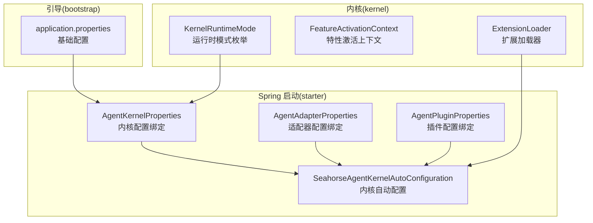
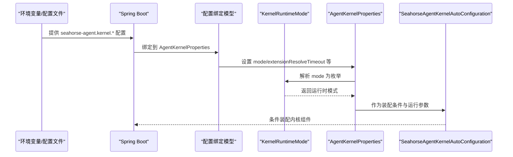
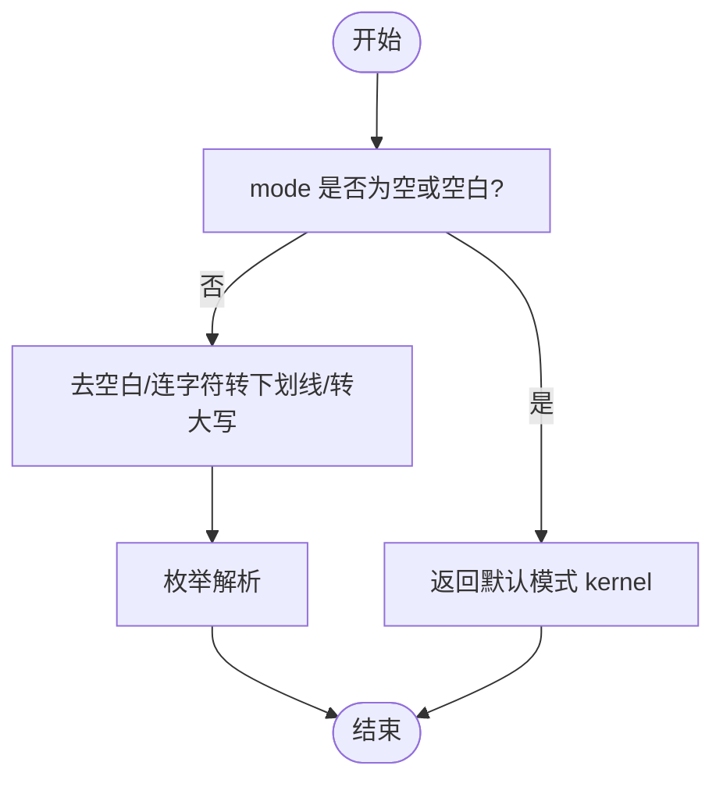
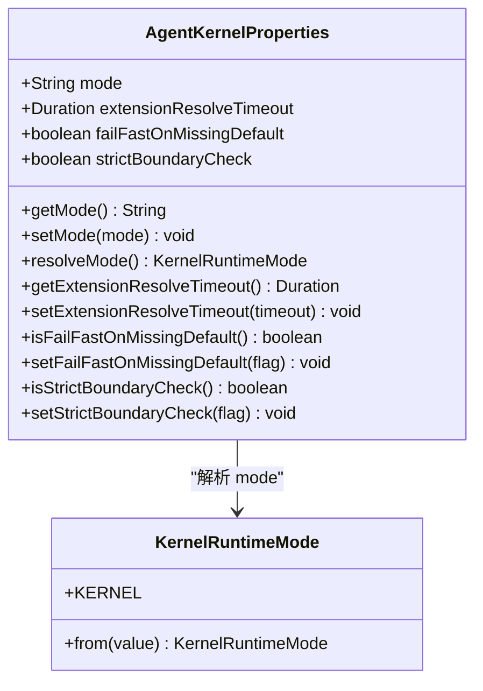
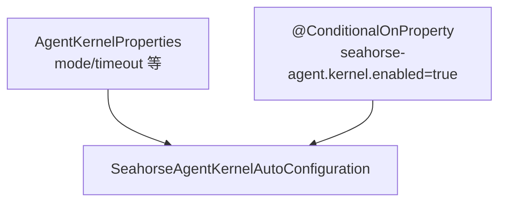
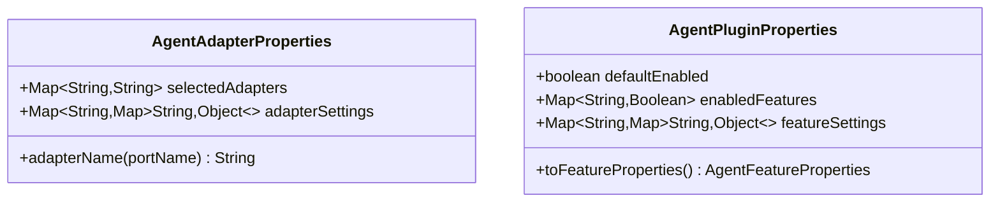
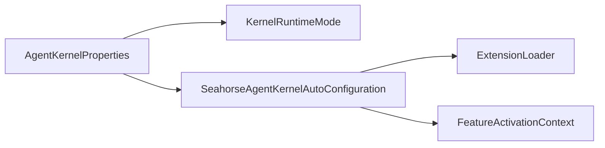

# 运行时配置

<cite>
**本文引用的文件**
- [KernelRuntimeMode.java](file://seahorse-agent-kernel/src/main/java/com/miracle/ai/seahorse/agent/kernel/config/KernelRuntimeMode.java)
- [AgentKernelProperties.java](file://seahorse-agent-spring-boot-starter/src/main/java/com/miracle/ai/seahorse/agent/adapters/spring/config/AgentKernelProperties.java)
- [application.properties（引导）](file://seahorse-agent-bootstrap/src/main/resources/application.properties)
- [application.properties（starter）](file://seahorse-agent-spring-boot-starter/src/main/resources/application.properties)
- [SeahorseAgentKernelAutoConfiguration.java](file://seahorse-agent-spring-boot-starter/src/main/java/com/miracle/ai/seahorse/agent/adapters/spring/SeahorseAgentKernelAutoConfiguration.java)
- [AgentAdapterProperties.java](file://seahorse-agent-spring-boot-starter/src/main/java/com/miracle/ai/seahorse/agent/adapters/spring/config/AgentAdapterProperties.java)
- [AgentPluginProperties.java](file://seahorse-agent-spring-boot-starter/src/main/java/com/miracle/ai/seahorse/agent/adapters/spring/config/AgentPluginProperties.java)
- [AgentKernelPropertiesTests.java](file://seahorse-agent-tests/src/test/java/com/miracle/ai/seahorse/agent/kernel/config/AgentKernelPropertiesTests.java)
- [ExtensionLoader.java](file://seahorse-agent-kernel/src/main/java/com/miracle/ai/seahorse/agent/kernel/plugin/ExtensionLoader.java)
- [FeatureActivationContext.java](file://seahorse-agent-kernel/src/main/java/com/miracle/ai/seahorse/agent/kernel/plugin/FeatureActivationContext.java)
</cite>

## 目录
1. [简介](#简介)
2. [项目结构](#项目结构)
3. [核心组件](#核心组件)
4. [架构总览](#架构总览)
5. [详细组件分析](#详细组件分析)
6. [依赖分析](#依赖分析)
7. [性能考虑](#性能考虑)
8. [故障排除指南](#故障排除指南)
9. [结论](#结论)
10. [附录](#附录)

## 简介
本文件聚焦“运行时配置”，围绕 KernelRuntimeMode 的运行模式配置与切换机制展开，系统阐述：
- 运行模式的定义、解析与默认行为
- 不同运行模式下的行为差异与适用场景
- 在开发、测试、生产等环境中的配置策略与最佳实践
- 运行时参数的设置方法、配置优先级与覆盖规则
- 如何根据业务需求选择合适的运行模式，并在运行时动态调整配置参数
- 配置故障排除与性能优化建议

## 项目结构
运行时配置相关的核心代码分布在以下模块中：
- kernel 模块：定义运行时模式枚举与插件特性上下文
- spring-boot-starter 模块：提供 Spring Boot 配置绑定模型与自动装配
- bootstrap 模块：应用启动时的基础配置
- tests 模块：对配置解析与默认行为进行验证

**图表来源**
- [KernelRuntimeMode.java:25-46](file://seahorse-agent-kernel/src/main/java/com/miracle/ai/seahorse/agent/kernel/config/KernelRuntimeMode.java#L25-L46)
- [AgentKernelProperties.java:29-77](file://seahorse-agent-spring-boot-starter/src/main/java/com/miracle/ai/seahorse/agent/adapters/spring/config/AgentKernelProperties.java#L29-L77)
- [AgentAdapterProperties.java:29-58](file://seahorse-agent-spring-boot-starter/src/main/java/com/miracle/ai/seahorse/agent/adapters/spring/config/AgentAdapterProperties.java#L29-L58)
- [AgentPluginProperties.java:30-65](file://seahorse-agent-spring-boot-starter/src/main/java/com/miracle/ai/seahorse/agent/adapters/spring/config/AgentPluginProperties.java#L30-L65)
- [SeahorseAgentKernelAutoConfiguration.java:181-188](file://seahorse-agent-spring-boot-starter/src/main/java/com/miracle/ai/seahorse/agent/adapters/spring/SeahorseAgentKernelAutoConfiguration.java#L181-L188)
- [application.properties（引导）:1-4](file://seahorse-agent-bootstrap/src/main/resources/application.properties#L1-L4)

**章节来源**
- [KernelRuntimeMode.java:25-46](file://seahorse-agent-kernel/src/main/java/com/miracle/ai/seahorse/agent/kernel/config/KernelRuntimeMode.java#L25-L46)
- [AgentKernelProperties.java:29-77](file://seahorse-agent-spring-boot-starter/src/main/java/com/miracle/ai/seahorse/agent/adapters/spring/config/AgentKernelProperties.java#L29-L77)
- [SeahorseAgentKernelAutoConfiguration.java:181-188](file://seahorse-agent-spring-boot-starter/src/main/java/com/miracle/ai/seahorse/agent/adapters/spring/SeahorseAgentKernelAutoConfiguration.java#L181-L188)
- [application.properties（引导）:1-4](file://seahorse-agent-bootstrap/src/main/resources/application.properties#L1-L4)

## 核心组件
- 运行时模式枚举 KernelRuntimeMode：定义内核运行模式常量与解析逻辑，默认为 kernel
- 内核配置绑定 AgentKernelProperties：提供 mode、extensionResolveTimeout、failFastOnMissingDefault、strictBoundaryCheck 等运行时参数
- 自动配置 SeahorseAgentKernelAutoConfiguration：基于条件注解装配内核组件，受 seahorse-agent.kernel.enabled 控制
- 适配器与插件配置绑定：AgentAdapterProperties、AgentPluginProperties 提供适配器选择与特性开关
- 基础配置 application.properties：提供默认值与开关项

**章节来源**
- [KernelRuntimeMode.java:25-46](file://seahorse-agent-kernel/src/main/java/com/miracle/ai/seahorse/agent/kernel/config/KernelRuntimeMode.java#L25-L46)
- [AgentKernelProperties.java:29-77](file://seahorse-agent-spring-boot-starter/src/main/java/com/miracle/ai/seahorse/agent/adapters/spring/config/AgentKernelProperties.java#L29-L77)
- [SeahorseAgentKernelAutoConfiguration.java:181-188](file://seahorse-agent-spring-boot-starter/src/main/java/com/miracle/ai/seahorse/agent/adapters/spring/SeahorseAgentKernelAutoConfiguration.java#L181-L188)
- [AgentAdapterProperties.java:29-58](file://seahorse-agent-spring-boot-starter/src/main/java/com/miracle/ai/seahorse/agent/adapters/spring/config/AgentAdapterProperties.java#L29-L58)
- [AgentPluginProperties.java:30-65](file://seahorse-agent-spring-boot-starter/src/main/java/com/miracle/ai/seahorse/agent/adapters/spring/config/AgentPluginProperties.java#L30-L65)
- [application.properties（引导）:1-4](file://seahorse-agent-bootstrap/src/main/resources/application.properties#L1-L4)

## 架构总览
运行时配置从配置文件绑定到运行期决策的关键流程如下：

**图表来源**
- [AgentKernelProperties.java:29-77](file://seahorse-agent-spring-boot-starter/src/main/java/com/miracle/ai/seahorse/agent/adapters/spring/config/AgentKernelProperties.java#L29-L77)
- [KernelRuntimeMode.java:39-45](file://seahorse-agent-kernel/src/main/java/com/miracle/ai/seahorse/agent/kernel/config/KernelRuntimeMode.java#L39-L45)
- [SeahorseAgentKernelAutoConfiguration.java:181-188](file://seahorse-agent-spring-boot-starter/src/main/java/com/miracle/ai/seahorse/agent/adapters/spring/SeahorseAgentKernelAutoConfiguration.java#L181-L188)

## 详细组件分析

### 运行时模式 KernelRuntimeMode
- 定义：当前仅支持 kernel 模式
- 解析规则：
  - 空值或空白字符串时回退为 kernel
  - 先去除首尾空白，再将连字符替换为下划线，最后转为大写后调用枚举值解析
- 默认行为：未显式设置时，解析结果为 kernel

**图表来源**
- [KernelRuntimeMode.java:39-45](file://seahorse-agent-kernel/src/main/java/com/miracle/ai/seahorse/agent/kernel/config/KernelRuntimeMode.java#L39-L45)

**章节来源**
- [KernelRuntimeMode.java:25-46](file://seahorse-agent-kernel/src/main/java/com/miracle/ai/seahorse/agent/kernel/config/KernelRuntimeMode.java#L25-L46)
- [AgentKernelPropertiesTests.java:34-56](file://seahorse-agent-tests/src/test/java/com/miracle/ai/seahorse/agent/kernel/config/AgentKernelPropertiesTests.java#L34-L56)

### 内核配置绑定 AgentKernelProperties
- 关键字段与默认值：
  - mode：默认 kernel
  - extensionResolveTimeout：默认 50ms
  - failFastOnMissingDefault：默认 true
  - strictBoundaryCheck：默认 false
- 解析逻辑：resolveMode() 将字符串 mode 解析为 KernelRuntimeMode
- 生效方式：由自动配置类读取并用于装配条件与运行参数

**图表来源**
- [AgentKernelProperties.java:29-77](file://seahorse-agent-spring-boot-starter/src/main/java/com/miracle/ai/seahorse/agent/adapters/spring/config/AgentKernelProperties.java#L29-L77)
- [KernelRuntimeMode.java:25-46](file://seahorse-agent-kernel/src/main/java/com/miracle/ai/seahorse/agent/kernel/config/KernelRuntimeMode.java#L25-L46)

**章节来源**
- [AgentKernelProperties.java:29-77](file://seahorse-agent-spring-boot-starter/src/main/java/com/miracle/ai/seahorse/agent/adapters/spring/config/AgentKernelProperties.java#L29-L77)

### 自动配置与装配条件
- 条件注解：
  - @ConditionalOnProperty(prefix = "seahorse-agent.kernel", name = "enabled", havingValue = "true", matchIfMissing = true)
  - 当未显式配置时，默认启用内核装配
- 作用：在满足条件时装配内核编排、特性注册表与本地流式任务能力

**图表来源**
- [SeahorseAgentKernelAutoConfiguration.java:181-188](file://seahorse-agent-spring-boot-starter/src/main/java/com/miracle/ai/seahorse/agent/adapters/spring/SeahorseAgentKernelAutoConfiguration.java#L181-L188)

**章节来源**
- [SeahorseAgentKernelAutoConfiguration.java:181-188](file://seahorse-agent-spring-boot-starter/src/main/java/com/miracle/ai/seahorse/agent/adapters/spring/SeahorseAgentKernelAutoConfiguration.java#L181-L188)

### 适配器与插件配置
- AgentAdapterProperties：提供端口到适配器名称的选择映射与适配器透传配置
- AgentPluginProperties：提供特性默认开关、特性级开关与特性级透传配置，并转换为内核可用的 AgentFeatureProperties

**图表来源**
- [AgentAdapterProperties.java:29-58](file://seahorse-agent-spring-boot-starter/src/main/java/com/miracle/ai/seahorse/agent/adapters/spring/config/AgentAdapterProperties.java#L29-L58)
- [AgentPluginProperties.java:30-65](file://seahorse-agent-spring-boot-starter/src/main/java/com/miracle/ai/seahorse/agent/adapters/spring/config/AgentPluginProperties.java#L30-L65)

**章节来源**
- [AgentAdapterProperties.java:29-58](file://seahorse-agent-spring-boot-starter/src/main/java/com/miracle/ai/seahorse/agent/adapters/spring/config/AgentAdapterProperties.java#L29-L58)
- [AgentPluginProperties.java:30-65](file://seahorse-agent-spring-boot-starter/src/main/java/com/miracle/ai/seahorse/agent/adapters/spring/config/AgentPluginProperties.java#L30-L65)

### 基础配置与默认值
- 引导模块提供默认启用内核与默认运行模式
- Starter 模块提供默认运行模式

**章节来源**
- [application.properties（引导）:1-4](file://seahorse-agent-bootstrap/src/main/resources/application.properties#L1-L4)
- [application.properties（starter）:1](file://seahorse-agent-spring-boot-starter/src/main/resources/application.properties#L1)

## 依赖分析
- AgentKernelProperties 依赖 KernelRuntimeMode 进行模式解析
- SeahorseAgentKernelAutoConfiguration 依赖 AgentKernelProperties 的 enabled 条件与运行参数
- ExtensionLoader 与 FeatureActivationContext 影响特性启用与默认扩展选择，间接影响运行时行为

**图表来源**
- [AgentKernelProperties.java:29-77](file://seahorse-agent-spring-boot-starter/src/main/java/com/miracle/ai/seahorse/agent/adapters/spring/config/AgentKernelProperties.java#L29-L77)
- [KernelRuntimeMode.java:25-46](file://seahorse-agent-kernel/src/main/java/com/miracle/ai/seahorse/agent/kernel/config/KernelRuntimeMode.java#L25-L46)
- [SeahorseAgentKernelAutoConfiguration.java:181-188](file://seahorse-agent-spring-boot-starter/src/main/java/com/miracle/ai/seahorse/agent/adapters/spring/SeahorseAgentKernelAutoConfiguration.java#L181-L188)
- [ExtensionLoader.java:39-200](file://seahorse-agent-kernel/src/main/java/com/miracle/ai/seahorse/agent/kernel/plugin/ExtensionLoader.java#L39-L200)
- [FeatureActivationContext.java:33-61](file://seahorse-agent-kernel/src/main/java/com/miracle/ai/seahorse/agent/kernel/plugin/FeatureActivationContext.java#L33-L61)

**章节来源**
- [ExtensionLoader.java:39-200](file://seahorse-agent-kernel/src/main/java/com/miracle/ai/seahorse/agent/kernel/plugin/ExtensionLoader.java#L39-L200)
- [FeatureActivationContext.java:33-61](file://seahorse-agent-kernel/src/main/java/com/miracle/ai/seahorse/agent/kernel/plugin/FeatureActivationContext.java#L33-L61)

## 性能考虑
- 扩展加载时机：扩展加载器在启动期完成，避免运行期反射扫描带来的性能损耗
- 超时控制：extensionResolveTimeout 用于限制扩展解析超时，防止阻塞启动
- 失败策略：failFastOnMissingDefault 为 true 时，缺失默认扩展会快速失败，便于早期发现配置问题
- 边界检查：strictBoundaryCheck 为 true 时，启用更严格的边界校验，有助于在开发阶段暴露潜在问题

**章节来源**
- [ExtensionLoader.java:39-38](file://seahorse-agent-kernel/src/main/java/com/miracle/ai/seahorse/agent/kernel/plugin/ExtensionLoader.java#L39-L38)
- [AgentKernelProperties.java:33-34](file://seahorse-agent-spring-boot-starter/src/main/java/com/miracle/ai/seahorse/agent/adapters/spring/config/AgentKernelProperties.java#L33-L34)
- [AgentKernelProperties.java:61-75](file://seahorse-agent-spring-boot-starter/src/main/java/com/miracle/ai/seahorse/agent/adapters/spring/config/AgentKernelProperties.java#L61-L75)

## 故障排除指南
- 模式解析异常
  - 症状：mode 配置无效或解析为默认值
  - 排查：确认配置值非空且符合枚举定义；检查大小写与连字符处理逻辑
  - 参考：[KernelRuntimeMode.java:39-45](file://seahorse-agent-kernel/src/main/java/com/miracle/ai/seahorse/agent/kernel/config/KernelRuntimeMode.java#L39-L45)
- 默认模式回退
  - 症状：mode 为空或空白时行为不符合预期
  - 排查：确认默认值解析逻辑；在测试中可通过断言验证默认行为
  - 参考：[AgentKernelPropertiesTests.java:34-56](file://seahorse-agent-tests/src/test/java/com/miracle/ai/seahorse/agent/kernel/config/AgentKernelPropertiesTests.java#L34-L56)
- 内核未装配
  - 症状：内核相关 Bean 未生效
  - 排查：检查 seahorse-agent.kernel.enabled 是否为 true；确认自动配置条件满足
  - 参考：[SeahorseAgentKernelAutoConfiguration.java:181-188](file://seahorse-agent-spring-boot-starter/src/main/java/com/miracle/ai/seahorse/agent/adapters/spring/SeahorseAgentKernelAutoConfiguration.java#L181-L188)
- 扩展缺失导致失败
  - 症状：启动失败或功能不可用
  - 排查：开启 failFastOnMissingDefault 并检查默认扩展声明；查看扩展加载诊断信息
  - 参考：[ExtensionLoader.java:166-171](file://seahorse-agent-kernel/src/main/java/com/miracle/ai/seahorse/agent/kernel/plugin/ExtensionLoader.java#L166-L171)

**章节来源**
- [KernelRuntimeMode.java:39-45](file://seahorse-agent-kernel/src/main/java/com/miracle/ai/seahorse/agent/kernel/config/KernelRuntimeMode.java#L39-L45)
- [AgentKernelPropertiesTests.java:34-56](file://seahorse-agent-tests/src/test/java/com/miracle/ai/seahorse/agent/kernel/config/AgentKernelPropertiesTests.java#L34-L56)
- [SeahorseAgentKernelAutoConfiguration.java:181-188](file://seahorse-agent-spring-boot-starter/src/main/java/com/miracle/ai/seahorse/agent/adapters/spring/SeahorseAgentKernelAutoConfiguration.java#L181-L188)
- [ExtensionLoader.java:166-171](file://seahorse-agent-kernel/src/main/java/com/miracle/ai/seahorse/agent/kernel/plugin/ExtensionLoader.java#L166-L171)

## 结论
- 当前版本仅支持 kernel 运行模式，解析逻辑简单稳健
- 通过 AgentKernelProperties 与自动配置，实现了开箱即用的内核装配
- 建议在开发阶段启用严格边界检查与快速失败策略，在生产阶段关注超时与稳定性配置

## 附录

### 配置优先级与覆盖规则
- 配置来源顺序（从高到低）：
  1) 环境变量（如 JVM 系统属性、操作系统环境变量）
  2) application.properties/yml
  3) 测试或集成测试中的 Mock 环境
- 覆盖规则：
  - 字符串字段通常以“最新设置为准”
  - 复合结构（如 Map）建议在更高优先级处整体覆盖
- 运行时参数设置方法：
  - 在 application.properties 中设置 seahorse-agent.kernel.*
  - 通过环境变量覆盖对应键值
  - 在测试中使用 MockEnvironment 或直接构造配置对象进行验证

**章节来源**
- [application.properties（引导）:1-4](file://seahorse-agent-bootstrap/src/main/resources/application.properties#L1-L4)
- [application.properties（starter）:1](file://seahorse-agent-spring-boot-starter/src/main/resources/application.properties#L1)
- [AgentKernelProperties.java:40-75](file://seahorse-agent-spring-boot-starter/src/main/java/com/miracle/ai/seahorse/agent/adapters/spring/config/AgentKernelProperties.java#L40-L75)

### 不同环境的配置策略与最佳实践
- 开发环境
  - 启用严格边界检查与快速失败，便于早期发现问题
  - 适度放宽超时阈值，提升调试体验
- 测试环境
  - 显式设置 mode 与关键开关，确保测试一致性
  - 使用最小化配置，减少外部依赖
- 生产环境
  - 明确声明默认扩展，避免随机选择
  - 合理设置超时与失败策略，保障稳定性
  - 监控扩展加载诊断信息，及时发现异常

**章节来源**
- [AgentKernelProperties.java:61-75](file://seahorse-agent-spring-boot-starter/src/main/java/com/miracle/ai/seahorse/agent/adapters/spring/config/AgentKernelProperties.java#L61-L75)
- [ExtensionLoader.java:166-171](file://seahorse-agent-kernel/src/main/java/com/miracle/ai/seahorse/agent/kernel/plugin/ExtensionLoader.java#L166-L171)