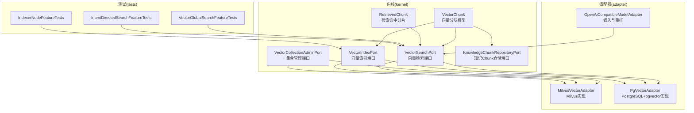
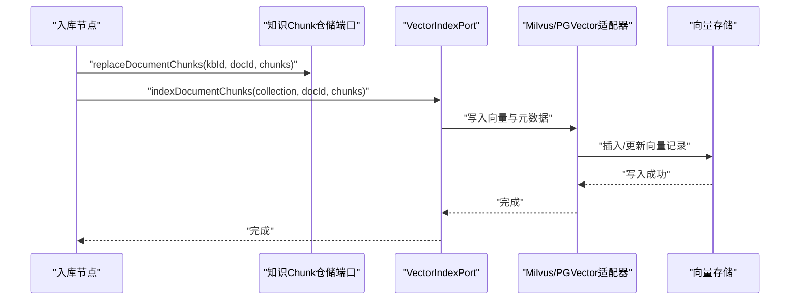
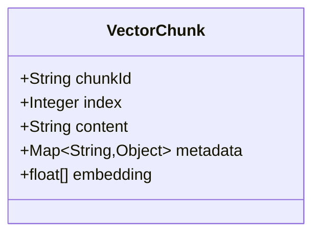
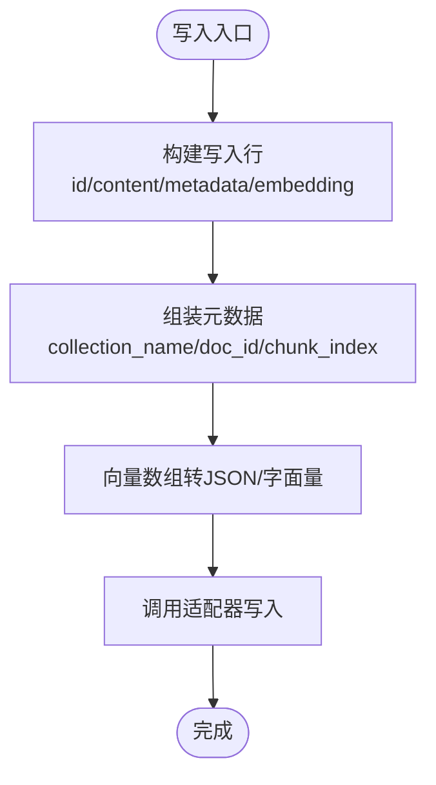
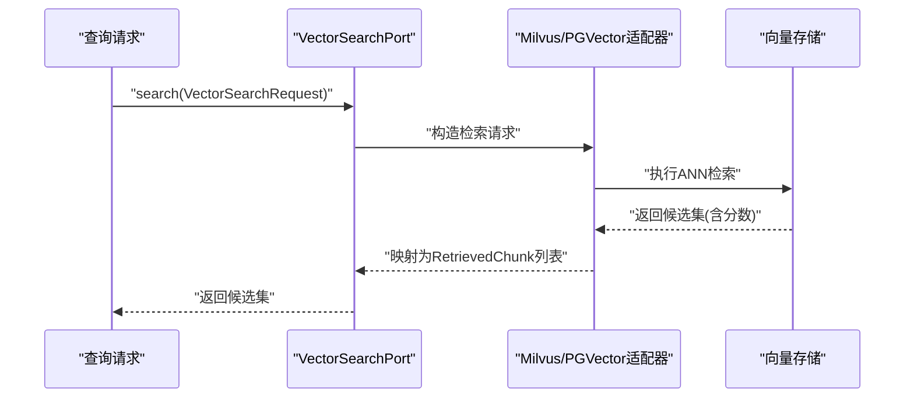
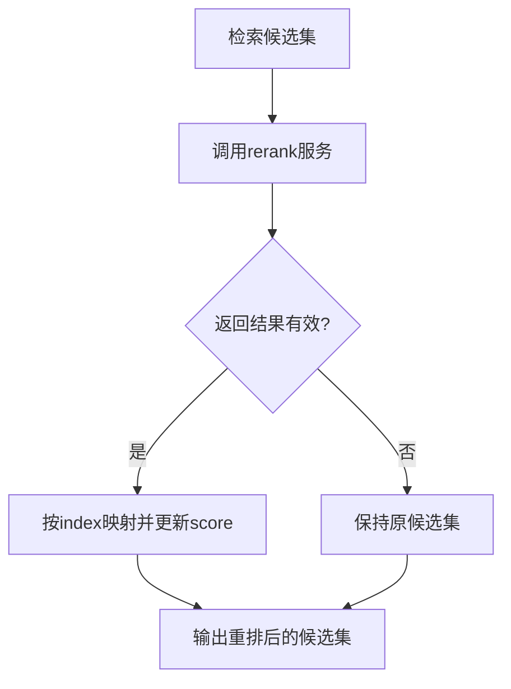
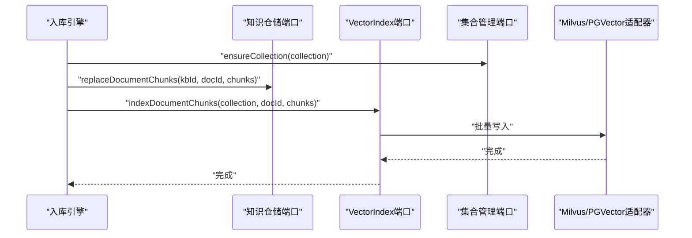
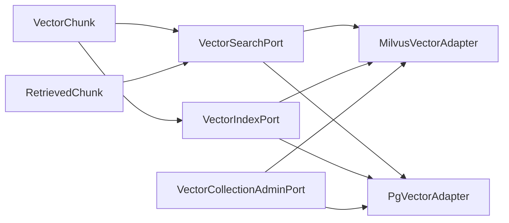

# 向量领域模型

<cite>
**本文引用的文件**
- [VectorChunk.java](file://seahorse-agent-kernel/src/main/java/com/miracle/ai/seahorse/agent/kernel/domain/vector/VectorChunk.java)
- [RetrievedChunk.java](file://seahorse-agent-kernel/src/main/java/com/miracle/ai/seahorse/agent/kernel/domain/retrieval/RetrievedChunk.java)
- [VectorSearchPort.java](file://seahorse-agent-kernel/src/main/java/com/miracle/ai/seahorse/agent/ports/outbound/vector/VectorSearchPort.java)
- [VectorIndexPort.java](file://seahorse-agent-kernel/src/main/java/com/miracle/ai/seahorse/agent/ports/outbound/vector/VectorIndexPort.java)
- [VectorCollectionAdminPort.java](file://seahorse-agent-kernel/src/main/java/com/miracle/ai/seahorse/agent/ports/outbound/vector/VectorCollectionAdminPort.java)
- [KnowledgeChunkRepositoryPort.java](file://seahorse-agent-kernel/src/main/java/com/miracle/ai/seahorse/agent/ports/outbound/knowledge/KnowledgeChunkRepositoryPort.java)
- [MilvusVectorAdapter.java](file://seahorse-agent-adapter-vector-milvus/src/main/java/com/miracle/ai/seahorse/agent/adapters/vector/milvus/MilvusVectorAdapter.java)
- [PgVectorAdapter.java](file://seahorse-agent-adapter-vector-pgvector/src/main/java/com/miracle/ai/seahorse/agent/adapters/vector/pgvector/PgVectorAdapter.java)
- [OpenAiCompatibleModelAdapter.java](file://seahorse-agent-adapter-ai-openai-compatible/src/main/java/com/miracle/ai/seahorse/agent/adapters/ai/openai/OpenAiCompatibleModelAdapter.java)
- [VectorGlobalSearchFeatureTests.java](file://seahorse-agent-tests/src/test/java/com/miracle/ai/seahorse/agent/kernel/feature/retrieval/VectorGlobalSearchFeatureTests.java)
- [IntentDirectedSearchFeatureTests.java](file://seahorse-agent-tests/src/test/java/com/miracle/ai/seahorse/agent/kernel/feature/retrieval/IntentDirectedSearchFeatureTests.java)
- [IndexerNodeFeatureTests.java](file://seahorse-agent-tests/src/test/java/com/miracle/ai/seahorse/agent/kernel/feature/ingestion/IndexerNodeFeatureTests.java)
</cite>

## 目录
1. [简介](#简介)
2. [项目结构](#项目结构)
3. [核心组件](#核心组件)
4. [架构总览](#架构总览)
5. [详细组件分析](#详细组件分析)
6. [依赖分析](#依赖分析)
7. [性能考虑](#性能考虑)
8. [故障排查指南](#故障排查指南)
9. [结论](#结论)
10. [附录](#附录)

## 简介
本技术文档聚焦于向量领域模型的设计与实现，围绕 VectorChunk 向量分块模型展开，系统阐述其数据结构、向量嵌入存储格式、相似度计算与检索优化策略，并说明该模型在 RAG（检索增强生成）系统中的核心作用以及与知识入库、检索、重排等组件的交互关系。文档同时给出基于真实源码的架构图、序列图与流程图，帮助读者从概念到实现全面理解。

## 项目结构
向量领域模型位于内核模块 kernel 中，通过一组端口接口抽象对外部向量库的依赖；适配器模块提供具体实现（如 Milvus、pgvector），并在测试用例中验证检索与入库行为。

图表来源
- [VectorChunk.java:35-62](file://seahorse-agent-kernel/src/main/java/com/miracle/ai/seahorse/agent/kernel/domain/vector/VectorChunk.java#L35-L62)
- [RetrievedChunk.java:34-50](file://seahorse-agent-kernel/src/main/java/com/miracle/ai/seahorse/agent/kernel/domain/retrieval/RetrievedChunk.java#L34-L50)
- [VectorSearchPort.java:30-38](file://seahorse-agent-kernel/src/main/java/com/miracle/ai/seahorse/agent/ports/outbound/vector/VectorSearchPort.java#L30-L38)
- [VectorIndexPort.java:30-72](file://seahorse-agent-kernel/src/main/java/com/miracle/ai/seahorse/agent/ports/outbound/vector/VectorIndexPort.java#L30-L72)
- [VectorCollectionAdminPort.java:25-40](file://seahorse-agent-kernel/src/main/java/com/miracle/ai/seahorse/agent/ports/outbound/vector/VectorCollectionAdminPort.java#L25-L40)
- [KnowledgeChunkRepositoryPort.java:31-40](file://seahorse-agent-kernel/src/main/java/com/miracle/ai/seahorse/agent/ports/outbound/knowledge/KnowledgeChunkRepositoryPort.java#L31-L40)
- [MilvusVectorAdapter.java:56-170](file://seahorse-agent-adapter-vector-milvus/src/main/java/com/miracle/ai/seahorse/agent/adapters/vector/milvus/MilvusVectorAdapter.java#L56-L170)
- [PgVectorAdapter.java:171-201](file://seahorse-agent-adapter-vector-pgvector/src/main/java/com/miracle/ai/seahorse/agent/adapters/vector/pgvector/PgVectorAdapter.java#L171-L201)
- [OpenAiCompatibleModelAdapter.java:293-321](file://seahorse-agent-adapter-ai-openai-compatible/src/main/java/com/miracle/ai/seahorse/agent/adapters/ai/openai/OpenAiCompatibleModelAdapter.java#L293-L321)

章节来源
- [VectorChunk.java:35-62](file://seahorse-agent-kernel/src/main/java/com/miracle/ai/seahorse/agent/kernel/domain/vector/VectorChunk.java#L35-L62)
- [VectorSearchPort.java:30-38](file://seahorse-agent-kernel/src/main/java/com/miracle/ai/seahorse/agent/ports/outbound/vector/VectorSearchPort.java#L30-L38)
- [VectorIndexPort.java:30-72](file://seahorse-agent-kernel/src/main/java/com/miracle/ai/seahorse/agent/ports/outbound/vector/VectorIndexPort.java#L30-L72)
- [VectorCollectionAdminPort.java:25-40](file://seahorse-agent-kernel/src/main/java/com/miracle/ai/seahorse/agent/ports/outbound/vector/VectorCollectionAdminPort.java#L25-L40)
- [KnowledgeChunkRepositoryPort.java:31-40](file://seahorse-agent-kernel/src/main/java/com/miracle/ai/seahorse/agent/ports/outbound/knowledge/KnowledgeChunkRepositoryPort.java#L31-L40)

## 核心组件
- VectorChunk：向量分块的核心领域模型，承载分块ID、顺序索引、文本内容、业务元数据以及对应的浮点向量。
- RetrievedChunk：检索返回的命中分片模型，包含命中ID、文本内容与得分。
- VectorSearchPort：向量检索端口，屏蔽底层向量库差异，统一检索入口。
- VectorIndexPort：向量索引写入端口，负责批量/单条/删除等索引操作。
- VectorCollectionAdminPort：集合管理端口，负责集合存在性检查与创建。
- KnowledgeChunkRepositoryPort：知识Chunk仓储端口，负责持久化分块元数据（非向量部分）。

章节来源
- [VectorChunk.java:35-62](file://seahorse-agent-kernel/src/main/java/com/miracle/ai/seahorse/agent/kernel/domain/vector/VectorChunk.java#L35-L62)
- [RetrievedChunk.java:34-50](file://seahorse-agent-kernel/src/main/java/com/miracle/ai/seahorse/agent/kernel/domain/retrieval/RetrievedChunk.java#L34-L50)
- [VectorSearchPort.java:30-38](file://seahorse-agent-kernel/src/main/java/com/miracle/ai/seahorse/agent/ports/outbound/vector/VectorSearchPort.java#L30-L38)
- [VectorIndexPort.java:30-72](file://seahorse-agent-kernel/src/main/java/com/miracle/ai/seahorse/agent/ports/outbound/vector/VectorIndexPort.java#L30-L72)
- [VectorCollectionAdminPort.java:25-40](file://seahorse-agent-kernel/src/main/java/com/miracle/ai/seahorse/agent/ports/outbound/vector/VectorCollectionAdminPort.java#L25-L40)
- [KnowledgeChunkRepositoryPort.java:31-40](file://seahorse-agent-kernel/src/main/java/com/miracle/ai/seahorse/agent/ports/outbound/knowledge/KnowledgeChunkRepositoryPort.java#L31-L40)

## 架构总览
向量领域模型通过端口接口解耦不同向量库实现，检索与入库分别由 VectorSearchPort 与 VectorIndexPort 驱动，集合管理由 VectorCollectionAdminPort 提供。知识Chunk的元数据持久化由 KnowledgeChunkRepositoryPort 负责，最终在 Milvus 或 pgvector 中以统一字段布局存储向量与元数据。

图表来源
- [KnowledgeChunkRepositoryPort.java:31-40](file://seahorse-agent-kernel/src/main/java/com/miracle/ai/seahorse/agent/ports/outbound/knowledge/KnowledgeChunkRepositoryPort.java#L31-L40)
- [VectorIndexPort.java:30-72](file://seahorse-agent-kernel/src/main/java/com/miracle/ai/seahorse/agent/ports/outbound/vector/VectorIndexPort.java#L30-L72)
- [MilvusVectorAdapter.java:92-103](file://seahorse-agent-adapter-vector-milvus/src/main/java/com/miracle/ai/seahorse/agent/adapters/vector/milvus/MilvusVectorAdapter.java#L92-L103)
- [PgVectorAdapter.java:188-195](file://seahorse-agent-adapter-vector-pgvector/src/main/java/com/miracle/ai/seahorse/agent/adapters/vector/pgvector/PgVectorAdapter.java#L188-L195)

## 详细组件分析

### VectorChunk 向量分块模型
- 数据结构要点
  - 分片唯一标识：chunkId，用于定位与删除。
  - 分片顺序：index，表示在原文档中的顺序位置。
  - 文本内容：content，作为检索与上下文拼接的基础。
  - 业务元数据：metadata，键值对形式，适配器会将其序列化后写入向量存储。
  - 向量：embedding，float[] 类型，作为相似度检索的载体。
- 设计意图
  - 统一的分块契约，便于在不同适配器间传递。
  - 将“文本+向量”与“元数据”分离，既满足检索也满足溯源与治理。

图表来源
- [VectorChunk.java:35-62](file://seahorse-agent-kernel/src/main/java/com/miracle/ai/seahorse/agent/kernel/domain/vector/VectorChunk.java#L35-L62)

章节来源
- [VectorChunk.java:35-62](file://seahorse-agent-kernel/src/main/java/com/miracle/ai/seahorse/agent/kernel/domain/vector/VectorChunk.java#L35-L62)

### 向量嵌入存储格式与字段布局
- Milvus 实现
  - 固定字段布局：id、content、metadata、embedding。
  - 元数据包含：collection_name、doc_id、chunk_index 等关键键。
  - 向量数组以 JSON 数组形式写入。
- pgvector 实现
  - 使用 PostgreSQL TEXT/JSONB 存储元数据，向量以自定义向量字面量形式写入。
  - 写入前进行维度校验与 topK 默认值处理。
- 字段与类型约束
  - id：主键，字符串，最大长度限制。
  - content：可变长文本，带最大长度限制。
  - metadata：JSON，包含业务键与系统保留键。
  - embedding：浮点向量，维度需与配置一致。

图表来源
- [MilvusVectorAdapter.java:233-257](file://seahorse-agent-adapter-vector-milvus/src/main/java/com/miracle/ai/seahorse/agent/adapters/vector/milvus/MilvusVectorAdapter.java#L233-L257)
- [PgVectorAdapter.java:197-201](file://seahorse-agent-adapter-vector-pgvector/src/main/java/com/miracle/ai/seahorse/agent/adapters/vector/pgvector/PgVectorAdapter.java#L197-L201)

章节来源
- [MilvusVectorAdapter.java:58-66](file://seahorse-agent-adapter-vector-milvus/src/main/java/com/miracle/ai/seahorse/agent/adapters/vector/milvus/MilvusVectorAdapter.java#L58-L66)
- [MilvusVectorAdapter.java:92-103](file://seahorse-agent-adapter-vector-milvus/src/main/java/com/miracle/ai/seahorse/agent/adapters/vector/milvus/MilvusVectorAdapter.java#L92-L103)
- [PgVectorAdapter.java:197-201](file://seahorse-agent-adapter-vector-pgvector/src/main/java/com/miracle/ai/seahorse/agent/adapters/vector/pgvector/PgVectorAdapter.java#L197-L201)
- [PgVectorAdapter.java:281-287](file://seahorse-agent-adapter-vector-pgvector/src/main/java/com/miracle/ai/seahorse/agent/adapters/vector/pgvector/PgVectorAdapter.java#L281-L287)

### 相似度计算与检索优化策略
- 相似度计算
  - 由底层向量库决定（Milvus 支持多种 metric_type，适配器通过 searchParams 传入）。
  - 检索结果包含分数，可用于后续重排或阈值过滤。
- 检索优化
  - topK 参数：默认值与上限控制，避免过大的返回集。
  - ef/索引参数：Milvus 侧通过 searchParams 传入 ef 等参数提升召回质量。
  - 多集合检索：全局检索与意图导向检索按集合与 topK 进行组合与裁剪。

图表来源
- [VectorSearchPort.java:30-38](file://seahorse-agent-kernel/src/main/java/com/miracle/ai/seahorse/agent/ports/outbound/vector/VectorSearchPort.java#L30-L38)
- [MilvusVectorAdapter.java:76-90](file://seahorse-agent-adapter-vector-milvus/src/main/java/com/miracle/ai/seahorse/agent/adapters/vector/milvus/MilvusVectorAdapter.java#L76-L90)
- [PgVectorAdapter.java:171-178](file://seahorse-agent-adapter-vector-pgvector/src/main/java/com/miracle/ai/seahorse/agent/adapters/vector/pgvector/PgVectorAdapter.java#L171-L178)

章节来源
- [MilvusVectorAdapter.java:172-181](file://seahorse-agent-adapter-vector-milvus/src/main/java/com/miracle/ai/seahorse/agent/adapters/vector/milvus/MilvusVectorAdapter.java#L172-L181)
- [PgVectorAdapter.java:312-314](file://seahorse-agent-adapter-vector-pgvector/src/main/java/com/miracle/ai/seahorse/agent/adapters/vector/pgvector/PgVectorAdapter.java#L312-L314)
- [VectorGlobalSearchFeatureTests.java:55-71](file://seahorse-agent-tests/src/test/java/com/miracle/ai/seahorse/agent/kernel/feature/retrieval/VectorGlobalSearchFeatureTests.java#L55-L71)
- [IntentDirectedSearchFeatureTests.java:55-92](file://seahorse-agent-tests/src/test/java/com/miracle/ai/seahorse/agent/kernel/feature/retrieval/IntentDirectedSearchFeatureTests.java#L55-L92)

### 重排与后处理
- 重排能力
  - 通过 OpenAI 兼容模型适配器对接 rerank 接口，按返回的 relevance_score 或 score 字段更新命中分值。
  - 保持原有顺序与长度，仅对有效索引进行重排。
- 与检索的协作
  - 检索先返回候选集，再由重排器进行二次排序，提高最终上下文质量。

图表来源
- [OpenAiCompatibleModelAdapter.java:299-321](file://seahorse-agent-adapter-ai-openai-compatible/src/main/java/com/miracle/ai/seahorse/agent/adapters/ai/openai/OpenAiCompatibleModelAdapter.java#L299-L321)

章节来源
- [OpenAiCompatibleModelAdapter.java:299-321](file://seahorse-agent-adapter-ai-openai-compatible/src/main/java/com/miracle/ai/seahorse/agent/adapters/ai/openai/OpenAiCompatibleModelAdapter.java#L299-L321)

### 入库与集合管理
- 集合管理
  - collectionExists/ensureCollection：确保集合存在并具备合适索引与一致性级别。
- 入库流程
  - replaceDocumentChunks：写入知识Chunk元数据。
  - indexDocumentChunks：批量写入向量索引。
  - 支持按文档或按ID进行更新与删除。

图表来源
- [VectorCollectionAdminPort.java:25-40](file://seahorse-agent-kernel/src/main/java/com/miracle/ai/seahorse/agent/ports/outbound/vector/VectorCollectionAdminPort.java#L25-L40)
- [KnowledgeChunkRepositoryPort.java:31-40](file://seahorse-agent-kernel/src/main/java/com/miracle/ai/seahorse/agent/ports/outbound/knowledge/KnowledgeChunkRepositoryPort.java#L31-L40)
- [VectorIndexPort.java:30-72](file://seahorse-agent-kernel/src/main/java/com/miracle/ai/seahorse/agent/ports/outbound/vector/VectorIndexPort.java#L30-L72)
- [IndexerNodeFeatureTests.java:115-171](file://seahorse-agent-tests/src/test/java/com/miracle/ai/seahorse/agent/kernel/feature/ingestion/IndexerNodeFeatureTests.java#L115-L171)

章节来源
- [MilvusVectorAdapter.java:148-170](file://seahorse-agent-adapter-vector-milvus/src/main/java/com/miracle/ai/seahorse/agent/adapters/vector/milvus/MilvusVectorAdapter.java#L148-L170)
- [PgVectorAdapter.java:188-195](file://seahorse-agent-adapter-vector-pgvector/src/main/java/com/miracle/ai/seahorse/agent/adapters/vector/pgvector/PgVectorAdapter.java#L188-L195)
- [IndexerNodeFeatureTests.java:115-171](file://seahorse-agent-tests/src/test/java/com/miracle/ai/seahorse/agent/kernel/feature/ingestion/IndexerNodeFeatureTests.java#L115-L171)

## 依赖分析
- 内聚与解耦
  - VectorChunk/RetrievedChunk 仅承载数据，不依赖具体实现，内聚高。
  - VectorSearchPort/VectorIndexPort/VectorCollectionAdminPort 将内核与外部SDK解耦。
- 外部依赖
  - Milvus 适配器依赖 MilvusClientV2，pgvector 适配器依赖 JDBC 与数据库连接。
- 端口契约
  - 检索与索引通过端口契约隔离，便于替换实现与配置驱动切换。

图表来源
- [VectorChunk.java:35-62](file://seahorse-agent-kernel/src/main/java/com/miracle/ai/seahorse/agent/kernel/domain/vector/VectorChunk.java#L35-L62)
- [RetrievedChunk.java:34-50](file://seahorse-agent-kernel/src/main/java/com/miracle/ai/seahorse/agent/kernel/domain/retrieval/RetrievedChunk.java#L34-L50)
- [VectorSearchPort.java:30-38](file://seahorse-agent-kernel/src/main/java/com/miracle/ai/seahorse/agent/ports/outbound/vector/VectorSearchPort.java#L30-L38)
- [VectorIndexPort.java:30-72](file://seahorse-agent-kernel/src/main/java/com/miracle/ai/seahorse/agent/ports/outbound/vector/VectorIndexPort.java#L30-L72)
- [VectorCollectionAdminPort.java:25-40](file://seahorse-agent-kernel/src/main/java/com/miracle/ai/seahorse/agent/ports/outbound/vector/VectorCollectionAdminPort.java#L25-L40)
- [MilvusVectorAdapter.java:56-170](file://seahorse-agent-adapter-vector-milvus/src/main/java/com/miracle/ai/seahorse/agent/adapters/vector/milvus/MilvusVectorAdapter.java#L56-L170)
- [PgVectorAdapter.java:171-201](file://seahorse-agent-adapter-vector-pgvector/src/main/java/com/miracle/ai/seahorse/agent/adapters/vector/pgvector/PgVectorAdapter.java#L171-L201)

章节来源
- [VectorSearchPort.java:24-29](file://seahorse-agent-kernel/src/main/java/com/miracle/ai/seahorse/agent/ports/outbound/vector/VectorSearchPort.java#L24-L29)
- [VectorIndexPort.java:24-29](file://seahorse-agent-kernel/src/main/java/com/miracle/ai/seahorse/agent/ports/outbound/vector/VectorIndexPort.java#L24-L29)
- [VectorCollectionAdminPort.java:20-24](file://seahorse-agent-kernel/src/main/java/com/miracle/ai/seahorse/agent/ports/outbound/vector/VectorCollectionAdminPort.java#L20-L24)

## 性能考虑
- 检索性能
  - 合理设置 topK，避免过大返回集导致上下文膨胀与延迟上升。
  - Milvus 侧 ef 参数影响召回质量与性能，需结合业务权衡。
- 写入性能
  - 批量写入优于单条写入，适配器内部以批量方式提交。
  - 元数据与向量分离存储，减少单条记录体积，提升写入吞吐。
- 存储与索引
  - 集合创建时指定合适的一致性级别与索引参数，平衡延迟与准确性。
  - 维度校验与字段长度限制有助于降低异常与存储浪费。

## 故障排查指南
- 常见问题与定位
  - 向量为空：检索端口在空向量时直接返回空结果，检查上游嵌入是否成功。
  - 维度不匹配：pgvector 写入前进行维度校验，若不一致需调整模型或配置。
  - 集合不存在：集合管理端口确保集合存在，若失败需检查权限与配置。
  - 删除异常：按文档删除与按ID删除的过滤条件不同，确认 docId 与 chunkId 正确。
- 测试参考
  - 全局检索与意图导向检索的测试覆盖了多集合与异常场景，可据此验证行为。

章节来源
- [MilvusVectorAdapter.java:76-81](file://seahorse-agent-adapter-vector-milvus/src/main/java/com/miracle/ai/seahorse/agent/adapters/vector/milvus/MilvusVectorAdapter.java#L76-L81)
- [PgVectorAdapter.java:281-287](file://seahorse-agent-adapter-vector-pgvector/src/main/java/com/miracle/ai/seahorse/agent/adapters/vector/pgvector/PgVectorAdapter.java#L281-L287)
- [VectorGlobalSearchFeatureTests.java:55-71](file://seahorse-agent-tests/src/test/java/com/miracle/ai/seahorse/agent/kernel/feature/retrieval/VectorGlobalSearchFeatureTests.java#L55-L71)
- [IntentDirectedSearchFeatureTests.java:74-92](file://seahorse-agent-tests/src/test/java/com/miracle/ai/seahorse/agent/kernel/feature/retrieval/IntentDirectedSearchFeatureTests.java#L74-L92)

## 结论
VectorChunk 作为向量领域模型的核心，通过清晰的数据结构与端口契约，实现了与 Milvus、pgvector 等向量库的解耦。结合检索、重排与入库流程，该模型在 RAG 系统中承担了“分块—向量化—检索—重排”的关键角色，既保证了跨实现的兼容性，也为性能优化与扩展提供了坚实基础。

## 附录
- 关键流程回顾
  - 入库：知识仓储写入元数据 → 向量索引批量写入 → 集合管理确保可用。
  - 检索：构造检索请求 → ANN 检索 → 映射为命中分片 → 可选重排。
  - 删除：按文档或按ID删除，注意过滤条件与字段命名。