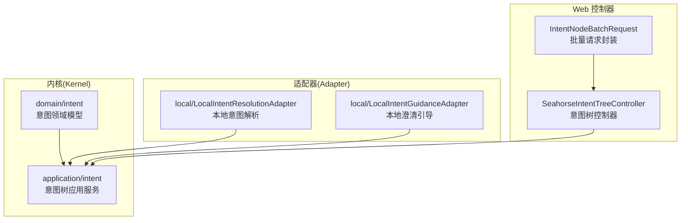
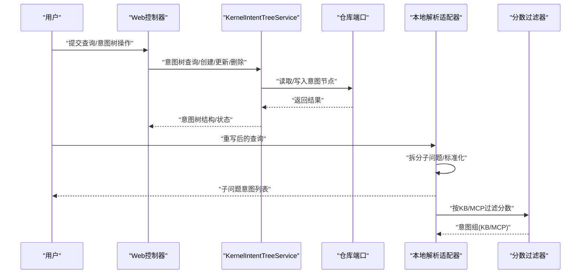
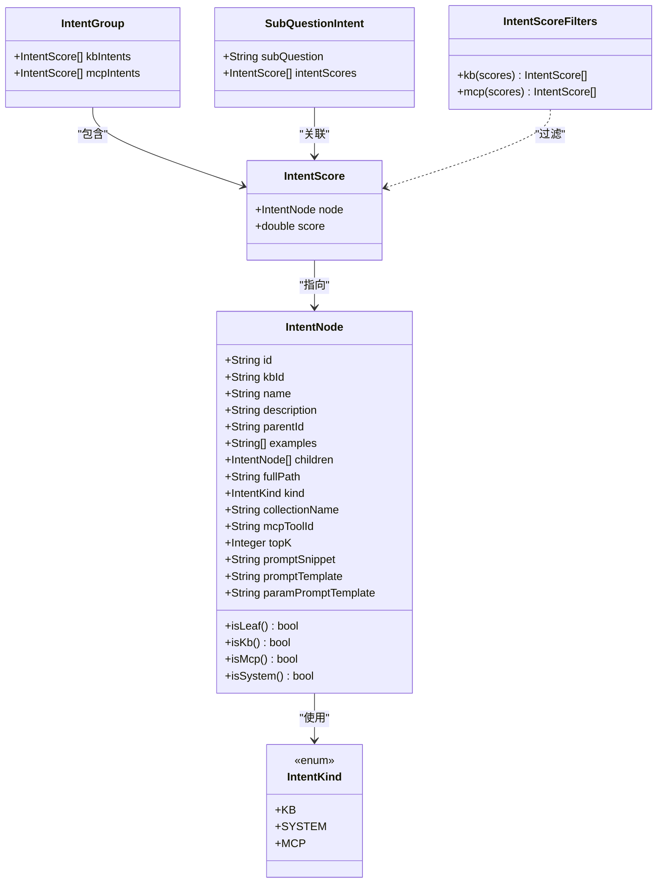
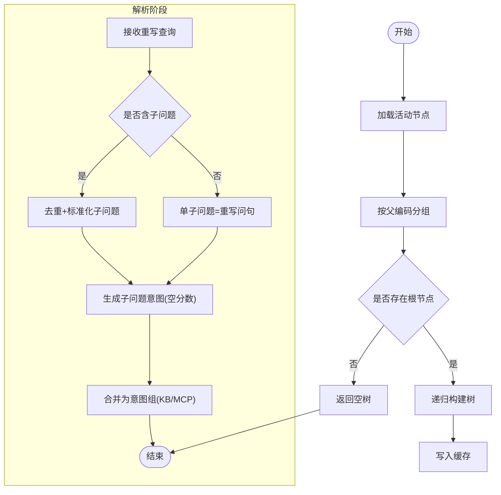
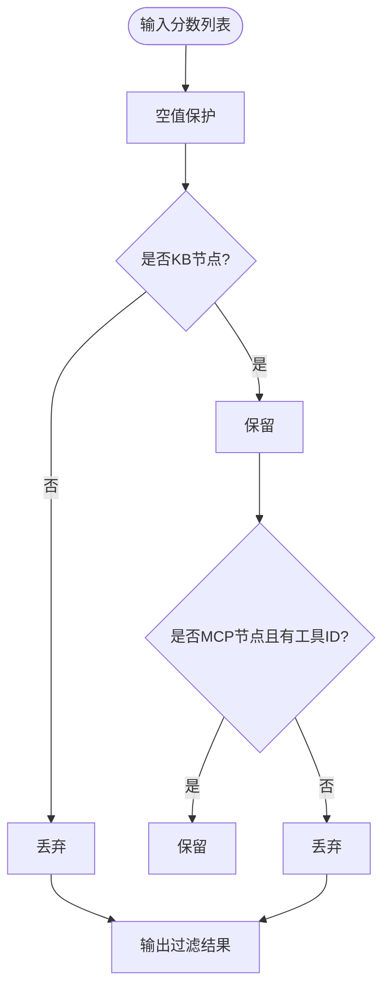
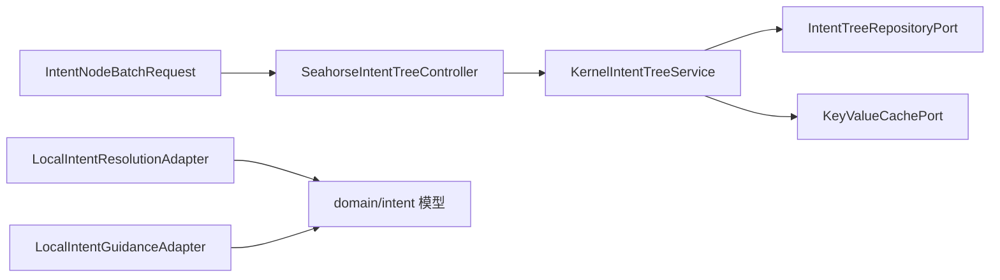

# 意图领域模型

<cite>
**本文引用的文件**
- [IntentGroup.java](file://seahorse-agent-kernel/src/main/java/com/miracle/ai/seahorse/agent/kernel/domain/intent/IntentGroup.java)
- [IntentKind.java](file://seahorse-agent-kernel/src/main/java/com/miracle/ai/seahorse/agent/kernel/domain/intent/IntentKind.java)
- [IntentNode.java](file://seahorse-agent-kernel/src/main/java/com/miracle/ai/seahorse/agent/kernel/domain/intent/IntentNode.java)
- [IntentScore.java](file://seahorse-agent-kernel/src/main/java/com/miracle/ai/seahorse/agent/kernel/domain/intent/IntentScore.java)
- [IntentScoreFilters.java](file://seahorse-agent-kernel/src/main/java/com/miracle/ai/seahorse/agent/kernel/domain/intent/IntentScoreFilters.java)
- [SubQuestionIntent.java](file://seahorse-agent-kernel/src/main/java/com/miracle/ai/seahorse/agent/kernel/domain/intent/SubQuestionIntent.java)
- [KernelIntentTreeService.java](file://seahorse-agent-kernel/src/main/java/com/miracle/ai/seahorse/agent/kernel/application/intent/KernelIntentTreeService.java)
- [IntentNodeTree.java](file://seahorse-agent-kernel/src/main/java/com/miracle/ai/seahorse/agent/ports/outbound/intent/IntentNodeTree.java)
- [IntentNodePayload.java](file://seahorse-agent-kernel/src/main/java/com/miracle/ai/seahorse/agent/ports/outbound/intent/IntentNodePayload.java)
- [LocalIntentResolutionAdapter.java](file://seahorse-agent-adapter-web/src/main/java/com/miracle/ai/seahorse/agent/adapters/local/LocalIntentResolutionAdapter.java)
- [LocalIntentGuidanceAdapter.java](file://seahorse-agent-adapter-web/src/main/java/com/miracle/ai/seahorse/agent/adapters/local/LocalIntentGuidanceAdapter.java)
- [SeahorseIntentTreeController.java](file://seahorse-agent-adapter-web/src/main/java/com/miracle/ai/seahorse/agent/adapters/web/SeahorseIntentTreeController.java)
- [IntentNodeBatchRequest.java](file://seahorse-agent-adapter-web/src/main/java/com/miracle/ai/seahorse/agent/adapters/web/IntentNodeBatchRequest.java)
</cite>

## 目录
1. [引言](#引言)
2. [项目结构](#项目结构)
3. [核心组件](#核心组件)
4. [架构总览](#架构总览)
5. [详细组件分析](#详细组件分析)
6. [依赖关系分析](#依赖关系分析)
7. [性能考量](#性能考量)
8. [故障排查指南](#故障排查指南)
9. [结论](#结论)
10. [附录](#附录)

## 引言
本文件围绕“意图领域模型”进行系统化技术说明，覆盖意图树的构建与解析机制、意图分类与分数计算、过滤规则以及子问题分解策略，并阐述该模型在查询理解与任务路由中的关键作用。目标读者既包括需要快速上手的工程师，也包括希望深入理解设计细节的架构师。

## 项目结构
意图领域模型主要分布在内核模块的 domain 层与应用层，配合适配器层提供本地解析与引导能力，并通过 Web 控制器暴露意图树的增删改查与批量操作接口。

图表来源
- [KernelIntentTreeService.java:1-231](file://seahorse-agent-kernel/src/main/java/com/miracle/ai/seahorse/agent/kernel/application/intent/KernelIntentTreeService.java#L1-L231)
- [LocalIntentResolutionAdapter.java:1-93](file://seahorse-agent-adapter-web/src/main/java/com/miracle/ai/seahorse/agent/adapters/local/LocalIntentResolutionAdapter.java#L1-L93)
- [LocalIntentGuidanceAdapter.java:1-38](file://seahorse-agent-adapter-web/src/main/java/com/miracle/ai/seahorse/agent/adapters/local/LocalIntentGuidanceAdapter.java#L1-L38)
- [SeahorseIntentTreeController.java](file://seahorse-agent-adapter-web/src/main/java/com/miracle/ai/seahorse/agent/adapters/web/SeahorseIntentTreeController.java)
- [IntentNodeBatchRequest.java](file://seahorse-agent-adapter-web/src/main/java/com/miracle/ai/seahorse/agent/adapters/web/IntentNodeBatchRequest.java)

章节来源
- [KernelIntentTreeService.java:1-231](file://seahorse-agent-kernel/src/main/java/com/miracle/ai/seahorse/agent/kernel/application/intent/KernelIntentTreeService.java#L1-L231)
- [LocalIntentResolutionAdapter.java:1-93](file://seahorse-agent-adapter-web/src/main/java/com/miracle/ai/seahorse/agent/adapters/local/LocalIntentResolutionAdapter.java#L1-L93)
- [LocalIntentGuidanceAdapter.java:1-38](file://seahorse-agent-adapter-web/src/main/java/com/miracle/ai/seahorse/agent/adapters/local/LocalIntentGuidanceAdapter.java#L1-L38)
- [SeahorseIntentTreeController.java](file://seahorse-agent-adapter-web/src/main/java/com/miracle/ai/seahorse/agent/adapters/web/SeahorseIntentTreeController.java)
- [IntentNodeBatchRequest.java](file://seahorse-agent-adapter-web/src/main/java/com/miracle/ai/seahorse/agent/adapters/web/IntentNodeBatchRequest.java)

## 核心组件
- 意图组 IntentGroup：按知识库(KB)与工具(MCP)维度对意图候选进行分组，便于后续路由与执行。
- 意图类型 IntentKind：定义意图的三类枚举（KB、SYSTEM、MCP），决定节点行为与处理路径。
- 意图节点 IntentNode：意图树的节点载体，包含层级、示例、提示词模板、向量检索参数等。
- 意图分数 IntentScore：记录节点与匹配分数的关联，用于排序与过滤。
- 分数过滤器 IntentScoreFilters：提供 KB/MCP 两类过滤方法，确保仅保留有效候选。
- 子问题意图 SubQuestionIntent：承载子问题及其对应的意图候选集合，支持多子问题并行处理。
- 意图树应用服务 KernelIntentTreeService：负责意图树的加载、校验、构建、缓存与批量操作。
- 意图树节点响应/载荷：IntentNodeTree 与 IntentNodePayload，分别对应读写场景的数据模型。

章节来源
- [IntentGroup.java:1-30](file://seahorse-agent-kernel/src/main/java/com/miracle/ai/seahorse/agent/kernel/domain/intent/IntentGroup.java#L1-L30)
- [IntentKind.java:1-40](file://seahorse-agent-kernel/src/main/java/com/miracle/ai/seahorse/agent/kernel/domain/intent/IntentKind.java#L1-L40)
- [IntentNode.java:1-83](file://seahorse-agent-kernel/src/main/java/com/miracle/ai/seahorse/agent/kernel/domain/intent/IntentNode.java#L1-L83)
- [IntentScore.java:1-38](file://seahorse-agent-kernel/src/main/java/com/miracle/ai/seahorse/agent/kernel/domain/intent/IntentScore.java#L1-L38)
- [IntentScoreFilters.java:1-51](file://seahorse-agent-kernel/src/main/java/com/miracle/ai/seahorse/agent/kernel/domain/intent/IntentScoreFilters.java#L1-L51)
- [SubQuestionIntent.java:1-30](file://seahorse-agent-kernel/src/main/java/com/miracle/ai/seahorse/agent/kernel/domain/intent/SubQuestionIntent.java#L1-L30)
- [KernelIntentTreeService.java:1-231](file://seahorse-agent-kernel/src/main/java/com/miracle/ai/seahorse/agent/kernel/application/intent/KernelIntentTreeService.java#L1-L231)
- [IntentNodeTree.java:1-182](file://seahorse-agent-kernel/src/main/java/com/miracle/ai/seahorse/agent/ports/outbound/intent/IntentNodeTree.java#L1-L182)
- [IntentNodePayload.java:1-172](file://seahorse-agent-kernel/src/main/java/com/miracle/ai/seahorse/agent/ports/outbound/intent/IntentNodePayload.java#L1-L172)

## 架构总览
意图领域模型贯穿“查询理解—意图解析—任务路由”的主干链路。查询经重写后拆分为若干子问题；若存在意图树，则对每个子问题进行意图匹配并打分；随后根据分数与过滤规则生成 KB/MCP 两类意图组，驱动后续检索或工具调用；若无意图树或无法识别，则退化到全局向量检索通道，保证主链路不中断。

图表来源
- [KernelIntentTreeService.java:56-134](file://seahorse-agent-kernel/src/main/java/com/miracle/ai/seahorse/agent/kernel/application/intent/KernelIntentTreeService.java#L56-L134)
- [LocalIntentResolutionAdapter.java:40-54](file://seahorse-agent-adapter-web/src/main/java/com/miracle/ai/seahorse/agent/adapters/local/LocalIntentResolutionAdapter.java#L40-L54)
- [IntentScoreFilters.java:30-42](file://seahorse-agent-kernel/src/main/java/com/miracle/ai/seahorse/agent/kernel/domain/intent/IntentScoreFilters.java#L30-L42)

## 详细组件分析

### 类型与数据模型

图表来源
- [IntentKind.java:23-39](file://seahorse-agent-kernel/src/main/java/com/miracle/ai/seahorse/agent/kernel/domain/intent/IntentKind.java#L23-L39)
- [IntentNode.java:31-82](file://seahorse-agent-kernel/src/main/java/com/miracle/ai/seahorse/agent/kernel/domain/intent/IntentNode.java#L31-L82)
- [IntentScore.java:32-37](file://seahorse-agent-kernel/src/main/java/com/miracle/ai/seahorse/agent/kernel/domain/intent/IntentScore.java#L32-L37)
- [IntentGroup.java:28](file://seahorse-agent-kernel/src/main/java/com/miracle/ai/seahorse/agent/kernel/domain/intent/IntentGroup.java#L28)
- [SubQuestionIntent.java:28](file://seahorse-agent-kernel/src/main/java/com/miracle/ai/seahorse/agent/kernel/domain/intent/SubQuestionIntent.java#L28)
- [IntentScoreFilters.java:25-50](file://seahorse-agent-kernel/src/main/java/com/miracle/ai/seahorse/agent/kernel/domain/intent/IntentScoreFilters.java#L25-L50)

章节来源
- [IntentKind.java:1-40](file://seahorse-agent-kernel/src/main/java/com/miracle/ai/seahorse/agent/kernel/domain/intent/IntentKind.java#L1-L40)
- [IntentNode.java:1-83](file://seahorse-agent-kernel/src/main/java/com/miracle/ai/seahorse/agent/kernel/domain/intent/IntentNode.java#L1-L83)
- [IntentScore.java:1-38](file://seahorse-agent-kernel/src/main/java/com/miracle/ai/seahorse/agent/kernel/domain/intent/IntentScore.java#L1-L38)
- [IntentGroup.java:1-30](file://seahorse-agent-kernel/src/main/java/com/miracle/ai/seahorse/agent/kernel/domain/intent/IntentGroup.java#L1-L30)
- [SubQuestionIntent.java:1-30](file://seahorse-agent-kernel/src/main/java/com/miracle/ai/seahorse/agent/kernel/domain/intent/SubQuestionIntent.java#L1-L30)
- [IntentScoreFilters.java:1-51](file://seahorse-agent-kernel/src/main/java/com/miracle/ai/seahorse/agent/kernel/domain/intent/IntentScoreFilters.java#L1-L51)

### 意图树构建与解析机制
- 构建流程：服务从仓库端口拉取所有活动节点，基于父子编码建立子节点映射，以 ROOT 为根递归组装树结构；同时维护缓存键并在变更后清理缓存。
- 解析流程：本地解析适配器接收重写后的查询，若无子问题则将重写问句作为唯一子问题；若有多个子问题则去重与标准化后生成子问题意图；当无匹配分数时，退化为可检索输入，避免主链路中断。
- 过滤与合并：将子问题意图的分数集合统一提取，按 KB/MCP 过滤后合并为意图组，供后续检索或工具调用使用。

图表来源
- [KernelIntentTreeService.java:56-63](file://seahorse-agent-kernel/src/main/java/com/miracle/ai/seahorse/agent/kernel/application/intent/KernelIntentTreeService.java#L56-L63)
- [KernelIntentTreeService.java:178-187](file://seahorse-agent-kernel/src/main/java/com/miracle/ai/seahorse/agent/kernel/application/intent/KernelIntentTreeService.java#L178-L187)
- [LocalIntentResolutionAdapter.java:40-54](file://seahorse-agent-adapter-web/src/main/java/com/miracle/ai/seahorse/agent/adapters/local/LocalIntentResolutionAdapter.java#L40-L54)
- [LocalIntentResolutionAdapter.java:69-79](file://seahorse-agent-adapter-web/src/main/java/com/miracle/ai/seahorse/agent/adapters/local/LocalIntentResolutionAdapter.java#L69-L79)

章节来源
- [KernelIntentTreeService.java:1-231](file://seahorse-agent-kernel/src/main/java/com/miracle/ai/seahorse/agent/kernel/application/intent/KernelIntentTreeService.java#L1-L231)
- [LocalIntentResolutionAdapter.java:1-93](file://seahorse-agent-adapter-web/src/main/java/com/miracle/ai/seahorse/agent/adapters/local/LocalIntentResolutionAdapter.java#L1-L93)

### 分数计算与过滤规则
- 分数来源：由上游意图匹配模块产出，记录于 IntentScore 中；若无匹配结果，子问题意图的分数列表为空，解析器将其视为可检索输入。
- 过滤规则：
  - KB 过滤：仅保留节点类型为 KB 且节点非空的条目。
  - MCP 过滤：在 KB 过滤基础上，进一步要求节点具备有效的 MCP 工具标识（非空）。
- 合并策略：将所有子问题的意图分数合并后，分别执行 KB/MCP 过滤，形成最终意图组。

图表来源
- [IntentScoreFilters.java:30-42](file://seahorse-agent-kernel/src/main/java/com/miracle/ai/seahorse/agent/kernel/domain/intent/IntentScoreFilters.java#L30-L42)

章节来源
- [IntentScoreFilters.java:1-51](file://seahorse-agent-kernel/src/main/java/com/miracle/ai/seahorse/agent/kernel/domain/intent/IntentScoreFilters.java#L1-L51)

### 子问题分解策略
- 当重写结果不含子问题时，采用重写后的完整问句作为单一子问题，保证至少有一个意图候选。
- 当存在多个子问题时，先进行空白与重复去除，再逐一标准化，最后生成对应的子问题意图对象。
- 若上游未给出分数，解析器仍会产出可检索输入，确保检索链路可用。

章节来源
- [LocalIntentResolutionAdapter.java:40-54](file://seahorse-agent-adapter-web/src/main/java/com/miracle/ai/seahorse/agent/adapters/local/LocalIntentResolutionAdapter.java#L40-L54)
- [LocalIntentResolutionAdapter.java:81-87](file://seahorse-agent-adapter-web/src/main/java/com/miracle/ai/seahorse/agent/adapters/local/LocalIntentResolutionAdapter.java#L81-L87)

### 查询理解与任务路由中的作用
- 查询理解：通过子问题拆分与标准化，降低歧义性；结合意图树与分数，提升语义对齐质量。
- 任务路由：依据意图组（KB/MCP）选择不同执行路径；KB 路径通常导向知识检索，MCP 路径导向外部工具调用。
- 容错与降级：当无意图树或无法识别时，解析器自动退化为可检索输入，避免主链路中断。

章节来源
- [LocalIntentResolutionAdapter.java:31-36](file://seahorse-agent-adapter-web/src/main/java/com/miracle/ai/seahorse/agent/adapters/local/LocalIntentResolutionAdapter.java#L31-L36)
- [LocalIntentResolutionAdapter.java:69-79](file://seahorse-agent-adapter-web/src/main/java/com/miracle/ai/seahorse/agent/adapters/local/LocalIntentResolutionAdapter.java#L69-L79)

## 依赖关系分析
- KernelIntentTreeService 依赖仓库端口与缓存端口，负责意图树的持久化与缓存一致性。
- 本地解析适配器与本地引导适配器通过端口对接内核域模型，提供默认实现并可被替换。
- Web 控制器与批量请求封装面向前端，调用应用服务完成意图树的管理操作。

图表来源
- [KernelIntentTreeService.java:48-54](file://seahorse-agent-kernel/src/main/java/com/miracle/ai/seahorse/agent/kernel/application/intent/KernelIntentTreeService.java#L48-L54)
- [LocalIntentResolutionAdapter.java:20-26](file://seahorse-agent-adapter-web/src/main/java/com/miracle/ai/seahorse/agent/adapters/local/LocalIntentResolutionAdapter.java#L20-L26)
- [LocalIntentGuidanceAdapter.java:20-22](file://seahorse-agent-adapter-web/src/main/java/com/miracle/ai/seahorse/agent/adapters/local/LocalIntentGuidanceAdapter.java#L20-L22)
- [SeahorseIntentTreeController.java](file://seahorse-agent-adapter-web/src/main/java/com/miracle/ai/seahorse/agent/adapters/web/SeahorseIntentTreeController.java)
- [IntentNodeBatchRequest.java](file://seahorse-agent-adapter-web/src/main/java/com/miracle/ai/seahorse/agent/adapters/web/IntentNodeBatchRequest.java)

章节来源
- [KernelIntentTreeService.java:1-231](file://seahorse-agent-kernel/src/main/java/com/miracle/ai/seahorse/agent/kernel/application/intent/KernelIntentTreeService.java#L1-L231)
- [LocalIntentResolutionAdapter.java:1-93](file://seahorse-agent-adapter-web/src/main/java/com/miracle/ai/seahorse/agent/adapters/local/LocalIntentResolutionAdapter.java#L1-L93)
- [LocalIntentGuidanceAdapter.java:1-38](file://seahorse-agent-adapter-web/src/main/java/com/miracle/ai/seahorse/agent/adapters/local/LocalIntentGuidanceAdapter.java#L1-L38)
- [SeahorseIntentTreeController.java](file://seahorse-agent-adapter-web/src/main/java/com/miracle/ai/seahorse/agent/adapters/web/SeahorseIntentTreeController.java)
- [IntentNodeBatchRequest.java](file://seahorse-agent-adapter-web/src/main/java/com/miracle/ai/seahorse/agent/adapters/web/IntentNodeBatchRequest.java)

## 性能考量
- 缓存策略：意图树在变更后主动清理缓存键，避免陈旧数据影响查询性能；建议在高并发场景下配合合适的缓存过期策略。
- 构建复杂度：意图树构建涉及一次全量节点扫描与一次递归遍历，时间复杂度近似 O(N)，空间复杂度与树深度相关。
- 过滤成本：分数过滤为线性扫描，建议在上游控制分数数量，避免不必要的过滤开销。
- 解析降级：无意图树时的可检索输入路径可显著降低解析成本，但需确保检索后处理逻辑高效。

## 故障排查指南
- 意图树节点启用/禁用/删除校验失败：检查父节点与子节点的启用状态关系，确保在禁用/删除前已正确选择/取消选择后代节点。
- TOPIC 级别 KB 节点缺少知识库绑定：创建时若级别为主题且类型为 KB，必须提供有效的知识库标识。
- 批量操作 ID 规范化错误：确认传入 ID 非空、去空白、去重复，避免因格式问题导致操作失败。
- 无意图树时解析异常：确认本地解析适配器的降级逻辑生效，子问题意图的分数列表为空时应生成可检索输入。

章节来源
- [KernelIntentTreeService.java:100-117](file://seahorse-agent-kernel/src/main/java/com/miracle/ai/seahorse/agent/kernel/application/intent/KernelIntentTreeService.java#L100-L117)
- [KernelIntentTreeService.java:136-147](file://seahorse-agent-kernel/src/main/java/com/miracle/ai/seahorse/agent/kernel/application/intent/KernelIntentTreeService.java#L136-L147)
- [KernelIntentTreeService.java:163-176](file://seahorse-agent-kernel/src/main/java/com/miracle/ai/seahorse/agent/kernel/application/intent/KernelIntentTreeService.java#L163-L176)
- [LocalIntentResolutionAdapter.java:31-36](file://seahorse-agent-adapter-web/src/main/java/com/miracle/ai/seahorse/agent/adapters/local/LocalIntentResolutionAdapter.java#L31-L36)

## 结论
意图领域模型通过清晰的类型与数据结构、稳健的意图树构建与解析流程、严格的过滤与合并策略，实现了从查询理解到任务路由的可靠衔接。其默认的降级与容错设计确保了在无意图树场景下的可用性，同时为后续扩展（如歧义检测、自定义解析器）提供了良好的接口边界。

## 附录
- 关键端口与控制器
  - Kernel 层入口：KernelIntentTreeService
  - Web 控制器：SeahorseIntentTreeController
  - 批量请求封装：IntentNodeBatchRequest
- 数据模型映射
  - IntentNodeTree：对外响应模型
  - IntentNodePayload：对外写入载荷

章节来源
- [KernelIntentTreeService.java:1-231](file://seahorse-agent-kernel/src/main/java/com/miracle/ai/seahorse/agent/kernel/application/intent/KernelIntentTreeService.java#L1-L231)
- [SeahorseIntentTreeController.java](file://seahorse-agent-adapter-web/src/main/java/com/miracle/ai/seahorse/agent/adapters/web/SeahorseIntentTreeController.java)
- [IntentNodeBatchRequest.java](file://seahorse-agent-adapter-web/src/main/java/com/miracle/ai/seahorse/agent/adapters/web/IntentNodeBatchRequest.java)
- [IntentNodeTree.java:1-182](file://seahorse-agent-kernel/src/main/java/com/miracle/ai/seahorse/agent/ports/outbound/intent/IntentNodeTree.java#L1-L182)
- [IntentNodePayload.java:1-172](file://seahorse-agent-kernel/src/main/java/com/miracle/ai/seahorse/agent/ports/outbound/intent/IntentNodePayload.java#L1-L172)